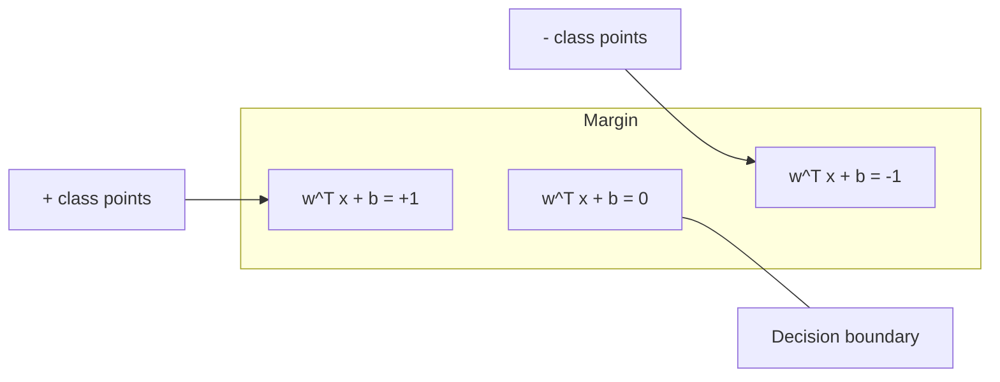
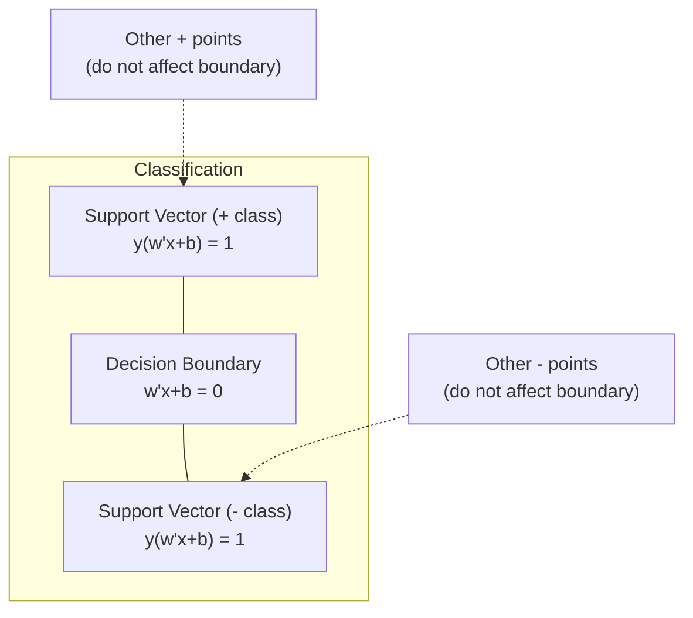
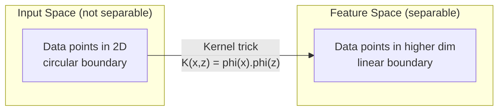

# Máquinas de apoio de vetores

> Encontrar a rua mais larga entre duas classes.

**Type:** Build
**Language:**Python
**Prerequisites:** Phase 1 (Lessons 08 Optimization, 14 Norms and Distances, 18 Convex Optimization)
**Time:** ~90 minutes

## Objetivos de aprendizagem

- Implementar um SVM linear a partir do zero usando perda de biscoitos e descida de gradiente na formulação primária
- Explicar o princípio da margem máxima e identificar vetores de apoio de um modelo treinado
- Comparar kernels lineares, polinômios e RBF e explicar como o truque do kernel evita mapeamento explícito em alta dimensão
- Avaliação da compensação controlada pelo parâmetro C entre largura de margem e erros de classificação

## O problema

Você tem duas classes de pontos de dados e precisa desenhar uma linha (ou hiperplano) separando-os. infinitamente muitas linhas poderiam funcionar. Qual você deve escolher?

A margem é a distância entre o limite de decisão e os pontos de dados mais próximos em cada lado. Uma margem mais ampla significa que o classificador é mais confiante e generaliza melhor os dados invisíveis.

Esta intuição leva a Support Vector Machines, um dos algoritmos mais matematicamente elegantes do ML. Os SVM eram o método de classificação dominante antes da aprendizagem profunda e continuam sendo a melhor escolha para pequenos conjuntos de dados, dados de alta dimensão e problemas em que você precisa de um modelo de princípios bem compreendido com garantias teóricas.

Os SVM se conectam diretamente à Fase 1: a otimização é convexa (Lessão 18), a margem é medida com normas (Lessão 14), e o truque do kernel explora produtos de pontos para lidar com fronteiras não lineares sem nunca computação no espaço de alta dimensão.

## O conceito

### Classificador de margem máxima

Dados dados linearmente separaveis com rótulos y_i em {-1, +1} e vetores de características x_i, queremos um hiperplano w^T x + b = 0 que separa as classes.

A distância de um ponto x_i para o hiperplano é:

```
distance = |w^T x_i + b| / ||w||
```

Para um ponto corretamente classificado: y_i * (w^T x_i + b) > 0. A margem é o dobro da distância do hiperplano ao ponto mais próximo de ambos os lados.



O problema da otimização:

```
maximize    2 / ||w||     (the margin width)
subject to  y_i * (w^T x_i + b) >= 1  for all i
```

Igualmente (a minimizar o desempenho é mais fácil de otimizar):

```
minimize    (1/2) ||w||^2
subject to  y_i * (w^T x_i + b) >= 1  for all i
```

Este é um programa quadrático convexo. Ele tem uma solução global única. Os pontos de dados que estão exatamente nos limites da margem (onde y_i * (w^T x_i + b) = 1) são os vetores de suporte. Eles são os únicos pontos que determinam o limite de decisão. Mover ou remover qualquer ponto não-suporte-vetor, e o limite não muda.

### Vectores de apoio: os poucos críticos



A maioria dos pontos de treinamento são irrelevantes. Somente os vetores de suporte são importantes. É por isso que os SVM são eficientes na memória no tempo de previsão: você só precisa armazenar os vetores de suporte, não todo o conjunto de treinamento.

O número de vetores de suporte também dá um limite no erro de generalização.

### Margem suave: ruído de manipulação com o parâmetro C

Os dados reais raramente são perfeitamente separaveis. Alguns pontos podem estar no lado errado da fronteira, ou dentro da margem. A formulação de margem macia permite violações introduzindo variáveis de folga.

```
minimize    (1/2) ||w||^2 + C * sum(xi_i)
subject to  y_i * (w^T x_i + b) >= 1 - xi_i
            xi_i >= 0  for all i
```

A variável de flexibilidade xi_i mede a quantidade de violação do ponto i da margem.

| C value | Behavior |
|---------|----------|
| Large C | Penalizes violations heavily. Narrow margin, fewer misclassifications. Overfits |
| Small C | Allows more violations. Wide margin, more misclassifications. Underfits |

C é a força de regularização, invertida. C maior = menos regularização. C menor = mais regularização.

### Perda de barriga: função de perda de SVM

O SVM de margem suave pode ser reescriturado como uma otimização sem restrições:

```
minimize    (1/2) ||w||^2 + C * sum(max(0, 1 - y_i * (w^T x_i + b)))
```

O termo max(0, 1 - y_i * f(x_i)) é a perda de biscoito. É zero quando o ponto é corretamente classificado e além da margem. É linear quando o ponto está dentro da margem ou classificado erroneamente.

```
Hinge loss for a single point:

loss
  |
  | \
  |  \
  |   \
  |    \
  |     \_______________
  |
  +-----|-----|-------->  y * f(x)
       0     1

Zero loss when y*f(x) >= 1 (correctly classified, outside margin).
Linear penalty when y*f(x) < 1.
```

Comparar com a perda logística (regressão logística):

```
Hinge:     max(0, 1 - y*f(x))          Hard cutoff at margin
Logistic:  log(1 + exp(-y*f(x)))        Smooth, never exactly zero
```

A perda de engarrafamento produz soluções escassas (apenas os vetores de suporte têm contribuição não zero). A perda logística usa todos os pontos de dados.

### Treinamento de um SVM linear com descida de gradiente

Você pode treinar um SVM linear usando descida de gradiente na perda de cartilagem mais regularização L2, sem resolver o QP restrito:

```
L(w, b) = (lambda/2) * ||w||^2 + (1/n) * sum(max(0, 1 - y_i * (w^T x_i + b)))

Gradient with respect to w:
  If y_i * (w^T x_i + b) >= 1:  dL/dw = lambda * w
  If y_i * (w^T x_i + b) < 1:   dL/dw = lambda * w - y_i * x_i

Gradient with respect to b:
  If y_i * (w^T x_i + b) >= 1:  dL/db = 0
  If y_i * (w^T x_i + b) < 1:   dL/db = -y_i
```

Esta é chamada de formulação primária. Ela é executada em O ((n * d) por época, onde n é o número de amostras e d é o número de características. Para dados grandes, escassos e de alta dimensão (classificação de texto), isso é rápido.

### A dupla formulação e o truque do núcleo

O duplo Lagrangiano do problema SVM (a partir da lição de fase 1, condições KKT) é:

```
maximize    sum(alpha_i) - (1/2) * sum_ij(alpha_i * alpha_j * y_i * y_j * (x_i . x_j))
subject to  0 <= alpha_i <= C
            sum(alpha_i * y_i) = 0
```

O dual envolve apenas produtos de pontos x_i. x_j entre pontos de dados. Esta é a visão chave. Substitua cada produto de pontos com uma função do kernel K(x_i, x_j) e o SVM pode aprender limites não lineares sem nunca calcular explicitamente a transformação.

```
Linear kernel:      K(x, z) = x . z
Polynomial kernel:  K(x, z) = (x . z + c)^d
RBF (Gaussian):     K(x, z) = exp(-gamma * ||x - z||^2)
```

O kernel RBF mapeia dados em um espaço de dimensões infinitas. Os pontos que estão próximos no espaço de entrada têm valor do kernel perto de 1.



O truque do kernel calcula o produto de pontos no espaço de alta dimensão sem nunca ir lá. Para o kernel polinômico de grau d em dimensões D, o espaço de características explícito tem dimensões O(D^d. Mas K(x, z) é calculado em tempo O(D).

### MPS para regressão (MPS)

O VECTOR DE SUPPORT regressão encaixa um tubo de largura epsilon em torno dos dados. Os pontos dentro do tubo têm perda zero. Os pontos fora do tubo são penalizados linearmente.

```
minimize    (1/2) ||w||^2 + C * sum(xi_i + xi_i*)
subject to  y_i - (w^T x_i + b) <= epsilon + xi_i
            (w^T x_i + b) - y_i <= epsilon + xi_i*
            xi_i, xi_i* >= 0
```

O parâmetro epsilon controla a largura do tubo. tubo mais amplo = menos vetores de apoio = ajuste mais liso. tubo mais estreito = mais vetores de apoio = ajuste mais apertado.

### Por que os SVM perderam para a aprendizagem profunda (e quando ainda ganham)

Os SVM dominaram a ML desde o final dos anos 1990 até o início dos anos 2010.

| Factor | SVMs | Deep learning |
|--------|------|---------------|
| Feature engineering | Requires it | Learns features |
| Scalability | O(n^2) to O(n^3) for kernel | O(n) per epoch with SGD |
| Image/text/audio | Needs handcrafted features | Learns from raw data |
| Large datasets (>100k) | Slow | Scales well |
| GPU acceleration | Limited benefit | Massive speedup |

Os SVM ainda ganham nestas situações:
- Pequenas datas (centenas a milhares de amostras)
- Dados escassos de alta dimensão (texto com características TF-IDF)
- Quando precise de garantias matemáticas (limite de margem)
- Quando o tempo de formação deve ser mínimo (o SVM linear é muito rápido)
- Classificação binária com estrutura de margem clara
- Detecção de anomalias (SVM de uma classe)

```figure
svm-margin
```

## Construí-lo

### Passo 1: perda de barras e gradiente

Calcule a perda de biscoitos para um lote e a sua gradiência.

```python
def hinge_loss(X, y, w, b):
    n = len(X)
    total_loss = 0.0
    for i in range(n):
        margin = y[i] * (dot(w, X[i]) + b)
        total_loss += max(0.0, 1.0 - margin)
    return total_loss / n
```

### Passo 2: SVM linear através da descida de gradiente

Treinar minimizando a perda de biscoitos regulares.

```python
class LinearSVM:
    def __init__(self, lr=0.001, lambda_param=0.01, n_epochs=1000):
        self.lr = lr
        self.lambda_param = lambda_param
        self.n_epochs = n_epochs
        self.w = None
        self.b = 0.0

    def fit(self, X, y):
        n_features = len(X[0])
        self.w = [0.0] * n_features
        self.b = 0.0

        for epoch in range(self.n_epochs):
            for i in range(len(X)):
                margin = y[i] * (dot(self.w, X[i]) + self.b)
                if margin >= 1:
                    self.w = [wj - self.lr * self.lambda_param * wj
                              for wj in self.w]
                else:
                    self.w = [wj - self.lr * (self.lambda_param * wj - y[i] * X[i][j])
                              for j, wj in enumerate(self.w)]
                    self.b -= self.lr * (-y[i])

    def predict(self, X):
        return [1 if dot(self.w, x) + self.b >= 0 else -1 for x in X]
```

### Passo 3: Funções do núcleo

Implementar núcleos lineares, polinômios e RBF.

```python
def linear_kernel(x, z):
    return dot(x, z)

def polynomial_kernel(x, z, degree=3, c=1.0):
    return (dot(x, z) + c) ** degree

def rbf_kernel(x, z, gamma=0.5):
    diff = [xi - zi for xi, zi in zip(x, z)]
    return math.exp(-gamma * dot(diff, diff))
```

### Passo 4: Identificação de margens e vetores de apoio

Após o treino, identifique quais pontos são vetores de apoio e calcule a largura da margem.

```python
def find_support_vectors(X, y, w, b, tol=1e-3):
    support_vectors = []
    for i in range(len(X)):
        margin = y[i] * (dot(w, X[i]) + b)
        if abs(margin - 1.0) < tol:
            support_vectors.append(i)
    return support_vectors
```

Veja .`code/svm.py`para a implementação completa com todas as demonstrações.

## Usá-lo

Com a aprendizagem de escikit:

```python
from sklearn.svm import SVC, LinearSVC, SVR
from sklearn.preprocessing import StandardScaler
from sklearn.pipeline import Pipeline

clf = Pipeline([
    ("scaler", StandardScaler()),
    ("svm", SVC(kernel="rbf", C=1.0, gamma="scale")),
])
clf.fit(X_train, y_train)
print(f"Accuracy: {clf.score(X_test, y_test):.4f}")
print(f"Support vectors: {clf['svm'].n_support_}")
```

Importante: sempre escalar as suas características antes de treinar um SVM. Os SVM são sensíveis às magnitudes das características porque a margem depende de que as características não escaladas distorçam a geometria.

Para grandes conjuntos de dados, use `LinearSVC`(formulação primária, O ((n) por época) em vez de `SVC`(formulação dupla, O ((n^2) a O ((n^3)):

```python
from sklearn.svm import LinearSVC

clf = Pipeline([
    ("scaler", StandardScaler()),
    ("svm", LinearSVC(C=1.0, max_iter=10000)),
])
```

## Exercícios

1. Gerar um conjunto de dados linearmente separável em 2D. Treinar o seu LinearSVM e identificar os vetores de suporte. Verificar que os vetores de suporte são os pontos mais próximos do limite de decisão.

2. Varia C de 0,001 a 1000 em um conjunto de dados barulhentos. Descreva o limite de decisão para cada valor C. Observe a transição de margem larga (sub-ajustamento) para margem estreita (over-ajustamento).

3. Crie um conjunto de dados onde os limites das classes sejam circulares (não lineares). Mostre que um SVM linear falha. Compute a matriz do kernel RBF e mostre que as classes se tornam separáveis no espaço de recursos induzido pelo kernel.

4. Compare perda de biscoito vs perda logística no mesmo conjunto de dados. Treinar um SVM linear e regressão logística. Contar quantos pontos de treinamento contribuem para o limite de decisão de cada modelo (vectores de suporte vs todos os pontos).

5. Implementar SVR (perda insensível ao epsilon). Ajuste-o a y = sin(x) + ruído. Planeje o tubo de epsilon em torno das previsões e destaque os vetores de suporte (pontos fora do tubo).

## Termos-chave

| Term | What it actually means |
|------|----------------------|
| Support vectors | The training points closest to the decision boundary. The only points that determine the hyperplane |
| Margin | The distance between the decision boundary and the nearest support vectors. SVMs maximize this |
| Hinge loss | max(0, 1 - y*f(x)). Zero when correctly classified and outside the margin. Linear penalty otherwise |
| C parameter | Trade-off between margin width and classification errors. Large C = narrow margin, small C = wide margin |
| Soft margin | SVM formulation that allows margin violations via slack variables. Handles non-separable data |
| Kernel trick | Computing dot products in a high-dimensional feature space without explicitly mapping to that space |
| Linear kernel | K(x, z) = x . z. Equivalent to standard dot product. For linearly separable data |
| RBF kernel | K(x, z) = exp(-gamma * \|\|x-z\|\|^2). Maps to infinite dimensions. Learns any smooth boundary |
| Polynomial kernel | K(x, z) = (x . z + c)^d. Maps to a feature space of polynomial combinations |
| Dual formulation | Reformulation of the SVM problem that depends only on dot products between data points. Enables kernels |
| SVR | Support Vector Regression. Fits an epsilon-tube around the data. Points inside the tube have zero loss |
| Slack variables | xi_i: measures how much a point violates the margin. Zero for correctly classified points outside margin |
| Maximum margin | The principle of choosing the hyperplane that maximizes the distance to the nearest points of each class |

## Mais leitura

- [Vapnik: The Nature of Statistical Learning Theory (1995)](https://link.springer.com/book/10.1007/978-1-4757-3264-1)- o texto fundamental sobre os MSS e a aprendizagem estatística
- [Cortes & Vapnik: Support-vector networks (1995)](https://link.springer.com/article/10.1007/BF00994018)- o papel original do SVM
- [Platt: Sequential Minimal Optimization (1998)](https://www.microsoft.com/en-us/research/publication/sequential-minimal-optimization-a-fast-algorithm-for-training-support-vector-machines/)- o algoritmo de gestão de dados que tornou prático o treinamento de dados de dados de dados
- [scikit-learn SVM documentation](https://scikit-learn.org/stable/modules/svm.html)- guia prático com detalhes de execução
- [LIBSVM: A Library for Support Vector Machines](https://www.csie.ntu.edu.tw/~cjlin/libsvm/)- a biblioteca C++ por trás da maioria das implementações SVM
