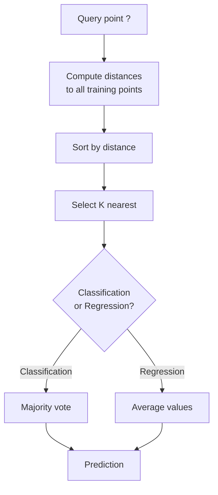
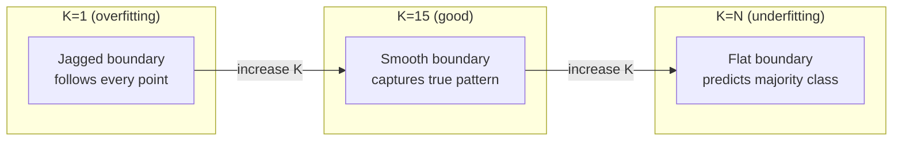
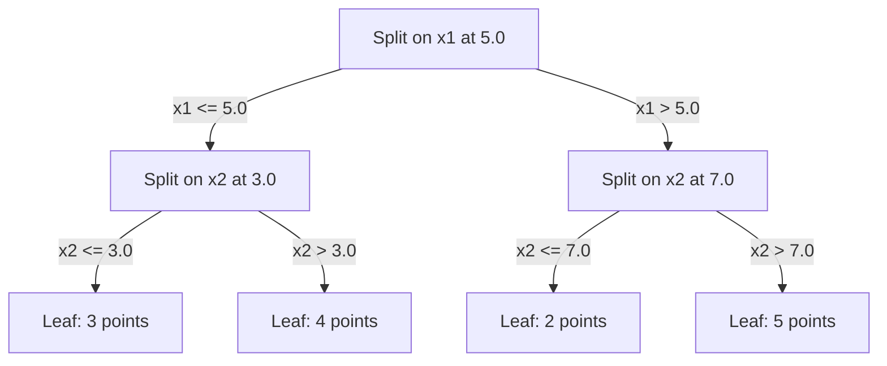

# K - Vizinhos e distâncias mais próximas

> Armazenar tudo, prever olhando para os vizinhos, o algoritmo mais simples que realmente funciona.

**Type:** Build
**Language:**Python
**Prerequisites:** Phase 1 (Lesson 14 Norms and Distances)
**Time:** ~90 minutes

## Objetivos de aprendizagem

- Implementar a classificação e a regressão KNN a partir do zero com K configurável e votação ponderada por distância
- Comparar as métricas de distância L1, L2, cosino e Minkowski e selecionar a adequada para um determinado tipo de dados
- Explique a maldição da dimensionalidade e demonstre por que o KNN se degrada em espaços de alta dimensão
- Construir uma árvore KD para pesquisa e análise eficiente do vizinho mais próximo quando superar a força bruta

## O problema

Você tem um conjunto de dados. Um novo ponto de dados chega. Você precisa classificá-lo ou prever seu valor. Em vez de aprender parâmetros dos dados (como regressão linear ou SVMs), você apenas encontra os pontos de treinamento K mais próximos do novo ponto e deixa-os votar.

Não há fase de treinamento, não há parâmetros para aprender, não há função de perda para minimizar, você armazena todo o conjunto de treinamento e calcula as distâncias no tempo de previsão.

Parece muito simples para funcionar. Mas a KNN é surpreendentemente competitiva para muitos problemas, especialmente com conjuntos de dados pequenos e médios, e entendê-la revela profundamente conceitos fundamentais: a escolha da métrica de distância (conectando-se à lição 14 da fase 1), a maldição da dimensionalidade e a diferença entre aprendizagem preguiçosa e ansiosa.

A KNN também aparece em todos os lugares na IA moderna, sob nomes diferentes. Base de dados vetoriais fazem pesquisa KNN em embebimentos. A geração aumentada de recuperação (RAG) encontra os blocos de documento mais próximos de K. Os sistemas de recomendação encontram usuários ou itens semelhantes. O algoritmo é o mesmo. A escala e as estruturas de dados são diferentes.

## O conceito

### Como funciona a KNN

Dado um conjunto de dados de pontos rotulados e um novo ponto de consulta:

1. Calcule a distância da consulta para cada ponto no conjunto de dados
2. Classificação por distância
3. Tome os pontos mais próximos de K
4. Para classificação: voto majoritário entre os vizinhos K
5. Para regressão: média (ou média ponderada) dos valores dos vizinhos K



Não há encaixes, descida de gradiente, nenhuma época.

### Escolher K

K é o único hiperparâmetro.

| K | Behavior |
|---|----------|
| K = 1 | Decision boundary follows every point. Zero training error. High variance. Overfits |
| Small K (3-5) | Sensitive to local structure. Can capture complex boundaries |
| Large K | Smoother boundaries. More robust to noise. May underfit |
| K = N | Predicts the majority class for every point. Maximum bias |

Um ponto de partida comum é K = sqrt(N) para um conjunto de dados de N pontos.



### Metricas de distância

A função de distância define o que significa "quase". Diferentes métricas produzem vizinhos diferentes, previsões diferentes.

**L2 (Euclidean)**É o padrão.

```
d(a, b) = sqrt(sum((a_i - b_i)^2))
```

Sensível à escala de características. Sempre padronize características antes de usar L2 com KNN.

**L1 (Manhattan)**A diferença de um ponto de vista de um ponto de vista de um ponto de vista de outro ponto é a diferença de um ponto de vista de outro ponto de vista de um ponto de vista de outro ponto de vista de um ponto de vista de outro ponto de vista de outro ponto de vista de outro ponto.

```
d(a, b) = sum(|a_i - b_i|)
```

**Cosine distance**O que é essencial para o texto e a incorporação de dados.

```
d(a, b) = 1 - (a . b) / (||a|| * ||b||)
```

**Minkowski**generaliza L1 e L2 com o parâmetro p.

```
d(a, b) = (sum(|a_i - b_i|^p))^(1/p)

p=1: Manhattan
p=2: Euclidean
p->inf: Chebyshev (max absolute difference)
```

Qual métrica a utilizar depende dos dados:

| Data type | Best metric | Why |
|-----------|------------|-----|
| Numeric features, similar scale | L2 (Euclidean) | Default, works for spatial data |
| Numeric features, outliers | L1 (Manhattan) | Robust, does not amplify large differences |
| Text embeddings | Cosine | Magnitude is noise, direction is meaning |
| High-dimensional sparse | Cosine or L1 | L2 suffers from curse of dimensionality |
| Mixed types | Custom distance | Combine metrics per feature type |

### KNN ponderado

O KNN padrão dá o mesmo peso a todos os vizinhos K. Mas um vizinho na distância 0,1 deve importar mais do que um na distância 5.0.

**Distance-weighted KNN**pesa cada vizinho inversamente pela distância:

```
weight_i = 1 / (distance_i + epsilon)

For classification: weighted vote
For regression:     weighted average = sum(w_i * y_i) / sum(w_i)
```

O epsilon impede a divisão por zero quando um ponto de consulta corresponde exatamente a um ponto de treinamento.

A KNN ponderada é menos sensível à escolha de K porque os vizinhos distantes contribuem muito pouco, independentemente.

### A maldição da dimensionalidade

O desempenho do KNN degrada-se em grandes dimensões.

**Problem 1: distances converge.**À medida que a dimensionalidade aumenta, a relação entre a distância máxima e a distância mínima se aproxima de 1. Todos os pontos se tornam igualmente "longe" da consulta.

```
In d dimensions, for random uniform points:

d=2:    max_dist / min_dist = varies widely
d=100:  max_dist / min_dist ~ 1.01
d=1000: max_dist / min_dist ~ 1.001

When all distances are nearly equal, "nearest" is meaningless.
```

**Problem 2: volume explodes.**Para capturar os vizinhos K dentro de uma fração fixa dos dados, é necessário alargar o raio de busca para cobrir uma fração muito maior do espaço de características.

**Problem 3: corners dominate.**Em um hipercubo unitário em dimensões d, a maior parte do volume é concentrada perto dos cantos, não no centro.

Consequência prática: o KNN funciona bem até cerca de 20 a 50 características. Além disso, você precisa de redução de dimensão (PCA, UMAP, t-SNE) antes de aplicar o KNN, ou você precisa usar estruturas de pesquisa baseadas em árvores que exploram a dimensão inferior intrínseca dos dados.

### Árvores KD: busca rápida do vizinho mais próximo

A força bruta KNN calcula a distância da consulta a cada ponto de treinamento. Isto é O(n * d) por consulta. Para grandes conjuntos de dados, isso é muito lento.

Uma árvore KD divide recursivamente o espaço ao longo de eixos de características.



Para encontrar o vizinho mais próximo, atravesse a árvore até a folha que contém a consulta, depois retrocede e verifique as partições vizinhas apenas se elas puderem conter pontos mais próximos.

Tempo médio de consulta: O(log n) para dimensões baixas. Mas os árvores KD degradam para O(n) em dimensões altas (d > 20) porque o retrocesso elimina cada vez menos ramos.

### Árvores de bola: melhor para dimensões moderadas

As árvores de bolas dividem os dados em hiperesferas aninhadas em vez de caixas alinhadas com eixo. Cada nó define uma bola (centro + raio) que contém todos os pontos nessa subárvore.

Vantagens em relação às árvores KD:
- Funcionam melhor em dimensões moderadas (até ~50)
- Manutenção de estruturas não alinhadas com eixos
- Volumes mais estreitos significam que mais ramos são podados durante a busca

Tanto as árvores KD como as árvores de bolas são algoritmos exatos. Para pesquisas realmente em grande escala (milhões de pontos, centenas de dimensões), são usados métodos próximos aproximados (HNSW, IVF, quantização de produtos).

### Aprendizagem preguiçosa vs aprendizagem ansiosa

A KNN é um aprendiz preguiçoso: não funciona no tempo de treinamento e tudo funciona no tempo de previsão. A maioria dos outros algoritmos (regressão linear, SVM, redes neurais) são aprendizes ansiosos: eles fazem computações pesadas no tempo de treinamento para construir um modelo compacto, então as previsões são rápidas.

| Aspect | Lazy (KNN) | Eager (SVM, neural net) |
|--------|------------|------------------------|
| Training time | O(1) just store data | O(n * epochs) |
| Prediction time | O(n * d) per query | O(d) or O(parameters) |
| Memory at prediction | Store entire training set | Store model parameters only |
| Adapts to new data | Add points instantly | Retrain the model |
| Decision boundary | Implicit, computed on the fly | Explicit, fixed after training |

Aprender preguiçoso é ideal quando:
- O conjunto de dados muda frequentemente (adicionar/retirar pontos sem reformulação)
- Precisas de previsões para poucas perguntas.
- Queres tempo de treino zero.
- O conjunto de dados é pequeno o suficiente para que a busca de força bruta seja rápida

### KNN para regressão

Em vez de votar em maioria, o KNN para regressão media os valores-alvo dos vizinhos K.

```
prediction = (1/K) * sum(y_i for i in K nearest neighbors)

Or with distance weighting:
prediction = sum(w_i * y_i) / sum(w_i)
where w_i = 1 / distance_i
```

A regressão KNN produz previsões de constante por peça (ou suave por peça com ponderação).

```figure
knn-smoothness
```

## Construí-lo

### Passo 1: Funções de distância

Implementar as distâncias L1, L2, cosino e Minkowski.

```python
import math

def l2_distance(a, b):
    return math.sqrt(sum((ai - bi) ** 2 for ai, bi in zip(a, b)))

def l1_distance(a, b):
    return sum(abs(ai - bi) for ai, bi in zip(a, b))

def cosine_distance(a, b):
    dot_val = sum(ai * bi for ai, bi in zip(a, b))
    norm_a = math.sqrt(sum(ai ** 2 for ai in a))
    norm_b = math.sqrt(sum(bi ** 2 for bi in b))
    if norm_a == 0 or norm_b == 0:
        return 1.0
    return 1.0 - dot_val / (norm_a * norm_b)

def minkowski_distance(a, b, p=2):
    if p == float('inf'):
        return max(abs(ai - bi) for ai, bi in zip(a, b))
    return sum(abs(ai - bi) ** p for ai, bi in zip(a, b)) ** (1 / p)
```

### Passo 2: Classificador KNN e regressor

Construa o KNN completo com K configurável, métrica de distância e ponderação opcional de distância.

```python
class KNN:
    def __init__(self, k=5, distance_fn=l2_distance, weighted=False,
                 task="classification"):
        self.k = k
        self.distance_fn = distance_fn
        self.weighted = weighted
        self.task = task
        self.X_train = None
        self.y_train = None

    def fit(self, X, y):
        self.X_train = X
        self.y_train = y

    def predict(self, X):
        return [self._predict_one(x) for x in X]
```

### Passo 3: Árvore KD para uma busca eficiente

Construir uma árvore KD a partir do zero que se divide recursivamente na mediana de cada dimensão.

```python
class KDTree:
    def __init__(self, X, indices=None, depth=0):
        # Recursively partition the data
        self.axis = depth % len(X[0])
        # Split on median of the current axis
        ...

    def query(self, point, k=1):
        # Traverse to leaf, then backtrack
        ...
```

Veja .`code/knn.py`Para a implementação completa com todos os métodos auxiliares e demonstrações.

### Passo 4: Escalagem de características

A KNN requer escalagem de características porque as distâncias são sensíveis às magnitudes das características.

```python
def standardize(X):
    n = len(X)
    d = len(X[0])
    means = [sum(X[i][j] for i in range(n)) / n for j in range(d)]
    stds = [
        max(1e-10, (sum((X[i][j] - means[j]) ** 2 for i in range(n)) / n) ** 0.5)
        for j in range(d)
    ]
    return [[((X[i][j] - means[j]) / stds[j]) for j in range(d)] for i in range(n)], means, stds
```

## Usá-lo

Com a aprendizagem de escikit:

```python
from sklearn.neighbors import KNeighborsClassifier
from sklearn.preprocessing import StandardScaler
from sklearn.pipeline import Pipeline

clf = Pipeline([
    ("scaler", StandardScaler()),
    ("knn", KNeighborsClassifier(n_neighbors=5, metric="euclidean")),
])
clf.fit(X_train, y_train)
print(f"Accuracy: {clf.score(X_test, y_test):.4f}")
```

O Scikit-learn usa automaticamente árvores KD ou árvores de bolas quando o conjunto de dados é grande o suficiente e a dimensionalidade é baixa o suficiente.`algorithm`Parâmetro.

Para pesquisas em grande escala do vizinho mais próximo (milhões de vetores), use FAISS, Annoy ou um banco de dados de vetores:

```python
import faiss

index = faiss.IndexFlatL2(dimension)
index.add(embeddings)
distances, indices = index.search(query_vectors, k=5)
```

## Exercícios

1. Implementar a classificação KNN em um conjunto de dados 2D com 3 classes. Desenhar o limite de decisão para K=1, K=5, K=15, e K=N. Observar a transição de sobre-ajustamento para infraajustamento.

2. Gerar 1000 pontos aleatórios em 2, 5, 10, 50, 100 e 500 dimensões. Para cada dimensão, calcular a relação da distância parista máxima à distância parista mínima.

3. Compare L1, L2 e distância cosínea para KNN em um problema de classificação de texto (use vectores TF-IDF). Qual métrica dá a melhor precisão?

4. Implementar uma árvore KD e medir tempo de consulta vs força bruta para conjuntos de dados de 1k, 10k e 100k pontos em 2D, 10D e 50D. Em que dimensão a árvore KD deixa de ser mais rápida do que a força bruta?

5. Construa um regressor KNN ponderado para y = sin(x) + ruído. Compare-o com KNN não ponderado para K = 3, 10, 30. Mostre que a ponderação produz previsões mais suaves, especialmente para grandes K.

## Termos-chave

| Term | What it actually means |
|------|----------------------|
| K-nearest neighbors | Non-parametric algorithm that predicts by finding the K closest training points to a query |
| Lazy learning | No computation at training time. All work happens at prediction time. KNN is the canonical example |
| Eager learning | Heavy computation at training time to build a compact model. Most ML algorithms are eager |
| Curse of dimensionality | In high dimensions, distances converge and neighborhoods expand to cover most of the space, making KNN ineffective |
| KD-tree | Binary tree that recursively partitions space along feature axes. O(log n) queries in low dimensions |
| Ball tree | Tree of nested hyperspheres. Works better than KD-trees in moderate dimensions (up to ~50) |
| Weighted KNN | Neighbors weighted inversely by distance. Closer neighbors have more influence on the prediction |
| Feature scaling | Normalizing features to comparable ranges. Required for distance-based methods like KNN |
| Majority vote | Classification by counting which class is most common among K neighbors |
| Brute force search | Computing distance to every training point. O(n*d) per query. Exact but slow for large n |
| Approximate nearest neighbor | Algorithms (HNSW, LSH, IVF) that find approximately nearest points much faster than exact search |
| Voronoi diagram | The partition of space where each region contains all points closer to one training point than any other. K=1 KNN produces Voronoi boundaries |

## Mais leitura

- [Cover & Hart: Nearest Neighbor Pattern Classification (1967)](https://ieeexplore.ieee.org/document/1053964)- o documento KNN de base que comprova que tem uma taxa de erro no máximo duas vezes superior à Bayes ideal
- [Friedman, Bentley, Finkel: An Algorithm for Finding Best Matches in Logarithmic Expected Time (1977)](https://dl.acm.org/doi/10.1145/355744.355745)- o papel original de árvore KD
- [Beyer et al.: When Is "Nearest Neighbor" Meaningful? (1999)](https://link.springer.com/chapter/10.1007/3-540-49257-7_15)- Análise formal da maldição da dimensionalidade para o vizinho mais próximo
- [scikit-learn Nearest Neighbors documentation](https://scikit-learn.org/stable/modules/neighbors.html)- guia prático com a selecção de algoritmos
- [FAISS: A Library for Efficient Similarity Search](https://github.com/facebookresearch/faiss)- Biblioteca Meta para pesquisa de vizinhos mais próximos em escala de bilhões
