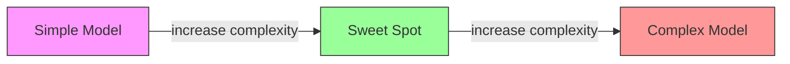
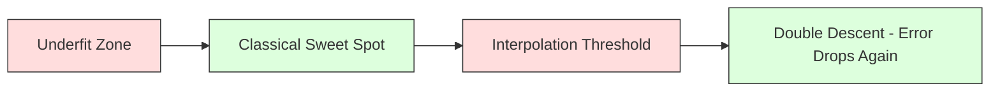
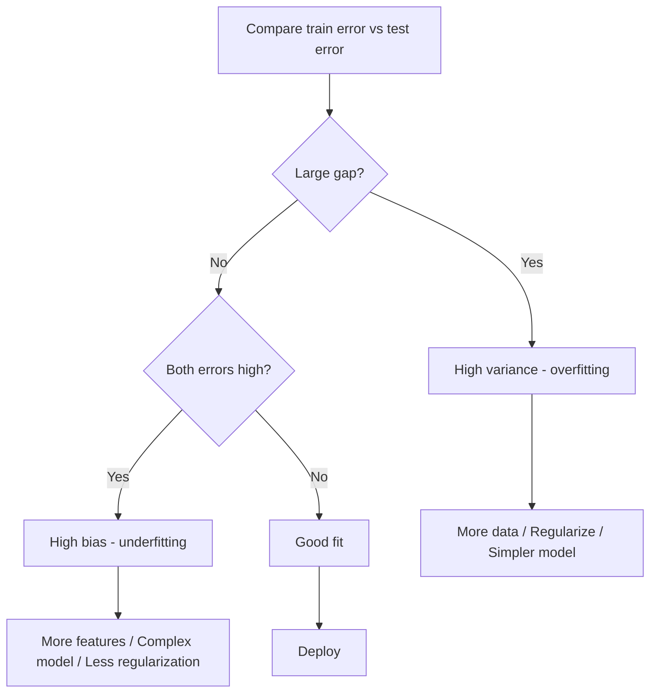
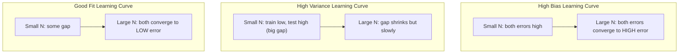
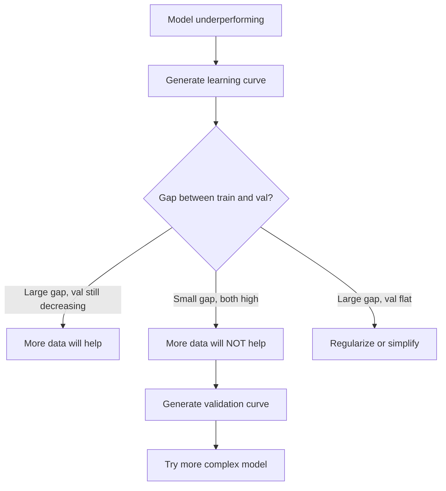

# Comércio de variações de parcialidade

> Cada erro do modelo vem de uma das três fontes: viés, variância ou ruído.

**Type:** Learn
**Language:**Python
**Prerequisites:** Phase 2, Lessons 01-09 (ML basics, regression, classification, evaluation)
**Time:** ~75 minutes

## Objetivos de aprendizagem

- Derivar a decomposição de variação de viés do erro de previsão esperado e explicar o papel do ruído irredutível
- Diagnóstico de um modelo sofrendo de alto preconceito ou alta variância utilizando padrões de erro de treinamento e teste
- Explique como as técnicas de regularização (L1, L2, abandono, paragem antecipada) negociam preconceito para variação
- Implementar experimentos que visualizem o tradeoff de variação de viés em modelos de crescente complexidade

## O problema

Treinou um modelo, tem algum erro nos dados de teste.

Se o seu modelo for muito simples (regressão linear em um conjunto de dados curvos), ele continuará perdendo o padrão verdadeiro. Isso é viés. Se o seu modelo for muito complexo (polinômio de 20 graus em 15 pontos de dados), ele se encaixará perfeitamente nos dados de treinamento, mas dará previsões muito diferentes sobre novos dados. Isso é variância.

Não se pode minimizar ambos ao mesmo tempo para uma capacidade de modelo fixo. Empurre o viés para baixo e a variância sobe. Empurre a variância para baixo e o viés para cima. Entender este compromisso é a habilidade de diagnóstico mais útil na aprendizagem de máquina. Ele diz-lhe se deve tornar o seu modelo mais complexo ou menos complexo, se deve obter mais dados ou engenharia de melhores características, se deve regular mais ou menos.

## O conceito

### Preconceitos: Erro sistemático

O Bias mede o quão longe a previsão média do seu modelo está do valor real. Se você treinou o mesmo modelo em muitos conjuntos de treinamento diferentes extraídos da mesma distribuição e mediou as previsões, o Bias é a lacuna entre essa média e a verdade.

Um alto viés significa que o modelo é muito rígido para capturar o padrão real. Uma linha reta que se encaixa numa parábola sempre perderá a curva, não importa quantos dados lhe dê. Isto é incompatível.

```
High bias (underfitting):
  Model always predicts roughly the same wrong thing.
  Training error: HIGH
  Test error: HIGH
  Gap between them: SMALL
```

### Variância: Sensibilidade aos dados de formação

A variação mede o quanto as suas previsões mudam quando você treina em diferentes subconjuntos de dados.

A alta variância significa que o modelo está ajustando o ruído nos dados de treinamento, não o sinal subjacente. Um polinômio de grau-20 vai atravessar todos os pontos de treinamento, mas oscila muito entre eles.

```
High variance (overfitting):
  Model fits training data perfectly but fails on new data.
  Training error: LOW
  Test error: HIGH
  Gap between them: LARGE
```

### A decomposição

Para qualquer ponto x, o erro de previsão esperado sob perda quadrada se decompõe exatamente:

```
Expected Error = Bias^2 + Variance + Irreducible Noise

where:
  Bias^2   = (E[f_hat(x)] - f(x))^2
  Variance = E[(f_hat(x) - E[f_hat(x)])^2]
  Noise    = E[(y - f(x))^2]             (sigma^2)
```

- `f(x)`é a função verdadeira
- `f_hat(x)`é a previsão do seu modelo
- `E[...]`é a expectativa sobre diferentes conjuntos de formação
- `y`é a etiqueta observada (função verdadeira mais ruído)

O termo ruído é irredutível. Nenhum modelo pode fazer melhor do que sigma^2 em dados ruidosos.

### Complicidade do modelo vs erro



A curva clássica em forma de U:

| Complexity | Bias | Variance | Total Error |
|-----------|------|----------|-------------|
| Too low | HIGH | LOW | HIGH (underfitting) |
| Just right | MODERATE | MODERATE | LOWEST |
| Too high | LOW | HIGH | HIGH (overfitting) |

### Regularização como controlo de variações biológicas

A regularização aumenta deliberadamente o viés para reduzir a variância.

- **L2 (Ridge):**Reduz todos os pesos para zero, mantém todas as características, mas reduz a sua influência.
- **L1 (Lasso):**Põe alguns pesos exatamente para zero.
- **Dropout:**Desativa os neurônios durante o treino, faz com que as representações sejam redundantes.
- **Early stopping:**Pára de treinar antes que o modelo se ajuste completamente aos dados de treinamento.

A força de regularização (lambda, taxa de abandono, número de épocas) controla diretamente onde você se senta na curva de variação de viés.

### Duas descendências: a perspectiva moderna

A teoria clássica diz: depois do ponto doce, mais complexidade sempre dói. Mas a pesquisa desde 2019 mostrou algo inesperado. Se você continuar aumentando a capacidade do modelo muito além do limiar de interpolação (onde o modelo tem parâmetros suficientes para se encaixar perfeitamente em dados de treinamento), o erro de teste pode diminuir novamente.



Este fenômeno de "doble descida" explica por que redes neurais massivamente sobreparametrizadas (com muito mais parâmetros do que exemplos de treinamento) ainda se generalizam bem.

Observações fundamentais sobre a dupla descida:
- Acontece em modelos lineares, árvores de decisão e redes neurais
- Mais dados podem realmente prejudicar na região de interpolação (descende duplo de modo de amostra)
- Mais épocas de formação também podem causar isso (descende duplo em sentido de época)
- A regularização suaviza o pico, mas não o elimina

Porque é que isto acontece? No limiar de interpolação, o modelo tem capacidade suficiente para caber em todos os pontos de formação. É forçado a uma solução muito específica que atravessa todos os pontos, e pequenas perturbações nos dados causam grandes mudanças no ajuste. É aqui que a variância chega ao auge. Além do limiar, o modelo tem muitas soluções possíveis que se encaixam perfeitamente nos dados. O algoritmo de aprendizagem (por exemplo, descida de gradiente com regularização implícita) tende a escolher o mais simples entre eles. Este viés implícito em direção a soluções simples é o motivo pelo qual os modelos sobreparametrizados se generalizam.

| Regime | Parameters vs Samples | Behavior |
|--------|----------------------|----------|
| Underparameterized | p << n | Classical tradeoff applies |
| Interpolation threshold | p ~ n | Variance peaks, test error spikes |
| Overparameterized | p >> n | Implicit regularization kicks in, test error drops |

Para fins práticos: se estiver a utilizar redes neurais ou grandes conjuntos de árvores, não se detenha no limiar de interpolação. Ou permaneça bem abaixo dele (com regularização explícita) ou ultrapasse-o. O pior lugar para estar é bem no limiar.

### Diagnóstico do seu modelo



| Symptom | Diagnosis | Fix |
|---------|-----------|-----|
| High train error, high test error | Bias | More features, complex model, less regularization |
| Low train error, high test error | Variance | More data, regularization, simpler model, dropout |
| Low train error, low test error | Good fit | Ship it |
| Train error decreasing, test error increasing | Overfitting in progress | Early stopping |

### Estratégias Práticas

**When bias is the problem:**
- Adicionar características de polinômio ou interação
- Use um modelo mais flexível (ensemble de árvores em vez de linear)
- Reduzir a força de regularização
- Trem mais longo (se ainda não convergido)

**When variance is the problem:**
- Obtenha mais dados de treinamento
- Usar emboscamento (bosques aleatórios)
- Aumento da regularização (Lambda mais alta, maior abandono)
- Seleção de características (remover características barulhentas)
- Utilize a validação cruzada para detectá-lo precocemente

### Métodos de Ensemble e Reduzir as Variações

Os métodos conjuntos são a ferramenta mais prática para combater a variância.

**Bagging (Bootstrap Aggregating)**O estudo de forma geral, que tem como objetivo a análise de dados de treinamento, faz com que os modelos sejam treinados em diferentes amostras de bootstrap dos dados de treinamento, e depois medias suas previsões.

Por que funciona matematicamente: se você mediar N previsões independentes, cada uma com variância sigma^2, a variância da média é sigma^2 / N. Os modelos não são verdadeiramente independentes (todos eles veem dados semelhantes), então a redução é menor que 1/N, mas ainda é substancial.

**Boosting**O Boosting é um sistema de estimulação de dados que reduz o viés através da construção de modelos sequencialmente, onde cada novo modelo se concentra nos erros do conjunto até agora.

| Method | Primary Effect | Bias Change | Variance Change |
|--------|---------------|-------------|-----------------|
| Bagging | Reduces variance | No change | Decreases |
| Boosting | Reduces bias | Decreases | Can increase |
| Stacking | Reduces both | Depends on meta-learner | Depends on base models |
| Dropout | Implicit bagging | Slight increase | Decreases |

**Practical rule:**Se o modelo base tiver uma alta variância (árvores profundas, polinômios de alto grau), use emagrecimento.

### Curvas de aprendizagem

As curvas de aprendizagem traçam o treinamento e o erro de validação em função do tamanho do conjunto de treinamento. São a ferramenta de diagnóstico mais prática que você tem. Ao contrário de uma única comparação de treinamento/teste, as curvas de aprendizagem mostram a trajetória do seu modelo e dizem-lhe se mais dados irão ajudar.



Como as ler:

| Scenario | Training Error | Validation Error | Gap | What It Means | What to Do |
|----------|---------------|-----------------|-----|---------------|------------|
| High bias | High | High | Small | Model cannot capture the pattern | More features, complex model, less regularization |
| High variance | Low | High | Large | Model memorizes training data | More data, regularization, simpler model |
| Good fit | Moderate | Moderate | Small | Model generalizes well | Ship it |
| High variance, improving | Low | Decreasing with more data | Shrinking | Variance problem that data can fix | Collect more data |
| High bias, flat | High | High and flat | Small and flat | More data will NOT help | Change model architecture |

A visão crítica: se ambas as curvas se mantiverem em plano e o espaço é pequeno, mas ambos os erros são altos, mais dados são inúteis.

### Como gerar curvas de aprendizagem

Há duas abordagens:

**Approach 1: Vary training set size, fixed model.**Mantém o modelo e os hiperparâmetros constantes. Treine em subconjuntos cada vez maiores dos dados de treinamento. Mite o erro de treinamento e o erro de validação em cada tamanho. Esta é a curva padrão de aprendizagem.

**Approach 2: Vary model complexity, fixed data.**Meter o erro de treinamento e erro de validação em cada complexidade. Esta é uma curva de validação e mostra diretamente o tradeoff de variação de viés.

As duas abordagens complementam-se: a primeira diz-lhe se mais dados ajudarão. A segunda diz-lhe se um modelo diferente ajudará.



```figure
bias-variance
```

## Construí-lo

O código está em `code/bias_variance.py`O que é que eu faço é fazer o experimento completo de decomposição de variação de viés.

### Passo 1: Gerar dados sintéticos a partir de uma função conhecida

Usamos`f(x) = sin(1.5x) + 0.5x`Conhecer a função verdadeira permite-nos calcular o viés e a variância exatos.

```python
def true_function(x):
    return np.sin(1.5 * x) + 0.5 * x

def generate_data(n_samples=30, noise_std=0.5, x_range=(-3, 3), seed=None):
    rng = np.random.RandomState(seed)
    x = rng.uniform(x_range[0], x_range[1], n_samples)
    y = true_function(x) + rng.normal(0, noise_std, n_samples)
    return x, y
```

### Passo 2: Amostração de bootstrap e ajuste de polinômio

Para cada grau polinômio, desenhamos muitos conjuntos de treinamento de bootstrap, encaixamos no polinômio e registamos previsões em uma grade de teste fixa.

```python
def fit_polynomial(x_train, y_train, degree, lam=0.0):
    X = np.column_stack([x_train ** d for d in range(degree + 1)])
    if lam > 0:
        penalty = lam * np.eye(X.shape[1])
        penalty[0, 0] = 0
        w = np.linalg.solve(X.T @ X + penalty, X.T @ y_train)
    else:
        w = np.linalg.lstsq(X, y_train, rcond=None)[0]
    return w
```

Cada amostra de arranque é tirada da mesma distribuição subjacente, mas contém pontos diferentes.

### Passo 3: Computação de Bias^2, Decompositividade de Variância

Com 200 conjuntos de previsões em cada ponto de teste, podemos calcular a decomposição diretamente a partir da definição:

```python
mean_pred = predictions.mean(axis=0)
bias_sq = np.mean((mean_pred - y_true) ** 2)
variance = np.mean(predictions.var(axis=0))
total_error = np.mean(np.mean((predictions - y_true) ** 2, axis=1))
```

- `mean_pred`é estimada a partir de amostras de arranque
- `bias_sq`é a diferença quadrada entre a previsão média e a verdade
- `variance`é a espalha média das previsões entre as amostras de bootstrap
- `total_error`Deve ser aproximadamente igual a desvio^2 + variância + ruído

### Passo 4: Curvas de Aprendizagem

As curvas de aprendizagem varrem o tamanho do conjunto de treinamento mantendo a complexidade do modelo fixa.

```python
def demo_learning_curves():
    sizes = [10, 15, 20, 30, 50, 75, 100, 150, 200, 300]
    degree = 5

    for n in sizes:
        train_errors = []
        test_errors = []
        for seed in range(50):
            x_train, y_train = generate_data(n_samples=n, seed=seed * 100)
            w = fit_polynomial(x_train, y_train, degree)
            train_pred = predict_polynomial(x_train, w)
            train_mse = np.mean((train_pred - y_train) ** 2)
            test_pred = predict_polynomial(x_test, w)
            test_mse = np.mean((test_pred - y_test) ** 2)
            train_errors.append(train_mse)
            test_errors.append(test_mse)
        # Average over runs gives the learning curve point
```

Para um modelo de alta variância (grado 5 com pequenos dados), vê-se:
- O erro de treinamento começa baixo e aumenta à medida que mais dados tornam a memorização mais difícil
- O erro de teste começa alto e diminui à medida que o modelo recebe mais sinal
- A diferença diminui com mais dados

Para um modelo de alto viés (grado 1), ambos os erros convergem rapidamente para o mesmo valor elevado e mais dados não ajudam.

### Passo 5: Esvaziamento de regularização

O código inclui também `demo_regularization_sweep()`, que fixa um polinômio de alto grau (grado 15) e varria a resistência de regularização Ridge de 0,001 a 100. Isso mostra o tradeoff de variação de viés de um ângulo diferente: em vez de variar a complexidade do modelo, variamos a resistência da restrição.

```python
def demo_regularization_sweep():
    alphas = [0.001, 0.005, 0.01, 0.05, 0.1, 0.5, 1.0, 5.0, 10.0, 50.0, 100.0]
    for alpha in alphas:
        results = bias_variance_decomposition([15], lam=alpha)
        r = results[15]
        print(f"alpha={alpha:.3f}  bias={r['bias_sq']:.4f}  var={r['variance']:.4f}")
```

Em baixo alfa, o polinômio de grau-15 é quase sem restrições. A variância domina porque o modelo persegue ruído em cada amostra de arranque. Em alto alfa, a penalidade é tão forte que o modelo se torna efetivamente uma função quase constante.

Esta é a mesma curva U de vários graus polinômios, mas controlada por um botão contínuo em vez de um discreto. Na prática, a regularização é a maneira preferida de controlar o tradeoff porque permite o controle de grãos finos sem mudar o conjunto de características.

## Usá-lo

sklearn fornece `learning_curve`E ...`validation_curve`para automatizar estes diagnósticos sem escrever bucles de arranque.

### Curva de validação: complexidade do modelo de varredura

```python
from sklearn.model_selection import validation_curve
from sklearn.pipeline import make_pipeline
from sklearn.preprocessing import PolynomialFeatures
from sklearn.linear_model import Ridge

degrees = list(range(1, 16))
train_scores_all = []
val_scores_all = []

for d in degrees:
    pipe = make_pipeline(PolynomialFeatures(d), Ridge(alpha=0.01))
    train_scores, val_scores = validation_curve(
        pipe, X, y, param_name="polynomialfeatures__degree",
        param_range=[d], cv=5, scoring="neg_mean_squared_error"
    )
    train_scores_all.append(-train_scores.mean())
    val_scores_all.append(-val_scores.mean())
```

Isto dá-lhe a curva de troca de variação de viés diretamente. Onde a pontuação de validação é pior em relação à pontuação do treinamento, a variância domina. Onde ambos são ruins, o viés domina.

### Curva de aprendizagem: tamanho do conjunto de treino

```python
from sklearn.model_selection import learning_curve

pipe = make_pipeline(PolynomialFeatures(5), Ridge(alpha=0.01))
train_sizes, train_scores, val_scores = learning_curve(
    pipe, X, y, train_sizes=np.linspace(0.1, 1.0, 10),
    cv=5, scoring="neg_mean_squared_error"
)
train_mse = -train_scores.mean(axis=1)
val_mse = -val_scores.mean(axis=1)
```

Plot `train_mse`E ...`val_mse`contra`train_sizes`A forma diz-te tudo sobre o teu modelo.

### Validação cruzada com varredura de regularização

```python
from sklearn.model_selection import cross_val_score

alphas = [0.001, 0.01, 0.1, 1.0, 10.0, 100.0]
for alpha in alphas:
    pipe = make_pipeline(PolynomialFeatures(10), Ridge(alpha=alpha))
    scores = cross_val_score(pipe, X, y, cv=5, scoring="neg_mean_squared_error")
    print(f"alpha={alpha:>7.3f}  MSE={-scores.mean():.4f} +/- {scores.std():.4f}")
```

Isto varria a força de regularização para uma complexidade de modelo fixa. Você verá o mesmo tradeoff de variação de viés: baixo alfa significa alta variância, alto alfa significa alto viés.

### Colocando tudo em conjunto: um fluxo de trabalho completo de diagnóstico

Na prática, executamos estes diagnósticos em sequência:

1. Treina o teu modelo, computa o trem e teste o erro.
2. Se ambos estiverem altos, tem um problema de preconceito.
3. Se o trem for baixo, mas o teste for alto: você tem um problema de variância.
4. Gerencie uma curva de validação que varre o seu parâmetro de complexidade principal.
5. No ponto ideal, gerar uma curva de aprendizagem. Se a lacuna ainda é grande, você precisa de mais dados ou regularização.
6. Tente Ridge/Lasso com diferentes valores alfa usando `cross_val_score`Escolha o alfa onde o erro de validação cruzada é menor.

Isto leva 10-15 minutos de cálculo para a maioria dos conjuntos de dados tabuleiros e economiza horas de adivinhação.

## Envia-o

Esta lição produz: `outputs/prompt-model-diagnostics.md`

## Exercícios

1. Execute a decomposição com `noise_std=0`O que acontece com o termo erro irredutível? A complexidade óptima muda?

2. Aumentar o tamanho do conjunto de treinamento de 30 para 300. Como isso afeta o componente de variância?

3. Adicionar regularização L2 (regressão de Ridge) ao experimento. Para um polinômio de alto grau fixo (grado 15), varrer lambda de 0 para 100.

4. Modificar a função verdadeira de um polinômio para `sin(x)`Como é que a decomposição de variação de viés muda?

5. Implementar um simples envelope de agregação de bootstrap (bagging): treinar 10 modelos em amostras de bootstrap e previsões médias. Mostrar que isso reduz a variância sem aumentar muito o viés.

## Termos-chave

| Term | What people say | What it actually means |
|------|----------------|----------------------|
| Bias | "The model is too simple" | Systematic error from wrong assumptions. The gap between the average model prediction and truth. |
| Variance | "The model is overfitting" | Error from sensitivity to training data. How much predictions change across different training sets. |
| Irreducible error | "Noise in the data" | Error from randomness in the true data-generating process. No model can eliminate it. |
| Underfitting | "Not learning enough" | Model has high bias. It misses the real pattern even on training data. |
| Overfitting | "Memorizing the data" | Model has high variance. It fits noise in training data that does not generalize. |
| Regularization | "Constraining the model" | Adding a penalty to reduce model complexity, trading bias for lower variance. |
| Double descent | "More parameters can help" | Test error decreases again when model capacity far exceeds the interpolation threshold. |
| Model complexity | "How flexible the model is" | The capacity of a model to fit arbitrary patterns. Controlled by architecture, features, or regularization. |

## Mais leitura

- [Hastie, Tibshirani, Friedman: Elements of Statistical Learning, Ch. 7](https://hastie.su.domains/ElemStatLearn/)-- o tratamento definitivo da decomposição de variação de prejuízo
- [Belkin et al., Reconciling modern machine learning practice and the bias-variance trade-off (2019)](https://arxiv.org/abs/1812.11118)- o papel de descida dupla
- [Nakkiran et al., Deep Double Descent (2019)](https://arxiv.org/abs/1912.02292)-- descida dupla por época e por amostra
- [Scott Fortmann-Roe: Understanding the Bias-Variance Tradeoff](http://scott.fortmann-roe.com/docs/BiasVariance.html)- Explicação visual clara
