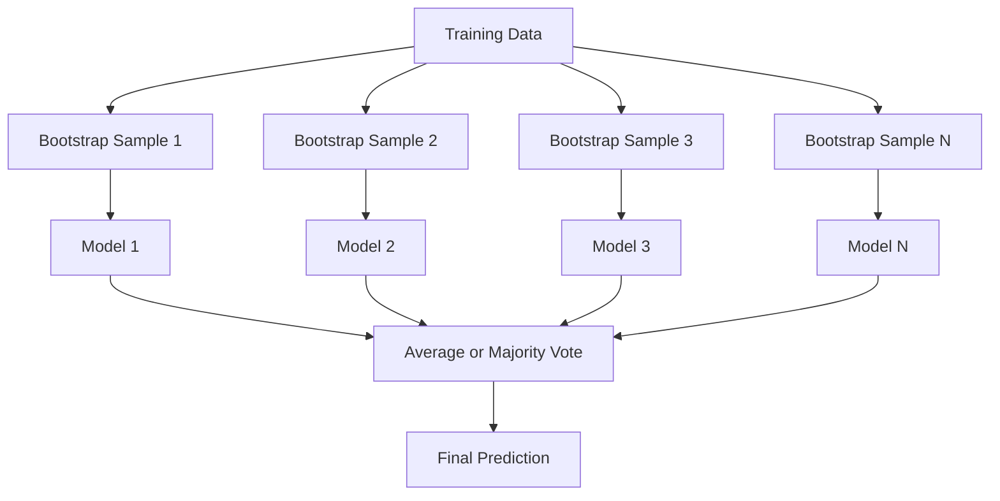
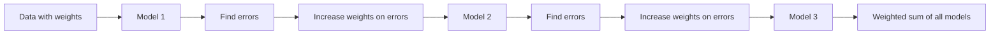
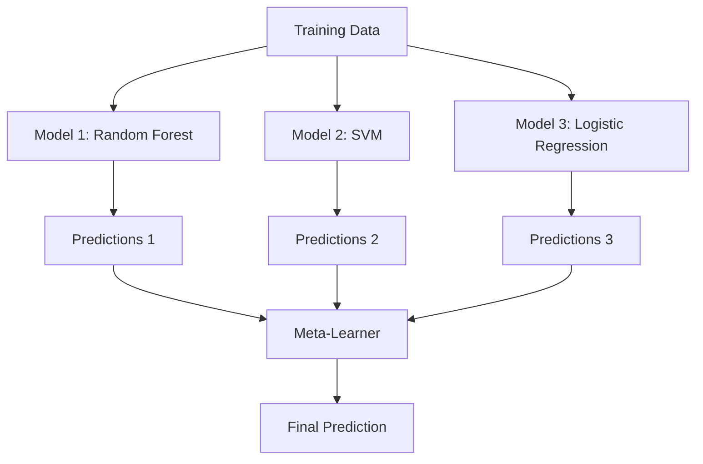

# Métodos de Ensemble

> Um grupo de aprendizes fracos, combinados corretamente, se torna um aprendiz forte.

**Type:** Build
**Language:**Python
**Prerequisites:** Phase 2, Lesson 10 (Bias-Variance Tradeoff)
**Time:** ~120 minutes

## Objetivos de aprendizagem

- Implementar AdaBoost e gradiente de impulso a partir do zero e explicar como o impulso sequencial reduz o viés
- Construir um conjunto de sacos e demonstrar como a média de modelos descorrelados reduz a variância sem aumentar o viés
- Comparar a embalagem, a intensificação e a empilhamento em termos de qual componente de erro cada método visa
- Avalia a diversidade do conjunto e explica por que a precisão da votação da maioria melhora com os alunos mais fracos e independentes

## O problema

Uma única árvore de decisão é rápida de treinar e fácil de interpretar, mas excede. Um único modelo linear se encaixa em limites complexos. Você pode passar dias projetando a arquitetura do modelo perfeito. Ou você pode combinar um monte de modelos imperfeitos e obter algo melhor do que qualquer um deles individualmente.

Os métodos de montagem fazem exatamente isso. Eles são a técnica mais confiável para vencer competições Kaggle em dados tabuleiros, eles alimentam a maioria dos sistemas de produção ML, e eles ilustram o tradeoff de variação de viés em ação.

## O conceito

### Por que os grupos trabalham

Suponha que tenha N classificadores independentes, cada um com precisão p > 0,5.

```
P(majority correct) = sum over k > N/2 of C(N,k) * p^k * (1-p)^(N-k)
```

Para 21 classificadores, cada um com 60% de precisão, a precisão da maioria dos votos é de cerca de 74%. Com 101 classificadores, ele sobe para 84%. Os erros são cancelados quando os modelos cometem erros diferentes.

O requisito chave é **diversity**Se todos os modelos cometem os mesmos erros, a combinação não ajuda nada.

- Diferentes subconjuntos de formação (bagging)
- Subconjuntos de características diferentes (bosques aleatórios)
- Correção de erro seqüencial (impulsão)
- Famílias de modelos diferentes (estacamento)

### Acompanhamento de empilhadeiras

A embalagem cria diversidade através da formação de cada modelo numa amostra diferente de dados de arranque dos dados de formação.



Uma amostra de bootstrap é desenhada com substituição dos dados originais, do mesmo tamanho que o original. Cerca de 63,2% das amostras únicas aparecem em cada bootstrap. O restante 36,8% ( amostras fora de saco) fornecem um conjunto de validação gratuito.

A embalagem reduz a variância sem aumentar muito o viés. Cada árvore individual supera a sua amostra de arranque, mas o sobreajuste é diferente para cada árvore, então a média cancela o ruído.

**Random Forests**A diferença entre os tipos de árvores e os tipos de árvores que se encontram em cada divisão é a diferença entre os tipos de árvores que se encontram em cada divisão.`sqrt(n_features)`para classificação e `n_features / 3`para regressão.

### Aumento (correção de erro sequencial)

Cada novo modelo se concentra nos exemplos que os modelos anteriores tiveram errado.



O aumento reduz o viés. Cada novo modelo corrige os erros sistemáticos do conjunto até agora. A previsão final é uma soma ponderada de todos os modelos, onde os modelos melhores recebem pesos mais altos.

A compensação: o impulso pode ser super ajustado se executar muitas rodadas, porque continua a ajustar exemplos mais difíceis, alguns dos quais podem ser ruídos.

### AdaBoost

AdaBoost (Adaptive Boosting) foi o primeiro algoritmo prático de impulsionamento.

O algoritmo:

```
1. Initialize sample weights: w_i = 1/N for all i

2. For t = 1 to T:
   a. Train weak learner h_t on weighted data
   b. Compute weighted error:
      err_t = sum(w_i * I(h_t(x_i) != y_i)) / sum(w_i)
   c. Compute model weight:
      alpha_t = 0.5 * ln((1 - err_t) / err_t)
   d. Update sample weights:
      w_i = w_i * exp(-alpha_t * y_i * h_t(x_i))
   e. Normalize weights to sum to 1

3. Final prediction: H(x) = sign(sum(alpha_t * h_t(x)))
```

Os modelos com menor erro ganham mais alfa.

### Aumento gradual

O aumento do gradiente generaliza o aumento para funções de perda arbitrárias. Em vez de reponderar amostras, ele se encaixa em cada novo modelo com os resíduos (gradiente negativo da perda) do conjunto atual.

```
1. Initialize: F_0(x) = argmin_c sum(L(y_i, c))

2. For t = 1 to T:
   a. Compute pseudo-residuals:
      r_i = -dL(y_i, F_{t-1}(x_i)) / dF_{t-1}(x_i)
   b. Fit a tree h_t to the residuals r_i
   c. Find optimal step size:
      gamma_t = argmin_gamma sum(L(y_i, F_{t-1}(x_i) + gamma * h_t(x_i)))
   d. Update:
      F_t(x) = F_{t-1}(x) + learning_rate * gamma_t * h_t(x)

3. Final prediction: F_T(x)
```

Para perda de erro quadrado, os pseudo-resíduos são apenas os resíduos reais: `r_i = y_i - F_{t-1}(x_i)`Cada árvore corresponde literalmente aos erros do conjunto anterior.

A taxa de aprendizagem (reduzimento) controla o quanto cada árvore contribui.

### XGBoost: Por que domina os dados tabulares

XGBoost (eXtreme Gradient Boosting) é um aumento de gradiente com otimizações de engenharia que o tornam rápido, preciso e resistente ao sobreajuste:

- **Regularized objective:**As sanções L1 e L2 sobre pesos de folhas impedem que árvores individuais tenham muita confiança
- **Second-order approximation:**Utiliza os dois primeiros derivados da perda, dando melhores decisões divididas
- **Sparsity-aware splits:**Manuseia valores faltantes de forma nativa, aprendendo a melhor direção para dados faltantes em cada divisão
- **Column subsampling:**Como as florestas aleatórias, as amostras são características em cada divisão para a diversidade
- **Weighted quantile sketch:**Encontre de forma eficiente pontos de divisão para características contínuas em dados distribuídos
- **Cache-aware block structure:**Layout de memória otimizado para linhas de cache de CPU

Para dados tabuleiros, o XGBoost (e seu sucessor LightGBM) superam consistentemente as redes neurais. Isto não vai mudar em breve.

### Estacionamento (Meta-Learning)

O estacionamento usa as previsões de múltiplos modelos base como características para um meta-aprendizaje.



O meta-aprendizaje aprende qual modelo base confiar para quais entradas. Se a floresta aleatória é melhor em certas regiões e o SVM em outras, o meta-aprendizaje aprenderá a percorrer de acordo.

Para evitar vazamento de dados, as previsões do modelo base devem ser geradas através de validação cruzada no conjunto de treinamento.

### Votação

O conjunto mais simples, só combinar as previsões diretamente.

- **Hard voting:**A maioria vota nos rótulos da classe.
- **Soft voting:**Probabilidade média prevista, escolha a classe com maior probabilidade média, geralmente melhor porque usa informações de confiança.

```figure
f3-ensemble-average
```

## Construí-lo

### Passo 1: Estampamento de decisão (aprendiza-guia de base)

O código está em `code/ensembles.py`Começamos com um tronco de decisão: uma árvore com uma única divisão.

```python
class DecisionStump:
    def __init__(self):
        self.feature_idx = None
        self.threshold = None
        self.polarity = 1
        self.alpha = None

    def fit(self, X, y, weights):
        n_samples, n_features = X.shape
        best_error = float("inf")

        for f in range(n_features):
            thresholds = np.unique(X[:, f])
            for thresh in thresholds:
                for polarity in [1, -1]:
                    pred = np.ones(n_samples)
                    pred[polarity * X[:, f] < polarity * thresh] = -1
                    error = np.sum(weights[pred != y])
                    if error < best_error:
                        best_error = error
                        self.feature_idx = f
                        self.threshold = thresh
                        self.polarity = polarity

    def predict(self, X):
        n = X.shape[0]
        pred = np.ones(n)
        idx = self.polarity * X[:, self.feature_idx] < self.polarity * self.threshold
        pred[idx] = -1
        return pred
```

### Passo 2: AdaBoost a partir do zero

```python
class AdaBoostScratch:
    def __init__(self, n_estimators=50):
        self.n_estimators = n_estimators
        self.stumps = []
        self.alphas = []

    def fit(self, X, y):
        n = X.shape[0]
        weights = np.full(n, 1 / n)

        for _ in range(self.n_estimators):
            stump = DecisionStump()
            stump.fit(X, y, weights)
            pred = stump.predict(X)

            err = np.sum(weights[pred != y])
            err = np.clip(err, 1e-10, 1 - 1e-10)

            alpha = 0.5 * np.log((1 - err) / err)
            weights *= np.exp(-alpha * y * pred)
            weights /= weights.sum()

            stump.alpha = alpha
            self.stumps.append(stump)
            self.alphas.append(alpha)

    def predict(self, X):
        total = sum(a * s.predict(X) for a, s in zip(self.alphas, self.stumps))
        return np.sign(total)
```

### Passo 3: Aumento gradual a partir do zero

```python
class GradientBoostingScratch:
    def __init__(self, n_estimators=100, learning_rate=0.1, max_depth=3):
        self.n_estimators = n_estimators
        self.lr = learning_rate
        self.max_depth = max_depth
        self.trees = []
        self.initial_pred = None

    def fit(self, X, y):
        self.initial_pred = np.mean(y)
        current_pred = np.full(len(y), self.initial_pred)

        for _ in range(self.n_estimators):
            residuals = y - current_pred
            tree = SimpleRegressionTree(max_depth=self.max_depth)
            tree.fit(X, residuals)
            update = tree.predict(X)
            current_pred += self.lr * update
            self.trees.append(tree)

    def predict(self, X):
        pred = np.full(X.shape[0], self.initial_pred)
        for tree in self.trees:
            pred += self.lr * tree.predict(X)
        return pred
```

### Passo 4: Comparar com sklearn

O código verifica que as nossas implementações a partir do zero produzem uma precisão semelhante à do sklearn `AdaBoostClassifier`E ...`GradientBoostingClassifier`, e compara todos os métodos lado a lado.

## Usá-lo

### Quando usar cada método

| Method | Reduces | Best for | Watch out for |
|--------|---------|----------|---------------|
| Bagging / Random Forest | Variance | Noisy data, many features | Does not help with bias |
| AdaBoost | Bias | Clean data, simple base learners | Sensitive to outliers and noise |
| Gradient Boosting | Bias | Tabular data, competitions | Slow to train, easy to overfit without tuning |
| XGBoost / LightGBM | Both | Production tabular ML | Many hyperparameters |
| Stacking | Both | Getting last 1-2% accuracy | Complex, risk of overfitting meta-learner |
| Voting | Variance | Quick combination of diverse models | Only helps if models are diverse |

### A pilha de produção para dados tabuleiros

Para a maioria dos problemas de previsão tabuleira, esta é a ordem para tentar:

1. **LightGBM or XGBoost**com parâmetros padrão
2. Tune n_estimatores, taxa de aprendizagem, profundidade máxima, peso mínimo do filho
3. Se precisar do último 0,5%, construa um conjunto de empilhadeiras com 3-5 modelos diversos
4. Utilize a validação cruzada em todos os

As redes neurais em dados tabulares são quase sempre piores do que o aumento de gradiente, apesar das tentativas de pesquisa contínuas. TabNet, NODE e arquiteturas similares ocasionalmente coincidem, mas raramente superam um XGBoost bem sintonizado.

## Envia-o

Esta lição produz`outputs/prompt-ensemble-selector.md`- um prompt que ajuda a escolher o método de conjunto certo para um conjunto de dados. Descreva os seus dados ( tamanho, tipos de características, nível de ruído, equilíbrio de classes) e o problema que você está resolvendo. O prompt passa por uma lista de verificação de decisão, recomenda um método, sugere iniciar hiperparâmetros e alerta sobre erros comuns para esse método. Também produz `outputs/skill-ensemble-builder.md`com o guia completo de selecção.

## Exercícios

1. Modificar a implementação do AdaBoost para rastrear a precisão do treinamento após cada rodada.

2. Implementar uma floresta aleatória a partir do zero adicionando a característica aleatória de sub-amplificação à árvore de regressão.`max_features=sqrt(n_features)`Comparar a redução de variância com uma única árvore.

3. Na implementação de aumento de gradiente, adicione parada antecipada: acompanhe a perda de validação após cada rodada e pare quando não tiver melhorado por 10 rodadas consecutivas. Quantas árvores é realmente necessária?

4. Construir um conjunto de empilhamento com três modelos base (regressão logística, árvore de decisão, vizinhos k mais próximos) e um meta-aprendizaje de regressão logística. Use a validação cruzada de 5 vezes para gerar meta-funções. Compare com cada modelo base sozinho.

5. Exerça o XGBoost no mesmo conjunto de dados com parâmetros padrão. Compare sua precisão com o seu aumento do gradiente a partir do zero. Tempo ambos. Quão grande é a diferença de velocidade?

## Termos-chave

| Term | What people say | What it actually means |
|------|----------------|----------------------|
| Bagging | "Train on random subsets" | Bootstrap aggregating: train models on bootstrap samples, average predictions to reduce variance |
| Boosting | "Focus on hard examples" | Train models sequentially, each correcting errors of the ensemble so far, to reduce bias |
| AdaBoost | "Reweight the data" | Boosting via sample weight updates; misclassified points get higher weight for the next learner |
| Gradient boosting | "Fit the residuals" | Boosting via fitting each new model to the negative gradient of the loss function |
| XGBoost | "The Kaggle weapon" | Gradient boosting with regularization, second-order optimization, and systems-level speed tricks |
| Stacking | "Models on top of models" | Use predictions of base models as input features for a meta-learner |
| Random forest | "Many randomized trees" | Bagging with decision trees, adding random feature subsampling at each split for diversity |
| Ensemble diversity | "Make different mistakes" | Models must be uncorrelated in their errors for the ensemble to improve over individuals |
| Out-of-bag error | "Free validation" | Samples not in a bootstrap draw (~36.8%) serve as a validation set without needing a holdout |

## Mais leitura

- [Schapire & Freund: Boosting: Foundations and Algorithms](https://mitpress.mit.edu/9780262526036/)- O livro dos criadores da AdaBoost
- [Friedman: Greedy Function Approximation: A Gradient Boosting Machine (2001)](https://statweb.stanford.edu/~jhf/ftp/trebst.pdf)- o papel de aumento de gradiente original
- [Chen & Guestrin: XGBoost (2016)](https://arxiv.org/abs/1603.02754)-- o papel XGBoost
- [Wolpert: Stacked Generalization (1992)](https://www.sciencedirect.com/science/article/abs/pii/S0893608005800231)- o papel de empilhamento original
- [scikit-learn Ensemble Methods](https://scikit-learn.org/stable/modules/ensemble.html)-- referência prática
