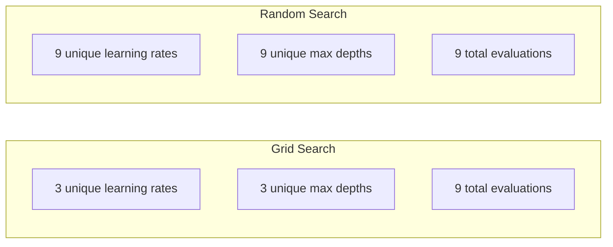
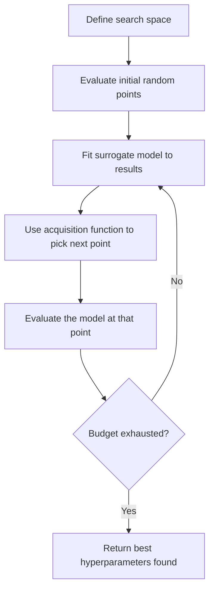
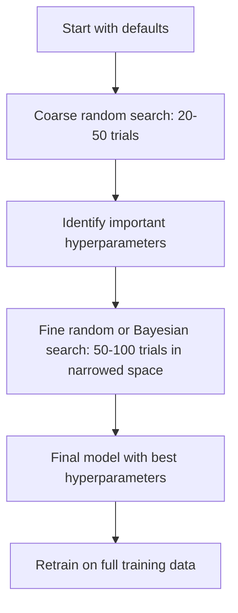
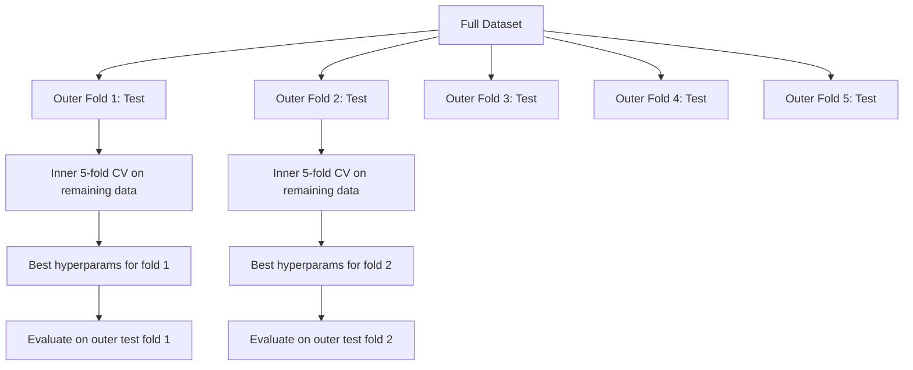

# Apontação de hiperparâmetros

> Os hiperparâmetros são os botões que se giram antes do início do treino.

**Type:** Build
**Language:**Python
**Prerequisites:** Phase 2, Lesson 11 (Ensemble Methods)
**Time:** ~90 minutes

## Objetivos de aprendizagem

- Implementar a pesquisa em rede, pesquisa aleatória e otimização Bayesiana a partir do zero e comparar a eficiência da amostra
- Explique por que a pesquisa aleatória supera a pesquisa em rede quando a maioria dos hiperparâmetros tem uma dimensionalidade eficaz baixa
- Construir um loop de otimização Bayesian usando um modelo substitutivo e função de aquisição para guiar a pesquisa
- Desenhar uma estratégia de sintonização de hiperparâmetros que evite o excesso de encaixe do conjunto de validação através de uma validação cruzada adequada

## O problema

O seu modelo de aumento de gradiente tem uma taxa de aprendizagem, número de árvores, profundidade máxima, min amostras por folha, sub-muestra proporção e coluna proporção de amostras. Isso é seis hiperparâmetros. Se cada um tem 5 valores razoáveis, a grade tem 5 ^ 6 = 15.625 combinações. Treinamento cada leva 10 segundos. Isso é 43 horas de computação para testá-los todos.

A pesquisa de rede é a abordagem óbvia e a pior em escala. A pesquisa aleatória faz melhor com menos computação. A otimização bayesiana faz ainda melhor aprendendo com avaliações passadas. Sabendo qual estratégia usar e quais hiperparâmetros realmente importam, economiza dias de tempo de GPU desperdiçado.

## O conceito

### Parâmetros vs. Hiperparâmetros

Os parâmetros são aprendidos durante o treinamento (pesos, preconceitos, limiares divididos).

| Hyperparameter | What it controls | Typical range |
|---------------|-----------------|---------------|
| Learning rate | Step size per update | 0.001 to 1.0 |
| Number of trees/epochs | How long to train | 10 to 10,000 |
| Max depth | Model complexity | 1 to 30 |
| Regularization (lambda) | Overfitting prevention | 0.0001 to 100 |
| Batch size | Gradient estimation noise | 16 to 512 |
| Dropout rate | Fraction of neurons dropped | 0.0 to 0.5 |

### Pesquisa da Gradeira

A pesquisa de rede avalia cada combinação de valores especificados. É exaustiva e fácil de entender, mas escala exponencialmente com o número de hiperparâmetros.

```
Grid for 2 hyperparameters:

  learning_rate: [0.01, 0.1, 1.0]
  max_depth:     [3, 5, 7]

  Evaluations: 3 x 3 = 9 combinations

  (0.01, 3)  (0.01, 5)  (0.01, 7)
  (0.1,  3)  (0.1,  5)  (0.1,  7)
  (1.0,  3)  (1.0,  5)  (1.0,  7)
```

A pesquisa de rede tem uma falha fundamental: se um hiperparâmetro importa e o outro não, a maioria das avaliações é desperdiçada.

### Pesquisa aleatória

Pesquisas aleatórias de amostras de hiperparâmetros de distribuições em vez de uma grade. Com o mesmo orçamento de 9 avaliações, você obtém 9 valores únicos de cada hiperparâmetro.



Por que o acaso bate à grade (Bergstra & Bengio, 2012):

- A maioria dos hiperparâmetros tem baixa dimensionalidade eficaz. Apenas 1-2 de 6 hiperparâmetros geralmente importam para um determinado problema.
- Avaliações de resíduos de busca em rede em dimensões não importantes.
- A pesquisa aleatória cobre as dimensões importantes mais densamente para o mesmo orçamento.
- Em 60 ensaios aleatórios, você tem 95% de chances de encontrar um ponto dentro de 5% do ótimo (se existe um no espaço de busca).

### Optimização Bayesiana

A pesquisa aleatória ignora os resultados. Não aprende que as altas taxas de aprendizagem causam divergências ou que a profundidade 3 supera consistentemente a profundidade 10.



Os dois componentes fundamentais:

**Surrogate model:**Um modelo barato para avaliar (geralmente um processo gaussiano) que aproxima a função objetiva cara. Ele dá uma previsão e uma estimativa de incerteza em qualquer ponto do espaço de pesquisa.

**Acquisition function:**Decide onde avaliar a seguir, equilibrando a exploração (busca perto de pontos bons conhecidos) e a exploração (busca onde há grande incerteza).

- **Expected Improvement (EI):**Quanto melhoramento em relação ao melhor atual esperamos neste ponto?
- **Upper Confidence Bound (UCB):**Previsão mais um múltiplo de incerteza.
- **Probability of Improvement (PI):**Qual é a probabilidade de este ponto bater o melhor atual?

A otimização bayesiana normalmente encontra melhores hiperparâmetros do que a pesquisa aleatória com 2-5 vezes menos avaliações.

### Parar cedo

Não é necessário que todas as corridas de treinamento terminem. Se uma configuração é claramente ruim após 10 épocas, pare-a e continue.

Estratégias:
- **Patience-based:**Suspende se a perda de validação não tiver melhorado durante N épocas consecutivas
- **Median pruning:**Parar se o resultado intermediário do ensaio for pior do que a média dos ensaios concluídos no mesmo passo
- **Hyperband:**Asignar pequenos orçamentos para muitas configurações, e depois aumentar progressivamente o orçamento para os melhores

A banda-mãe é particularmente eficaz. Inicia 81 configurações com 1 época cada, mantém o terceiro maior, dá-lhes 3 épocas, mantém o terceiro maior, etc. Isso encontra boas configurações 10 a 50 vezes mais rápido do que avaliar todas as configurações para o orçamento completo.

### Programadores de Taxas de Aprendizagem

A taxa de aprendizagem é quase sempre o hiperparâmetro mais importante.

| Scheduler | Formula | When to use |
|-----------|---------|-------------|
| Step decay | Multiply by 0.1 every N epochs | Classic CNN training |
| Cosine annealing | lr * 0.5 * (1 + cos(pi * t / T)) | Modern default |
| Warmup + decay | Linear increase then cosine decay | Transformers |
| One-cycle | Increase then decrease over one cycle | Fast convergence |
| Reduce on plateau | Reduce by factor when metric stalls | Safe default |

### Importância do hiperparâmetro

Não todos os hiperparâmetros importam igualmente. A pesquisa em florestas aleatórias (Probst et al., 2019) e aumento de gradientes mostra padrões consistentes:

**High importance:**
- Taxa de aprendizagem (sempre sintonizar primeiro)
- Número de estimadores/épocas (utilizar paragem precoce em vez de sintonização)
- Força de regularização

**Medium importance:**
- Profundeza máxima / número de camadas
- Minas amostras por folha / decadência de peso
- Relação de submuestras

**Low importance:**
- Características máximas (para florestas aleatórias)
- Escolha de função de ativação específica
- Dimensão do lote (dentro de um intervalo razoável)

Primeiro sintonize as importantes, deixe o resto em padrão.

### Estratégia prática



O fluxo de trabalho concreto:

1. **Start with library defaults.**São escolhidos por profissionais experientes e muitas vezes são 80% do caminho até lá.
2. **Coarse random search.**Largos intervalos, 20 a 50 testes, usar paradas iniciais para matar corridas ruins rapidamente.
3. **Analyze results.**Quais hiperparametros correlacionam com o desempenho?
4. **Fine search.**Optimização Bayesiana ou busca aleatória focada no espaço estreito. 50-100 ensaios.
5. **Retrain on all training data**com os melhores hiperparâmetros encontrados.

### Integração de validação cruzada

A sintonização de hiperparâmetros em uma única divisão de validação é arriscada. Os melhores hiperparâmetros podem se encaixar na dobra de validação específica.

- **Outer loop**(avaliação): divide os dados em treino+val e teste.
- **Inner loop**(tuning): divide o tren+val em tren e val. Encontre os melhores hiperparâmetros.



Cada dobra externa encontra os seus melhores hiperparâmetros de forma independente.

Com sklearn:

```python
from sklearn.model_selection import cross_val_score, GridSearchCV
from sklearn.ensemble import GradientBoostingRegressor

inner_cv = GridSearchCV(
    GradientBoostingRegressor(),
    param_grid={
        "learning_rate": [0.01, 0.05, 0.1],
        "max_depth": [2, 3, 5],
        "n_estimators": [50, 100, 200],
    },
    cv=5,
    scoring="neg_mean_squared_error",
)

outer_scores = cross_val_score(
    inner_cv, X, y, cv=5, scoring="neg_mean_squared_error"
)

print(f"Nested CV MSE: {-outer_scores.mean():.4f} +/- {outer_scores.std():.4f}")
```

Esta é cara (5 pistas externas x 5 pistas internas x 27 pontos de grade = 675 pontos de rede) mas dá-lhe uma estimativa de desempenho confiável.

### Dicas Práticas

**Start with the learning rate.**É sempre o hiperparâmetro mais importante para métodos baseados em gradientes. Uma taxa de aprendizagem ruim torna tudo o mais irrelevante.

**Use log-uniform distributions for learning rate and regularization.**A diferença entre 0,001 e 0,01 é tão importante quanto a diferença entre 0,1 e 1,0.

**Use early stopping instead of tuning n_estimators.**Para a estimativa e redes neurais, definir n_estimatores ou épocas elevadas e deixar que a parada precoce decida quando parar.

**Budget allocation.**Gaste 60% do teu orçamento de sintonia nos dois mais importantes hiperparâmetros. Gaste os 40% restantes em tudo o mais. Os dois primeiros são responsáveis pela maior parte da variação de desempenho.

**Scale matters.**Nunca procure tamanho de lote em uma escala de log (16, 32, 64 são boas). Sempre procure taxa de aprendizagem em uma escala de log. Compare a distribuição da busca com como o hiperparâmetro afeta o modelo.

| Model Type | Top Hyperparameters | Recommended Search | Budget |
|-----------|--------------------|--------------------|--------|
| Random Forest | n_estimators, max_depth, min_samples_leaf | Random search, 50 trials | Low (fast training) |
| Gradient Boosting | learning_rate, n_estimators, max_depth | Bayesian, 100 trials + early stopping | Medium |
| Neural Network | learning_rate, weight_decay, batch_size | Bayesian or random, 100+ trials | High (slow training) |
| SVM | C, gamma (RBF kernel) | Grid on log scale, 25-50 trials | Low (2 params) |
| Lasso/Ridge | alpha | 1D search on log scale, 20 trials | Very low |
| XGBoost | learning_rate, max_depth, subsample, colsample | Bayesian, 100-200 trials + early stopping | Medium |

**When in doubt:**Pesquisa aleatória com 2x o número de hiperparâmetros como ensaios (por exemplo, 6 hiperparâmetros = 12+ ensaios mínimos). Você ficará surpreso com a frequência com que a pesquisa aleatória com 50 ensaios supera a pesquisa de grade cuidadosamente projetada.

```figure
k-fold-cv
```

## Construí-lo

### Passo 1: Pesquisa da Grade desde o zero

O código está em `code/tuning.py`Implementa a busca em rede, a busca aleatória e um simples optimizador bayesiano a partir do zero.

```python
def grid_search(model_fn, param_grid, X_train, y_train, X_val, y_val):
    keys = list(param_grid.keys())
    values = list(param_grid.values())
    best_score = -float("inf")
    best_params = None
    n_evals = 0

    for combo in itertools.product(*values):
        params = dict(zip(keys, combo))
        model = model_fn(**params)
        model.fit(X_train, y_train)
        score = evaluate(model, X_val, y_val)
        n_evals += 1

        if score > best_score:
            best_score = score
            best_params = params

    return best_params, best_score, n_evals
```

### Passo 2: Pesquisa aleatória a partir do zero

```python
def random_search(model_fn, param_distributions, X_train, y_train,
                  X_val, y_val, n_iter=50, seed=42):
    rng = np.random.RandomState(seed)
    best_score = -float("inf")
    best_params = None

    for _ in range(n_iter):
        params = {k: sample(v, rng) for k, v in param_distributions.items()}
        model = model_fn(**params)
        model.fit(X_train, y_train)
        score = evaluate(model, X_val, y_val)

        if score > best_score:
            best_score = score
            best_params = params

    return best_params, best_score, n_iter
```

### Passo 3: Optimização Bayesiana (Simplificada)

A ideia principal: ajustar um processo gaussiano a pares observados (hiperparâmetro, pontuação), em seguida, usar uma função de aquisição para decidir onde procurar a seguir.

```python
class SimpleBayesianOptimizer:
    def __init__(self, search_space, n_initial=5):
        self.search_space = search_space
        self.n_initial = n_initial
        self.X_observed = []
        self.y_observed = []

    def _kernel(self, x1, x2, length_scale=1.0):
        dists = np.sum((x1[:, None, :] - x2[None, :, :]) ** 2, axis=2)
        return np.exp(-0.5 * dists / length_scale ** 2)

    def _fit_gp(self, X_new):
        X_obs = np.array(self.X_observed)
        y_obs = np.array(self.y_observed)
        y_mean = y_obs.mean()
        y_centered = y_obs - y_mean

        K = self._kernel(X_obs, X_obs) + 1e-4 * np.eye(len(X_obs))
        K_star = self._kernel(X_new, X_obs)

        L = np.linalg.cholesky(K)
        alpha = np.linalg.solve(L.T, np.linalg.solve(L, y_centered))
        mu = K_star @ alpha + y_mean

        v = np.linalg.solve(L, K_star.T)
        var = 1.0 - np.sum(v ** 2, axis=0)
        var = np.maximum(var, 1e-6)

        return mu, var

    def _expected_improvement(self, mu, var, best_y):
        sigma = np.sqrt(var)
        z = (mu - best_y) / (sigma + 1e-10)
        ei = sigma * (z * norm_cdf(z) + norm_pdf(z))
        return ei

    def suggest(self):
        if len(self.X_observed) < self.n_initial:
            return sample_random(self.search_space)

        candidates = [sample_random(self.search_space) for _ in range(500)]
        X_cand = np.array([to_vector(c) for c in candidates])
        mu, var = self._fit_gp(X_cand)
        ei = self._expected_improvement(mu, var, max(self.y_observed))
        return candidates[np.argmax(ei)]

    def observe(self, params, score):
        self.X_observed.append(to_vector(params))
        self.y_observed.append(score)
```

O GP surrogado dá duas coisas em cada ponto candidato: uma pontuação prevista (mu) e uma incerteza (var). A Melhoria Esperada equilibra estas: favorece pontos onde o modelo prevê pontuações altas OR onde a incerteza é alta. No início, a maioria dos pontos tem alta incerteza para que o optimizador explore. Mais tarde, foca-se na região mais promissora.

### Passo 4: Compare todos os métodos

Execute os três métodos no mesmo objetivo sintético e compare. Esta comparação usa um envolvente simplificado que chama cada optimizador com uma função objetiva direta (sem treinamento de modelo), de modo que a API difere das implementações baseadas em modelos acima:

```python
def synthetic_objective(params):
    lr = params["learning_rate"]
    depth = params["max_depth"]
    return -(np.log10(lr) + 2) ** 2 - (depth - 4) ** 2 + 10

param_grid = {
    "learning_rate": [0.001, 0.01, 0.1, 1.0],
    "max_depth": [2, 3, 4, 5, 6, 7, 8],
}

grid_best = None
grid_score = -float("inf")
grid_history = []
for combo in itertools.product(*param_grid.values()):
    params = dict(zip(param_grid.keys(), combo))
    score = synthetic_objective(params)
    grid_history.append((params, score))
    if score > grid_score:
        grid_score = score
        grid_best = params

param_dist = {
    "learning_rate": ("log_float", 0.001, 1.0),
    "max_depth": ("int", 2, 8),
}

rand_best = None
rand_score = -float("inf")
rand_history = []
rng = np.random.RandomState(42)
for _ in range(28):
    params = {k: sample(v, rng) for k, v in param_dist.items()}
    score = synthetic_objective(params)
    rand_history.append((params, score))
    if score > rand_score:
        rand_score = score
        rand_best = params

optimizer = SimpleBayesianOptimizer(param_dist, n_initial=5)
bayes_history = []
for _ in range(28):
    params = optimizer.suggest()
    score = synthetic_objective(params)
    optimizer.observe(params, score)
    bayes_history.append((params, score))
bayes_score = max(s for _, s in bayes_history)

print(f"{'Method':<20} {'Best Score':>12} {'Evaluations':>12}")
print("-" * 50)
print(f"{'Grid Search':<20} {grid_score:>12.4f} {len(grid_history):>12}")
print(f"{'Random Search':<20} {rand_score:>12.4f} {len(rand_history):>12}")
print(f"{'Bayesian Opt':<20} {bayes_score:>12.4f} {len(bayes_history):>12}")
```

Com o mesmo orçamento, a otimização bayesiana geralmente encontra a melhor pontuação mais rápida porque não desperdiça avaliações em regiões claramente ruins. A pesquisa aleatória cobre mais terreno do que a pesquisa em grade. A pesquisa em grade só ganha quando você tem muito poucos hiperparâmetros e pode se dar ao luxo de ser exaustivo.

## Usá-lo

### Optuna em prática

Optuna é a biblioteca recomendada para ajustar os hiperparâmetros graves.

```python
import optuna

def objective(trial):
    lr = trial.suggest_float("learning_rate", 1e-4, 1e-1, log=True)
    n_est = trial.suggest_int("n_estimators", 50, 500)
    max_depth = trial.suggest_int("max_depth", 2, 10)

    model = GradientBoostingRegressor(
        learning_rate=lr,
        n_estimators=n_est,
        max_depth=max_depth,
    )
    model.fit(X_train, y_train)
    return mean_squared_error(y_val, model.predict(X_val))

study = optuna.create_study(direction="minimize")
study.optimize(objective, n_trials=100)

print(f"Best params: {study.best_params}")
print(f"Best MSE: {study.best_value:.4f}")
```

Características-chave da Optuna:
- `suggest_float(..., log=True)`Para os parâmetros mais procurados na escala de registro (taxa de aprendizagem, regularização)
- `suggest_int`para parâmetros inteiros
- `suggest_categorical`para escolhas discretas
- MedianPruner integrado para parar precocemente maus testes
- `study.trials_dataframe()`para análise

### Optuna com poda

A poda parava testes pouco promissores cedo, economizando grande computação.

```python
import optuna
from sklearn.model_selection import cross_val_score

def objective(trial):
    params = {
        "learning_rate": trial.suggest_float("lr", 1e-4, 0.5, log=True),
        "max_depth": trial.suggest_int("max_depth", 2, 10),
        "n_estimators": trial.suggest_int("n_estimators", 50, 500),
        "subsample": trial.suggest_float("subsample", 0.5, 1.0),
    }

    model = GradientBoostingRegressor(**params)
    scores = cross_val_score(model, X_train, y_train, cv=3,
                             scoring="neg_mean_squared_error")
    mean_score = -scores.mean()

    trial.report(mean_score, step=0)
    if trial.should_prune():
        raise optuna.TrialPruned()

    return mean_score

pruner = optuna.pruners.MedianPruner(n_startup_trials=10, n_warmup_steps=5)
study = optuna.create_study(direction="minimize", pruner=pruner)
study.optimize(objective, n_trials=200)
```

O `MedianPruner`O processo de corte requer a chamada de um grupo de estudos de medianação.`trial.report()`Para comunicar as métricas intermediárias e `trial.should_prune()`A Comissão deve verificar se o processo deve ser interrompido.`n_startup_trials=10`A redução da quantidade de dados de dados de dados de dados de dados de dados de dados de dados de dados de dados de dados de dados de dados de dados de dados de dados de dados de dados de dados de dados de dados de dados de dados de dados de dados de dados de dados de dados de dados de dados de dados de dados de dados de dados de dados de dados de dados de dados de dados de dados de dados de dados de dados de dados de dados de dados de dados de dados de dados de dados de dados de dados de dados de dados de dados de dados de dados de dados de dados de dados de dados de dados de dados de dados de dados de dados de dados de dados de dados de dados de dados de dados de dados de dados de dados de dados de dados de dados de dados de dados de dados de dados de dados de dados de dados de dados de dados de dados de dados de dados de dados de dados de dados de dados de dados de dados de dados de dados de dados de dados de dados de dados de dados de dados de dados de dados de dados de dados de dados de dados de dados de dados de dados de dados de dados de dados de dados de dados de dados de dados de dados de dados de dados de dados de dados de dados de dados de dados de dados de dados de dados de dados de dados de dados de dados de dados de dados de dados de dados de dados de dados de dados de dados de dados de dados de dados de dados de dados de dados de dados de dados de dados de dados de dados de dados de dados de dados de dados de dados de dados de dados de dados de dados de dados de dados de dados de dados de dados de dados de dados de dados de dados de dados de dados de dados de dados de dados de dados de dados de dados de dados de dados de dados de dados de dados de dados de dados de dados de dados de dados de dados de dados de dados de dados de dados de dados de dados de dados de dados de dados de dados de dados de dados de dados de dados de dados de dados de dados de dados de dados de dados de dados de dados de dados de dados de dados de dados de dados de dados de dados de dados de dados de dados de dados de dados de dados de dados de dados de dados de dados de dados de dados de dados de dados de dados de dados de dados de dados de dados de dados de dados de dados de dados de dados de dados de dados de dados de dados de dados de dados de dados de dados

### - Sim. - Sim. - Sim.

Para experimentos rápidos, sklearn fornece `GridSearchCV`- Não .`RandomizedSearchCV`, e `HalvingRandomSearchCV`- Não .

```python
from sklearn.model_selection import RandomizedSearchCV
from scipy.stats import loguniform, randint

param_dist = {
    "learning_rate": loguniform(1e-4, 0.5),
    "max_depth": randint(2, 10),
    "n_estimators": randint(50, 500),
}

search = RandomizedSearchCV(
    GradientBoostingRegressor(),
    param_dist,
    n_iter=100,
    cv=5,
    scoring="neg_mean_squared_error",
    random_state=42,
    n_jobs=-1,
)
search.fit(X_train, y_train)
print(f"Best params: {search.best_params_}")
print(f"Best CV MSE: {-search.best_score_:.4f}")
```

Utilização`loguniform`A partir da aprendizagem para a taxa de aprendizagem e regularização.`randint`para hiperparâmetros inteiros.`n_jobs=-1`A bandeira é paralela a todos os núcleos da CPU.

### Erros comuns na sintonização de hiperparâmetros

**Data leakage through preprocessing.**Se inserir um escalador no conjunto de dados completo antes da validação cruzada, as informações do pliegue de validação vazam para o treinamento.`Pipeline`Assim, só se encaixa na colcha de treinamento.

**Overfitting to the validation set.**Usar a validação cruzada em ninhos para estimativas finais de desempenho, ou manter um conjunto de testes separado que você nunca toca durante o sintonização.

**Searching too narrow a range.**Se o seu melhor valor estiver no limite do seu espaço de pesquisa, você não pesquisou amplamente o suficiente. O valor ideal pode estar fora do seu alcance. Verifique sempre se os melhores parâmetros estão nas bordas.

**Ignoring interaction effects.**A taxa de aprendizagem e o número de estimadores interagem fortemente para aumentar a taxa de aprendizagem.

**Not using early stopping for iterative models.**Para aumentar o gradiente e redes neurais, definir n_estimatores ou épocas para um valor alto e usar parada precoce.

## Exercícios

1. Exerça pesquisa em rede e pesquisa aleatória com o mesmo orçamento total (por exemplo, 50 avaliações). Comparar as melhores pontuações encontradas. Exerça o experimento 10 vezes com sementes diferentes. Com que frequência a pesquisa aleatória ganha?

2. Implementar a banda hiper desde zero. Comece com 81 configurações, cada uma treinada por 1 época. Mantenha os 1/3 superiores em cada rodada e triplica seu orçamento. Compare computação total (suma de todas as épocas em todas as configurações) para executar 81 configurações para o orçamento completo.

3. Adicionar um cronograma de taxa de aprendizagem (annelamento de cosina) à implementação de gradientes a partir da lição 11.

4. Use Optuna para ajustar um RandomForestClassifier em um conjunto de dados real (por exemplo, o conjunto de dados sobre o cancro da mama de sklearn). Use `optuna.visualization.plot_param_importances(study)`Para ver quais hiperparametros são mais importantes.

5. Implementar uma função de aquisição simples (Melhoramento Esperado) e demonstrar exploração versus exploração.

## Termos-chave

| Term | What people say | What it actually means |
|------|----------------|----------------------|
| Hyperparameter | "A setting you choose" | A value set before training that controls the learning process, not learned from data |
| Grid search | "Try every combination" | Exhaustive search over a specified parameter grid. Exponential cost. |
| Random search | "Just sample randomly" | Sample hyperparameters from distributions. Covers important dimensions better than grid search. |
| Bayesian optimization | "Smart search" | Uses a surrogate model of the objective to decide where to evaluate next, balancing exploration and exploitation |
| Surrogate model | "A cheap approximation" | A model (usually Gaussian process) that approximates the expensive objective function from observed evaluations |
| Acquisition function | "Where to look next" | Scores candidate points by balancing expected improvement with uncertainty. EI and UCB are common choices. |
| Early stopping | "Stop wasting time" | Terminate training early when validation performance stops improving |
| Hyperband | "Tournament bracket for configs" | Adaptive resource allocation: start many configs with small budgets, keep the best and increase their budgets |
| Learning rate scheduler | "Change lr during training" | A function that adjusts the learning rate over the course of training for better convergence |

## Mais leitura

- [Bergstra & Bengio: Random Search for Hyper-Parameter Optimization (2012)](https://jmlr.org/papers/v13/bergstra12a.html)- O jornal que mostrou a grade de batimentos aleatórios
- [Snoek et al., Practical Bayesian Optimization of Machine Learning Algorithms (2012)](https://arxiv.org/abs/1206.2944)-- Optimização Bayesiana para ML
- [Li et al., Hyperband: A Novel Bandit-Based Approach (2018)](https://jmlr.org/papers/v18/16-558.html)- o papel de banda hiper
- [Optuna: A Next-generation Hyperparameter Optimization Framework](https://arxiv.org/abs/1907.10902)- O jornal Optuna
- [Probst et al., Tunability: Importance of Hyperparameters (2019)](https://jmlr.org/papers/v20/18-444.html)-- quais os hiperparâmetros importam
