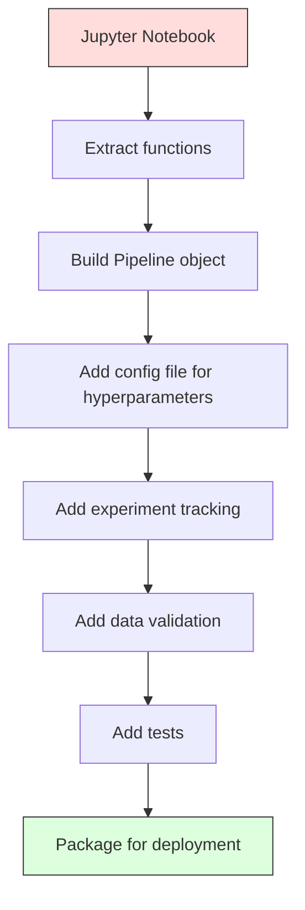

# Tubos de transporte de água

> Um modelo não é um produto, um pipeline é. O pipeline é tudo, desde dados brutos até previsão implementada, e cada passo deve ser reprodutivo.

**Type:** Build
**Language:**Python
**Prerequisites:** Phase 2, Lesson 12 (Hyperparameter Tuning)
**Time:** ~120 minutes

## Objetivos de aprendizagem

- Construir um pipeline de ML a partir do zero que encadeia imputação, escalagem, codificação e treinamento de modelo em um único objeto reprodutível
- Identificar cenários de vazamento de dados e explicar como os canais os impedem montando transformadores apenas em dados de formação
- Construa um ColumnTransformer que aplica diferentes pré-processamento para características numéricas e categorias
- Implementar a serialização dos canais e demonstrar que o mesmo canais montado produz resultados idênticos em formação e produção

## O problema

Tem um bloco de notas que carrega dados, preenche valores faltantes com a mediana, escala características, treina um modelo e imprime precisão.

Um mês depois, alguém reestrena o modelo e obtém resultados diferentes. A mediana foi calculada no conjunto de dados completo, incluindo os dados de ensaio (vazamento de dados). Os parâmetros de escala não foram salvos, por isso a inferência usa estatísticas diferentes. O código de engenharia de recursos foi copiado e colado entre treinamento e serviço, e as cópias divergiram. Uma coluna categórica ganhou um novo valor em produção que o codificador nunca viu.

Estas não são hipotéticas, são as razões mais comuns pelas quais os sistemas ML falham na produção.

## O conceito

### O que é um oleoduto

Um pipeline é uma sequência ordenada de transformações de dados seguido por um modelo. Cada etapa leva a saída da etapa anterior como entrada. Todo o pipeline é montado uma vez em dados de treinamento. No momento da inferência, o mesmo pipeline montado transforma novos dados e produz previsões.


O gasoduto garante:
- As transformações são montadas apenas em dados de formação (sem vazamento)
- As mesmas transformações são aplicadas no momento da inferência
- Todo o objeto pode ser serializado e implantado como um artefato
- A validação cruzada aplica-se ao gasoduto por dobra, evitando uma fuga sutil

### Fugas de dados: O assassino silencioso

O vazamento de dados ocorre quando as informações do conjunto de testes ou dos dados futuros contaminam o treinamento.

**Leaky (wrong):**
```python
X = df.drop("target", axis=1)
y = df["target"]

scaler = StandardScaler()
X_scaled = scaler.fit_transform(X)

X_train, X_test = X_scaled[:800], X_scaled[800:]
y_train, y_test = y[:800], y[800:]
```

O escalador viu dados de teste. O meio e o desvio padrão incluem amostras de teste.

**Correct:**
```python
X_train, X_test = X[:800], X[800:]

scaler = StandardScaler()
X_train_scaled = scaler.fit_transform(X_train)
X_test_scaled = scaler.transform(X_test)
```

Com um gasoduto, não é preciso pensar nisso.

### Escola de condução

O sklearn `Pipeline`Transformadores de cadeia e estimador.`.fit()`- Não .`.predict()`, e `.score()`que aplicam todas as medidas em ordem.

```python
from sklearn.pipeline import Pipeline
from sklearn.preprocessing import StandardScaler
from sklearn.linear_model import LogisticRegression

pipe = Pipeline([
    ("scaler", StandardScaler()),
    ("model", LogisticRegression()),
])

pipe.fit(X_train, y_train)
predictions = pipe.predict(X_test)
```

Quando ligares .`pipe.fit(X_train, y_train)`- Não .
1. As chamadas do escalador .`fit_transform`No comboio X_
2. Modelo de chamadas`fit`no trem X_escalado

Quando ligares .`pipe.predict(X_test)`- Não .
1. As chamadas do escalador .`transform`(não fit_transform) em X_test
2. Modelo de chamadas`predict`no teste X_test em escala

O escalador nunca vê dados de teste durante a montagem.

### ColunaTransformer: diferentes oleodutos para diferentes colunas

Os conjuntos de dados reais têm colunas numéricas e categorias que necessitam de diferentes pré-processamentos. `ColumnTransformer`- Eu trato disto.

```python
from sklearn.compose import ColumnTransformer
from sklearn.preprocessing import StandardScaler, OneHotEncoder
from sklearn.impute import SimpleImputer

numeric_pipe = Pipeline([
    ("impute", SimpleImputer(strategy="median")),
    ("scale", StandardScaler()),
])

categorical_pipe = Pipeline([
    ("impute", SimpleImputer(strategy="most_frequent")),
    ("encode", OneHotEncoder(handle_unknown="ignore")),
])

preprocessor = ColumnTransformer([
    ("num", numeric_pipe, ["age", "income", "score"]),
    ("cat", categorical_pipe, ["city", "gender", "plan"]),
])

full_pipeline = Pipeline([
    ("preprocess", preprocessor),
    ("model", GradientBoostingClassifier()),
])
```

O `handle_unknown="ignore"`Quando uma nova categoria aparece (uma cidade que o modelo nunca viu), ele produz um vetor zero em vez de cair.

### Perseguimento de Experimentos

Um pipeline torna o treinamento reprodutivel, mas também é preciso rastrear o que aconteceu em todos os experimentos: quais os hiperparâmetros usados, qual a versão do conjunto de dados, quais as métricas, qual o código que estava a ser executado.

**MLflow**é a solução de código aberto mais comum:

```python
import mlflow

with mlflow.start_run():
    mlflow.log_param("max_depth", 5)
    mlflow.log_param("n_estimators", 100)
    mlflow.log_param("learning_rate", 0.1)

    pipe.fit(X_train, y_train)
    accuracy = pipe.score(X_test, y_test)

    mlflow.log_metric("accuracy", accuracy)
    mlflow.sklearn.log_model(pipe, "model")
```

Cada execução é gravada com parâmetros, métricas, artefatos e o modelo completo.

**Weights & Biases (wandb)**fornece a mesma funcionalidade com um painel de controle hospedado:

```python
import wandb

wandb.init(project="my-pipeline")
wandb.config.update({"max_depth": 5, "n_estimators": 100})

pipe.fit(X_train, y_train)
accuracy = pipe.score(X_test, y_test)

wandb.log({"accuracy": accuracy})
```

### Modelo de versão

Depois de fazer o rastreamento de experimentos, é preciso gerir as versões do modelo.

O Registo Modelo da MLflow fornece:
- **Version tracking:**Cada modelo salvo recebe um número de versão
- **Stage transitions:**"Stage", "Produzção", "Arquivo"
- **Approval workflow:**Os modelos devem ser explicitamente promovidos à produção
- **Rollback:**Passe para uma versão anterior instantaneamente

### Versão de dados com DVC

O código é versionado com git. Os dados também devem ser versionados, mas git não pode lidar com arquivos grandes.

```
dvc init
dvc add data/training.csv
git add data/training.csv.dvc data/.gitignore
git commit -m "Track training data"
dvc push
```

O DVC armazena os dados reais em armazenamento remoto (S3, GCS, Azure) e mantém um pequeno `.dvc`Quando você verifica um compromisso de Git,`dvc checkout`restaura os dados exatos que foram usados.

Isto significa que cada pin de comitamento de git, tanto o código como os dados, é totalmente reprodutivel.

### Experimentos Reproduíveis

Uma experiência reprodutivel requer quatro coisas:

1. **Fixed random seeds:**Set sementes para numpy, random, e a estrutura (torca, sklearn)
2. **Pinned dependencies:**requirements.txt ou poetry.lock com versões exatas
3. **Versioned data:**DVC ou similares
4. **Config files:**Todos os hiperparâmetros num configurador, não codificados

```python
import numpy as np
import random

def set_seed(seed=42):
    random.seed(seed)
    np.random.seed(seed)
    try:
        import torch
        torch.manual_seed(seed)
        torch.cuda.manual_seed_all(seed)
        torch.backends.cudnn.deterministic = True
    except ImportError:
        pass
```

### Do Notebook ao Pipeline de Produção



A progressão típica:

1. **Notebook exploration:**Experimentos rápidos, visualizações, ideias de recursos
2. **Extract functions:**Mover o pré-processamento, a engenharia de recursos, a avaliação em módulos
3. **Build Pipeline:**Transformações de cadeia em um gasoduto de sklearn ou em uma classe personalizada
4. **Config management:**Mover todos os hiperparâmetros para uma configuração YAML/JSON
5. **Experiment tracking:**Adicionar registros de fluxo ML ou de barras
6. **Data validation:**Verifique esquemas, distribuições e padrões de valores faltantes antes do treinamento
7. **Tests:**Ensaios unitários de transformadores, ensaios de integração para todo o gasoduto
8. **Deployment:**Serialize o gasoduto, enrolem numa API (FastAPI, Flask), contenerize

### Erros comuns no transporte de gasodutos

| Mistake | Why it is bad | Fix |
|---------|-------------|-----|
| Fitting on full data before splitting | Data leakage | Use Pipeline with cross_val_score |
| Feature engineering outside pipeline | Different transforms at train vs serve | Put all transforms in the Pipeline |
| Not handling unknown categories | Production crash on new values | OneHotEncoder(handle_unknown="ignore") |
| Hardcoded column names | Breaks when schema changes | Use column name lists from config |
| No data validation | Silently wrong predictions on bad data | Add schema checks before prediction |
| Training/serving skew | Model sees different features in prod | One Pipeline object for both |

```figure
f3-pipeline-flow
```

## Construí-lo

O código está em `code/pipeline.py`Construirá um oleoduto ML completo a partir do zero:

### Passo 1: Transformador personalizado

```python
class CustomTransformer:
    def __init__(self):
        self.means = None
        self.stds = None

    def fit(self, X):
        self.means = np.mean(X, axis=0)
        self.stds = np.std(X, axis=0)
        self.stds[self.stds == 0] = 1.0
        return self

    def transform(self, X):
        return (X - self.means) / self.stds

    def fit_transform(self, X):
        return self.fit(X).transform(X)
```

### Passo 2: Pipeline a partir do zero

```python
class PipelineFromScratch:
    def __init__(self, steps):
        self.steps = steps

    def fit(self, X, y=None):
        X_current = X.copy()
        for name, step in self.steps[:-1]:
            X_current = step.fit_transform(X_current)
        name, model = self.steps[-1]
        model.fit(X_current, y)
        return self

    def predict(self, X):
        X_current = X.copy()
        for name, step in self.steps[:-1]:
            X_current = step.transform(X_current)
        name, model = self.steps[-1]
        return model.predict(X_current)
```

### Passo 3: Validação cruzada com oleoduto

O código demonstra como a validação cruzada com um pipeline impede a fuga de dados: o escalador é montado separadamente nos dados de formação de cada dobra.

### Passo 4: Pipeline de produção completa com sklearn

Um gasoduto completo com `ColumnTransformer`, vários caminhos de pré-processamento e um modelo, treinado com validação cruzada adequada e registro de experiências.

## Envia-o

Esta lição produz:
- `outputs/prompt-ml-pipeline.md`-- habilidade para construir e depurar os oleodutos ML
- `code/pipeline.py`- um gasoduto completo a partir do zero através de sklearn

## Exercícios

1. Construir um pipeline que trate um conjunto de dados com 3 colunas numéricas e 2 colunas categorias.`ColumnTransformer`Aplicar imputação mediana + escalação para números e imputação mais frequente + codificação de um só calor para categorias. Treinar com validação cruzada de 5 vezes.

2. Introdução deliberada de vazamento de dados: ajuste o escalador no conjunto de dados completo antes de dividir. Compare a pontuação de validação cruzada (queca) com a pontuação de validação cruzada do pipeline (limpo). Quão grande é a diferença?

3. Serialize o seu gasoduto com `joblib.dump`Carregue-o num script separado e execute previsões.

4. Adicione um transformador personalizado ao pipeline que crie características polinômicas (grado 2) para as duas colunas numéricas mais importantes.

5. Configurar o rastreamento de fluxo de fluxo de fluxo de fluxo de fluxo de fluxo de fluxo para o gasoduto.`mlflow ui`) para comparar corridas e escolher o melhor modelo.

## Termos-chave

| Term | What people say | What it actually means |
|------|----------------|----------------------|
| Pipeline | "Chain of transforms + model" | An ordered sequence of fitted transformers and a model, applied as one unit to prevent leakage |
| Data leakage | "Test info leaked into training" | Using information from outside the training set to build the model, inflating performance estimates |
| ColumnTransformer | "Different preprocessing per column" | Applies different pipelines to different subsets of columns, combining results |
| Experiment tracking | "Logging your runs" | Recording parameters, metrics, artifacts, and code versions for every training run |
| MLflow | "Track and deploy models" | Open-source platform for experiment tracking, model registry, and deployment |
| DVC | "Git for data" | Version control system for large data files, storing hashes in git and data in remote storage |
| Model registry | "Model version catalog" | A system that tracks model versions with stage labels (staging, production, archived) |
| Training/serving skew | "It worked in the notebook" | Differences between how data is processed during training versus inference, causing silent errors |
| Reproducibility | "Same code, same result" | The ability to get identical results from the same code, data, and configuration |

## Mais leitura

- [scikit-learn Pipeline docs](https://scikit-learn.org/stable/modules/compose.html)-- a referência oficial do gasoduto
- [MLflow documentation](https://mlflow.org/docs/latest/index.html)-- rastreamento de experiências e registo de modelos
- [DVC documentation](https://dvc.org/doc)-- versão de dados
- [Sculley et al., Hidden Technical Debt in Machine Learning Systems (2015)](https://papers.nips.cc/paper/2015/hash/86df7dcfd896fcaf2674f757a2463eba-Abstract.html)-- o documento seminal sobre a complexidade dos sistemas de ML
- [Google ML Best Practices: Rules of ML](https://developers.google.com/machine-learning/guides/rules-of-ml)-- aconselhamento prático de produção de máquinas de máquinas
