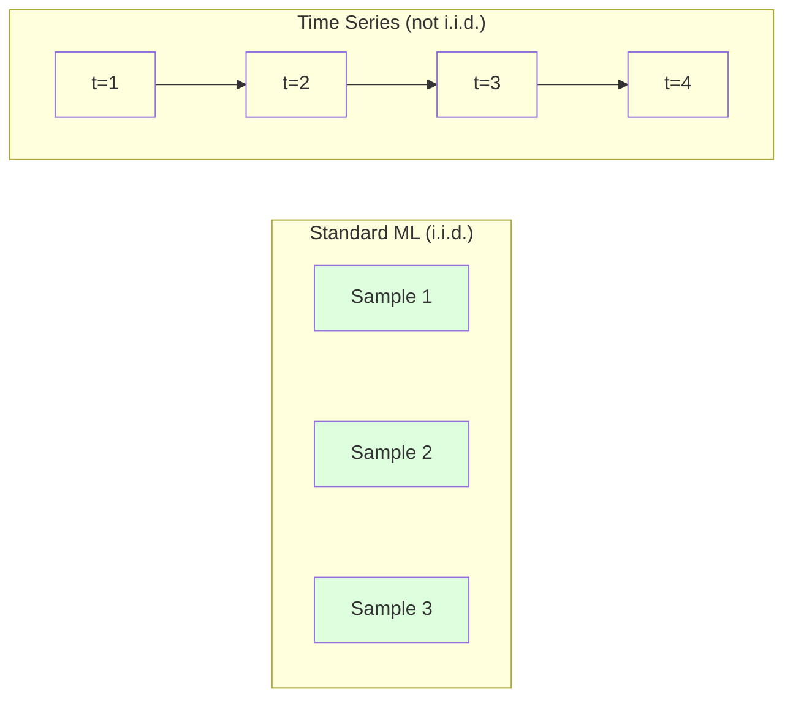
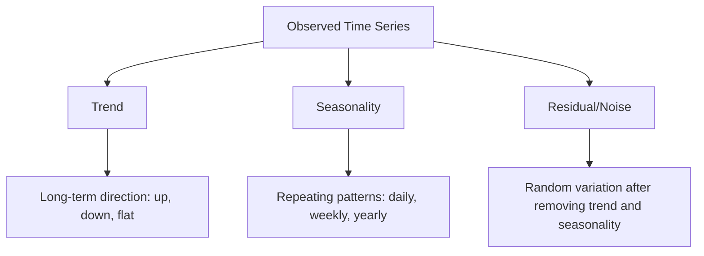
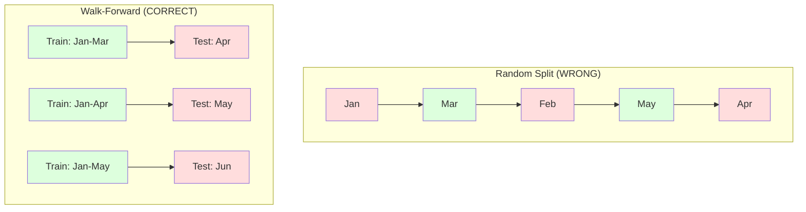

# Fundamentos da série temporal

> O desempenho passado prevê resultados futuros - se verificarmos a estacionalidade primeiro.

**Type:** Build
**Language:**Python
**Prerequisites:** Phase 2, Lessons 01-09
**Time:** ~90 minutes

## Objetivos de aprendizagem

- Descompõe uma série temporal em componentes de tendência, estacionalidade e resíduos e teste de estacionalidade
- Implementar características de atraso e estatísticas de rotação para converter uma série temporal em um problema de aprendizagem supervisionada
- Construir um quadro de validação avançada que impeça a fuga de dados futuros para o treinamento
- Explique por que as divisões aleatórias de trens/testes são inválidas para as séries temporais e demonstre a diferença de desempenho em relação às divisões temporais adequadas

## O problema

Temos dados ordenados por tempo, vendas diárias, temperatura horária, uso de CPU por minuto, preços de ações semanais, queremos prever o próximo valor, a próxima semana, o próximo trimestre.

Você busca o seu conjunto de ferramentas padrão de ML: divisão aleatória de treinamento/teste, validação cruzada, matriz de recursos, previsão. Cada passo é errado.

A série temporal quebra as suposições que o ML padrão depende. As amostras não são independentes - a temperatura de hoje depende da de ontem. As divisões aleatórias vazam informações futuras para o passado. As características que parecem ótimas em backtest falham na produção porque dependem de padrões que mudam ao longo do tempo.

Um modelo que obtém 95% de precisão com validação cruzada aleatória pode obter 55% com avaliação baseada em tempo adequada. A diferença não é uma tecnique. É a diferença entre um modelo que trabalha em papel e um que trabalha na produção.

Esta lição abrange os fundamentos: o que torna os dados do tempo diferentes, como avaliar os modelos honestamente e como transformar uma série de tempos em características que os modelos padrão de ML podem consumir.

## O conceito

### O que torna a série de tempos diferente

A ML padrão assume i.i.d. - independente e distribuída de forma idêntica. Cada amostra é tirada da mesma distribuição, independentemente de outras amostras.

- **Not independent.**O preço das ações de hoje depende do de ontem. As vendas desta semana se correlacionam com as da semana passada.
- **Not identically distributed.**As vendas em Dezembro parecem diferentes das de Março.

Estas violações não são menores, alteram a forma como se construem recursos, como se avaliam modelos e quais algoritmos funcionam.



No ML padrão, as amostras são intercambiáveis. misturando-as não muda nada.

### Componentes de uma série temporal

Cada série de tempos é uma combinação de:



- **Trend**A direcção a longo prazo: crescimento de 10% de receita por ano.
- **Seasonality**A utilização de ar condicionado é de um modo mais elevado em Julho.
- **Residual**Se o resíduo parece ruído branco, a decomposição captura o sinal.

### Estacionalidade

Uma série temporal é estacionária se suas propriedades estatísticas (média, variância, autocorrelação) não mudarem ao longo do tempo.

**Why it matters:**Uma série não estacionária tem uma média que deriva. Um modelo treinado com dados de Janeiro aprendeu uma média diferente do que fevereiro mostrará.

**How to check:**Calcule a média de rolamento e o desvio padrão de rolamento sobre as janelas.

**How to fix:**Diferenciamento: em vez de modelar os valores brutos, modelar a mudança entre os valores consecutivos:

```
diff[t] = value[t] - value[t-1]
```

Se uma rodada de diferenciação não faz com que a série fique estacionária, aplique-a novamente (diferença de segunda ordem).

**Example:**

Série original: [100, 102, 106, 112, 120]
Primeira diferença: [2, 4, 6, 8] (ainda em tendência para cima)
Segunda diferença: [2, 2, 2] (constante -- estacionário)

A série original tinha uma tendência quadrática. A primeira diferenciação tornou-a uma tendência linear. A segunda diferenciação tornou-a plana. Na prática, raramente é necessário mais de duas rodadas.

**Formal test:**O teste Augmented Dickey-Fuller (ADF) é o teste estatístico padrão para estacionalidade. A hipótese nula é "a série é não estacionária". Um p-valor abaixo de 0,05 significa que você pode rejeitar o zero e concluir estacionalidade. Não implementamos ADF do zero (requer tabelas de distribuição assintóticas), mas a abordagem de estatística rodante em nosso código dá uma verificação visual prática.

### Autocorrelação

A autocorrelação mede o quanto um valor no tempo t correlaciona com o valor no tempo t-k (pasos k no passado).

**ACF tells you:**
- Se o ACF cair para zero após o lag 5, os valores de mais de 5 passos atrás são irrelevantes.
- Se a ACF aumenta em atraso de 12 (dados mensais), há estacionalidade anual.
- Usar lags até onde o ACF se torna insignificante.

**PACF (Partial Autocorrelation Function)**Se hoje correlacionar com 3 dias atrás apenas porque ambos correlacionam com ontem, o PACF no lag 3 será zero enquanto o ACF no lag 3 não será.

### Características do Lag: Transformar a série do tempo em aprendizado supervisionado

Os modelos ML padrão precisam de uma matriz de características X e um alvo y. A série temporal dá-lhe uma única coluna de valores.

Tome a série [10, 12, 14, 13, 15] e crie características lag-1 e lag-2:

| lag_2 | lag_1 | target |
|-------|-------|--------|
| 10    | 12    | 14     |
| 12    | 14    | 13     |
| 14    | 13    | 15     |

Agora você tem um problema de regressão padrão. Qualquer modelo ML (regressão linear, floresta aleatória, aumento de gradiente) pode prever o alvo a partir dos lags.

Características adicionais que você pode criar:
- **Rolling statistics:**média, std, min, max sobre os últimos valores k
- **Calendar features:**dia da semana, mês, feriado, fim de semana
- **Differenced values:**alteração em relação à etapa anterior
- **Expanding statistics:**média acumulada, soma acumulada
- **Ratio features:**Valor corrente / média de rotação (quão longe da média recente)
- **Interaction features:**1 * dia_da_semana (efeitos dos dias de semana sobre o impulso)

**How many lags?**Use a função de autocorrelação. Se o ACF for significativo até 10 lag, use pelo menos 10 lags. Se houver estacionalidade semanal, inclua lag 7 (e possivelmente 14).

**The target alignment trap.**Quando se criam características de lag, o objetivo deve ser o valor no tempo t, e todas as características devem usar valores no tempo t-1 ou antes. Se você accidentalmente incluir o valor no tempo t como uma característica, você tem um preditor perfeito - e um modelo completamente inútil. Este é o bug mais comum na engenharia de características de séries temporais.

### Validação de avanço

Esta é a ideia mais importante desta lição. A validação cruzada padrão de k-fold atribui aleatoriamente amostras para treinar e testar. Para séries temporais, isso vazou informações futuras.



Validação de avanço:
1. Traçar dados até o tempo t
2. Previsão no tempo t+1 (ou t+1 a t+k para várias etapas)
3. Deslizar a janela para a frente
4. Repitação

Cada teste contém apenas dados que vêm após todos os dados de treinamento. Não há vazamento futuro. Isso dá uma estimativa honesta de como o modelo irá funcionar quando implantado.

**Expanding window**utiliza todos os dados históricos para a formação (a janela cresce). **Sliding window**Use a expansão quando você acha que dados antigos ainda são relevantes. Use a deslizagem quando o mundo muda e os dados antigos dão mal.

### Intuição ARIMA

ARIMA é o modelo clássico de séries temporais.

- **AR (Autoregressive):**Prevê-lo a partir de valores passados.
- **I (Integrated):**Diferenciamento para obter estacionalidade.
- **MA (Moving Average):**Previsão a partir de erros de previsão passados.

ARIMA ((p, d, q) combina os três.

Não vamos implementar o ARIMA do zero - requer otimização numérica que está além do escopo desta lição. A principal ideia é entender o que cada componente faz para que você possa interpretar os resultados do ARIMA e saber quando usá-lo.

### Quando usar o quê

| Approach | Best For | Handles Seasonality | Handles External Features |
|----------|---------|-------------------|------------------------|
| Lag features + ML | Tabular with many external features | With calendar features | Yes |
| ARIMA | Single univariate series, short-term | SARIMA variant | No (ARIMAX for limited) |
| Exponential smoothing | Simple trend + seasonality | Yes (Holt-Winters) | No |
| Prophet | Business forecasting, holidays | Yes (Fourier terms) | Limited |
| Neural networks (LSTM, Transformer) | Long sequences, many series | Learned | Yes |

Para a maioria dos problemas práticos, os recursos de lag + aumento de gradiente é o ponto de partida mais forte.

### Previsões de horizontes e estratégias

A previsão de um passo prevê um passo de frente.

**Recursive (iterated):**Previnha um passo à frente, use a previsão como entrada para o próximo passo. É simples, mas os erros se acumulam - cada previsão usa a previsão anterior, por isso os erros são compostos.

**Direct:**Treinar um modelo separado para cada horizonte. O modelo-1 prevê t+1, o modelo-5 prevê t+5. Não há acumulação de erros, mas cada modelo tem menos amostras de treinamento e não compartilham informações.

**Multi-output:**Treinar um modelo que sai todos os horizontes simultaneamente. Compartilha informações através de horizontes, mas requer um modelo que suporta múltiplas saídas (ou uma função de perda personalizada).

Para a maioria dos problemas práticos, comece com o recursivo para horizontes curtos (1-5 passos) e direto para horizontes mais longos.

### Erros comuns na série de tempos

| Mistake | Why it happens | How to fix |
|---------|---------------|-----------|
| Random train/test split | Habit from standard ML | Use walk-forward or temporal split |
| Using future features | Feature at time t included by mistake | Audit every feature for temporal alignment |
| Overfitting to seasonality | Model memorizes calendar patterns | Hold out a full seasonal cycle in the test set |
| Ignoring scale changes | Revenue doubles but patterns stay | Model percentage change instead of absolute |
| Too many lag features | "More history is better" | Use ACF to determine relevant lags |
| Not differencing | "The model will figure it out" | Tree models handle trends; linear models need stationarity |

```figure
f3-series-decompose
```

## Construí-lo

O código está em `code/time_series.py`Implementa os blocos de construção do núcleo a partir do zero.

### Criador de características Lag

```python
def make_lag_features(series, n_lags):
    n = len(series)
    X = np.full((n, n_lags), np.nan)
    for lag in range(1, n_lags + 1):
        X[lag:, lag - 1] = series[:-lag]
    valid = ~np.isnan(X).any(axis=1)
    return X[valid], series[valid]
```

Isto converte uma série 1D em uma matriz de características onde cada linha tem a última `n_lags`Os valores são característicos e o valor atual é o objetivo.

### Validação cruzada

```python
def walk_forward_split(n_samples, n_splits=5, min_train=50):
    assert min_train < n_samples, "min_train must be less than n_samples"
    step = max(1, (n_samples - min_train) // n_splits)
    for i in range(n_splits):
        train_end = min_train + i * step
        test_end = min(train_end + step, n_samples)
        if train_end >= n_samples:
            break
        yield slice(0, train_end), slice(train_end, test_end)
```

Cada divisão garante que os dados de treinamento sejam estritamente apresentados antes dos dados de teste.

### Modelo Autoregressivo Simples

Um modelo de AR puro é apenas regressão linear em características de lag:

```python
class SimpleAR:
    def __init__(self, n_lags=5):
        self.n_lags = n_lags
        self.weights = None
        self.bias = None

    def fit(self, series):
        X, y = make_lag_features(series, self.n_lags)
        # Solve via normal equations
        X_b = np.column_stack([np.ones(len(X)), X])
        theta = np.linalg.lstsq(X_b, y, rcond=None)[0]
        self.bias = theta[0]
        self.weights = theta[1:]
        return self
```

Isto é conceptualmente idêntico à regressão linear da lição 02, mas aplicado a versões atrasadas no tempo da mesma variável.

### Verificação de estacionalidade

O código calcula estatísticas de rotação para avaliar visualmente e numericamente a estacionalidade:

```python
def check_stationarity(series, window=50):
    rolling_mean = np.array([
        series[max(0, i - window):i].mean()
        for i in range(1, len(series) + 1)
    ])
    rolling_std = np.array([
        series[max(0, i - window):i].std()
        for i in range(1, len(series) + 1)
    ])
    return rolling_mean, rolling_std
```

Se a deriva média de rolamento ou a std de rolamento mudar, a série não é estacionária.

O código verifica também a estacionalidade comparando a primeira metade e a segunda metade da série. Se os meios diferirem em mais de metade de um desvio padrão ou a relação de variância exceder 2x, a série é sinalizada como não estacionária.

### Autocorrelação

```python
def autocorrelation(series, max_lag=20):
    n = len(series)
    mean = series.mean()
    var = series.var()
    acf = np.zeros(max_lag + 1)
    for k in range(max_lag + 1):
        cov = np.mean((series[:n-k] - mean) * (series[k:] - mean))
        acf[k] = cov / var if var > 0 else 0
    return acf
```

## Usá-lo

Com sklearn, você usa características de lag diretamente com qualquer regressor:

```python
from sklearn.linear_model import Ridge
from sklearn.ensemble import GradientBoostingRegressor

X, y = make_lag_features(series, n_lags=10)

for train_idx, test_idx in walk_forward_split(len(X)):
    model = Ridge(alpha=1.0)
    model.fit(X[train_idx], y[train_idx])
    predictions = model.predict(X[test_idx])
```

Para ARIMA, use modelos estatísticos:

```python
from statsmodels.tsa.arima.model import ARIMA

model = ARIMA(train_series, order=(5, 1, 2))
fitted = model.fit()
forecast = fitted.forecast(steps=30)
```

O código está em `time_series.py`demonstra ambas as abordagens e as compara utilizando a validação avançada.

### sklearn TimeSeriesSplit

sklearn fornece `TimeSeriesSplit`que implementa a validação avançada:

```python
from sklearn.model_selection import TimeSeriesSplit

tscv = TimeSeriesSplit(n_splits=5)
for train_index, test_index in tscv.split(X):
    X_train, X_test = X[train_index], X[test_index]
    y_train, y_test = y[train_index], y[test_index]
    model.fit(X_train, y_train)
    score = model.score(X_test, y_test)
```

Isto é equivalente ao nosso de cero .`walk_forward_split`Mas integrado no quadro de validação cruzada do sklearn.`cross_val_score`- Não .

```python
from sklearn.model_selection import cross_val_score

scores = cross_val_score(model, X, y, cv=TimeSeriesSplit(n_splits=5))
print(f"Mean score: {scores.mean():.4f} +/- {scores.std():.4f}")
```

### Metricas de avaliação

A previsão de séries temporais usa métricas de regressão, mas com contexto consciente do tempo:

- **MAE (Mean Absolute Error):**"Em média, as previsões estão desfeitas em 3,2 graus".
- **RMSE (Root Mean Squared Error):**Raiz quadrada do erro quadrado médio. Penaliza erros grandes mais do que MAE. Use quando erros grandes são piores do que muitos erros pequenos.
- **MAPE (Mean Absolute Percentage Error):**Média de erro / verdadeiro_valor = 100. Independente de escala, útil para comparação entre diferentes séries. Mas indefinido quando os valores verdadeiros são zero.
- **Naive baseline comparison:**Sempre compare com linhas de base simples. A linha de base sazonal ingênua prevê o valor de um período anterior (ontem, na semana passada).

### Características de rolagem

O código demonstra a adição de estatísticas de rotação (média, std, min, max sobre janelas de 7 e 14 dias) para características de lag.

Por exemplo, se a média de rolamento está aumentando, sugere uma tendência ascendente. Se a std de rolamento está aumentando, sugere uma volatilidade crescente. Estes são os tipos de padrões que os modelos baseados em árvores podem aprender, mas os modelos lineares não podem.

## Envia-o

Esta lição produz:
- `outputs/prompt-time-series-advisor.md`-- um aviso para enquadrar os problemas de séries temporais
- `code/time_series.py`-- características de atraso, validação avançada, modelo AR, verificações de estacionalidade

### Linhas de base que você deve superar

Antes de construir qualquer modelo, estabeleça as linhas de base:

1. **Last value (persistence).**Previne que amanhã será o mesmo que hoje.
2. **Seasonal naive.**Preveja que hoje será o mesmo dia da semana passada (ou do ano passado). Se o seu modelo não conseguir vencer isso, não aprendeu nenhum padrão útil além da estacionalidade.
3. **Moving average.**Previnha a média dos últimos valores k.

Se o seu modelo de ML de fantasia perde para a linha de base sazonal ingênua, você tem um bug.

### Dicas Práticas

1. **Start with plotting.**Antes de qualquer modelagem, trace a série crua. Procure tendências, estacionalidade, valores fora da linha, rupturas estruturais (mudanças repentinas no comportamento). Uma inspeção visual de 30 segundos muitas vezes diz mais de uma hora de análise automatizada.

2. **Difference first, model second.**Se a série tiver uma tendência clara, diferencie-a antes de criar características de lag. Os modelos baseados em árvores podem lidar com tendências, mas os modelos lineares não podem, e a diferenciação nunca faz mal.

3. **Hold out at least one full seasonal cycle.**Se tiver uma estacionalidade semanal, o seu conjunto de testes precisa de pelo menos uma semana completa.

4. **Monitor in production.**Os modelos de séries temporais se degradam ao longo do tempo à medida que o mundo muda.

5. **Beware of regime changes.**Um modelo treinado em dados pré-pandêmicos não prevê o comportamento pós-pandêmico. Incluir indicadores de mudanças de regime conhecidas como características, ou usar uma janela deslizante que esqueça dados antigos.

6. **Log-transform skewed series.**Receita, preços e contagens são muitas vezes distorcidos à direita. Tomar o registro estabiliza a variância e torna os padrões multiplicativos aditivos, que os modelos lineares podem lidar.

## Exercícios

1. **Stationarity experiment.**Gerar uma série com uma tendência linear. Verificar a estacionalidade com estatísticas de rolamento. Aplicar a primeira diferenciação. Verificar novamente. Quantas rodadas de diferenciação é necessário para uma tendência quadrática?

2. **Lag selection.**Calcule ACF em uma série sazonal (período = 7). Quais lags têm a maior autocorrelação? Crie características de lag usando apenas esses lags (não lags consecutivos). Melhora a precisão em comparação com o uso de lags 1 a 7?

3. **Walk-forward vs random split.**Treinar uma regressão Ridge em características de lag. Avaliação com divisão aleatória 80/20 e com validação avançada.

4. **Feature engineering.**Adicione a média de rodada (window=7), a std de rodada (window=7), e as características de dia da semana às características de lag. Compare a precisão com e sem esses extras usando validação avançada.

5. **Multi-step forecasting.**Modifique o modelo AR para prever 5 passos à frente em vez de 1. Compare duas estratégias: (a) prever um passo, usar a previsão como entrada para o próximo passo (recursivo) e (b) treinar modelos separados para cada horizonte (directo). Qual é mais preciso?

## Termos-chave

| Term | What people say | What it actually means |
|------|----------------|----------------------|
| Stationarity | "The stats don't change over time" | A series whose mean, variance, and autocorrelation structure are constant over time |
| Differencing | "Subtract consecutive values" | Computing y[t] - y[t-1] to remove trends and achieve stationarity |
| Autocorrelation (ACF) | "How a series correlates with itself" | The correlation between a time series and a lagged copy of itself, as a function of the lag |
| Partial autocorrelation (PACF) | "Direct correlation only" | Autocorrelation at lag k after removing the effect of all shorter lags |
| Lag features | "Past values as inputs" | Using y[t-1], y[t-2], ..., y[t-k] as features to predict y[t] |
| Walk-forward validation | "Time-respecting cross-validation" | Evaluation where training data always precedes test data chronologically |
| ARIMA | "The classic time series model" | AutoRegressive Integrated Moving Average: combines past values (AR), differencing (I), and past errors (MA) |
| Seasonality | "Repeating calendar patterns" | Regular, predictable cycles in a time series tied to calendar periods (daily, weekly, yearly) |
| Trend | "The long-term direction" | A persistent increase or decrease in the series level over time |
| Expanding window | "Use all history" | Walk-forward validation where the training set grows with each fold |
| Sliding window | "Fixed-size history" | Walk-forward validation where the training set is a fixed-length window that slides forward |

## Mais leitura

- [Hyndman and Athanasopoulos, Forecasting: Principles and Practice (3rd ed.)](https://otexts.com/fpp3/)- O melhor livro de texto gratuito sobre previsão de séries temporais
- [scikit-learn Time Series Split](https://scikit-learn.org/stable/modules/generated/sklearn.model_selection.TimeSeriesSplit.html)- O divisor de marcha de sklearn
- [statsmodels ARIMA docs](https://www.statsmodels.org/stable/generated/statsmodels.tsa.arima.model.ARIMA.html)-- Implementação do ARIMA com diagnóstico
- [Makridakis et al., The M5 Competition (2022)](https://www.sciencedirect.com/science/article/pii/S0169207021001874)-- concorrência de previsão em larga escala que mostra métodos de ML versus métodos estatísticos
