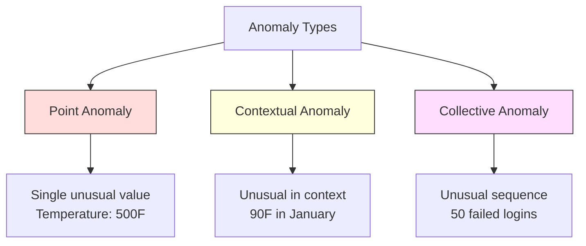
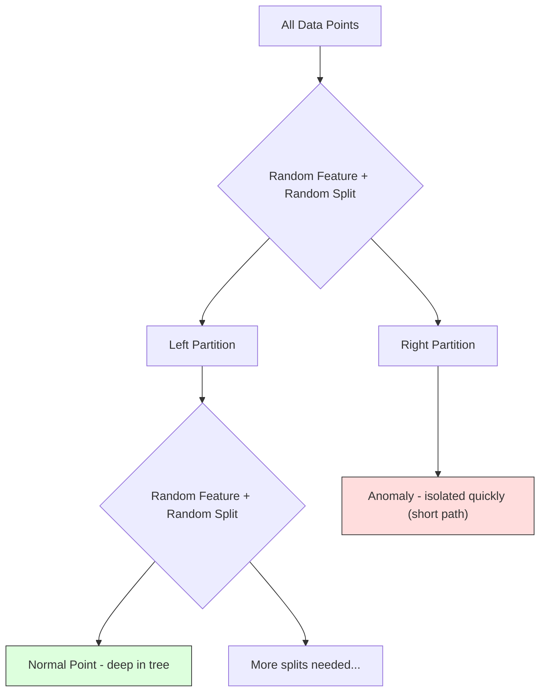
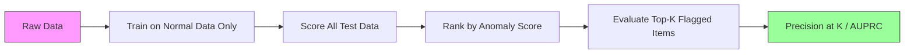

# Detecção de anomalias

> Normal é fácil de definir, anormal é o que não se encaixa.

**Type:** Build
**Language:**Python
**Prerequisites:** Phase 2, Lessons 01-09
**Time:** ~75 minutes

## Objetivos de aprendizagem

- Implementar métodos de detecção de anomalias florestais de zero em termos de pontuação Z, RQI e isolamento
- Distinguir entre anomalias pontuais, contextuais e coletivas e selecionar o método de detecção adequado para cada
- Explicar por que a detecção de anomalias é enquadrada como modelagem de dados normais em vez de classificação de anomalias
- Comparar a detecção de anomalias não supervisionadas com a classificação supervisionada e avaliar a compensação entre a cobertura de anomalias novas e a precisão

## O problema

Um cartão de crédito é usado em Nova York às 14h, depois em Tóquio às 15h05. Um sensor de fábrica lê 150 graus quando a faixa normal é 80-120. Um servidor envia 50.000 solicitações por segundo quando a média diária é 200.

Estas são anomalias, encontrar-as importa, a fraude custa bilhões, falhas de equipamento custam tempo de inatividade, dados de custos de intrusões na rede.

O desafio: raramente têm rotulado exemplos de anomalias. A fraude representa 0,1% das transacções. As falhas de equipamento acontecem algumas vezes por ano. Não se pode treinar um classificador padrão porque não há quase nada na classe de "anomalias" para aprender. Mesmo que você tenha algumas etiquetas, as anomalias que você viu não são os únicos tipos que você encontrará. O esquema de fraude de amanhã parece diferente do de hoje.

A detecção de anomalias inverte o problema. Em vez de aprender o que é anormal, aprenda o que é normal. Qualquer coisa que se desvia do normal é suspeita. Isso funciona sem rótulos, se adapta a novos tipos de anomalias e se escala a conjuntos de dados massivos.

## O conceito

### Tipos de Anomalias

Nem todas as anomalias são iguais:

- **Point anomalies.**Um único ponto de dados incomum, independentemente do contexto.$50,000 from an account that normally spends $- 50 anos.
- **Contextual anomalies.**Um ponto de dados incomum dado o seu contexto. Uma temperatura de 90 graus é normal no verão, anormal no inverno.
- **Collective anomalies.**Uma sequência de pontos de dados que é incomum como um grupo, embora cada ponto individual possa ser normal. Cinco falhas de login é normal. Cinquenta seguidas é um ataque de força bruta.

A maioria dos métodos detecta anomalias de pontos. anomalias contextuais precisam de características de tempo ou localização. anomalias coletivas precisam de métodos conscientes de sequência.



### A enquadramento sem supervisão

Na classificação padrão, você tem rótulos para ambas as classes.

1. **Fully unsupervised.**Não há rótulos, encaixas o detector em todos os dados e espero que as anomalias sejam raras o suficiente para não corromper o modelo "normal".
2. **Semi-supervised.**Você tem um conjunto de dados limpo de dados normais apenas. Você encaixa neste conjunto limpo e pontua tudo o resto. Esta é a configuração mais forte quando possível.
3. **Weakly supervised.**Tem algumas anomalias rotuladas. Usa-as para avaliação, não para treinamento. Treina sem supervisão, depois mede precisão/recall no subconjunto rotulado.

A principal ideia: a detecção de anomalias é fundamentalmente diferente da classificação.

### Supervisados vs. Não Supervisados: A compensação

Se tiverem etiquetado anomalias, devem ser utilizadas para formação (classificação supervisionada) ou apenas para avaliação (detecção não supervisionada)?

**Supervised (treat as classification):**
- Capta os tipos exatos de anomalias que já viste antes
- Precisão mais elevada em tipos de anomalias conhecidos
- Falta-lhe completamente os tipos de anomalias novelas
- Requer reformulação quando surgem novos tipos de anomalias
- Precisa de exemplos suficientes de anomalias (muitas vezes poucos)

**Unsupervised (model normal, flag deviations):**
- Captura qualquer desvio do normal, incluindo os tipos novos
- Não requer anomalias rotuladas
- Taxa de falsos positivos mais elevada (não tudo o que é incomum é ruim)
- Mais robusto para a mudança de distribuição

Na prática, os melhores sistemas combinam ambas as coisas: detecção não supervisionada para uma ampla cobertura, modelos supervisionados para tipos de anomalias conhecidos de alta prioridade e revisão humana para casos ambíguos.

### Método de pontuação Z

A abordagem mais simples: calcular a média e o desvio padrão de cada característica. Marcar qualquer ponto mais que k desvios padrão da média.

```text
z_score = (x - mean) / std
anomaly if |z_score| > threshold
```

O limiar padrão é de 3,0 (99,7% dos dados normais estão dentro de 3 desvios padrão para uma distribuição gaussiana).

**Strengths:**Simples, rápidos, interpretáveis ("este valor é 4,5 desvios padrão do normal").

**Weaknesses:**Supõe que os dados sejam normalmente distribuídos. Sensivel aos valores fora dos dados de treinamento (os valores fora do valor alteram a média e inflacionam o std, tornando-os mais difíceis de detectar).

**When it works well:**Monitorização de uma única característica, onde os dados são aproximadamente em forma de sino. tempos de resposta do servidor, tolerâncias de fabricação, leituras de sensores com linhas de base estáveis.

**When it fails:**Dados de vários clusters (dois locais de escritório com diferentes temperaturas de base), dados distorcidos (montantes de transações em que 1000$ é raro, mas não anômalo), dados com valores fora do conjunto de treinamento.

### Método de RIC

É mais robusto do que o Z-score, usa o interquartile em vez de desvio médio e padrão.

```
Q1 = 25th percentile
Q3 = 75th percentile
IQR = Q3 - Q1
lower_bound = Q1 - factor * IQR
upper_bound = Q3 + factor * IQR
anomaly if x < lower_bound or x > upper_bound
```

O fator padrão é 1.5.

**Strengths:**Robusto a valores fora do normal (os percentil não são afetados por valores extremos). Trabalha em distribuições distorcidas.

**Weaknesses:**Apenas univariado (aplica-se por característica de forma independente). Não pode detectar anomalias incomuns apenas quando as características são consideradas juntas (um ponto pode ser normal em cada característica individualmente, mas anormal no espaço conjunto).

**Practical note:**O fator 1,5 no IQR corresponde aos bigodes de um gráfico de caixa. Os pontos fora dos bigodes são potenciais valores fora. Usando 3,0 em vez de 1,5 torna o detector mais conservador (menos sinais, menos falsos positivos). O fator certo depende da sua tolerância aos falsos alarmes.

### Floresta de isolamento

A principal ideia: as anomalias são poucas e diferentes. Em uma partição aleatória dos dados, as anomalias são mais fáceis de isolar - precisam de menos divisões aleatórias para serem separadas do resto.



**How it works:**
1. Construir muitas árvores aleatórias (uma floresta de isolamento)
2. Em cada nó, escolha uma característica aleatória e um valor de divisão aleatória entre min e max da característica
3. Continue a dividir até que cada ponto seja isolado (em sua própria folha)
4. As anomalias têm comprimentos médios mais curtos de caminhos em todas as árvores

**Why it works:**Os pontos normais vivem em regiões densas. Muitos espaços aleatórios são necessários para isolar um dos seus vizinhos. Anomalias vivem em regiões escassas. Um ou dois espaços aleatórios são suficientes para isolar-los.

A pontuação de anomalia é baseada no comprimento médio de caminho em todas as árvores, normalizada pelo comprimento esperado de caminho de uma árvore de busca binária aleatória:

```
score(x) = 2^(-average_path_length(x) / c(n))
```

Onde ?`c(n)`É o comprimento esperado de caminho para n amostras. A pontuação perto de 1 significa anomalia. A pontuação perto de 0,5 significa normal. A pontuação perto de 0 significa muito normal (profundamente em aglomerados densos).

**Strengths:**Não há hipóteses de distribuição. Funciona em grandes dimensões. Escala bem (sublinear no tamanho da amostra porque cada árvore usa uma subamostra).

**Weaknesses:**Luta com anomalias em regiões densas (efeito de enmascaramento).

**Key hyperparameters:**
- `n_estimators`Numero de árvores. 100 é geralmente suficiente. Mais árvores dão pontuações mais estáveis, mas com uma computação mais lenta.
- `max_samples`O número de amostras por árvore. 256 é o padrão no papel original. Valores menores tornam árvores individuais menos precisas, mas aumentam a diversidade. A sub-sampulação é o que torna a Floresta de Isolamento rápida - cada árvore vê uma pequena fração dos dados.
- `contamination`: Fracção esperada de anomalias. Utilizada apenas para a fixação do limiar.

### Factor local de desvalorização (LOF)

O LOF compara a densidade local em torno de um ponto com a densidade em torno de seus vizinhos.

**How it works:**
1. Para cada ponto, encontrar os seus vizinhos mais próximos k
2. Calcule a densidade de acessibilidade local (quão densa é a vizinhança)
3. Compare a densidade de cada ponto com a densidade de seus vizinhos
4. Se um ponto tem uma densidade muito menor que os seus vizinhos, é um outlier

**LOF score:**
- LOF próximo a 1,0 significa densidade semelhante à dos vizinhos (normal)
- LOF superior a 1,0 significa menor densidade do que os vizinhos (potencialmente anômalo)
- LOF muito maior que 1,0 (por exemplo, 2,0+) significa densidade significativamente menor (anomalia provável)

A parte "local" é crítica. Considere um conjunto de dados com dois aglomerados: um aglomerado denso de 1000 pontos e um aglomerado esparso de 50 pontos. Um ponto na borda do aglomerado esparso não é globalmente incomum - tem 50 vizinhos. Mas é localmente incomum se seus vizinhos imediatos são mais densos do que ele é. LOF capta essa nuância que os métodos globais não têm.

**Strengths:**Detecta anomalias locais (pontos incomuns em sua vizinhança, mesmo que não sejam incomuns globalmente).

**Weaknesses:**Lenta em grandes conjuntos de dados (O(n^2) para implementação ingênua). Sensivel à escolha de k. Não funciona bem em dimensões muito altas (a maldição da dimensionalidade afeta os cálculos de distância).

### Comparativo

| Method | Assumptions | Speed | Handles High Dims | Detects Local Anomalies |
|--------|------------|-------|-------------------|------------------------|
| Z-score | Normal distribution | Very fast | Yes (per feature) | No |
| IQR | None (per feature) | Very fast | Yes (per feature) | No |
| Isolation Forest | None | Fast | Yes | Partially |
| LOF | Distance is meaningful | Slow | Poorly | Yes |

### Desafios de Avaliação

A avaliação dos detectores de anomalias é mais difícil do que a avaliação dos classificadores:

- **Extreme class imbalance.**Com anomalias de 0,1%, prever "normal" para tudo dá 99,9% de precisão.
- **AUROC is misleading.**Com um desequilíbrio pesado, o AUROC pode parecer bom mesmo quando o modelo não apresenta a maioria das anomalias nos limiares práticos.
- **Better metrics:**Precision@k (dos itens marcados com o sinal k superior, quantas são as anomalias reais), AUPRC (área sob curva de recall de precisão) e recall a uma taxa fixa de falso positivo.



### O canal de detecção de anomalias

Na prática, a detecção de anomalias segue este fluxo de trabalho:

1. **Collect baseline data.**Idealmente, um período em que você sabe que não há anomalias (ou muito poucas).
2. **Feature engineering.**Características primas mais características derivadas (estadísticas de rotação, características de tempo, proporções).
3. **Train the detector.**Aplica-se aos dados de base. O modelo aprende como é normal.
4. **Score new data.**Cada nova observação recebe uma pontuação de anomalia.
5. **Threshold selection.**É uma decisão de negócios: um limiar mais elevado significa menos falsos alarmes mas mais anomalias perdidas.
6. **Alert and investigate.**Os pontos marcados são analisados por humanos ou respondidos automaticamente.
7. **Feedback collection.**Registrar se os itens sinalizados foram verdadeiras anomalias ou falsos alarmes.

O pipeline nunca está "feito". As distribuições de dados mudam, novos tipos de anomalias surgem e os limiares precisam ser ajustados.

```figure
f3-anomaly-fence
```

## Construí-lo

O código está em `code/anomaly_detection.py`Implementa o Z-score, o IQR e a Isolação Forest a partir do zero.

### Detector de pontuação Z

```python
def zscore_detect(X, threshold=3.0):
    mean = X.mean(axis=0)
    std = X.std(axis=0)
    std[std == 0] = 1.0
    z = np.abs((X - mean) / std)
    return z.max(axis=1) > threshold
```

Simples e vectorizado.

### Detetor de RIC

```python
def iqr_detect(X, factor=1.5):
    q1 = np.percentile(X, 25, axis=0)
    q3 = np.percentile(X, 75, axis=0)
    iqr = q3 - q1
    iqr[iqr == 0] = 1.0
    lower = q1 - factor * iqr
    upper = q3 + factor * iqr
    outside = (X < lower) | (X > upper)
    return outside.any(axis=1)
```

### Isolamento Floresta do zero

A implementação do zero cria árvores de isolamento que particionam aleatoriamente o espaço de recursos:

```python
class IsolationTree:
    def __init__(self, max_depth):
        self.max_depth = max_depth

    def fit(self, X, depth=0):
        n, p = X.shape
        if depth >= self.max_depth or n <= 1:
            self.is_leaf = True
            self.size = n
            return self
        self.is_leaf = False
        self.feature = np.random.randint(p)
        x_min = X[:, self.feature].min()
        x_max = X[:, self.feature].max()
        if x_min == x_max:
            self.is_leaf = True
            self.size = n
            return self
        self.threshold = np.random.uniform(x_min, x_max)
        left_mask = X[:, self.feature] < self.threshold
        self.left = IsolationTree(self.max_depth).fit(X[left_mask], depth + 1)
        self.right = IsolationTree(self.max_depth).fit(X[~left_mask], depth + 1)
        return self
```

O comprimento do caminho para isolar um ponto determina a sua pontuação de anomalia.

O `IsolationForest`classe envolve várias árvores:

```python
class IsolationForest:
    def __init__(self, n_estimators=100, max_samples=256, seed=42):
        self.n_estimators = n_estimators
        self.max_samples = max_samples

    def fit(self, X):
        sample_size = min(self.max_samples, X.shape[0])
        max_depth = int(np.ceil(np.log2(sample_size)))
        for _ in range(self.n_estimators):
            idx = rng.choice(X.shape[0], size=sample_size, replace=False)
            tree = IsolationTree(max_depth=max_depth)
            tree.fit(X[idx])
            self.trees.append(tree)

    def anomaly_score(self, X):
        avg_path = average path length across all trees
        scores = 2.0 ** (-avg_path / c(max_samples))
        return scores
```

O fator de normalização `c(n)`é o comprimento esperado de uma busca fracassa numa árvore de busca binária com n elementos.`2 * H(n-1) - 2*(n-1)/n`onde`H`Esta normalização garante que as pontuações sejam comparáveis em conjuntos de dados de diferentes tamanhos.

### Scenários de demonstração

O código gera vários cenários de teste:

1. **Single cluster with outliers.**Um aglomerado Gaussiano 2D com anomalias injetadas longe do centro.
2. **Multimodal data.**Três aglomerados de tamanhos e densidades diferentes. Os pontos entre os aglomerados são anómalos.
3. **High-dimensional data.**50 características, mas as anomalias diferem em apenas 5 delas.

Cada demonstração compara todos os métodos usando precisão, recall, F1, e Precision@k.

## Usá-lo

Com sklearn (usando implementações de biblioteca, não a partir do zero):

```python
from sklearn.ensemble import IsolationForest
from sklearn.neighbors import LocalOutlierFactor

iso = IsolationForest(n_estimators=100, contamination=0.05, random_state=42)
iso.fit(X_train)
predictions = iso.predict(X_test)

lof = LocalOutlierFactor(n_neighbors=20, contamination=0.05, novelty=True)
lof.fit(X_train)
predictions = lof.predict(X_test)
```

Nota `contamination`A definição correta é importante - muito baixo deixa de existir anomalias, muito alto cria falsos alarmes.

O código está em `anomaly_detection.py`Comparar implementações a partir do zero com as de sklearn com base nos mesmos dados.

### Parâmetro de Contaminação

O `contamination`O parâmetro no sklearn determina o limiar para a conversão de pontuações de anomalia contínua em previsões binárias.

```python
iso_5 = IsolationForest(contamination=0.05)
iso_10 = IsolationForest(contamination=0.10)
```

Ambos produzem os mesmos resultados de anomalia.`iso_5`- 5%, enquanto `iso_10`Se não conhece a verdadeira taxa de anomalia (normalmente não conhece), configure a contaminação para "automática" e trabalhe diretamente com as pontuações brutas.

### Mudanças de controlo de segurança

Outro detector de anomalias não supervisionado que vale a pena conhecer.

```python
from sklearn.svm import OneClassSVM

oc_svm = OneClassSVM(kernel="rbf", gamma="auto", nu=0.05)
oc_svm.fit(X_train)
predictions = oc_svm.predict(X_test)
```

O `nu`O sistema de análise de dados de classe única funciona bem em conjuntos de dados pequenos e médios, mas não se escala para dados muito grandes (a matriz do núcleo cresce quadraticamente).

### Autoencoder abordagem (previsão)

Os autoencodadores são redes neurais que aprendem a comprimir e reconstruir dados. Treinar em dados normais. No momento do teste, as anomalias têm alto erro de reconstrução porque a rede aprendeu a reconstruir apenas padrões normais.

Isto é coberto na Fase 3 (Depth Learning), mas o princípio é o mesmo: modelo o que é normal, marca o que desvia.

### Ensemble Detecção de Anomalias

Assim como os métodos de conjunto melhoram a classificação (Lessão 11), a combinação de vários detectores de anomalias melhora a detecção.

1. Exercer detectores múltiplos (puntuação Z, IQR, floresta de isolamento, LOF)
2. Normalize as pontuações de cada detector para [0, 1]
3. Mediana das pontuações normalizadas
4. Pontos de bandeira acima do limiar da pontuação média

Isso reduz os falsos positivos porque diferentes métodos têm modos de falha diferentes. Um ponto marcado por todos os quatro métodos é quase certamente anômalo. Um ponto marcado por apenas um pode ser uma peculiaridade desse método.

Os conjuntos mais sofisticados pesam cada detector por sua confiabilidade estimada (medida em um conjunto de validação com anomalias conhecidas, se disponível).

### Considerações de produção

1. **Threshold drift.**A distribuição de dados muda, o limite fixo fica ultrapassado.
2. **Alert fatigue.**Muitos falsos alarmes e operadores deixam de prestar atenção, começando com um limiar elevado (menos, mais confiáveis alertas) e diminuindo-o à medida que a confiança se constrói.
3. **Ensemble approach.**Na produção, combinar vários detectores. Marcar um ponto somente se vários métodos concordarem que é anômalo. Isso reduz significativamente os falsos positivos.
4. **Feature engineering.**As características brutas raramente são suficientes. Adicione estatísticas de rodamento, proporções, tempo desde o último evento e características específicas de domínio.
5. **Feedback loop.**Quando os operadores examinam os itens sinalizados e os confirmam ou rejeitam, enviam-nos de volta ao sistema.

## Envia-o

Esta lição produz:
- `outputs/skill-anomaly-detector.md`- uma habilidade de decisão para escolher o detector certo
- `code/anomaly_detection.py`-- Z-score, IQR e Isolação Forest desde zero, com comparação sklearn

### Escolhendo um limiar

A pontuação de anomalia é contínua, é preciso um limite para tomar decisões binárias, é uma decisão de negócios, não técnica.

Consideremos dois cenários:
- **Fraud detection.**A falta de fraude é cara (reembolso, confiança do cliente).
- **Equipment maintenance.**Um falso alarme significa um desligamento desnecessário que custa muito .$50,000. A missed failure means a $500 mil reparos, fixa o limite para equilibrar os custos.

Em ambos os casos, o limite ideal depende da relação de custos entre falsos positivos e falsos negativos.

### Escalada para produção

Para detecção de anomalias em tempo real na produção:

1. **Batch training, online scoring.**Treinar o modelo periodicamente (diariamente, semanalmente) com dados normais recentes.
2. **Feature computation must match.**Se você treinou com estatísticas de rolamento durante 30 dias, precisa de 30 dias de história para calcular características para uma nova observação.
3. **Score distribution monitoring.**Seguir a distribuição das pontuações de anomalia ao longo do tempo. Se a pontuação média deslocar-se para cima, ou os dados estão a mudar ou o modelo está obsoleto.
4. **Explainability.**Quando marcar uma anomalia, diga porquê. Z-score: "Figura X é de 4,2 desvios padrão acima do normal". Isolação Floresta: "Este ponto foi isolado em 3,1 divisões em média (pontos normais tomam 8,5). "

## Exercícios

1. **Threshold tuning.**Execute o detector de pontuação Z com limiares de 1.0 a 5.0 em etapas de 0.5.

2. **Multivariate anomalies.**Criar dados 2D onde cada característica individual parece normal, mas a combinação é anómala (por exemplo, pontos longe da diagonal do cluster principal). Mostrar que o Z-score por característica perde estes, mas Isolation Forest os pega.

3. **LOF from scratch.**Implementar o Local Outlier Factor usando os vizinhos mais próximos de k. Compare com o LocalOutlierFactor de sklearn nos mesmos dados. Use k=10 e k=50 - como a escolha de k afeta os resultados?

4. **Streaming anomaly detection.**Modifique o detector de pontuação Z para funcionar em uma configuração de streaming: atualize a média e a variância em execução à medida que novos pontos chegam (algoritmo online de Welford).

5. **Real-world evaluation.**Tomar um conjunto de dados com anomalias conhecidas (fraude de cartão de crédito da Kaggle, por exemplo). Avalie os quatro métodos usando precision@100, precision@500 e AUPRC. Qual método funciona melhor? Por quê?

## Termos-chave

| Term | What people say | What it actually means |
|------|----------------|----------------------|
| Anomaly | "Outlier, unusual point" | A data point that deviates significantly from the expected pattern of normal data |
| Point anomaly | "A single weird value" | An individual observation that is unusual regardless of context |
| Contextual anomaly | "Normal value, wrong context" | An observation that is unusual given its context (time, location, etc.) but might be normal in another context |
| Isolation Forest | "Random splits to find outliers" | An ensemble of random trees that isolates anomalies with fewer splits than normal points |
| Local Outlier Factor | "Compare density to neighbors" | A method that flags points whose local density is much lower than their neighbors' density |
| Z-score | "Standard deviations from mean" | (x - mean) / std, measuring how far a point is from the center in units of standard deviation |
| IQR | "Interquartile range" | Q3 - Q1, measuring the spread of the middle 50% of data, used for robust outlier detection |
| Contamination | "Expected fraction of anomalies" | A hyperparameter telling the detector what proportion of the data it should flag as anomalous |
| Precision@k | "Of the top k flags, how many are real" | Precision computed on only the k most suspicious points, useful for imbalanced anomaly detection |
| AUPRC | "Area under precision-recall curve" | A metric that summarizes precision-recall performance across all thresholds, better than AUROC for imbalanced data |

## Mais leitura

- [Liu et al., Isolation Forest (2008)](https://cs.nju.edu.cn/zhouzh/zhouzh.files/publication/icdm08b.pdf)-- o papel original de Isolamento Floresta
- [Breunig et al., LOF: Identifying Density-Based Local Outliers (2000)](https://dl.acm.org/doi/10.1145/342009.335388)-- o papel LOF original
- [scikit-learn Outlier Detection docs](https://scikit-learn.org/stable/modules/outlier_detection.html)-- visão geral de todos os detectores de anomalias de sklearn
- [Chandola et al., Anomaly Detection: A Survey (2009)](https://dl.acm.org/doi/10.1145/1541880.1541882)-- análise abrangente dos métodos de detecção de anomalias
- [Goldstein and Uchida, A Comparative Evaluation of Unsupervised Anomaly Detection Algorithms (2016)](https://journals.plos.org/plosone/article?id=10.1371/journal.pone.0152173)-- comparação empírica de 10 métodos em conjuntos de dados reais
