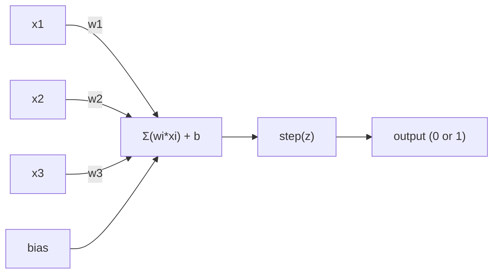
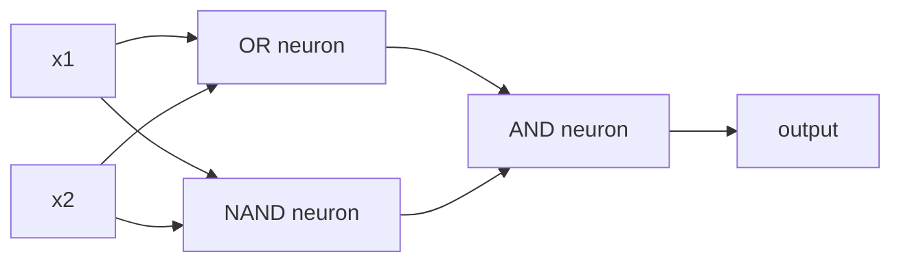

# O Perceptron

> O perceptron é o átomo das redes neurais, se o abrirmos, encontramos pesos, preconceitos e uma decisão.

**Type:** Build
**Languages:** Python
**Prerequisites:** Phase 1 (Linear Algebra Intuition)
**Time:** ~60 minutes

## Objetivos de aprendizagem

- Implementar um perceptron a partir do zero no Python, incluindo a regra de atualização de peso e a função de ativação de passo
- Explique por que um único perceptron só pode resolver problemas linearmente separaveis e demonstre o caso de falha XOR
- Construa um perceptron de várias camadas compondo portas OR, NAND e AND para resolver XOR
- Treinar uma rede de duas camadas com ativação sigmoide e backpropagation para aprender XOR automaticamente

## O problema

Você sabe vetores e produtos de pontos. Você sabe que uma matriz transforma entradas em saídas. Mas como uma máquina *aprende* que transformação usar?

O perceptron responde a isto. É a máquina de aprendizagem mais simples possível: tomar algumas entradas, multiplicar por pesos, adicionar um viés e tomar uma decisão binária. Depois ajustar. É isso. Toda rede neural já construída é camadas desta ideia empilhadas.

Entender o perceptron significa entender o que "aprender" realmente significa em código: ajustar números até que a saída coincida com a realidade.

## O conceito

### Um Neurônio, uma decisão

Um perceptron toma n entradas, multiplica cada uma por um peso, soma-as, adiciona um viés e passa o resultado através de uma função de ativação.



A função de passo é brutal: se a soma ponderada mais o viés é >= 0, saída 1.

```
step(z) = 1  if z >= 0
           0  if z < 0
```

Este é um classificador linear. Os pesos e o viés definem uma linha (ou hiperplano em dimensões mais altas) que divide o espaço de entrada em duas regiões.

### O limite da decisão

Para duas entradas, o perceptron traça uma linha através do espaço 2D:

```
  x2
  ┤
  │  Class 1        /
  │    (0)          /
  │                /
  │               / w1·x1 + w2·x2 + b = 0
  │              /
  │             /     Class 2
  │            /        (1)
  ┼───────────/──────────── x1
```

Tudo de um lado da linha produz 0, tudo do outro lado produz 1. O treinamento move esta linha até que ela separe corretamente as classes.

### A Regra do Aprendizagem

A regra da percepção é simples:

```
For each training example (x, y_true):
    y_pred = predict(x)
    error = y_true - y_pred

    For each weight:
        w_i = w_i + learning_rate * error * x_i
    bias = bias + learning_rate * error
```

Se a previsão for correta, o erro = 0, nada muda. Se ela prevê 0 mas deve ser 1, os pesos aumentam. Se ela prevê 1 mas deve ser 0, os pesos diminuem. A taxa de aprendizagem controla o tamanho de cada ajuste.

### O problema do XOR

Vejam estes portões lógicos:

```
AND gate:           OR gate:            XOR gate:
x1  x2  out         x1  x2  out         x1  x2  out
0   0   0           0   0   0           0   0   0
0   1   0           0   1   1           0   1   1
1   0   0           1   0   1           1   0   1
1   1   1           1   1   1           1   1   0
```

E e OR são linearmente separáveis: você pode desenhar uma única linha para separar os 0s dos 1s. XOR não é. Nenhuma única linha pode separar [0,1] e [1,0] de [0,0] e [1,1].

```
AND (separable):        XOR (not separable):

  x2                      x2
  1 ┤  0     1            1 ┤  1     0
    │     /                 │
  0 ┤  0 / 0              0 ┤  0     1
    ┼──/──────── x1         ┼──────────── x1
       line works!          no single line works!
```

Minsky e Papert provaram isso em 1969 e quase matou a pesquisa de redes neurais durante uma década.

A solução: empilhar perceptrões em camadas. Um perceptron de várias camadas pode resolver XOR combinando duas decisões lineares em uma não linear.

```figure
perceptron-boundary
```

## Construí-lo

### Passo 1: A classe Perceptron

```python
class Perceptron:
    def __init__(self, n_inputs, learning_rate=0.1):
        self.weights = [0.0] * n_inputs
        self.bias = 0.0
        self.lr = learning_rate

    def predict(self, inputs):
        total = sum(w * x for w, x in zip(self.weights, inputs))
        total += self.bias
        return 1 if total >= 0 else 0

    def train(self, training_data, epochs=100):
        for epoch in range(epochs):
            errors = 0
            for inputs, target in training_data:
                prediction = self.predict(inputs)
                error = target - prediction
                if error != 0:
                    errors += 1
                    for i in range(len(self.weights)):
                        self.weights[i] += self.lr * error * inputs[i]
                    self.bias += self.lr * error
            if errors == 0:
                print(f"Converged at epoch {epoch + 1}")
                return
        print(f"Did not converge after {epochs} epochs")
```

### Passo 2: Treinar em portões lógicos

```python
and_data = [
    ([0, 0], 0),
    ([0, 1], 0),
    ([1, 0], 0),
    ([1, 1], 1),
]

or_data = [
    ([0, 0], 0),
    ([0, 1], 1),
    ([1, 0], 1),
    ([1, 1], 1),
]

not_data = [
    ([0], 1),
    ([1], 0),
]

print("=== AND Gate ===")
p_and = Perceptron(2)
p_and.train(and_data)
for inputs, _ in and_data:
    print(f"  {inputs} -> {p_and.predict(inputs)}")

print("\n=== OR Gate ===")
p_or = Perceptron(2)
p_or.train(or_data)
for inputs, _ in or_data:
    print(f"  {inputs} -> {p_or.predict(inputs)}")

print("\n=== NOT Gate ===")
p_not = Perceptron(1)
p_not.train(not_data)
for inputs, _ in not_data:
    print(f"  {inputs} -> {p_not.predict(inputs)}")
```

### Passo 3: Observe o fracasso do XOR

```python
xor_data = [
    ([0, 0], 0),
    ([0, 1], 1),
    ([1, 0], 1),
    ([1, 1], 0),
]

print("\n=== XOR Gate (single perceptron) ===")
p_xor = Perceptron(2)
p_xor.train(xor_data, epochs=1000)
for inputs, expected in xor_data:
    result = p_xor.predict(inputs)
    status = "OK" if result == expected else "WRONG"
    print(f"  {inputs} -> {result} (expected {expected}) {status}")
```

Esta é a prova de que um único perceptron não pode aprender XOR.

### Passo 4: Resolver o XOR com duas camadas

O truque: XOR = (x1 OR x2) E NÃO (x1 E x2). Combine três perceptrões:



```python
def xor_network(x1, x2):
    or_neuron = Perceptron(2)
    or_neuron.weights = [1.0, 1.0]
    or_neuron.bias = -0.5

    nand_neuron = Perceptron(2)
    nand_neuron.weights = [-1.0, -1.0]
    nand_neuron.bias = 1.5

    and_neuron = Perceptron(2)
    and_neuron.weights = [1.0, 1.0]
    and_neuron.bias = -1.5

    hidden1 = or_neuron.predict([x1, x2])
    hidden2 = nand_neuron.predict([x1, x2])
    output = and_neuron.predict([hidden1, hidden2])
    return output


print("\n=== XOR Gate (multi-layer network) ===")
for inputs, expected in xor_data:
    result = xor_network(inputs[0], inputs[1])
    print(f"  {inputs} -> {result} (expected {expected})")
```

A acumulação de perceptrões em camadas cria limites de decisão que nenhum perceptrão pode produzir.

### Passo 5: Treinar uma rede de duas camadas

O passo 4 ligou os pesos à mão. Isso funciona para XOR, mas não para problemas reais onde você não sabe os pesos certos com antecedência. A solução: substituir a função de passo com sigmoide e aprender os pesos automaticamente através da propagação de volta.

```python
class TwoLayerNetwork:
    def __init__(self, learning_rate=0.5):
        import random
        random.seed(0)
        self.w_hidden = [[random.uniform(-1, 1), random.uniform(-1, 1)] for _ in range(2)]
        self.b_hidden = [random.uniform(-1, 1), random.uniform(-1, 1)]
        self.w_output = [random.uniform(-1, 1), random.uniform(-1, 1)]
        self.b_output = random.uniform(-1, 1)
        self.lr = learning_rate

    def sigmoid(self, x):
        import math
        x = max(-500, min(500, x))
        return 1.0 / (1.0 + math.exp(-x))

    def forward(self, inputs):
        self.inputs = inputs
        self.hidden_outputs = []
        for i in range(2):
            z = sum(w * x for w, x in zip(self.w_hidden[i], inputs)) + self.b_hidden[i]
            self.hidden_outputs.append(self.sigmoid(z))
        z_out = sum(w * h for w, h in zip(self.w_output, self.hidden_outputs)) + self.b_output
        self.output = self.sigmoid(z_out)
        return self.output

    def train(self, training_data, epochs=10000):
        for epoch in range(epochs):
            total_error = 0
            for inputs, target in training_data:
                output = self.forward(inputs)
                error = target - output
                total_error += error ** 2

                d_output = error * output * (1 - output)

                saved_w_output = self.w_output[:]
                hidden_deltas = []
                for i in range(2):
                    h = self.hidden_outputs[i]
                    hd = d_output * saved_w_output[i] * h * (1 - h)
                    hidden_deltas.append(hd)

                for i in range(2):
                    self.w_output[i] += self.lr * d_output * self.hidden_outputs[i]
                self.b_output += self.lr * d_output

                for i in range(2):
                    for j in range(len(inputs)):
                        self.w_hidden[i][j] += self.lr * hidden_deltas[i] * inputs[j]
                    self.b_hidden[i] += self.lr * hidden_deltas[i]
```

```python
net = TwoLayerNetwork(learning_rate=2.0)
net.train(xor_data, epochs=10000)
for inputs, expected in xor_data:
    result = net.forward(inputs)
    predicted = 1 if result >= 0.5 else 0
    print(f"  {inputs} -> {result:.4f} (rounded: {predicted}, expected {expected})")
```

Duas diferenças principais do passo 4. Primeiro, sigmoide substitui a função de passo - é lisa, então os gradientes existem.`train`O método propaga o erro para trás da saída para a camada oculta, ajustando cada peso proporcionalmente à sua contribuição para o erro.

Esta é a ponte para a lição 03.`d_output`E ...`hidden_deltas`É a regra da cadeia aplicada ao gráfico da rede.

## Usá-lo

Tudo o que construíste a partir do zero existe numa única importação:

```python
from sklearn.linear_model import Perceptron as SkPerceptron
import numpy as np

X = np.array([[0,0],[0,1],[1,0],[1,1]])
y = np.array([0, 0, 0, 1])

clf = SkPerceptron(max_iter=100, tol=1e-3)
clf.fit(X, y)
print([clf.predict([x])[0] for x in X])
```

Cinco linhas.`Perceptron`A versão sklearn adiciona verificações de convergência, funções de perda múltipla e suporte de entrada escassa - mas o ciclo central é idêntico: soma ponderada, função de passo, atualização de peso em erro.

A diferença real é evidente em escala.

- A função de passo torna-se sigmoide, ReLU, ou outras ativações suaves
- Os pesos são aprendidos automaticamente através da propagação de volta (Lessão 03)
- As camadas ficam mais profundas: 3, 10, 100+ camadas
- O mesmo princípio vale: cada camada cria novas características a partir das saídas da camada anterior

Um único perceptron só pode desenhar linhas retas, empilhá-las e pode desenhar qualquer forma.

## Envia-o

Esta lição produz:
- `outputs/skill-perceptron.md`- uma habilidade que cobre quando são necessárias arquiteturas de camada única versus de camada múltipla

## Exercícios

1. Treinar um perceptron em um gate NAND (o gate universal - qualquer circuito lógico pode ser construído a partir do NAND). Verificar seus pesos e preconceitos formam um limite de decisão válido.
2. Modifique a classe Perceptron para rastrear o limite de decisão (w1*x1 + w2*x2 + b = 0) em cada época.
3. Construir um perceptron de 3 entradas que produz 1 apenas quando pelo menos 2 das 3 entradas são 1 (uma função de voto de maioria).

## Termos-chave

| Term | What people say | What it actually means |
|------|----------------|----------------------|
| Perceptron | "A fake neuron" | A linear classifier: dot product of inputs and weights, plus bias, through a step function |
| Weight | "How important an input is" | A multiplier that scales each input's contribution to the decision |
| Bias | "The threshold" | A constant that shifts the decision boundary, letting the perceptron fire even with zero inputs |
| Activation function | "The thing that squishes values" | A function applied after the weighted sum - step function for perceptrons, sigmoid/ReLU for modern networks |
| Linearly separable | "You can draw a line between them" | A dataset where a single hyperplane can perfectly separate the classes |
| XOR problem | "The thing perceptrons can't do" | Proof that single-layer networks cannot learn non-linearly-separable functions |
| Decision boundary | "Where the classifier switches" | The hyperplane w*x + b = 0 that divides input space into two classes |
| Multi-layer perceptron | "A real neural network" | Perceptrons stacked in layers, where each layer's output feeds the next layer's input |

## Mais leitura

- Frank Rosenblatt, "O Perceptron: Um Modelo Probabilístico para Armazenamento e Organização de Informações no Cerebro" (1958) - o artigo original que começou tudo
- Minsky & Papert, "Perceptrons" (1969) -- o livro que provou que XOR era insolúvel por redes de camada única e matou a pesquisa de perceptron por uma década
- Michael Nielsen, "Networks Neurais e Aprendizagem Profunda", Capítulo 1 (http://neuralnetworksanddeeplearning.com/) -- online gratuito, melhor explicação visual de como os perceptrons compõem em redes
