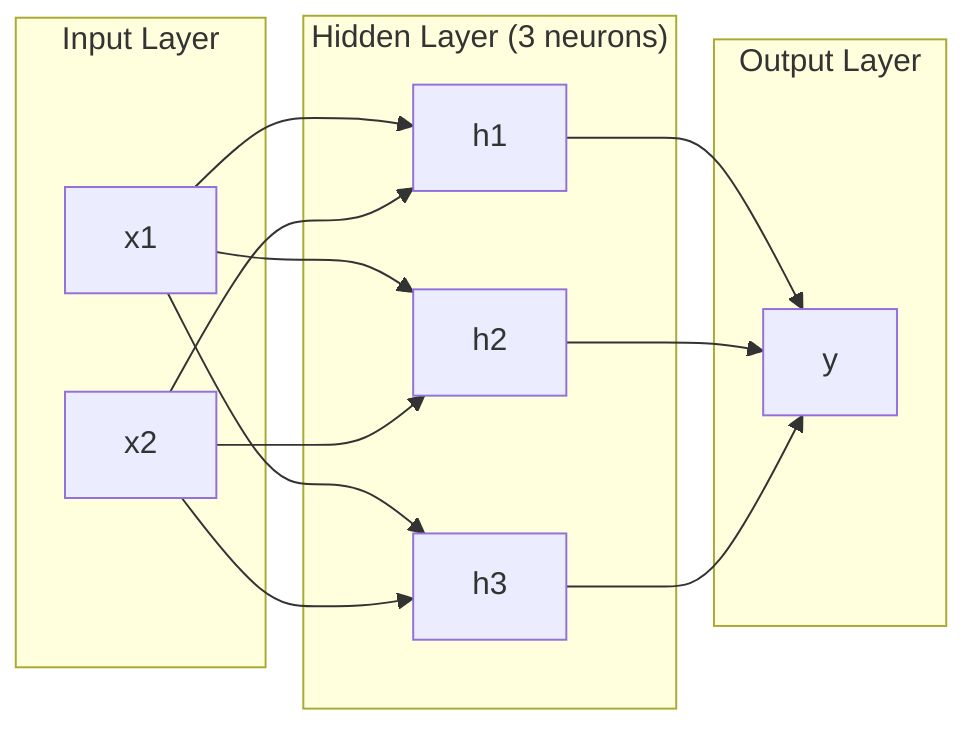
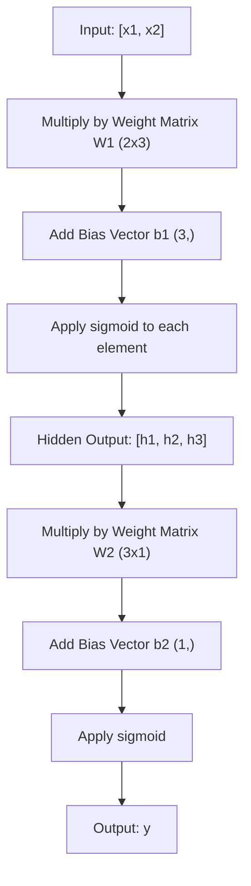
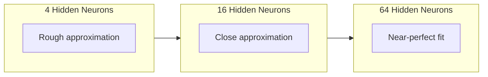

# Redes de várias camadas e passes adicionais

> Um neurônio traça uma linha, enfileira-as e podes desenhar qualquer coisa.

**Type:** Build
**Languages:** Python
**Prerequisites:** Phase 01 (Math Foundations), Lesson 03.01 (The Perceptron)
**Time:** ~90 minutes

## Objetivos de aprendizagem

- Construir uma rede de várias camadas a partir do zero com classes de camadas e redes que executam uma passagem completa para a frente
- Determine as dimensões da matriz através de cada camada de uma rede e identifique as descoincidências de forma
- Explique como a empilhamento de ativações não lineares permite que uma rede aprenda os limites de decisão curvos
- Resolver o problema XOR usando uma arquitetura 2-2-1 com pesos sigmoides sintonizados à mão

## O problema

Um neurônio é um caixão de linhas. É isso. Uma linha reta através dos dados. Todos os problemas reais da IA - reconhecimento de imagens, compreensão de linguagem, jogo de Go - exigem curvas.

Em 1969, Minsky e Papert provaram que essa limitação era fatal: uma rede de camada única não pode aprender XOR. Não "lutas para aprender" - matematicamente não pode. A tabela de verdade XOR coloca [0,1] e [1,0] em um lado, [0,0] e [1,1] no outro. Nenhuma única linha os separa.

Isso eliminou o financiamento de redes neurais por mais de uma década. A solução era óbvia em retrospectiva: parar de usar uma camada. Apilação de neurônios em camadas. Deixe a primeira camada esculpir o espaço de entrada em novas características, e deixe a segunda camada combinar essas características em decisões que nenhuma linha poderia fazer.

Essa pilha é a rede de várias camadas. É a base de todos os modelos de aprendizagem profunda em produção hoje. O passagem para a frente - dados fluindo de entrada através de camadas ocultas para saída - é a primeira coisa que precisamos construir antes que qualquer outra coisa funcione.

## O conceito

### Equipamentos de entrada, secção e saída

Uma rede de várias camadas tem três tipos de camadas:

**Input layer**- não é realmente uma camada. Ele mantém os dados brutos. Duas características significam dois nós de entrada.

**Hidden layers**Cada neurônio toma todas as saídas da camada anterior, aplica pesos e um viés, e depois passa o resultado através de uma função de ativação. "Escondido" porque nunca vê esses valores diretamente nos dados de treinamento.

**Output layer**Para classificação binária, um neurônio com sigmoide. Para multi-classe, um neurônio por classe.



Esta é uma rede 2-3-1. duas entradas, três neurônios escondidos, uma saída. Cada conexão carrega um peso. Cada neurônio (exceto entrada) carrega um viés.

Cada camada produz um vetor de números chamado estado oculto. Para o texto, os estados ocultos aumentam a dimensionalidade - codificando uma palavra como 768 números para capturar significado semântico. Para as imagens, reduzem a dimensionalidade - comprimindo milhões de pixels em uma representação gerenciável. O estado oculto é onde a aprendizagem vive.

### Neurônios e Ativações

Cada neurônio faz três coisas:

1. Multiplicar cada entrada pelo seu peso correspondente
2. Somar todos os produtos e adicionar um preconceito
3. Passe a soma através de uma função de ativação

Por enquanto, a ativação é sigmoide:

```
sigmoid(z) = 1 / (1 + e^(-z))
```

Sigmoid esmagou qualquer número na faixa (0, 1). grandes entradas positivas empurrar para 1. grandes entradas negativas empurrar para 0. mapas zero para 0.5. Esta curva lisa é o que torna possível a aprendizagem - ao contrário do passo difícil do perceptron, sigmoid tem um gradiente em todos os lugares.

### Passagem Avançada: Como os fluxos de dados

O passante avançado empurra dados de entrada através da rede, camada por camada, até que chegue à saída. Não há aprendizado durante o passante avançado. É pura computação: multiplicar, adicionar, ativar, repetir.



Em cada camada, três operações acontecem em sequência:

```
z = W * input + b       (linear transformation)
a = sigmoid(z)           (activation)
```

A saída de uma camada torna-se a entrada para a próxima.

### Dimensões de matriz

As dimensões de rastreamento são a habilidade de depuração mais importante na aprendizagem profunda.

| Step | Operation | Dimensions | Result Shape |
|------|-----------|------------|-------------|
| Input | x | -- | (2,) |
| Hidden linear | W1 * x + b1 | W1: (3, 2), b1: (3,) | (3,) |
| Hidden activation | sigmoid(z1) | -- | (3,) |
| Output linear | W2 * h + b2 | W2: (1, 3), b2: (1,) | (1,) |
| Output activation | sigmoid(z2) | -- | (1,) |

A regra: a matriz de peso W na camada k tem forma (neurônios_in_layer_k, neurônios_in_layer_k_minus_1). As linhas correspondem à camada atual. As colunas correspondem à camada anterior. Se as formas não alinham, você tem um bug.

### Teorema de aproximação universal

Em 1989, George Cybenko provou algo notável: uma rede neural com uma única camada oculta e neurônios suficientes podem aproximar qualquer função contínua de qualquer precisão desejada.

Isso não significa que uma camada oculta seja sempre melhor. Significa que a arquitetura é teoricamente capaz. Na prática, redes mais profundas (mais camadas, menos neurônios por camada) aprendem as mesmas funções com muito menos parâmetros totais do que redes de largura superficial. É por isso que a aprendizagem profunda funciona.

A intuição: cada neurônio na camada oculta aprende um "bump" ou característica. Bumps suficientes colocados nos locais certos podem aproximar qualquer curva lisa. Mais neurônios, mais bumps, melhor aproximação.



### Composibilidade

As redes neurais são compostos. Você pode empilhá-las, acorrentá-las, executá-las em paralelo. Um modelo Whisper usa uma rede de codificadores para processar áudio e uma rede de decodificadores separada para gerar texto. LLM modernos são apenas decodificadores. BERT é apenas encodificador. T5 é encodificador-decodificador. A escolha de arquitetura define o que o modelo pode fazer.

```figure
mlp-forward
```

## Construí-lo

Python puro, sem nada de numpy, todas as operações de matriz escritas a partir do zero.

### Passo 1: Ativação Sigmoide

```python
import math

def sigmoid(x):
    x = max(-500.0, min(500.0, x))
    return 1.0 / (1.0 + math.exp(-x))
```

A sujeira para [500, 500] impede o desbordamento. `math.exp(500)`É grande, mas finito.`math.exp(1000)`É o infinito.

### Passo 2: Classe de camadas

A operação mais importante em toda a aprendizagem profunda é a multiplicação de matriz. Cada camada, cada cabeça de atenção, cada passagem para a frente - são matmulas até ao fundo. Uma camada linear pega um vetor de entrada, multiplica-o por uma matriz de peso e adiciona um vetor de viés: y = Wx + b. Essa equação única é 90% do cálculo em uma rede neural.

Uma camada possui uma matriz de peso e um vetor de viés. Seu método de avanço leva um vetor de entrada e retorna a saída ativada.

```python
class Layer:
    def __init__(self, n_inputs, n_neurons, weights=None, biases=None):
        if weights is not None:
            self.weights = weights
        else:
            import random
            self.weights = [
                [random.uniform(-1, 1) for _ in range(n_inputs)]
                for _ in range(n_neurons)
            ]
        if biases is not None:
            self.biases = biases
        else:
            self.biases = [0.0] * n_neurons

    def forward(self, inputs):
        self.last_input = inputs
        self.last_output = []
        for neuron_idx in range(len(self.weights)):
            z = sum(
                w * x for w, x in zip(self.weights[neuron_idx], inputs)
            )
            z += self.biases[neuron_idx]
            self.last_output.append(sigmoid(z))
        return self.last_output
```

A matriz de peso tem forma (n_neurônios, n_input). Cada linha é o peso de um neurônio em todas as entradas. O método avançado faz circuitos através dos neurônios, calcula a soma ponderada mais o viés, aplica sigmoide e coleta os resultados.

### Passo 3: Classe de rede

Uma rede é uma lista de camadas. A passagem avançada as encadeia: a saída da camada k alimenta a camada k + 1.

```python
class Network:
    def __init__(self, layers):
        self.layers = layers

    def forward(self, inputs):
        current = inputs
        for layer in self.layers:
            current = layer.forward(current)
        return current
```

Isso é todo o passo para a frente. Quatro linhas de lógica. Dados entram, fluem através de cada camada, sai do outro lado.

### Passo 4: XOR com pesos ajustados à mão

Na lição 01, resolvemos XOR combinando perceptrões OR, NAND e AND. Agora faça o mesmo com nossas classes de camada e rede. A arquitetura 2-2-1: duas entradas, dois neurônios ocultos, uma saída.

```python
hidden = Layer(
    n_inputs=2,
    n_neurons=2,
    weights=[[20.0, 20.0], [-20.0, -20.0]],
    biases=[-10.0, 30.0],
)

output = Layer(
    n_inputs=2,
    n_neurons=1,
    weights=[[20.0, 20.0]],
    biases=[-30.0],
)

xor_net = Network([hidden, output])

xor_data = [
    ([0, 0], 0),
    ([0, 1], 1),
    ([1, 0], 1),
    ([1, 1], 0),
]

for inputs, expected in xor_data:
    result = xor_net.forward(inputs)
    predicted = 1 if result[0] >= 0.5 else 0
    print(f"  {inputs} -> {result[0]:.6f} (rounded: {predicted}, expected: {expected})")
```

Os grandes pesos (20, -20) fazem com que o sigmoide agi como uma função de passo. O primeiro neurônio oculto se aproxima de OR. O segundo se aproxima de NAND. O neurônio de saída os combina em AND, que é XOR.

### Passo 5: Classificação de círculos

Um problema mais difícil: classificar pontos 2D como dentro ou fora de um círculo de raio 0,5 centrado na origem. Isto requer um limite de decisão curvo - impossível para um único perceptron.

```python
import random
import math

random.seed(42)

data = []
for _ in range(200):
    x = random.uniform(-1, 1)
    y = random.uniform(-1, 1)
    label = 1 if (x * x + y * y) < 0.25 else 0
    data.append(([x, y], label))

circle_net = Network([
    Layer(n_inputs=2, n_neurons=8),
    Layer(n_inputs=8, n_neurons=1),
])
```

Com pesos aleatórios, a rede não classifica bem. Mas o passante para frente ainda funciona. Este é o ponto - o passante para frente é apenas computação. Aprender os pesos certos é backpropagation, vindo na lição 03.

```python
correct = 0
for inputs, expected in data:
    result = circle_net.forward(inputs)
    predicted = 1 if result[0] >= 0.5 else 0
    if predicted == expected:
        correct += 1

print(f"Accuracy with random weights: {correct}/{len(data)} ({100*correct/len(data):.1f}%)")
```

Pesos aleatórios dão pouca precisão - muitas vezes pior do que adivinhar a classe majoritária. Depois do treinamento (Lessão 03), esta mesma arquitetura com 8 neurônios escondidos desenhará uma fronteira curva que separa o interior do exterior.

## Usá-lo

PyTorch faz tudo acima em quatro linhas:

```python
import torch
import torch.nn as nn

model = nn.Sequential(
    nn.Linear(2, 8),
    nn.Sigmoid(),
    nn.Linear(8, 1),
    nn.Sigmoid(),
)

x = torch.tensor([[0.0, 0.0], [0.0, 1.0], [1.0, 0.0], [1.0, 1.0]])
output = model(x)
print(output)
```

`nn.Linear(2, 8)`é a sua classe de camadas: matriz de peso de forma (8, 2), vetor de desvio de forma (8,). `nn.Sigmoid()`é a função sigmoide aplicada em termos de elementos. `nn.Sequential`é a sua classe de rede: camadas de cadeia em ordem.

A diferença é velocidade e escala. PyTorch funciona em GPUs, lida com lotes de milhões de amostras e calcula automaticamente gradientes para a propagação para trás. Mas a lógica de passagem para a frente é idêntica à que você acabou de construir a partir do zero.

## Envia-o

Esta lição produz um prompt reutilizável para o projeto de arquiteturas de rede:

- `outputs/prompt-network-architect.md`

Use-o quando precisar decidir quantas camadas, quantas neurônios por camada e quais funções de ativação usar para um determinado problema.

## Exercícios

1. Construir uma rede 2-4-2-1 (dois camadas ocultas) e executar a passagem para a frente em dados XOR com pesos aleatórios. Imprimir as saídas da camada oculta intermediária para ver como a representação se transforma em cada camada.

2. Crie o tamanho da camada oculta no classificador de círculo de 8 para 2, e depois para 32.

3. Implementar um `count_parameters`método na classe de rede que retorna o número total de pesos e viés treinables. teste-o em uma rede 784-256-128-10 (a arquitetura clássica MNIST). Quantos parâmetros tem?

4. Construir um pass para a frente para uma rede 3-4-4-2. alimentar-lhe valores de cor RGB (normalizado para 0-1) e observar as duas saídas. Esta é a arquitetura para um classificador de cores simples com duas classes.

5. Substitua o sigmoide por uma função "passo vazado": retorne 0,01 * z se z < 0, então 1.0. Execute a passagem para frente no XOR com os mesmos pesos ajustados à mão da etapa 4.

## Termos-chave

| Term | What people say | What it actually means |
|------|----------------|----------------------|
| Forward pass | "Running the model" | Pushing input through every layer -- multiply by weights, add bias, activate -- to produce an output |
| Hidden layer | "The middle part" | Any layer between input and output whose values are not directly observed in the data |
| Multi-layer network | "A deep neural network" | Layers of neurons stacked sequentially, where each layer's output feeds the next layer's input |
| Activation function | "The nonlinearity" | A function applied after the linear transformation that introduces curves into the decision boundary |
| Sigmoid | "The S-curve" | sigma(z) = 1/(1+e^(-z)), squashes any real number to (0,1), smooth and differentiable everywhere |
| Weight matrix | "The parameters" | A matrix W of shape (current_layer_neurons, previous_layer_neurons) containing learnable connection strengths |
| Bias vector | "The offset" | A vector added after the matrix multiply that lets neurons activate even when all inputs are zero |
| Universal approximation | "Neural nets can learn anything" | A single hidden layer with enough neurons can approximate any continuous function -- but "enough" can mean billions |
| Linear transformation | "The matrix multiply step" | z = W * x + b, the computation before activation, which maps inputs to a new space |
| Decision boundary | "Where the classifier switches" | The surface in input space where the network output crosses the classification threshold |

## Mais leitura

- Michael Nielsen, "Networks Neurais e Aprendizagem Profunda", Capítulo 1-2 (http://neuralnetworksanddeeplearning.com/) -- a explicação mais clara e livre de passes avançados e estrutura de rede, com visualizações interativas
- Cybenko, "Aproximação por Superposições de uma Função Sigmoidal" (1989) - o original papel do teorema de aproximação universal, surpreendentemente legível
- 3Blue1Brown, "Mas o que é uma rede neural?"https://www.youtube.com/watch?v=aircAruvnKk) -- 20 minutos de caminhada visual através de camadas, pesos e passes para a frente que construem o modelo mental certo
- O Conselho Europeu de Administração e de Desenvolvimento Económico e Social (CEP)https://www.deeplearningbook.org/) -- a referência padrão para redes de várias camadas, gratuita em linha
