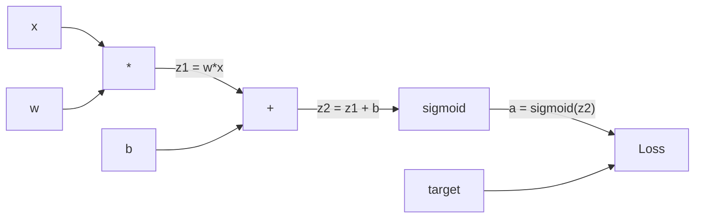
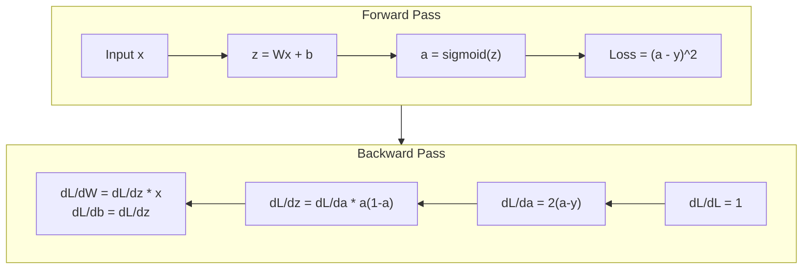
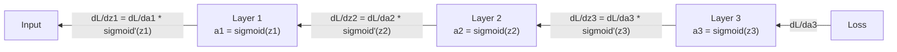

# Propagação para trás a partir de zero

> A backpropagation é o algoritmo que torna possível a aprendizagem. Sem ela, as redes neurais são apenas caros geradores de números aleatórios.

**Type:** Build
**Languages:** Python
**Prerequisites:** Lesson 03.02 (Multi-Layer Networks)
**Time:** ~120 minutes

## Objetivos de aprendizagem

- Implementar um motor de autogrado baseado em valores que construa um gráfico computacional e calcula gradientes através de triagem topológica
- Derivar o passe para trás para adição, multiplicação e sigmoide usando a regra da cadeia
- Treinar uma rede de várias camadas em XOR e classificação de círculo usando apenas o seu motor de propagação de volta do zero
- Identificar o problema de gradiente desaparecendo em redes sigmoides profundas e explicar por que os gradientes encolhem exponencialmente

## O problema

A sua rede tem uma única camada oculta com 768 entradas e 3072 saídas. Isso é 2.359.296 pesos. Ele fez uma previsão errada. Quais pesos causaram o erro? Testar cada peso individualmente significa 2.3 milhões de passes para frente. A propagação para trás calcula todos os 2,3 milhões de gradientes em uma única passagem para trás. Isso não é uma otimização. Essa é a diferença entre treinável e impossível.

A abordagem ingênua: pegue um peso, empurra-o por uma pequena quantidade, volte a passar para a frente, mede se a perda subiu ou caiu. Isso dá-lhe o gradiente para esse peso. Agora faça-o para cada peso na rede. Multiplica por milhares de passos de treinamento e milhões de pontos de dados. Você precisaria de tempo geológico para treinar qualquer coisa útil.

A propagação para trás resolve isto. Uma passagem para frente, uma passagem para trás, todos os gradientes computados. O truque é a regra da cadeia do cálculo, aplicada sistematicamente a um gráfico computacional. Este é o algoritmo que tornou o aprendizado profundo prático. Sem ele, ainda estaríamos presos em problemas de brinquedo.

## O conceito

### A Regra da Cadeia, aplicável às redes

Você viu a regra da cadeia na fase 01, lição 05. Resumo rápido: se y = f(g(x)), então dy/dx = f'(g(x)) * g'(x. Você multiplica derivadas ao longo da cadeia.

Em uma rede neural, a "cadeia" é a sequência de operações da entrada à perda. Cada camada aplica pesos, adiciona viés, passa por uma ativação. A função de perda compara a saída final ao alvo. A backpropagation rastreia essa cadeia para trás, calculaindo como cada operação contribuiu para o erro.

### Gráficos computacionais

Cada passagem para a frente constrói um gráfico. Cada nó é uma operação (multiplicar, adicionar, sigmoide). Cada borda carrega um valor para a frente e um gradiente para trás.



Passagem para a frente: os valores fluem de esquerda para direita. x e w produzem z1 = w*x. Adicionar b para obter z2. Sigmoid dá a ativação a. Compare a a meta y usando a função de perda.

Passagem para trás: os gradientes fluem de direita para esquerda. Comece com dL/da (como as perdas mudam com a ativação). Multiplica por da/dz2 (derivada sigmoide). Isso dá dL/dz2. Divida em dL/db (que é igual a dL/dz2, já que z2 = z1 + b) e dL/dz1.

Cada nó no gráfico tem um trabalho durante a passagem para trás: tomar o gradiente que vem de cima, multiplicar pela sua derivada local e passar para baixo.

### Para a frente versus para trás



O passante dianteiro armazena todos os valores intermediários: z, a, as entradas para cada camada. O passante traseiro precisa desses valores armazenados para calcular gradientes. Este é o trade-off de memória-computação no coração do backprop. Você troca memória (ativações de armazenamento) por velocidade (um passante em vez de milhões).

### Fluxo gradual através de uma rede

Para uma rede de três camadas, cadeia de gradientes através de cada camada:



Em cada camada, o gradiente é multiplicado pela derivada sigmoide. A derivada sigmoide é um * (1 - a), que maximiza em 0,25 (quando a = 0,5).

### Os gradientes desaparecem

Este é o problema do gradiente desaparecendo. Sigmoide esmagam sua saída entre 0 e 1. Sua derivada é sempre menor que 0.25.

```
sigmoid(z):     Output range [0, 1]
sigmoid'(z):    Max value 0.25 (at z = 0)

After 5 layers:   gradient * 0.25^5 = 0.001x original
After 10 layers:  gradient * 0.25^10 = 0.000001x original
```

É por isso que as redes sigmoides profundas são quase impossíveis de treinar. A solução - ReLU e suas variantes - é o assunto da lição 04. Por enquanto, entenda que o backprop funciona perfeitamente.

### Derivar gradientes para uma rede de duas camadas

Matemática concreta para uma rede com entrada x, camada oculta com sigmoide, camada de saída com sigmoide e perda de MSE.

Passagem para a frente:
```
z1 = W1 * x + b1
a1 = sigmoid(z1)
z2 = W2 * a1 + b2
a2 = sigmoid(z2)
L = (a2 - y)^2
```

Passagem para trás (aplicando a regra da cadeia passo a passo):
```
dL/da2 = 2(a2 - y)
da2/dz2 = a2 * (1 - a2)
dL/dz2 = dL/da2 * da2/dz2 = 2(a2 - y) * a2 * (1 - a2)

dL/dW2 = dL/dz2 * a1
dL/db2 = dL/dz2

dL/da1 = dL/dz2 * W2
da1/dz1 = a1 * (1 - a1)
dL/dz1 = dL/da1 * da1/dz1

dL/dW1 = dL/dz1 * x
dL/db1 = dL/dz1
```

Cada gradiente é um produto de derivadas locais rastreadas pela perda.

```figure
backprop-vanishing
```

## Construí-lo

### Passo 1: O Nodo de Valor

Cada número em nosso cálculo torna-se um Valor. Ele armazena os seus dados, o seu gradiente e como foi criado (assim sabe como calcular gradientes para trás).

```python
class Value:
    def __init__(self, data, children=(), op=''):
        self.data = data
        self.grad = 0.0
        self._backward = lambda: None
        self._children = set(children)
        self._op = op

    def __repr__(self):
        return f"Value(data={self.data:.4f}, grad={self.grad:.4f})"
```

Não há ainda gradiente (0, 0).`_children`rastrear quais valores produziram este, para que possamos topologicamente ordenar o gráfico mais tarde.

### Passo 2: Operações com funções retrógradas

Cada operação cria um novo valor e define como os gradientes fluem para trás através dele.

```python
def __add__(self, other):
    other = other if isinstance(other, Value) else Value(other)
    out = Value(self.data + other.data, (self, other), '+')

    def _backward():
        self.grad += out.grad
        other.grad += out.grad

    out._backward = _backward
    return out

def __mul__(self, other):
    other = other if isinstance(other, Value) else Value(other)
    out = Value(self.data * other.data, (self, other), '*')

    def _backward():
        self.grad += other.data * out.grad
        other.grad += self.data * out.grad

    out._backward = _backward
    return out
```

Para adição: d(a+b)/da = 1, d(a+b)/db = 1. Então ambas as entradas obtêm o gradiente da saída diretamente.

Para multiplicação: d(a*b)/da = b, d(a*b)/db = a. Cada entrada obtém o valor do outro vezes o gradiente de saída.

O `+=`O valor pode ser usado em múltiplas operações.

### Passo 3: Sigmoide e perda

```python
import math

def sigmoid(self):
    x = self.data
    x = max(-500, min(500, x))
    s = 1.0 / (1.0 + math.exp(-x))
    out = Value(s, (self,), 'sigmoid')

    def _backward():
        self.grad += (s * (1 - s)) * out.grad

    out._backward = _backward
    return out
```

Derivada sigmoide: sigmoide(x) * (1 - sigmoide(x)). Nós calculamos sigmoide(x) = s durante a passagem para a frente. Reutilizar.

```python
def mse_loss(predicted, target):
    diff = predicted + Value(-target)
    return diff * diff
```

MSE para uma única saída: (previsto - meta) ^ 2. Expresso subtração como adição com um valor negado.

### Passo 4: Passagem para trás

A classificação topológica garante que processemos os nós na ordem certa - o gradiente de um nó é completamente acumulado antes de se propagarmos através dele.

```python
def backward(self):
    topo = []
    visited = set()

    def build_topo(v):
        if v not in visited:
            visited.add(v)
            for child in v._children:
                build_topo(child)
            topo.append(v)

    build_topo(self)
    self.grad = 1.0
    for v in reversed(topo):
        v._backward()
```

Comece na perda (gradiente = 1.0, já que dL/dL = 1).`_backward`empurra gradientes para os seus filhos.

### Passo 5: camada e rede

```python
import random

class Neuron:
    def __init__(self, n_inputs):
        scale = (2.0 / n_inputs) ** 0.5
        self.weights = [Value(random.uniform(-scale, scale)) for _ in range(n_inputs)]
        self.bias = Value(0.0)

    def __call__(self, x):
        act = sum((wi * xi for wi, xi in zip(self.weights, x)), self.bias)
        return act.sigmoid()

    def parameters(self):
        return self.weights + [self.bias]


class Layer:
    def __init__(self, n_inputs, n_outputs):
        self.neurons = [Neuron(n_inputs) for _ in range(n_outputs)]

    def __call__(self, x):
        out = [n(x) for n in self.neurons]
        return out[0] if len(out) == 1 else out

    def parameters(self):
        params = []
        for n in self.neurons:
            params.extend(n.parameters())
        return params


class Network:
    def __init__(self, sizes):
        self.layers = []
        for i in range(len(sizes) - 1):
            self.layers.append(Layer(sizes[i], sizes[i + 1]))

    def __call__(self, x):
        for layer in self.layers:
            x = layer(x)
            if not isinstance(x, list):
                x = [x]
        return x[0] if len(x) == 1 else x

    def parameters(self):
        params = []
        for layer in self.layers:
            params.extend(layer.parameters())
        return params

    def zero_grad(self):
        for p in self.parameters():
            p.grad = 0.0
```

Um Neurônio toma entradas, calcula a soma ponderada + viés e aplica sigmoide. Escalas de inicialização de peso por sqrt(2/n_input) para evitar a saturação sigmoide em redes mais profundas. Uma camada é uma lista de neurônios. Uma rede é uma lista de camadas.`parameters()`O método recolhe todos os valores apropriados para que possamos atualizá-los.

### Passo 6: Trem no XOR

```python
random.seed(42)
net = Network([2, 4, 1])

xor_data = [
    ([0.0, 0.0], 0.0),
    ([0.0, 1.0], 1.0),
    ([1.0, 0.0], 1.0),
    ([1.0, 1.0], 0.0),
]

learning_rate = 1.0

for epoch in range(1000):
    total_loss = Value(0.0)
    for inputs, target in xor_data:
        x = [Value(i) for i in inputs]
        pred = net(x)
        loss = mse_loss(pred, target)
        total_loss = total_loss + loss

    net.zero_grad()
    total_loss.backward()

    for p in net.parameters():
        p.data -= learning_rate * p.grad

    if epoch % 100 == 0:
        print(f"Epoch {epoch:4d} | Loss: {total_loss.data:.6f}")

print("\nXOR Results:")
for inputs, target in xor_data:
    x = [Value(i) for i in inputs]
    pred = net(x)
    print(f"  {inputs} -> {pred.data:.4f} (expected {target})")
```

Observe a diminuição da perda, desde previsões aleatórias até correções de saídas XOR, impulsionadas inteiramente por gradientes de computação de propagação de volta e empurrando pesos na direção certa.

### Passo 7: Classificação de círculos

Na lição 02, você ajudou pesos à mão para classificação de círculos. Agora deixe a rede aprender.

```python
random.seed(7)

def generate_circle_data(n=100):
    data = []
    for _ in range(n):
        x1 = random.uniform(-1.5, 1.5)
        x2 = random.uniform(-1.5, 1.5)
        label = 1.0 if x1 * x1 + x2 * x2 < 1.0 else 0.0
        data.append(([x1, x2], label))
    return data

circle_data = generate_circle_data(80)

circle_net = Network([2, 8, 1])
learning_rate = 0.5

for epoch in range(2000):
    random.shuffle(circle_data)
    total_loss_val = 0.0
    for inputs, target in circle_data:
        x = [Value(i) for i in inputs]
        pred = circle_net(x)
        loss = mse_loss(pred, target)
        circle_net.zero_grad()
        loss.backward()
        for p in circle_net.parameters():
            p.data -= learning_rate * p.grad
        total_loss_val += loss.data

    if epoch % 200 == 0:
        correct = 0
        for inputs, target in circle_data:
            x = [Value(i) for i in inputs]
            pred = circle_net(x)
            predicted_class = 1.0 if pred.data > 0.5 else 0.0
            if predicted_class == target:
                correct += 1
        accuracy = correct / len(circle_data) * 100
        print(f"Epoch {epoch:4d} | Loss: {total_loss_val:.4f} | Accuracy: {accuracy:.1f}%")
```

Usamos SGD online aqui - atualizar pesos após cada amostra em vez de acumular o lote completo. Isso quebra a simetria mais rápido e evita a saturação sigmoide no cenário de perda completa.

Não há ajuste manual. A rede descobre a fronteira circular de decisão por conta própria. É o poder da propagação de volta: você define a arquitetura, a função de perda e os dados. O algoritmo calcula os pesos.

## Usá-lo

PyTorch faz tudo acima em algumas linhas. A ideia central é idêntica - autograd construi um gráfico computacional durante o passo para a frente e o rastreia para trás para calcular gradientes.

```python
import torch
import torch.nn as nn

model = nn.Sequential(
    nn.Linear(2, 4),
    nn.Sigmoid(),
    nn.Linear(4, 1),
    nn.Sigmoid(),
)
optimizer = torch.optim.SGD(model.parameters(), lr=1.0)
criterion = nn.MSELoss()

X = torch.tensor([[0,0],[0,1],[1,0],[1,1]], dtype=torch.float32)
y = torch.tensor([[0],[1],[1],[0]], dtype=torch.float32)

for epoch in range(1000):
    pred = model(X)
    loss = criterion(pred, y)
    optimizer.zero_grad()
    loss.backward()
    optimizer.step()

print("PyTorch XOR Results:")
with torch.no_grad():
    for i in range(4):
        pred = model(X[i])
        print(f"  {X[i].tolist()} -> {pred.item():.4f} (expected {y[i].item()})")
```

`loss.backward()`É o teu .`total_loss.backward()`- Não .`optimizer.step()`É o seu manual.`p.data -= lr * p.grad`- Não .`optimizer.zero_grad()`É o teu .`net.zero_grad()`O PyTorch lida com a aceleração da GPU, precisão mista, controle de gradientes e centenas de tipos de camadas. Mas o passão para trás é a mesma regra de cadeia aplicada ao mesmo gráfico computacional.

O treino faz a passagem para a frente, depois a passagem para trás, depois atualiza os pesos. A inferência só corre a passagem para a frente. Sem gradientes, sem atualizações. Esta distinção é importante porque a inferência é o que acontece na produção. Quando chamamos uma API como Claude ou GPT, estamos a fazer inferências. A nossa resposta vai para a frente através da rede e os tokens saem do outro lado. Não há mudanças de peso. Entender o backprop é importante porque formava todo o peso naquela rede.

## Envia-o

Esta lição produz:
- `outputs/prompt-gradient-debugger.md`-- um prompt reutilizável para diagnosticar problemas de gradiente (desaparecimento, explosão, NaN) em qualquer rede neural

## Exercícios

1. Adicionar um`__sub__`O método para a classe de Valor (a - b = a + (-1 * b)).`__neg__`Verificar que os gradientes são corretos comparando com o cálculo manual para uma expressão simples como (a - b) ^ 2.

2. Adicionar um`relu`O método para Valor (output max ((0, x), derivado é 1 se x > 0, então 0). Substitua sigmoide com relú nas camadas ocultas e treine novamente no XOR. Compare velocidade de convergência. Você deve ver treinamento mais rápido - esta prévia lição 04.

3. Implementar um `__pow__`método sobre Valor para potências inteiras.`mse_loss`com um adequado`(predicted - target) ** 2`Verifique se os gradientes correspondem à implementação original.

4. Adicionar cortes de gradiente ao loop de treinamento: após a chamada `backward()`O que é que você tem de fazer é fazer uma comparação entre curvas de perda com e sem corte. Esta é a sua primeira defesa contra gradientes explosivos.

5. Construir uma visualização: após o treinamento em XOR, imprimir o gradiente de cada parâmetro da rede. Identificar qual camada tem os gradientes mais pequenos. Isso demonstra o problema de gradiente desaparecendo sobre o que você leu na seção Concept.

## Termos-chave

| Term | What people say | What it actually means |
|------|----------------|----------------------|
| Backpropagation | "The network learns" | An algorithm that computes dL/dw for every weight by applying the chain rule backward through the computational graph |
| Computational graph | "The network structure" | A directed acyclic graph where nodes are operations and edges carry values (forward) and gradients (backward) |
| Chain rule | "Multiply the derivatives" | If y = f(g(x)), then dy/dx = f'(g(x)) * g'(x) -- the mathematical foundation of backpropagation |
| Gradient | "The direction of steepest ascent" | The partial derivative of the loss with respect to a parameter -- tells you how to change that parameter to reduce the loss |
| Vanishing gradient | "Deep networks don't learn" | Gradients shrink exponentially as they propagate through layers with saturating activations like sigmoid |
| Forward pass | "Running the network" | Computing the output from inputs by sequentially applying each layer's operations and storing intermediate values |
| Backward pass | "Computing gradients" | Traversing the computational graph in reverse, accumulating gradients at each node using the chain rule |
| Learning rate | "How fast it learns" | A scalar that controls the step size when updating weights: w_new = w_old - lr * gradient |
| Topological sort | "The right order" | An ordering of graph nodes where each node appears after all nodes it depends on -- ensures gradients are fully accumulated before propagation |
| Autograd | "Automatic differentiation" | A system that builds computational graphs during forward computation and automatically computes gradients -- what PyTorch's engine does |

## Mais leitura

- Rumelhart, Hinton & Williams, "Aprender representações por erros de propagação de volta" (1986) - o artigo que fez da propagação de volta o treinamento de rede de várias camadas
- 3Blue1Brown, série "Networks Neural" (https://www.youtube.com/playlist?list=PLZHQObOWTQDNU6R1_67000Dx_ZCJB-3pi) -- a melhor explicação visual da propagação de volta e do fluxo de gradientes através das redes
