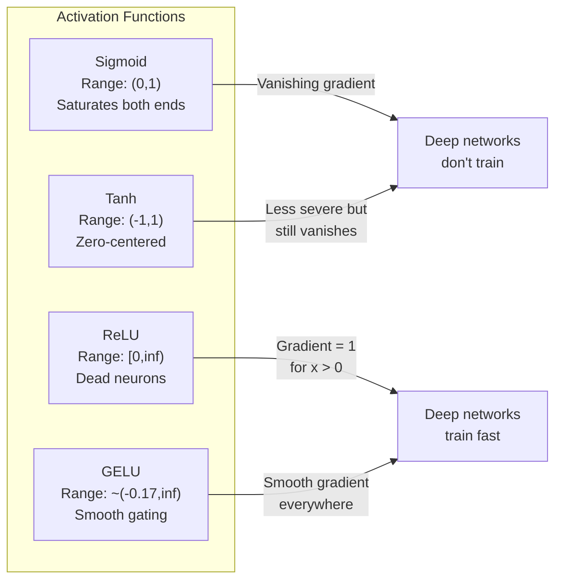
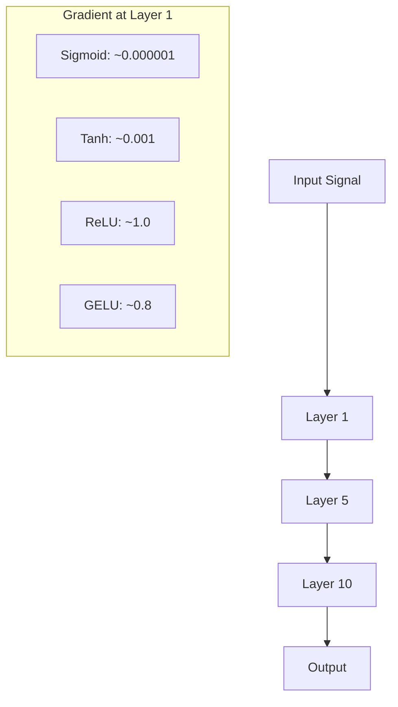
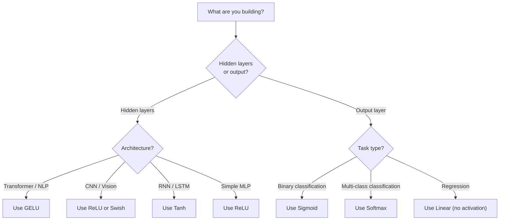

# Funções de ativação

> Sem a não linearidade, a rede de 100 camadas é um multiplicador de matriz sofisticado.

**Type:** Build
**Languages:** Python
**Prerequisites:** Lesson 03.03 (Backpropagation)
**Time:** ~75 minutes

## Objetivos de aprendizagem

- Implementar sigmoide, tanh, ReLU, Leaky ReLU, GELU, Swish e softmax com os seus derivados a partir do zero
- Diagnóstico do problema de gradiente desaparecendo através da medição de magnitudes de ativação através de 10+ camadas com diferentes ativações
- Detectar neurônios mortos numa rede ReLU e explicar por que GELU evita este modo de falha
- Selecione a função de ativação correta para uma determinada arquitetura (transformador, CNN, RNN, camada de saída)

## O problema

Estape duas transformações lineares: y = W2 ((W1x + b1) + b2. Expandir: y = W2W1x + W2b1 + b2. Isso é apenas y = Ax + c - uma única transformação linear. Não importa quantas camadas lineares você estape, o resultado desmorona para uma matriz multiplicar. Sua rede de 100 camadas tem o mesmo poder de representação que uma única camada.

Isto não é uma curiosidade teórica. Significa que uma rede linear profunda literalmente não pode aprender XOR, não pode classificar um conjunto de dados em espiral, não pode reconhecer um rosto. Sem funções de ativação, a profundidade é uma ilusão.

As funções de ativação quebram a linearidade. Eles distorcem a saída de cada camada através de uma função não linear, dando à rede a capacidade de dobrar os limites de decisão, aproximar funções arbitrárias e realmente aprender. Mas escolha a ativação errada e os seus gradientes desaparecem para zero (sigmoide em redes profundas), explodem para infinito (ativações ilimitadas sem inicialização cuidadosa), ou os seus neurônios morrem permanentemente (ReLU com grandes preconceitos negativos). A escolha da função de ativação determina diretamente se a sua rede aprende.

## O conceito

### Por que é necessário não-linearidade

A multiplicação de matriz é compostavel. Multiplicar um vetor pela matriz A, então a matriz B é idêntico a multiplicar por AB. Isso significa que apilar dez camadas lineares é matematicamente equivalente a uma camada linear com uma grande matriz. Todos esses parâmetros, toda essa profundidade - desperdiçado. Você precisa de algo para quebrar a cadeia. É isso que as funções de ativação fazem.

Aqui está a prova. Uma camada linear calcula f ((x) = Wx + b.

```
Layer 1: h = W1 * x + b1
Layer 2: y = W2 * h + b2
```

Substituto:

```
y = W2 * (W1 * x + b1) + b2
y = (W2 * W1) * x + (W2 * b1 + b2)
y = A * x + c
```

Uma camada. Insira uma ativação não linear g (() entre as camadas:

```
h = g(W1 * x + b1)
y = W2 * h + b2
```

Agora a substituição se rompe. W2 * g(W1 * x + b1) + b2 não pode ser reduzida a uma única transformação linear. A rede pode representar funções não lineares. Cada camada adicional com uma ativação adiciona capacidade de representação.

### Sigmoide

A função de ativação original para redes neurais.

```
sigmoid(x) = 1 / (1 + e^(-x))
```

Intervalo de saída: (0, 1). Suave, diferenciável, mapeia qualquer número real a um valor semelhante à probabilidade.

O derivado:

```
sigmoid'(x) = sigmoid(x) * (1 - sigmoid(x))
```

O valor máximo desta derivada é de 0,25, ocorrendo em x = 0. Na propagação para trás, os gradientes se multiplicam através de camadas. Dez camadas de sigmoide significa que o gradiente é multiplicado pelo máximo 0,25 dez vezes:

```
0.25^10 = 0.000000953674
```

Menos de um milionésimo do sinal original. Este é o problema do gradiente desaparecendo. Os gradientes nas camadas iniciais tornam-se tão pequenos que os pesos mal atualizam. A rede parece aprender - a perda diminui nas camadas posteriores - mas as primeiras camadas estão congeladas. As redes sigmoides profundas simplesmente não treinam.

O problema adicional é que as saídas sigmoides são sempre positivas (0 a 1), o que significa que os gradientes nos pesos são sempre o mesmo sinal.

### Tanh

A versão centrada do sigmoide.

```
tanh(x) = (e^x - e^(-x)) / (e^x + e^(-x))
```

Intervalo de saída: (-1, 1). Centrado em zero, o que elimina o problema do zigzag.

O derivado:

```
tanh'(x) = 1 - tanh(x)^2
```

A derivada máxima é de 1,0 em x = 0 - quatro vezes melhor do que o sigmoide. Mas o problema do gradiente desaparecendo ainda existe. Para grandes entradas positivas ou negativas, a derivada se aproxima de zero. Dez camadas ainda esmagam o gradiente, apenas menos agressivamente.

### ReLU: O avanço

Corrigida Unidade Linear. Popularizada para aprendizagem profunda por Nair e Hinton em 2010 (a função em si data do trabalho de Fukushima de 1969), mudou tudo.

```
relu(x) = max(0, x)
```

O intervalo de saída: [0, infinito).

```
relu'(x) = 1  if x > 0
            0  if x <= 0
```

Não há gradiente de desaparecimento para entradas positivas. O gradiente é exatamente 1, passado diretamente através. É por isso que redes profundas tornaram-se treinaveis - ReLU preserva magnitude de gradiente em todas as camadas.

Mas há um modo de falha: o problema de neurônios mortos. Se a entrada ponderada de um neurônio é sempre negativa (devido a um grande viés negativo ou uma initialização de peso infeliz), sua saída é sempre zero, seu gradiente é sempre zero e nunca atualiza. É permanentemente morto. Na prática, 10-40% dos neurônios em uma rede ReLU podem morrer durante o treinamento.

### ReLU em fuga

A solução mais simples para neurónios mortos.

```
leaky_relu(x) = x        if x > 0
                alpha * x if x <= 0
```

Onde o alfa é uma pequena constante, normalmente 0,01. O lado negativo tem uma pequena inclinação em vez de zero, por isso os neurônios mortos ainda recebem um sinal de gradiente e podem recuperar.

### GELU: O Default Moderno

Unidade linear de erro de Gaussian. Introduzida por Hendrycks e Gimpel em 2016. Ativação padrão em BERT, GPT e a maioria dos transformadores modernos.

```
gelu(x) = x * Phi(x)
```

Onde Phi ((x) é a função de distribuição cumulativa da distribuição normal padrão.

```
gelu(x) ~= 0.5 * x * (1 + tanh(sqrt(2/pi) * (x + 0.044715 * x^3)))
```

O GELU é suave em todos os lugares, permite pequenos valores negativos (ao contrário do ReLU que faz clips rígidos para zero) e tem uma interpretação probabilística: pesa cada entrada por quão provável é que seja positiva sob uma distribuição gaussiana.

### Swis / SiLU

Ativação auto-guardada descoberta por Ramachandran et al. em 2017 através de pesquisa automatizada.

```
swish(x) = x * sigmoid(x)
```

O Swish é formalmente x * sigmoid ((x). O Google descobriu-o através de pesquisas automatizadas sobre o espaço de função de ativação -- uma rede neural que projeta partes de redes neurais.

Como o GELU, é liso, não monótono e permite pequenos valores negativos. A diferença é sutil: o Swish usa sigmoid para gating enquanto o GELU usa o CDF gaussiano. Na prática, o desempenho é quase idêntico.

### Softmax: Ativação de saída

Não é usado em camadas ocultas. Softmax converte um vetor de pontuações brutas (logits) em uma distribuição de probabilidade.

```
softmax(x_i) = e^(x_i) / sum(e^(x_j) for all j)
```

Cada saída é entre 0 e 1. Todas as saídas somam a 1. Isso torna-a a ativação final padrão para classificação de várias classes. A logit maior obtém a maior probabilidade, mas ao contrário de argmax, softmax é diferenciável e preserva informações sobre confiança relativa.

### Comparação de formas



### Comparação de fluxo gradual



### Qual ativação quando



```figure
softmax-temperature
```

## Construí-lo

### Passo 1: Implementar todas as funções de ativação com derivados

Cada função leva uma única flutuação e retorna uma flutuação.

```python
import math

def sigmoid(x):
    x = max(-500, min(500, x))
    return 1.0 / (1.0 + math.exp(-x))

def sigmoid_derivative(x):
    s = sigmoid(x)
    return s * (1 - s)

def tanh_act(x):
    return math.tanh(x)

def tanh_derivative(x):
    t = math.tanh(x)
    return 1 - t * t

def relu(x):
    return max(0.0, x)

def relu_derivative(x):
    return 1.0 if x > 0 else 0.0

def leaky_relu(x, alpha=0.01):
    return x if x > 0 else alpha * x

def leaky_relu_derivative(x, alpha=0.01):
    return 1.0 if x > 0 else alpha

def gelu(x):
    return 0.5 * x * (1 + math.tanh(math.sqrt(2 / math.pi) * (x + 0.044715 * x ** 3)))

def gelu_derivative(x):
    phi = 0.5 * (1 + math.erf(x / math.sqrt(2)))
    pdf = math.exp(-0.5 * x * x) / math.sqrt(2 * math.pi)
    return phi + x * pdf

def swish(x):
    return x * sigmoid(x)

def swish_derivative(x):
    s = sigmoid(x)
    return s + x * s * (1 - s)

def softmax(xs):
    max_x = max(xs)
    exps = [math.exp(x - max_x) for x in xs]
    total = sum(exps)
    return [e / total for e in exps]
```

### Passo 2: Visualize onde os gradientes morrem

Calcule o gradiente em 100 pontos uniformemente espaçados de -5 a 5. Imprima um histograma de texto que mostra onde o gradiente de cada ativação é próximo de zero.

```python
def gradient_scan(name, derivative_fn, start=-5, end=5, n=100):
    step = (end - start) / n
    near_zero = 0
    healthy = 0
    for i in range(n):
        x = start + i * step
        g = derivative_fn(x)
        if abs(g) < 0.01:
            near_zero += 1
        else:
            healthy += 1
    pct_dead = near_zero / n * 100
    print(f"{name:15s}: {healthy:3d} healthy, {near_zero:3d} near-zero ({pct_dead:.0f}% dead zone)")

gradient_scan("Sigmoid", sigmoid_derivative)
gradient_scan("Tanh", tanh_derivative)
gradient_scan("ReLU", relu_derivative)
gradient_scan("Leaky ReLU", leaky_relu_derivative)
gradient_scan("GELU", gelu_derivative)
gradient_scan("Swish", swish_derivative)
```

### Passo 3: Experimento Gradiente de Desaparecimento

Passar um sinal para a frente através de N camadas usando sigmoide vs ReLU. Medir como a magnitude de ativação muda.

```python
import random

def vanishing_gradient_experiment(activation_fn, name, n_layers=10, n_inputs=5):
    random.seed(42)
    values = [random.gauss(0, 1) for _ in range(n_inputs)]

    print(f"\n{name} through {n_layers} layers:")
    for layer in range(n_layers):
        weights = [random.gauss(0, 1) for _ in range(n_inputs)]
        z = sum(w * v for w, v in zip(weights, values))
        activated = activation_fn(z)
        magnitude = abs(activated)
        bar = "#" * int(magnitude * 20)
        print(f"  Layer {layer+1:2d}: magnitude = {magnitude:.6f} {bar}")
        values = [activated] * n_inputs

vanishing_gradient_experiment(sigmoid, "Sigmoid")
vanishing_gradient_experiment(relu, "ReLU")
vanishing_gradient_experiment(gelu, "GELU")
```

### Passo 4: Detector de Neurônios Mortos

Crie uma rede ReLU, passe entradas aleatórias através dela, conte quantas neurônios nunca disparam.

```python
def dead_neuron_detector(n_inputs=5, hidden_size=20, n_samples=1000):
    random.seed(0)
    weights = [[random.gauss(0, 1) for _ in range(n_inputs)] for _ in range(hidden_size)]
    biases = [random.gauss(0, 1) for _ in range(hidden_size)]

    fire_counts = [0] * hidden_size

    for _ in range(n_samples):
        inputs = [random.gauss(0, 1) for _ in range(n_inputs)]
        for neuron_idx in range(hidden_size):
            z = sum(w * x for w, x in zip(weights[neuron_idx], inputs)) + biases[neuron_idx]
            if relu(z) > 0:
                fire_counts[neuron_idx] += 1

    dead = sum(1 for c in fire_counts if c == 0)
    rarely_fire = sum(1 for c in fire_counts if 0 < c < n_samples * 0.05)
    healthy = hidden_size - dead - rarely_fire

    print(f"\nDead Neuron Report ({hidden_size} neurons, {n_samples} samples):")
    print(f"  Dead (never fired):     {dead}")
    print(f"  Barely alive (<5%):     {rarely_fire}")
    print(f"  Healthy:                {healthy}")
    print(f"  Dead neuron rate:       {dead/hidden_size*100:.1f}%")

    for i, c in enumerate(fire_counts):
        status = "DEAD" if c == 0 else "WEAK" if c < n_samples * 0.05 else "OK"
        bar = "#" * (c * 40 // n_samples)
        print(f"  Neuron {i:2d}: {c:4d}/{n_samples} fires [{status:4s}] {bar}")

dead_neuron_detector()
```

### Passo 5: Comparação de treinamento - Sigmoid vs ReLU vs GELU

Treinar a mesma rede de duas camadas no conjunto de dados do círculo (pontos dentro de um círculo = classe 1, fora = classe 0) com três ativações diferentes.

```python
def make_circle_data(n=200, seed=42):
    random.seed(seed)
    data = []
    for _ in range(n):
        x = random.uniform(-2, 2)
        y = random.uniform(-2, 2)
        label = 1.0 if x * x + y * y < 1.5 else 0.0
        data.append(([x, y], label))
    return data


class ActivationNetwork:
    def __init__(self, activation_fn, activation_deriv, hidden_size=8, lr=0.1):
        random.seed(0)
        self.act = activation_fn
        self.act_d = activation_deriv
        self.lr = lr
        self.hidden_size = hidden_size

        self.w1 = [[random.gauss(0, 0.5) for _ in range(2)] for _ in range(hidden_size)]
        self.b1 = [0.0] * hidden_size
        self.w2 = [random.gauss(0, 0.5) for _ in range(hidden_size)]
        self.b2 = 0.0

    def forward(self, x):
        self.x = x
        self.z1 = []
        self.h = []
        for i in range(self.hidden_size):
            z = self.w1[i][0] * x[0] + self.w1[i][1] * x[1] + self.b1[i]
            self.z1.append(z)
            self.h.append(self.act(z))

        self.z2 = sum(self.w2[i] * self.h[i] for i in range(self.hidden_size)) + self.b2
        self.out = sigmoid(self.z2)
        return self.out

    def backward(self, target):
        error = self.out - target
        d_out = error * self.out * (1 - self.out)

        for i in range(self.hidden_size):
            d_h = d_out * self.w2[i] * self.act_d(self.z1[i])
            self.w2[i] -= self.lr * d_out * self.h[i]
            for j in range(2):
                self.w1[i][j] -= self.lr * d_h * self.x[j]
            self.b1[i] -= self.lr * d_h
        self.b2 -= self.lr * d_out

    def train(self, data, epochs=200):
        losses = []
        for epoch in range(epochs):
            total_loss = 0
            correct = 0
            for x, y in data:
                pred = self.forward(x)
                self.backward(y)
                total_loss += (pred - y) ** 2
                if (pred >= 0.5) == (y >= 0.5):
                    correct += 1
            avg_loss = total_loss / len(data)
            accuracy = correct / len(data) * 100
            losses.append(avg_loss)
            if epoch % 50 == 0 or epoch == epochs - 1:
                print(f"    Epoch {epoch:3d}: loss={avg_loss:.4f}, accuracy={accuracy:.1f}%")
        return losses


data = make_circle_data()

configs = [
    ("Sigmoid", sigmoid, sigmoid_derivative),
    ("ReLU", relu, relu_derivative),
    ("GELU", gelu, gelu_derivative),
]

results = {}
for name, act_fn, act_d_fn in configs:
    print(f"\n=== Training with {name} ===")
    net = ActivationNetwork(act_fn, act_d_fn, hidden_size=8, lr=0.1)
    losses = net.train(data, epochs=200)
    results[name] = losses

print("\n=== Final Loss Comparison ===")
for name, losses in results.items():
    print(f"  {name:10s}: start={losses[0]:.4f} -> end={losses[-1]:.4f} (improvement: {(1 - losses[-1]/losses[0])*100:.1f}%)")
```

## Usá-lo

A PyTorch fornece todas estas formas, tanto funcionais como módulos:

```python
import torch
import torch.nn as nn
import torch.nn.functional as F

x = torch.randn(4, 10)

relu_out = F.relu(x)
gelu_out = F.gelu(x)
sigmoid_out = torch.sigmoid(x)
swish_out = F.silu(x)

logits = torch.randn(4, 5)
probs = F.softmax(logits, dim=1)

model = nn.Sequential(
    nn.Linear(10, 64),
    nn.GELU(),
    nn.Linear(64, 32),
    nn.GELU(),
    nn.Linear(32, 5),
)
```

camadas ocultas em um transformador: GELU. camadas ocultas em uma CNN: ReLU. camada de saída para classificação: softmax. camada de saída para regressão: nenhuma (linear). camada de saída para probabilidades: sigmoid. Isso é tudo. Comece com estes padrões. muda-os apenas quando você tem evidências.

RNNs e LSTMs usam tanh para o estado oculto e sigmoide para os portões, mas se você está construindo de zero hoje, provavelmente não está usando RNNs. Se os neurônios estão morrendo em sua rede ReLU, mude para GELU. Não acesse o Leaky ReLU a menos que você tenha uma razão específica - GELU resolve o problema de neurônios mortos e dá um melhor fluxo de gradiente.

## Envia-o

Esta lição produz:
- `outputs/prompt-activation-selector.md`-- um prompt reutilizável que ajuda a escolher a função de ativação certa para qualquer arquitetura

## Exercícios

1. Implementar o Parametric ReLU (PReLU) onde a inclinação negativa alfa é um parâmetro apropriado.

2. Execute o experimento de gradiente de desaparecimento com 50 camadas em vez de 10. Desenhe a magnitude em cada camada para sigmoide, tanh, ReLU e GELU. Em que camada o sinal de cada ativação atinge efetivamente o zero?

3. Implementar a ELU (Unidade Linear Exponencial): elu(x) = x se x > 0, alfa * (e^x - 1) se x <= 0. Compare sua taxa de neurônios mortos com a ReLU na mesma rede.

4. Construa um "monitor de saúde gradiente" que funcione durante o treinamento: em cada época, calcule a magnitude média de gradiente em cada camada.

5. Modifique a comparação de treinamento para usar o conjunto de dados XOR da lição 01 em vez de círculos. Qual a ativação converge mais rapidamente no XOR?

## Termos-chave

| Term | What people say | What it actually means |
|------|----------------|----------------------|
| Activation function | "The nonlinear part" | A function applied to each neuron's output that breaks linearity, enabling the network to learn nonlinear mappings |
| Vanishing gradient | "Gradients disappear in deep networks" | Gradients shrink exponentially through layers when the activation's derivative is less than 1, making early layers untrainable |
| Exploding gradient | "Gradients blow up" | Gradients grow exponentially through layers when the effective multiplier exceeds 1, causing unstable training |
| Dead neuron | "A neuron that stopped learning" | A ReLU neuron whose input is permanently negative, producing zero output and zero gradient |
| Sigmoid | "Squishes values to 0-1" | The logistic function 1/(1+e^-x), historically important but causes vanishing gradients in deep networks |
| ReLU | "Clips negatives to zero" | max(0, x) -- the activation that made deep learning practical by preserving gradient magnitude |
| GELU | "The transformer activation" | Gaussian Error Linear Unit, a smooth activation that weights inputs by their probability of being positive |
| Swish/SiLU | "Self-gated ReLU" | x * sigmoid(x), discovered through automated search, used in EfficientNet |
| Softmax | "Turns scores into probabilities" | Normalizes a vector of logits into a probability distribution where all values are in (0,1) and sum to 1 |
| Leaky ReLU | "ReLU that doesn't die" | max(alpha*x, x) where alpha is small (0.01), preventing dead neurons by allowing small negative gradients |
| Saturation | "The flat part of sigmoid" | Regions where an activation's derivative approaches zero, blocking gradient flow |
| Logit | "The raw score before softmax" | The unnormalized output of the final layer before applying softmax or sigmoid |

## Mais leitura

- Nair & Hinton, "Unidades Lineares Rectificadas Melhores Máquinas Boltzmann Restritas" (2010) - o artigo que introduziu a ReLU e permitiu o treinamento de redes profundas
- Hendrycks & Gimpel, "Gaussian Error Linear Units (GELUs) " (2016) -- introduziu a função de ativação que se tornou o padrão para transformadores
- Ramachandran et al., "Buscar funções de ativação" (2017) -- usou a pesquisa automatizada para descobrir Swish, mostrando que o projeto de ativação pode ser automatizado
- Glorot & Bengio, "Compreender a dificuldade de treinar redes neurais de feedforward profundas" (2010) -- o artigo que diagnosticou gradientes desaparecendo/explodindo e propôs a inicialização Xavier
- Bem-vindo, Bengio, Courville, "Aprendizagem Profunda" Capítulo 6.3 (https://www.deeplearningbook.org/) -- tratamento rigoroso das unidades ocultas e das funções de activação
