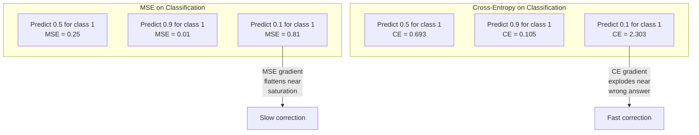
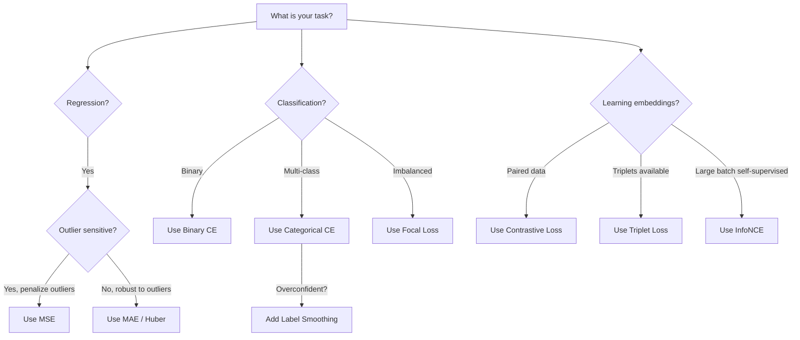
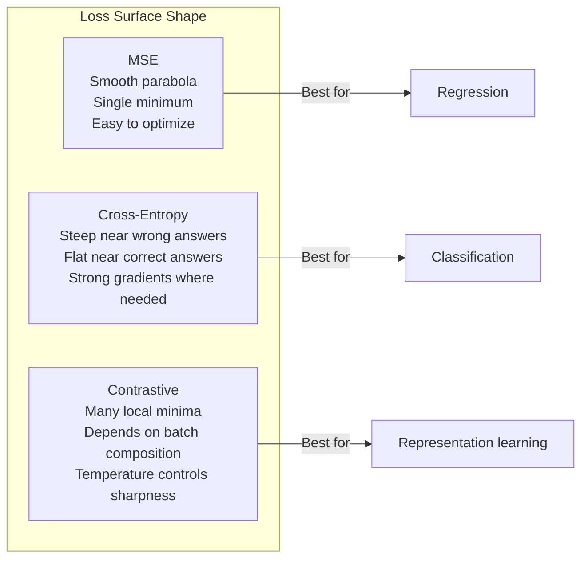

# Funções perdidas

> A sua rede faz uma previsão. A verdade base diz o contrário. O quão errado é? Esse número é a perda. Escolha a função de perda errada e seu modelo otimiza para a coisa errada inteiramente.

**Type:** Build
**Languages:** Python
**Prerequisites:** Lesson 03.04 (Activation Functions)
**Time:** ~75 minutes

## Objetivos de aprendizagem

- Implementar a MSE, a entropia cruzada binária, a entropia cruzada categórica e a perda contrastiva (InfoNCE) a partir do zero com os seus gradientes
- Explique por que o MSE não consegue classificar, demonstrando o modo de falha "previsão 0,5 para tudo"
- Aplicar suavizamento de rótulo para a entropia cruzada e descrever como previne previsões exageradas
- Escolha a função correta de perda para regressão, classificação binária, classificação multi-classe e inserção de tarefas de aprendizagem

## O problema

Um modelo que minimiza a MSE num problema de classificação prevê com confiança 0,5 para tudo.

A função de perda é a única coisa que o seu modelo realmente otimiza. Não é preciso. Não o resultado da F1. Não seja qual for a métrica que relates ao teu gerente. O optimizador toma o gradiente da função de perda e ajusta pesos para tornar esse número menor. Se a função de perda não captar o que você se importa, o modelo encontrará a maneira matematicamente mais barata de satisfazê-la, e essa maneira quase nunca é o que você queria.

Aqui está um exemplo concreto. Tem uma tarefa de classificação binária. Duas aulas, dividido 50/50. Usas a MSE como perda. O modelo prevê 0,5 por cada entrada. A média de MSE é de 0,25, o que é o mínimo possível sem realmente aprender nada. O modelo tem capacidade discriminatória zero, mas tecnicamente minimizou a sua função de perda. Passe para entropia cruzada e o mesmo modelo é forçado a empurrar as previsões para 0 ou 1, porque -log(0.5) = 0,693 é uma perda terrível, enquanto -log(0.99) = 0,01 recompensa com confiança as previsões corretas. A escolha da função de perda é a diferença entre um modelo que aprende e um modelo que joga a métrica.

É pior. Na aprendizagem auto-supervisionada, nem sequer temos rótulos. A perda contrastou define o sinal de aprendizagem inteiramente: o que conta como semelhante, o que conta como diferente, e o quão difícil o modelo deve empurrá-los de lado.

## O conceito

### Erro médio quadrado (MSE)

Calcule a diferença quadrada entre previsão e meta, média em todas as amostras.

```
MSE = (1/n) * sum((y_pred - y_true)^2)
```

Por que quadrar importa: penaliza erros grandes quadraticamente. Um erro de 2 custa 4 vezes mais do que um erro de 1. Um erro de 10 custa 100 vezes. Isso faz com que a MSE seja sensível a valores fora do valor - uma única previsão muito errada domina a perda.

Números reais: se o seu modelo prevê os preços das habitações e está fora por $10,000 on most houses but off by $200.000 em uma mansão, a MSE vai tentar agressivamente reparar essa mansão, potencialmente prejudicando o desempenho das outras 99 casas.

O gradiente de MSE em relação a uma previsão é:

```
dMSE/dy_pred = (2/n) * (y_pred - y_true)
```

Linear no erro. erros maiores obtêm gradientes maiores. Esta é uma característica para regressão (erros grandes precisam de grandes correções) e um bug para classificação (você quer penalizar respostas erradas confiantes de forma exponencial, não linear).

### Perda de entropia cruzada

A função de perda para classificação, enraizada na teoria da informação, mede a divergência entre a distribuição de probabilidade prevista e a distribuição verdadeira.

**Binary Cross-Entropy (BCE):**

```
BCE = -(y * log(p) + (1 - y) * log(1 - p))
```

Onde y é o rótulo verdadeiro (0 ou 1) e p é a probabilidade prevista.

Por que -log(p) funciona: quando o rótulo verdadeiro é 1 e você prevê p = 0,99, a perda é -log(0,99) = 0,01. Quando você prevê p = 0,01, a perda é -log(0,01) = 4,6. Essa diferença de 460x é por que a entropia cruzada funciona.

O gradiente conta a mesma história:

```
dBCE/dp = -(y/p) + (1-y)/(1-p)
```

Quando y = 1 e p está perto de zero, o gradiente é -1/p que se aproxima do infinito negativo. O modelo recebe um sinal enorme para corrigir seu erro. Quando p está perto de 1, o gradiente é pequeno. Já está correto, nada para corrigir.

**Categorical Cross-Entropy:**

Para classificação multi-classe com alvos codificados de um só tipo.

```
CCE = -sum(y_i * log(p_i))
```

Só a classe verdadeira contribui para a perda (porque todas as outras y_i são zero). Se houver 10 classes e a classe correta recebe probabilidade de 0,1 (divinhação aleatória), a perda é -log(0.1) = 2.3.

### Por que a MSE não é classificada



Os gradientes MSE se aplanam quando as previsões estão perto de 0 ou 1 (devido à saturação sigmoide). Os gradientes de entropia cruzada compensam isso - o -log cancelou as regiões planas do sigmoide, dando gradientes fortes exatamente onde são mais necessários.

### Limeamento de etiquetas

Os rótulos padrão de "uma só-quente" dizem que "este é 100% classe 3 e 0% tudo o resto".

```
smooth_label = (1 - alpha) * one_hot + alpha / num_classes
```

Com alfa = 0,1 e 10 classes: em vez de [0, 0, 1, 0, ...], o alvo se torna [0, 01, 0, 01, 0, 91, 0, 01 ...]. O modelo alvos 0,91 em vez de 1.0.

Por que isso funciona: um modelo que tenta produzir exatamente 1,0 através de um softmax precisa empurrar logits para o infinito. Isso causa confiança excessiva, prejudica a generalização e torna o modelo frágil para a mudança de distribuição.

### Perda contrasta

Sem rótulos, sem classes, apenas pares de entradas e a questão: são similares ou diferentes?

**SimCLR-style contrastive loss (NT-Xent / InfoNCE):**

Tome uma imagem. Crie duas visões aumentadas dela (corte, rotação, nervosismo de cores). Estes são os "paros positivos" - eles devem ter embutidos similares. Cada outra imagem no lote forma um "par negativo" - eles devem ter embutidos diferentes.

```
L = -log(exp(sim(z_i, z_j) / tau) / sum(exp(sim(z_i, z_k) / tau)))
```

Onde sim() é similaridade cosínica, z_i e z_j são o par positivo, a soma é sobre todos os negativos, e tau (temperatura) controla a forma de distribuição.

Números reais: tamanho do lote 256 significa 255 negativos por par positivo. temperatura tau = 0,07 (SimCLR padrão). A perda parece um softmax sobre semelhanças - quer que a semelhança do par positivo seja a maior entre todas as 256 opções.

**Triplet Loss:**

Toma três entradas: âncora, positiva (a mesma classe), negativa (classe diferente).

```
L = max(0, d(anchor, positive) - d(anchor, negative) + margin)
```

A margem (normalmente 0,2-1,0) impõe uma diferença mínima entre distâncias positivas e negativas. Se o negativo já estiver longe o suficiente, a perda é zero - sem gradiente, sem atualização. Isso torna o treinamento eficiente, mas requer uma mineração cuidadosa de triplet (escolha negativos duros que estão perto da âncora).

### Perda de foco

Para conjuntos de dados desequilibrados. Entropia cruzada padrão trata todos os exemplos corretamente classificados igualmente. perda focal para baixo-pesos exemplos fáceis:

```
FL = -alpha * (1 - p_t)^gamma * log(p_t)
```

Onde p_t é a probabilidade prevista da classe verdadeira e gama controla o foco. com gama = 0, esta é a entropia cruzada padrão. com gama = 2 (a padrão):

- Exemplo fácil (p_t = 0,9): peso = (0,1) ^ 2 = 0,01.
- Exemplo duro (p_t = 0,1): peso = (0,9) ^ 2 = 0,81.

A perda focal foi introduzida por Lin et al. para detecção de objetos, onde 99% das regiões candidatas são de fundo (negativos fáceis). Sem perda focal, o modelo se afoga em exemplos fáceis de fundo e nunca aprende a detectar objetos. Com ele, o modelo concentra sua capacidade nos casos difíceis e ambíguos que importam.

### Árvore de decisão de perda de função



### Loss Landscape



```figure
cross-entropy-loss
```

## Construí-lo

### Passo 1: MSE e seu gradiente

```python
def mse(predictions, targets):
    n = len(predictions)
    total = 0.0
    for p, t in zip(predictions, targets):
        total += (p - t) ** 2
    return total / n

def mse_gradient(predictions, targets):
    n = len(predictions)
    grads = []
    for p, t in zip(predictions, targets):
        grads.append(2.0 * (p - t) / n)
    return grads
```

### Passo 2: Entropia binária

O problema log(0) é real. Se o modelo prevê exatamente 0 para um exemplo positivo, log(0) = infinito negativo.

```python
import math

def binary_cross_entropy(predictions, targets, eps=1e-15):
    n = len(predictions)
    total = 0.0
    for p, t in zip(predictions, targets):
        p_clipped = max(eps, min(1 - eps, p))
        total += -(t * math.log(p_clipped) + (1 - t) * math.log(1 - p_clipped))
    return total / n

def bce_gradient(predictions, targets, eps=1e-15):
    grads = []
    for p, t in zip(predictions, targets):
        p_clipped = max(eps, min(1 - eps, p))
        grads.append(-(t / p_clipped) + (1 - t) / (1 - p_clipped))
    return grads
```

### Passo 3: Entropia cruzada categórica com Softmax

O Softmax converte logits em probabilidades e depois calcula a entropia cruzada contra alvos de uma só hora.

```python
def softmax(logits):
    max_val = max(logits)
    exps = [math.exp(x - max_val) for x in logits]
    total = sum(exps)
    return [e / total for e in exps]

def categorical_cross_entropy(logits, target_index, eps=1e-15):
    probs = softmax(logits)
    p = max(eps, probs[target_index])
    return -math.log(p)

def cce_gradient(logits, target_index):
    probs = softmax(logits)
    grads = list(probs)
    grads[target_index] -= 1.0
    return grads
```

O gradiente de softmax + entropia cruzada simplifica-se muito bem: é apenas (probabilidade prevista - 1) para a classe verdadeira, e (probabilidade prevista) para todas as outras classes. Esta simplificação elegante não é uma coincidência - é por isso que softmax e entropia cruzada são emparejados.

### Passo 4: Suavização de etiquetas

```python
def label_smoothed_cce(logits, target_index, num_classes, alpha=0.1, eps=1e-15):
    probs = softmax(logits)
    loss = 0.0
    for i in range(num_classes):
        if i == target_index:
            smooth_target = 1.0 - alpha + alpha / num_classes
        else:
            smooth_target = alpha / num_classes
        p = max(eps, probs[i])
        loss += -smooth_target * math.log(p)
    return loss
```

### Passo 5: Perda de contraste (InfoNCE simplificado)

```python
def cosine_similarity(a, b):
    dot = sum(x * y for x, y in zip(a, b))
    norm_a = math.sqrt(sum(x * x for x in a))
    norm_b = math.sqrt(sum(x * x for x in b))
    if norm_a < 1e-10 or norm_b < 1e-10:
        return 0.0
    return dot / (norm_a * norm_b)

def contrastive_loss(anchor, positive, negatives, temperature=0.07):
    sim_pos = cosine_similarity(anchor, positive) / temperature
    sim_negs = [cosine_similarity(anchor, neg) / temperature for neg in negatives]

    max_sim = max(sim_pos, max(sim_negs)) if sim_negs else sim_pos
    exp_pos = math.exp(sim_pos - max_sim)
    exp_negs = [math.exp(s - max_sim) for s in sim_negs]
    total_exp = exp_pos + sum(exp_negs)

    return -math.log(max(1e-15, exp_pos / total_exp))
```

### Passo 6: MSE vs Cross-Entropy na classificação

Treinar a mesma rede da lição 04 (conjunto de dados de círculo) com ambas as funções de perda.

```python
import random

def sigmoid(x):
    x = max(-500, min(500, x))
    return 1.0 / (1.0 + math.exp(-x))

def make_circle_data(n=200, seed=42):
    random.seed(seed)
    data = []
    for _ in range(n):
        x = random.uniform(-2, 2)
        y = random.uniform(-2, 2)
        label = 1.0 if x * x + y * y < 1.5 else 0.0
        data.append(([x, y], label))
    return data


class LossComparisonNetwork:
    def __init__(self, loss_type="bce", hidden_size=8, lr=0.1):
        random.seed(0)
        self.loss_type = loss_type
        self.lr = lr
        self.hidden_size = hidden_size

        self.w1 = [[random.gauss(0, 0.5) for _ in range(2)] for _ in range(hidden_size)]
        self.b1 = [0.0] * hidden_size
        self.w2 = [random.gauss(0, 0.5) for _ in range(hidden_size)]
        self.b2 = 0.0

    def forward(self, x):
        self.x = x
        self.z1 = []
        self.h = []
        for i in range(self.hidden_size):
            z = self.w1[i][0] * x[0] + self.w1[i][1] * x[1] + self.b1[i]
            self.z1.append(z)
            self.h.append(max(0.0, z))

        self.z2 = sum(self.w2[i] * self.h[i] for i in range(self.hidden_size)) + self.b2
        self.out = sigmoid(self.z2)
        return self.out

    def backward(self, target):
        if self.loss_type == "mse":
            d_loss = 2.0 * (self.out - target)
        else:
            eps = 1e-15
            p = max(eps, min(1 - eps, self.out))
            d_loss = -(target / p) + (1 - target) / (1 - p)

        d_sigmoid = self.out * (1 - self.out)
        d_out = d_loss * d_sigmoid

        for i in range(self.hidden_size):
            d_relu = 1.0 if self.z1[i] > 0 else 0.0
            d_h = d_out * self.w2[i] * d_relu
            self.w2[i] -= self.lr * d_out * self.h[i]
            for j in range(2):
                self.w1[i][j] -= self.lr * d_h * self.x[j]
            self.b1[i] -= self.lr * d_h
        self.b2 -= self.lr * d_out

    def compute_loss(self, pred, target):
        if self.loss_type == "mse":
            return (pred - target) ** 2
        else:
            eps = 1e-15
            p = max(eps, min(1 - eps, pred))
            return -(target * math.log(p) + (1 - target) * math.log(1 - p))

    def train(self, data, epochs=200):
        losses = []
        for epoch in range(epochs):
            total_loss = 0.0
            correct = 0
            for x, y in data:
                pred = self.forward(x)
                self.backward(y)
                total_loss += self.compute_loss(pred, y)
                if (pred >= 0.5) == (y >= 0.5):
                    correct += 1
            avg_loss = total_loss / len(data)
            accuracy = correct / len(data) * 100
            losses.append((avg_loss, accuracy))
            if epoch % 50 == 0 or epoch == epochs - 1:
                print(f"    Epoch {epoch:3d}: loss={avg_loss:.4f}, accuracy={accuracy:.1f}%")
        return losses
```

## Usá-lo

PyTorch fornece todas as funções de perda padrão com estabilidade numérica incorporada em:

```python
import torch
import torch.nn as nn
import torch.nn.functional as F

predictions = torch.tensor([0.9, 0.1, 0.7], requires_grad=True)
targets = torch.tensor([1.0, 0.0, 1.0])

mse_loss = F.mse_loss(predictions, targets)
bce_loss = F.binary_cross_entropy(predictions, targets)

logits = torch.randn(4, 10)
labels = torch.tensor([3, 7, 1, 9])
ce_loss = F.cross_entropy(logits, labels)
ce_smooth = F.cross_entropy(logits, labels, label_smoothing=0.1)
```

Utilização`F.cross_entropy`Não .`F.nll_loss`Mas o log-softmax é um log-softmax, que combina log-softmax e log-likelihood negativo em uma operação numérica estável.

Para a aprendizagem contrastiva, a maioria das equipes usa implementações personalizadas ou bibliotecas como `lightly`ou `pytorch-metric-learning`O ciclo central é sempre o mesmo: calcular as semelhanças em pares, criar o softmax sobre os positivos e os negativos, reproduzir.

## Envia-o

Esta lição produz:
- `outputs/prompt-loss-function-selector.md`-- um prompt reutilizável para escolher a função correta de perda
- `outputs/prompt-loss-debugger.md`- uma indicação de diagnóstico para quando a curva de perda parece errada

## Exercícios

1. Implementar perda de Huber (perda L1 suave), que é MSE para pequenos erros e MAE para grandes erros. Treinar uma rede de regressão que prevê y = sin(x) com MSE vs Huber quando 5% dos alvos de treinamento têm som acidental adicionado ruído (outliers). Compare erro final do teste.

2. Adicionar perda focal ao loop de treinamento de classificação binária. Criar um conjunto de dados desequilibrado (90% classe 0, 10% classe 1). Compare perda focal (gamma=2) com a perda focal (BC) padrão na recordação de classes minoritárias após 200 épocas.

3. Implementar perda de triplate com mineração negativa semi-dura. Gerar dados de incorporação 2D para 5 classes. Para cada âncora, encontrar o negativo mais duro que ainda é mais longe do que o positivo (semi-dura). Compare a convergência com seleção aleatória de triplate.

4. Execute a comparação MSE vs entropia cruzada, mas acompanhe as magnitudes de gradiente em cada camada durante o treinamento.

5. Implementar a perda de divergência KL e verificar que minimizar a KL ((true ability predicted) dá os mesmos gradientes que a entropia cruzada quando a distribuição verdadeira é um-hot.

## Termos-chave

| Term | What people say | What it actually means |
|------|----------------|----------------------|
| Loss function | "How wrong the model is" | A differentiable function mapping predictions and targets to a scalar that the optimizer minimizes |
| MSE | "Average squared error" | Mean of squared differences between predictions and targets; penalizes large errors quadratically |
| Cross-entropy | "The classification loss" | Measures divergence between predicted probability distribution and true distribution using -log(p) |
| Binary cross-entropy | "BCE" | Cross-entropy for two classes: -(y*log(p) + (1-y)*log(1-p)) |
| Label smoothing | "Softening the targets" | Replacing hard 0/1 targets with soft values (e.g., 0.1/0.9) to prevent overconfidence and improve generalization |
| Contrastive loss | "Pull together, push apart" | A loss that learns representations by making similar pairs close and dissimilar pairs far in embedding space |
| InfoNCE | "The CLIP/SimCLR loss" | Normalized temperature-scaled cross-entropy over similarity scores; treats contrastive learning as classification |
| Focal loss | "The imbalanced data fix" | Cross-entropy weighted by (1-p_t)^gamma to down-weight easy examples and focus on hard ones |
| Triplet loss | "Anchor-positive-negative" | Pushes anchor closer to positive than negative by at least a margin in embedding space |
| Temperature | "Sharpness knob" | A scalar divisor on logits/similarities that controls how peaked the resulting distribution is; lower = sharper |

## Mais leitura

- Lin et al., "Perdida focal para detecção de objetos densos" (2017) -- introduziu perda focal para o tratamento de desequilíbrio de classe extremo na detecção de objetos (RetinaNet)
- Chen et al., "Um quadro simples para aprendizagem contrastiva de representações visuais" (SimCLR, 2020) -- definido o moderno pipeline de aprendizagem contrastiva com perda NT-Xent
- Szegedy et al., "Rethinking the Inception Architecture" (2016) -- introduziu o suavizamento de rótulos como uma técnica de regularização, agora padrão na maioria dos grandes modelos
- Hinton et al., "Destillação do Conhecimento em uma Rede Neural" (2015) -- destilação do conhecimento usando alvos moles e divergência KL, fundamental para a compressão de modelos
