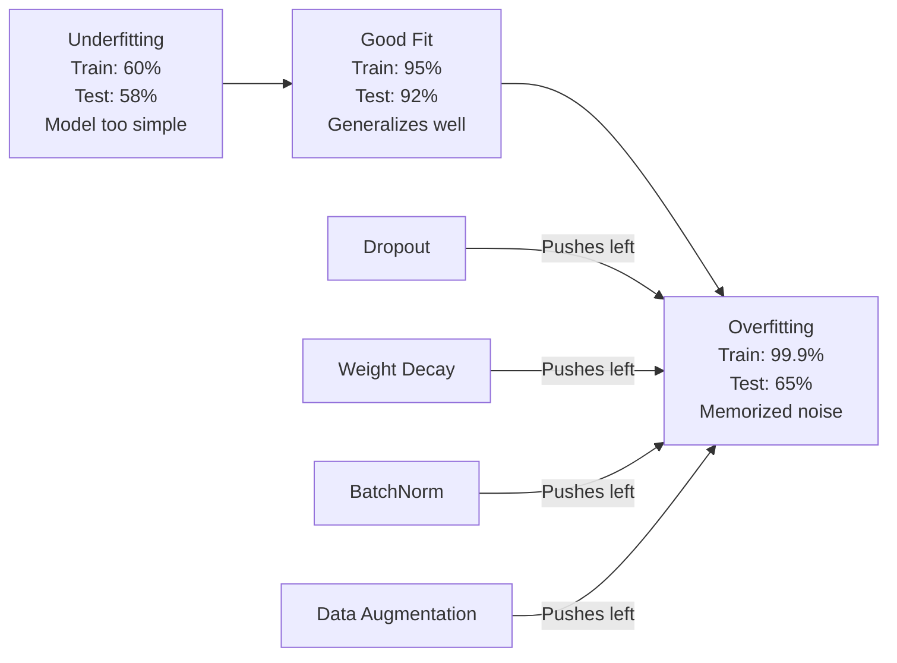
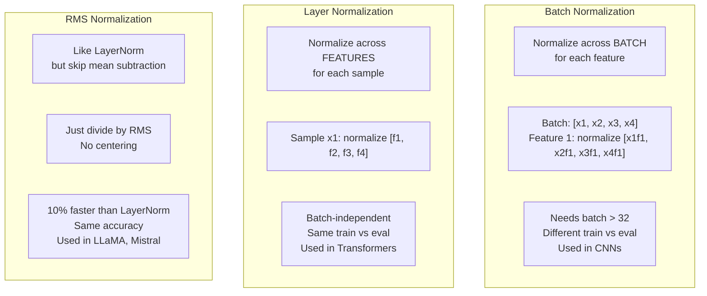
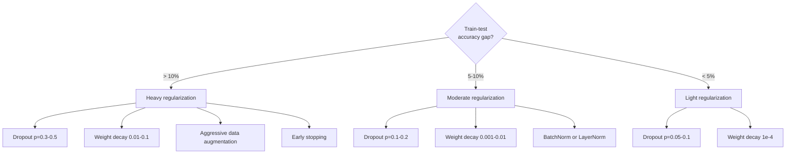

# Regularização

> O seu modelo tem 99% de dados de treinamento e 60% de dados de teste.

**Type:** Build
**Languages:** Python
**Prerequisites:** Lesson 03.06 (Optimizers)
**Time:** ~75 minutes

## Objetivos de aprendizagem

- Implementar o abandono com escala invertida, declínio de peso L2, normalização de lote, normalização de camada e RMSNorm a partir do zero
- Medir a lacuna de precisão dos testes de trem e diagnosticar o sobreajuste utilizando experimentos de regularização
- Explique por que os transformadores usam a LayerNorm em vez da BatchNorm e por que os LLM modernos preferem a RMSNorm
- Aplicar a combinação correta de técnicas de regularização com base na gravidade do sobreajuste

## O problema

Uma rede neural com parâmetros suficientes pode memorizar qualquer conjunto de dados. Isto não é hipotético - Zhang et al. (2017) provou isso treinando redes padrão na ImageNet com rótulos aleatórios. As redes alcançaram perda de treinamento quase zero em atribuições de rótulos completamente aleatórias. Eles memorizaram um milhão de pares aleatórios de entrada e saída sem padrão para aprender. Perda de treinamento foi perfeita. A precisão do teste foi zero.

Este é o problema de sobre-ajustamento, e piora à medida que os modelos ficam maiores. GPT-3 tem 175 bilhões de parâmetros. O conjunto de treinamento tem cerca de 500 bilhões de tokens. Com tantos parâmetros, o modelo tem capacidade suficiente para memorizar pedaços significativos dos dados de treinamento verbalmente. Sem regularização, ele apenas regurgitará exemplos de treinamento em vez de aprender padrões generalizáveis.

A diferença entre o desempenho do treinamento e o desempenho dos testes é a diferença de sobre-ajustamento. Cada técnica desta aula ataca essa lacuna de um ângulo diferente. A interrupção obriga a rede a não depender de nenhum neurônio. A perda de peso impede que qualquer peso se torne muito grande. A normalização de lote suaviza o cenário de perdas para que o optimizador encontre mínimos mais planos e mais generalizáveis. A normalização de camadas faz a mesma coisa, mas funciona onde a normalização de lote falha (pequenas parcelas, sequências de comprimento variável). A RMSNorm faz isso 10% mais rápido, soltando o cálculo médio. Cada técnica é simples. Juntos, são a diferença entre um modelo que memoriza e um que generaliza.

## O conceito

### O Espectro de Excesso de Ajuste

Cada modelo fica em algum lugar no espectro, desde o sub-ajustamento (demasiado simples para capturar o padrão) até o sobreajustamento (tão complexo que capta ruído).



### Desistência

A técnica de regularização mais simples com a interpretação mais elegante.

```
output = activation(z) * mask    where mask[i] ~ Bernoulli(1 - p)
```

Com p = 0,5, metade dos neurônios são centrais em cada passagem para a frente. A rede deve aprender representações redundantes porque não pode prever quais neurônios estarão disponíveis. Isso impede a co-adaptação - neurônios aprendendo a confiar em outros neurônios específicos estarem presentes.

A interpretação do conjunto: uma rede com N neurônios e desligamento cria 2^N sub-redes possíveis (cada combinação das quais os neurônios estão ligados ou desligados). O treinamento com abandono, aproximadamente, treina simultaneamente todas as sub-rede 2^N, cada uma em mini-partidas diferentes. No momento do teste, utiliza todos os neurônios (sem interrupção) e escala as saídas em (1 - p) para corresponder ao valor esperado durante o treino. Isto é equivalente a uma média das previsões de 2^N sub-rede -- um conjunto maciço de um único modelo.

Na prática, a escalação é aplicada durante o treinamento em vez de testes (abandonamento invertido):

```
During training:  output = activation(z) * mask / (1 - p)
During testing:   output = activation(z)   (no change needed)
```

Isto é mais limpo porque o código de teste não precisa saber sobre o abandono.

Taxas de defeito: p = 0,1 para transformadores, p = 0,5 para MLPs, p = 0,2 a 0,3 para CNNs.

### Desconto de peso (regularização L2)

Adicionar a magnitude quadrada de todos os pesos à perda:

```
total_loss = task_loss + (lambda / 2) * sum(w_i^2)
```

O gradiente do termo regularização é lambda * w. Isso significa que a cada passo, cada peso é reduzido para zero por uma fração proporcional à sua magnitude. pesos grandes são penalizados mais. O modelo é empurrado para soluções onde nenhum peso único domina.

Por que isso ajuda a generalização: os modelos super ajustados tendem a ter grandes pesos que amplificam o ruído nos dados de treinamento.

O hiperparâmetro lambda controla a resistência.

- 0,01 para AdamW em transformadores
- 1e-4 para SGD nas emissoras de televisão
- 0,1 para os modelos com grande sobreajuste

Como discutido na lição 06: a perda de peso e a regularização de L2 são equivalentes em SGD mas não em Adam.

### Normalização de lote

Normalize a saída de cada camada através do mini-batch antes de passá-lo para a próxima camada.

Para um mini-parcelamento de ativas em alguma camada:

```
mu = (1/B) * sum(x_i)           (batch mean)
sigma^2 = (1/B) * sum((x_i - mu)^2)   (batch variance)
x_hat = (x_i - mu) / sqrt(sigma^2 + eps)   (normalize)
y = gamma * x_hat + beta        (scale and shift)
```

Gamma e beta são parâmetros aprendíveis que permitem que a rede desface a normalização se isso for otimizado. sem eles, você estaria forçando a saída de cada camada a ser de variação de unidade zero-media, o que pode não ser o que a rede quer.

**Training vs inference split:**Durante o treino, mu e sigma provêm do mini-batch atual. Durante a inferência, você usa médias correntes acumuladas durante o treino (média móvel exponencial com impulso = 0,1, ou seja, 90% antigo + 10% novo).

Por que o BatchNorm funciona ainda é debatido. O artigo original alegou que reduz "a mudança de covariados interna" (a distribuição de entradas de camadas mudando à medida que as camadas anteriores atualizam). Santurkar et al. (2018) mostrou que esta explicação é errada. A razão real é que o BatchNorm torna o cenário de perdas mais suave. Os gradientes são mais preditivos, as constantes de Lipschitz são menores, e o optimizador pode dar passos maiores com segurança. É por isso que o BatchNorm permite que você use taxas de aprendizagem mais altas e converja mais rápido.

BatchNorm tem uma limitação fundamental: depende das estatísticas de lote. Com o tamanho do lote 1, a média e a variância são sem sentido. Com lotes pequenos (< 32), as estatísticas são barulhentas e prejudicam o desempenho. Isso importa para tarefas como detecção de objetos (onde a memória limita o tamanho do lote) e modelagem de linguagem (onde os comprimentos de sequência variam).

### Normalização de camadas

Normalização em todas as características em vez de em todo o lote.

```
mu = (1/D) * sum(x_j)           (feature mean)
sigma^2 = (1/D) * sum((x_j - mu)^2)   (feature variance)
x_hat = (x_j - mu) / sqrt(sigma^2 + eps)
y = gamma * x_hat + beta
```

D é a dimensão da característica. Cada amostra é normalizada de forma independente - sem dependência do tamanho do lote. É por isso que os transformadores usam LayerNorm em vez de BatchNorm. As sequências têm comprimentos variáveis, os tamanhos do lote são muitas vezes pequenos (ou 1 durante a geração), e o cálculo é idêntico entre treinamento e inferência.

O LayerNorm em transformadores é aplicado após cada bloco de autoatentação e cada bloco de alimentação (Post-LN), ou antes deles (Pre-LN, que é mais estável para o treinamento).

### RMSNorm

LayerNorm sem a subtração média. Proposto por Zhang & Sennrich (2019).

```
rms = sqrt((1/D) * sum(x_j^2))
y = gamma * x / rms
```

Não há medias de cálculo, não há parâmetros beta. A observação: a recentração (subtração média) no LayerNorm contribui muito pouco para o desempenho do modelo, mas custa computação.

LLaMA, LLaMA 2, LLaMA 3, Mistral e a maioria dos LLM modernos usam RMSNorm em vez de LayerNorm. Na escala de bilhões de parâmetros e trilhões de tokens, essa economia de 10% é significativa.

### Comparação de normalização



### Aumentar os dados como regularização

Não é uma modificação de modelo, mas uma modificação de dados.

- Imagens: colheita aleatória, virada, rotação, nervosismo de cor, corte
- Texto: substituição de sinônimos, tradução de volta, exclusão aleatória
- Áudio: tempo de estiramento, mudança de tom, adição de ruído

O efeito é idêntico à regularização: aumenta o tamanho efetivo do conjunto de treinamento, tornando mais difícil para o modelo memorizar exemplos específicos. Um modelo que só vê cada imagem uma vez em sua forma original pode memorizá-la. Um modelo que vê 50 versões aumentadas de cada imagem é forçado a aprender a estrutura invariante.

### Parar cedo

O regulador mais simples: parar de treinar quando a perda de validação começa a aumentar. O modelo ainda não está sobresponsado naquele ponto. Na prática, você acompanha a perda de validação em cada época, salva o melhor modelo e continua treinando para uma janela de "paciência" (normalmente 5-20 épocas). Se a perda de validação não melhora dentro da janela de paciência, você para e carrega o melhor modelo salvo.

### Quando aplicar o que



```figure
l2-regularization
```

## Construí-lo

### Passo 1: Desistência (tren e modo Eval)

```python
import random
import math


class Dropout:
    def __init__(self, p=0.5):
        self.p = p
        self.training = True
        self.mask = None

    def forward(self, x):
        if not self.training:
            return list(x)
        self.mask = []
        output = []
        for val in x:
            if random.random() < self.p:
                self.mask.append(0)
                output.append(0.0)
            else:
                self.mask.append(1)
                output.append(val / (1 - self.p))
        return output

    def backward(self, grad_output):
        grads = []
        for g, m in zip(grad_output, self.mask):
            if m == 0:
                grads.append(0.0)
            else:
                grads.append(g / (1 - self.p))
        return grads
```

### Passo 2: Declínio de peso L2

```python
def l2_regularization(weights, lambda_reg):
    penalty = 0.0
    for w in weights:
        penalty += w * w
    return lambda_reg * 0.5 * penalty

def l2_gradient(weights, lambda_reg):
    return [lambda_reg * w for w in weights]
```

### Passo 3: Normalização do lote

```python
class BatchNorm:
    def __init__(self, num_features, momentum=0.1, eps=1e-5):
        self.gamma = [1.0] * num_features
        self.beta = [0.0] * num_features
        self.eps = eps
        self.momentum = momentum
        self.running_mean = [0.0] * num_features
        self.running_var = [1.0] * num_features
        self.training = True
        self.num_features = num_features

    def forward(self, batch):
        batch_size = len(batch)
        if self.training:
            mean = [0.0] * self.num_features
            for sample in batch:
                for j in range(self.num_features):
                    mean[j] += sample[j]
            mean = [m / batch_size for m in mean]

            var = [0.0] * self.num_features
            for sample in batch:
                for j in range(self.num_features):
                    var[j] += (sample[j] - mean[j]) ** 2
            var = [v / batch_size for v in var]

            for j in range(self.num_features):
                self.running_mean[j] = (1 - self.momentum) * self.running_mean[j] + self.momentum * mean[j]
                self.running_var[j] = (1 - self.momentum) * self.running_var[j] + self.momentum * var[j]
        else:
            mean = list(self.running_mean)
            var = list(self.running_var)

        self.x_hat = []
        output = []
        for sample in batch:
            normalized = []
            out_sample = []
            for j in range(self.num_features):
                x_h = (sample[j] - mean[j]) / math.sqrt(var[j] + self.eps)
                normalized.append(x_h)
                out_sample.append(self.gamma[j] * x_h + self.beta[j])
            self.x_hat.append(normalized)
            output.append(out_sample)
        return output
```

### Passo 4: Normalização de camadas

```python
class LayerNorm:
    def __init__(self, num_features, eps=1e-5):
        self.gamma = [1.0] * num_features
        self.beta = [0.0] * num_features
        self.eps = eps
        self.num_features = num_features

    def forward(self, x):
        mean = sum(x) / len(x)
        var = sum((xi - mean) ** 2 for xi in x) / len(x)

        self.x_hat = []
        output = []
        for j in range(self.num_features):
            x_h = (x[j] - mean) / math.sqrt(var + self.eps)
            self.x_hat.append(x_h)
            output.append(self.gamma[j] * x_h + self.beta[j])
        return output
```

### Passo 5: RMSNorm

```python
class RMSNorm:
    def __init__(self, num_features, eps=1e-6):
        self.gamma = [1.0] * num_features
        self.eps = eps
        self.num_features = num_features

    def forward(self, x):
        rms = math.sqrt(sum(xi * xi for xi in x) / len(x) + self.eps)
        output = []
        for j in range(self.num_features):
            output.append(self.gamma[j] * x[j] / rms)
        return output
```

### Passo 6: Treinar com e sem regularização

```python
def sigmoid(x):
    x = max(-500, min(500, x))
    return 1.0 / (1.0 + math.exp(-x))


def make_circle_data(n=200, seed=42):
    random.seed(seed)
    data = []
    for _ in range(n):
        x = random.uniform(-2, 2)
        y = random.uniform(-2, 2)
        label = 1.0 if x * x + y * y < 1.5 else 0.0
        data.append(([x, y], label))
    return data


class RegularizedNetwork:
    def __init__(self, hidden_size=16, lr=0.05, dropout_p=0.0, weight_decay=0.0):
        random.seed(0)
        self.hidden_size = hidden_size
        self.lr = lr
        self.dropout_p = dropout_p
        self.weight_decay = weight_decay
        self.dropout = Dropout(p=dropout_p) if dropout_p > 0 else None

        self.w1 = [[random.gauss(0, 0.5) for _ in range(2)] for _ in range(hidden_size)]
        self.b1 = [0.0] * hidden_size
        self.w2 = [random.gauss(0, 0.5) for _ in range(hidden_size)]
        self.b2 = 0.0

    def forward(self, x, training=True):
        self.x = x
        self.z1 = []
        self.h = []
        for i in range(self.hidden_size):
            z = self.w1[i][0] * x[0] + self.w1[i][1] * x[1] + self.b1[i]
            self.z1.append(z)
            self.h.append(max(0.0, z))

        if self.dropout and training:
            self.dropout.training = True
            self.h = self.dropout.forward(self.h)
        elif self.dropout:
            self.dropout.training = False
            self.h = self.dropout.forward(self.h)

        self.z2 = sum(self.w2[i] * self.h[i] for i in range(self.hidden_size)) + self.b2
        self.out = sigmoid(self.z2)
        return self.out

    def backward(self, target):
        eps = 1e-15
        p = max(eps, min(1 - eps, self.out))
        d_loss = -(target / p) + (1 - target) / (1 - p)
        d_sigmoid = self.out * (1 - self.out)
        d_out = d_loss * d_sigmoid

        for i in range(self.hidden_size):
            d_relu = 1.0 if self.z1[i] > 0 else 0.0
            d_h = d_out * self.w2[i] * d_relu
            self.w2[i] -= self.lr * (d_out * self.h[i] + self.weight_decay * self.w2[i])
            for j in range(2):
                self.w1[i][j] -= self.lr * (d_h * self.x[j] + self.weight_decay * self.w1[i][j])
            self.b1[i] -= self.lr * d_h
        self.b2 -= self.lr * d_out

    def evaluate(self, data):
        correct = 0
        total_loss = 0.0
        for x, y in data:
            pred = self.forward(x, training=False)
            eps = 1e-15
            p = max(eps, min(1 - eps, pred))
            total_loss += -(y * math.log(p) + (1 - y) * math.log(1 - p))
            if (pred >= 0.5) == (y >= 0.5):
                correct += 1
        return total_loss / len(data), correct / len(data) * 100

    def train_model(self, train_data, test_data, epochs=300):
        history = []
        for epoch in range(epochs):
            total_loss = 0.0
            correct = 0
            for x, y in train_data:
                pred = self.forward(x, training=True)
                self.backward(y)
                eps = 1e-15
                p = max(eps, min(1 - eps, pred))
                total_loss += -(y * math.log(p) + (1 - y) * math.log(1 - p))
                if (pred >= 0.5) == (y >= 0.5):
                    correct += 1
            train_loss = total_loss / len(train_data)
            train_acc = correct / len(train_data) * 100
            test_loss, test_acc = self.evaluate(test_data)
            history.append((train_loss, train_acc, test_loss, test_acc))
            if epoch % 75 == 0 or epoch == epochs - 1:
                gap = train_acc - test_acc
                print(f"    Epoch {epoch:3d}: train_acc={train_acc:.1f}%, test_acc={test_acc:.1f}%, gap={gap:.1f}%")
        return history
```

## Usá-lo

PyTorch fornece toda a normalização e regularização como módulos:

```python
import torch
import torch.nn as nn

model = nn.Sequential(
    nn.Linear(784, 256),
    nn.BatchNorm1d(256),
    nn.ReLU(),
    nn.Dropout(0.3),
    nn.Linear(256, 128),
    nn.BatchNorm1d(128),
    nn.ReLU(),
    nn.Dropout(0.3),
    nn.Linear(128, 10),
)

model.train()
out_train = model(torch.randn(32, 784))

model.eval()
out_test = model(torch.randn(1, 784))
```

O `model.train()`- Não .`model.eval()`O toggle é crítico. Ele desliga/desliga o desligamento e diz ao BatchNorm para usar estatísticas de lote versus estatísticas de execução.`model.eval()`A precisão do teste fluctará aleatoriamente porque o abandono ainda está ativo e o BatchNorm está usando estatísticas mini-batch.

Para transformadores, o padrão é diferente:

```python
class TransformerBlock(nn.Module):
    def __init__(self, d_model=512, nhead=8, dropout=0.1):
        super().__init__()
        self.attention = nn.MultiheadAttention(d_model, nhead, dropout=dropout)
        self.norm1 = nn.LayerNorm(d_model)
        self.ff = nn.Sequential(
            nn.Linear(d_model, d_model * 4),
            nn.GELU(),
            nn.Linear(d_model * 4, d_model),
            nn.Dropout(dropout),
        )
        self.norm2 = nn.LayerNorm(d_model)
        self.dropout = nn.Dropout(dropout)

    def forward(self, x):
        attended, _ = self.attention(x, x, x)
        x = self.norm1(x + self.dropout(attended))
        x = self.norm2(x + self.ff(x))
        return x
```

LayerNorm, não BatchNorm. Desistência p=0.1, não p=0.5.

## Envia-o

Esta lição produz:
- `outputs/prompt-regularization-advisor.md`-- um aviso que diagnostica o excesso de conexão e recomenda a estratégia de regularização certa

## Exercícios

1. Implementar o abandono espacial para dados 2D: em vez de deixar cair neurônios individuais, deixe cair canais inteiros de recursos. Simula isso tratando grupos de recursos consecutivos como canais e deixando cair grupos inteiros. Compare a lacuna de teste de trem com o abandono padrão no conjunto de dados do círculo com hidden_size=32.

2. Implementar o suavizamento de rótulos da lição 05 combinado com o abandono desta lição. Treinar com quatro configurações: nenhuma, apenas abandono, apenas suavizamento de rótulos, ambos. Meter a lacuna de precisão final do teste de trem para cada uma. Qual combinação dá a menor lacuna?

3. Adicione uma camada BatchNorm entre a camada oculta e a ativação na sua rede de conjunto de dados circular. Treine com e sem BatchNorm a taxas de aprendizagem 0,01, 0,05, e 0.1.

4. Implementar paragem precoce: acompanhar a perda de teste em cada época, economizar os melhores pesos e parar se a perda de teste não tiver melhorado por 20 épocas. Execute a rede regularizada por 1000 épocas. Relate qual época teve a melhor precisão de teste e quantas épocas de computação você economizou.

5. Compare LayerNorm vs RMSNorm em uma rede de 4 camadas (não apenas 2). Iniciar ambos com os mesmos pesos. Treinar por 200 épocas e comparar precisão final, velocidade de treinamento (tempo por época) e magnitudes de gradiente na primeira camada. Verifique que RMSNorm é mais rápido com a mesma precisão.

## Termos-chave

| Term | What people say | What it actually means |
|------|----------------|----------------------|
| Overfitting | "Model memorized the data" | When a model's training performance significantly exceeds its test performance, indicating it learned noise rather than signal |
| Regularization | "Preventing overfitting" | Any technique that constrains model complexity to improve generalization: dropout, weight decay, normalization, augmentation |
| Dropout | "Random neuron deletion" | Zeroing random neurons during training with probability p, forcing redundant representations; equivalent to training an ensemble |
| Weight decay | "L2 penalty" | Shrinking all weights toward zero by subtracting lambda * w at each step; penalizes complexity through weight magnitude |
| Batch normalization | "Normalize per batch" | Normalizing layer outputs across the batch dimension using batch statistics during training and running averages during inference |
| Layer normalization | "Normalize per sample" | Normalizing across features within each sample; batch-independent, used in transformers where batch size varies |
| RMSNorm | "LayerNorm without the mean" | Root mean square normalization; drops the mean subtraction from LayerNorm for 10% speedup with equal accuracy |
| Early stopping | "Stop before overfit" | Halting training when validation loss stops improving; the simplest regularizer, often used alongside others |
| Data augmentation | "More data from less" | Transforming training inputs (flip, crop, noise) to increase effective dataset size and force invariance learning |
| Generalization gap | "Train-test split" | The difference between training and test performance; regularization aims to minimize this gap |

## Mais leitura

- Srivastava et al., "Dropout: Uma maneira simples de evitar redes neurais de sobreajuste" (2014) -- o papel original de abandono com a interpretação do conjunto e extensas experiências
- Ioffe & Szegedy, "Batch Normalization: Accelerating Deep Network Training by Reducing Internal Covariate Shift" (2015) -- apresentou BatchNorm e seu procedimento de treinamento, um dos trabalhos de aprendizagem profunda mais citados
- Zhang & Sennrich, "Root Mean Square Layer Normalization" (2019) -- mostrou que o RMSNorm corresponde à precisão do LayerNorm com computação reduzida; adotado pela LLaMA e Mistral
- Zhang et al., "Compreender Deep Learning Requere Re-Pensar Generalização" (2017) - o documento histórico que mostra que as redes neurais podem memorizar rótulos aleatórios, desafiando as visões tradicionais da generalização
