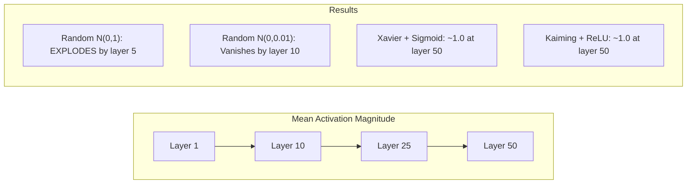
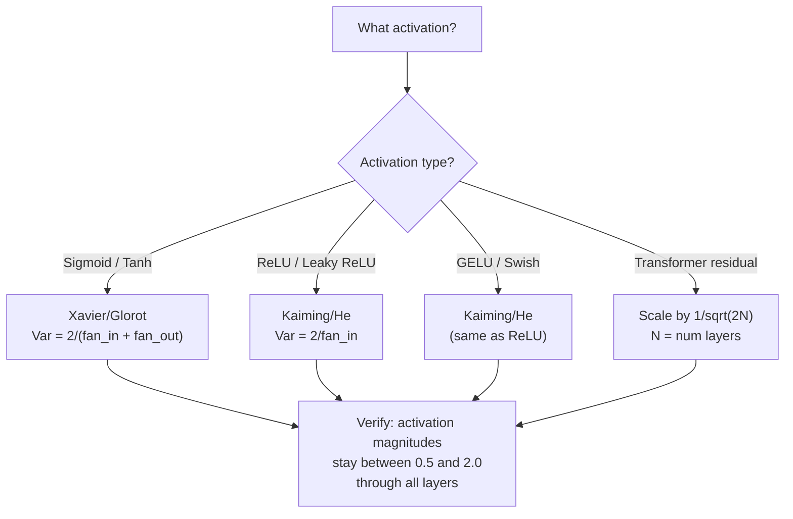

# Inicialização do peso e estabilidade do treinamento

> Iniciar errado e o treinamento nunca começa. Iniciar direito e 50 camadas treinar tão bem como 3.

**Type:** Build
**Languages:** Python
**Prerequisites:** Lesson 03.04 (Activation Functions), Lesson 03.07 (Regularization)
**Time:** ~90 minutes

## Objetivos de aprendizagem

- Implementar estratégias de inicialização zero, aleatório, Xavier/Glorot e Kaiming/He e medir seu efeito sobre as magnitudes de ativação através de 50 camadas
- Derive por que Xavier init usa Var(w) = 2/(fan_in + fan_out) e Kaiming usa Var(w) = 2/fan_in
- Demonstrar o problema de simetria com inicialização zero e explicar por que a escala aleatória sozinha é insuficiente
- Compare a estratégia de inicialização correta com a função de ativação: Xavier para sigmoid/tanh, Kaiming para ReLU/GELU

## O problema

Inicializem todos os pesos para zero. Nada aprende. Cada neurona calcula a mesma função, recebe o mesmo gradiente e atualiza-se de forma idêntica. Após 10.000 épocas, a sua camada oculta de 512 neuronas ainda é 512 cópias do mesmo neurona. Você pagou por 512 parâmetros e obteve 1.

Inicializá-los muito grandes. Ativações explodem através da rede. Na camada 10, os valores atingem 1e15. Na camada 20, eles desabsorvem para o infinito.

Inicia-los aleatoriamente a partir de uma distribuição normal padrão. Funciona para 3 camadas. Em 50 camadas, o sinal desabre para zero ou detona para o infinito dependendo de se a escala aleatória foi um pouco pequena ou um pouco grande demais. O limite entre "trabalho" e "rompo" é fino como uma navalha.

A inicialização do peso é a decisão mais subestimada na aprendizagem profunda. A arquitetura recebe papéis. Os optimistas recebem postagens de blog. A inicialização recebe uma nota de rodapé. Mas se errarem e nada mais importa - a sua rede está morta antes que o treinamento comece.

## O conceito

### O problema da simetria

Cada neurônio numa camada tem a mesma estrutura: multiplicar as entradas por pesos, adicionar preconceito, aplicar ativação. Se todos os pesos começam no mesmo valor (zero é o caso extremo), cada neurônio calcula a mesma saída. Durante a propagação de volta, cada neurônio recebe o mesmo gradiente. Durante a etapa de atualização, cada neurônio muda pela mesma quantidade.

A rede tem centenas de parâmetros, mas todos se movem em sequência. Isto é chamado simetria, e a inicialização aleatória é a forma de quebrar a força bruta. Cada neurônio começa em um ponto diferente no espaço de peso, então cada um aprende uma característica diferente.

Mas "aleatório" não é suficiente. A *escala* da aleatória determina se a rede está em funcionamento.

### Propagação de variações através de camadas

Considere uma única camada com entradas fan_in:

```
z = w1*x1 + w2*x2 + ... + w_n*x_n
```

Se cada peso wi for extraído de uma distribuição com variância Var(w) e cada entrada xi tem variância Var(x), a variância de saída é:

```
Var(z) = fan_in * Var(w) * Var(x)
```

Se Var(w) = 1 e fan_in = 512, a variância de saída é 512x a variância de entrada. Depois de 10 camadas: 512^10 = 1.2e27.

Se Var ((w) = 0,001, a variância de saída diminui em 0,001 * 512 = 0,512 por camada. Após 10 camadas: 0,512^10 = 0,00013.

O objetivo: escolher Var(w) para que Var(z) = Var(x). A magnitude do sinal permanece constante em todas as camadas.

### Xavier/Glorot Inicialização

Glorot e Bengio (2010) derivaram a solução para a ativação sigmoide e tanh.

```
Var(w) = 2 / (fan_in + fan_out)
```

Na prática, os pesos são extraídos de:

```
w ~ Uniform(-limit, limit)  where limit = sqrt(6 / (fan_in + fan_out))
```

ou

```
w ~ Normal(0, sqrt(2 / (fan_in + fan_out)))
```

Isso funciona porque sigmoide e tanh são aproximadamente lineares perto de zero, onde as ativações iniciadas corretamente vivem.

### Inicialização Kaiming/He

ReLU mata metade das saídas (todo o negativo torna-se zero). O fan_in efetivo é reduzido à metade porque em média metade das entradas são zero. Xavier init não conta por isso - subestima a variância necessária.

He et al. (2015) ajustaram a fórmula:

```
Var(w) = 2 / fan_in
```

Os pesos são extraídos de:

```
w ~ Normal(0, sqrt(2 / fan_in))
```

O fator de 2 compensa a re-realização de metade das ativações. Sem ele, o sinal encolhe em ~ 0,5x por camada. Com 50 camadas: 0,5^50 = 8,8e-16.

### Inicialização do transformador

O GPT-2 introduziu um padrão diferente. As conexões residuais adicionam a saída de cada subcamada à sua entrada:

```
x = x + sublayer(x)
```

Cada adição aumenta a variância. Com N camadas residuais, a variância cresce proporcionalmente a N. GPT-2 escala os pesos das camadas residuais por 1/sqrt(2N), onde N é o número de camadas. Isso mantém a magnitude de sinal acumulada estável.

O Llama 3 (405B parâmetros, 126 camadas) usa um esquema similar. sem essa escala, o fluxo residual cresceria ilimitadamente através de 126 camadas de atenção e blocos de feedforward.

```mermaid
flowchart TD
    subgraph "Zero Init"
        Z1["Layer 1<br/>All weights = 0"] --> Z2["Layer 2<br/>All neurons identical"]
        Z2 --> Z3["Layer 3<br/>Still identical"]
        Z3 --> ZR["Result: 1 effective neuron<br/>regardless of width"]
    end

    subgraph "Xavier Init"
        X1["Layer 1<br/>Var = 2/(fan_in+fan_out)"] --> X2["Layer 2<br/>Signal stable"]
        X2 --> X3["Layer 50<br/>Signal stable"]
        X3 --> XR["Result: Trains with<br/>sigmoid/tanh"]
    end

    subgraph "Kaiming Init"
        K1["Layer 1<br/>Var = 2/fan_in"] --> K2["Layer 2<br/>Signal stable"]
        K2 --> K3["Layer 50<br/>Signal stable"]
        K3 --> KR["Result: Trains with<br/>ReLU/GELU"]
    end
```



### Magnitude de ativação através de 50 camadas



### Escolhendo a intenção certa



```figure
weight-init-variance
```

## Construí-lo

### Passo 1: Estratégias de inicialização

Quatro maneiras de iniciar uma matriz de peso. Cada uma retorna uma lista de listas (uma matriz 2D) com colunas fan_in e linhas fan_out.

```python
import math
import random


def zero_init(fan_in, fan_out):
    return [[0.0 for _ in range(fan_in)] for _ in range(fan_out)]


def random_init(fan_in, fan_out, scale=1.0):
    return [[random.gauss(0, scale) for _ in range(fan_in)] for _ in range(fan_out)]


def xavier_init(fan_in, fan_out):
    std = math.sqrt(2.0 / (fan_in + fan_out))
    return [[random.gauss(0, std) for _ in range(fan_in)] for _ in range(fan_out)]


def kaiming_init(fan_in, fan_out):
    std = math.sqrt(2.0 / fan_in)
    return [[random.gauss(0, std) for _ in range(fan_in)] for _ in range(fan_out)]
```

### Passo 2: Funções de ativação

Precisamos do sigmoid, do tanh e do ReLU para testar cada estratégia init com a sua ativação pretendida.

```python
def sigmoid(x):
    x = max(-500, min(500, x))
    return 1.0 / (1.0 + math.exp(-x))


def tanh_act(x):
    return math.tanh(x)


def relu(x):
    return max(0.0, x)
```

### Passo 3: Passe para a frente através de 50 camadas

Passe dados aleatórios através de uma rede profunda e mede a magnitude média de ativação em cada camada.

```python
def forward_deep(init_fn, activation_fn, n_layers=50, width=64, n_samples=100):
    random.seed(42)
    layer_magnitudes = []

    inputs = [[random.gauss(0, 1) for _ in range(width)] for _ in range(n_samples)]

    for layer_idx in range(n_layers):
        weights = init_fn(width, width)
        biases = [0.0] * width

        new_inputs = []
        for sample in inputs:
            output = []
            for neuron_idx in range(width):
                z = sum(weights[neuron_idx][j] * sample[j] for j in range(width)) + biases[neuron_idx]
                output.append(activation_fn(z))
            new_inputs.append(output)
        inputs = new_inputs

        magnitudes = []
        for sample in inputs:
            magnitudes.append(sum(abs(v) for v in sample) / width)
        mean_mag = sum(magnitudes) / len(magnitudes)
        layer_magnitudes.append(mean_mag)

    return layer_magnitudes
```

### Passo 4: A experiência

Execute todas as combinações: zero init, random N(0,1), random N(0,0.01), Xavier com sigmoide, Xavier com tanh, Kaiming com ReLU. Imprima a magnitude em camadas-chave.

```python
def run_experiment():
    configs = [
        ("Zero init + Sigmoid", lambda fi, fo: zero_init(fi, fo), sigmoid),
        ("Random N(0,1) + ReLU", lambda fi, fo: random_init(fi, fo, 1.0), relu),
        ("Random N(0,0.01) + ReLU", lambda fi, fo: random_init(fi, fo, 0.01), relu),
        ("Xavier + Sigmoid", xavier_init, sigmoid),
        ("Xavier + Tanh", xavier_init, tanh_act),
        ("Kaiming + ReLU", kaiming_init, relu),
    ]

    print(f"{'Strategy':<30} {'L1':>10} {'L5':>10} {'L10':>10} {'L25':>10} {'L50':>10}")
    print("-" * 80)

    for name, init_fn, act_fn in configs:
        mags = forward_deep(init_fn, act_fn)
        row = f"{name:<30}"
        for idx in [0, 4, 9, 24, 49]:
            val = mags[idx]
            if val > 1e6:
                row += f" {'EXPLODED':>10}"
            elif val < 1e-6:
                row += f" {'VANISHED':>10}"
            else:
                row += f" {val:>10.4f}"
        print(row)
```

### Passo 5: Demonstração de Simetria

Mostre que o zero init produz neurônios idênticos.

```python
def symmetry_demo():
    random.seed(42)
    weights = zero_init(2, 4)
    biases = [0.0] * 4

    inputs = [0.5, -0.3]
    outputs = []
    for neuron_idx in range(4):
        z = sum(weights[neuron_idx][j] * inputs[j] for j in range(2)) + biases[neuron_idx]
        outputs.append(sigmoid(z))

    print("\nSymmetry Demo (4 neurons, zero init):")
    for i, out in enumerate(outputs):
        print(f"  Neuron {i}: output = {out:.6f}")
    all_same = all(abs(outputs[i] - outputs[0]) < 1e-10 for i in range(len(outputs)))
    print(f"  All identical: {all_same}")
    print(f"  Effective parameters: 1 (not {len(weights) * len(weights[0])})")
```

### Passo 6: Relatório de Magnitude Layer-by-Layer

Imprima um gráfico visual de barras de magnitudes de ativação através de 50 camadas.

```python
def magnitude_report(name, magnitudes):
    print(f"\n{name}:")
    for i, mag in enumerate(magnitudes):
        if i % 5 == 0 or i == len(magnitudes) - 1:
            if mag > 1e6:
                bar = "X" * 50 + " EXPLODED"
            elif mag < 1e-6:
                bar = "." + " VANISHED"
            else:
                bar_len = min(50, max(1, int(mag * 10)))
                bar = "#" * bar_len
            print(f"  Layer {i+1:3d}: {bar} ({mag:.6f})")
```

## Usá-lo

A PyTorch fornece estas funções embutidas:

```python
import torch
import torch.nn as nn

layer = nn.Linear(512, 256)

nn.init.xavier_uniform_(layer.weight)
nn.init.xavier_normal_(layer.weight)

nn.init.kaiming_uniform_(layer.weight, nonlinearity='relu')
nn.init.kaiming_normal_(layer.weight, nonlinearity='relu')

nn.init.zeros_(layer.bias)
```

Quando ligares .`nn.Linear(512, 256)`Por isso a maioria das redes simples "apenas funciona" - PyTorch já fez a escolha certa. Mas quando você constrói arquiteturas personalizadas ou vai mais fundo do que 20 camadas, você precisa entender o que está acontecendo e potencialmente anular o padrão.

Para transformadores, os modelos HuggingFace geralmente lidam com a inicialização em seus `_init_weights`O GPT-2 escala projeções residuais por 1/sqrt ((N). Se você está construindo um transformador a partir do zero, você precisa adicionar isso você mesmo.

## Envia-o

Esta lição produz:
- `outputs/prompt-init-strategy.md`-- um prompt que diagnostica problemas de inicialização de peso e recomenda a estratégia certa

## Exercícios

1. Adicione a inicialização LeCun (Var = 1/fan_in, projetada para a ativação SELU).

2. Implementar a escalação residual GPT-2: multiplicar a saída de cada camada por 1/sqrt ((2 * N) antes de adicionar ao fluxo residual.

3. Crie uma função de "check de saúde init" que tome as dimensões de camadas de uma rede e o tipo de ativação, recomende a inicialização correta e avisa se o init atual causará problemas.

4. Exercite o experimento com fan_in = 16 vs fan_in = 1024. Xavier e Kaiming se adaptam ao fan_in, mas o init aleatório não. Mostre como a diferença entre "trabalha" e "pausa" se amplia com camadas maiores.

5. Implementar inicialização ortogonal (generar uma matriz aleatória, calcular seu SVD, usar a matriz ortogonal U). Compare com Kaiming para redes ReLU em 50 camadas.

## Termos-chave

| Term | What people say | What it actually means |
|------|----------------|----------------------|
| Weight initialization | "Set starting weights randomly" | The strategy for choosing initial weight values that determines whether a network can train at all |
| Symmetry breaking | "Make neurons different" | Using random initialization to ensure neurons learn distinct features instead of computing identical functions |
| Fan-in | "Number of inputs to a neuron" | The number of incoming connections, which determines how input variance accumulates in the weighted sum |
| Fan-out | "Number of outputs from a neuron" | The number of outgoing connections, relevant for maintaining gradient variance during backpropagation |
| Xavier/Glorot init | "The sigmoid initialization" | Var(w) = 2/(fan_in + fan_out), designed to preserve variance through sigmoid and tanh activations |
| Kaiming/He init | "The ReLU initialization" | Var(w) = 2/fan_in, accounts for ReLU zeroing half the activations |
| Variance propagation | "How signals grow or shrink through layers" | The mathematical analysis of how activation variance changes layer by layer based on weight scale |
| Residual scaling | "GPT-2's init trick" | Scaling residual connection weights by 1/sqrt(2N) to prevent variance growth through N transformer layers |
| Dead network | "Nothing trains" | A network where poor initialization causes all gradients to be zero or all activations to saturate |
| Exploding activations | "Values go to infinity" | When weight variance is too high, causing activation magnitudes to grow exponentially through layers |

## Mais leitura

- Glorot & Bengio, "Compreender a dificuldade de treinar redes neurais de feedforward profundas" (2010) -- o documento original de inicialização Xavier com análise de variância
- He et al., "Diving Deep into Rectifiers" (2015) -- introduziu a inicialização de Kaiming para redes ReLU
- Radford et al., "Modelos de Língua são Aprendizes Multitareais Não Supervisionados" (2019) -- Papel GPT-2 com inicialização de escala residual
- Mishkin & Matas, "All You Need is a Good Init" (2016) - Inicialização de unidade-variância de camada-seqüencial, uma alternativa empírica às fórmulas analíticas
