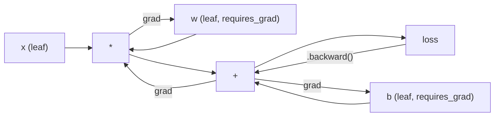
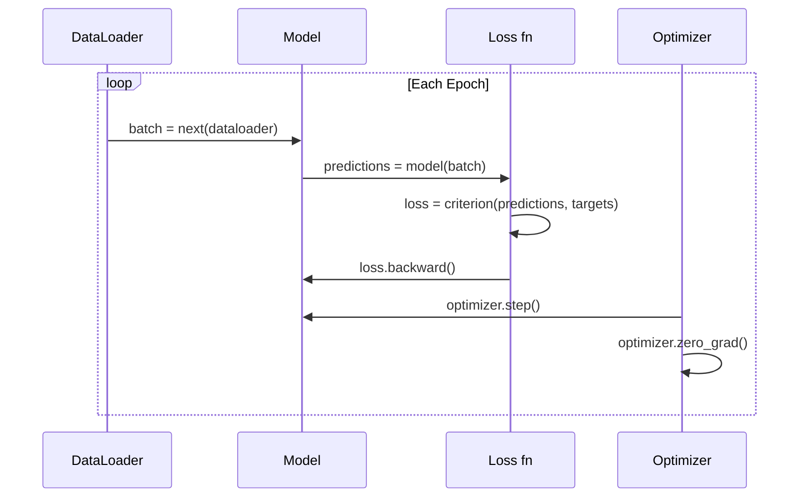

# Introdução ao PyTorch

> Construíste o motor a partir de pistões e grãos de revestimento.

**Type:** Build
**Languages:** Python
**Prerequisites:** Lesson 03.10 (Build Your Own Mini Framework)
**Time:** ~75 minutes

## Objetivos de aprendizagem

- Construir e treinar redes neurais usando o nn.Module, nn.Sequential e autograd da PyTorch
- Use tensores PyTorch, aceleração GPU e o ciclo de treinamento padrão (zero_grad, para frente, perda, para trás, passo)
- Converte os seus componentes de mini-quadro desde zero para seus equivalentes PyTorch
- Profila e compare a velocidade de treinamento entre o seu framework Python puro e PyTorch na mesma tarefa

## O problema

Você tem uma mini estrutura de trabalho. camadas lineares, ReLU, desistência, padrão de lote, Adam, um DataLoader, um loop de treinamento. Ele treina uma rede de 4 camadas sobre um problema de classificação de círculo em Python puro.

É também 500 vezes mais lento do que PyTorch no mesmo problema.

A sua mini-estrutura processa uma amostra de cada vez com loops Python em ninhos. PyTorch envia as mesmas operações para kernels C++ / CUDA otimizados que executam na GPU. Em uma única NVIDIA A100, PyTorch treina um ResNet-50 (25,6M parâmetros) na ImageNet (1.28M imagens) em cerca de 6 horas. Sua estrutura levaria cerca de 3.000 horas para a mesma tarefa - se não ficasse sem memória primeiro.

A velocidade não é a única lacuna. A sua estrutura não tem suporte a GPU. Não há diferenciação automática - você escreveu à mão para trás para cada módulo. Não há serialização. Não há treinamento distribuído. Não há precisão mista. Não há maneira de depurar o fluxo de gradiente sem instruções de impressão.

PyTorch preenche cada uma dessas lacunas. E faz isso mantendo exatamente o mesmo modelo mental que você já construiu: módulo, para frente(), parâmetros(), para trás(), optimizador. passo(). Os conceitos transferem um para um. A sintaxe é quase idêntica. A diferença é que PyTorch envolve uma década de engenharia de sistemas atrás da mesma interface que você projetou a partir do zero.

## O conceito

### Por que PyTorch venceu

Em 2015, o TensorFlow exigiu que você definiu um gráfico de computação estática antes de executar qualquer coisa. Você construiu o gráfico, compilado, e depois alimentou dados através dele. Debug significava olhar para visualizações de gráficos. Alterar a arquitetura significava reconstruir o gráfico a partir do zero.

PyTorch foi lançado em 2017 com uma filosofia diferente: execução ansiosa. Você escreve Python.`y = model(x)`realmente calcula y agora, não "aditar um nó a um gráfico que irá calcular y mais tarde". Isso significa que as ferramentas padrão de depuração Python funcionaram.

Em 2020, o mercado já tinha falado. A participação da PyTorch em trabalhos de pesquisa ML passou de 7% (2017) para mais de 75% (2022). Meta, Google DeepMind, OpenAI, Anthropic e Hugging Face todos usam PyTorch como sua estrutura principal. TensorFlow 2.x adotou execução ansiosa em resposta - admissão tácita de que o design da PyTorch era correto.

A lição: um framework que é 10% mais lento mas 50% mais rápido para depurar ganha sempre.

### Tensores

Um tensor é uma matriz multidimensional com três propriedades críticas: forma, dtype e dispositivo.

```python
import torch

x = torch.zeros(3, 4)           # shape: (3, 4), dtype: float32, device: cpu
x = torch.randn(2, 3, 224, 224) # batch of 2 RGB images, 224x224
x = torch.tensor([1, 2, 3])     # from a Python list
```

**Shape**É a dimensionalidade. Um escalar é a forma (), um vetor é (n), uma matriz é (m, n), um lote de imagens é (batch, canais, altura, largura).

**Dtype**Controla a precisão e a memória.

| dtype | Bits | Range | Use case |
|-------|------|-------|----------|
| float32 | 32 | ~7 decimal digits | Default training |
| float16 | 16 | ~3.3 decimal digits | Mixed precision |
| bfloat16 | 16 | Same range as float32, less precision | LLM training |
| int8 | 8 | -128 to 127 | Quantized inference |

**Device**determina onde ocorre o cálculo.

```python
device = torch.device("cuda" if torch.cuda.is_available() else "cpu")
x = torch.randn(3, 4, device=device)
x = x.to("cuda")
x = x.cpu()
```

Cada operação requer todos os tensores no mesmo dispositivo.`RuntimeError: Expected all tensors to be on the same device`Corrigir-o mudando tudo para o mesmo dispositivo antes do cálculo.

**Reshaping**é constante-tempo - muda os metadados, não os dados.

```python
x = torch.randn(2, 3, 4)
x.view(2, 12)      # reshape to (2, 12) -- must be contiguous
x.reshape(6, 4)    # reshape to (6, 4) -- works always
x.permute(2, 0, 1) # reorder dimensions
x.unsqueeze(0)     # add dimension: (1, 2, 3, 4)
x.squeeze()        # remove size-1 dimensions
```

### Autograd

A sua mini-estrutura requeria que você implementasse para trás (() para cada módulo. PyTorch não. Ele registra cada operação em tensores em um gráfico acíclico direcionado (o gráfico computacional) e, em seguida, atravessa esse gráfico ao contrário para calcular gradientes automaticamente.



A principal diferença da sua estrutura: PyTorch usa auto-difusão baseada em fita.`.backward()`Repete a fita ao contrário.

```python
x = torch.randn(3, requires_grad=True)
y = x ** 2 + 3 * x
z = y.sum()
z.backward()
print(x.grad)  # dz/dx = 2x + 3
```

Três regras de autogrado:

1. Só tensores de folhas com `requires_grad=True`gradientes acumulados
2. Os gradientes se acumulam por padrão -- chamada `optimizer.zero_grad()`antes de cada passagem para trás
3. `torch.no_grad()`Desativar o seguimento de gradientes (uso durante a avaliação)

### Modulo nn

`nn.Module`A versão do PyTorch adiciona registro automático de parâmetros, descoberta de módulos recorrentes, gerenciamento de dispositivos e serialização de ditado de estado.

```python
import torch.nn as nn

class MLP(nn.Module):
    def __init__(self, input_dim, hidden_dim, output_dim):
        super().__init__()
        self.layer1 = nn.Linear(input_dim, hidden_dim)
        self.relu = nn.ReLU()
        self.layer2 = nn.Linear(hidden_dim, output_dim)

    def forward(self, x):
        x = self.layer1(x)
        x = self.relu(x)
        x = self.layer2(x)
        return x
```

Quando atribuir um`nn.Module`ou `nn.Parameter`como um atributo em `__init__`A PyTorch registra-o automaticamente.`model.parameters()`É por isso que nunca é necessário coletar pesos manualmente como fez no mini framework.

Elementos fundamentais:

| Module | What it does | Parameters |
|--------|-------------|------------|
| nn.Linear(in, out) | Wx + b | in*out + out |
| nn.Conv2d(in_ch, out_ch, k) | 2D convolution | in_ch*out_ch*k*k + out_ch |
| nn.BatchNorm1d(features) | Normalize activations | 2 * features |
| nn.Dropout(p) | Random zeroing | 0 |
| nn.ReLU() | max(0, x) | 0 |
| nn.GELU() | Gaussian error linear | 0 |
| nn.Embedding(vocab, dim) | Lookup table | vocab * dim |
| nn.LayerNorm(dim) | Per-sample normalization | 2 * dim |

### Funções de perda e otimizadores

A PyTorch envia versões prontas para produção de tudo o que construíste.

**Loss functions**(de `torch.nn`):

| Loss | Task | Input |
|------|------|-------|
| nn.MSELoss() | Regression | Any shape |
| nn.CrossEntropyLoss() | Multi-class classification | Logits (not softmax) |
| nn.BCEWithLogitsLoss() | Binary classification | Logits (not sigmoid) |
| nn.L1Loss() | Regression (robust) | Any shape |
| nn.CTCLoss() | Sequence alignment | Log probabilities |

Nota: `CrossEntropyLoss`combinações `LogSoftmax`+ `NLLLoss`O que é um erro comum que produz gradientes errados silenciosamente.

**Optimizers**(de `torch.optim`):

| Optimizer | When to use | Typical LR |
|-----------|-------------|-----------|
| SGD(params, lr, momentum) | CNNs, well-tuned pipelines | 0.01--0.1 |
| Adam(params, lr) | Default starting point | 1e-3 |
| AdamW(params, lr, weight_decay) | Transformers, fine-tuning | 1e-4--1e-3 |
| LBFGS(params) | Small-scale, second-order | 1.0 |

### O ciclo de treinamento

Cada ciclo de treinamento PyTorch segue o mesmo padrão de 5 passos.



O padrão canônico:

```python
for epoch in range(num_epochs):
    model.train()
    for inputs, targets in train_loader:
        inputs, targets = inputs.to(device), targets.to(device)
        optimizer.zero_grad()
        outputs = model(inputs)
        loss = criterion(outputs, targets)
        loss.backward()
        optimizer.step()
```

Cinco linhas dentro do loop de lote, cinco linhas que treinaram GPT-4, Diffusão estável e LLaMA. A arquitetura muda. Os dados mudam.

### Set de dados e DataLoader

O PyTorch's `Dataset`é uma classe abstrata com dois métodos: `__len__`E ...`__getitem__`- Não .`DataLoader`Envolve-o com batching, mistura e carregamento de dados de vários processos.

```python
from torch.utils.data import Dataset, DataLoader

class MNISTDataset(Dataset):
    def __init__(self, images, labels):
        self.images = images
        self.labels = labels

    def __len__(self):
        return len(self.labels)

    def __getitem__(self, idx):
        return self.images[idx], self.labels[idx]

loader = DataLoader(dataset, batch_size=64, shuffle=True, num_workers=4)
```

`num_workers=4`A GPU é capaz de fazer o treinamento de dados em paralelo, enquanto a carga de trabalho em disco (imagem grande, áudio) pode duplicar a velocidade de treinamento.

### Formação de GPU

Mover um modelo para GPU:

```python
device = torch.device("cuda" if torch.cuda.is_available() else "cpu")
model = model.to(device)
```

Isso move recursivamente todos os parâmetros e buffer para a GPU.

```python
inputs, targets = inputs.to(device), targets.to(device)
```

**Mixed precision**reduz a metade do uso de memória e duplica a capacidade de transmissão das GPUs modernas (A100, H100, RTX 4090) executando para frente/para trás no float16 mantendo os pesos principais no float32:

```python
from torch.amp import autocast, GradScaler

scaler = GradScaler()
for inputs, targets in loader:
    with autocast(device_type="cuda"):
        outputs = model(inputs)
        loss = criterion(outputs, targets)
    scaler.scale(loss).backward()
    scaler.step(optimizer)
    scaler.update()
    optimizer.zero_grad()
```

### Comparação: Mini Framework vs PyTorch vs JAX

| Feature | Mini Framework (L10) | PyTorch | JAX |
|---------|---------------------|---------|-----|
| Autodiff | Manual backward() | Tape-based autograd | Functional transforms |
| Execution | Eager (Python loops) | Eager (C++ kernels) | Traced + JIT compiled |
| GPU support | No | Yes (CUDA, ROCm, MPS) | Yes (CUDA, TPU) |
| Speed (MNIST MLP) | ~300s/epoch | ~0.5s/epoch | ~0.3s/epoch |
| Module system | Custom Module class | nn.Module | Stateless functions (Flax/Equinox) |
| Debugging | print() | print(), pdb, breakpoint() | Harder (JIT tracing breaks print) |
| Ecosystem | None | Hugging Face, Lightning, timm | Flax, Optax, Orbax |
| Learning curve | You built it | Moderate | Steep (functional paradigm) |
| Production use | Toy problems | Meta, OpenAI, Anthropic, HF | Google DeepMind, Midjourney |

```figure
dropout-mask
```

## Construí-lo

Um MLP de 3 camadas treinado no MNIST usando apenas primitivos PyTorch.`torchvision.datasets`Nós baixamos e analisamos os dados brutos.

### Passo 1: Carregar MNIST a partir de arquivos brutos

O MNIST envia como 4 arquivos gzipados: imagens de treinamento (60.000 x 28 x 28), rótulos de treinamento, imagens de teste (10.000 x 28 x 28), rótulos de teste.

```python
import torch
import torch.nn as nn
import struct
import gzip
import urllib.request
import os

def download_mnist(path="./mnist_data"):
    base_url = "https://storage.googleapis.com/cvdf-datasets/mnist/"
    files = [
        "train-images-idx3-ubyte.gz",
        "train-labels-idx1-ubyte.gz",
        "t10k-images-idx3-ubyte.gz",
        "t10k-labels-idx1-ubyte.gz",
    ]
    os.makedirs(path, exist_ok=True)
    for f in files:
        filepath = os.path.join(path, f)
        if not os.path.exists(filepath):
            urllib.request.urlretrieve(base_url + f, filepath)

def load_images(filepath):
    with gzip.open(filepath, "rb") as f:
        magic, num, rows, cols = struct.unpack(">IIII", f.read(16))
        data = f.read()
        images = torch.frombuffer(bytearray(data), dtype=torch.uint8)
        images = images.reshape(num, rows * cols).float() / 255.0
    return images

def load_labels(filepath):
    with gzip.open(filepath, "rb") as f:
        magic, num = struct.unpack(">II", f.read(8))
        data = f.read()
        labels = torch.frombuffer(bytearray(data), dtype=torch.uint8).long()
    return labels
```

### Passo 2: Definir o Modelo

Uma MLP de 3 camadas: 784 -> 256 -> 128 -> 10. Ativações ReLU. Desistência para regularização. Não há norma de lote para mantê-lo simples.

```python
class MNISTModel(nn.Module):
    def __init__(self):
        super().__init__()
        self.net = nn.Sequential(
            nn.Linear(784, 256),
            nn.ReLU(),
            nn.Dropout(0.2),
            nn.Linear(256, 128),
            nn.ReLU(),
            nn.Dropout(0.2),
            nn.Linear(128, 10),
        )

    def forward(self, x):
        return self.net(x)
```

A camada de saída produz 10 logits brutos (um por dígito).`CrossEntropyLoss`- Ele lida com isso internamente.

Contagem de parâmetros: 784 * 256 + 256 + 256 * 128 + 128 + 128 * 10 + 10 = 235.146. Pequeno segundo os padrões modernos. GPT-2 pequeno tem 124M. Isso treina em segundos.

### Passo 3: Loop de treinamento

O padrão canônico de avanço-perda-passo-retorno.

```python
def train_one_epoch(model, loader, criterion, optimizer, device):
    model.train()
    total_loss = 0
    correct = 0
    total = 0
    for images, labels in loader:
        images, labels = images.to(device), labels.to(device)
        optimizer.zero_grad()
        outputs = model(images)
        loss = criterion(outputs, labels)
        loss.backward()
        optimizer.step()
        total_loss += loss.item() * images.size(0)
        _, predicted = outputs.max(1)
        correct += predicted.eq(labels).sum().item()
        total += labels.size(0)
    return total_loss / total, correct / total


def evaluate(model, loader, criterion, device):
    model.eval()
    total_loss = 0
    correct = 0
    total = 0
    with torch.no_grad():
        for images, labels in loader:
            images, labels = images.to(device), labels.to(device)
            outputs = model(images)
            loss = criterion(outputs, labels)
            total_loss += loss.item() * images.size(0)
            _, predicted = outputs.max(1)
            correct += predicted.eq(labels).sum().item()
            total += labels.size(0)
    return total_loss / total, correct / total
```

Nota `torch.no_grad()`O PyTorch cria um gráfico computacional que nunca usas.

### Passo 4: Conecte tudo

```python
def main():
    device = torch.device("cuda" if torch.cuda.is_available() else "cpu")

    download_mnist()
    train_images = load_images("./mnist_data/train-images-idx3-ubyte.gz")
    train_labels = load_labels("./mnist_data/train-labels-idx1-ubyte.gz")
    test_images = load_images("./mnist_data/t10k-images-idx3-ubyte.gz")
    test_labels = load_labels("./mnist_data/t10k-labels-idx1-ubyte.gz")

    train_dataset = torch.utils.data.TensorDataset(train_images, train_labels)
    test_dataset = torch.utils.data.TensorDataset(test_images, test_labels)
    train_loader = torch.utils.data.DataLoader(
        train_dataset, batch_size=64, shuffle=True
    )
    test_loader = torch.utils.data.DataLoader(
        test_dataset, batch_size=256, shuffle=False
    )

    model = MNISTModel().to(device)
    criterion = nn.CrossEntropyLoss()
    optimizer = torch.optim.Adam(model.parameters(), lr=1e-3)

    num_params = sum(p.numel() for p in model.parameters())
    print(f"Device: {device}")
    print(f"Parameters: {num_params:,}")
    print(f"Train samples: {len(train_dataset):,}")
    print(f"Test samples: {len(test_dataset):,}")
    print()

    for epoch in range(10):
        train_loss, train_acc = train_one_epoch(
            model, train_loader, criterion, optimizer, device
        )
        test_loss, test_acc = evaluate(
            model, test_loader, criterion, device
        )
        print(
            f"Epoch {epoch+1:2d} | "
            f"Train Loss: {train_loss:.4f} | Train Acc: {train_acc:.4f} | "
            f"Test Loss: {test_loss:.4f} | Test Acc: {test_acc:.4f}"
        )

    torch.save(model.state_dict(), "mnist_mlp.pt")
    print(f"\nModel saved to mnist_mlp.pt")
    print(f"Final test accuracy: {test_acc:.4f}")
```

Output esperado após 10 épocas: ~ 97,8% de precisão de teste. Tempo de treinamento na CPU: ~ 30 segundos. Na GPU: ~ 5 segundos. Em sua mini-quadro com a mesma arquitetura: ~ 45 minutos.

## Usá-lo

### Comparação rápida: Mini Framework vs PyTorch

| Mini Framework (Lesson 10) | PyTorch |
|---------------------------|---------|
| `model = Sequential(Linear(784, 256), ReLU(), ...)` | `model = nn.Sequential(nn.Linear(784, 256), nn.ReLU(), ...)` |
| `pred = model.forward(x)` | `pred = model(x)` |
| `optimizer.zero_grad()` | `optimizer.zero_grad()` |
| `grad = criterion.backward()` then `model.backward(grad)` | `loss.backward()` |
| `optimizer.step()` | `optimizer.step()` |
| No GPU | `model.to("cuda")` |
| Manual backward for every module | Autograd handles everything |

A interface é quase idêntica, a diferença é que tudo está debaixo do capô.

### Modelos de armazenamento e carregamento

```python
torch.save(model.state_dict(), "model.pt")

model = MNISTModel()
model.load_state_dict(torch.load("model.pt", weights_only=True))
model.eval()
```

Salva sempre .`state_dict()`(o dicionário de parâmetros), não o objeto modelo. Salvar o objeto modelo usa picle, que rompe quando você refactor código.

### Programação de Taxas de Aprendizagem

```python
scheduler = torch.optim.lr_scheduler.CosineAnnealingLR(
    optimizer, T_max=10
)
for epoch in range(10):
    train_one_epoch(model, train_loader, criterion, optimizer, device)
    scheduler.step()
```

A PyTorch envia 15+ agendadores: StepLR, ExponentialLR, CosineAnnealingLR, OneCycleLR, ReduceLROnPlateau. Todos conectados à mesma interface de otimização.

## Envia-o

Esta lição produz dois artefatos:

- `outputs/prompt-pytorch-debugger.md`-- um aviso para diagnosticar falhas comuns no treinamento PyTorch
- `outputs/skill-pytorch-patterns.md`-- uma referência de habilidades para os padrões de formação PyTorch

## Exercícios

1. **Add batch normalization.**Insira`nn.BatchNorm1d`A norma de lote deve atingir 98%+ em menos épocas.

2. **Implement a learning rate finder.**Treinar por uma época com uma taxa de aprendizagem exponencialmente aumentando (de 1e-7 a 1,0). perda de parcela versus LR. A LR ideal é pouco antes da perda começar a subir. Use isso para escolher uma melhor LR para o modelo MNIST.

3. **Port to GPU with mixed precision.**Adicionar`torch.amp.autocast`E ...`GradScaler`Para a velocidade de execução, a velocidade de execução deve ser de aproximadamente 2x.

4. **Build a custom Dataset.**Descarregar Fashion-MNIST (o mesmo formato que o MNIST mas com artigos de vestuário).`FashionMNISTDataset(Dataset)`classe com `__getitem__`E ...`__len__`Treinar a mesma MLP e comparar a precisão.

5. **Replace Adam with SGD + momentum.**Trem com `SGD(params, lr=0.01, momentum=0.9)`Comparar curvas de convergência.`CosineAnnealingLR`E ver se a SGD vai alcançar o Adam na época 10.

## Termos-chave

| Term | What people say | What it actually means |
|------|----------------|----------------------|
| Tensor | "A multi-dimensional array" | A typed, device-aware array with automatic differentiation support baked into every operation |
| Autograd | "Automatic backprop" | A tape-based system that records operations during forward pass, then replays them in reverse to compute exact gradients |
| nn.Module | "A layer" | The base class for any differentiable computation block -- registers parameters, supports nesting, handles train/eval modes |
| state_dict | "The model weights" | An OrderedDict mapping parameter names to tensors -- the portable, serializable representation of a trained model |
| .backward() | "Compute gradients" | Traverse the computational graph in reverse, computing and accumulating gradients for every leaf tensor with requires_grad=True |
| .to(device) | "Move to GPU" | Recursively transfer all parameters and buffers to the specified device (CPU, CUDA, MPS) |
| DataLoader | "The data pipeline" | An iterator that batches, shuffles, and optionally parallelizes data loading from a Dataset |
| Mixed precision | "Use float16" | Train with float16 forward/backward for speed while keeping float32 master weights for numerical stability |
| Eager execution | "Run it now" | Operations execute immediately when called, not deferred to a later compilation step -- the core design choice that differentiates PyTorch from TF 1.x |
| zero_grad | "Reset gradients" | Set all parameter gradients to zero before the next backward pass, since PyTorch accumulates gradients by default |

## Mais leitura

- Paszke et al., "PyTorch: Um estilo imperativo, High-Performance Deep Learning Library" (2019) -- o artigo original explicando as compensações de design da PyTorch
- Tutoriais de PyTorch: "Aprender PyTorch com exemplos" (https://pytorch.org/tutorials/beginner/pytorch_with_examples.html) -- o caminho oficial dos tensores para o módulo nn
- Guia de sintonização de desempenho PyTorch (https://pytorch.org/tutorials/recipes/recipes/tuning_guide.html) -- precisão mista, trabalhadores do DataLoader, memória fixa e outras otimizações de produção
- Horace He, "Fazer o Aprendizagem Profunda Ir Brrrr" (https://horace.io/brrr_intro.html) -- por que o treinamento da GPU é rápido, com estratégias de otimização específicas do PyTorch
