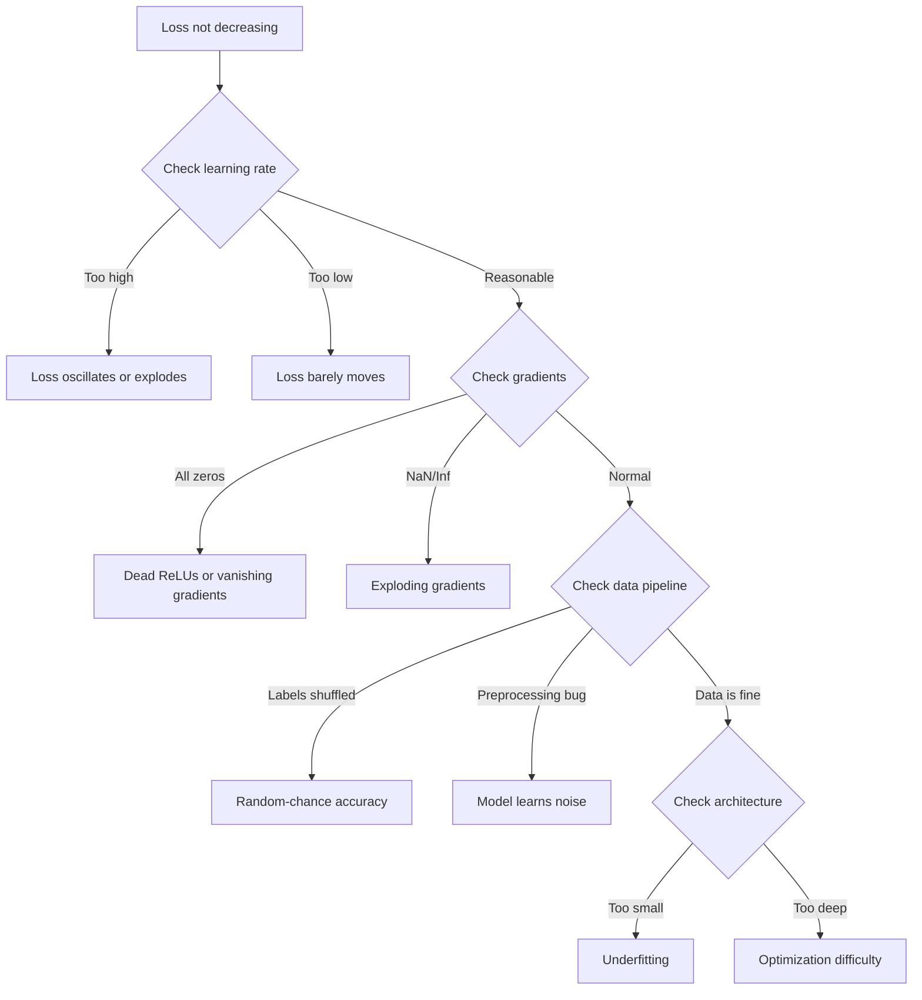
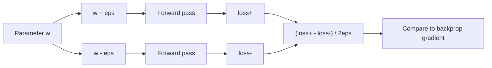
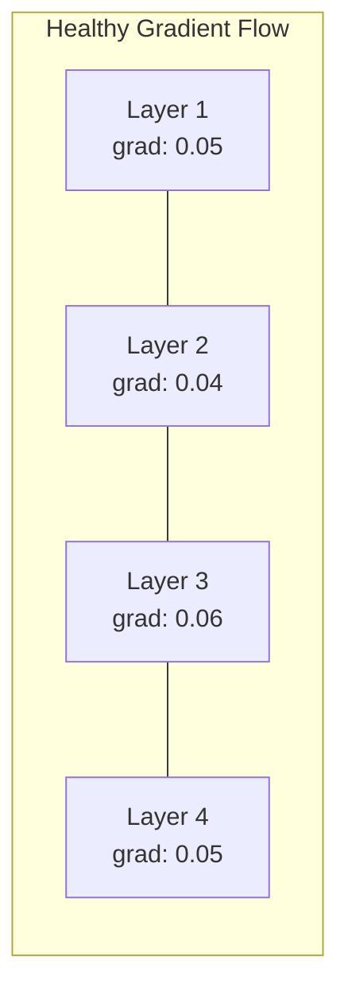
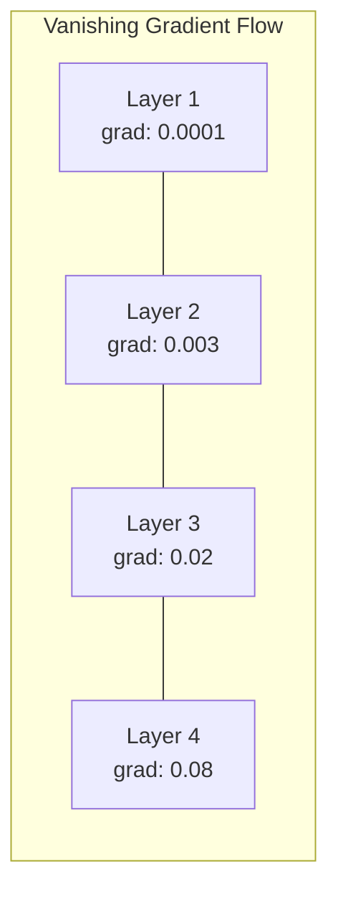
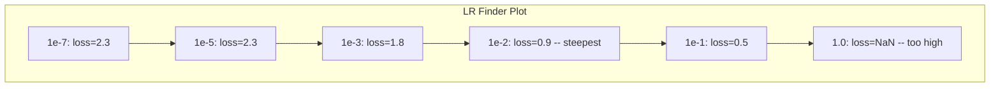

# Desembaraçamento de redes neurais

> A sua rede foi compilada. Ele foi executado. Produzido um número. O número está errado e nada caiu. Bem-vindo ao tipo mais difícil de depuração - o tipo onde não há mensagem de erro.

**Type:** Build
**Languages:** Python, PyTorch
**Prerequisites:** Phase 03 Lessons 01-10 (especially backpropagation, loss functions, optimizers)
**Time:** ~90 minutes

## Objetivos de aprendizagem

- Diagnóstico de falhas comuns de rede neural (perda de NaN, curva de perda plana, sobreajuste, oscilação) utilizando estratégias de depuração sistemática
- Aplique a técnica "overfit one batch" para verificar que a arquitetura do modelo e o ciclo de treinamento são corretos
- Inspeccionar as magnitudes de gradiente, distribuições de ativação e normas de peso para identificar problemas de gradiente que desaparecem/explodem
- Construa uma lista de verificação de depuração que cobre o pipeline de dados, arquitetura de modelo, função de perda, otimizador e problemas de taxa de aprendizagem

## O problema

O software tradicional cai quando está quebrado. Um punteiro zero lança uma exceção. Um desajuste de tipo falha no tempo de compilação. Um erro off-by-one produz uma saída claramente errada.

As redes neurais não lhe dão esse luxo.

Uma rede neural quebrada corre até a conclusão, imprime um valor de perda e faz previsões. A perda pode diminuir. As previsões podem parecer plausíveis. Mas o modelo está silenciosamente errado: aprender atalhos, memorizar ruído ou convergir para um mínimo local inútil. Pesquisadores do Google estimaram que 60-70% do tempo de depuração do ML é gasto em bugs "silenciosos" que não produzem erros, mas degradam a qualidade do modelo.

A diferença entre um modelo de trabalho e um modelo quebrado é muitas vezes uma única linha deslocada: uma falta `zero_grad()`, uma dimensão transposta, uma taxa de aprendizagem de 10x. A canônica "Receita para Treinar Redes Neurais" (2019) abre com isto: "Os erros mais comuns da rede neural são bugs que não caem".

Esta lição ensina-te a encontrar esses insetos.

## O conceito

### A mentalidade que desmaia

Esqueça o depuração de impressão e prato. A depuração de rede neural requer uma abordagem sistemática porque o loop de feedback é lento (minutos a horas por treinamento) e os sintomas são ambíguos (perda ruim pode significar 20 coisas diferentes).

A regra de ouro:**start simple, add complexity one piece at a time, and verify each piece independently.**



### Sintoma 1: Perda não diminuindo

A formação continua, as épocas passam e a perda permanece plana ou oscila muito.

**Wrong learning rate.**Muito alto: a perda oscila ou salta para NaN. Muito baixo: a perda diminui tão lentamente que parece plana. Para Adam, comece em 1e-3. Para SGD, comece em 1e-1 ou 1e-2.

**Dead ReLUs.**Se um neurônio ReLU receber uma entrada negativa grande, ele produz 0 e seu gradiente é 0.

**Vanishing gradients.**Em redes profundas com ativações sigmoides ou tanh, os gradientes encolhem-se exponencialmente à medida que se propagam para trás. Quando atingem a primeira camada, são ~0. As primeiras camadas param de aprender.

**Exploding gradients.**O problema oposto - gradientes crescem exponencialmente. comum em RNNs e redes muito profundas. perda salta para NaN. Fixa: corte de gradiente (`torch.nn.utils.clip_grad_norm_`), reduzir a taxa de aprendizagem ou adicionar a normalização.

### Sintoma 2: A perda diminui mas o modelo é ruim

A perda diminui, a precisão de treinamento atinge 99%, mas a precisão de teste é de 55%, ou o modelo produz resultados absurdos em dados reais.

**Overfitting.**O modelo memorizou dados de treinamento em vez de padrões de aprendizagem. A diferença entre treinamento e perda de validação aumenta ao longo do tempo.

**Data leakage.**Os dados de teste foram filtrados para o treinamento. A precisão é suspeitamente alta. Causas comuns: mistura antes de dividir, pré-processamento com estatísticas do conjunto completo de dados, amostras duplicadas em divisões.

**Label errors.**5-10% dos rótulos na maioria dos conjuntos de dados reais são errados (Northcutt et al., 2021 -- "Erros de rótulo pervasivos em conjuntos de teste"). O modelo aprende o ruído. Correção: use aprendizado confiante para encontrar e corrigir exemplos errados, ou use truncation de perda para ignorar amostras de alta perda.

### Sintoma 3: NaN ou Inf em perda

O valor da perda torna-se `nan`ou `inf`O treino está morto.

**Learning rate too high.**As atualizações graduais ultrapassam o ponto de os pesos explodirem.

**log(0) or log(negative).**Computação de perda de entropia cruzada `log(p)`Se o seu modelo produz exatamente 0 ou uma probabilidade negativa, o log explode.`[eps, 1-eps]`onde`eps=1e-7`- Não .

**Division by zero.**A normalização de lote se divide por desvio padrão. Um lote com valores constantes tem std=0. Fix: adicione epsilon ao denominador (PyTorch faz isso por padrão, mas implementações personalizadas podem não).

**Numerical overflow.**Grandes ativações alimentadas em `exp()`A solução é subtrair o máximo antes de exponenciar (o truque log-sum-exp).

### Técnica 1: Verificação gradual

Compare os seus gradientes analíticos (de backprop) com os gradientes numéricos (de diferenças finitas).

Gradiente numérico para o parâmetro `w`- Não .

```
grad_numerical = (loss(w + eps) - loss(w - eps)) / (2 * eps)
```

Metrica de acordo (diferência relativa):

```
rel_diff = |grad_analytical - grad_numerical| / max(|grad_analytical|, |grad_numerical|, 1e-8)
```

Se`rel_diff < 1e-5`- Não, não.`rel_diff > 1e-3`- É quase certo que é um inseto.



### Técnica 2: Estatísticas de ativação

Monitorar a média e o desvio padrão das ativações após cada camada durante o treinamento.

| Health indicator | Mean | Std | Diagnosis |
|-----------------|------|-----|-----------|
| Healthy | ~0 | ~1 | Network is learning normally |
| Saturated | >>0 or <<0 | ~0 | Activations stuck at extreme values |
| Dead | 0 | 0 | Neurons are dead (all zeros) |
| Exploding | >>10 | >>10 | Activations growing without bound |

### Técnica 3: Visualização de fluxo gradual

Grafe a magnitude média de gradiente para cada camada. Em uma rede saudável, as magnitude de gradiente devem ser aproximadamente semelhantes em todas as camadas. Se as camadas iniciais têm gradientes 1000 vezes menores que as camadas posteriores, você tem gradientes desaparecendo.





### Técnica 4: O teste de Overfit-One-Batch

A técnica de depuração mais importante no aprendizado profundo.

Tome um pequeno lote (8-32 amostras). Treine sobre ele para mais de 100 iterações. A perda deve ir para quase zero e a precisão de treinamento deve atingir 100%.

Este ensaio detecta:
- Funções de perda quebradas
- Passagens para trás quebradas
- Arquitetura muito pequena para representar os dados
- Otimizador não ligado aos parâmetros do modelo
- Dados e rótulos desalinhados

Isto leva 30 segundos para correr e economiza horas de depuração de treinamento completo.

### Técnica 5: Técnica de aprendizagem

Leslie Smith (2017) propôs varrer a taxa de aprendizagem de muito pequena (1e-7) para muito grande (10) durante uma época enquanto registra a perda.



Melhor LR neste exemplo: ~1e-3 (uma ordem de magnitude antes do ponto mais íngreme).

### Infecções comuns de PyTorch

Estes são os bugs que desperdiçam as horas mais coletivas na comunidade PyTorch:

| Bug | Symptom | Fix |
|-----|---------|-----|
| Forgetting `optimizer.zero_grad()` | Gradients accumulate across batches, loss oscillates | Add `optimizer.zero_grad()` before `loss.backward()` |
| Forgetting `model.eval()` at test time | Dropout and batch norm behave differently, test accuracy varies between runs | Add `model.eval()` and `torch.no_grad()` |
| Wrong tensor shapes | Silent broadcasting produces wrong results, no error | Print shapes after every operation during debugging |
| CPU/GPU mismatch | `RuntimeError: expected CUDA tensor` | Use `.to(device)` on model AND data |
| Not detaching tensors | Computation graph grows forever, OOM | Use `.detach()` or `with torch.no_grad()` |
| In-place operations breaking autograd | `RuntimeError: modified by in-place operation` | Replace `x += 1` with `x = x + 1` |
| Data not normalized | Loss stuck at random-chance level | Normalize inputs to mean=0, std=1 |
| Labels as wrong dtype | Cross-entropy expects `Long`, got `Float` | Cast labels: `labels.long()` |

### A Mesa de Desembaraçamento Mestre

| Symptom | Likely cause | First thing to try |
|---------|-------------|-------------------|
| Loss stuck at -log(1/num_classes) | Model predicting uniform distribution | Check data pipeline, verify labels match inputs |
| Loss NaN after a few steps | Learning rate too high | Reduce LR by 10x |
| Loss NaN immediately | log(0) or division by zero | Add epsilon to log/division operations |
| Loss oscillating wildly | LR too high or batch size too small | Reduce LR, increase batch size |
| Loss decreasing then plateaus | LR too high for fine-tuning phase | Add LR schedule (cosine or step decay) |
| Training acc high, test acc low | Overfitting | Add dropout, weight decay, more data |
| Training acc = test acc = chance | Model not learning anything | Run overfit-one-batch test |
| Training acc = test acc but both low | Underfitting | Bigger model, more layers, more features |
| Gradients all zero | Dead ReLUs or detached computation graph | Switch to LeakyReLU, check `.requires_grad` |
| Out of memory during training | Batch too large or graph not freed | Reduce batch size, use `torch.no_grad()` for eval |

```figure
learning-curves
```

## Construí-lo

Um conjunto de ferramentas de diagnóstico que monitora as ativas, gradientes e curvas de perda.

### Passo 1: A classe de NetworkDebugger

Conecta-se a um modelo PyTorch para registrar estatísticas de ativação e gradiente por camada.

```python
import torch
import torch.nn as nn
import math


class NetworkDebugger:
    def __init__(self, model):
        self.model = model
        self.activation_stats = {}
        self.gradient_stats = {}
        self.loss_history = []
        self.lr_losses = []
        self.hooks = []
        self._register_hooks()

    def _register_hooks(self):
        for name, module in self.model.named_modules():
            if isinstance(module, (nn.Linear, nn.Conv2d, nn.ReLU, nn.LeakyReLU)):
                hook = module.register_forward_hook(self._make_activation_hook(name))
                self.hooks.append(hook)
                hook = module.register_full_backward_hook(self._make_gradient_hook(name))
                self.hooks.append(hook)

    def _make_activation_hook(self, name):
        def hook(module, input, output):
            with torch.no_grad():
                out = output.detach().float()
                self.activation_stats[name] = {
                    "mean": out.mean().item(),
                    "std": out.std().item(),
                    "fraction_zero": (out == 0).float().mean().item(),
                    "min": out.min().item(),
                    "max": out.max().item(),
                }
        return hook

    def _make_gradient_hook(self, name):
        def hook(module, grad_input, grad_output):
            if grad_output[0] is not None:
                with torch.no_grad():
                    grad = grad_output[0].detach().float()
                    self.gradient_stats[name] = {
                        "mean": grad.mean().item(),
                        "std": grad.std().item(),
                        "abs_mean": grad.abs().mean().item(),
                        "max": grad.abs().max().item(),
                    }
        return hook

    def record_loss(self, loss_value):
        self.loss_history.append(loss_value)

    def check_loss_health(self):
        if len(self.loss_history) < 2:
            return "NOT_ENOUGH_DATA"
        recent = self.loss_history[-10:]
        if any(math.isnan(v) or math.isinf(v) for v in recent):
            return "NAN_OR_INF"
        if len(self.loss_history) >= 20:
            first_half = sum(self.loss_history[:10]) / 10
            second_half = sum(self.loss_history[-10:]) / 10
            if second_half >= first_half * 0.99:
                return "NOT_DECREASING"
        if len(recent) >= 5:
            diffs = [recent[i+1] - recent[i] for i in range(len(recent)-1)]
            if max(diffs) - min(diffs) > 2 * abs(sum(diffs) / len(diffs)):
                return "OSCILLATING"
        return "HEALTHY"

    def check_activations(self):
        issues = []
        for name, stats in self.activation_stats.items():
            if stats["fraction_zero"] > 0.5:
                issues.append(f"DEAD_NEURONS: {name} has {stats['fraction_zero']:.0%} zero activations")
            if abs(stats["mean"]) > 10:
                issues.append(f"EXPLODING_ACTIVATIONS: {name} mean={stats['mean']:.2f}")
            if stats["std"] < 1e-6:
                issues.append(f"COLLAPSED_ACTIVATIONS: {name} std={stats['std']:.2e}")
        return issues if issues else ["HEALTHY"]

    def check_gradients(self):
        issues = []
        grad_magnitudes = []
        for name, stats in self.gradient_stats.items():
            grad_magnitudes.append((name, stats["abs_mean"]))
            if stats["abs_mean"] < 1e-7:
                issues.append(f"VANISHING_GRADIENT: {name} abs_mean={stats['abs_mean']:.2e}")
            if stats["abs_mean"] > 100:
                issues.append(f"EXPLODING_GRADIENT: {name} abs_mean={stats['abs_mean']:.2e}")
        if len(grad_magnitudes) >= 2:
            first_mag = grad_magnitudes[0][1]
            last_mag = grad_magnitudes[-1][1]
            if last_mag > 0 and first_mag / last_mag > 100:
                issues.append(f"GRADIENT_RATIO: first/last = {first_mag/last_mag:.0f}x (vanishing)")
        return issues if issues else ["HEALTHY"]

    def print_report(self):
        print("\n=== NETWORK DEBUGGER REPORT ===")
        print(f"\nLoss health: {self.check_loss_health()}")
        if self.loss_history:
            print(f"  Last 5 losses: {[f'{v:.4f}' for v in self.loss_history[-5:]]}")
        print("\nActivation diagnostics:")
        for item in self.check_activations():
            print(f"  {item}")
        print("\nGradient diagnostics:")
        for item in self.check_gradients():
            print(f"  {item}")
        print("\nPer-layer activation stats:")
        for name, stats in self.activation_stats.items():
            print(f"  {name}: mean={stats['mean']:.4f} std={stats['std']:.4f} zero={stats['fraction_zero']:.1%}")
        print("\nPer-layer gradient stats:")
        for name, stats in self.gradient_stats.items():
            print(f"  {name}: abs_mean={stats['abs_mean']:.2e} max={stats['max']:.2e}")

    def remove_hooks(self):
        for hook in self.hooks:
            hook.remove()
        self.hooks.clear()
```

### Passo 2: O teste de sobre-ajuste em um lote

```python
def overfit_one_batch(model, x_batch, y_batch, criterion, lr=0.01, steps=200):
    optimizer = torch.optim.Adam(model.parameters(), lr=lr)
    model.train()
    print("\n=== OVERFIT ONE BATCH TEST ===")
    print(f"Batch size: {x_batch.shape[0]}, Steps: {steps}")

    for step in range(steps):
        optimizer.zero_grad()
        output = model(x_batch)
        loss = criterion(output, y_batch)
        loss.backward()
        optimizer.step()

        if step % 50 == 0 or step == steps - 1:
            with torch.no_grad():
                preds = (output > 0).float() if output.shape[-1] == 1 else output.argmax(dim=1)
                targets = y_batch if y_batch.dim() == 1 else y_batch.squeeze()
                acc = (preds.squeeze() == targets).float().mean().item()
            print(f"  Step {step:3d} | Loss: {loss.item():.6f} | Accuracy: {acc:.1%}")

    final_loss = loss.item()
    if final_loss > 0.1:
        print(f"\n  FAIL: Loss did not converge ({final_loss:.4f}). Model or training loop is broken.")
        return False
    print(f"\n  PASS: Loss converged to {final_loss:.6f}")
    return True
```

### Passo 3: Finder de taxa de aprendizagem

```python
def find_learning_rate(model, x_data, y_data, criterion, start_lr=1e-7, end_lr=10, steps=100):
    import copy
    original_state = copy.deepcopy(model.state_dict())
    optimizer = torch.optim.SGD(model.parameters(), lr=start_lr)
    lr_mult = (end_lr / start_lr) ** (1 / steps)

    model.train()
    results = []
    best_loss = float("inf")
    current_lr = start_lr

    print("\n=== LEARNING RATE FINDER ===")

    for step in range(steps):
        optimizer.zero_grad()
        output = model(x_data)
        loss = criterion(output, y_data)

        if math.isnan(loss.item()) or loss.item() > best_loss * 10:
            break

        best_loss = min(best_loss, loss.item())
        results.append((current_lr, loss.item()))

        loss.backward()
        optimizer.step()

        current_lr *= lr_mult
        for param_group in optimizer.param_groups:
            param_group["lr"] = current_lr

    model.load_state_dict(original_state)

    if len(results) < 10:
        print("  Could not complete LR sweep -- loss diverged too quickly")
        return results

    min_loss_idx = min(range(len(results)), key=lambda i: results[i][1])
    suggested_lr = results[max(0, min_loss_idx - 10)][0]

    print(f"  Swept {len(results)} steps from {start_lr:.0e} to {results[-1][0]:.0e}")
    print(f"  Minimum loss {results[min_loss_idx][1]:.4f} at lr={results[min_loss_idx][0]:.2e}")
    print(f"  Suggested learning rate: {suggested_lr:.2e}")

    return results
```

### Passo 4: Verificação de Gradientes

```python
def _flat_to_multi_index(flat_idx, shape):
    multi_idx = []
    remaining = flat_idx
    for dim in reversed(shape):
        multi_idx.insert(0, remaining % dim)
        remaining //= dim
    return tuple(multi_idx)


def gradient_check(model, x, y, criterion, eps=1e-4):
    model.train()
    x_double = x.double()
    y_double = y.double()
    model_double = model.double()

    print("\n=== GRADIENT CHECK ===")
    overall_max_diff = 0
    checked = 0

    for name, param in model_double.named_parameters():
        if not param.requires_grad:
            continue

        layer_max_diff = 0

        model_double.zero_grad()
        output = model_double(x_double)
        loss = criterion(output, y_double)
        loss.backward()
        analytical_grad = param.grad.clone()

        num_checks = min(5, param.numel())
        for i in range(num_checks):
            idx = _flat_to_multi_index(i, param.shape)
            original = param.data[idx].item()

            param.data[idx] = original + eps
            with torch.no_grad():
                loss_plus = criterion(model_double(x_double), y_double).item()

            param.data[idx] = original - eps
            with torch.no_grad():
                loss_minus = criterion(model_double(x_double), y_double).item()

            param.data[idx] = original

            numerical = (loss_plus - loss_minus) / (2 * eps)
            analytical = analytical_grad[idx].item()

            denom = max(abs(numerical), abs(analytical), 1e-8)
            rel_diff = abs(numerical - analytical) / denom

            layer_max_diff = max(layer_max_diff, rel_diff)
            checked += 1

        overall_max_diff = max(overall_max_diff, layer_max_diff)
        status = "OK" if layer_max_diff < 1e-5 else "MISMATCH"
        print(f"  {name}: max_rel_diff={layer_max_diff:.2e} [{status}]")

    model.float()

    print(f"\n  Checked {checked} parameters")
    if overall_max_diff < 1e-5:
        print("  PASS: Gradients match (rel_diff < 1e-5)")
    elif overall_max_diff < 1e-3:
        print("  WARN: Small differences (1e-5 < rel_diff < 1e-3)")
    else:
        print("  FAIL: Gradient mismatch detected (rel_diff > 1e-3)")
    return overall_max_diff
```

### Passo 5: Redes quebradas deliberadamente

Agora, aplique o conjunto de ferramentas para redes quebradas e diagnostique cada uma delas.

```python
def demo_broken_networks():
    torch.manual_seed(42)
    x = torch.randn(64, 10)
    y = (x[:, 0] > 0).long()

    print("\n" + "=" * 60)
    print("BUG 1: Learning rate too high (lr=10)")
    print("=" * 60)
    model1 = nn.Sequential(nn.Linear(10, 32), nn.ReLU(), nn.Linear(32, 2))
    debugger1 = NetworkDebugger(model1)
    optimizer1 = torch.optim.SGD(model1.parameters(), lr=10.0)
    criterion = nn.CrossEntropyLoss()
    for step in range(20):
        optimizer1.zero_grad()
        out = model1(x)
        loss = criterion(out, y)
        debugger1.record_loss(loss.item())
        loss.backward()
        optimizer1.step()
    debugger1.print_report()
    debugger1.remove_hooks()

    print("\n" + "=" * 60)
    print("BUG 2: Dead ReLUs from bad initialization")
    print("=" * 60)
    model2 = nn.Sequential(nn.Linear(10, 32), nn.ReLU(), nn.Linear(32, 32), nn.ReLU(), nn.Linear(32, 2))
    with torch.no_grad():
        for m in model2.modules():
            if isinstance(m, nn.Linear):
                m.weight.fill_(-1.0)
                m.bias.fill_(-5.0)
    debugger2 = NetworkDebugger(model2)
    optimizer2 = torch.optim.Adam(model2.parameters(), lr=1e-3)
    for step in range(50):
        optimizer2.zero_grad()
        out = model2(x)
        loss = criterion(out, y)
        debugger2.record_loss(loss.item())
        loss.backward()
        optimizer2.step()
    debugger2.print_report()
    debugger2.remove_hooks()

    print("\n" + "=" * 60)
    print("BUG 3: Missing zero_grad (gradients accumulate)")
    print("=" * 60)
    model3 = nn.Sequential(nn.Linear(10, 32), nn.ReLU(), nn.Linear(32, 2))
    debugger3 = NetworkDebugger(model3)
    optimizer3 = torch.optim.SGD(model3.parameters(), lr=0.01)
    for step in range(50):
        out = model3(x)
        loss = criterion(out, y)
        debugger3.record_loss(loss.item())
        loss.backward()
        optimizer3.step()
    debugger3.print_report()
    debugger3.remove_hooks()

    print("\n" + "=" * 60)
    print("HEALTHY NETWORK: Correct setup for comparison")
    print("=" * 60)
    model_good = nn.Sequential(nn.Linear(10, 32), nn.ReLU(), nn.Linear(32, 2))
    debugger_good = NetworkDebugger(model_good)
    optimizer_good = torch.optim.Adam(model_good.parameters(), lr=1e-3)
    for step in range(50):
        optimizer_good.zero_grad()
        out = model_good(x)
        loss = criterion(out, y)
        debugger_good.record_loss(loss.item())
        loss.backward()
        optimizer_good.step()
    debugger_good.print_report()
    debugger_good.remove_hooks()

    print("\n" + "=" * 60)
    print("OVERFIT-ONE-BATCH TEST (healthy model)")
    print("=" * 60)
    model_test = nn.Sequential(nn.Linear(10, 32), nn.ReLU(), nn.Linear(32, 2))
    overfit_one_batch(model_test, x[:8], y[:8], criterion)

    print("\n" + "=" * 60)
    print("LEARNING RATE FINDER")
    print("=" * 60)
    model_lr = nn.Sequential(nn.Linear(10, 32), nn.ReLU(), nn.Linear(32, 2))
    find_learning_rate(model_lr, x, y, criterion)

    print("\n" + "=" * 60)
    print("GRADIENT CHECK")
    print("=" * 60)
    model_grad = nn.Sequential(nn.Linear(10, 8), nn.ReLU(), nn.Linear(8, 2))
    gradient_check(model_grad, x[:4], y[:4], criterion)
```

## Usá-lo

### Ferramentas embutidas em PyTorch

```python
import torch
import torch.nn as nn

model = nn.Sequential(
    nn.Linear(768, 256),
    nn.ReLU(),
    nn.Linear(256, 10),
)

with torch.autograd.detect_anomaly():
    output = model(input_tensor)
    loss = criterion(output, target)
    loss.backward()

for name, param in model.named_parameters():
    if param.grad is not None:
        print(f"{name}: grad_mean={param.grad.abs().mean():.2e}")
```

### Integrar os pesos e os preconceitos

```python
import wandb

wandb.init(project="debug-training")

for epoch in range(100):
    loss = train_one_epoch()
    wandb.log({
        "loss": loss,
        "lr": optimizer.param_groups[0]["lr"],
        "grad_norm": torch.nn.utils.clip_grad_norm_(model.parameters(), float("inf")),
    })

    for name, param in model.named_parameters():
        if param.grad is not None:
            wandb.log({f"grad/{name}": wandb.Histogram(param.grad.cpu().numpy())})
```

### TensorBoard

```python
from torch.utils.tensorboard import SummaryWriter

writer = SummaryWriter("runs/debug_experiment")

for epoch in range(100):
    loss = train_one_epoch()
    writer.add_scalar("Loss/train", loss, epoch)

    for name, param in model.named_parameters():
        writer.add_histogram(f"weights/{name}", param, epoch)
        if param.grad is not None:
            writer.add_histogram(f"gradients/{name}", param.grad, epoch)
```

### A lista de verificação de defeitos (antes da formação completa)

1. Faça o teste de um lote, se falhar, pare.
2. Imprimir resumo do modelo - verificar o número de parâmetros é razoável.
3. Execute uma única passagem para a frente com dados aleatórios - verifique a forma de saída.
4. Treinar por 5 épocas - verificar a diminuição das perdas.
5. Verifique as estatísticas de ativação. Não há camadas mortas, não há explosões.
6. Verifique o fluxo de gradiente. Não desaparece, não explode.
7. Verifique o pipeline de dados - imprima 5 amostras aleatórias com rótulos.

## Envia-o

Esta lição produz:
- `outputs/prompt-nn-debugger.md`-- um aviso para diagnosticar falhas de treinamento de rede neural
- `outputs/skill-debug-checklist.md`-- uma lista de verificação de árvores de decisão para problemas de formação de depuração

Padrões de implantação-chave para depuração:
- Adicionar ganchos de monitorização aos scripts de formação de produção
- Ativação de log e estatísticas de gradiente para W&B ou TensorBoard a cada N passos
- Implementar alertas automáticas para perda de NaN, neurônios mortos (> 80% zero) ou explosão de gradiente
- Sempre executar o teste de overfit-one-batch quando mudar de arquitetura ou de canalizações de dados

## Exercícios

1. **Add an exploding gradient detector.**Modificar o `NetworkDebugger`Para detectar quando os gradientes ultrapassam um limiar e sugerir automaticamente um valor de corte de gradiente.

2. **Build a dead neuron resurrector.**Escreva uma função que identifica neurônios ReLU mortos (sempre emitindo 0) e reinicializa seus pesos entrantes com a inicialização Kaiming. Mostre que isso recupera uma rede onde > 70% dos neurônios estão mortos.

3. **Implement the learning rate finder with plotting.**Extensão`find_learning_rate`para salvar os resultados como um CSV e escrever um script separado que leia o CSV e exibe a curva LR vs perda usando matplotlib. Identifique o LR ideal para ResNet-18 no CIFAR-10.

4. **Create a data pipeline validator.**Escreva uma função que verifique: amostras duplicadas em divisões de trem/teste, desequilíbrio de distribuição de rótulos (> relação 10:1), normalização de entrada (média próxima de 0, std próxima de 1), e valores NaN/Inf nos dados.

5. **Debug a real failure.**Tome o mini-quadro da lição 10, introduzir um bug sutil (por exemplo, transpor a matriz de peso para trás) e usar a verificação de gradiente para localizar exatamente qual parâmetro tem gradientes incorretos.

## Termos-chave

| Term | What people say | What it actually means |
|------|----------------|----------------------|
| Silent bug | "It runs but gives bad results" | A bug that produces no error but degrades model quality -- the dominant failure mode in ML |
| Dead ReLU | "The neurons died" | A ReLU neuron whose input is always negative, so it outputs 0 and receives 0 gradient permanently |
| Vanishing gradients | "Early layers stop learning" | Gradients shrink exponentially through layers, making weights in early layers effectively frozen |
| Exploding gradients | "Loss went to NaN" | Gradients grow exponentially through layers, causing weight updates so large they overflow |
| Gradient checking | "Verify backprop is correct" | Comparing analytical gradients from backprop to numerical gradients from finite differences |
| Overfit-one-batch | "The most important debug test" | Training on a single small batch to verify the model CAN learn -- if it cannot, something is fundamentally broken |
| LR finder | "Sweep to find the right learning rate" | Exponentially increasing the learning rate over one epoch and picking the rate just before loss diverges |
| Data leakage | "Test data leaked into training" | When information from the test set contaminates training, producing artificially high accuracy |
| Activation statistics | "Monitor layer health" | Tracking mean, std, and zero-fraction of each layer's output to detect dead, saturated, or exploding neurons |
| Gradient clipping | "Cap the gradient magnitude" | Scaling gradients down when their norm exceeds a threshold, preventing exploding gradient updates |

## Mais leitura

- Smith, "Taxas de aprendizagem cíclicas para treinamento de redes neurais" (2017) - o artigo que introduz o teste de intervalo de aprendizagem (LR finder)
- Northcutt et al., "Erros de etiqueta generalizados em conjuntos de teste desestabilizam os padrões de aprendizagem de máquina" (2021) -- demonstra que 3-6% dos rótulos na ImageNet, CIFAR-10, e outros principais padrões de referência são errados
- Zhang et al., "Compreender Deep Learning Requere Re-Rethinking Generalization" (2017) -- o artigo mostrando que redes neurais podem memorizar rótulos aleatórios, é por isso que o teste de overfit-one-batch funciona
- Documentação da PyTorch sobre `torch.autograd.detect_anomaly`E ...`torch.autograd.set_detect_anomaly`para detecção de NaN/Inf embutida
