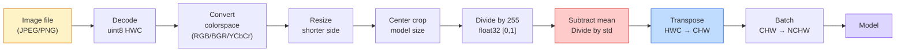
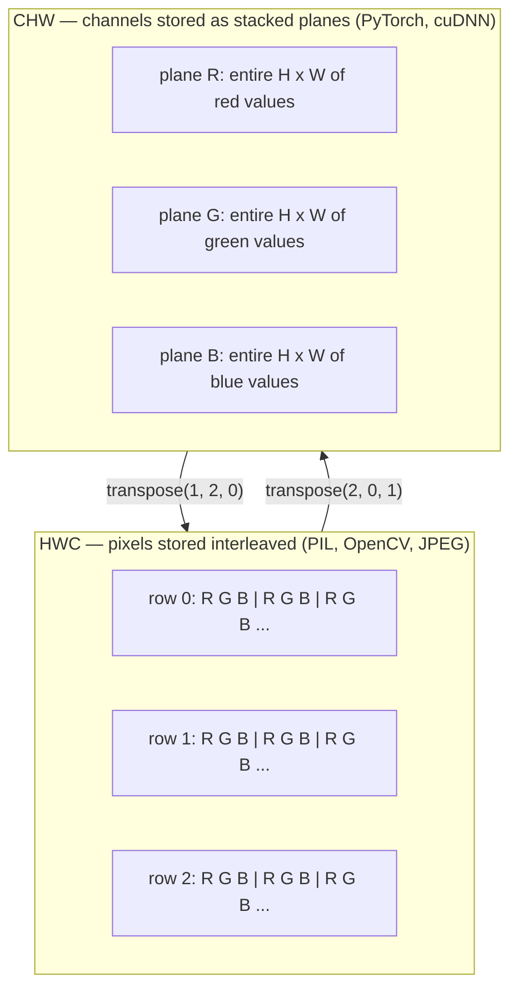

# Fundamentos da imagem  Pixéis, canais, espaços de cores

> Uma imagem é um tensor de amostras de luz.

**Type:** Build
**Languages:** Python
**Prerequisites:** Phase 1 Lesson 12 (Tensor Operations), Phase 3 Lesson 11 (Intro to PyTorch)
**Time:** ~45 minutes

## Objetivos de aprendizagem

- Explique como uma cena contínua é discreta em pixels e por que as decisões de amostragem/quantização definem o teto em cada modelo a jusante
- Leia, corte e inspecione imagens como matrizes NumPy e mude fluentemente entre layouts HWC e CHW
- Converte entre RGB, escala de cinza, HSV e YCbCr e justifique por que cada espaço de cores existe
- Aplicar pré-processamento a nível de píxeles (normalizar, padronizar, redimensionar, primeiro canalizado) exatamente como os modelos de visão PyTorch pré-treinados esperam

## O problema

Cada artigo que ler, cada peso pré-treinado que baixar, cada API de visão que chamar assume uma codificação específica da entrada.`uint8`imagem onde o modelo quer `float32`E ainda vai correr  e silenciosamente produzir lixo. Alimenta BGR para uma rede treinada em RGB e precisão desabar em dez pontos. Entregue um modelo de canais - última entrada quando espera canais - primeiro e a primeira camada conv trata a altura como um canal de recursos. Nada disso lança um erro. Isso só arruina suas métricas e você passa uma semana à procura de um bug que vive na forma como carregou o arquivo.

Uma convolução não é complicada uma vez que você sabe o que está deslizando. A parte difícil é que "uma imagem" significa coisas diferentes para uma câmera, um decodificador JPEG, PIL, OpenCV, torchvision e um núcleo CUDA. Cada pilha tem sua própria ordem de eixo, intervalo de byte e convenção de canal. Um engenheiro de visão que não pode manter esses navios retos quebrados pipelines.

Esta lição fixa a base para que o resto da fase possa construir sobre ela. No final você saberá o que é um pixel, por que há três números por pixel em vez de um, o que "normalizar com estatísticas da ImageNet" realmente faz, e como se mover entre os dois ou três layouts que cada outra lição nesta fase assumirá.

## O conceito

### O conjunto completo do oleoduto de pré-processamento num só olhar

Cada sistema de visão de produção é a mesma sequência de transformações reversíveis.



As duas caixas vermelhas e azuis são onde 80% das falhas silenciosas vivem: falta de padronização e layout errado.

### Um pixel é uma amostra, não um quadrado

Um sensor de câmera conta os fótons que pousam em uma grade de pequenos detectores. Cada detector integra luz por uma fração de segundo e emite uma tensão proporcional ao número de fótons que o atingem. O sensor então discretece essa tensão em um número inteiro. Um detector torna-se um píxel.

```
Continuous scene                 Sensor grid                     Digital image
(infinite detail)                (H x W detectors)               (H x W integers)

    ~~~~~                        +--+--+--+--+--+                 210 198 180 155 120
   - Não, não, não.
  - - - - - - - - - - - - - - - - - - - - - - - - - - - - - - - - - - - - - - - - - - - - - - - - - - - - - - - - - - - - - - - - - - - - - - - - - - - - - - - - - - - - - - - - - - - - - - - - - - - - - - - - - - - - - - - - - - - - - - - - - - - - - - - - - - - - - - - - - - - - - - - - - - - - - - - - - - - - - - - - - - - - - - - - - - - - - - - - - - - - - - - - - - - - - - - - - - - - - - - - - - - - - - - - - - - - - - - - - - - - - - - - - - - - - - - - - - - - - - - - - - - - - - - - - - - - - - - - - - - - - - - - - - - - - - - - - - - - - - - - - - - - - - - - - - - - - - - - - - - - - - - - - - - - - - - - - - - - - - - - - - - - - - - - - - - - - - - - - - - - - - - - - - - - - - - - - - - - - - - - - - - - - - - - - - - - - - - - - - - - - - - - - - - - - - - - - - - - - - - - - - - - - - - - - - - - - - - - - - - - - - - - - - - - - - - - - - - - - - - - - - - - - - - - - - - - - - - - - - - - - - - - - - - - - - - - - - - - - - - - - - - - - - - - - - - - - - - - - - - - - - - - - - - - - -
   ~~~~~                         |  |  |  |  |  |                 195 185 170 148 112
                                 +--+--+--+--+--+                 188 180 165 145 108
```

Nesta etapa, acontecem duas escolhas e fixam o teto em tudo o que está abaixo do rio:

- **Spatial sampling**O que acontece é que o sistema de detecção de dados é um sistema de detecção de dados que determina quantas unidades de detecção por grau da cena.
- **Intensity quantization**O que é um sistema de visualização de tensão de 8 bits é um sistema de visualização de 256 níveis, que é padrão para a visualização.

Um pixel não é um quadrado colorido com área. É uma única medida. Quando você redimensionar ou girar, você está reanalisar essa grade de medição.

### Por que três canais

Um detector conta fótons em todo o espectro visível  que é escala de cinza. Para obter cor, o sensor cobre a grade com um mosaico de filtros vermelhos, verdes e azuis. Depois de demosaicado, cada localização espacial tem três enteros: a resposta do detector vermelho-filtrado, verde-filtrado e azul-filtrado perto. Esses três enteros são o triplo RGB de um píxel.

```
One pixel in memory:

    (R, G, B) = (210, 140, 30)   <- reddish-orange

An H x W RGB image:

    shape (H, W, 3)     stored as   H rows of W pixels of 3 values
                                    each in [0, 255] for uint8
```

Os três não são mágicos. As câmeras de profundidade adicionam um canal Z. Os satélites adicionam bandas infravermelhas e ultravioletas. Os scans médicos geralmente têm um canal (ray X, CT) ou muitos (hiperspectro). O número de canais é o último eixo; as camadas de conveção aprendem a misturar-se através dele.

### Duas convenções de layout: HWC e CHW

O mesmo tensor, duas ordens, cada biblioteca escolhe uma.

```
HWC (height, width, channels)           CHW (channels, height, width)

   W ->                                    H ->
  +-----+-----+-----+                     +-----+-----+
H |R G B|R G B|R G B|                   C |R R R R R R|
| +-----+-----+-----+                   | +-----+-----+
v |R G B|R G B|R G B|                   v |G G G G G G|
  +-----+-----+-----+                     +-----+-----+
                                          |B B B B B B|
                                          +-----+-----+

   PIL, OpenCV, matplotlib,              PyTorch, most deep learning
   almost every image file on disk       frameworks, cuDNN kernels
```

O CHW existe porque os kernels de convolução deslizam através de H e W. Mantendo o eixo do canal primeiro significa que cada kernel vê um plano 2D contiguo por canal, que vectoriza limpo.

A conversão de uma linha você vai digitar mil vezes:

```
img_chw = img_hwc.transpose(2, 0, 1)      # NumPy
img_chw = img_hwc.permute(2, 0, 1)        # PyTorch tensor
```

Layout de memória, visualizado:



### Intervalo de byte e dtype

São três as convenções dominantes:

| Convention | dtype | Range | Where you see it |
|------------|-------|-------|------------------|
| Raw | `uint8` | [0, 255] | Files on disk, PIL, OpenCV output |
| Normalized | `float32` | [0.0, 1.0] | After `img.astype('float32') / 255` |
| Standardized | `float32` | roughly [-2, +2] | After subtracting mean and dividing by std |

As redes de convolução foram treinadas em entradas padronizadas.`mean=[0.485, 0.456, 0.406]`- Não .`std=[0.229, 0.224, 0.225]`são a média aritmética e o desvio padrão dos três canais sobre o conjunto completo de treinamento ImageNet, calculado em [0, 1] pixels normalizados.`uint8`O problema é que o sistema de visão aplicada não é capaz de fazer a diferença entre o sistema de visão aplicada e o sistema de visão aplicada.

### Espaços de cores e por que existem

O RGB é o formato de captura, mas nem sempre é a representação mais útil para um modelo.

```
 RGB               HSV                       YCbCr / YUV

 R red             H hue (angle 0-360)       Y luminance (brightness)
 G green           S saturation (0-1)        Cb chroma blue-yellow
 B blue            V value/brightness (0-1)  Cr chroma red-green

 Linear to         Separates color from      Separates brightness from
 sensor output     brightness. Useful for    color. JPEG and most video
                   color thresholding, UI    codecs compress the chroma
                   sliders, simple filters   channels harder because the
                                             human eye is less sensitive
                                             to chroma detail than to Y.
```

Para a maioria das redes modernas, alimentamos RGB.

- **HSV** código de currículo clássico, segmentação baseada em cores, equilíbrio de branco.
- **YCbCr** leitura de internos JPEG, canalizações de vídeo, modelos de super resolução que operam apenas em Y.
- **Grayscale** OCR, modelos de documentos, qualquer caso em que a cor seja variável de incômodo em vez de sinal.

A escala de cinza da RGB é uma soma ponderada, não uma média, porque o olho humano é mais sensível ao verde do que ao vermelho ou ao azul:

```
Y = 0.299 R + 0.587 G + 0.114 B       (ITU-R BT.601, the classic weights)
```

### Relação de aspeto, redimensionamento e interpolação

Cada modelo tem um tamanho de entrada fixo (224x224 para a maioria dos classificadores ImageNet, 384x384 ou 512x512 para os detectores modernos).

- **Resize shorter side, then center crop**Preserva a relação de aspecto, descarta uma faixa de pixels de borda.
- **Resize and pad**- Preserva a relação de aspecto e cada pixel, adiciona barras pretas.
- **Resize directly to target**É barato, distorce a geometria, perfeito para muitas tarefas de classificação.

O método de interpolação determina como os pixels intermediários são calculados quando a nova grade não se alinha com a antiga:

```
Nearest neighbour     fastest, blocky, only choice for masks/labels
Bilinear              fast, smooth, default for most image resizing
Bicubic               slower, sharper on upscaling
Lanczos               slowest, best quality, used for final display
```

Regra geral: bilinear para treinamento, bicubic ou lanczos para ativos que você vai olhar, mais próximo para qualquer coisa que contém ID de classe inteira.

```figure
conv-output-size
```

## Construí-lo

### Passo 1: Construa um tensor de imagem e inspecione sua forma

Comece com uma imagem sintética determinista para que o primeiro laboratório seja executado offline com apenas NumPy. A decodificação de arquivos é um limite separado: uma vez que um decodificador JPEG ou PNG retorna bytes RGB, cada operação tensorial abaixo é a mesma.

```python
import numpy as np

def synthetic_rgb(h=128, w=192, seed=0):
    rng = np.random.default_rng(seed)
    yy, xx = np.meshgrid(np.linspace(0, 1, h), np.linspace(0, 1, w), indexing="ij")
    r = (np.sin(xx * 6) * 0.5 + 0.5) * 255
    g = yy * 255
    b = (1 - yy) * xx * 255
    rgb = np.stack([r, g, b], axis=-1) + rng.normal(0, 6, (h, w, 3))
    return np.clip(rgb, 0, 255).astype(np.uint8)

arr = synthetic_rgb()

print(f"type:   {type(arr).__name__}")
print(f"dtype:  {arr.dtype}")
print(f"shape:  {arr.shape}     # (H, W, C)")
print(f"min:    {arr.min()}")
print(f"max:    {arr.max()}")
print(f"pixel at (0, 0): {arr[0, 0]}")
```

Produção esperada: `shape: (H, W, 3)`- Não .`dtype: uint8`, alcance`[0, 255]`É a representação canónica decodificada, quer os bytes vêm de uma câmera, um decodificador de imagem ou um gerador sintético.

### Passo 2: Divisão de canais e reordem

Retire R, G, B separadamente, e depois converta-os de HWC para CHW para PyTorch.

```python
R = arr[:, :, 0]
G = arr[:, :, 1]
B = arr[:, :, 2]
print(f"R shape: {R.shape}, mean: {R.mean():.1f}")
print(f"G shape: {G.shape}, mean: {G.mean():.1f}")
print(f"B shape: {B.shape}, mean: {B.mean():.1f}")

arr_chw = arr.transpose(2, 0, 1)
print(f"\nHWC shape: {arr.shape}")
print(f"CHW shape: {arr_chw.shape}")
```

Três planos em escala de cinza, um por canal. CHW apenas reordena os eixos; nenhuma cópia de dados é estritamente necessária quando o layout da memória o permite.

### Passo 3: Conversões em escala de cinza e HSV

Escala de cinza ponderada, depois manual RGB-HSV.

```python
def rgb_to_grayscale(rgb):
    weights = np.array([0.299, 0.587, 0.114], dtype=np.float32)
    return (rgb.astype(np.float32) @ weights).astype(np.uint8)

def rgb_to_hsv(rgb):
    rgb_f = rgb.astype(np.float32) / 255.0
    r, g, b = rgb_f[..., 0], rgb_f[..., 1], rgb_f[..., 2]
    cmax = np.max(rgb_f, axis=-1)
    cmin = np.min(rgb_f, axis=-1)
    delta = cmax - cmin

    h = np.zeros_like(cmax)
    mask = delta > 0
    argmax = np.argmax(rgb_f, axis=-1)
    rmax = mask & (argmax == 0)
    gmax = mask & (argmax == 1)
    bmax = mask & (argmax == 2)
    h[rmax] = ((g[rmax] - b[rmax]) / delta[rmax]) % 6
    h[gmax] = ((b[gmax] - r[gmax]) / delta[gmax]) + 2
    h[bmax] = ((r[bmax] - g[bmax]) / delta[bmax]) + 4
    h = h * 60.0

    s = np.divide(delta, cmax, out=np.zeros_like(delta), where=cmax > 0)
    v = cmax
    return np.stack([h, s, v], axis=-1)

gray = rgb_to_grayscale(arr)
hsv = rgb_to_hsv(arr)
print(f"gray shape: {gray.shape}, range: [{gray.min()}, {gray.max()}]")
print(f"hsv   shape: {hsv.shape}")
print(f"hue range: [{hsv[..., 0].min():.1f}, {hsv[..., 0].max():.1f}] degrees")
print(f"sat range: [{hsv[..., 1].min():.2f}, {hsv[..., 1].max():.2f}]")
print(f"val range: [{hsv[..., 2].min():.2f}, {hsv[..., 2].max():.2f}]")
```

Hue aparece em graus, saturação e valor em [0, 1].`hsv_full`Convenção.

### Passo 4: Normalize, padronize e inverte

Vai de bytes brutos para o tensor exato que um modelo pré-treinado da ImageNet espera, e depois volta.

```python
mean = np.array([0.485, 0.456, 0.406], dtype=np.float32)
std = np.array([0.229, 0.224, 0.225], dtype=np.float32)

def preprocess_imagenet(rgb_uint8):
    x = rgb_uint8.astype(np.float32) / 255.0
    x = (x - mean) / std
    x = x.transpose(2, 0, 1)
    return x

def deprocess_imagenet(chw_float32):
    x = chw_float32.transpose(1, 2, 0)
    x = x * std + mean
    x = np.clip(x * 255.0, 0, 255).astype(np.uint8)
    return x

x = preprocess_imagenet(arr)
print(f"preprocessed shape: {x.shape}     # (C, H, W)")
print(f"preprocessed dtype: {x.dtype}")
print(f"preprocessed mean per channel:  {x.mean(axis=(1, 2)).round(3)}")
print(f"preprocessed std  per channel:  {x.std(axis=(1, 2)).round(3)}")

roundtrip = deprocess_imagenet(x)
max_diff = np.abs(roundtrip.astype(int) - arr.astype(int)).max()
print(f"roundtrip max pixel diff: {max_diff}    # should be 0 or 1")
```

A média por canal deve ser próxima a zero, std próxima a um.`transforms.Normalize`A chamada está a fazer-se debaixo do capô.

### Passo 5: Redimensionar a partir do zero

As rodadas vizinhas mais próximas cada coordenada de saída para um pixel fonte. Interpolação bilinear encontra os quatro pixel circundantes e mistura-os por distância. Ambas as implementações abaixo usam coordenadas alinhadas com o ponto final para que os primeiros e últimos pixel fonte permaneçam fixos.

```python
def resize_coordinates(source_length, target_length):
    if target_length == 1:
        return np.zeros(1, dtype=np.float32)
    return np.linspace(0, source_length - 1, target_length, dtype=np.float32)

def nearest_resize(image, target_height, target_width):
    y = np.rint(resize_coordinates(image.shape[0], target_height)).astype(int)
    x = np.rint(resize_coordinates(image.shape[1], target_width)).astype(int)
    return image[y[:, None], x[None, :]]

def bilinear_resize(image, target_height, target_width):
    y = resize_coordinates(image.shape[0], target_height)
    x = resize_coordinates(image.shape[1], target_width)
    y0 = np.floor(y).astype(int)
    x0 = np.floor(x).astype(int)
    y1 = np.minimum(y0 + 1, image.shape[0] - 1)
    x1 = np.minimum(x0 + 1, image.shape[1] - 1)
    wy = (y - y0)[:, None, None]
    wx = (x - x0)[None, :, None]

    source = image.astype(np.float32)
    top = source[y0[:, None], x0[None, :]] * (1 - wx)
    top += source[y0[:, None], x1[None, :]] * wx
    bottom = source[y1[:, None], x0[None, :]] * (1 - wx)
    bottom += source[y1[:, None], x1[None, :]] * wx
    result = top * (1 - wy) + bottom * wy
    return np.clip(np.rint(result), 0, 255).astype(image.dtype)

target_height = arr.shape[0] * 3
target_width = arr.shape[1] * 3
nearest = nearest_resize(arr, target_height, target_width)
bilinear = bilinear_resize(arr, target_height, target_width)

def local_roughness(x):
    gy = np.diff(x.astype(float), axis=0)
    gx = np.diff(x.astype(float), axis=1)
    return float(np.abs(gy).mean() + np.abs(gx).mean())

for name, out in [("nearest", nearest), ("bilinear", bilinear)]:
    print(f"{name:>8}  shape={out.shape}  roughness={local_roughness(out):6.2f}")
```

O pixel mais próximo tem o maior resultado em rugosidade, porque mantém bordas duras. Bilinear é mais liso porque cada novo pixel mistura duas posições em cada eixo. O companheiro executável estende a mesma ideia separável para quatro vizinhos por eixo com um núcleo cúbico Catmull-Rom, e então imprime todos os três resultados sem uma biblioteca de imagens.

## Usá-lo

PyTorch realiza as mesmas operações em tensores batchados e conscientes do dispositivo. O código abaixo redimensionou o lado mais curto, tomou uma colheita central, padronizou cada canal e produziu o tensor NCHW que um modelo pré-treinado espera.

```python
import torch
import torch.nn.functional as F

image_hwc = torch.from_numpy(synthetic_rgb(256, 320))
batch = image_hwc.permute(2, 0, 1).unsqueeze(0).float() / 255.0

height, width = batch.shape[-2:]
scale = 256 / min(height, width)
resized_height = round(height * scale)
resized_width = round(width * scale)
batch = F.interpolate(
    batch,
    size=(resized_height, resized_width),
    mode="bilinear",
    align_corners=False,
    antialias=True,
)

top = (resized_height - 224) // 2
left = (resized_width - 224) // 2
batch = batch[:, :, top:top + 224, left:left + 224]

mean = torch.tensor([0.485, 0.456, 0.406]).view(1, 3, 1, 1)
std = torch.tensor([0.229, 0.224, 0.225]).view(1, 3, 1, 1)
batch = (batch - mean) / std

print(f"tensor dtype: {batch.dtype}")
print(f"batched shape: {tuple(batch.shape)}")
print(f"per-channel mean: {batch.mean(dim=(0, 2, 3)).tolist()}")
print(f"per-channel std:  {batch.std(dim=(0, 2, 3)).tolist()}")
```

Quatro passos, nesta ordem exata: converter bytes para flutuar e trocar HWC para NCHW, redimensionar o lado mais curto para 256, tomar uma colheita central de 224x224, depois subtrair a média ImageNet e dividir por seu desvio padrão.

## Envia-o

Esta lição produz:

- `outputs/prompt-vision-preprocessing-audit.md` um aviso que transforma qualquer cartão modelo ou cartão de conjunto de dados numa lista de verificação das invariantes exatas de pré-processamento que uma equipa deve respeitar.
- `outputs/skill-image-tensor-inspector.md` uma habilidade que, dada qualquer tensor ou matriz em forma de imagem, relata o dtype, layout, range e se parece bruto, normalizado ou padronizado.

## Exercícios

1. **(Easy)**Criar um RGB 2x2 `uint8`Converte HWC para CHW e volta, imprima as duas formas e prova que a viagem de ida e volta preserva todos os valores.
2. **(Medium)**Escreva .`standardize(img, mean, std)`e o seu inverso que juntos passam um `roundtrip_max_diff <= 1`As suas funções devem funcionar em uma única imagem na HWC e em um lote na NCHW com a mesma chamada.
3. **(Hard)**Pegue um tensor de 3 canais e execute-o através de um conv 1x1 que aprende uma mistura ponderada de RGB em um único canal em escala de cinza. Inicialize os pesos para `[0.299, 0.587, 0.114]`, congelar-los, e verificar a saída coincide com o seu manual `rgb_to_grayscale`Que outras transformações clássicas de espaço de cores podem ser escritas como 1x1 convulsões?

## Termos-chave

| Term | What people say | What it actually means |
|------|----------------|----------------------|
| Pixel | "A coloured square" | One sample of light intensity at one grid location — three numbers for colour, one for grayscale |
| Channel | "The colour" | One of the parallel spatial grids stacked into an image tensor; last axis in HWC, first in CHW |
| HWC / CHW | "The shape" | Axis orderings for an image tensor; disk and PIL use HWC, PyTorch and cuDNN use CHW |
| Normalize | "Scale the image" | Divide by 255 so pixels live in [0, 1] — necessary but not sufficient |
| Standardize | "Zero-center" | Subtract mean and divide by std per channel so the input distribution matches what the model was trained on |
| Grayscale conversion | "Average the channels" | A weighted sum with coefficients 0.299/0.587/0.114 that matches human luminance perception |
| Interpolation | "How resize picks pixels" | The rule that decides output values when the new grid does not align with the old one — nearest for labels, bilinear for training, bicubic for display |
| Aspect ratio | "Width over height" | The ratio that distinguishes "resize and pad" from "resize and stretch" |

## Mais leitura

- [Charles Poynton — A Guided Tour of Color Space](https://poynton.ca/PDFs/Guided_tour.pdf) o tratamento técnico mais claro de por que existem tantos espaços de cores e quando cada um deles importa
- [PyTorch Vision Transforms Docs](https://pytorch.org/vision/stable/transforms.html) o conjunto completo de transformações que você realmente compor em produção
- [How JPEG Works (Colt McAnlis)](https://www.youtube.com/watch?v=F1kYBnY6mwg) uma visão acentuada da submuestragem de croma, DCT, e por que o JPEG codifica YCbCr em vez de RGB
- [ImageNet Preprocessing Conventions (torchvision models)](https://pytorch.org/vision/stable/models.html) a fonte da verdade para `mean=[0.485, 0.456, 0.406]`E porque é que todos os modelos no zoológico esperam isso?
