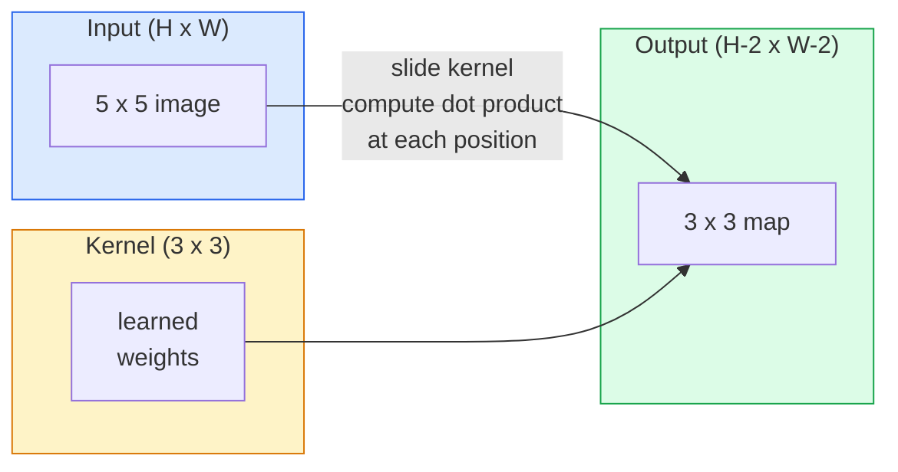
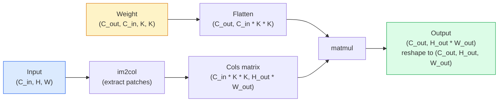

# Convolções a partir do zero

> Uma convolução é uma pequena camada densa que desliza através de uma imagem, compartilhando os mesmos pesos em todos os locais.

**Type:** Build
**Languages:** Python
**Prerequisites:** Phase 3 (Deep Learning Core), Phase 4 Lesson 01 (Image Fundamentals)
**Time:** ~75 minutes

## Objetivos de aprendizagem

- Implementar a convolução 2D a partir do zero usando apenas o NumPy, incluindo a versão de ciclo aninhado e uma vectorização `im2col`versão
- Calcule o tamanho espacial de saída para qualquer combinação de tamanho de entrada, tamanho do kernel, enchimento e passo, e justifique o `(H - K + 2P) / S + 1`fórmula
- Núcleos de design manual (edge, blur, sharpen, Sobel) e explicar por que cada um produz o padrão de ativações que faz
- As convulsões de pilhas em um extrator de características e a ligação da profundidade da pilha ao tamanho do campo receptivo

## O problema

Uma camada totalmente conectada em uma imagem RGB de 224x224 precisaria de 224 * 224 * 3 = 150.528 pesos de entrada por neurônio. Uma única camada oculta com 1.000 unidades já é de 150 milhões de parâmetros antes de aprender qualquer coisa útil. Pior ainda, essa camada não tem ideia de que um cão na parte superior esquerda e um cão na parte inferior direita são o mesmo padrão. Trata cada posição de pixel como independente, o que é exatamente errado para imagens: traduzir um gato por três pixels não deve forçar a rede a reaprender o conceito.

As duas propriedades que um modelo de imagem precisa são **translation equivariance**(a saída muda quando a entrada muda) e **parameter sharing**As camadas densas não dão nada, a convolução dá-lhe ambos de graça.

A convolução não foi inventada para aprendizagem profunda. É a mesma operação que alimenta a compressão JPEG, a borbulha de Gaussian na Photoshop, a detecção de borda na visão industrial e todos os filtros de áudio já enviados. A razão pela qual a CNNs dominou a ImageNet de 2012 a 2020 é que a convolução é o prévio correto para dados onde valores próximos estão relacionados e o mesmo padrão pode aparecer em qualquer lugar.

## O conceito

### Um núcleo, deslizante

Uma convolução 2D toma uma pequena matriz de peso chamada kernel (ou filtro), desliza-a através da entrada e em cada localização calcula a soma de produtos com elementos. Essa soma se torna um píxel de saída.



Um exemplo concreto 3x3 em uma entrada 5x5 (sem enchimento, passo 1):

```
Input X (5 x 5):                Kernel W (3 x 3):

  1  2  0  1  2                   1  0 -1
  0  1  3  1  0                   2  0 -2
  2  1  0  2  1                   1  0 -1
  1  0  2  1  3
  2  1  1  0  1

The kernel slides across every valid 3 x 3 window. Output Y is 3 x 3:

 Y[0,0] = sum( W * X[0:3, 0:3] )
 Y[0,1] = sum( W * X[0:3, 1:4] )
 Y[0,2] = sum( W * X[0:3, 2:5] )
 Y[1,0] = sum( W * X[1:4, 0:3] )
 ... and so on
```

Essa fórmula é a única.**shared weights, locality, sliding window**O resto é contabilidade.

### Formulha de tamanho de saída

Dado o tamanho espacial da entrada `H`, tamanho do núcleo `K`, empilhadeira`P`, passo `S`- Não .

```
H_out = floor( (H - K + 2P) / S ) + 1
```

Lembrem-se disso, vão calcular dezenas de vezes por arquitetura.

| Scenario | H | K | P | S | H_out |
|----------|---|---|---|---|-------|
| Valid conv, no padding | 32 | 3 | 0 | 1 | 30 |
| Same conv (preserves size) | 32 | 3 | 1 | 1 | 32 |
| Downsample by 2 | 32 | 3 | 1 | 2 | 16 |
| Pool 2x2 | 32 | 2 | 0 | 2 | 16 |
| Large receptive field | 32 | 7 | 3 | 2 | 16 |

"O mesmo enchimento" significa escolher P para que H_out == H quando S == 1. Para K ímpar, que é P = (K - 1) / 2. É por isso que os núcleos 3x3 dominam  eles são o menor núcleo ímpar que ainda tem um centro.

### Padding

Sem um enchimento, cada convolução encolhe o mapa de características. A pilha 20 deles e sua imagem 224x224 torna-se 184x184, o que desperdiça o cálculo na fronteira e complica as conexões residuais que precisam de formas correspondentes.

```
Zero padding (P = 1) on a 5 x 5 input:

  0  0  0  0  0  0  0
  0  1  2  0  1  2  0
  0  0  1  3  1  0  0
  0  2  1  0  2  1  0       Now the kernel can centre on pixel
  0  1  0  2  1  3  0       (0, 0) and still have three rows and
  0  2  1  1  0  1  0       three columns of values to multiply.
  0  0  0  0  0  0  0
```

Modos que encontram na prática: `zero`(mais comum), `reflect`(especular a borda, evitar fronteiras duras em modelos geracionais), `replicate`(Copia a borda), `circular`(enrolamento, utilizado em problemas toroidais).

### Passo

O passo é o tamanho do passo do deslizamento. `stride=1`é o padrão. `stride=2`A rede de televisão digital (CNN) é uma rede de televisão que reduz a metade das dimensões espaciais e é a maneira clássica de desmontar dentro de uma CNN sem uma camada de pool separada.

```
Stride 1 on a 5 x 5 input, 3 x 3 kernel:

  starts: (0,0) (0,1) (0,2)        -> output row 0
          (1,0) (1,1) (1,2)        -> output row 1
          (2,0) (2,1) (2,2)        -> output row 2

  Output: 3 x 3

Stride 2 on the same input:

  starts: (0,0) (0,2)              -> output row 0
          (2,0) (2,2)              -> output row 1

  Output: 2 x 2
```

### Canais de entrada múltiplos

As imagens reais têm três canais. Uma convolução 3x3 em uma entrada RGB é na verdade um volume 3x3x3: uma fatia 3x3 por canal de entrada. Em cada posição espacial, você multiplica e soma em todas as três fatas e adiciona um viés.

```
Input:   (C_in,  H,  W)        3 x 5 x 5
Kernel:  (C_in,  K,  K)        3 x 3 x 3 (one kernel)
Output:  (1,     H', W')       2D map

For a layer that produces C_out output channels, you stack C_out kernels:

Weight:  (C_out, C_in, K, K)   e.g. 64 x 3 x 3 x 3
Output:  (C_out, H', W')       64 x 3 x 3

Parameter count: C_out * C_in * K * K + C_out   (the + C_out is biases)
```

Essa última linha é a que você calculará ao planejar um modelo.`64 * 3 * 3 * 3 + 64 = 1,792`Parâmetros.

### O truque do Im2Col

Os circuitos aninhados são fáceis de ler, mas lentos. As GPUs querem grandes multiplicadores de matriz. O truque: aplanar cada janela de campo de recepção da entrada em uma coluna de uma grande matriz, aplanar o núcleo em uma linha, e toda a convolução se torna uma única matmul.



Cada implementação de conv de produção é uma variante deste, além de truques de caché-tiling (conv direto, Winograd, FFT conv para grandes kernels).

### Campo de recepção

Uma única conve 3x3 olha para 9 pixels de entrada. Apilação de dois conves 3x3 e um neurônio na segunda camada olha para 5x5 pixels de entrada.

```
RF after L stacked K x K convs (stride 1) = 1 + L * (K - 1)

With strides:   RF grows multiplicatively with stride along each layer.
```

A razão inteira pela qual "3x3 até o fim" funciona (VGG, ResNet, ConvNeXt) é que duas convas 3x3 vêem a mesma área de entrada que uma conva 5x5 mas com menos parâmetros e uma não linearidade extra entre eles.

```figure
convolution-kernel
```

## Construí-lo

### Passo 1: Pad uma matriz

Comece com o mais pequeno primitivo: uma função que se encaixa com zeros em torno de uma matriz H x W.

```python
import numpy as np

def pad2d(x, p):
    if p == 0:
        return x
    h, w = x.shape[-2:]
    out = np.zeros(x.shape[:-2] + (h + 2 * p, w + 2 * p), dtype=x.dtype)
    out[..., p:p + h, p:p + w] = x
    return out

x = np.arange(9).reshape(3, 3)
print(x)
print()
print(pad2d(x, 1))
```

O truque dos eixos de seguimento .`x.shape[:-2]`significa que a mesma função funciona em `(H, W)`- Não .`(C, H, W)`, ou `(N, C, H, W)`sem modificações.

### Passo 2: Convolução 2D com lojas aninhadas

A implementação de referência é lenta, mas inequívoca.`torch.nn.functional.conv2d`- Em princípio, não.

```python
def conv2d_naive(x, w, b=None, stride=1, padding=0):
    c_in, h, w_in = x.shape
    c_out, c_in_w, kh, kw = w.shape
    assert c_in == c_in_w

    x_pad = pad2d(x, padding)
    h_out = (h + 2 * padding - kh) // stride + 1
    w_out = (w_in + 2 * padding - kw) // stride + 1

    out = np.zeros((c_out, h_out, w_out), dtype=np.float32)
    for oc in range(c_out):
        for i in range(h_out):
            for j in range(w_out):
                hs = i * stride
                ws = j * stride
                patch = x_pad[:, hs:hs + kh, ws:ws + kw]
                out[oc, i, j] = np.sum(patch * w[oc])
        if b is not None:
            out[oc] += b[oc]
    return out
```

Quatro loops aninhados (canais de saída, fila, coluna, mais a soma implícita sobre C_in, kh, kw). Esta é a verdade de base que você vai verificar cada implementação mais rápida contra.

### Passo 3: Verifique com um kernel desenhado à mão

Construir um núcleo vertical Sobel, aplicá-lo a uma imagem sintética de passos, e assistir a borda vertical se iluminar.

```python
def synthetic_step_image():
    img = np.zeros((1, 16, 16), dtype=np.float32)
    img[:, :, 8:] = 1.0
    return img

sobel_x = np.array([
    [[-1, 0, 1],
     [-2, 0, 2],
     [-1, 0, 1]]
], dtype=np.float32)[None]

x = synthetic_step_image()
y = conv2d_naive(x, sobel_x, padding=1)
print(y[0].round(1))
```

Espere grandes valores positivos na coluna 7 (aumento de brilho de esquerda para direita) e zeros em todos os outros lugares.

### Passo 4: im2col

Converte cada janela do tamanho do núcleo na entrada em uma coluna de uma matriz.`C_in=3, K=3`, cada coluna é de 27 números.

```python
def im2col(x, kh, kw, stride=1, padding=0):
    c_in, h, w = x.shape
    x_pad = pad2d(x, padding)
    h_out = (h + 2 * padding - kh) // stride + 1
    w_out = (w + 2 * padding - kw) // stride + 1

    cols = np.zeros((c_in * kh * kw, h_out * w_out), dtype=x.dtype)
    col = 0
    for i in range(h_out):
        for j in range(w_out):
            hs = i * stride
            ws = j * stride
            patch = x_pad[:, hs:hs + kh, ws:ws + kw]
            cols[:, col] = patch.reshape(-1)
            col += 1
    return cols, h_out, w_out
```

Ainda é um ciclo Python, mas agora o trabalho pesado será um único matmul vectorizado.

### Passo 5: Conv rápida através de im2col + matmul

Substitua o ciclo quadruplo por uma multiplicação de matriz.

```python
def conv2d_im2col(x, w, b=None, stride=1, padding=0):
    c_out, c_in, kh, kw = w.shape
    cols, h_out, w_out = im2col(x, kh, kw, stride, padding)
    w_flat = w.reshape(c_out, -1)
    out = w_flat @ cols
    if b is not None:
        out += b[:, None]
    return out.reshape(c_out, h_out, w_out)
```

Verificação da correcção: executar ambas as implementações e comparar.

```python
rng = np.random.default_rng(0)
x = rng.normal(0, 1, (3, 16, 16)).astype(np.float32)
w = rng.normal(0, 1, (8, 3, 3, 3)).astype(np.float32)
b = rng.normal(0, 1, (8,)).astype(np.float32)

y_naive = conv2d_naive(x, w, b, padding=1)
y_im2col = conv2d_im2col(x, w, b, padding=1)

print(f"max abs diff: {np.max(np.abs(y_naive - y_im2col)):.2e}")
```

`max abs diff`Devia estar por perto .`1e-5`A diferença é a ordem de acumulação de pontos flutuantes, não um bug.

### Passo 6: Banco de núcleos desenhados à mão

Cinco filtros que mostram o que uma única camada de convecção pode expressar antes de qualquer treinamento.

```python
KERNELS = {
    "identity": np.array([[0, 0, 0], [0, 1, 0], [0, 0, 0]], dtype=np.float32),
    "blur_3x3": np.ones((3, 3), dtype=np.float32) / 9.0,
    "sharpen": np.array([[0, -1, 0], [-1, 5, -1], [0, -1, 0]], dtype=np.float32),
    "sobel_x": np.array([[-1, 0, 1], [-2, 0, 2], [-1, 0, 1]], dtype=np.float32),
    "sobel_y": np.array([[-1, -2, -1], [0, 0, 0], [1, 2, 1]], dtype=np.float32),
}

def apply_kernel(img2d, kernel):
    x = img2d[None].astype(np.float32)
    w = kernel[None, None]
    return conv2d_im2col(x, w, padding=1)[0]
```

Aplicado a qualquer imagem em escala cinzenta, suavizando-se, afiando-se, acende as bordas, Sobel-x ilumina as bordas verticais, Sobel-y ilumina as bordas horizontais. Estes são exatamente os padrões que a primeira camada de conveção treinada em AlexNet e VGG acabou aprendendo  porque um bom modelo de imagem precisa de detectores de bordas e manchas, não importa qual seja a tarefa que vem depois.

## Usá-lo

O PyTorch's `nn.Conv2d`O sistema de configuração de forma semântica é idêntico.

```python
import torch
import torch.nn as nn

conv = nn.Conv2d(in_channels=3, out_channels=64, kernel_size=3, stride=1, padding=1)
print(conv)
print(f"weight shape: {tuple(conv.weight.shape)}   # (C_out, C_in, K, K)")
print(f"bias shape:   {tuple(conv.bias.shape)}")
print(f"param count:  {sum(p.numel() for p in conv.parameters())}")

x = torch.randn(8, 3, 224, 224)
y = conv(x)
print(f"\ninput  shape: {tuple(x.shape)}")
print(f"output shape: {tuple(y.shape)}")
```

Troca de dinheiro`padding=1`Para`padding=0`E a saída cai para 222x222. Swap `stride=1`Para`stride=2`E ele cai para 112x112. A mesma fórmula que você memorizou acima.

## Envia-o

Esta lição produz:

- `outputs/prompt-cnn-architect.md` um prompt que, dado o tamanho da entrada, orçamento de parâmetros e campo receptor alvo, desenha uma pilha de `Conv2d`camadas com o K/S/P direito em cada passo.
- `outputs/skill-conv-shape-calculator.md` uma habilidade que percorre uma camada de especificação de rede por camada e retorna a forma de saída, campo receptivo e contagem de parâmetros para cada bloco.

## Exercícios

1. **(Easy)**Dado um input de escala de cinza de 128x128 e uma pilha de `[Conv3x3(s=1,p=1), Conv3x3(s=2,p=1), Conv3x3(s=1,p=1), Conv3x3(s=2,p=1)]`, calcular o tamanho espacial de saída e o campo receptivo em cada camada à mão. Verificar com uma PyTorch `nn.Sequential`de convases de manuais.
2. **(Medium)**Extensão`conv2d_naive`E ...`conv2d_im2col`Para aceitar um`groups`Mostra isso.`groups=C_in=C_out`Reproduz uma convulsão de profundidade e que o seu número de parâmetros é `C * K * K`Em vez de`C * C * K * K`- Não .
3. **(Hard)**Implementar o passagem para trás de `conv2d_im2col`com a mão: dada a gradiência da saída, calcular a gradiência de `x`E ...`w`Verificar contra`torch.autograd.grad`O truque: o gradiente do im2col é`col2im`, e tem que acumular janelas sobrepostas.

## Termos-chave

| Term | What people say | What it actually means |
|------|----------------|----------------------|
| Convolution | "Sliding a filter" | A learnable dot product applied at every spatial location with shared weights; mathematically a cross-correlation, but everyone calls it convolution |
| Kernel / filter | "The feature detector" | A small weight tensor of shape (C_in, K, K) whose dot product with a window of input produces one output pixel |
| Stride | "How far you jump" | The step size between consecutive kernel placements; stride 2 halves each spatial dimension |
| Padding | "Zeros on the edges" | Extra values added around the input so the kernel can centre on border pixels; `same` padding keeps output size equal to input size |
| Receptive field | "How much the neuron sees" | The patch of original input that a given output activation depends on, growing with depth and stride |
| im2col | "The GEMM trick" | Rearranging every receptive window into columns so convolution becomes one big matrix multiply — the core of every fast conv kernel |
| Depthwise conv | "One kernel per channel" | A conv with `groups == C_in`, computing each output channel from only its matching input channel; the backbone of MobileNet and ConvNeXt |
| Translation equivariance | "Shift in, shift out" | Property that shifting the input by k pixels shifts the output by k pixels; comes for free with shared weights |

## Mais leitura

- [A guide to convolution arithmetic for deep learning (Dumoulin & Visin, 2016)](https://arxiv.org/abs/1603.07285) os diagramas definitivos de acoplamento/estampamento/dilatação que cada curso copia silenciosamente
- [CS231n: Convolutional Neural Networks for Visual Recognition](https://cs231n.github.io/convolutional-networks/) as notas canônicas das palestras, incluindo a explicação original
- [The Annotated ConvNet (fast.ai)](https://nbviewer.org/github/fastai/fastbook/blob/master/13_convolutions.ipynb) um notebook que passa de uma convolução manual para um classificador de dígitos treinado
- [Receptive Field Arithmetic for CNNs (Dang Ha The Hien)](https://distill.pub/2019/computing-receptive-fields/) o explicador interativo de qualidade de papel dos cálculos de campos receptivos
