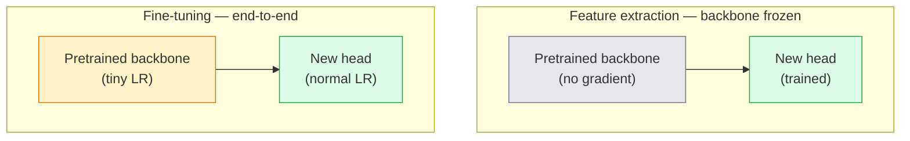

# Transferência de aprendizagem e ajuste perfeito

> Outro passou um milhão de horas de GPU a ensinar uma rede como são as bordas, as texturas e as partes de objetos.

**Type:** Build
**Languages:** Python
**Prerequisites:** Phase 4 Lesson 03 (CNNs), Phase 4 Lesson 04 (Image Classification)
**Time:** ~75 minutes

## Objetivos de aprendizagem

- Distinguir a extração de recursos do ajuste fino e escolher o certo com base no tamanho do conjunto de dados, distância de domínio e orçamento de computação
- Carregar uma espinha dorsal pré-entrenada, substituir a cabeça do classificador e treinar apenas a cabeça para uma linha de base de trabalho em menos de 20 linhas
- Descongelar progressivamente as camadas com taxas de aprendizagem discriminatórias para que os recursos genéricos iniciais recebam atualizações menores do que as específicas de tarefas tardías
- Diagnóstico das três falhas comuns: derivação de características de LR muito alto em blocos não congelados, colapso das estatísticas BN em conjuntos de dados minúsculos e esquecimento catastrófico

## O problema

O treinamento de um ResNet-50 na ImageNet custa cerca de 2.000 horas de GPU. Poucas equipes têm esse orçamento para cada tarefa que enviam. O que quase todas as equipes realmente enviam é uma espinha dorsal pré-entrenada com uma nova cabeça treinada em algumas centenas ou alguns milhares de imagens específicas de tarefas.

Isto não é um atalho. O primeiro bloco de convecção de qualquer CNN treinado pela ImageNet aprende bordas e filtros como Gabor. Os próximos blocos aprendem texturas e motivos simples. Os blocos do meio aprendem partes de objetos. Os blocos finais aprendem combinações que começam a parecer-se com as 1.000 categorias da ImageNet. A primeira 90% dessa hierarquia transfere quase inalterada para a imagem médica, inspecção industrial, dados de satélite e todas as outras tarefas de visão  porque a natureza tem um vocabulário limitado de bordas e texturas. Os últimos 10% são o que realmente treinas.

A transferência de dados tem três erros à sua espera: destruir recursos pré-treinados com uma taxa de aprendizagem muito alta, deixar o modelo de informação passar de fome congelado demais e deixar que as estatísticas em execução do BatchNorm se afundem em direção a um conjunto de dados minúsculo que o resto da rede nunca aprendeu.

## O conceito

### Extração de características versus ajuste fino

Dois regimes, escolhidos por quanto você confia nas características pré-treinadas e quanto dados você tem.



Regras de execução:

| Dataset size | Domain distance | Recipe |
|--------------|-----------------|--------|
| < 1k images | close to ImageNet | Freeze backbone, train head only |
| 1k-10k | close | Freeze first 2-3 stages, fine-tune the rest |
| 10k-100k | any | Fine-tune end-to-end with discriminative LR |
| 100k+ | far | Fine-tune everything; consider training from scratch if domain is far enough |

"Closer à ImageNet" significa aproximadamente fotos naturais RGB com conteúdo semelhante a objetos.

### Por que o congelamento funciona ?

A ImageNet apresenta uma CNN que descobre que não se especializam nas 1.000 categorias. Eles são especializados na estatística das imagens naturais: bordas em orientações específicas, texturas, padrões de contraste, formas primitivas. Essas estatísticas são estáveis em quase todos os domínios visuais que um ser humano pode nomear. É por isso que um modelo treinado na ImageNet e avaliado em tiro zero no CIFAR-10 com apenas uma nova cabeça linear (sem ajuste fino da coluna vertebral) atinge uma precisão de 80%+. A cabeça está a aprender quais das características já aprendidas devem ser pesadas para esta tarefa.

### Taxas de aprendizagem discriminatórias

Quando você descongelar, as camadas iniciais devem treinar mais lentamente do que as camadas posteriores.

```
Typical recipe:

  stage 0 (stem + first group): lr = base_lr / 100    (mostly fixed)
  stage 1:                       lr = base_lr / 10
  stage 2:                       lr = base_lr / 3
  stage 3 (last backbone group): lr = base_lr
  head:                          lr = base_lr  (or slightly higher)
```

Em PyTorch, esta é apenas uma lista de grupos de parâmetros passados ao optimizador. Um modelo, cinco taxas de aprendizagem, zero código extra.

### O problema BatchNorm

As camadas BN mantêm`running_mean`E ...`running_var`Os buffers que foram calculados na ImageNet. Se a sua tarefa tem uma distribuição de píxeles diferente  diferentes iluminação, sensor diferente, espaço de cores diferente  esses buffers estão errados. Três opções em ordem de preferência:

1. **Fine-tune with BN in train mode.**Deixar que a BN actualize as suas estatísticas de execução junto com tudo o mais.
2. **Freeze BN in eval mode.**Mantenha as estatísticas da ImageNet e treine apenas os pesos.
3. **Replace BN with GroupNorm.**Remove o problema da média móvel completamente. usado em espinha dorsal de detecção e segmentação onde o tamanho do lote por GPU é pequeno.

O erro de fazer isso silenciosamente aumenta a precisão em 5-15%.

### Design da cabeça

A cabeça do classificador é de 1-3 camadas lineares mais um desvio opcional.

```
backbone.fc = nn.Linear(backbone.fc.in_features, num_classes)          # ResNet
backbone.classifier[1] = nn.Linear(..., num_classes)                    # EfficientNet, MobileNet
backbone.heads.head = nn.Linear(..., num_classes)                       # torchvision ViT
```

Para pequenos conjuntos de dados, uma única camada linear é geralmente suficiente. Adicionar uma camada oculta (Linear -> ReLU -> Dropout -> Linear) ajuda quando a distribuição de tarefas está mais longe da distribuição de treinamento da espinha dorsal.

### Desintegração de LR por camadas

Uma versão mais suave do LR discriminativo usado em afinamentos modernos (BEiT, DINOv2, ViT-B). Em vez de agrupar camadas em fases, dar a cada camada um LR ligeiramente menor do que o acima:

```
lr_layer_k = base_lr * decay^(L - k)
```

Com decomposição = 0,75 e L = 12 blocos de transformador, os primeiros blocos de trens em`0.75^11 ≈ 0.04x`É mais importante para transformer de tons finos do que para as CNNs, onde as LR agrupadas em estágio são geralmente suficientes.

### O que avaliar

As corridas de transferência de aprendizagem precisam de dois números que não seguiriam numa corrida de arranhão:

- **Pretrained-only accuracy**A precisão da cabeça com a espinha congelada.
- **Fine-tuned accuracy**O mesmo modelo após o treinamento de ponta a ponta.

Se o ajustado é menos que o pré-treinado, você tem uma taxa de aprendizagem ou um erro BN.

```figure
transfer-learning
```

## Construí-lo

### Passo 1: Carregar uma coluna vertebral pré-treinada e inspecioná-la

```python
import torch
import torch.nn as nn
from torchvision.models import resnet18, ResNet18_Weights

backbone = resnet18(weights=ResNet18_Weights.IMAGENET1K_V1)
print(backbone)
print()
print("classifier head:", backbone.fc)
print("feature dim:", backbone.fc.in_features)
```

`ResNet18`tem quatro fases (`layer1..layer4`) mais um tronco e um`fc`Cada coluna vertebral de classificação de torchvision tem uma estrutura análoga.

### Passo 2: Extração de características  congelar tudo, substituir a cabeça

```python
def make_feature_extractor(num_classes=10):
    model = resnet18(weights=ResNet18_Weights.IMAGENET1K_V1)
    for p in model.parameters():
        p.requires_grad = False
    model.fc = nn.Linear(model.fc.in_features, num_classes)
    return model

model = make_feature_extractor(num_classes=10)
trainable = sum(p.numel() for p in model.parameters() if p.requires_grad)
frozen = sum(p.numel() for p in model.parameters() if not p.requires_grad)
print(f"trainable: {trainable:>10,}")
print(f"frozen:    {frozen:>10,}")
```

Só .`model.fc`A espinha dorsal é um extractor de características congeladas.

### Passo 3: Ajuste discriminatório

Um utilitário que constrói grupos de parâmetros com taxas de aprendizagem específicas de estágio.

```python
def discriminative_param_groups(model, base_lr=1e-3, decay=0.3):
    stages = [
        ["conv1", "bn1"],
        ["layer1"],
        ["layer2"],
        ["layer3"],
        ["layer4"],
        ["fc"],
    ]
    groups = []
    for i, names in enumerate(stages):
        lr = base_lr * (decay ** (len(stages) - 1 - i))
        params = [p for n, p in model.named_parameters()
                  if any(n.startswith(k) for k in names)]
        if params:
            groups.append({"params": params, "lr": lr, "name": "_".join(names)})
    return groups

model = resnet18(weights=ResNet18_Weights.IMAGENET1K_V1)
model.fc = nn.Linear(model.fc.in_features, 10)
for p in model.parameters():
    p.requires_grad = True

groups = discriminative_param_groups(model)
for g in groups:
    print(f"{g['name']:>10s}  lr={g['lr']:.2e}  params={sum(p.numel() for p in g['params']):>8,}")
```

`decay=0.3`significa cada etapa de um comboio a 30% da velocidade do próximo. `fc`- Não .`base_lr`- Não .`layer4`- Não .`0.3 * base_lr`- Não .`conv1`- Não .`0.3^5 * base_lr ≈ 0.00243 * base_lr`Sonoridade extrema, empírica funciona.

### Passo 4: Manutenção de batches

Ajudar a congelar as estatísticas de execução da BN sem congelar os seus pesos.

```python
def freeze_bn_stats(model):
    for m in model.modules():
        if isinstance(m, (nn.BatchNorm1d, nn.BatchNorm2d, nn.BatchNorm3d)):
            m.eval()
            for p in m.parameters():
                p.requires_grad = False
    return model
```

Chama-o depois de ter começado .`model.train()`No início de cada época.`model.train()`O sistema de formação de base de base de base de base de base de base de base de base de base de base de base de base de base de base de base de base de base de base de base de base de base de base de base de base de base de base de base de base de base de base de base de base de base de base de base de base de base de base de base de base de base de base de base de base de base de base de base de base de base de base de base de base de base de base de base de base de base de base de base de base de base de base de base de base de base de base de base de base de base de base de base de base de base de base de base de base de base de base de base de base de base de base de base de base de base de base de base de base de base de base de base de base de base de base de base de base de base de base de base de base de base de base de base de base de base de base de base de base de base de base de base de base de base de base de base de base de base de base de base de base de base de base de base de base de base de base de base de base de base de base de base de base de base de base de base de base de base de base de base de base de base de base de base de base de base de base de base de base de base de base de base de base de base de base de base de base de base de base de base de base de base de base de base de base de base de base de base de base de base de base de base de base de base de base de base de base de base de base de base de base de base de base de base de base de base de base de base de base de base de base de base de base de base de base de base de base de base de base de base de base de base de base de base de base de base de base de base de base de base de base de base de base de base de base de base de base de base de base de base de base de base de base de base de base de base de base de base de base de base de base de base de base de base de base de base de base de base de base de base de base de base de base de base de base de base de base de base de base de base de base de base de base de base

### Passo 5: Um ciclo mínimo de ajuste fino de ponta a ponta

```python
from torch.optim import SGD
from torch.utils.data import DataLoader
from torch.optim.lr_scheduler import CosineAnnealingLR
import torch.nn.functional as F

def fine_tune(model, train_loader, val_loader, device, epochs=5, base_lr=1e-3, freeze_bn=False):
    model = model.to(device)
    groups = discriminative_param_groups(model, base_lr=base_lr)
    optimizer = SGD(groups, momentum=0.9, weight_decay=1e-4, nesterov=True)
    scheduler = CosineAnnealingLR(optimizer, T_max=epochs)

    for epoch in range(epochs):
        model.train()
        if freeze_bn:
            freeze_bn_stats(model)
        tr_loss, tr_correct, tr_total = 0.0, 0, 0
        for x, y in train_loader:
            x, y = x.to(device), y.to(device)
            logits = model(x)
            loss = F.cross_entropy(logits, y, label_smoothing=0.1)
            optimizer.zero_grad()
            loss.backward()
            optimizer.step()
            tr_loss += loss.item() * x.size(0)
            tr_total += x.size(0)
            tr_correct += (logits.argmax(-1) == y).sum().item()
        scheduler.step()

        model.eval()
        va_total, va_correct = 0, 0
        with torch.no_grad():
            for x, y in val_loader:
                x, y = x.to(device), y.to(device)
                pred = model(x).argmax(-1)
                va_total += x.size(0)
                va_correct += (pred == y).sum().item()
        print(f"epoch {epoch}  train {tr_loss/tr_total:.3f}/{tr_correct/tr_total:.3f}  "
              f"val {va_correct/va_total:.3f}")
    return model
```

Cinco épocas com a receita acima do CIFAR-10 são necessárias `ResNet18-IMAGENET1K_V1`A cabeça sozinha se estabilizaria em torno de 86% sem tocar a espinha dorsal.

### Passo 6: Descongelamento progressivo

Um cronograma que descongela uma fase por época do fim ao início.

```python
def progressive_unfreeze_schedule(model):
    stages = ["layer4", "layer3", "layer2", "layer1"]
    yielded = set()

    def start():
        for p in model.parameters():
            p.requires_grad = False
        for p in model.fc.parameters():
            p.requires_grad = True

    def unfreeze(epoch):
        if epoch < len(stages):
            name = stages[epoch]
            yielded.add(name)
            for n, p in model.named_parameters():
                if n.startswith(name):
                    p.requires_grad = True
            return name
        return None

    return start, unfreeze
```

Liga-me .`start()`Uma vez antes da primeira época.`unfreeze(epoch)`Reconstrua o optimizador sempre que o conjunto de parâmetros treinables mudar, caso contrário os parâmetros congelados ainda mantêm momentos em cache que o confundem.

## Usá-lo

Para a maioria das tarefas reais,`torchvision.models`A máquina mais pesada acima importa quando se encontram com os problemas que as bibliotecas padrão não podem resolver.

```python
from torchvision.models import resnet50, ResNet50_Weights

model = resnet50(weights=ResNet50_Weights.IMAGENET1K_V2)
model.fc = nn.Linear(model.fc.in_features, num_classes)
optimizer = torch.optim.AdamW(model.parameters(), lr=1e-4, weight_decay=1e-4)
```

Outras duas deficiências de nível de produção:

- `timm`navios ~ 800 espinhas de visão pré-treinadas com uma API consistente (`timm.create_model("resnet50", pretrained=True, num_classes=10)`Para qualquer melodia fina além do zoológico torchvision, é o padrão.
- Para transformadores, `transformers.AutoModelForImageClassification.from_pretrained(name, num_labels=N)`dá-lhe ViT / BEiT / DeiT com a mesma semântica de carga que os modelos de texto.

## Envia-o

Esta lição produz:

- `outputs/prompt-fine-tune-planner.md` um prompt que escolhe a extração de recursos versus a sintonia progressiva versus finação de ponta a ponta com base no tamanho do conjunto de dados, distância de domínio e orçamento de computação.
- `outputs/skill-freeze-inspector.md` uma habilidade que, dada um modelo PyTorch, informa quais parâmetros são treinables, quais camadas BatchNorm estão em modo eval e se o optimizador está realmente sendo alimentado com os parâmetros treinables.

## Exercícios

1. **(Easy)**Treinar um`ResNet18`A análise de dados de um sistema de transferência de dados de um sistema de transferência de dados de um sistema de transferência de dados de um sistema de transferência de dados de um sistema de transferência de dados de um sistema de transferência de dados de um sistema de transferência de dados de um sistema de transferência de dados de um sistema de transferência de dados de um sistema de transferência de dados de um sistema de transferência de dados de um sistema de transferência de dados de um sistema de transferência de dados de um sistema de transferência de dados de um sistema de transferência de dados de um sistema de transferência de dados de um sistema de transferência de dados de um sistema de transferência de dados de um sistema de transferência de dados de um sistema de transferência de dados de um sistema de transferência de dados de um sistema de transferência de dados de um sistema de transferência de dados de um sistema de transferência de dados de um sistema de transferência de dados de um sistema de transferência de dados de um sistema de transferência de dados de um sistema de transferência de dados de um sistema de transferência de dados de dados de um sistema de transferência de dados de dados de um sistema de dados de dados de dados de um sistema de dados de dados de dados de dados de dados de dados de dados de dados de dados de dados de dados de dados de dados de dados de dados de dados de dados de dados de dados de dados de dados de dados de dados de dados de dados de dados de dados de dados de dados de dados de dados de dados de dados de dados de dados de dados de dados de dados de dados de dados de dados de dados de dados de dados de dados de dados de dados de dados de dados de dados de dados de dados de dados de dados de dados de dados de dados de dados de dados de dados de dados de dados de dados de dados de dados de dados de dados de dados de dados de dados de dados de dados de dados de dados de dados de dados de dados de dados de dados de dados de dados de dados de dados de dados de dados de dados de dados de dados de dados de dados de dados de dados de dados de dados de dados de dados de dados de dados de dados de dados de dados de dados de dados de dados de dados de dados de dados de dados de dados de dados de dados de dados de dados de dados de dados de dados de dados de dados de dados de dados de dados de dados de dados de dados de dados
2. **(Medium)**Introduzir um bug de propósito: set `base_lr = 1e-1`A formação de um grupo de homens é uma forma de formação de um grupo de homens que se encontra em um grupo de homens que se encontra em um grupo de homens que se encontra em um grupo de homens que se encontra em um grupo de homens que se encontram em um grupo de homens que se encontram em um grupo de homens que se encontram em um grupo de homens que se encontram em um grupo de homens que se encontram em um grupo de homens que se encontram em um grupo de homens que se encontram em um grupo de homens que se encontram em um grupo de homens que se encontram em um grupo de homens que se encontram em um grupo de mulheres que se encontram em um grupo de homens que se encontram em um grupo de mulheres que se encontram em um grupo de mulheres que se encontram em um grupo de mulheres que se encontram com mulheres.`discriminative_param_groups`Regista a LR em que cada fase começa a divergir.
3. **(Hard)**Tomar um conjunto de dados de imagem médica (por exemplo, CheXpert-small, PatchCamelyon ou HAM10000) e comparar três regimes: (a) espinha dorsal congelada + cabeça linear treinada pela ImageNet; (b) end-to-end de sintonia fina treinada pela ImageNet; (c) treinamento de arranhão. Relate precisão e custo de computação para cada um. Em que tamanho de conjunto de dados o treinamento de arranhão se torna competitivo?

## Termos-chave

| Term | What people say | What it actually means |
|------|----------------|----------------------|
| Feature extraction | "Freeze and train head" | Backbone parameters frozen, only the new classifier head receives gradient |
| Fine-tuning | "Retrain end-to-end" | All parameters trainable, usually with much smaller LR than scratch training |
| Discriminative LR | "Smaller LR for early layers" | Optimizer parameter groups where early-stage LR is a fraction of late-stage LR |
| Layer-wise LR decay | "Smooth LR gradient" | Per-layer LR multiplied by decay^(L - k); common in transformer fine-tunes |
| Catastrophic forgetting | "The model lost ImageNet" | A too-high LR overwrites pretrained features before the new task signal is learnt |
| BN statistics drift | "Running mean is wrong" | BatchNorm running_mean/var computed on a different distribution than the current task, silently hurting accuracy |
| Linear probe | "Frozen backbone + linear head" | Evaluation of pretrained features — accuracy of the best linear classifier on top of the frozen representation |
| Catastrophic collapse | "Everything predicts one class" | Happens when fine-tuning with an LR high enough to destroy features before gradients from the head can stabilise |

## Mais leitura

- [How transferable are features in deep neural networks? (Yosinski et al., 2014)](https://arxiv.org/abs/1411.1792) o papel que quantificou a transferência das características entre as camadas
- [Universal Language Model Fine-tuning (ULMFiT, Howard & Ruder, 2018)](https://arxiv.org/abs/1801.06146) a receita original discriminativa LR / descongelamento progressivo; as ideias transferem-se diretamente para a visão
- [timm documentation](https://huggingface.co/docs/timm) a referência para os espinhos visuais modernos e os defeitos exatos de sintonia fina com os quais foram treinados
- [A Simple Framework for Linear-Probe Evaluation (Kornblith et al., 2019)](https://arxiv.org/abs/1805.08974) por que a precisão da sonda linear é importante e como relatá-la corretamente
