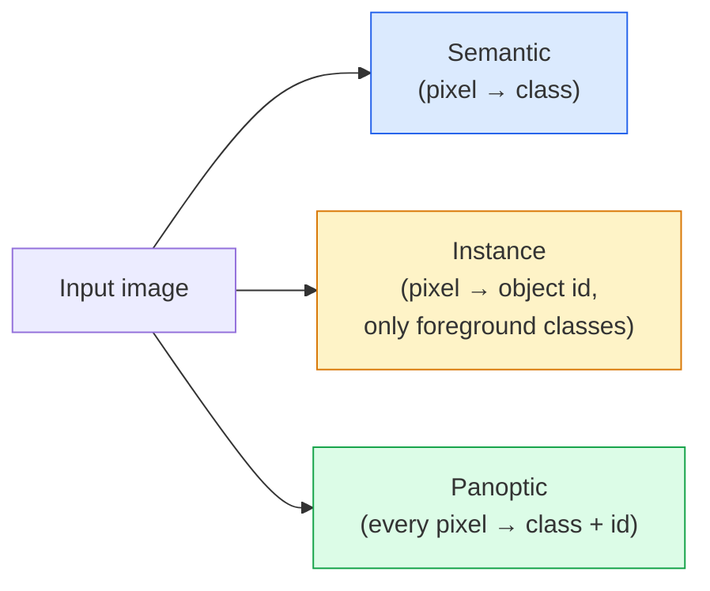
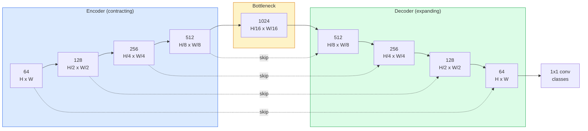

# Segmentação semântica  U-Net

> A segmentação é classificação em cada pixel. U-Net faz isso funcionando juntando um codificador de downsampling com um decodificador de upsampling e cablagem de ligações entre eles.

**Type:** Build
**Languages:** Python
**Prerequisites:** Phase 4 Lesson 03 (CNNs), Phase 4 Lesson 04 (Image Classification)
**Time:** ~75 minutes

## Objetivos de aprendizagem

- Distinguir a segmentação semântica, instância e panóptica e escolher a tarefa certa para um determinado problema
- Construir uma U-Net do zero em PyTorch com blocos de codificação, um gargalo de engarrafamento, um decodificador com convulsões transpostas e saltar conexões
- Implementar pixel-wise cross-entropy, perda de dados, e a perda combinada que é o padrão atual para segmentação médica e industrial
- Leia as métricas de IoU e Dice por classe e diagnostique se uma pontuação ruim vem de recall de pequenos objetos, precisão de limites ou desequilíbrio de classe

## O problema

A classificação produz uma etiqueta por imagem. A detecção produz um punhado de caixas por imagem. A segmentação produz uma etiqueta por pixel. Para uma entrada de tamanho `H x W`, a saída é um tensor de forma `H x W`(semântica) ou `H x W x N_instances`São milhões de previsões por imagem, não uma.

A estrutura da segmentação é a razão pela qual ele alimenta quase todos os produtos de visão de previsão densa: imagem médica (máscaras de tumor), condução autônoma ( estrada, faixa, obstáculo), satélite (empreintes de edifícios, limites de culturas), análise de documentos (zonas de layout), robótica (regiões compreensíveis). Nenhuma dessas tarefas pode ser resolvida colocando uma caixa ao redor do objeto; eles precisam da silueta exata.

O problema arquitetônico é simples de afirmar e não é simples de resolver: você precisa da rede para ver o contexto global de uma imagem (que tipo de cena é esta) e o detalhe de pixels locais (exatamente qual pixel é estrada vs pavimento) simultaneamente. Uma CNN padrão comprime espacialmente para obter contexto, o que joga fora o detalhe. U-Net foi o design que obteve ambos.

## O conceito

### Semântica vs instância vs panóptica



- **Semantic**Diz: "este pixel é estrada, aquele pixel é carro". Dois carros ao lado colapsa em uma única mancha.
- **Instance**diz "este pixel é carro #3, esse pixel é carro #5. " Ignora as coisas de fundo ("coisas" = céu, estrada, grama).
- **Panoptic**Unifica ambos: cada pixel recebe um rótulo de classe, cada instância recebe um ID único, coisas e coisas ambos segmentados.

Esta lição abrange a semântica.

### A forma da U-Net



O encoder reduz a resolução espacial em quatro vezes e duplica os canais. O decodificador inverte: duplica a resolução espacial em quatro vezes e divide os canais. As conexões skip concatenam recursos de encoder correspondentes com recursos de decodificador em cada resolução.`64 -> num_classes`- Em resolução total.

Por que as conexões de saltar são necessárias: o decodificador só viu pequenos mapas de recursos no momento em que tenta emitir previsões de nível de píxeles. Sem os saltos não pode localizar bordas com precisão porque essa informação foi comprimida no encodificador.

### Transposto versus amostra de ascensão bilinear

O decodificador tem de ampliar as dimensões espaciais.

- **Transposed convolution**(`nn.ConvTranspose2d` Aplicável exemplo. Histórico U-Net padrão. Pode produzir artefatos de quadro de xadrez se passo e tamanho do núcleo não se dividem uniformemente.
- **Bilinear upsample + 3x3 conv** uma amostra de alta suave seguida de uma convecção. Menos artefatos, menos parâmetros, agora o padrão moderno.

Para uma primeira U-Net, bilinear é mais seguro.

### Entropia cruzada numa grade de pixels

Para a segmentação semântica com classes C, a saída do modelo é `(N, C, H, W)`O alvo é o`(N, H, W)`A entropia cruzada é idêntica ao caso de classificação, apenas aplicada em cada posição espacial:

```
Loss = mean over (n, h, w) of -log( softmax(logits[n, :, h, w])[target[n, h, w]] )
```

`F.cross_entropy`A PyTorch lida com esta forma de forma nativa.

### Perda de dados e por que você precisa dela

A entropia cruzada trata todos os pixels de forma igual. Isso é errado quando uma classe domina o quadro (imagem médica: 99% de fundo, 1% de tumor). A rede pode obter 99% de precisão, prevendo fundo em todos os lugares e ainda ser inútil.

A perda de dados resolve isto, otimizando diretamente a sobreposição entre a mascara prevista e a verdadeira:

```
Dice(p, y) = 2 * sum(p * y) / (sum(p) + sum(y) + epsilon)
Dice_loss = 1 - Dice
```

onde`p`é o mapa de probabilidade sigmoide/softmax para uma classe e `y`A perda é zero apenas quando a sobreposição é perfeita. Porque é baseada em relação, desequilíbrio de classe é irrelevante.

Na prática, use o **combined loss**- Não .

```
L = L_cross_entropy + lambda * L_dice       (lambda ~ 1)
```

A entropia cruzada dá gradientes estáveis no início do treinamento; o Dice concentra a cauda do treinamento na correspondência da forma da máscara. Esta combinação é o padrão de imagem médica e difícil de vencer em qualquer conjunto de dados desequilibrado de classe.

### Metricas de avaliação

- **Pixel accuracy**Preço baixo, quebrado em dados desequilibrados pela mesma razão que a precisão na classificação.
- **IoU per class** intersecção sobre a união para a máscara de cada classe; média entre as classes = mIoU.
- **Dice (F1 on pixels)** semelhante à UOI; `Dice = 2 * IoU / (1 + IoU)`A imagem médica prefere o Dice, a comunidade de condução prefere o IoU; eles estão monotonicamente relacionados.
- **Boundary F1** medidas de quão perto estão os limites previstos dos limites da verdade do solo, penalizando mesmo pequenas mudanças.

A média da UO oculta uma classe a 15% quando outras nove são a 85%.

### Comércio de resolução de entrada

O codificador da U-Net reduz a resolução em quatro vezes, de modo que a entrada deve ser divisível por 16.`H * W * C_max`, e em 1024x1024 com 1024 canais de garganta, a passagem avançada já usa gigabytes de VRAM.

Dois métodos de solução padrão:
1. Tela de entrada processar 256x256 de telhas com sobreposição e costura.
2. Substituir o gargalo de engarrafamento por convulsões dilatadas que mantenham maior resolução espacial mas alargam o campo receptivo (a família DeepLab).

Para um primeiro modelo, uma entrada de 256x256 com uma U-Net baseada em 64 canais entra confortavelmente em 8 GB de VRAM.

```figure
segmentation-flood
```

## Construí-lo

### Passo 1: Bloco de codificação

Dois convos 3x3 com norma de lote e ReLU.

```python
import torch
import torch.nn as nn
import torch.nn.functional as F

class DoubleConv(nn.Module):
    def __init__(self, in_c, out_c):
        super().__init__()
        self.net = nn.Sequential(
            nn.Conv2d(in_c, out_c, kernel_size=3, padding=1, bias=False),
            nn.BatchNorm2d(out_c),
            nn.ReLU(inplace=True),
            nn.Conv2d(out_c, out_c, kernel_size=3, padding=1, bias=False),
            nn.BatchNorm2d(out_c),
            nn.ReLU(inplace=True),
        )

    def forward(self, x):
        return self.net(x)
```

Este bloco é reutilizado em toda a parte. `bias=False`Porque o beta do BN lida com o preconceito.

### Passo 2: Blocos para baixo e para cima

```python
class Down(nn.Module):
    def __init__(self, in_c, out_c):
        super().__init__()
        self.net = nn.Sequential(
            nn.MaxPool2d(2),
            DoubleConv(in_c, out_c),
        )

    def forward(self, x):
        return self.net(x)


class Up(nn.Module):
    def __init__(self, in_c, out_c):
        super().__init__()
        self.up = nn.Upsample(scale_factor=2, mode="bilinear", align_corners=False)
        self.conv = DoubleConv(in_c, out_c)

    def forward(self, x, skip):
        x = self.up(x)
        if x.shape[-2:] != skip.shape[-2:]:
            x = F.interpolate(x, size=skip.shape[-2:], mode="bilinear", align_corners=False)
        x = torch.cat([skip, x], dim=1)
        return self.conv(x)
```

A verificação de forma apenas para o espaço (`shape[-2:]`) manipula os insumos cujas dimensões não são divisíveis por 16; um cofre `F.interpolate`A comparação da forma completa também desencadearia diferenças na contagem de canais, o que deve ser um erro alto, não um interpolado silencioso.

### Passo 3: A U-Net

```python
class UNet(nn.Module):
    def __init__(self, in_channels=3, num_classes=2, base=64):
        super().__init__()
        self.inc = DoubleConv(in_channels, base)
        self.d1 = Down(base, base * 2)
        self.d2 = Down(base * 2, base * 4)
        self.d3 = Down(base * 4, base * 8)
        self.d4 = Down(base * 8, base * 16)
        self.u1 = Up(base * 16 + base * 8, base * 8)
        self.u2 = Up(base * 8 + base * 4, base * 4)
        self.u3 = Up(base * 4 + base * 2, base * 2)
        self.u4 = Up(base * 2 + base, base)
        self.outc = nn.Conv2d(base, num_classes, kernel_size=1)

    def forward(self, x):
        x1 = self.inc(x)
        x2 = self.d1(x1)
        x3 = self.d2(x2)
        x4 = self.d3(x3)
        x5 = self.d4(x4)
        x = self.u1(x5, x4)
        x = self.u2(x, x3)
        x = self.u3(x, x2)
        x = self.u4(x, x1)
        return self.outc(x)

net = UNet(in_channels=3, num_classes=2, base=32)
x = torch.randn(1, 3, 256, 256)
print(f"output: {net(x).shape}")
print(f"params: {sum(p.numel() for p in net.parameters()):,}")
```

Forma de saída `(1, 2, 256, 256)` tamanho espacial igual ao da entrada, `num_classes`- Os canais.`base=32`- Não .

### Passo 4: Perdas

```python
def dice_loss(logits, targets, num_classes, eps=1e-6):
    probs = F.softmax(logits, dim=1)
    targets_one_hot = F.one_hot(targets, num_classes).permute(0, 3, 1, 2).float()
    dims = (0, 2, 3)
    intersection = (probs * targets_one_hot).sum(dim=dims)
    denom = probs.sum(dim=dims) + targets_one_hot.sum(dim=dims)
    dice = (2 * intersection + eps) / (denom + eps)
    return 1 - dice.mean()


def combined_loss(logits, targets, num_classes, lam=1.0):
    ce = F.cross_entropy(logits, targets)
    dc = dice_loss(logits, targets, num_classes)
    return ce + lam * dc, {"ce": ce.item(), "dice": dc.item()}
```

Os dados são calculados por classe e depois mediados (macro dados).`eps`previne a divisão por zero das classes ausentes do lote.

### Passo 5: Metrica de IUI

```python
@torch.no_grad()
def iou_per_class(logits, targets, num_classes):
    preds = logits.argmax(dim=1)
    ious = torch.zeros(num_classes)
    for c in range(num_classes):
        pred_c = (preds == c)
        true_c = (targets == c)
        inter = (pred_c & true_c).sum().float()
        union = (pred_c | true_c).sum().float()
        ious[c] = (inter / union) if union > 0 else torch.tensor(float("nan"))
    return ious
```

Retorna um vetor de comprimento C. `nan`As classes ausentes do lote  não são médias sobre as que são calculadas em mIoU.

### Passo 6: conjunto de dados sintéticos para verificação integral

Gerenar formas em fundos coloridos para que a rede tenha de aprender a forma, não a cor de pixels.

```python
import numpy as np
from torch.utils.data import Dataset, DataLoader

def synthetic_segmentation(num_samples=200, size=64, seed=0):
    rng = np.random.default_rng(seed)
    images = np.zeros((num_samples, size, size, 3), dtype=np.float32)
    masks = np.zeros((num_samples, size, size), dtype=np.int64)
    for i in range(num_samples):
        bg = rng.uniform(0, 1, (3,))
        images[i] = bg
        masks[i] = 0
        num_shapes = rng.integers(1, 4)
        for _ in range(num_shapes):
            cls = int(rng.integers(1, 3))
            color = rng.uniform(0, 1, (3,))
            cx, cy = rng.integers(10, size - 10, size=2)
            r = int(rng.integers(4, 12))
            yy, xx = np.meshgrid(np.arange(size), np.arange(size), indexing="ij")
            if cls == 1:
                mask = (xx - cx) ** 2 + (yy - cy) ** 2 < r ** 2
            else:
                mask = (np.abs(xx - cx) < r) & (np.abs(yy - cy) < r)
            images[i][mask] = color
            masks[i][mask] = cls
        images[i] += rng.normal(0, 0.02, images[i].shape)
        images[i] = np.clip(images[i], 0, 1)
    return images, masks


class SegDataset(Dataset):
    def __init__(self, images, masks):
        self.images = images
        self.masks = masks

    def __len__(self):
        return len(self.images)

    def __getitem__(self, i):
        img = torch.from_numpy(self.images[i]).permute(2, 0, 1).float()
        mask = torch.from_numpy(self.masks[i]).long()
        return img, mask
```

Três classes: fundo (0), círculos (1), quadrados (2). A rede deve aprender a distinguir a forma.

### Passo 7: Localização de treinamento

```python
def train_one_epoch(model, loader, optimizer, device, num_classes):
    model.train()
    loss_sum, total = 0.0, 0
    iou_sum = torch.zeros(num_classes)
    for x, y in loader:
        x, y = x.to(device), y.to(device)
        logits = model(x)
        loss, _ = combined_loss(logits, y, num_classes)
        optimizer.zero_grad()
        loss.backward()
        optimizer.step()
        loss_sum += loss.item() * x.size(0)
        total += x.size(0)
        iou_sum += iou_per_class(logits, y, num_classes).nan_to_num(0)
    return loss_sum / total, iou_sum / len(loader)
```

Exerça este método durante 10 a 30 épocas no conjunto de dados sintéticos e observe a escala de mIU para além de 0,9 para as classes de forma.`nan_to_num(0)`Tratam de zero as classes ausentes de um lote; para a IU exacta por classe, mascarar por presença e utilização `torch.nanmean`Em vez de uma média aqui, em lote de lote no momento da avaliação.

## Usá-lo

Para produção, `segmentation_models_pytorch`("smp") envolve todas as arquiteturas de segmentação padrão com qualquer visão de tocha ou coluna vertebral de timm.

```python
import segmentation_models_pytorch as smp

model = smp.Unet(
    encoder_name="resnet34",
    encoder_weights="imagenet",
    in_channels=3,
    classes=3,
)
```

Também vale a pena saber para o trabalho real:
- **DeepLabV3+**Substitui a amostragem de baixa baseada em polas máximas por convases dilatadas para que o gargalo de engarrafamento mantenha resolução; limites mais rápidos em dados de satélite e condução.
- **SegFormer**O sistema de transferência de dados é um sistema de transferência de dados.
- **Mask2Former**- Não .**OneFormer**unificar a segmentação semântica, instância e panóptica em uma única arquitetura.

Todos os três são substituições de entrada .`smp`ou `transformers`com o mesmo carregador de dados.

## Envia-o

Esta lição produz:

- `outputs/prompt-segmentation-task-picker.md` um prompt que escolhe entre segmentação semântica, instância e panóptica e nomeia a arquitetura para uma determinada tarefa.
- `outputs/skill-segmentation-mask-inspector.md` uma habilidade que relata a distribuição de classes, estatísticas de mascaras previstas e as classes que são sub-previsíveis ou confusas.

## Exercícios

1. **(Easy)**Implementação `bce_dice_loss`Para uma tarefa de segmentação binária (prefeitura vs fundo). Verifique em um conjunto de dados sintético de duas classes que a perda combinada converge mais rapidamente do que a BCE sozinha quando o primeiro plano é de 5% de pixels.
2. **(Medium)**Substitui o `nn.Upsample + conv`Bloco superior com um `nn.ConvTranspose2d`- a formação dos dois conjuntos de dados sintéticos e a comparação de mIoU. Observe onde os artefatos de quadro de xadrez aparecem na versão transposta-conv.
3. **(Hard)**Tomar um conjunto de dados de segmentação real (Pets Oxford-IIIT, Cityscapes mini split, ou um subconjunto médico) e treinar a U-Net para dentro de 2 pontos de UU da `smp.Unet`Relatório por classe de UIO e identifique quais classes se beneficiam mais com a adição de dados à perda.

## Termos-chave

| Term | What people say | What it actually means |
|------|----------------|----------------------|
| Semantic segmentation | "Label every pixel" | Per-pixel classification into C classes; instances of the same class merge |
| Instance segmentation | "Label every object" | Separates distinct instances of the same class; foreground-only |
| Panoptic segmentation | "Semantic + instance" | Every pixel gets a class; every thing instance also gets a unique id |
| Skip connection | "U-Net bridge" | Concatenation of encoder features into matching-resolution decoder features; preserves high-frequency detail |
| Transposed conv | "Deconvolution" | Learnable upsampling; can produce checkerboard artifacts |
| Dice loss | "Overlap loss" | 1 - 2|A ∩ B| / (|A| + |B|); optimises mask overlap directly and is robust to class imbalance |
| mIoU | "Mean intersection over union" | Average IoU across classes; the community-standard metric for segmentation |
| Boundary F1 | "Boundary accuracy" | F1 score computed on boundary pixels only; matters for precision-critical tasks |

## Mais leitura

- [U-Net: Convolutional Networks for Biomedical Image Segmentation (Ronneberger et al., 2015)](https://arxiv.org/abs/1505.04597) o papel original; a figura que todos copiam está na página 2
- [Fully Convolutional Networks (Long et al., 2015)](https://arxiv.org/abs/1411.4038) o papel que fez a segmentação um problema de con-
- [segmentation_models_pytorch](https://github.com/qubvel/segmentation_models.pytorch) a referência para a segmentação da produção; cada arquitetura padrão mais cada perda padrão
- [Lessons learned from training SOTA segmentation (kaggle.com competitions)](https://www.kaggle.com/code/iafoss/carvana-unet-pytorch) um passo-a-passo sobre por que a TTA, a pseudoetiquetação e os pesos de classe importam nos dados reais
