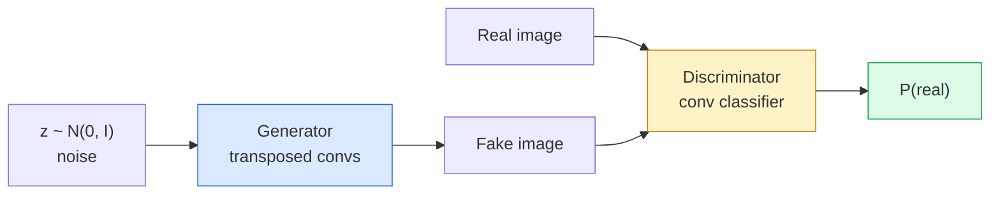
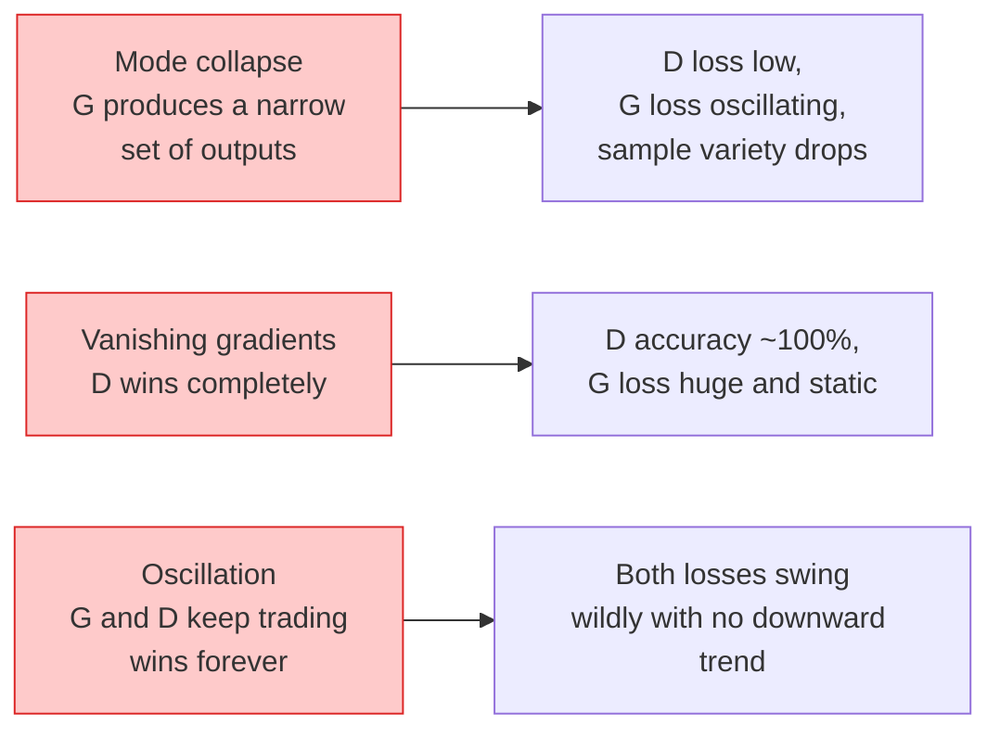

# Geração de imagens  GANs

> Um GAN é duas redes neurais num jogo fixo, uma empurra, outra critica, que se tornam melhores juntas até que os desenhos enganem o crítico.

**Type:** Build
**Languages:** Python
**Prerequisites:** Phase 4 Lesson 03 (CNNs), Phase 3 Lesson 06 (Optimizers), Phase 3 Lesson 07 (Regularization)
**Time:** ~75 minutes

## Objetivos de aprendizagem

- Explique o jogo de minimax entre gerador e discriminador e por que o equilíbrio corresponde a p_modelo = p_data
- Implementar um DCGAN em PyTorch e fazê-lo gerar imagens sintéticas coerentes 32x32 em menos de 60 linhas
- Estabilizar o treinamento GAN com os três truques padrão: perda não saturante, norma espectral, TTUR (regra de atualização em duas escalas)
- Leia curvas de treinamento que distinguem a convergência saudável do colapso de modo, oscilação e discriminador-ganhos-completamente

## O problema

A classificação ensina uma rede a mapear imagens para rótulos. A geração inverte o problema: amostra novas imagens que parecem ter vindo da mesma distribuição. Não há saída "correcta" que você possa diferir contra; há apenas uma distribuição que você deseja imitar.

As funções padrão de perda (MSE, entropia cruzada) não podem medir "se esta amostra vem da distribuição real". Minimizando o erro por pixel produz médias borbulhas, não amostras realistas.

GANs (Goodfellow et al., 2014) definiram essa estrutura. Em 2018, StyleGAN estava produzindo 1024x1024 rostos indistinguíveis das fotografias. Os modelos de difusão desde então assumiu o trono em qualidade e controlagem, mas cada truque que torna a difusão prática  escolhas de normalização, espaços latentes, perdas de características  foi primeiro entendido nas GANs.

## O conceito

### As duas redes



O **generator**G toma um vetor de ruído `z`E produz uma imagem.**discriminator**D toma uma imagem e produz um único escalar: a probabilidade de que a imagem seja real.

### O jogo

G quer que D esteja errado, D quer ter razão.

```
min_G max_D  E_x[log D(x)] + E_z[log(1 - D(G(z)))]
```

Leia de direita para esquerda: D maximiza a precisão em real (`log D(real)`) e falsos (`log (1 - D(fake))`G está a minimizar a precisão de D sobre falsificações  quer `D(G(z))`- Para estar drogado.

Goodfellow provou que este mínimo possui um equilíbrio global onde `p_G = p_data`, D produz 0,5 em todos os lugares, e a divergência Jensen-Shannon entre distribuições geradas e reais é zero.

### Perda não saturante

A forma acima é numericamente instável.`D(G(z))`É quase zero para cada falso, então `log(1 - D(G(z)))`Tem gradientes desaparecendo em relação a G. A solução: a perda de G invertida.

```
L_D = -E_x[log D(x)] - E_z[log(1 - D(G(z)))]
L_G = -E_z[log D(G(z))]                          # non-saturating
```

Agora , quando ?`D(G(z))`O G é um grande número de trens G, e o seu gradiente é informativo.

### Regras de arquitetura DCGAN

Radford, Metz, Chintala (2015) destilaram anos de experimentos fracassados em cinco regras que tornam o treinamento GAN estável:

1. Substitua a aglutinação por convases de passo (ambas redes).
2. Utilize a norma de lote em ambos os geradores e discriminadores, exceto a saída de G e a entrada de D.
3. Remover camadas totalmente conectadas em arquiteturas mais profundas.
4. G utiliza a ReLU em todas as camadas, exceto em saída (tanh para saída em [-1, 1]).
5. D utiliza LeakyReLU (negativo_inclinação = 0,2) em todas as camadas.

Cada GAN moderno baseado em conve (StyleGAN, BigGAN, GigaGAN) ainda começa com estas regras e substitui peças uma por vez.

### Modos de falha e suas assinaturas



- **Mode collapse**G encontra uma imagem que engana D e produz apenas isso.
- **Discriminator wins**A D fica muito forte, os gradientes do G desaparecem.
- **Oscillation**A solução é: TTUR (D aprende mais rápido do que G por um fator de 2-4), ou mudar para perda Wasserstein.

### Avaliação

Os GANs não têm verdade, então como sabes que estão a funcionar?

- **Sample inspection**- Basta olhar para 64 amostras no final de cada época.
- **FID (Fréchet Inception Distance)** distância entre as distribuições de elementos de Inception-v3 dos conjuntos reais e gerados.
- **Inception Score** mais velhos, mais frágeis; preferem a FID.
- **Precision/Recall for generative models** medidas de qualidade (precisão) e cobertura (recall) separadamente.

Para uma pequena execução de dados sintéticos, basta uma inspecção de amostras.

```figure
cv-gan-image
```

## Construí-lo

### Passo 1: Gerador

Um pequeno gerador DCGAN que toma ruído de 64 dimensões e produz uma imagem de 32x32.

```python
import torch
import torch.nn as nn

class Generator(nn.Module):
    def __init__(self, z_dim=64, img_channels=3, feat=64):
        super().__init__()
        self.net = nn.Sequential(
            nn.ConvTranspose2d(z_dim, feat * 4, kernel_size=4, stride=1, padding=0, bias=False),
            nn.BatchNorm2d(feat * 4),
            nn.ReLU(inplace=True),
            nn.ConvTranspose2d(feat * 4, feat * 2, kernel_size=4, stride=2, padding=1, bias=False),
            nn.BatchNorm2d(feat * 2),
            nn.ReLU(inplace=True),
            nn.ConvTranspose2d(feat * 2, feat, kernel_size=4, stride=2, padding=1, bias=False),
            nn.BatchNorm2d(feat),
            nn.ReLU(inplace=True),
            nn.ConvTranspose2d(feat, img_channels, kernel_size=4, stride=2, padding=1, bias=False),
            nn.Tanh(),
        )

    def forward(self, z):
        return self.net(z.view(z.size(0), -1, 1, 1))
```

Quatro convos transpostos, cada um com `kernel_size=4, stride=2, padding=1`Assim, eles duplicam o tamanho espacial.

### Passo 2: Discriminador

O LeakyReLU, convos graduados, termina com uma lógica escalar.

```python
class Discriminator(nn.Module):
    def __init__(self, img_channels=3, feat=64):
        super().__init__()
        self.net = nn.Sequential(
            nn.Conv2d(img_channels, feat, kernel_size=4, stride=2, padding=1),
            nn.LeakyReLU(0.2, inplace=True),
            nn.Conv2d(feat, feat * 2, kernel_size=4, stride=2, padding=1, bias=False),
            nn.BatchNorm2d(feat * 2),
            nn.LeakyReLU(0.2, inplace=True),
            nn.Conv2d(feat * 2, feat * 4, kernel_size=4, stride=2, padding=1, bias=False),
            nn.BatchNorm2d(feat * 4),
            nn.LeakyReLU(0.2, inplace=True),
            nn.Conv2d(feat * 4, 1, kernel_size=4, stride=1, padding=0),
        )

    def forward(self, x):
        return self.net(x).view(-1)
```

A última conveção reduz a`4x4`Mapa de características para `1x1`. A saída é de um único escalar por imagem; aplicar sigmoid apenas durante o cálculo de perdas.

### Passo 3: Passo de formação

Alternativa: actualizar D uma vez, depois G uma vez, a cada lote.

```python
import torch.nn.functional as F

def train_step(G, D, real, z, opt_g, opt_d, device):
    real = real.to(device)
    bs = real.size(0)

    # D step
    opt_d.zero_grad()
    d_real = D(real)
    d_fake = D(G(z).detach())
    loss_d = (F.binary_cross_entropy_with_logits(d_real, torch.ones_like(d_real))
              + F.binary_cross_entropy_with_logits(d_fake, torch.zeros_like(d_fake)))
    loss_d.backward()
    opt_d.step()

    # G step
    opt_g.zero_grad()
    d_fake = D(G(z))
    loss_g = F.binary_cross_entropy_with_logits(d_fake, torch.ones_like(d_fake))
    loss_g.backward()
    opt_g.step()

    return loss_d.item(), loss_g.item()
```

`G(z).detach()`A fase D é crítica: não queremos que os gradientes fluam para o G durante a sua atualização.

### Passo 4: Localização completa de formas sintéticas

```python
from torch.utils.data import DataLoader, TensorDataset
import numpy as np

def synthetic_images(num=2000, size=32, seed=0):
    rng = np.random.default_rng(seed)
    imgs = np.zeros((num, 3, size, size), dtype=np.float32) - 1.0
    for i in range(num):
        r = rng.uniform(6, 12)
        cx, cy = rng.uniform(r, size - r, size=2)
        yy, xx = np.meshgrid(np.arange(size), np.arange(size), indexing="ij")
        mask = (xx - cx) ** 2 + (yy - cy) ** 2 < r ** 2
        color = rng.uniform(-0.5, 1.0, size=3)
        for c in range(3):
            imgs[i, c][mask] = color[c]
    return torch.from_numpy(imgs)

device = "cuda" if torch.cuda.is_available() else "cpu"
data = synthetic_images()
loader = DataLoader(TensorDataset(data), batch_size=64, shuffle=True)

G = Generator(z_dim=64, img_channels=3, feat=32).to(device)
D = Discriminator(img_channels=3, feat=32).to(device)
opt_g = torch.optim.Adam(G.parameters(), lr=2e-4, betas=(0.5, 0.999))
opt_d = torch.optim.Adam(D.parameters(), lr=2e-4, betas=(0.5, 0.999))

for epoch in range(10):
    for (batch,) in loader:
        z = torch.randn(batch.size(0), 64, device=device)
        ld, lg = train_step(G, D, batch, z, opt_g, opt_d, device)
    print(f"epoch {epoch}  D {ld:.3f}  G {lg:.3f}")
```

`Adam(lr=2e-4, betas=(0.5, 0.999))`O baixo beta1 impede que o tempo de impulso estabilize o jogo adversário demais.

### Passo 5: Amostração

```python
@torch.no_grad()
def sample(G, n=16, z_dim=64, device="cpu"):
    G.eval()
    z = torch.randn(n, z_dim, device=device)
    imgs = G(z)
    imgs = (imgs + 1) / 2
    return imgs.clamp(0, 1)
```

Sempre passe ao modo de avaliação antes da amostragem. Para DCGAN isso importa porque as estatísticas de execução da norma do lote são usadas em vez das estatísticas do lote.

### Passo 6: Normalização espectral

Um substituto drop-in para BN no discriminador que garante a rede é 1-Lipschitz.

```python
from torch.nn.utils import spectral_norm

def build_sn_discriminator(img_channels=3, feat=64):
    return nn.Sequential(
        spectral_norm(nn.Conv2d(img_channels, feat, 4, 2, 1)),
        nn.LeakyReLU(0.2, inplace=True),
        spectral_norm(nn.Conv2d(feat, feat * 2, 4, 2, 1)),
        nn.LeakyReLU(0.2, inplace=True),
        spectral_norm(nn.Conv2d(feat * 2, feat * 4, 4, 2, 1)),
        nn.LeakyReLU(0.2, inplace=True),
        spectral_norm(nn.Conv2d(feat * 4, 1, 4, 1, 0)),
    )
```

Troca de dinheiro`Discriminator`Para`build_sn_discriminator()`A norma espectral é a melhor atualização de robustez que pode aplicar.

## Usá-lo

Para geração séria, use pesos pré-entrenados ou passe para difusão.

- `torch_fidelity`computa FID / IS no seu gerador sem escrever código de avaliação personalizado.
- `pytorch-gan-zoo`(legacia) e `StudioGAN`Navio testado implementações de DCGAN, WGAN-GP, SN-GAN, StyleGAN e BigGAN.

Em 2026, os GANs ainda são a melhor escolha para: geração de imagens em tempo real (latencia <10 ms), transferência de estilo, tradução de imagem para imagem com controle preciso (Pix2Pix, CycleGAN).

## Envia-o

Esta lição produz:

- `outputs/prompt-gan-training-triage.md` um prompt que lê uma descrição da curva de treinamento e escolhe o modo de falha (desintegração do modo, D-win, oscilação) mais a única correcção recomendada.
- `outputs/skill-dcgan-scaffold.md`Uma habilidade que escreve um andaime DCGAN a partir de`z_dim`, alvo`image_size`, e `num_channels`, incluindo o ciclo de treinamento e o salvador de amostras.

## Exercícios

1. **(Easy)**Treinar o DCGAN acima no conjunto de dados do círculo sintético e salvar uma grade de 16 amostras no final de cada época.
2. **(Medium)**Substitua a norma de lote do discriminador pela norma espectral. Treine ambas as versões lado a lado. Qual converge mais rápido? Qual tem menor variância entre as três sementes?
3. **(Hard)**Implementar um DCGAN condicional: encher o rótulo da classe em G e D (concertar um-quente ao ruído em G, concatar um canal de inserção da classe em D). Treinar o conjunto de dados sintético "círculos vs quadrados" da lição 7 e mostrar que o condicionamento da classe funciona através da amostragem com rótulos específicos.

## Termos-chave

| Term | What people say | What it actually means |
|------|----------------|----------------------|
| Generator (G) | "The draws-stuff net" | Maps noise to images; trained to fool the discriminator |
| Discriminator (D) | "The critic" | Binary classifier; trained to distinguish real from generated images |
| Minimax | "The game" | min over G, max over D of an adversarial loss; equilibrium is p_G = p_data |
| Non-saturating loss | "The numerically sane version" | G's loss is -log(D(G(z))) instead of log(1 - D(G(z))) to avoid vanishing gradients early in training |
| Mode collapse | "Generator makes one thing" | G produces only a small subset of the data distribution; fix with SN, minibatch discrimination, or larger batch |
| TTUR | "Two learning rates" | D learns faster than G, typically by a factor of 2-4; stabilises training |
| Spectral norm | "1-Lipschitz layer" | A weight-normalisation that bounds each layer's Lipschitz constant; stops D from becoming arbitrarily steep |
| FID | "Fréchet Inception Distance" | Distance between Inception-v3 feature distributions of real and generated sets; the standard evaluation metric |

## Mais leitura

- [Generative Adversarial Networks (Goodfellow et al., 2014)](https://arxiv.org/abs/1406.2661)O jornal que começou tudo
- [DCGAN (Radford, Metz, Chintala, 2015)](https://arxiv.org/abs/1511.06434) as regras de arquitetura que tornaram os ANG treinaveis
- [Spectral Normalization for GANs (Miyato et al., 2018)](https://arxiv.org/abs/1802.05957) o truque de estabilização mais útil
- [StyleGAN3 (Karras et al., 2021)](https://arxiv.org/abs/2106.12423)O SOTA GAN; lê-se como um álbum de grandes sucessos de todos os truques da última década
