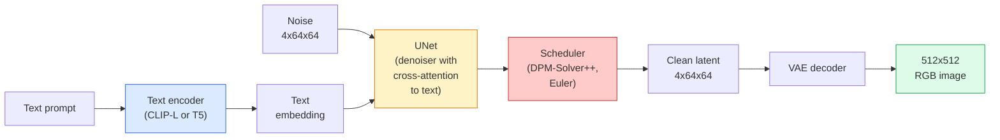

# Difusão estável  Arquitetura e ajuste fino

> A Diffusão Estavel é um DDPM que funciona no espaço latente de um VAE pré-treinado, condicionado ao texto através da atenção cruzada, amostrado com um solvente ODE determinista rápido e orientado por orientação sem classificador.

**Type:** Learn + Use
**Languages:** Python
**Prerequisites:** Phase 4 Lesson 10 (Diffusion), Phase 7 Lesson 02 (Self-Attention)
**Time:** ~75 minutes

## Objetivos de aprendizagem

- Rastrear as cinco peças de um pipeline de difusão estável: VAE, codificador de texto, U-Net, agendador, verificador de segurança  e o que cada um deles realmente faz
- Explicar a difusão latente e por que o treinamento num espaço latente 4x64x64 (em vez de uma imagem 3x512x512) reduz a computação em 48x sem perda de qualidade
- Utilização`diffusers`gerar imagens, executar imagem-para-imagem, inpainting e geração guiada pelo ControlNet
- Ação de sintonia precisa Difusão estável com LoRA em um pequeno conjunto de dados personalizado e carga o adaptador LoRA na inferência

## O problema

Treinar um DDPM diretamente em imagens RGB 512x512 é caro. Cada passo de treinamento retrocede através de uma U-Net que vê valores de entrada 3x512x512 = 786,432, e a amostragem leva 50+ passes para a frente através dessa mesma U-Net. No nível de qualidade da Stable Diffusion 1.5 (lançado em 2022), a difusão de espaço de pixels precisaria de aproximadamente 256 meses de treinamento de GPU e 10-30 segundos por imagem em uma GPU de consumo.

O truque que fez o texto-imagem de peso aberto prático foi**latent diffusion**(Rombach et al., CVPR 2022). Treinar um VAE que mapeia uma imagem 3x512x512 para um tensor latente 4x64x64 e de volta, então fazer a difusão nesse espaço latente.`(3*512*512)/(4*64*64) = 48x`A amostragem cai de dezenas de segundos para menos de dois segundos na mesma GPU.

Quase todos os modelos modernos de geração de imagens  SDXL, SD3, FLUX, HunyuanDiT, Wan-Video  são um modelo de difusão latente com variações no autoencoder, no denoizador (U-Net ou DiT) e no condicionamento de texto.

## O conceito

### O oleoduto



- **VAE**Encoder transforma imagem em latentes (usado para img2img e treinamento).
- **Text encoder** Encoder de texto CLIP (SD 1.x/2.x), CLIP-L + CLIP-G (SDXL) ou T5-XXL (SD3/FLUX). Produz uma sequência de embeddings de tokens.
- **U-Net**O denotador possui camadas de atenção cruzada que se insistem desde os latentes até ao texto incorporado em todos os níveis de resolução.
- **Scheduler**O algoritmo de amostragem (DDIM, Euler, DPM-Solver++).
- **Safety checker** Filtro opcional de conteúdo ilegal NSFW na imagem de saída.

### Orientação sem classificador (CFG)

Aprenda a condicionar o texto simples `epsilon_theta(x_t, t, c)`Para cada pedido .`c`O CFG treina a mesma rede com `c`A conclusão é que, em termos de volume, a quantidade de ruído que se produz em um ambiente de alta pressão, em que a quantidade de ruído é reduzida, é de 10% (substituída por uma inserção vazia), dando um único modelo que prevê tanto o ruído condicional quanto o ruído incondicional.

```
eps = eps_uncond + w * (eps_cond - eps_uncond)
```

`w`É a escala de orientação. `w=0`é incondicional,`w=1`é condicional,`w>1`O SD é o padrão de configuração de um sistema de configuração de um sistema de configuração de um sistema de configuração de um sistema de configuração de configuração de um sistema de configuração de configuração de um sistema de configuração de configuração de configuração de um sistema de configuração de configuração de configuração de configuração de configuração de um sistema de configuração de configuração de configuração de configuração de configuração de configuração de configuração de configuração de configuração de configuração de configuração de configuração de configuração de configuração de configuração de configuração de configuração de configuração de configuração de configuração de configuração de configuração de configuração de configuração de configuração de configuração de configuração de configuração de configuração de configuração de configuração de configuração de configuração de configuração de configuração de configuração de configuração de configuração de configuração de configuração de configuração de configuração de configuração de configuração de configuração de configuração de configuração de configuração de configuração de configuração de configuração de configuração de configuração de configuração de configuração de configuração de configuração de configuração de configuração de configuração de configuração de configuração de configuração de configuração de configuração de configuração de configuração de configuração de configuração de configuração de configuração de configuração de configuração de configuração de configuração de configuração de configuração de configuração de configuração de configuração de configuração de configuração de configuração de configuração de configuração de configuração de configuração de configuração de configuração de configuração de configuração de configuração de configuração de configuração de configuração de configuração de configuração de configuração de configuração de configuração de configuração de configuração de configuração de configuração de configuração de configuração de configuração de configuração de configuração de configuração de configuração de configuração de configuração de configuração de configuração de configuração de configuração de configuração de tipo de tipo de tipo de tipo de tipo de tipo de tipo de tipo de tipo de tipo de tipo de tipo de.`w=7.5`- Não .

O CFG é a razão pela qual o texto-a-imagem funciona na qualidade da produção. Sem ele, os pedidos de desvio da saída são fracos; com ele, os pedidos dominam.

### Geometria do espaço latente

A latença de 4 canais do VAE não é apenas uma imagem comprimida. É um manifold onde a aritmética corresponde aproximadamente a edições semânticas (ingeniería de rapidez + interpolação ambos vivem aqui), e onde a U-Net de difusão foi treinada para gastar todo o seu orçamento de modelagem. A decodificação de uma latente aleatória 4x64x64 não produz uma imagem aleatória.

Duas consequências:

1. **Img2img**= codificar imagem para latente, adicionar ruído parcial, executar o denoiser, decodificar. A estrutura da imagem sobrevive porque a codificação é quase invertível; o conteúdo muda com base no prompt.
2. **Inpainting**= igual a img2img mas o denotador apenas actualiza regiões mascaradas; as regiões não mascaradas são mantidas no latente codificado.

### A arquitetura da U-Net

A SD U-Net é uma grande versão da TinyUNet da lição 10 com três adições:

- **Transformer blocks**Em cada resolução espacial, contendo auto-atenção + atenção cruzada ao texto incorporado.
- **Time embedding**através de MLP em codificação sinusoidal.
- **Skip connections**entre codificador e decodificador em resoluções correspondentes.

Parâmetros totais em SD 1,5: ~860M. SDXL: ~2.6B. FLUX: ~12B. O salto em parâmetros é principalmente em camadas de atenção.

### Ajuste fino do LoRA

O ajuste fino completo da Diffusion estável requer 20+ GB de VRAM e atualiza 860M parâmetros. LoRA (Low-Rank Adaptation) mantém o modelo base congelado e injeta pequenas matrizes de decomposição de nível nas camadas de atenção. Um adaptador LoRA para SD é tipicamente de 10-50 MB, treina em 10-60 minutos em uma única GPU de consumo e carrega no tempo de inferência como uma modificação drop-in.

```
Original: W_q : (d_in, d_out)   frozen
LoRA:     W_q + alpha * (A @ B)   where A : (d_in, r), B : (r, d_out)

r is typically 4-32.
```

A LoRA é a forma como quase todas as comunidades de música é distribuída.

### Os agendamentos que verão

- **DDIM**Determinista, 50 passos, simples.
- **Euler ancestral** Estocástico, 30-50 passos, amostras ligeiramente mais criativas.
- **DPM-Solver++ 2M Karras** Determinista, 20-30 passos, padrão de produção.
- **LCM / TCD / Turbo** modelos de consistência e variantes destiladas; 1-4 etapas ao custo de alguma qualidade.

A troca de calendários é uma alteração de linha única em `diffusers`E às vezes corrige os problemas de amostra sem qualquer reformulação.

```figure
cv3-latent-compression
```

## Construí-lo

Esta lição usa`diffusers`As peças que você precisaria reconstruir (VAE, codificador de texto, U-Net, agendador) são tópicos de suas próprias lições; aqui o objetivo é a fluência com a API de produção.

### Passo 1: texto para imagem

```python
import torch
from diffusers import StableDiffusionPipeline

pipe = StableDiffusionPipeline.from_pretrained(
    "runwayml/stable-diffusion-v1-5",
    torch_dtype=torch.float16,
).to("cuda")

image = pipe(
    prompt="a dog riding a skateboard in tokyo, studio ghibli style",
    guidance_scale=7.5,
    num_inference_steps=25,
    generator=torch.Generator("cuda").manual_seed(42),
).images[0]
image.save("dog.png")
```

`float16`reduz a metade a VRAM sem perda visível de qualidade. `num_inference_steps=25`com a correspondência padrão DPM-Solver++ `num_inference_steps=50`com DDIM.

### Passo 2: Troca o cronograma

```python
from diffusers import DPMSolverMultistepScheduler, EulerAncestralDiscreteScheduler

pipe.scheduler = DPMSolverMultistepScheduler.from_config(pipe.scheduler.config)
pipe.scheduler = EulerAncestralDiscreteScheduler.from_config(pipe.scheduler.config)
```

O estado do cronograma está descoplado dos pesos da U-Net.

### Passo 3: Imagem a imagem

```python
from diffusers import StableDiffusionImg2ImgPipeline
from PIL import Image

img2img = StableDiffusionImg2ImgPipeline.from_pretrained(
    "runwayml/stable-diffusion-v1-5",
    torch_dtype=torch.float16,
).to("cuda")

init_image = Image.open("dog.png").convert("RGB").resize((512, 512))
out = img2img(
    prompt="a dog riding a skateboard, oil painting",
    image=init_image,
    strength=0.6,
    guidance_scale=7.5,
).images[0]
```

`strength`O nível de ruído é o que deve ser adicionado antes de denosar (0,0 = inalterado, 1,0 = regeneração completa).

### Passo 4: Pintura

```python
from diffusers import StableDiffusionInpaintPipeline

inpaint = StableDiffusionInpaintPipeline.from_pretrained(
    "runwayml/stable-diffusion-inpainting",
    torch_dtype=torch.float16,
).to("cuda")

image = Image.open("dog.png").convert("RGB").resize((512, 512))
mask = Image.open("dog_mask.png").convert("L").resize((512, 512))

out = inpaint(
    prompt="a cat",
    image=image,
    mask_image=mask,
    guidance_scale=7.5,
).images[0]
```

Os pixels brancos da máscara são a área para regeneração.

### Passo 5: Carregamento de LoRA

```python
pipe.load_lora_weights("sayakpaul/sd-lora-ghibli")
pipe.fuse_lora(lora_scale=0.8)

image = pipe(prompt="a village square in ghibli style").images[0]
```

`lora_scale`- 0,0 = sem efeito, 1,0 = efeito total. `fuse_lora`O adaptador é colocado nos pesos para a velocidade, mas impede a troca.`pipe.unfuse_lora()`antes de carregar um adaptador diferente.

### Passo 6: Formação do LoRA (esquema)

A real formação da LoRA vive em `peft`ou `diffusers.training`O esboço:

```python
# Pseudocode
for step, batch in enumerate(dataloader):
    images, prompts = batch
    latents = vae.encode(images).latent_dist.sample() * 0.18215

    t = torch.randint(0, num_train_timesteps, (batch_size,))
    noise = torch.randn_like(latents)
    noisy_latents = scheduler.add_noise(latents, noise, t)

    text_emb = text_encoder(tokenizer(prompts))

    pred_noise = unet(noisy_latents, t, text_emb)  # LoRA weights injected here

    loss = F.mse_loss(pred_noise, noise)
    loss.backward()
    optimizer.step()
```

Apenas as matrizes LoRA recebem gradiente; a base U-Net, VAE e o codificador de texto são congelados. Com um tamanho de lote de 1 e ponto de verificação de gradiente, isso se encaixa em 8 GB de VRAM.

## Usá-lo

Na produção, as decisões que realmente tomas:

- **Model family**: SD 1.5 para as melodias de comunidade de código aberto, SDXL para maior fidelidade, SD3 / FLUX para o estado da arte e requisitos de licenciamento rigorosos.
- **Scheduler**: DPM-Solver++ 2M Karras para 20-30 passos, LCM-LoRA quando a latência é inferior a 1s.
- **Precision**- Não .`float16`em 4080/4090, `bfloat16`na A100 e mais recente, `int8`(via `bitsandbytes`ou `compel`) quando o VRAM estiver apertado.
- **Conditioning**: funciona com texto simples; para um controlo mais forte, adicione o ControlNet (canny, depth, pose) no topo do pipeline base.

Para a geração de lote, `AUTO1111`- Não .`ComfyUI`são as ferramentas comunitárias; para as APIs de produção, `diffusers`+ `accelerate`ou `optimum-nvidia`com a compilação TensorRT.

## Envia-o

Esta lição produz:

- `outputs/prompt-sd-pipeline-planner.md` um prompt que escolhe SD 1.5 / SDXL / SD3 / FLUX mais cronógrafo e precisão dado um orçamento de latência, objetivo de fidelidade e restrição de licenciamento.
- `outputs/skill-lora-training-setup.md` uma habilidade que escreve uma configuração completa de treinamento do LoRA para um conjunto de dados personalizado, incluindo legendas, classificação, tamanho de lote e taxa de aprendizagem.

## Exercícios

1. **(Easy)**Gerenar o mesmo prompt com `guidance_scale`em `[1, 3, 5, 7.5, 10, 15]`Descreva como a imagem muda.
2. **(Medium)**Tome qualquer fotografia real, passe-a.`StableDiffusionImg2ImgPipeline`- Não .`strength`em `[0.2, 0.4, 0.6, 0.8, 1.0]`Qual força preserva a composição enquanto muda de estilo?
3. **(Hard)**Treinar um LoRA em 10-20 imagens de um único sujeito (um animal de estimação, um logotipo, um personagem) e gerar cenas novas com esse sujeito nelas.

## Termos-chave

| Term | What people say | What it actually means |
|------|----------------|----------------------|
| Latent diffusion | "Diffuse in latents" | Run the entire DDPM in the VAE latent space (4x64x64) instead of pixel space (3x512x512); 48x compute saving |
| VAE scale factor | "0.18215" | Constant that rescales the VAE's raw latent to roughly unit variance; hardcoded in every SD pipeline |
| Classifier-free guidance | "CFG" | Mix conditional and unconditional noise predictions; the single most impactful inference knob |
| Scheduler | "Sampler" | The algorithm that turns noise + model predictions into a denoised latent trajectory |
| LoRA | "Low-rank adapter" | Small rank-decomposition matrices that fine-tune attention layers without touching base weights |
| Cross-attention | "Text-image attention" | Attention from latent tokens to text tokens; injects prompt information at every U-Net level |
| ControlNet | "Structure conditioning" | A separately-trained adapter that steers SD with an extra input (canny, depth, pose, segmentation) |
| DPM-Solver++ | "The default scheduler" | Second-order deterministic ODE solver; best quality at low step counts (20-30) in 2026 |

## Mais leitura

- [High-Resolution Image Synthesis with Latent Diffusion (Rombach et al., 2022)](https://arxiv.org/abs/2112.10752) o papel de difusão estável; inclui todas as ablações que justificam o desenho
- [Classifier-Free Diffusion Guidance (Ho & Salimans, 2022)](https://arxiv.org/abs/2207.12598) O papel CFG
- [LoRA: Low-Rank Adaptation of Large Language Models (Hu et al., 2021)](https://arxiv.org/abs/2106.09685)O LoRA foi o primeiro a ser desenvolvido em PNL; foi transferido para SD sem quase nenhuma alteração.
- [diffusers documentation](https://huggingface.co/docs/diffusers) a referência para cada oleoduto SD/SDXL/SD3/FLUX
