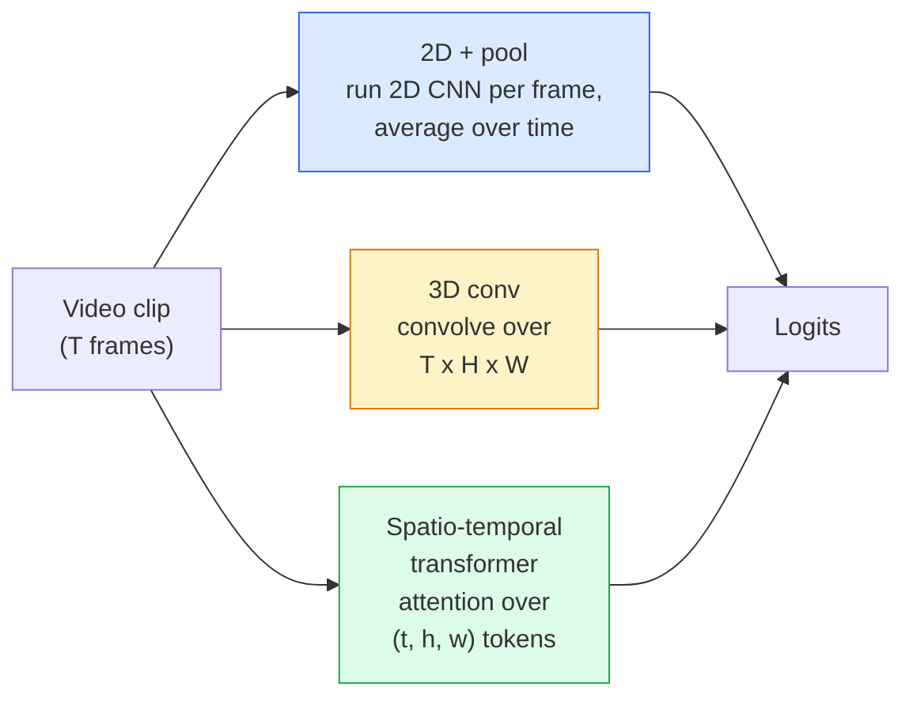

# Compreensão de vídeos  Modelagem temporária

> Um vídeo é uma sequência de imagens mais a física que as conecta. Cada modelo de vídeo trata o tempo como um eixo extra (3D conv), uma sequência para assistir (transformador), ou um recurso para extrair uma vez e pool (2D + pool).

**Type:** Learn + Build
**Languages:** Python
**Prerequisites:** Phase 4 Lesson 03 (CNNs), Phase 4 Lesson 04 (Image Classification)
**Time:** ~45 minutes

## Objetivos de aprendizagem

- Distinguir as três principais abordagens de modelagem de vídeo (2D+pool, 3D conv, transformador espaço-temporal) e prever as suas compensações de custo e precisão
- Implementar amostragem de quadros, agrupamento temporal e um classificador de linha de base 2D+pool no PyTorch
- Explique por que os kernels 3D "inflados" da I3D transferem bem dos pesos da ImageNet e o que um conv (2+1) D factorizado faz de forma diferente
- Leia os conjuntos de dados e métricas padrão de reconhecimento de ação: Kinetics-400/600, UCF101, Something-Something V2; precisão superior a 1 no nível de clip e vídeo

## O problema

Um vídeo de 30 segundos a 30 fps é 900 imagens. Naivemente, classificação de vídeo é classificação de imagem executada 900 vezes seguida de algum tipo de agregação. Isso funciona quando a ação é visível em quase todos os quadros (desportos, cozinha, vídeos de exercícios) e falha mal quando a a ação é definida pelo próprio movimento: "empurrar algo de esquerda para direita" parece dois objetos fiéis em cada quadro.

A questão central para cada arquitetura de vídeo é: quando a estrutura temporal é modelada e como? A resposta impulsiona tudo o mais  custo de cálculo, estratégia de pré-treino, se você pode reutilizar pesos da ImageNet, em que conjuntos de dados o modelo treina.

Esta lição é deliberadamente mais curta do que as lições de imagem estática. A máquina de imagem central já está em vigor, e a compreensão do vídeo é principalmente sobre a história temporal: amostragem, modelagem e agregação.

## O conceito

### As três famílias arquitetônicas



### 2D + piscina

Leve uma CNN 2D (ResNet, EfficientNet, ViT). Execute-a de forma independente em cada quadro amostrado. Average (ou max-pool, ou attention-pool) as incorporações por quadro. Feed o vetor em conjunto para um classificador.

Pros:
- Transferências de pré-treino da ImageNet diretamente.
- É mais fácil de implementar.
- Barata: T-frame * custo de inferência de imagem única.

Cons:
- Não posso modelar o movimento.
- A agregação temporal é invariante em ordem; "porta aberta" e "porta fechada" parecem as mesmas.

Quando utilizar: tarefas pesadas em aparência, transferência de aprendizagem em pequenos conjuntos de dados de vídeo, linhas de base iniciais.

### Convolções 3D

Substitua os kernels 2D (H, W) por kernels 3D (T, H, W). A rede se envolve em espaço e tempo.

Trik I3D: pegue um modelo pré-treinado 2D ImageNet, "infla" cada núcleo 2D copiando-o ao longo de um novo eixo de tempo. Um conv 3x3 2D se torna um conv 3x3x3 3D. Isso dá ao modelo 3D fortes pesos pré-treinados em vez de treinar a partir do zero.

Pros:
- Modela diretamente o movimento.
- A inflação I3D dá aprendizagem gratuita.

Cons:
- T/8 mais FLOPs do que a contraparte 2D (para núcleo temporal de 3 empilhados 3 vezes).
- Os núcleos temporais são pequenos; o movimento de longo alcance requer uma abordagem em pirâmide ou em duplo fluxo.

Quando utilizar: reconhecimento de ação onde o movimento é o sinal (Algo-Algo V2, Kinética com classes de movimento pesado).

### Transformadores espaciotemporais

Marque o vídeo em uma grade de parches espaço-tempo e compareça a todos eles.

Padrões de atenção que importam:
- **Joint** uma grande atenção sobre (t, h, w).`T*H*W`- Caros.
- **Divided** duas atenções por bloco: uma no tempo, outra no espaço.
- **Factorised** A atenção temporal alternar-se com a atenção espacial entre os blocos.

Pros:
- Precuração SOTA em todos os principais valores de referência.
- Transferências de transformadores de imagem (ViT) através da inflação de parches.
- Suporta vídeo de longo contexto através de atenção escassa.

Cons:
- Computação-fome.
- Requer uma escolha cuidadosa de padrões de atenção ou balões de corrida.

Quando utilizar: grandes conjuntos de dados, compreensão de vídeo de alta fidelidade, tarefas multimodal de vídeo + texto.

### Amostragem de quadros

Um clip de 10 segundos a 30 fps é de 300 quadros; alimentar todos os 300 para qualquer modelo é um desperdício.

- **Uniform sampling**Escolha quadros T uniformemente ao longo do clip.
- **Dense sampling**Janela de quadro T contíguo aleatório. Comum para convas 3D porque o movimento requer quadros vizinhos.
- **Multi-clip** amostrar várias janelas de quadro T do mesmo vídeo, classificar cada uma, previsões médias no momento do teste.

T é geralmente 8, 16, 32 ou 64. T superior = mais sinal temporal em mais computação.

### Avaliação

Dois níveis:
- **Clip-level accuracy**O modelo vê um clip de quadro T, relata top-k.
- **Video-level accuracy** previsões médias de nível de clipe em vários clips por vídeo; mais altas e mais estáveis.

Um modelo que marque 78% de clip / 82% de vídeo depende fortemente da média de tempo de teste; um que marque 80% / 81% é mais robusto por clip.

### Datasets que você vai encontrar

- **Kinetics-400 / 600 / 700** o conjunto de dados de ação de finalidade geral. 400 mil clips; URLs do YouTube (muitos já mortos).
- **Something-Something V2** Ações definidas por movimento ("movendo X de esquerda para direita"). Não pode ser resolvido por 2D + pool.
- **UCF-101**- Não .**HMDB-51** mais velhos, menores, ainda relatados.
- **AVA** ação *localização* no espaço e no tempo; mais difícil do que a classificação.

```figure
v4-video-temporal
```

## Construí-lo

### Passo 1: Amostra de quadro

Amplificadores uniformes e densos que trabalham numa lista de quadros (ou um tensor de vídeo).

```python
import numpy as np

def sample_uniform(num_frames_total, T):
    if num_frames_total <= T:
        return list(range(num_frames_total)) + [num_frames_total - 1] * (T - num_frames_total)
    step = num_frames_total / T
    return [int(i * step) for i in range(T)]


def sample_dense(num_frames_total, T, rng=None):
    rng = rng or np.random.default_rng()
    if num_frames_total <= T:
        return list(range(num_frames_total)) + [num_frames_total - 1] * (T - num_frames_total)
    start = int(rng.integers(0, num_frames_total - T + 1))
    return list(range(start, start + T))
```

Ambos voltam .`T`Indicos que usam para cortar o tensor de vídeo.

### Passo 2: Uma linha de base 2D+pool

Exerce uma ResNet-18 em 2D sobre cada quadro, características médias, classifique.

```python
import torch
import torch.nn as nn
from torchvision.models import resnet18, ResNet18_Weights

class FramePool(nn.Module):
    def __init__(self, num_classes=400, pretrained=True):
        super().__init__()
        weights = ResNet18_Weights.IMAGENET1K_V1 if pretrained else None
        backbone = resnet18(weights=weights)
        self.features = nn.Sequential(*(list(backbone.children())[:-1]))  # global avg pool kept
        self.head = nn.Linear(512, num_classes)

    def forward(self, x):
        # x: (N, T, 3, H, W)
        N, T = x.shape[:2]
        x = x.view(N * T, *x.shape[2:])
        feats = self.features(x).view(N, T, -1)
        pooled = feats.mean(dim=1)
        return self.head(pooled)

model = FramePool(num_classes=10)
x = torch.randn(2, 8, 3, 224, 224)
print(f"output: {model(x).shape}")
print(f"params: {sum(p.numel() for p in model.parameters()):,}")
```

Onze milhões de parâmetros, ImageNet pré-treinado, executa por quadro, médias, classifica. Esta linha de base é muitas vezes dentro de 5-10 pontos de modelos 3D adequados em tarefas pesadas na aparência  às vezes melhor, porque reutiliza uma espinha dorsal ImageNet mais forte.

### Passo 3: Conjunto 3D inflado em estilo I3D

Transforme um único conv 2D em um conv 3D repetindo pesos ao longo de um novo eixo de tempo.

```python
def inflate_2d_to_3d(conv2d, time_kernel=3):
    out_c, in_c, kh, kw = conv2d.weight.shape
    weight_3d = conv2d.weight.data.unsqueeze(2)  # (out, in, 1, kh, kw)
    weight_3d = weight_3d.repeat(1, 1, time_kernel, 1, 1) / time_kernel
    conv3d = nn.Conv3d(in_c, out_c, kernel_size=(time_kernel, kh, kw),
                        padding=(time_kernel // 2, conv2d.padding[0], conv2d.padding[1]),
                        stride=(1, conv2d.stride[0], conv2d.stride[1]),
                        bias=False)
    conv3d.weight.data = weight_3d
    return conv3d

conv2d = nn.Conv2d(3, 64, kernel_size=3, padding=1, bias=False)
conv3d = inflate_2d_to_3d(conv2d, time_kernel=3)
print(f"2D weight shape:  {tuple(conv2d.weight.shape)}")
print(f"3D weight shape:  {tuple(conv3d.weight.shape)}")
x = torch.randn(1, 3, 8, 56, 56)
print(f"3D output shape:  {tuple(conv3d(x).shape)}")
```

A divisão por `time_kernel`mantém as magnitudes de ativação aproximadamente constantes  importantes para não quebrar as estatísticas da norma de lote na primeira passagem.

### Passo 4: Convolução de D (2+1)

Divida uma convecção 3D em uma convecção 2D (espacial) e 1D (temporal). O mesmo campo receptivo, menos parâmetros, melhor precisão em alguns referências.

```python
class Conv2Plus1D(nn.Module):
    def __init__(self, in_c, out_c, kernel_size=3):
        super().__init__()
        mid_c = (in_c * out_c * kernel_size * kernel_size * kernel_size) \
                // (in_c * kernel_size * kernel_size + out_c * kernel_size)
        self.spatial = nn.Conv3d(in_c, mid_c, kernel_size=(1, kernel_size, kernel_size),
                                 padding=(0, kernel_size // 2, kernel_size // 2), bias=False)
        self.bn = nn.BatchNorm3d(mid_c)
        self.act = nn.ReLU(inplace=True)
        self.temporal = nn.Conv3d(mid_c, out_c, kernel_size=(kernel_size, 1, 1),
                                  padding=(kernel_size // 2, 0, 0), bias=False)

    def forward(self, x):
        return self.temporal(self.act(self.bn(self.spatial(x))))

c = Conv2Plus1D(3, 64)
x = torch.randn(1, 3, 8, 56, 56)
print(f"(2+1)D output: {tuple(c(x).shape)}")
```

Uma rede R  2 + 1) D completa é a mesma que uma ResNet-18 com cada 3x3 conv substituído por `Conv2Plus1D`- Não .

## Usá-lo

Duas bibliotecas cobrem o trabalho de produção de vídeo:

- `torchvision.models.video`R(2+1) D, MViT, Swin3D com pesos de cinética pré-entrenados.
- `pytorchvideo`(Meta)  modelo zoológico, carregadores de dados para Kinetics / SSv2 / AVA, transformações padrão.

Para modelos de vídeo em linguagem de visão (vidéus subtítulos, video QA), use `transformers`(`VideoMAE`- Não .`VideoLLaMA`- Não .`InternVideo`)).

## Envia-o

Esta lição produz:

- `outputs/prompt-video-architecture-picker.md` um prompt que escolhe 2D+pool / I3D / (2+1)D / transformador com base na aparência versus movimento, no tamanho do conjunto de dados e no orçamento de computação.
- `outputs/skill-frame-sampler-auditor.md` uma habilidade que inspeciona o amostragem de um canal de vídeo e identifica erros comuns: índice de um por um, amostragem desigual quando `num_frames < T`, falta de culturas que preservam os aspectos, etc.

## Exercícios

1. **(Easy)**Calcule FLOPs (aproximados) para FramePool com T=8 vs. uma ResNet 3D de estilo I3D com T=8. Justifique por que 2D+pool é 3-5 vezes mais barato.
2. **(Medium)**Gerar um conjunto de dados de vídeo sintético: bolas aleatórias se movendo em direções aleatórias, rotuladas pela direção de movimento ("esquerda-direita", "direita-esquerda", "diagonal-up"). Treinar FramePool sobre ele. Mostrar que ele atinge precisão quase casual, provando que a aparência sozinha é insuficiente para tarefas de movimento.
3. **(Hard)**Construir um R(2+1) D-18 substituindo cada Conv2d em um ResNet-18 com `Conv2Plus1D`Influa os pesos dos primeiros conjuntos de um ResNet-18 treinado pela ImageNet.

## Termos-chave

| Term | What people say | What it actually means |
|------|----------------|----------------------|
| 2D + pool | "Per-frame classifier" | Run a 2D CNN on every sampled frame, average-pool features across time, classify |
| 3D convolution | "Spatio-temporal kernel" | Kernel that convolves over (T, H, W); can model motion natively |
| Inflation | "Lift 2D weights to 3D" | Initialise 3D conv weights by repeating a 2D conv's weights along the new time axis, then divide by kernel_T to preserve activation scale |
| (2+1)D | "Factorised conv" | Split 3D into 2D spatial + 1D temporal; fewer parameters, extra non-linearity between |
| Divided attention | "Time then space" | Transformer block with two attentions per layer: one over tokens at the same frame, one over tokens at the same position |
| Clip | "T-frame window" | A sampled subsequence of T frames; the unit a video model consumes |
| Clip vs video accuracy | "Two eval settings" | Clip = one sample per video, video = average across multiple sampled clips |
| Kinetics | "The ImageNet of video" | 400-700 action classes, 300k+ YouTube clips, the standard video pretraining corpus |

## Mais leitura

- [I3D: Quo Vadis, Action Recognition (Carreira & Zisserman, 2017)](https://arxiv.org/abs/1705.07750) introduz a inflação e o conjunto de dados da Cinética
- [R(2+1)D: A Closer Look at Spatiotemporal Convolutions (Tran et al., 2018)](https://arxiv.org/abs/1711.11248) Conv, ainda forte linha de base
- [TimeSformer: Is Space-Time Attention All You Need? (Bertasius et al., 2021)](https://arxiv.org/abs/2102.05095)O primeiro transformador de vídeo forte
- [VideoMAE (Tong et al., 2022)](https://arxiv.org/abs/2203.12602) autoencoder mascarado pré-treino para vídeo; actual receita dominante pré-treino
