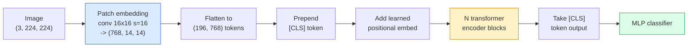

# Transformadores de visão (ViT)

> Cortar a imagem em parches, tratar cada parche como uma palavra, executar um transformador padrão.

**Type:** Build
**Languages:** Python
**Prerequisites:** Phase 7 Lesson 02 (Self-Attention), Phase 4 Lesson 04 (Image Classification)
**Time:** ~45 minutes

## Objetivos de aprendizagem

- Implementar o inserimento de patch, o inserimento posicional aprendido, token de classe e blocos de codificação de transformador a partir do zero para construir um ViT mínimo
- Explique por que se pensava que a ViT precisava de dados massivos de pré-treino até que a DeiT e a MAE provassem o contrário.
- Comparar ViT, Swin e ConvNeXt em seus antecedentes arquitetônicos (não, atenção local para janelas, espinha dorsal de conve)
- Ajustar um ViT pré- treinado num conjunto de dados pequeno usando `timm`e a receita padrão de sondagem linear / sintonia

## O problema

Durante uma década, a convolução foi sinônimo de visão por computador. As CNN tinham fortes preconceitos indutivos  localidade, equivalência de tradução  que ninguém pensava que você poderia substituir.

A captura foi "em escala". A ViT na ImageNet-1k perdeu para a ResNet. ViT pre-entrenado em ImageNet-21k ou JFT-300M, então ajustado em ImageNet-1k superou. A conclusão foi que os transformadores não tinham antecedentes úteis, mas podiam aprendê-los a partir de dados suficientes. Os trabalhos subsequentes (DeiT, MAE, DINO) mostraram que com as receitas de formação adequadas  aumento forte, pré-treino auto-supervisionado, destilação  ViTs treinam bem também em pequenos dados.

Em 2026, as CNNs puras ainda são competitivas em dispositivos de ponta (ConvNeXt é o mais forte), mas os transformadores dominam tudo o mais: segmentação (Mask2Former, SegFormer), detecção (DETR, RT-DETR), multimodal (CLIP, SigLIP), vídeo (VideoMAE, VJEPA).

## O conceito

### O oleoduto



Sete passos. Patches -> tokens -> atenção -> classificador. Cada variante (DeiT, Swin, ConvNeXt, MAE pré-treino) muda um ou dois dos sete e deixa o resto sozinho.

### Embedagem de parche

O primeiro conv é o segredo. tamanho do núcleo 16, passo 16, então uma imagem de 224x224 torna-se uma grade de 14x14 de 16x16 parches, cada projetado para um 768-dim embutidos.

```
Input:  (3, 224, 224)
Conv (3 -> 768, k=16, s=16, no padding):
Output: (768, 14, 14)
Flatten spatial: (196, 768)
```

196 patches = 196 tokens. A dimensão de cada token é 768 (ViT-B), 1024 (ViT-L), ou 1280 (ViT-H).

### Token de classe

Um único vetor aprendido prependido à sequência:

```
tokens = [CLS; patch_1; patch_2; ...; patch_196]   shape (197, 768)
```

Após os blocos N transformadores, o `[CLS]`O resultado é a representação global da imagem.

### Embarcação posicional

Os transformadores não têm noção de posição espacial.

```
tokens = tokens + learned_pos_embedding   (also shape (197, 768))
```

A incorporação é um parâmetro do modelo; treinamento baseado em gradientes o adapta à estrutura de imagem 2D. Existem alternativas sinusoidais 2D, mas raramente são usadas na prática.

### Bloco de codificação do transformador

Auto-atenção multi-head, MLP, conexões residuais, pré-LayerNorm.

```
x = x + MSA(LN(x))
x = x + MLP(LN(x))

MLP is two-layer with GELU: Linear(d -> 4d) -> GELU -> Linear(4d -> d)
```

O ViT-B/16 empilha 12 desses blocos, cada um com 12 cabeças de atenção, com um total de 86 milhões de parâmetros.

### Porquê antes da LN

Os primeiros transformadores utilizados após o período de LN (`x = LN(x + sublayer(x))`O programa de formação de professores de ensino superior (P.L.N.) e de professores de formação superior (P.L.N.)`x = x + sublayer(LN(x))`O sistema de formação de estudantes de ensino superior (LL) é um sistema de formação de estudantes de ensino superior que permite a formação de estudantes de ensino superior.

### Comércio de tamanho do parche

- 16x16 patches -> 196 tokens, padrão.
- 32x32 patches -> 49 tokens, mais rápido mas com menor resolução.
- 8x8 patches -> 784 tokens, mais finos mas O ((n^2) atenção custa escamas mal.

Patches maiores = menos tokens = mais rápido, mas menos detalhes espaciais. SwinV2 usa patches 4x4 em janelas hierárquicas.

### Receita da DeiT para treinar ViT na ImageNet-1k

O ViT original precisava de JFT-300M para vencer as CNNs. DeiT (Touvron et al., 2020) treinou ViT-B para 81,8% no top-1 apenas na ImageNet-1k com quatro mudanças:

1. Aumento intenso: Aumento aleatório, Mixup, CutMix, Erasing aleatório.
2. Profundidade estocástica (arroçar blocos inteiros aleatoriamente durante o treino).
3. Aumentar repetidamente (a mesma imagem amostrada 3 vezes por lote).
4. Destilação de um professor da CNN (opcional, aumenta a precisão ainda mais).

Todas as receitas modernas de treinamento ViT descende da DeiT.

### Swin vs ConvNeXt

- **Swin**(Liu et al., 2021)  atenção baseada em janelas. Cada bloco atende dentro de uma janela local; blocos alternativos deslocam a janela para misturar informações entre janelas. Traz de volta uma localidade semelhante à CNN antes, mantendo o operador de atenção.
- **ConvNeXt**(Liu et al., 2022)  redesenhou a CNN que combina as escolhas de arquitetura de Swin (convs profundamente, LayerNorm, GELU, garganta de garrafa invertida). Mostrou que a lacuna não é "atenção vs convolução" mas "receita de treinamento moderna + arquitetura".

Em 2026, a ConvNeXt-V2 e a Swin-V2 são ambas de nível de produção; a escolha certa depende da sua pilha de inferência (a ConvNeXt compila melhor para a borda) e do corpus de pré-treino.

### Pre-treinamento de MAE

Autoencoder mascarado (He et al., 2022): masquear 75% dos patches aleatoriamente, treinar o encoder para processar apenas os 25% visíveis, treinar um pequeno decodificador para reconstruir os patches mascarados da saída do encoder.

O MAE torna o ViT treinável apenas na ImageNet-1k, bate no SOTA e é a receita automática padrão atual.

```figure
batchnorm-inference
```

## Construí-lo

### Passo 1: Embedamento de parche

```python
import torch
import torch.nn as nn

class PatchEmbedding(nn.Module):
    def __init__(self, in_channels=3, patch_size=16, dim=192, image_size=64):
        super().__init__()
        assert image_size % patch_size == 0
        self.proj = nn.Conv2d(in_channels, dim, kernel_size=patch_size, stride=patch_size)
        num_patches = (image_size // patch_size) ** 2
        self.num_patches = num_patches

    def forward(self, x):
        x = self.proj(x)
        return x.flatten(2).transpose(1, 2)
```

Um conv, um aplanado, um transposar.

### Passo 2: Bloco do transformador

Pre-LN, auto-atenção de várias cabeças, MLP com GELU, conexões residuais.

```python
class Block(nn.Module):
    def __init__(self, dim, num_heads, mlp_ratio=4, dropout=0.0):
        super().__init__()
        self.ln1 = nn.LayerNorm(dim)
        self.attn = nn.MultiheadAttention(dim, num_heads, dropout=dropout, batch_first=True)
        self.ln2 = nn.LayerNorm(dim)
        self.mlp = nn.Sequential(
            nn.Linear(dim, dim * mlp_ratio),
            nn.GELU(),
            nn.Dropout(dropout),
            nn.Linear(dim * mlp_ratio, dim),
            nn.Dropout(dropout),
        )

    def forward(self, x):
        a, _ = self.attn(self.ln1(x), self.ln1(x), self.ln1(x), need_weights=False)
        x = x + a
        x = x + self.mlp(self.ln2(x))
        return x
```

`nn.MultiheadAttention`O sistema de projecção de saída é o responsável pela divisão em cabeças, o produto de ponto em escala e a projecção de saída.`batch_first=True`Então as formas são`(N, seq, dim)`- Não .

### Passo 3: A ViT

```python
class ViT(nn.Module):
    def __init__(self, image_size=64, patch_size=16, in_channels=3,
                 num_classes=10, dim=192, depth=6, num_heads=3, mlp_ratio=4):
        super().__init__()
        self.patch = PatchEmbedding(in_channels, patch_size, dim, image_size)
        num_patches = self.patch.num_patches
        self.cls_token = nn.Parameter(torch.zeros(1, 1, dim))
        self.pos_embed = nn.Parameter(torch.zeros(1, num_patches + 1, dim))
        self.blocks = nn.ModuleList([
            Block(dim, num_heads, mlp_ratio) for _ in range(depth)
        ])
        self.ln = nn.LayerNorm(dim)
        self.head = nn.Linear(dim, num_classes)
        nn.init.trunc_normal_(self.pos_embed, std=0.02)
        nn.init.trunc_normal_(self.cls_token, std=0.02)

    def forward(self, x):
        x = self.patch(x)
        cls = self.cls_token.expand(x.size(0), -1, -1)
        x = torch.cat([cls, x], dim=1)
        x = x + self.pos_embed
        for blk in self.blocks:
            x = blk(x)
        x = self.ln(x[:, 0])
        return self.head(x)

vit = ViT(image_size=64, patch_size=16, num_classes=10, dim=192, depth=6, num_heads=3)
x = torch.randn(2, 3, 64, 64)
print(f"output: {vit(x).shape}")
print(f"params: {sum(p.numel() for p in vit.parameters()):,}")
```

Parâmetros de cerca de 2,8 M  um pequeno ViT tratável na CPU.`dim=768, depth=12, num_heads=12`- Não .

### Passo 4: Verificação de Saúde de Razão  inferência de imagem única

```python
logits = vit(torch.randn(1, 3, 64, 64))
print(f"logits: {logits}")
print(f"probs:  {logits.softmax(-1)}")
```

Deve ser executado sem erro.

## Usá-lo

`timm`Envia todas as variantes ViT com pesos pré-entrenados da ImageNet.

```python
import timm

model = timm.create_model("vit_base_patch16_224", pretrained=True, num_classes=10)
```

`timm`É o padrão de produção para transformadores de visão em 2026. Suporta ViT, DeiT, Swin, Swin-V2, ConvNeXt, ConvNeXt-V2, MaxViT, MViT, EfficientFormer e dezenas de outros sob a mesma API.

Para trabalho multimodal (imagem + texto), `transformers`O codificador de imagem em todos eles é uma variante ViT.

## Envia-o

Esta lição produz:

- `outputs/prompt-vit-vs-cnn-picker.md` um prompt que escolhe entre um ViT, um ConvNeXt ou um Swin com base no tamanho do conjunto de dados, computação e pilha de inferência.
- `outputs/skill-vit-patch-and-pos-embed-inspector.md` uma habilidade que verifica que a inserção de patch de um ViT e as formas de inserção posicional correspondem ao comprimento esperado da sequência do modelo, capturando os bugs de portação mais comuns.

## Exercícios

1. **(Easy)**Imprima as formas de cada tensor intermediário para uma passagem para a frente através do pequeno ViT acima.`(N, 3, 64, 64)`-> parches `(N, 16, 192)`-> com CLS `(N, 17, 192)`-> entrada do classificador `(N, 192)`-> saída `(N, num_classes)`- Não .
2. **(Medium)**- Aponta-a perfeitamente .`timm`ViT-S/16 sobre o conjunto de dados CIFAR sintético da lição 4. Comparar com a ajuste fina do ResNet-18 sobre os mesmos dados.
3. **(Hard)**Implementar o pre-treinamento MAE para o pequeno ViT: mascarar 75% dos parches, treinar o codificador + um pequeno decodificador para reconstruir os parches mascarados. Avalie a precisão da sonda linear nos dados sintéticos antes e depois do pre-treinamento.

## Termos-chave

| Term | What people say | What it actually means |
|------|----------------|----------------------|
| Patch embedding | "The first conv" | A conv with kernel size = stride = patch size; turns the image into a grid of token embeddings |
| Class token | "[CLS]" | A learned vector prepended to the token sequence; its final output is the global image representation |
| Positional embedding | "Learned pos" | A learned vector added to every token so the transformer knows where each patch came from |
| Pre-LN | "LayerNorm before sublayer" | The stable transformer variant: `x + sublayer(LN(x))` instead of `LN(x + sublayer(x))` |
| Multi-head attention | "Parallel attention" | Standard transformer attention split into num_heads independent subspaces, concatenated afterwards |
| ViT-B/16 | "Base, patch 16" | The canonical size: dim=768, depth=12, heads=12, patch_size=16, image=224; ~86M params |
| DeiT | "Data-efficient ViT" | ViT trained on ImageNet-1k alone with strong augmentation; proved large pretraining datasets are not strictly required |
| MAE | "Masked autoencoder" | Self-supervised pretraining: mask 75% of patches, reconstruct; the dominant ViT pretraining recipe |

## Mais leitura

- [An Image is Worth 16x16 Words (Dosovitskiy et al., 2020)](https://arxiv.org/abs/2010.11929) o papel ViT
- [DeiT: Data-efficient Image Transformers (Touvron et al., 2020)](https://arxiv.org/abs/2012.12877) como treinar ViT em ImageNet-1k sozinho
- [Masked Autoencoders are Scalable Vision Learners (He et al., 2022)](https://arxiv.org/abs/2111.06377) Pre-treinamento MAE
- [timm documentation](https://huggingface.co/docs/timm) a referência para cada transformador de visão que utilizará na produção
