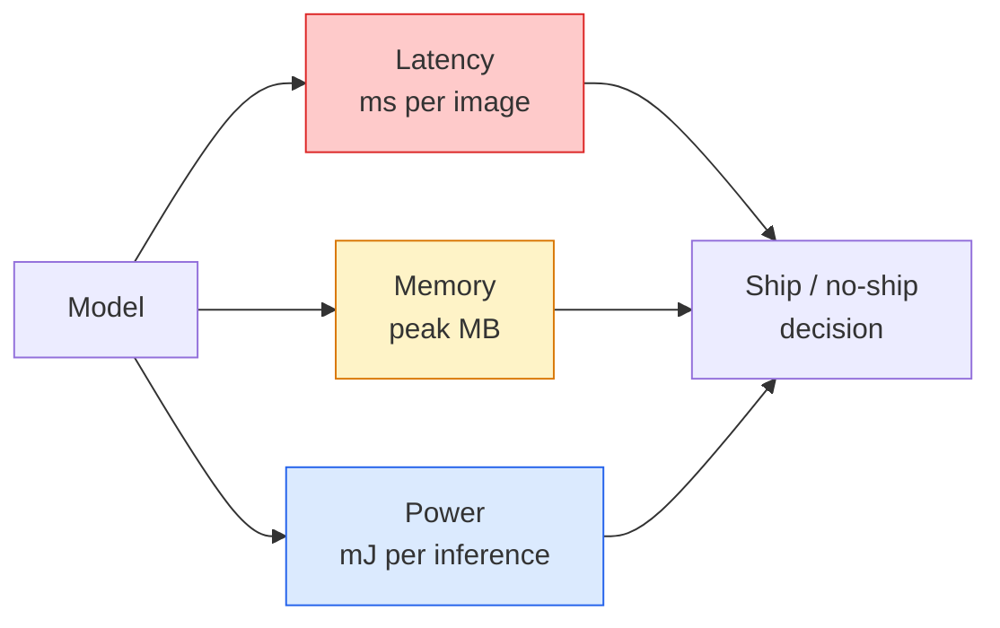

# Visão em tempo real  Deploição de Edge

> A inferência de borda é a disciplina de obter um modelo de 90 pontos de precisão para executar a 30 fps em um dispositivo com 2 GB de RAM.

**Type:** Learn + Build
**Languages:** Python
**Prerequisites:** Phase 4 Lesson 04 (Image Classification), Phase 10 Lesson 11 (Quantization)
**Time:** ~75 minutes

## Objetivos de aprendizagem

- Medir a latência de inferência, a memória máxima e o throughput para qualquer modelo PyTorch, e ler os FLOPs / params / trade-off de latência
- Quantizar um modelo de visão para INT8 utilizando a quantificação pós-treino da PyTorch e verificar a perda de precisão < 1%
- Exportar para ONNX e compilar com ONNX Runtime ou TensorRT; nomear as três falhas de exportação mais comuns e suas correções
- Explique quando escolher MobileNetV3, EfficientNet-Lite, ConvNeXt-Tiny ou MobileViT para uma restrição de borda

## O problema

Um modelo de visão de treinamento é um monstro de ponto flutuante. 100M parâmetros, 10 GFLOPs por passagem avançada, 2 GB de VRAM. Nada disso cabe em um telefone, uma unidade de infotainment de um carro, uma câmera industrial ou um drone. Enviar um sistema de visão significa ajustar as mesmas previsões em um orçamento que é 100 vezes menor.

Três botões fazem a maior parte do trabalho: escolha de modelo (uma arquitetura menor com a mesma receita), quantização (INT8 em vez de FP32) e tempo de execução de inferência (ONNX Runtime, TensorRT, Core ML, TFLite).

Esta lição estabelece a disciplina de medição primeiro (você não pode otimizar o que não pode medir), depois anda os três botões.

## O conceito

### Os três orçamentos



- **Latency**A média de apenas p50 oculta o comportamento da cauda que é importante para os sistemas em tempo real.
- **Peak memory**O que importa é que os OOM sejam fatais em alvos embutidos.
- **Power / energy**A utilização de CPU/GPU é frequentemente proporcional ao tempo de utilização.

Uma tabela de (modelo, latência, memória, precisão) é a base para a decisão de borda.

### Disciplina de medição

Três regras que todos os perfis de borda devem seguir:

1. **Warm up**O modelo com 5-10 passes de manobra para a frente antes da medição.
2. **Synchronise**Cargas de trabalho de GPU com `torch.cuda.synchronize()`Sem isso, você mede o despacho do kernel, não a execução do kernel.
3. **Fix input sizes**A latência em 224x224 não é a latência em 512x512.

### FLOPs como proxy

FLOPs (operações de ponto flutuante por inferência) é um proxy barato, independente do dispositivo para a latência. Útil para comparação de arquitetura, enganoso como um relógio de parede absoluto. Um modelo com 10% mais FLOPs pode ser 2x mais rápido na prática porque usa opções de hardware-friendly (convs profundamente compilar bem, grandes convs 7x7 não).

Regra: utilizar FLOPs para pesquisa de arquitetura, usar latência no dispositivo para decisões de implantação.

### Quantificação num parágrafo

Substitua os pesos e ativações do FP32 com o INT8. O tamanho do modelo cai 4x, a largura de banda da memória cai 4x, a computação cai 2-4x no hardware que tem kernels do INT8 (todos os modernos SoC móveis, todos os GPUs NVIDIA com Tensor Cores).

Tipos:

- **Dynamic** Peso quântico a INT8, ativações calculadas em FP.
- **Static (post-training)** Peso quântico + gama de activação de calibração num pequeno conjunto de calibração.
- **Quantisation-aware training (QAT)**• simulação de quantização durante o treino para que o modelo aprenda em torno dele.

Para a visão, a quantização estática pós-treino dá 95% dos benefícios com 5% do esforço.

### Triturador e destilação

- **Pruning** remover pesos não importantes (baseados em magnitude) ou canais (estruturados). Funciona bem em modelos sobreparametrizados; menos útil em arquiteturas já compactas.
- **Distillation** treinar um pequeno aluno para imitar as logitas de um professor grande. Muitas vezes recupera a maior parte da precisão perdida por encolher o modelo.

### Os tempos de execução da inferência

- **PyTorch eager** lento, não para implantação, apenas para desenvolvimento.
- **TorchScript** legado.`torch.compile`e exportação ONNX.
- **ONNX Runtime**CPU, CUDA, CoreML, TensorRT, OpenVINO todos têm provedores ONNX.
- **TensorRT** Compilador da NVIDIA. Melhor latência em GPUs NVIDIA (workstation e Jetson). Integra com ONNX Runtime ou standalone.
- **Core ML** Tempo de execução da Apple para iOS/macOS. Necessidades `.mlmodel`ou `.mlpackage`- Não .
- **TFLite** O tempo de execução do Google para Android/ARM. Necessidades `.tflite`- Não .
- **OpenVINO** Tempo de execução da Intel para CPU/VPU.`.xml`+ `.bin`- Não .

Na prática: exportar PyTorch -> ONNX -> escolher o tempo de execução para o alvo.

### Arquitetura de ponta

| Budget | Model | Why |
|--------|-------|-----|
| < 3M params | MobileNetV3-Small | Compiles everywhere, good baseline |
| 3-10M | EfficientNet-Lite-B0 | Best accuracy per param on TFLite |
| 10-20M | ConvNeXt-Tiny | Best accuracy-per-param, CPU-friendly |
| 20-30M | MobileViT-S or EfficientViT | Transformer with ImageNet accuracy |
| 30-80M | Swin-V2-Tiny | If stack supports window attention |

Quantizar todos estes para INT8 a menos que tenha uma razão específica para não o fazer.

```figure
cnn-param-count
```

## Construí-lo

### Passo 1: Messa a latência corretamente

```python
import time
import torch

def measure_latency(model, input_shape, device="cpu", warmup=10, iters=50):
    model = model.to(device).eval()
    x = torch.randn(input_shape, device=device)
    with torch.no_grad():
        for _ in range(warmup):
            model(x)
        if device == "cuda":
            torch.cuda.synchronize()
        times = []
        for _ in range(iters):
            if device == "cuda":
                torch.cuda.synchronize()
            t0 = time.perf_counter()
            model(x)
            if device == "cuda":
                torch.cuda.synchronize()
            times.append((time.perf_counter() - t0) * 1000)
    times.sort()
    return {
        "p50_ms": times[len(times) // 2],
        "p95_ms": times[int(len(times) * 0.95)],
        "p99_ms": times[int(len(times) * 0.99)],
        "mean_ms": sum(times) / len(times),
    }
```

aquecer, sincronizar, usar `time.perf_counter()`- Relata percentil, não apenas mau.

### Passo 2: Contagem de parâmetros e FLOP

```python
def parameter_count(model):
    return sum(p.numel() for p in model.parameters())

def flops_estimate(model, input_shape):
    """
    Rough FLOP count for a conv/linear-only model. For production use `fvcore` or `ptflops`.
    """
    total = 0
    def conv_hook(m, inp, out):
        nonlocal total
        c_out, c_in, kh, kw = m.weight.shape
        h, w = out.shape[-2:]
        total += 2 * c_in * c_out * kh * kw * h * w
    def linear_hook(m, inp, out):
        nonlocal total
        total += 2 * m.in_features * m.out_features
    hooks = []
    for m in model.modules():
        if isinstance(m, torch.nn.Conv2d):
            hooks.append(m.register_forward_hook(conv_hook))
        elif isinstance(m, torch.nn.Linear):
            hooks.append(m.register_forward_hook(linear_hook))
    model.eval()
    with torch.no_grad():
        model(torch.randn(input_shape))
    for h in hooks:
        h.remove()
    return total
```

Para projectos reais `fvcore.nn.FlopCountAnalysis`ou `ptflops`; eles lidam com cada tipo de módulo corretamente.

### Passo 3: Quantização estática pós-treino

```python
def quantise_ptq(model, calibration_loader, backend="x86"):
    import torch.ao.quantization as tq
    model = model.eval().cpu()
    model.qconfig = tq.get_default_qconfig(backend)
    tq.prepare(model, inplace=True)
    with torch.no_grad():
        for x, _ in calibration_loader:
            model(x)
    tq.convert(model, inplace=True)
    return model
```

Três etapas: configurar, preparar (insertar observadores), calibrar com dados reais, converter (fusão + quantização).`Conv -> BN -> ReLU`-> `ConvBnReLU`), que `torch.ao.quantization.fuse_modules`- As asas.

### Passo 4: Exportação para ONNX

```python
def export_onnx(model, sample_input, path="model.onnx"):
    model = model.eval()
    torch.onnx.export(
        model,
        sample_input,
        path,
        input_names=["input"],
        output_names=["output"],
        dynamic_axes={"input": {0: "batch"}, "output": {0: "batch"}},
        opset_version=17,
    )
    return path
```

`opset_version=17`é o default seguro em 2026. `dynamic_axes`permite executar o modelo ONNX com tamanho de lote arbitrário.

### Passo 5: Identificar e comparar os regimes

```python
import torch.nn as nn
from torchvision.models import mobilenet_v3_small

def compare_regimes():
    model = mobilenet_v3_small(weights=None, num_classes=10)
    params = parameter_count(model)
    flops = flops_estimate(model, (1, 3, 224, 224))
    lat_fp32 = measure_latency(model, (1, 3, 224, 224), device="cpu")
    print(f"FP32 MobileNetV3-Small: {params:,} params  {flops/1e9:.2f} GFLOPs  "
          f"p50={lat_fp32['p50_ms']:.2f}ms  p95={lat_fp32['p95_ms']:.2f}ms")
```

Executa a mesma função para `resnet50`- Não .`efficientnet_v2_s`, e `convnext_tiny`e tem a tabela de comparação que precisa para uma decisão de implantação.

## Usá-lo

As pilhas de produção convergem numa das três vias:

- **Web / serverless**PyTorch -> ONNX -> ONNX Runtime (provedor de CPU ou CUDA).
- **NVIDIA edge (Jetson, GPU server)**PiTorch -> ONNX -> TensorRT. Melhor latência, maior esforço de engenharia.
- **Mobile**A quantização antes da exportação.

Para medição, `torch-tb-profiler`- Não .`nvprof`- Não .`nsys`, e Instrumentos no macOS fornecem rupturas camada por camada. `benchmark_app`(OpenVINO) e `trtexec`(TensorRT) dar números CLI autônomos.

## Envia-o

Esta lição produz:

- `outputs/prompt-edge-deployment-planner.md` um prompt que seleciona a coluna vertebral, a estratégia de quantização e o tempo de execução dado o dispositivo alvo e o SLA de latência.
- `outputs/skill-latency-profiler.md` uma habilidade que escreve um script completo de benchmarking de latência com aquecimento, sincronização, percêntulos e rastreamento de memória.

## Exercícios

1. **(Easy)**Medir a latência p50 para `resnet18`- Não .`mobilenet_v3_small`- Não .`efficientnet_v2_s`, e `convnext_tiny`Relata a tabela e identifique qual arquitetura tem a melhor precisão por ms.
2. **(Medium)**Aplicar quantificação estática pós- treino para `mobilenet_v3_small`. Relatar perda de latência e precisão FP32 vs INT8 em um subconjunto de CIFAR-10 ou similar.
3. **(Hard)**Exportação `convnext_tiny`Para ONNX, passe-o.`onnxruntime`com o `CPUExecutionProvider`, e comparar a latência com a linha de base PyTorch ansioso. Identificar a primeira camada onde ONNX Runtime é mais rápido e explicar por que.

## Termos-chave

| Term | What people say | What it actually means |
|------|----------------|----------------------|
| Latency | "How fast" | Time from input to output; p50/p95/p99 percentiles, not mean |
| FLOPs | "Model size" | Floating-point ops per forward pass; rough proxy for compute cost |
| INT8 quantisation | "8-bit" | Replace FP32 weights/activations with 8-bit integers; ~4x smaller, 2-4x faster |
| PTQ | "Post-training quantisation" | Quantise a trained model without retraining; easy, usually enough |
| QAT | "Quantisation-aware training" | Simulate quantisation during training; best accuracy, requires labelled data |
| ONNX | "The neutral format" | Model exchange format supported by every mainstream inference runtime |
| TensorRT | "NVIDIA compiler" | Compiles ONNX into an optimised engine for NVIDIA GPUs |
| Distillation | "Teacher -> student" | Train a small model to mimic a big model's logits; recovers most lost accuracy |

## Mais leitura

- [EfficientNet (Tan & Le, 2019)](https://arxiv.org/abs/1905.11946) Escalagem composta para arquiteturas eficientes
- [MobileNetV3 (Howard et al., 2019)](https://arxiv.org/abs/1905.02244)Arquitetura móvel com h-swish e squeeze-excite
- [A Practical Guide to TensorRT Optimization (NVIDIA)](https://developer.nvidia.com/blog/accelerating-model-inference-with-tensorrt-tips-and-best-practices-for-pytorch-users/) como obter os números de transmissão no papel
- [ONNX Runtime docs](https://onnxruntime.ai/docs/) quantificação, otimização de gráficos, selecção de fornecedores
