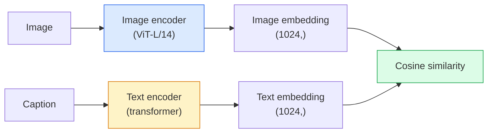

# Visão de vocabulário aberto  CLIP

> Treinar um codificador de imagem e um codificador de texto juntos para que os pares de correspondência (imagem, legenda) aterrem no mesmo ponto em um espaço compartilhado.

**Type:** Build + Use
**Languages:** Python
**Prerequisites:** Phase 4 Lesson 14 (ViT), Phase 4 Lesson 17 (Self-Supervised)
**Time:** ~45 minutes

## Objetivos de aprendizagem

- Explicar a arquitetura de duas torres do CLIP e o objetivo de formação contrastada
- Utilize um CLIP (ou SigLIP) pré-treinado para classificação de tiro zero sem qualquer treinamento específico de tarefa
- Implementar classificação de tiro zero a partir do zero: codificar as instruções de classe, calcular a semelhança cosínica, tomar argmax
- Distinguir os modelos de visão CLIP, SigLIP, OpenCLIP e LLaVA/LLaMA  para o que cada um serve em 2026

## O problema

Os classificadores tradicionais são de vocabulário fechado: um modelo ImageNet de 1000 classes só pode prever 1000 rótulos.

CLIP (Radford et al., OpenAI 2021) mostrou que o treinamento em 400M (imagem, legenda) pares raspados da web produz um modelo que pode ser classificado em qualquer conjunto de categorias em inferência, descrito puramente em linguagem natural.

Essa capacidade  transferência de tiros zero  é por isso que todo sistema de visão moderno começa com um ponto de controle da família CLIP. Detecção (Grounding DINO, OWL-ViT), segmentação (CLIPSeg, SAM), recuperação, moderação de conteúdo, VLMs e geração de texto para imagem todos se baseiam em embutidos conjuntos em estilo CLIP.

## O conceito

### Duas torres



Ambos os codificadores terminam com uma projeção linear para a mesma dimensão de incorporação (512 para CLIP-B/32, 1024 para CLIP-L/14).

### O objectivo

Dado um lote de pares N (imagem, legenda), construa uma matriz de semelhança NxN. Treine ambos os codificadores para que a diagonal (pares correspondentes) tenha alta semelhança e os fora-diagonais (não correspondentes) tenham baixa semelhança.

```
sim_matrix = image_embeddings @ text_embeddings.T / tau

loss_i2t = cross_entropy(sim_matrix,       targets=arange(N))
loss_t2i = cross_entropy(sim_matrix.T,     targets=arange(N))
loss = (loss_i2t + loss_t2i) / 2
```

Simétrica porque tanto a recuperação de imagem a texto como de texto a imagem devem funcionar. `tau`(temperatura) é tipicamente aprendida como um parâmetro escalar, iniciado em 0,07.

### Siglip: uma perda melhor

SigLIP (Zhai et al., 2023) substituiu o softmax por sigmoide por par:

```
loss = mean over pairs of log(1 + exp(-y_ij * sim_ij))
y_ij = +1 if matching, -1 otherwise
```

A perda por par elimina a normalização de nível de lote que a CLIP requer.

### Classificação de tiros zero

Dado um CLIP treinado:

1. Para cada classe, compor uma pergunta: "uma foto de uma classe".
2. Encode todas as instruções de classe com o codificador de texto -> `T`Forma (C, d).
3. Encode a imagem de teste -> `I`Forma (1, d).
4. Similhança = `I @ T.T`Forma (1, C).
5. Argmax -> classe prevista.

As questões de engenharia de ponta. OpenAI publicou 80 modelos de ponta para ImageNet ("uma foto de um {}", "uma foto borbulha de um {}", "um esboço de um {}", ...).

### Se em 2026 forem utilizados modelos CLIP

- **Zero-shot classification** utilização directa.
- **Image retrieval** codificar todas as imagens uma vez, inserir a consulta na inferência.
- **Text-conditioned detection** Aterrando o DINO, OWL-ViT envolve uma torre de texto CLIP em torno de um detector.
- **Text-conditioned segmentation** CLIPSeg; SAM utiliza entradas de texto-prompt através do CLIP.
- **VLMs** LLaVA, Qwen-VL, InternVL incorporam um codificador de visão da família CLIP num LLM.
- **Text-to-image gen** Diffusão estável, condição DALL-E 3 em embutidos de texto CLIP.

Uma vez que você tem um espaço de inserção compartilhado, cada tarefa de visão + linguagem torna-se um cálculo de distância.

```figure
clip-contrastive
```

## Construí-lo

### Passo 1: Um modelo de duas torres

O CLIP real é o transformador ViT +. Para esta lição as torres são pequenas MLPs sobre recursos pré-extraídos para que o sinal de treinamento seja visível na CPU.

```python
import torch
import torch.nn as nn
import torch.nn.functional as F


class TwoTower(nn.Module):
    def __init__(self, img_in=128, txt_in=64, emb=64):
        super().__init__()
        self.image_proj = nn.Sequential(nn.Linear(img_in, 128), nn.ReLU(), nn.Linear(128, emb))
        self.text_proj = nn.Sequential(nn.Linear(txt_in, 128), nn.ReLU(), nn.Linear(128, emb))
        self.logit_scale = nn.Parameter(torch.ones([]) * 2.6592)  # ln(1/0.07)

    def forward(self, img_feats, txt_feats):
        i = F.normalize(self.image_proj(img_feats), dim=-1)
        t = F.normalize(self.text_proj(txt_feats), dim=-1)
        return i, t, self.logit_scale.exp()
```

Duas projeções, saída de dim-compartilhada, temperatura aprendida, a mesma forma que a verdadeira API CLIP.

### Passo 2: Perda de contraste

```python
def clip_loss(image_emb, text_emb, logit_scale):
    N = image_emb.size(0)
    sim = logit_scale * image_emb @ text_emb.T
    targets = torch.arange(N, device=sim.device)
    l_i = F.cross_entropy(sim, targets)
    l_t = F.cross_entropy(sim.T, targets)
    return (l_i + l_t) / 2
```

Simétrica. Escala de logit_estilo mais alta = mais nítida, mais confiante, mas risco de instabilidade.

### Passo 3: Classificador de tiro zero

```python
@torch.no_grad()
def zero_shot_classify(model, image_feats, class_text_feats, class_names):
    """
    image_feats:      (N, img_in)
    class_text_feats: (C, txt_in)   one averaged embedding per class
    """
    i = F.normalize(model.image_proj(image_feats), dim=-1)
    t = F.normalize(model.text_proj(class_text_feats), dim=-1)
    sim = i @ t.T
    pred = sim.argmax(dim=-1)
    return [class_names[p] for p in pred.tolist()]
```

É o procedimento exato de tiro zero usado com um ponto de controlo CLIP de produção.

### Passo 4: Verificação de Saúde Mental

```python
torch.manual_seed(0)
model = TwoTower()

img = torch.randn(8, 128)
txt = torch.randn(8, 64)
i, t, scale = model(img, txt)
loss = clip_loss(i, t, scale)
print(f"batch size: {i.size(0)}   loss: {loss.item():.3f}")
```

A perda deve estar próxima de `log(N) = log(8) = 2.08`Para um modelo iniciado aleatoriamente  o alvo de entropia cruzada simétrica quando ainda não se aprende estrutura.

## Usá-lo

O OpenCLIP é o padrão da comunidade em 2026:

```python
import open_clip
import torch
from PIL import Image

model, _, preprocess = open_clip.create_model_and_transforms("ViT-B-32", pretrained="laion2b_s34b_b79k")
tokenizer = open_clip.get_tokenizer("ViT-B-32")

image = preprocess(Image.open("dog.jpg")).unsqueeze(0)
text = tokenizer(["a photo of a dog", "a photo of a cat", "a photo of a car"])

with torch.no_grad():
    image_features = model.encode_image(image)
    text_features = model.encode_text(text)
    image_features = image_features / image_features.norm(dim=-1, keepdim=True)
    text_features = text_features / text_features.norm(dim=-1, keepdim=True)
    probs = (100.0 * image_features @ text_features.T).softmax(dim=-1)

print(probs)
```

O SigLIP é mais novo, treina melhor em pequenas escalas e é preferido para novos trabalhos: `google/siglip-base-patch16-224`Abraçando ambas as naves.

## Envia-o

Esta lição produz:

- `outputs/prompt-zero-shot-class-picker.md` um prompt que desenha modelos de classe para CLIP de tiro zero com uma lista de classes e um domínio.
- `outputs/skill-image-text-retriever.md` uma habilidade que constrói um índice de inserção de imagem com qualquer ponto de verificação CLIP, suporta consulta por texto e consulta por imagem.

## Exercícios

1. **(Easy)**Use um OpenCLIP ViT-B/32 pré-treinado e faça classificação de tiro zero no CIFAR-10 com o conjunto de 80 modelos de instrução.
2. **(Medium)**Compare um único modelo ("uma foto de um {}") vs 80 modelos embutidos médios na mesma tarefa CIFAR-10. Quantifique a lacuna e explique por que os modelos ajudam.
3. **(Hard)**Crie um índice de recuperação de imagem de tiros zero: inserir 1.000 imagens com CLIP, criar um índice FAISS, consulta com uma descrição em linguagem natural.

## Termos-chave

| Term | What people say | What it actually means |
|------|----------------|----------------------|
| Two-tower | "Dual encoder" | Separate image and text encoders ending in a shared-dim projection head |
| Zero-shot | "No task-specific training" | Classify into classes described only by text at inference; no labels touched |
| Temperature / logit_scale | "tau" | Learned scalar that scales the similarity matrix before softmax |
| Prompt template | "A photo of a {}" | Natural-language wrapper around class names; averaging many templates boosts zero-shot accuracy |
| CLIP | "Image+text model" | The 2021 OpenAI model; vocabulary of the field in 2026 |
| SigLIP | "Sigmoid CLIP" | Swaps softmax for per-pair sigmoid; trains better at small batches |
| OpenCLIP | "Open reproduction" | Community-trained CLIP variants on LAION; production default for open-source pipelines |
| VLM | "Vision-language model" | A CLIP-family encoder plus an LLM, trained to answer questions about images |

## Mais leitura

- [CLIP: Learning Transferable Visual Models from Natural Language Supervision (Radford et al., 2021)](https://arxiv.org/abs/2103.00020)
- [SigLIP: Sigmoid Loss for Language-Image Pre-Training (Zhai et al., 2023)](https://arxiv.org/abs/2303.15343)
- [OpenCLIP](https://github.com/mlfoundations/open_clip) base de código comunitária
- [DINOv2 vs CLIP vs MAE: a features comparison](https://huggingface.co/blog/dinov2) Guia de uso de HF com casos de uso lado a lado
