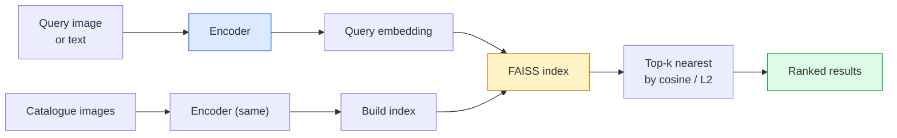

# Retorno de imagem e aprendizado métrico

> Um sistema de recuperação classifica os candidatos por distância em um espaço de inserção.

**Type:** Build
**Languages:** Python
**Prerequisites:** Phase 4 Lesson 14 (ViT), Phase 4 Lesson 18 (CLIP)
**Time:** ~45 minutes

## Objetivos de aprendizagem

- Explique as perdas de aprendizagem métrica tripla, contrastativa e baseada em proxy e escolha a correta para um determinado conjunto de dados
- Implementar corretamente a normalização L2 e a semelhança cosínica e verificar a diferença entre a recuperação do "mesmo item" e da "mesmo classe"
- Crie um índice FAISS, consulta-o por texto e por imagem e relate recall@K para um conjunto de consultas mantidas
- Use DINOv2, CLIP e SigLIP como um sistema de inserção de coluna vertebral para saber quando cada um ganha

## O problema

A recuperação está em todos os lugares na visão de produção: detecção duplicada, pesquisa de imagem inversa, pesquisa visual ("encontrar produtos semelhantes"), re-identificação de rosto, re-identificação de pessoa para vigilância, correspondência de nível de instância para o comércio eletrônico. A pergunta do produto é sempre a mesma: "dada esta imagem de consulta, classifique o meu catálogo".

Duas decisões de design moldam todo o sistema. O embedding  que modelo produz os vetores. O índice  como encontrar os vizinhos mais próximos na escala. Ambos são mercadorias em 2026 (DINOv2 para o embedding, FAISS para o índice), o que aumenta a barra: a parte difícil é definir *o que conta como semelhante* para sua aplicação, então moldando o espaço de embedding para que as distâncias coincidam.

Essa formação é a aprendizagem métrica. É uma disciplina pequena, mas de alta alavancagem.

## O conceito

### Recuperação num olhar



### As quatro famílias perdidas

| Loss | Requires | Pros | Cons |
|------|----------|------|------|
| **Contrastive** | (anchor, positive) + negatives | Simple, works with any pair label | Slow to converge without many negatives |
| **Triplet** | (anchor, positive, negative) | Intuitive; direct margin control | Hard-triplet mining is expensive |
| **NT-Xent / InfoNCE** | Pairs + batch-mined negatives | Scales to large batches | Needs big batch or momentum queue |
| **Proxy-based (ProxyNCA)** | Class labels only | Fast, stable, no mining | Can overfit to proxies on small datasets |

Para a maioria dos casos de uso em produção, comece com uma espinha dorsal pré-entrenada e adicione apenas um ajuste de aprendizado métrico se os incorporados fora da plataforma tiverem um desempenho inferior no seu conjunto de testes.

### Perda de triplet formalmente

```
L = max(0, ||f(a) - f(p)||^2 - ||f(a) - f(n)||^2 + margin)
```

Puxar âncora`a`Próximo a positivo `p`, empurrar para longe do negativo `n`, com um `margin`A estrutura de três imagens generaliza-se a qualquer ordem de semelhança.

As matérias minerais: triplo fácil (`n`Já muito longe .`a`O processo de mineração semihard (`n`mais do que `p`Mas dentro da margem) é a receita do FaceNet de 2016 e ainda domina.

### Similhança cosínica vs L2

Duas métricas, duas convenções:

- **Cosine**Requer embutições normalizadas L2.
- **L2**Funciona em incorporados brutos ou normalizados, mas geralmente é combinado com L2 normalizado + L2 ao quadrado.

Para a maioria das redes modernas, as duas são equivalentes: `||a - b||^2 = 2 - 2 cos(a, b)`Quando ?`||a|| = ||b|| = 1`Escolha a convenção que corresponda ao seu treinamento de incorporação; misturando-as silenciosamente muda o que "mais próximo" significa.

### Recall@K

A métrica padrão de recuperação:

```
recall@K = fraction of queries where at least one correct match is in the top K results
```

Relatório recall@1, @5, @10 lado a lado. Um recall@10 acima de 0,95 com recall@1 abaixo de 0,5 significa que o espaço de inserção tem a estrutura certa, mas a classificação é ruidosa.

Para a detecção duplicada, a precisão@K é mais importante porque cada falso positivo é um erro visível ao usuário.

### FAISS num único parágrafo

A biblioteca de facto para pesquisa de vizinho mais próximo. Três opções de índice:

- `IndexFlatIP`- Não .`IndexFlatL2`Força bruta, exata, sem treino.
- `IndexIVFFlat`- partição em células K, pesquisa apenas as células mais próximas.
- `IndexHNSW` baseado em gráficos, mais rápido para muitas consultas, grande tamanho do índice.

Para 100 mil vetores que você provavelmente quer `IndexFlatIP`Para 10 milhões, você quer`IndexIVFFlat`Para 100 milhões+ combinados com quantificação do produto (`IndexIVFPQ`)).

### Recuperação a nível de instância versus categoria

Dois problemas muito diferentes com o mesmo nome:

- **Category-level** "Encontre gatos no meu catálogo". Semelhança condicional de classe; as incorporações CLIP / DINOv2 fora da prateleira funcionam bem.
- **Instance-level** "encontrar *este produto exato* no meu catálogo". Precisa de uma discriminação de graus finos entre objetos visualmente semelhantes da mesma classe; embalagens fora de prateleira de baixo desempenho; ajuste fino com questões de aprendizagem métrica.

Pergunte sempre qual é o problema antes de escolher um modelo.

```figure
metric-embedding
```

## Construí-lo

### Passo 1: Perda de triplet

```python
import torch
import torch.nn.functional as F

def triplet_loss(anchor, positive, negative, margin=0.2):
    d_ap = F.pairwise_distance(anchor, positive, p=2)
    d_an = F.pairwise_distance(anchor, negative, p=2)
    return F.relu(d_ap - d_an + margin).mean()
```

Funciona em embutidos normalizados ou crus L2.

### Passo 2: Mineração semi-dura

Dado um lote de embebedimentos e rótulos, encontrar o negativo semia-duro mais difícil para cada âncora.

```python
def semi_hard_negatives(emb, labels, margin=0.2):
    dist = torch.cdist(emb, emb)
    same_class = labels[:, None] == labels[None, :]
    diff_class = ~same_class
    N = emb.size(0)

    positives = dist.clone()
    positives[~same_class] = float("-inf")
    positives.fill_diagonal_(float("-inf"))
    pos_idx = positives.argmax(dim=1)

    semi_hard = dist.clone()
    semi_hard[same_class] = float("inf")
    d_ap = dist[torch.arange(N), pos_idx].unsqueeze(1)
    semi_hard[dist <= d_ap] = float("inf")
    neg_idx = semi_hard.argmin(dim=1)

    fallback_mask = semi_hard[torch.arange(N), neg_idx] == float("inf")
    if fallback_mask.any():
        hardest = dist.clone()
        hardest[same_class] = float("inf")
        neg_idx = torch.where(fallback_mask, hardest.argmin(dim=1), neg_idx)
    return pos_idx, neg_idx
```

Cada âncora obtém o positivo mais duro da classe e um negativo semia-duro que é mais longe do que o positivo, mas dentro da margem.

### Passo 3: Recall@K

```python
def recall_at_k(query_emb, gallery_emb, query_labels, gallery_labels, k=1):
    sim = query_emb @ gallery_emb.T
    _, top_k = sim.topk(k, dim=-1)
    matches = (gallery_labels[top_k] == query_labels[:, None]).any(dim=-1)
    return matches.float().mean().item()
```

Top-k por produto interno em embutidos normalizados L2 é igual a top-k por cosino.

### Passo 4: Reunião

```python
import torch
import torch.nn as nn
from torch.optim import Adam

class Encoder(nn.Module):
    def __init__(self, in_dim=128, emb_dim=64):
        super().__init__()
        self.net = nn.Sequential(
            nn.Linear(in_dim, 128), nn.ReLU(),
            nn.Linear(128, emb_dim),
        )

    def forward(self, x):
        return F.normalize(self.net(x), dim=-1)

torch.manual_seed(0)
num_classes = 6
protos = F.normalize(torch.randn(num_classes, 128), dim=-1)

def sample_batch(bs=32):
    labels = torch.randint(0, num_classes, (bs,))
    x = protos[labels] + 0.15 * torch.randn(bs, 128)
    return x, labels

enc = Encoder()
opt = Adam(enc.parameters(), lr=3e-3)

for step in range(200):
    x, y = sample_batch(32)
    emb = enc(x)
    pos_idx, neg_idx = semi_hard_negatives(emb, y)
    loss = triplet_loss(emb, emb[pos_idx], emb[neg_idx])
    opt.zero_grad(); loss.backward(); opt.step()
```

Após algumas centenas de passos os aglomerados de incorporação formam um aglomerado por classe.

## Usá-lo

Estacas de produção em 2026:

- **DINOv2 + FAISS**- Recuperação visual de finalidade geral.
- **CLIP + FAISS** quando as consultas são de texto.
- **Fine-tuned DINOv2 + FAISS** Recuperação a nível de instância, re-ID facial, moda, comércio eletrônico.
- **Milvus / Weaviate / Qdrant** envoltura de DB de vetores gerenciados em torno do FAISS ou do HNSW.

Para a recuperação de instâncias SOTA, a receita é: DINOv2 espinha dorsal, adicionar um cabeçalho de incorporação, ajustar com um triplo ou perda InfoNCE em pares rotulados por instâncias, índice em FAISS.

## Envia-o

Esta lição produz:

- `outputs/prompt-retrieval-loss-picker.md` um prompt que seleciona triplet / InfoNCE / ProxyNCA para um determinado problema de recuperação.
- `outputs/skill-recall-at-k-runner.md` uma habilidade que escreve um arame de avaliação limpo para recall@K com divisões de trem/val/galeria e contrato de dados adequado.

## Exercícios

1. **(Easy)**Exerça o exemplo de brinquedo acima. Traçar os embebimentos com PCA antes e depois do treinamento para ver os seis aglomerados se formar.
2. **(Medium)**Adicione uma implementação de perda ProxyNCA: um aprendizado "proxy" por classe, entropia cruzada padrão na semelhança cosínica. Compare velocidade de convergência vs perda de triplet nos dados do brinquedo.
3. **(Hard)**Tome 1.000 imagens de validação da ImageNet, embebebe com DINOv2 através do HuggingFace, construa um índice plano FAISS e relate recall@{1, 5, 10} contra as mesmas imagens que as consultas (deveria ser 1.0) e contra uma divisão prolongada com rótulos da ImageNet como verdade baseada.

## Termos-chave

| Term | What people say | What it actually means |
|------|----------------|----------------------|
| Metric learning | "Shape the space" | Training an encoder so distances in its output space reflect a target similarity |
| Triplet loss | "Pull and push" | L = max(0, d(a, p) - d(a, n) + margin); the canonical metric-learning loss |
| Semi-hard mining | "Useful negatives" | Negatives further from the anchor than the positive but within margin; empirically the most informative |
| Proxy-based loss | "Class prototypes" | One learned proxy per class; cross-entropy over similarity-to-proxies; no pair mining |
| Recall@K | "Top-K hit rate" | Fraction of queries with at least one correct result in the top K |
| Instance retrieval | "Find this exact thing" | Fine-grained matching; off-the-shelf features usually underperform |
| FAISS | "The NN library" | Facebook's nearest-neighbour library; supports exact and approximate indexes |
| HNSW | "Graph index" | Hierarchical navigable small world; fast approximate NN with small memory overhead |

## Mais leitura

- [FaceNet: A Unified Embedding for Face Recognition (Schroff et al., 2015)](https://arxiv.org/abs/1503.03832) perda de triplato / papel de mineração semi-duro
- [In Defense of the Triplet Loss for Person Re-Identification (Hermans et al., 2017)](https://arxiv.org/abs/1703.07737) Guia prática para a ajuste fino de triplate
- [FAISS documentation](https://github.com/facebookresearch/faiss/wiki) todos os índices, todos os compromissos
- [SMoT: Metric Learning Taxonomy (Kim et al., 2021)](https://arxiv.org/abs/2010.06927) Pesquisa das perdas modernas e suas conexões
