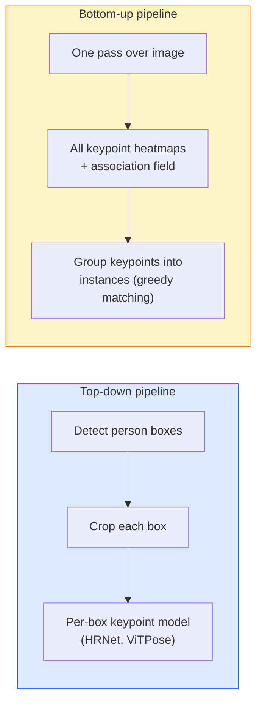

# Detecção e estimativa de posições

> Uma pose é um conjunto de pontos-chave ordenados um detector de pontos-chave é um regressor de calor tudo o resto é contabilidade

**Type:** Build
**Languages:** Python
**Prerequisites:** Phase 4 Lesson 06 (Detection), Phase 4 Lesson 07 (U-Net)
**Time:** ~45 minutes

## Objetivos de aprendizagem

- Distinguir a estimativa de posição de cima para baixo e de baixo para cima e indicar quando cada uma é usada
- Mapa de calor de regressão para pontos-chave K com um objetivo Gaussian-per-puntos-chave e extrair coordenadas de pontos-chave na inferência
- Explicar os campos de afinidade de parte (PAFs) e como as canalizações de baixo para cima associam pontos-chave em instâncias
- Usar MediaPipe Pose ou MMPose para estimar os pontos-chave de produção e compreender o seu formato de saída

## O problema

As tarefas-chave escondem-se sob muitos nomes: pose humana (17 articulações corporais), marcas faciais (68 ou 478 pontos), mão (21 pontos), pose animal, pose de objeto robótico, marcas de anatomia médica.

A estimativa de posição é a base da captura de movimento, aplicativos de fitness, análise esportiva, controle de gestos, animação, experimentação de AR e captura robótica. O caso 2D está maduro; a posição 3D (estimando posições conjuntas em coordenadas mundiais a partir de uma única câmera) é a fronteira atual da pesquisa.

A questão da engenharia é escala. Uma imagem única, uma pessoa só é um problema de 20ms.

## O conceito

### De cima para baixo versus baixo para cima



- **Top-down** detectar as pessoas primeiro, em seguida, executar um modelo de ponto chave por pessoa em cada colheita.
- **Bottom-up** uma passagem avançada prevê todos os pontos-chave mais um campo de associação; agrupá-los.

Top-down (HRNet, ViTPose) é o líder de precisão; bottom-up (OpenPose, HigherHRNet) é o líder de throughput para cenas lotadas.

### Regressão do mapa de calor

Em vez de regredir `(x, y)`direto, prever um `H x W`Mapa de calor por ponto chave com uma mancha gaussiana centrada na localização real.

```
target[k, y, x] = exp(-((x - cx_k)^2 + (y - cy_k)^2) / (2 sigma^2))
```

Na inferência, o argmax de cada heatmap é a localização prevista do ponto chave.

Por que os mapas de calor funcionam melhor do que a regressão direta: a estrutura espacial da rede (mapa de características conv) alinha-se naturalmente com a saída espacial.

### Localização de subpixels

Argmax dá coordenadas inteiras. Para a precisão de sub-pixels, refine ajustando uma parábola ao argmax e seus vizinhos, ou use o conhecido offset `(dx, dy) = 0.25 * (heatmap[y, x+1] - heatmap[y, x-1], ...)`Direcção.

### Campo de afinidade parcial (PAFs)

Para cada par de pontos-chave conectados (por exemplo, ombro esquerdo ao cotovelo esquerdo), prevê um campo de 2 canais que codifica o vetor unitário apontando de um para o outro. Para associar um ombro com seu cotovelo, integra o PAF ao longo da linha que conecta pares candidatos; o par com a maior integral é combinado.

```
For each connection (limb):
  PAF channels: 2 (unit vector x, y)
  Line integral: sum over sample points of (PAF . line_direction)
  Higher integral = stronger match
```

Elegante e em escala para tamanhos arbitrários de multidão sem culturas por pessoa.

### Pontos-chave COCO

O conjunto de dados padrão de posicionamento corporal: 17 pontos-chave por pessoa, PCK (Procento de pontos-chave corretos) e OKS (Similaridade de pontos-chave objeto) como métricas. OKS é o analogo de pontos-chave da IoU e é o que COCO mAP@OKS relata.

### 2D vs 3D

- **2D pose** Coordenadas de imagem; resolvido na qualidade da produção (MediaPipe, HRNet, ViTPose).
- **3D pose** coordenadas do mundo/camera; investigação ainda ativa.
  - Levante as previsões 2D para 3D com um pequeno MLP (VideoPose3D).
  - Regressão 3D direta da imagem (PyMAF, MHFormer).
  - Configurações de visualização múltipla (CMU Panoptic) para a verdade no solo.

```figure
cv3-pose-heatmap
```

## Construí-lo

### Passo 1: alvo da mapa de calor de Gaussian

```python
import numpy as np
import torch

def gaussian_heatmap(size, cx, cy, sigma=2.0):
    yy, xx = np.meshgrid(np.arange(size), np.arange(size), indexing="ij")
    return np.exp(-((xx - cx) ** 2 + (yy - cy) ** 2) / (2 * sigma ** 2)).astype(np.float32)

hm = gaussian_heatmap(64, 32, 32, sigma=2.0)
print(f"peak: {hm.max():.3f} at ({hm.argmax() % 64}, {hm.argmax() // 64})")
```

Mapas de calor por ponto chave empilhadas ao longo de um eixo de canal dão o tensor alvo completo.

### Passo 2: Cabeça de teclado

Um modelo de estilo U-Net que sai canais de heatmap K.

```python
import torch.nn as nn
import torch.nn.functional as F

class TinyKeypointNet(nn.Module):
    def __init__(self, num_keypoints=4, base=16):
        super().__init__()
        self.down1 = nn.Sequential(nn.Conv2d(3, base, 3, 2, 1), nn.ReLU(inplace=True))
        self.down2 = nn.Sequential(nn.Conv2d(base, base * 2, 3, 2, 1), nn.ReLU(inplace=True))
        self.mid = nn.Sequential(nn.Conv2d(base * 2, base * 2, 3, 1, 1), nn.ReLU(inplace=True))
        self.up1 = nn.ConvTranspose2d(base * 2, base, 2, 2)
        self.up2 = nn.ConvTranspose2d(base, num_keypoints, 2, 2)

    def forward(self, x):
        h1 = self.down1(x)
        h2 = self.down2(h1)
        h3 = self.mid(h2)
        u1 = self.up1(h3)
        return self.up2(u1)
```

Introdução`(N, 3, H, W)`, produção `(N, K, H, W)`Perda é MSE por pixel contra alvos Gaussian.

### Passo 3: Inferência  extrair as coordenadas de pontos-chave

```python
def heatmap_to_coords(heatmaps):
    """
    heatmaps: (N, K, H, W)
    returns:  (N, K, 2) float coordinates in image pixels
    """
    N, K, H, W = heatmaps.shape
    hm = heatmaps.reshape(N, K, -1)
    idx = hm.argmax(dim=-1)
    ys = (idx // W).float()
    xs = (idx % W).float()
    return torch.stack([xs, ys], dim=-1)

coords = heatmap_to_coords(torch.randn(2, 4, 32, 32))
print(f"coords: {coords.shape}")  # (2, 4, 2)
```

Para refinamento sub-pixel, interpolar em torno do argmax.

### Passo 4: conjunto de dados sintético de pontos-chave

Simples: desenhe quatro pontos numa tela branca e aprenda a predizê-los.

```python
def make_synthetic_sample(size=64):
    img = np.ones((3, size, size), dtype=np.float32)
    rng = np.random.default_rng()
    kps = rng.integers(8, size - 8, size=(4, 2))
    for cx, cy in kps:
        img[:, cy - 2:cy + 2, cx - 2:cx + 2] = 0.0
    hms = np.stack([gaussian_heatmap(size, cx, cy) for cx, cy in kps])
    return img, hms, kps
```

É fácil para um modelo aprender em um minuto.

### Passo 5: Treinamento

```python
model = TinyKeypointNet(num_keypoints=4)
opt = torch.optim.Adam(model.parameters(), lr=3e-3)

for step in range(200):
    batch = [make_synthetic_sample() for _ in range(16)]
    imgs = torch.from_numpy(np.stack([b[0] for b in batch]))
    hms = torch.from_numpy(np.stack([b[1] for b in batch]))
    pred = model(imgs)
    # Upsample pred to full resolution
    pred = F.interpolate(pred, size=hms.shape[-2:], mode="bilinear", align_corners=False)
    loss = F.mse_loss(pred, hms)
    opt.zero_grad(); loss.backward(); opt.step()
```

## Usá-lo

- **MediaPipe Pose** Estimador de posições de produção do Google; navega tempos de execução móveis WebGL + com latência inferior a 10 ms.
- **MMPose**(OpenMMLab)  base de código de investigação abrangente; cada arquitetura SOTA com pesos pré-entrenados.
- **YOLOv8-pose** Posagem de múltiplas pessoas em tempo real mais rápida com uma única passagem para a frente.
- **transformers HumanDPT / PoseAnything** abordagens mais recentes de linguagem visual para a pose de vocabulário aberto (qualquer objeto, qualquer conjunto de pontos-chave).

## Envia-o

Esta lição produz:

- `outputs/prompt-pose-stack-picker.md` um prompt que escolhe MediaPipe / YOLOv8-pose / HRNet / ViTPose dada latência, tamanho da multidão e necessidade 2D vs 3D.
- `outputs/skill-heatmap-to-coords.md` uma habilidade que escreve a rotina de sub-pixel heatmap-to-coordinate usada por cada modelo de pose de produção.

## Exercícios

1. **(Easy)**Treinar o pequeno modelo de pontos-chave no conjunto de dados sintético de 4 pontos.
2. **(Medium)**Adicionar refinamento de sub-pixels: dada a posição argmax, ajuste uma parábola 1D ao longo de x e y dos pixels vizinhos.
3. **(Hard)**Construir um conjunto de dados sintético de 2 pessoas onde cada imagem mostra duas instâncias do padrão de 4 pontos-chave. Treinar um pipeline de baixo para cima com PAFs que prevejam qual ponto-chave pertence a qual instância, e avaliar OKS.

## Termos-chave

| Term | What people say | What it actually means |
|------|----------------|----------------------|
| Keypoint | "A landmark" | A specific ordered point on an object (joint, corner, feature) |
| Pose | "The skeleton" | An ordered set of keypoints belonging to one instance |
| Top-down | "Detect then pose" | Two-stage pipeline: person detector + per-crop keypoint model; highest accuracy |
| Bottom-up | "Pose first, group later" | Single-pass all-keypoint prediction + grouping; constant time in crowd size |
| Heatmap | "Gaussian target" | H x W tensor per keypoint with peak at the true location; the preferred regression target |
| PAF | "Part Affinity Field" | 2-channel unit vector field encoding limb directions; used to group keypoints into instances |
| OKS | "Keypoint IoU" | Object Keypoint Similarity; the COCO metric for pose |
| HRNet | "High-Resolution Net" | The dominant top-down keypoint architecture; preserves high-res features throughout |

## Mais leitura

- [OpenPose (Cao et al., 2017)](https://arxiv.org/abs/1812.08008) A redução de preços dos produtos de base com os PAFs; ainda a melhor redacção da abordagem
- [HRNet (Sun et al., 2019)](https://arxiv.org/abs/1902.09212) a arquitetura de referência de cima para baixo
- [ViTPose (Xu et al., 2022)](https://arxiv.org/abs/2204.12484) ViT simples como espinha dorsal de postura; SOTA atual em muitos índices de referência
- [MediaPipe Pose](https://developers.google.com/mediapipe/solutions/vision/pose_landmarker) posições de produção em tempo real; a pilha mais rápida em 2026
