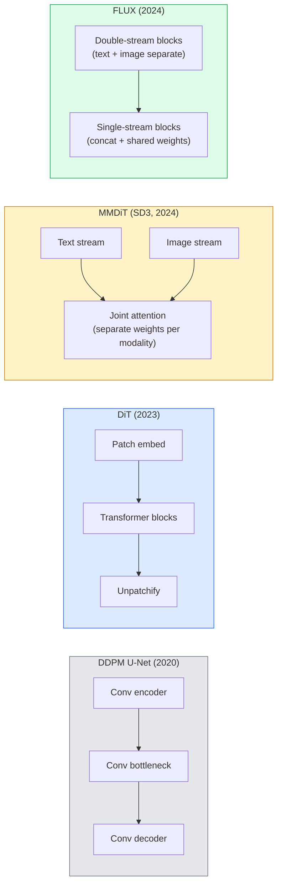

# Transformadores de difusão e fluxo rectificado

> A U-Net não é o segredo da difusão. Substitui-a por um transformador, troque o cronograma de ruído por um fluxo de linha reta, e de repente você tem SD3, FLUX e cada modelo de texto para imagem de 2026.

**Type:** Learn + Build
**Languages:** Python
**Prerequisites:** Phase 4 Lesson 10 (Diffusion DDPM), Phase 4 Lesson 14 (ViT), Phase 7 Lesson 02 (Self-Attention)
**Time:** ~75 minutes

## Objetivos de aprendizagem

- Seguir a evolução do U-Net DDPM (Lessão 10) para o Transformador de Difusão (DiT), MMDiT (SD3), e DiT de fluxo único + duplo (FLUX)
- Explicar o fluxo rectificado: por que uma trajetória reta entre ruído e dados permite que os modelos tenham amostras em 20 etapas em vez de 1000
- Implementar um pequeno bloco DiT e um ciclo de treinamento de fluxo rectificado, ambos abaixo de 100 linhas
- Distinguir as variantes de modelos (SD3, FLUX.1-dev, FLUX.1-schnell, Z-Image, Qwen-Image) por arquitetura, contagem de parâmetros e licenciamento

## O problema

A lição 10 construiu um DDPM com um denoizador U-Net. Essa receita dominou 2020-2023: U-Net + cronograma beta + perda de previsão de ruído.

Todos os modelos de texto-imagem de 2026 avançados passaram além deles. Estabilidade Diffusion 3, FLUX, SD4, Z-Image, Qwen-Image, Hunyuan-Image  nenhum usa uma U-Net. Eles usam Transformadores de Diffusão (DiT).

A mudança importa porque é a razão pela qual a geração de imagens baseada em difusão tornou-se controladora, rápida (renderização de texto resolvida SD3/SD4) e rápida de produção.

## O conceito

### Da U-Net para o transformador



- **DiT**(Peebles & Xie, 2023)  substituir a U-Net por um transformador semelhante a ViT em parches latentes. Condicionamento através de norma de camada adaptativa (AdaLN).
- **MMDiT**(SD3, Esser et al., 2024)  dois fluxos com pesos separados para tokens de texto e imagem que compartilham uma atenção comum.
- **FLUX**(Black Forest Labs, 2024)  primeiros blocos N duplo-fluxo como SD3, blocos posteriores concatenar e compartilhar pesos (fluxo único) para a eficiência em maior profundidade.
- **Z-Image**(2025)  uma DiT eficiente de fluxo único a parâmetros 6B que desafia a "escalação a todo custo".

### Fluxo corrigido num parágrafo

O DDPM define o processo avançado como um SDE barulhento onde `x_t`O inverso aprendido é um segundo SDE, resolvido por 1000 pequenos passos.

O fluxo retificado define um **straight-line**Interpolação entre dados limpos e ruído puro:

```
x_t = (1 - t) * x_0 + t * epsilon,     t in [0, 1]
```

Treinar uma rede para prever a velocidade .`v_theta(x_t, t) = epsilon - x_0` a direcção para a frente ao longo da trajetória retreta, desde dados limpos até ruído (`dx_t/dt`O resultado da ODE é muito mais próximo de uma linha reta, por isso são necessários menos passos de integração para a amostragem.

O SD3 chama isto .**Rectified Flow Matching**. FLUX, Z-Image e a maioria dos modelos 2026 usam o mesmo objetivo.

### Condicionamento AdaLN

Condição de DiTs em fase de tempo e classe/texto via **adaptive layer norm**: previsão `scale`E ...`shift`Muito mais limpo do que a modulação no estilo FiLM em U-Nets e o padrão em todos os modernos DiT.

```
cond -> MLP -> (scale, shift, gate)
norm(x) * (1 + scale) + shift, then residual add * gate
```

### Encoderadores de texto em SD3 e FLUX

- **SD3**utiliza três codificadores de texto: dois modelos CLIP + T5-XXL. Embedings concatenados e alimentados ao fluxo de imagem como condicionamento de texto.
- **FLUX**utiliza um CLIP-L + T5-XXL.
- **Qwen-Image / Z-Image**As variantes utilizam os seus próprios codificadores de texto internos alinhados com os seus MLLs básicos.

O codificador de texto é uma grande parte do porquê SD3/FLUX razão sobre as instruções muito melhor do que SD1.5. T5-XXL sozinho é 4.7B parâmetros.

### A orientação livre de classificadores ainda é válida

O fluxo rectificado muda a amostragem, não o condicionamento. A orientação sem classificador (texto de queda com 10% de probabilidade durante o treinamento, mistura de previsões condicionais e incondicionais na inferência) funciona da mesma forma que o fluxo rectificado. A maioria dos modelos 2026 usa a escala de orientação 3.5-5  menor do que a 7.5 do SD1.5, porque os modelos de fluxo rectificado seguem instruções mais fortemente por padrão.

### Consistência, Turbo, Schnell, LCM

Quatro nomes para a mesma ideia: destilar um modelo lento de muitos passos num modelo rápido de poucos passos.

- **LCM (Latent Consistency Model)**Treinar um aluno que prevê o final.`x_0`de qualquer intermediário `x_t`Em um passo.
- **SDXL Turbo / FLUX schnell** Modelos de 1 a 4 etapas formados com destilação de difusão adversária.
- **SD Turbo** Modelos de Consistência de estilo OpenAI adaptados à difusão latente.

A produção de qualquer novo modelo de navio tem um ponto de controle de "plena qualidade" e uma variante "turbo / rapide". Schnell ("rápido" em alemão, convenção dos Black Forest Labs) funciona em 1-4 passos e se adapta a oleodutos em tempo real.

### Paisagem modelo em 2026

| Model | Size | Architecture | License |
|-------|------|--------------|---------|
| Stable Diffusion 3 Medium | 2B | MMDiT | SAI Community |
| Stable Diffusion 3.5 Large | 8B | MMDiT | SAI Community |
| FLUX.1-dev | 12B | Double + Single Stream DiT | non-commercial |
| FLUX.1-schnell | 12B | same, distilled | Apache 2.0 |
| FLUX.2 | — | iterated FLUX.1 | mixed |
| Z-Image | 6B | S3-DiT (Scalable Single-Stream) | permissive |
| Qwen-Image | ~20B | DiT + Qwen text tower | Apache 2.0 |
| Hunyuan-Image-3.0 | ~80B | DiT | research |
| SD4 Turbo | 3B | DiT + distillation | SAI Commercial |

FLUX.1-schnell é o padrão de código aberto 2026 . Z-Image é o líder de eficiência. FLUX.2 e SD4 são as dicas de qualidade atuais.

### Por que esta mudança de fase importa

DDPM + U-Net funcionou.**better, faster, and scales more cleanly**A transição paralela a da RNNs para transformadores em PNL: ambas as arquiteturas resolveram o mesmo problema, mas os transformadores escalaram e agora dominam.

```figure
cv3-rectified-flow
```

## Construí-lo

### Passo 1: Bloco de DiT com AdaLN

```python
import torch
import torch.nn as nn


class AdaLNZero(nn.Module):
    """
    Adaptive LayerNorm with a gate. Predicts (scale, shift, gate) from the conditioning.
    Init such that the whole block starts as identity ("zero init").
    """

    def __init__(self, dim, cond_dim):
        super().__init__()
        self.norm = nn.LayerNorm(dim, elementwise_affine=False)
        self.mlp = nn.Linear(cond_dim, dim * 3)
        nn.init.zeros_(self.mlp.weight)
        nn.init.zeros_(self.mlp.bias)

    def forward(self, x, cond):
        scale, shift, gate = self.mlp(cond).chunk(3, dim=-1)
        h = self.norm(x) * (1 + scale.unsqueeze(1)) + shift.unsqueeze(1)
        return h, gate.unsqueeze(1)


class DiTBlock(nn.Module):
    def __init__(self, dim=192, heads=3, mlp_ratio=4, cond_dim=192):
        super().__init__()
        self.adaln1 = AdaLNZero(dim, cond_dim)
        self.attn = nn.MultiheadAttention(dim, heads, batch_first=True)
        self.adaln2 = AdaLNZero(dim, cond_dim)
        self.mlp = nn.Sequential(
            nn.Linear(dim, dim * mlp_ratio),
            nn.GELU(),
            nn.Linear(dim * mlp_ratio, dim),
        )

    def forward(self, x, cond):
        h, gate1 = self.adaln1(x, cond)
        a, _ = self.attn(h, h, h, need_weights=False)
        x = x + gate1 * a
        h, gate2 = self.adaln2(x, cond)
        x = x + gate2 * self.mlp(h)
        return x
```

`AdaLNZero`O treinamento afasta o bloco da identidade, estabilizando dramaticamente os modelos de difusão do transformador profundo.

### Passo 2: Um pequeno DIT

```python
def timestep_embedding(t, dim):
    import math
    half = dim // 2
    freqs = torch.exp(-math.log(10000) * torch.arange(half, device=t.device) / half)
    args = t[:, None].float() * freqs[None]
    return torch.cat([args.sin(), args.cos()], dim=-1)


class TinyDiT(nn.Module):
    def __init__(self, image_size=16, patch_size=2, in_channels=3, dim=96, depth=4, heads=3):
        super().__init__()
        self.patch_size = patch_size
        self.num_patches = (image_size // patch_size) ** 2
        self.patch = nn.Conv2d(in_channels, dim, kernel_size=patch_size, stride=patch_size)
        self.pos = nn.Parameter(torch.zeros(1, self.num_patches, dim))
        self.time_mlp = nn.Sequential(
            nn.Linear(dim, dim * 2),
            nn.SiLU(),
            nn.Linear(dim * 2, dim),
        )
        self.blocks = nn.ModuleList([DiTBlock(dim, heads, cond_dim=dim) for _ in range(depth)])
        self.norm_out = nn.LayerNorm(dim, elementwise_affine=False)
        self.head = nn.Linear(dim, patch_size * patch_size * in_channels)

    def forward(self, x, t):
        n = x.size(0)
        x = self.patch(x)
        x = x.flatten(2).transpose(1, 2) + self.pos
        t_emb = self.time_mlp(timestep_embedding(t, self.pos.size(-1)))
        for blk in self.blocks:
            x = blk(x, t_emb)
        x = self.norm_out(x)
        x = self.head(x)
        return self._unpatchify(x, n)

    def _unpatchify(self, x, n):
        p = self.patch_size
        h = w = int(self.num_patches ** 0.5)
        x = x.view(n, h, w, p, p, -1).permute(0, 5, 1, 3, 2, 4).reshape(n, -1, h * p, w * p)
        return x
```

### Passo 3: Treinamento de fluxo corrigido

```python
import torch.nn.functional as F

def rectified_flow_train_step(model, x0, optimizer, device):
    model.train()
    x0 = x0.to(device)
    n = x0.size(0)
    t = torch.rand(n, device=device)
    epsilon = torch.randn_like(x0)
    x_t = (1 - t[:, None, None, None]) * x0 + t[:, None, None, None] * epsilon

    target_velocity = epsilon - x0
    pred_velocity = model(x_t, t)

    loss = F.mse_loss(pred_velocity, target_velocity)
    optimizer.zero_grad()
    loss.backward()
    optimizer.step()
    return loss.item()
```

Comparar com a perda de previsão de ruído do DDPM (Lessão 10): a mesma estrutura, um alvo diferente.`epsilon`, prevemos o**velocity** `epsilon - x_0`, que aponta dos dados para o ruído ao longo da interpolação reta.

### Passo 4: Amostra de Euler

O método de Euler é o mais simples e, para um modelo de fluxo rectificado bem treinado, quase tão preciso quanto os solventes de ordem superior em mais de 20 passos.

```python
@torch.no_grad()
def rectified_flow_sample(model, shape, steps=20, device="cpu"):
    model.eval()
    x = torch.randn(shape, device=device)
    dt = 1.0 / steps
    t = torch.ones(shape[0], device=device)
    for _ in range(steps):
        v = model(x, t)
        x = x - dt * v
        t = t - dt
    return x
```

Em um modelo treinado, produz-se amostras comparáveis à DDPM de 1000 passos.

### Passo 5: Teste de fumo de ponta a ponta

```python
import numpy as np

def synthetic_blobs(num=200, size=16, seed=0):
    rng = np.random.default_rng(seed)
    out = np.zeros((num, 3, size, size), dtype=np.float32)
    yy, xx = np.meshgrid(np.arange(size), np.arange(size), indexing="ij")
    for i in range(num):
        cx, cy = rng.uniform(4, size - 4, size=2)
        r = rng.uniform(2, 4)
        mask = (xx - cx) ** 2 + (yy - cy) ** 2 < r ** 2
        colour = rng.uniform(-1, 1, size=3)
        for c in range(3):
            out[i, c][mask] = colour[c]
    return torch.from_numpy(out)
```

Treinar um`TinyDiT`Após 500 passos, as saídas da amostra devem parecer manchas de cor fracas.

## Usá-lo

Para geração de imagem real com FLUX / SD3 / Z-Image, `diffusers`Navio com API unificada:

```python
from diffusers import FluxPipeline, StableDiffusion3Pipeline
import torch

pipe = FluxPipeline.from_pretrained(
    "black-forest-labs/FLUX.1-schnell",
    torch_dtype=torch.bfloat16,
).to("cuda")

out = pipe(
    prompt="a golden retriever surfing a tsunami, hyperrealistic, studio lighting",
    guidance_scale=0.0,           # schnell was trained without CFG
    num_inference_steps=4,
    max_sequence_length=256,
).images[0]
out.save("surf.png")
```

Três linhas.`FLUX.1-schnell`Em quatro etapas. Troca a identificação do modelo para `black-forest-labs/FLUX.1-dev`para uma qualidade superior a 20-30 passos com CFG.

Para SD3:

```python
pipe = StableDiffusion3Pipeline.from_pretrained(
    "stabilityai/stable-diffusion-3.5-large",
    torch_dtype=torch.bfloat16,
).to("cuda")
out = pipe(prompt, guidance_scale=3.5, num_inference_steps=28).images[0]
```

## Envia-o

Esta lição produz:

- `outputs/prompt-dit-model-picker.md` escolha entre SD3, FLUX.1-dev, FLUX.1-schnell, Z-Image, SD4 Turbo dada a qualidade, latência e restrições de licença.
- `outputs/skill-rectified-flow-trainer.md` escreve um ciclo de treinamento completo para fluxo rectificado com a amostragem AdaLN DiT e Euler.

## Exercícios

1. **(Easy)**Treinar o TinyDiT acima no conjunto de dados de manchas sintéticas durante 500 passos. Compare as amostras produzidas com 10, 20 e 50 passos de Euler.
2. **(Medium)**Adicionar condicionamento de texto, concatenando uma classe aprendida incorporada ao tempo de incorporar (10 manchas "classes" por cor).
3. **(Hard)**Calcular a distância Fréchet (FID proxy) entre as amostras geradas a partir de versões de fluxo rectificado e DDPM da mesma rede de tamanho treinado nos mesmos dados para o mesmo número de etapas.

## Termos-chave

| Term | What people say | What it actually means |
|------|----------------|----------------------|
| DiT | "Diffusion transformer" | Transformer that replaces the U-Net as the diffusion denoiser; operates on patchified latents |
| AdaLN | "Adaptive layer norm" | Timestep/text conditioning via learned scale, shift, gate applied after LayerNorm; standard in every modern DiT |
| MMDiT | "Multi-modal DiT (SD3)" | Separate weight streams for text and image tokens that share a joint self-attention |
| Single-stream / double-stream | "FLUX trick" | First N blocks double-stream (separate weights per modality), later blocks single-stream (concat + shared weights) for efficiency |
| Rectified flow | "Straight-line noise-to-data" | Linear interpolation between data and noise; network predicts velocity; fewer ODE steps needed at inference |
| Velocity target | "epsilon - x_0" | The regression target in rectified flow; points from clean data to noise |
| CFG guidance | "classifier-free guidance" | Mix conditional and unconditional predictions; still used in rectified-flow models |
| Schnell / turbo / LCM | "1-4 step distillation" | Small-step variants distilled from full-quality models; production real-time |

## Mais leitura

- [Scalable Diffusion Models with Transformers (Peebles & Xie, 2023)](https://arxiv.org/abs/2212.09748) O papel DiT
- [Scaling Rectified Flow Transformers (Esser et al., SD3 paper)](https://arxiv.org/abs/2403.03206) MMDiT e fluxo rectificado em escala
- [FLUX.1 model card and technical report (Black Forest Labs)](https://huggingface.co/black-forest-labs/FLUX.1-dev) Detalhes duplos + de corrente única
- [Z-Image: Efficient Image Generation Foundation Model (2025)](https://arxiv.org/html/2511.22699v1) DiT de corrente única em 6B
- [Elucidating the Design Space of Diffusion (Karras et al., 2022)](https://arxiv.org/abs/2206.00364) a referência para cada trade-off de projeto de difusão
- [Latent Consistency Models (Luo et al., 2023)](https://arxiv.org/abs/2310.04378) como a LCM- LoRA lhe dá uma inferência em 4 etapas
