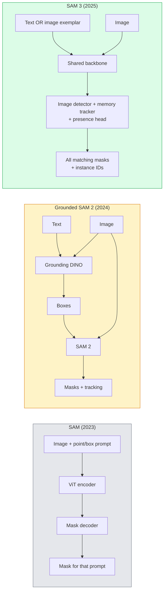

# SAM 3 e Segmentação de Vocabulário Aberto

> Dê um modelo um texto e uma imagem e obtenha máscaras para cada objeto correspondente.

**Type:** Use + Build
**Languages:** Python
**Prerequisites:** Phase 4 Lesson 07 (U-Net), Phase 4 Lesson 08 (Mask R-CNN), Phase 4 Lesson 18 (CLIP)
**Time:** ~60 minutes

## Objetivos de aprendizagem

- Distinguir SAM (apenas de instruções visuais), SAM / SAM 2 (detector + SAM) e SAM 3 (indicações de texto nativo através de Segmentação de conceitos Promptable)
- Explicar a arquitetura SAM 3: espinha dorsal compartilhada + detector de imagem + rastreador de vídeo baseado em memória + cabeça de presença + design de detector- rastreador descoplado
- Usar um abraço facial `transformers`Integração SAM 3 para detecção, segmentação e rastreamento de vídeo por texto
- Escolha entre SAM 3, SAM Grounded 2, YOLO-World e SAM-MI com base na latência, complexidade do conceito e alvo de implantação

## O problema

O SAM 2023 era um modelo de visual-impressão apenas: você clica em um ponto ou desenha uma caixa e ele retorna uma máscara. Para "dar-me todas as laranjas nesta foto" você precisava de um detector (Grounding DINO) para produzir caixas, então SAM para segmentar cada uma. SAM baseado transformou isso em um pipeline, mas era uma cascata de dois modelos congelados com acumulação inevitável de erros.

SAM 3 (Meta, Nov. 2025, ICLR 2026) desmoronou a cascata. Aceita uma frase substantiva curta ou um exemplar de imagem como prompt e retorna todas as máscaras e IDs de instância correspondentes em uma única passagem para a frente.**Promptable Concept Segmentation (PCS)**Combinado com a atualização Object Multiplex de março de 2026 (SAM 3.1), ele rastreia várias instâncias do mesmo conceito através de vídeo de forma eficiente.

Esta lição trata da mudança estrutural que esta representa. Seg 2D, detecção e aterragem de imagem de texto se fundiram em um modelo. A questão de produção não é mais "qual pipeline eu acorrento juntos" mas "qual modelo promptable lida com meu caso de uso de ponta a ponta".

## O conceito

### As três gerações



### Segmentação de conceitos prontável

Um "concept prompt" é uma frase substantiva curta (`"yellow school bus"`- Não .`"striped red umbrella"`- Não .`"hand holding a mug"`O modelo retorna máscaras de segmentação para cada instância da imagem que corresponde ao conceito, mais um ID de instância único por correspondência.

Isto difere do SAM visual-prompto clássico em três maneiras:

1. Não é necessário solicitar por instância  um pedido de texto retorna todas as correspondências.
2. O conceito de vocabulário aberto pode ser qualquer coisa descrevida na linguagem natural.
3. Retorna várias instâncias ao mesmo tempo em vez de uma máscara por pedido.

### Peças-chave de arquitetura

- **Shared backbone** um único ViT processa a imagem. Tanto a cabeça do detector quanto o rastreador baseado em memória lê-lo.
- **Presence head** prevê se o conceito está presente na imagem. Decouples "este aqui?" de "onde é?". Reduz falsos positivos sobre conceitos ausentes.
- **Decoupled detector-tracker** A detecção a nível de imagem e o rastreamento a nível de vídeo têm cabeças separadas para que não interfiram.
- **Memory bank** armazenar recursos por instância em quadros para rastreamento de vídeo (mesmo mecanismo SAM 2 usado).

### Formação em escala

O SAM 3 foi treinado em**4 million unique concepts**O novo sistema de análise de dados é gerado por um motor de dados que, de forma iterativa, anota e corrige usando IA + revisão humana.**SA-CO benchmark**O SAM 3 alcança 75-80% do desempenho humano no SA-CO e duplica os sistemas existentes no PCS de imagem + vídeo.

### SAM 3.1 Objeto Multiplex

Atualização de março de 2026: **Object Multiplex**Introduz um mecanismo de memória compartilhada para rastreamento conjunto de muitas instâncias do mesmo conceito de uma só vez. Anteriormente, rastrear N instâncias significava N bancos de memória separados. Multiplex colapsou que em uma memória compartilhada com consultas por instância. Resultado: rastreamento multi-objeto substancialmente mais rápido sem sacrificar precisão.

### Onde a SAM no solo ainda é importante em 2026

- Quando precisar de um detector específico de vocabulário aberto substituído (DINO-X, Florence-2).
- Quando a licença SAM 3 (guardada em HF) é um bloqueador.
- Quando precisam de mais controlo sobre o limiar do detector do que o SAM 3 expõe.
- Para trabalhos de investigação/ablação no componente do detector.

Para a maioria dos trabalhos de produção, o SAM 3 é a resposta mais simples.

### YOLO-World vs SAM 3

- **YOLO-World** Detector de vocabulário aberto apenas (sem máscaras). em tempo real. Melhor quando você precisa de caixas em alta fps.
- **SAM 3** Segmentação completa + rastreamento.

Divisão de produção: YOLO-World para oleodutos de detecção rápida (navegação robótica, painéis de controle rápidos), SAM 3 para qualquer coisa que precise de máscaras ou rastreamento.

### Eficiência SAM-MI

SAM-MI (2025-2026) aborda o gargalho de engarrafamento do decodificador SAM.

- **Sparse point prompting** utiliza alguns pontos bem escolhidos em vez de pedidos densos; reduz as chamadas de decodificador em 96%.
- **Shallow mask aggregation** combina as previsões de máscaras ásperas numa máscara mais nítida.
- **Decoupled mask injection** O decodificador recebe características pré-computadas de máscara em vez de voltar a funcionar.

Resultado: ~ 1,6x de aceleração em relação ao Grounded-SAM em referências de vocabulário aberto.

### Formatos de saída para os três modelos

Todos retornam a mesma estrutura geral (caixas + rótulos + pontuações + máscaras + IDs), o que é útil  o seu pipeline para baixo não tem que se ramificar no modelo executado.

```figure
cv3-open-vocab
```

## Construí-lo

### Passo 1: Construção rápida

Construir um auxiliar que transforma uma frase do usuário em uma lista de instruções de conceito SAM 3. Esta é a fronteira onde "o que o usuário digita" encontra "o que o modelo consome".

```python
def split_concepts(sentence):
    """
    Heuristic splitter for multi-concept prompts.
    Returns list of short noun phrases.
    """
    for sep in [",", ";", "and", "or", "&"]:
        if sep in sentence:
            parts = [p.strip() for p in sentence.replace("and ", ",").split(",")]
            return [p for p in parts if p]
    return [sentence.strip()]

print(split_concepts("cats, dogs and balloons"))
```

O SAM 3 aceita um conceito por passagem avançada; para consultas de conceitos múltiplos, enrolem-se ou enrolem-se.

### Passo 2: Auxiliares de pós-processamento

Transforma as saídas brutas do SAM 3 numa lista limpa de detecções que correspondem ao nosso contrato de oleoduto da LECÇÃO 16.

```python
from dataclasses import dataclass
from typing import List

@dataclass
class ConceptDetection:
    concept: str
    instance_id: int
    box: tuple          # (x1, y1, x2, y2)
    score: float
    mask_rle: str       # run-length encoded


def rle_encode(binary_mask):
    flat = binary_mask.flatten().astype("uint8")
    runs = []
    prev, count = flat[0], 0
    for v in flat:
        if v == prev:
            count += 1
        else:
            runs.append((int(prev), count))
            prev, count = v, 1
    runs.append((int(prev), count))
    return ";".join(f"{v}x{c}" for v, c in runs)
```

O RLE mantém as cargas úteis de resposta pequenas mesmo para muitas máscaras de alta resolução.

### Passo 3: Interface de segmentação de vocabulário aberto unificada

Envolva qualquer backend que você tenha (SAM 3, SAM Grounded 2, YOLO-World + SAM 2) atrás de um único método. Seu código downstream não muda quando o backend faz.

```python
from abc import ABC, abstractmethod
import numpy as np

class OpenVocabSeg(ABC):
    @abstractmethod
    def detect(self, image: np.ndarray, concept: str) -> List[ConceptDetection]:
        ...


class StubOpenVocabSeg(OpenVocabSeg):
    """
    Deterministic stub used for pipeline testing when real models are not loaded.
    """
    def detect(self, image, concept):
        h, w = image.shape[:2]
        return [
            ConceptDetection(
                concept=concept,
                instance_id=0,
                box=(w * 0.2, h * 0.3, w * 0.5, h * 0.8),
                score=0.89,
                mask_rle="0x100;1x50;0x200",
            ),
            ConceptDetection(
                concept=concept,
                instance_id=1,
                box=(w * 0.55, h * 0.25, w * 0.85, h * 0.75),
                score=0.74,
                mask_rle="0x80;1x40;0x220",
            ),
        ]
```

O verdadeiro .`SAM3OpenVocabSeg`Subclasse seria envolver `transformers.Sam3Model`E ...`Sam3Processor`- Não .

### Passo 4: Uso de SAM 3 em Abraços (referência)

Para o modelo real, o `transformers`integração:

```python
from transformers import Sam3Processor, Sam3Model
import torch

processor = Sam3Processor.from_pretrained("facebook/sam3")
model = Sam3Model.from_pretrained("facebook/sam3").eval()

inputs = processor(images=pil_image, return_tensors="pt")
inputs = processor.set_text_prompt(inputs, "yellow school bus")

with torch.no_grad():
    outputs = model(**inputs)

masks = processor.post_process_masks(
    outputs.masks, inputs.original_sizes, inputs.reshaped_input_sizes
)
boxes = outputs.boxes
scores = outputs.scores
```

Uma resposta, todos os fósforos voltaram numa única chamada.

### Passo 5: Messa o que o SAM 2 Grão lhe deu de graça

Um ponto de referência honesto: o que acontece quando substituímos o SAM 2 por SAM 3 num gasoduto real?

- Latência: SAM 3 salva uma passagem para a frente (sem detector separado), mas o modelo em si é mais pesado; geralmente neutro ou um ligeiro aceleramento.
- Precision: SAM 3 é substancialmente melhor em conceitos raros ou compostos ("paraguas vermelho e estriado").
- Flexibilidade: SAM 2 com base em terra permite trocar detectores (DINO-X, Florence-2, Grounding DINO 1.5); SAM 3 é monolitico.

Conclusão: SAM 3 é o padrão para 2026 seg de vocabulário aberto. SAM 2 baseado ainda é a resposta certa quando você precisa de flexibilidade de detector ou diferentes termos de licença.

## Usá-lo

Padrões de implantação da produção:

- **Real-time annotation** SAM 3 + CVAT's label-as-text-prompt feature. Anotadores selecionam um nome de etiqueta; SAM 3 pré-etiqueta cada instância correspondente. Revisão e correção.
- **Video analytics** SAM 3.1 Objeto Multiplex para rastreamento de objetos múltiplos; quadros de alimentação para o rastreador baseado em memória.
- **Robotics** SAM 3 para manipulação de vocabulário aberto ("colher o copo vermelho"); funciona como um plano primitivo.
- **Medical imaging** SAM 3 ajustado para conceitos médicos; requer pedido de acesso em HF.

O Ultralytics envolve o SAM 3 no seu pacote Python:

```python
from ultralytics import SAM

model = SAM("sam3.pt")
results = model(image_path, prompts="yellow school bus")
```

A mesma interface que a YOLO e a SAM 2.

## Envia-o

Esta lição produz:

- `outputs/prompt-open-vocab-stack-picker.md` um prompt que escolhe SAM 3 / Grounded SAM 2 / YOLO-World / SAM-MI com base na latência, complexidade do conceito e licenciamento.
- `outputs/skill-concept-prompt-designer.md` uma habilidade que transforma as declarações do utilizador em instruções conceituais bem formadas do SAM 3 (divisão, desambiguação, falbacks).

## Exercícios

1. **(Easy)**Exerça SAM 3 em 10 imagens com as instruções de conceito que escolher. Compare com SAM 2 + Grounding DINO 1.5 nas mesmas imagens. Relate quais conceitos cada modelo perdeu.
2. **(Medium)**Construir uma interface de interface "clique para incluir / clique para excluir" no topo do SAM 3: um prompt de texto retorna instâncias candidatas; cliques do usuário mantêm quais contam como positivos.
3. **(Hard)**Tune-se o SAM 3 num conjunto de conceitos personalizados (por exemplo, 5 tipos de componentes eletrônicos) com 20 imagens rotuladas cada uma. Compare com o SAM 3 de tiros zero no mesmo conjunto de ensaio; medir a melhoria da UIE da máscara.

## Termos-chave

| Term | What people say | What it actually means |
|------|----------------|----------------------|
| Open-vocabulary segmentation | "Segment by text" | Produce masks for objects described in natural language, not a fixed label set |
| PCS | "Promptable Concept Segmentation" | SAM 3's core task — given a noun-phrase or image exemplar, segment all matching instances |
| Concept prompt | "The text input" | Short noun phrase or image exemplar; not a full sentence |
| Presence head | "Is it here?" | SAM 3 module that decides whether the concept exists in the image before localisation |
| SA-CO | "SAM 3 benchmark" | 270K-concept open-vocabulary segmentation benchmark; 50x larger than prior open-vocab benchmarks |
| Object Multiplex | "SAM 3.1 update" | Shared-memory multi-object tracking; fast joint tracking of many instances |
| Grounded SAM 2 | "Modular pipeline" | Detector + SAM 2 cascade; still relevant when detector swap matters |
| SAM-MI | "Efficient SAM variant" | Mask Injection for 1.6x speedup over Grounded-SAM |

## Mais leitura

- [SAM 3: Segment Anything with Concepts (arXiv 2511.16719)](https://arxiv.org/abs/2511.16719)
- [SAM 3.1 Object Multiplex (Meta AI, March 2026)](https://ai.meta.com/blog/segment-anything-model-3/)
- [SAM 3 model page on Hugging Face](https://huggingface.co/facebook/sam3)
- [Grounded SAM 2 tutorial (PyImageSearch)](https://pyimagesearch.com/2026/01/19/grounded-sam-2-from-open-set-detection-to-segmentation-and-tracking/)
- [Ultralytics SAM 3 docs](https://docs.ultralytics.com/models/sam-3/)
- [SAM3-I: Instruction-aware SAM (arXiv 2512.04585)](https://arxiv.org/abs/2512.04585)
