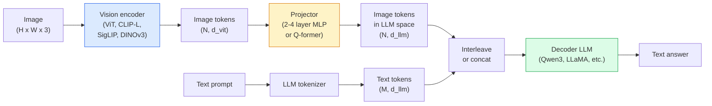

# Modelos de linguagem visual  O padrão ViT-MLP-LLM

> Um codificador de visão converte uma imagem em tokens. Um projetor MLP mapeia esses tokens no espaço de incorporação do LLM. Um modelo de linguagem faz o resto. Esse padrão  ViT-MLP-LLM  é cada VLM de produção em 2026.

**Type:** Learn + Use
**Languages:** Python
**Prerequisites:** Phase 4 Lesson 14 (ViT), Phase 4 Lesson 18 (CLIP), Phase 7 Lesson 02 (Self-Attention)
**Time:** ~75 minutes

## Objetivos de aprendizagem

- Descreva a arquitetura ViT-MLP-LLM e explique o que cada um dos três componentes contribui para a sua execução.
- Comparar Qwen3-VL, InternVL3.5, LLaVA-Next e GLM-4.6V em contagem de parâmetros, comprimento de contexto e desempenho de referência
- Explique DeepStack: por que as características de ViT de vários níveis apertam melhor o alinhamento da linguagem visual do que uma única característica de última camada
- Medir a alucinação VLM na produção com taxa de erro transmodal (CMER) e agir no sinal

## O problema

CLIP (Lessão de Fase 4 18) fornece um espaço de inserção compartilhado para imagens e texto, o que é suficiente para classificação e recuperação de tiros zero. Não pode responder "quantos carros vermelhos há nesta imagem?" porque CLIP não gera texto  ele apenas marca semelhanças.

Modelos de Língua de Visão (VLMs)  Qwen3-VL, InternVL3.5, LLaVA-Next, GLM-4.6V  parabolta um codificador de imagem da família CLIP para um modelo de linguagem completo. O modelo vê uma imagem mais uma pergunta e gera uma resposta. Em 2026 VLMs de código aberto rivalizar ou vencer GPT-5 e Gemini-2.5-Pro em benchmarks multimodal (MMMU, MMBench, DocVQA, ChartQA, MathVista, OSWorld).

O trio de peças (ViT, projector, LLM) é o padrão. As diferenças entre os modelos são em que ViT, que projector, que LLM, os dados de treinamento e a receita de alinhamento. Uma vez que você entende o padrão, trocar qualquer componente é mecânico.

## O conceito

### A arquitetura ViT-MLP-LLM



1. **Vision encoder** um ViT pré-treinado (CLIP-L/14, SigLIP, DINOv3 ou uma variante de sintonia fina).
2. **Projector** um pequeno módulo (2-4 camadas MLP, ou um Q-former) que mapeia os tokens de visão na dimensão de incorporação do LLM. É aqui que a maior parte do ajuste fino acontece.
3. **LLM** um modelo de linguagem apenas para decodificadores (Qwen3, Llama, Mistral, GLM, InternLM).

Em prática, o codificador de visão e o LLM permanecem principalmente congelados enquanto o projetor treina alguns bilhões de parâmetros de sinal a baixo custo.

### DeepStack

A projeção de vainilha usa apenas a última camada ViT. As amostras do DeepStack (Qwen3-VL) são feitas a partir de múltiplas profundidades ViT e as empilham. As camadas mais profundas carregam semântica de alto nível; as camadas mais rasas carregam informações espaciais e textuais de grãos finos. A alimentação de ambas na LLM fecha a lacuna entre "o que a imagem contém" (semântica) e "onde exatamente" (terrazamento espacial).

### Três fases de formação

Os modernos VLMs treinam em etapas:

1. **Alignment** congelar ViT e LLM. Treinar apenas o projetor em pares de imagem-capção. Ensinar o projetor a mapear o espaço de visão no espaço de linguagem.
2. **Pre-training**- Descongelar tudo. Treinar em grande escala dados de imagem-texto entrelaçados (pares de mais de 500 milhões). Construir o conhecimento visual do modelo.
3. **Instruction tuning** sintonização fina em triples curados (imagem, pergunta, resposta). Ensina o comportamento de conversação e formatos de tarefas.

A maioria dos ajustes finos do LoRA tem como objetivo a fase 3 com um conjunto de dados pequeno e rotulado.

### Comparador de famílias modelo (inicio de 2026)

| Model | Params | Vision encoder | LLM | Context | Strengths |
|-------|--------|----------------|-----|---------|-----------|
| Qwen3-VL-235B-A22B (MoE) | 235B (22B active) | custom ViT + DeepStack | Qwen3 | 256K | General SOTA, GUI agent |
| Qwen3-VL-30B-A3B (MoE) | 30B (3B active) | custom ViT + DeepStack | Qwen3 | 256K | Smaller MoE alternative |
| Qwen3-VL-8B (dense) | 8B | custom ViT | Qwen3 | 128K | Production dense default |
| InternVL3.5-38B | 38B | InternViT-6B | Qwen3 + GPT-OSS | 128K | Strong MMBench / MMVet |
| InternVL3.5-241B-A28B | 241B (28B active) | InternViT-6B | Qwen3 | 128K | Competitive with GPT-4o |
| LLaVA-Next 72B | 72B | SigLIP | Llama-3 | 32K | Open, easy to fine-tune |
| GLM-4.6V | ~70B | custom | GLM | 64K | Open-source, strong OCR |
| MiniCPM-V-2.6 | 8B | SigLIP | MiniCPM | 32K | Edge-friendly |

### Agentes visuais

Qwen3-VL-235B alcança o melhor desempenho global no OSWorld  um ponto de referência para **visual agents**O modelo vê uma captura de tela, entende a interface da pessoa e emite ações (clique, digite, rolem). Combinado com ferramentas, fecha o loop em tarefas comuns de desktop.

### Capacidades de agência + variantes de RoPE

Os VLMs precisam saber .**when**Qwen3-VL evoluiu de T-RoPE (embedings de posição rotativa temporal) para **text-based time alignment** marcas de texto de timestamp explícito interligados com quadros de vídeo. O modelo vê "`<timestamp 00:32>`"Quando o tempo está a chegar, é preciso que o tempo esteja a chegar.

### O problema do alinhamento

12% dos pares de imagem-texto em um conjunto de dados rastreado contêm descrições não totalmente fundamentadas na imagem. Um VLM treinado nisso aprende silenciosamente a alucinar  fabricar objetos, ler números erroneamente, inventar relações.

A Skywork.ai introduziu o **Cross-Modal Error Rate (CMER)**para rastreá-lo:

```
CMER = fraction of outputs where the text confidence is high but the image-text similarity (via a CLIP-family checker) is low
```

CMER alto significa que o modelo está dizendo com confiança coisas não baseadas na imagem. Monitorar o CMER e tratá-lo como um KPI de produção reduz a taxa de alucinação em ~ 35% em sua implantação. O truque não é "fixar o modelo" mas "routear as saídas de CMER alta para revisão humana".

### Ajuste fino com LoRA / QLoRA

A configuração completa de um VLM 70B está fora do alcance da maioria das equipes. LoRA (ranqueado 16-64) em camadas de atenção + projetor, ou QLoRA com pesos de base de 4 bits, cabe em um único A100 / H100. Custo: 5.000-50.000 exemplos, $100-$5.000 em computação, 2 a 10 horas de treinamento.

### O raciocínio espacial ainda é fraco

Os VLMs atuais pontuação 50-60% em pontos de referência de raciocínio espacial (acima-abaixo, esquerda-direita, contagem, distância). Se o seu caso de uso depende de "qual objeto está em cima de que", validar fortemente  desempenho genérico VLM é inferior ao humano. Melhor do que VLM alternativas para tarefas espaciais puras: um estimador de pontos-chave especializado / pose, um modelo de profundidade, ou um modelo de detecção com geometria de caixa pós-processado.

```figure
v4-vlm-projector
```

## Construí-lo

### Passo 1: O projector

A parte que treinarás mais frequentemente. 2-4 camadas de MLP com GELU.

```python
import torch
import torch.nn as nn


class Projector(nn.Module):
    def __init__(self, vit_dim=768, llm_dim=4096, hidden=4096):
        super().__init__()
        self.net = nn.Sequential(
            nn.Linear(vit_dim, hidden),
            nn.GELU(),
            nn.Linear(hidden, llm_dim),
        )

    def forward(self, x):
        return self.net(x)
```

A entrada é um `(N_patches, d_vit)`Tensor simbólico.`(N_patches, d_llm)`O LLM trata cada linha de saída como apenas outro token.

### Passo 2: Assembleia de ponta a ponta do ViT-MLP-LLM

Esqueleto da passagem avançada para um mínimo VLM.`transformers`Esta é a concepção.

```python
class MinimalVLM(nn.Module):
    def __init__(self, vit, projector, llm, image_token_id):
        super().__init__()
        self.vit = vit
        self.projector = projector
        self.llm = llm
        self.image_token_id = image_token_id  # placeholder token in text prompt

    def forward(self, image, input_ids, attention_mask):
        # 1. vision features
        vision_tokens = self.vit(image)                     # (B, N_patches, d_vit)
        vision_embeds = self.projector(vision_tokens)       # (B, N_patches, d_llm)

        # 2. text embeddings
        text_embeds = self.llm.get_input_embeddings()(input_ids)  # (B, M, d_llm)

        # 3. replace image placeholder tokens with vision embeds
        merged = self._merge(text_embeds, vision_embeds, input_ids)

        # 4. run LLM
        return self.llm(inputs_embeds=merged, attention_mask=attention_mask)

    def _merge(self, text_embeds, vision_embeds, input_ids):
        out = text_embeds.clone()
        expected = vision_embeds.size(1)
        for b in range(input_ids.size(0)):
            positions = (input_ids[b] == self.image_token_id).nonzero(as_tuple=True)[0]
            if len(positions) != expected:
                raise ValueError(
                    f"batch item {b} has {len(positions)} image tokens but vision_embeds has {expected} patches."
                    " Every sample in the batch must be pre-padded to the same number of image placeholder tokens.")
            out[b, positions] = vision_embeds[b]
        return out
```

O `<image>`O token de placeholder no texto é substituído por imagens reais embutidas  o mesmo padrão LLaVA, Qwen-VL e InternVL uso.

### Passo 3: Computação CMER

Um teste de tempo de execução leve.

```python
import torch.nn.functional as F


def cross_modal_error_rate(image_emb, text_emb, text_confidence, sim_threshold=0.25, conf_threshold=0.8):
    """
    image_emb, text_emb: embeddings of image and generated text (normalised internally)
    text_confidence:     mean per-token probability in [0, 1]
    Returns:             fraction of high-confidence outputs with low image-text alignment
    """
    image_emb = F.normalize(image_emb, dim=-1)
    text_emb = F.normalize(text_emb, dim=-1)
    sim = (image_emb * text_emb).sum(dim=-1)        # cosine similarity
    high_conf_low_sim = (text_confidence > conf_threshold) & (sim < sim_threshold)
    return high_conf_low_sim.float().mean().item()
```

Tratar o CMER como um KPI de produção. Monitorá-lo por ponto final, por tipo de prompt, por cliente.

### Passo 4: Classificador VLM de brinquedos (executável)

Demonstrem os trens de projector. "Fonte ViT" falsas entram; um pequeno token de estilo LLM prevê uma aula.

```python
class ToyVLM(nn.Module):
    def __init__(self, vit_dim=32, llm_dim=64, num_classes=5):
        super().__init__()
        self.projector = Projector(vit_dim, llm_dim, hidden=64)
        self.head = nn.Linear(llm_dim, num_classes)

    def forward(self, vision_tokens):
        projected = self.projector(vision_tokens)
        pooled = projected.mean(dim=1)
        return self.head(pooled)
```

Pode-se colocar isto em pares sintéticos (função, classe) em menos de 200 passos  o suficiente para mostrar o padrão do projetor funciona.

## Usá-lo

Três maneiras pelas quais as equipes de produção utilizam os VLM em 2026:

- **Hosted API**OpenAI Vision, Claude Vision, Google Gemini Vision, zero infra, risco de fornecedor.
- **Open-source self-host** Qwen3-VL ou InternVL3.5 via `transformers`E ...`vllm`Controle total, maior esforço inicial.
- **Fine-tune on domain** carga Qwen2.5-VL-7B ou LLaVA-1.6-7B, LoRA em 5k-50k exemplos personalizados, servir com `vllm`ou `TGI`- Não .

```python
from transformers import AutoProcessor, AutoModelForVision2Seq
import torch
from PIL import Image

model_id = "Qwen/Qwen3-VL-8B-Instruct"
processor = AutoProcessor.from_pretrained(model_id)
model = AutoModelForVision2Seq.from_pretrained(model_id, torch_dtype=torch.bfloat16, device_map="auto")

messages = [{
    "role": "user",
    "content": [
        {"type": "image", "image": Image.open("plot.png")},
        {"type": "text", "text": "What does this chart show?"},
    ],
}]
inputs = processor.apply_chat_template(messages, add_generation_prompt=True, tokenize=True, return_dict=True, return_tensors="pt").to("cuda")
generated = model.generate(**inputs, max_new_tokens=256)
answer = processor.decode(generated[0][inputs["input_ids"].shape[1]:], skip_special_tokens=True)
```

`apply_chat_template`Esconde o`<image>`Tokenização de posicionamento; o modelo lida com a fusão internamente.

## Envia-o

Esta lição produz:

- `outputs/prompt-vlm-selector.md` escolhe Qwen3-VL / InternVL3.5 / LLaVA-Next / API dada precisão, latência, comprimento de contexto e orçamento.
- `outputs/skill-cmer-monitor.md` emite o código para instrumentar um ponto final de produção VLM com taxa de erro transmodal, painéis de controlo por ponto final e limiares de alerta.

## Exercícios

1. **(Easy)**Execute três pedidos ("o que é isso?", "contar os objetos", "descrever a cena") através de qualquer VLM aberto em cinco imagens.
2. **(Medium)**Tune-se em arquivos Qwen2.5-VL-3B ou LLaVA-1.6-7B com LoRA (ranque 16) em 500 imagens de um domínio-alvo com legendas.
3. **(Hard)**Substitua o codificador de imagem do VLM por DINOv3 em vez do SigLIP/CLIP padrão. Re-treine apenas o projetor (LLM congelado + DINOv3 congelado).

## Termos-chave

| Term | What people say | What it actually means |
|------|----------------|----------------------|
| ViT-MLP-LLM | "The VLM pattern" | Vision encoder + projector + language model; every 2026 VLM |
| Projector | "The bridge" | 2-4 layer MLP (or Q-former) that maps vision tokens into LLM embedding space |
| DeepStack | "Qwen3-VL feature trick" | Multi-level ViT features stacked rather than last-layer only |
| Image token | "<image> placeholder" | Special token in the text stream replaced by projected vision embeddings |
| CMER | "Hallucination KPI" | Cross-Modal Error Rate; high when text confidence is high but image-text similarity is low |
| Visual agent | "VLM that clicks" | VLM operating GUIs (OSWorld, mobile, web) with tool calls |
| Q-former | "Fixed-count token bridge" | BLIP-2 style projector producing a fixed number of visual query tokens |
| Alignment / pre-training / instruction tuning | "Three stages" | Standard VLM training pipeline |

## Mais leitura

- [Qwen3-VL Technical Report (arXiv 2511.21631)](https://arxiv.org/abs/2511.21631)
- [InternVL3.5 Advancing Open-Source Multimodal Models (arXiv 2508.18265)](https://arxiv.org/html/2508.18265v1)
- [LLaVA-Next series](https://llava-vl.github.io/blog/2024-05-10-llava-next-stronger-llms/)
- [BentoML: Best Open-Source VLMs 2026](https://www.bentoml.com/blog/multimodal-ai-a-guide-to-open-source-vision-language-models)
- [MMMU: Multi-discipline Multimodal Understanding benchmark](https://mmmu-benchmark.github.io/)
- [VLMs in manufacturing (Robotics Tomorrow, March 2026)](https://www.roboticstomorrow.com/story/2026/03/when-machines-learn-to-see-like-experts-the-rise-of-vision-language-models-in-manufacturing/26335/)
