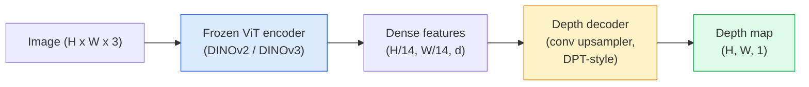

# Profundidade monocular e estimativa geométrica

> Um mapa de profundidade é uma imagem de um único canal onde cada pixel é uma distância da câmera. Predizê-lo a partir de um quadro RGB era impossível sem estereótipo ou LiDAR. Em 2026 um codificador ViT congelado mais uma cabeça leve fica dentro de algumas por cento da verdade do solo.

**Type:** Build + Use
**Languages:** Python
**Prerequisites:** Phase 4 Lesson 14 (ViT), Phase 4 Lesson 17 (Self-Supervised Vision), Phase 4 Lesson 07 (U-Net)
**Time:** ~60 minutes

## Objetivos de aprendizagem

- Distinguir a profundidade relativa e a profundidade métrica e o estado que cada modelo de produção (MiDaS, Marigold, Depth Anything V3, ZoeDepth) resolve
- Use Depth Anything V3 (DINOv2 spine) para prever profundidade para imagens individuais arbitrárias sem calibração
- Explique por que a profundidade monocular funciona a partir de uma única imagem (sinos de perspectiva, gradientes de textura, antecedentes aprendidos) e o que não pode recuperar (escala absoluta, geometria oculta)
- Elevação das detecções 2D para pontos 3D utilizando um mapa de profundidade e as características intrínsecas da câmera de buracos de pinheiros

## O problema

A profundidade é o eixo faltante na visão computacional 2D. Dada a RGB, você sabe onde as coisas aparecem no plano da imagem; você não sabe quão longe elas estão. Sensores de profundidade (stereo rigs, LiDAR, tempo de voo) resolvem isso diretamente, mas são caros, frágeis e limitados em alcance.

Estimação de profundidade monocular  prevendo profundidade a partir de um único quadro RGB  usado para produzir saída borrosa e não confiável. Em 2026 grandes codificadores pré-treinados mudaram isso: Depth Anything V3 usa uma espinha dorsal DINOv2 congelada e produz mapas de profundidade que se generalizam em domínios interiores, exteriores, médicos e satélites. Marigold reformula a profundidade como um problema de difusão condicional. ZoeDepth regredir distâncias métricas verdadeiras.

A profundidade é também a ponte entre a detecção 2D e a compreensão 3D: multiplicar os pixels de uma caixa detectada pela profundidade e você levanta o objeto 2D em uma nuvem de pontos 3D. Esse é o núcleo de todo sistema de oclusão AR, todo pipeline de prevenção de obstáculos e todo robô "colher o copo".

## O conceito

### Profundeza relativa vs. métrica

- **Relative depth**- Encomendado .`z`"O pixel A é mais próximo do que o pixel B, mas a relação de distâncias não está ancorada a metros".
- **Metric depth** distância absoluta em metros da câmera. Requer que o modelo tenha aprendido a relação estatística entre as indicações da imagem e a distância real.

O MiDaS e o Depth Anything V3 produzem profundidade relativa. O Marigold produz profundidade relativa. ZoeDepth, UniDepth e Metric3D produz profundidade métrica. Os modelos métricos são sensíveis à intrínseca da câmera; os modelos relativos não são.

### O padrão de codificação e decodificação



A profundidade de qualquer coisa V3 congela o codificador e treina apenas o decodificador de estilo DPT. O codificador fornece recursos ricos; o decodificador os interpola de volta à resolução da imagem e regresa profundidade.

### Por que uma única imagem produz profundidade em tudo

Uma imagem 2D contém muitas dicas monoculares que se correlacionam com a profundidade:

- **Perspective** Linhas paralelas em 3D convergem em 2D.
- **Texture gradient** as superfícies distantes têm uma textura menor e mais densa.
- **Occlusion order** Os objetos mais próximos ocluem os mais distantes.
- **Size constancy**Os objetos conhecidos (carros, humanos) fornecem uma escala aproximada.
- **Atmospheric perspective** objetos distantes aparecem mais nebulosos e mais azuis em cenas ao ar livre.

Uma ViT treinada em bilhões de imagens internaliza essas pistas. Com dados suficientes e uma espinha dorsal forte, a profundidade monocular atinge uma precisão razoável sem qualquer supervisão 3D explícita.

### O que a profundidade monocular não pode fazer

- **Absolute metric scale**A rede pode prever "a taça está duas vezes mais longe do que a colher" sem saber se a taça está a 1 m ou a 10 m de distância.
- **Occluded geometry** a parte de trás de uma cadeira é invisível e não pode ser deduzida de forma confiável.
- **Truly untextured / reflective surfaces**A rede informa de profundidade plausível mas errada.

### Profundidade Qualquer coisa V3 em 2026

- Vanilla DINOv2 ViT-L/14 como codificador (congelado).
- Descódigo DPT.
- Fornecido em pares de imagens colocadas de diversas fontes (não é necessária supervisão explícita de profundidade além da consistência fotométrica).
- Prevê geometria consistente espacialmente de **an arbitrary number of visual inputs, with or without known camera poses**- Não .
- SOTA em profundidade monocular, geometria de qualquer visão, renderização visual, estimativa de posição da câmera.

Este é o modelo de entrada para chamar quando precisar de profundidade em 2026.

### Marigold  difusão para profundidade

Marigold (Ke et al., CVPR 2024) reformula a estimativa de profundidade como difusão condicional de imagem para imagem. Condicionamento: RGB. Alvo: mapa de profundidade. Utiliza um U-Net de difusão estável 2 pré-treinado como espinha dorsal. Mapas de profundidade de saída são excepcionalmente nítidas nos limites dos objetos. Trade-off: inferência mais lenta do que modelos de feed-forward (10-50 passos denonçando).

### Intrínsecas e câmera de buracos de pinheiros

Para levantar um pixel `(u, v)`com profundidade`d`para um ponto 3D `(X, Y, Z)`em coordenadas de câmera:

```
fx, fy, cx, cy = camera intrinsics
X = (u - cx) * d / fx
Y = (v - cy) * d / fy
Z = d
```

Intrínseca vem de metadados EXIF, um padrão de calibração ou um estimador intrínseco monocular (Perspective Fields, UniDepth). Sem intrínseca, você ainda pode render uma nuvem de pontos assumindo um princípio de 60 a 70 ° FOV e resolução moderada  utilizável para visualização, não para medição.

### Avaliação

Dois métricas padrão:

- **AbsRel**(erro relativo absoluto): `mean(|d_pred - d_gt| / d_gt)`- Baixo é melhor. 0,05-0,1 para modelos de produção.
- **delta < 1.25**(precisão do limiar): fração de pixels onde `max(d_pred/d_gt, d_gt/d_pred) < 1.25`Mais alto é melhor. 0,9+ para SOTA.

Para a profundidade relativa (Depth Anything V3, MiDaS), a avaliação usa versões invariantes de escala e mudança de ambas as métricas.

```figure
depth-sweep
```

## Construí-lo

### Passo 1: Metricas de profundidade

```python
import torch

def abs_rel_error(pred, target, mask=None):
    if mask is not None:
        pred = pred[mask]
        target = target[mask]
    return (torch.abs(pred - target) / target.clamp(min=1e-6)).mean().item()


def delta_accuracy(pred, target, threshold=1.25, mask=None):
    if mask is not None:
        pred = pred[mask]
        target = target[mask]
    ratio = torch.maximum(pred / target.clamp(min=1e-6), target / pred.clamp(min=1e-6))
    return (ratio < threshold).float().mean().item()
```

Sempre mascarar os pixels de profundidade inválidos (zero, NaN, saturados) antes da avaliação.

### Passo 2: Alinhamento de escala e de mudança

Para modelos de profundidade relativa, alinhe a previsão com a verdade fundamental antes de calcular métricas.`a * pred + b = target`- Não .

```python
def align_scale_shift(pred, target, mask=None):
    if mask is not None:
        p = pred[mask]
        t = target[mask]
    else:
        p = pred.flatten()
        t = target.flatten()
    A = torch.stack([p, torch.ones_like(p)], dim=1)
    coeffs, *_ = torch.linalg.lstsq(A, t.unsqueeze(-1))
    a, b = coeffs[:2, 0]
    return a * pred + b
```

Corra .`align_scale_shift`Antes de`abs_rel_error`Quando avaliar MiDaS/ Depth Anything.

### Passo 3: Levante a profundidade para uma nuvem pontual

```python
import numpy as np

def depth_to_point_cloud(depth, intrinsics):
    H, W = depth.shape
    fx, fy, cx, cy = intrinsics
    v, u = np.meshgrid(np.arange(H), np.arange(W), indexing="ij")
    z = depth
    x = (u - cx) * z / fx
    y = (v - cy) * z / fy
    return np.stack([x, y, z], axis=-1)


depth = np.random.uniform(0.5, 4.0, (240, 320))
intr = (320.0, 320.0, 160.0, 120.0)
pc = depth_to_point_cloud(depth, intr)
print(f"point cloud shape: {pc.shape}  (H, W, 3)")
```

Uma função, cada aplicação 3D-lifted. Exportar a nuvem ponto para `.ply`e aberta em MeshLab ou CloudCompare.

### Passo 4: Teste de fumaça com uma cena de profundidade sintética

```python
def synthetic_depth(size=96):
    yy, xx = np.meshgrid(np.arange(size), np.arange(size), indexing="ij")
    # Floor: linear gradient from near (top) to far (bottom)
    depth = 1.0 + (yy / size) * 4.0
    # Box in the middle: closer
    mask = (np.abs(xx - size / 2) < size / 6) & (np.abs(yy - size * 0.6) < size / 6)
    depth[mask] = 2.0
    return depth.astype(np.float32)


gt = torch.from_numpy(synthetic_depth(96))
pred = gt + 0.3 * torch.randn_like(gt)  # simulated prediction
aligned = align_scale_shift(pred, gt)
print(f"before align  absRel = {abs_rel_error(pred, gt):.3f}")
print(f"after align   absRel = {abs_rel_error(aligned, gt):.3f}")
```

### Passo 5: Profundidade Qualquer coisa V3 uso (referência)

```python
import torch
from transformers import pipeline
from PIL import Image

pipe = pipeline(task="depth-estimation", model="LiheYoung/depth-anything-v2-large")

image = Image.open("street.jpg").convert("RGB")
out = pipe(image)
depth_np = np.array(out["depth"])
```

Três linhas.`out["depth"]`é uma escala de cinza PIL; converter em numpy para matemática. Para Depth Anything V3 especificamente, troque o modelo id uma vez publicado; a API é inalterada.

## Usá-lo

- **Depth Anything V3**(Meta AI / ByteDance, 2024-2026)  o padrão para a profundidade relativa.
- **Marigold**(ETH, 2024)  Alta qualidade visual, inferência lenta.
- **UniDepth**(ETH, 2024)  profundidade métrica com estimativa intrínseca da câmera.
- **ZoeDepth**(Intel, 2023)  profundidade métrica; mais velha, ainda confiável.
- **MiDaS v3.1** legalidade, mas estável; boa base para comparação.

Padrão típico de integração:

1. O quadro RGB chega.
2. O modelo de profundidade produz um mapa de profundidade.
3. O detector produz caixas.
4. Levante os centroides da caixa através da profundidade para 3D; funda-se com a nuvem de pontos, se disponível.
5. Downstream: oclusão de AR, planejamento de caminho, estimativa do tamanho do objeto, substituição de estéreo.

Para uso em tempo real, a Depth Anything V2 Small (INT8 quantizada) acelera ~ 30 fps em uma GPU de consumo em 518x518.

## Envia-o

Esta lição produz:

- `outputs/prompt-depth-model-picker.md` escolha entre Depth Anything V3, Marigold, UniDepth, MiDaS dada latência, necessidade métrica versus relativa e tipo de cena.
- `outputs/skill-depth-to-pointcloud.md` uma habilidade que constrói nuvens de ponto a partir de mapas de profundidade com manejo e exportação de elementos intrínsecos corretos para `.ply`- Não .

## Exercícios

1. **(Easy)**Exerça a profundidade de qualquer coisa V2 em qualquer 10 imagens da sua mesa. Salve a profundidade como PNGs em escala cinzenta e inspecione. Identifique um objeto cuja profundidade prevista parece errada e explique por que as pistas monoculares falharam.
2. **(Medium)**Dado RGB + profundidade de Depth Anything V2, eleva-se para uma nuvem de ponto e renderize com `open3d`. Comparar duas cenas (interior / exterior) e notar que parece mais credível.
3. **(Hard)**Tome cinco pares de imagens que diferem apenas pela posição de um objeto conhecido (por exemplo, garrafa movida 30 cm mais perto). Use UniDepth para prever a profundidade métrica em ambos.

## Termos-chave

| Term | What people say | What it actually means |
|------|----------------|----------------------|
| Monocular depth | "Single-image depth" | Depth estimation from one RGB frame, no stereo or LiDAR |
| Relative depth | "Ordered depth" | Ordered z-values without real-world units |
| Metric depth | "Absolute distance" | Depth in metres; requires calibration or a model trained with metric supervision |
| AbsRel | "Absolute relative error" | Mean of |d_pred - d_gt| / d_gt; standard depth metric |
| Delta accuracy | "delta < 1.25" | Fraction of pixels with prediction within 25% of ground truth |
| Pinhole camera | "fx, fy, cx, cy" | The camera model used to lift (u, v, d) to (X, Y, Z) |
| DPT | "Dense Prediction Transformer" | The conv-based decoder used on top of frozen ViT encoders for depth |
| DINOv2 backbone | "The reason it works" | Self-supervised features that generalise across domains without depth labels |

## Mais leitura

- [Depth Anything V3 paper page](https://depth-anything.github.io/) Profundidade monocular SOTA com codificador DINOv2
- [Marigold (Ke et al., CVPR 2024)](https://marigoldmonodepth.github.io/) Estimação de profundidade baseada na difusão
- [UniDepth (Piccinelli et al., 2024)](https://arxiv.org/abs/2403.18913) profundidade métrica com intrínsecas
- [MiDaS v3.1 (Intel ISL)](https://github.com/isl-org/MiDaS) a linha de base de profundidade relativa canónica
- [DINOv3 blog post (Meta)](https://ai.meta.com/blog/dinov3-self-supervised-vision-model/) a família de codificadores que aumenta a precisão de profundidade
