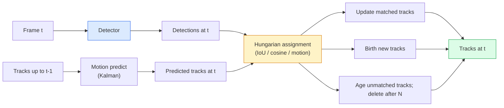

# Monitorização de vários objetos e memória de vídeo

> Detectar cada quadro, combinar as detecções deste quadro com as pistas do último quadro por identificação.

**Type:** Build
**Languages:** Python
**Prerequisites:** Phase 4 Lesson 06 (YOLO Detection), Phase 4 Lesson 08 (Mask R-CNN), Phase 4 Lesson 24 (SAM 3)
**Time:** ~60 minutes

## Objetivos de aprendizagem

- Distinguir o rastreamento por detecção do rastreamento baseado em consulta e nomear as famílias de algoritmos (SORT, DeepSORT, ByteTrack, BoT-SORT, SAM 2 tracker de memória, SAM 3.1 Object Multiplex)
- Implementar a missão IoU + Hungria desde zero para o rastreamento por detecção clássico
- Explique o banco de memória do SAM 2 e por que trata melhor a oclusão do que a associação baseada em IoU
- Leia as três métricas de rastreamento (MOTA, IDF1, HOTA) e escolha qual delas é importante para um determinado caso de uso

## O problema

Um detector diz-lhe onde os objetos estão num único quadro.`t`é o mesmo objeto que uma detecção em quadro `t-1`Sem isso, não se pode contar objetos que atravessam uma linha, seguir uma bola através de uma oclusão, ou saber "o carro #4 está na faixa há 8 segundos".

O rastreamento é essencial para todos os produtos que se encontram em vias de vídeo: análise esportiva, vigilância, condução autônoma, análise de vídeo médico, monitoramento da vida selvagem, contagem de marcas. Os blocos de construção principais são compartilhados: um detector por quadro, um modelo de movimento (filtro Kalman ou algo mais rico), um passo de associação (algoritmo húngaro sobre IoU / cosino / características aprendidas) e um ciclo de vida da pista (nascimento, atualização, morte).

O ano 2026 trouxe dois novos padrões: **SAM 2 memory-based tracking**(factor-memory em vez de associação de modelo de movimento) e **SAM 3.1 Object Multiplex**Esta lição segue a pilha clássica primeiro, depois a abordagem baseada na memória.

## O conceito

### Seguimento por detecção



Cada rastreador que encontraremos em 2026 é uma variação deste ciclo.

- **SORT**(2016): Filtro Kalman + IoU húngaro. Modelo simples, rápido, sem aparência.
- **DeepSORT**(2017): SORT + um recurso de aparência baseado na CNN por faixa (embedding ReID).
- **ByteTrack**(2021): associa as detecções de baixa confiança como uma segunda fase; não são necessárias características de aparência, mas o melhor desempenho no MOT17.
- **BoT-SORT**(2022): Byte + compensação de movimento da câmera + ReID.
- **StrongSORT / OC-SORT**Descendentes de ByteTrack com melhor movimento e aparência.

### Filtro de Kalman num parágrafo

Um filtro Kalman mantém um estado por trilha .`(x, y, w, h, dx, dy, dw, dh)`com uma covariância.**predict**O estado usando um modelo de velocidade constante, então **update**A atualização confía mais na detecção quando a incerteza de previsão é alta. Isto dá trajetórias suaves e a capacidade de continuar uma pista através de uma oclusão curta (1-5 quadros).

Todos os rastreadores clássicos usam um filtro Kalman no passo de previsão de movimento.

### O algoritmo húngaro

Dado um `M x N`A partir da data de execução, a matriz de custos (tracks x detections), encontrar a atribuição individual que minimiza o custo total.`1 - IoU(track_bbox, detection_bbox)`O tempo de execução é O(((M+N) ^3); para M, N até ~1000 é rápido o suficiente em Python via `scipy.optimize.linear_sum_assignment`- Não .

### A ideia chave do ByteTrack

Os rastreadores padrão deixam de detectar detecções de baixa confiança (< 0, 5).**second-stage candidates**A partir de agora, a rede de dados da rede de dados da rede de dados da rede de dados da rede de dados da rede de dados da rede de dados da rede de dados da rede de dados da rede de dados da rede de dados da rede de dados da rede de dados da rede de dados da rede de dados da rede de dados da rede de dados da rede de dados da rede de dados da rede de dados da rede de dados da rede de dados da rede de dados da rede de dados da rede de dados da rede de dados da rede de dados da rede de dados da rede de dados da rede de dados da rede de dados da rede de dados da rede de dados da rede de dados da rede de dados da rede de dados da rede de dados da rede de dados da rede de dados da rede de dados da rede de dados da rede de dados da rede de dados da rede de dados da rede de dados da rede de dados da rede de dados da rede de dados da rede de dados da rede de dados da rede de dados da rede de dados da rede de dados da rede de dados da rede de dados da rede de dados da rede de dados de dados de dados de dados de dados de dados de dados de dados de dados de dados de dados de dados de dados de dados de dados de dados de dados de dados de dados de dados de dados de dados de dados de dados de dados de dados de dados de dados de dados de dados de dados de dados de dados de dados de dados de dados de dados de dados de dados de dados de dados de dados de dados de dados de dados de dados de dados de dados de dados de dados de dados de dados de dados de dados de dados de dados de dados de dados de dados de dados de dados de dados de dados de dados de dados de dados de dados de dados de dados de dados de dados de dados de dados de dados de dados de dados de dados de dados de dados de dados de dados de dados de dados de dados de dados de dados de dados de dados de dados de dados de dados de dados de dados de dados de dados de dados de dados de dados de dados de dados de dados de dados de dados de dados de dados de dados de dados de dados de dados de dados de dados de dados de dados de dados de dados de dados de dados de dados de dados de dados de dados de dados de dados de dados de dados de dados de dados de dados de dados de dados de dados de dados de dados de dados de dados de dados de dados de dados de dados de

### SAM 2 rastreamento baseado em memória

SAM 2 lida com vídeo mantendo um **memory bank**Em um quadro, um prompt (clique, caixa, texto) codifica a instância na memória. Em quadros subsequentes, a memória é atendida contra as características do novo quadro, e o decodificador produz uma máscara para a mesma instância no novo quadro.

Não há filtro Kalman, não há tarefa húngara, a associação está implícita na operação de atenção-memória.

Pros:
- Robusto para grandes oclusões (memória carrega identidade de instância em muitos quadros).
- Vocabulário aberto quando combinado com as instruções de texto do SAM 3.
- Funciona sem um modelo de movimento separado.

Cons:
- Mais lento do que o ByteTrack para rastrear muitos objetos.
- O banco de memória cresce; limita a janela de contexto.

### SAM 3.1 Objeto Multiplex

O rastreamento anterior SAM 2 / SAM 3 mantém um banco de memória separado por instância. Para 50 objetos, 50 bancos de memória. Object Multiplex (março 2026) os colapsou em uma memória compartilhada com **per-instance query tokens**- As escalas de custos sublineares em número de casos.

O Multiplex é o novo padrão para o seguimento da multidão em 2026: multidões de concertos, trabalhadores de armazém, interseções de trânsito.

### Três métricas a saber

- **MOTA (Multi-Object Tracking Accuracy)** 1 - (FN + FP + ID switches) / GT. Pesado por tipo de erro; uma única métrica que confunde falhas de detecção e associação.
- **IDF1 (ID F1)** média harmonica de precisão e recall de ID. Focaliza especificamente em como cada trilha de verdade de terra mantém a sua ID ao longo do tempo.
- **HOTA (Higher Order Tracking Accuracy)** se decompõe em precisão de detecção (DetA) e precisão de associação (AssA).

Para vigilância (quem é quem): IDF1 é o que você relata. Para análise esportiva (passos de contagem): HOTA. Para comparação acadêmica geral: HOTA.

```figure
cv3-track-assoc
```

## Construí-lo

### Passo 1: Matriz de custos baseada em UIO

```python
import numpy as np


def bbox_iou(a, b):
    """
    a, b: (N, 4) arrays of [x1, y1, x2, y2].
    Returns (N_a, N_b) IoU matrix.
    """
    ax1, ay1, ax2, ay2 = a[:, 0], a[:, 1], a[:, 2], a[:, 3]
    bx1, by1, bx2, by2 = b[:, 0], b[:, 1], b[:, 2], b[:, 3]
    inter_x1 = np.maximum(ax1[:, None], bx1[None, :])
    inter_y1 = np.maximum(ay1[:, None], by1[None, :])
    inter_x2 = np.minimum(ax2[:, None], bx2[None, :])
    inter_y2 = np.minimum(ay2[:, None], by2[None, :])
    inter = np.clip(inter_x2 - inter_x1, 0, None) * np.clip(inter_y2 - inter_y1, 0, None)
    area_a = (ax2 - ax1) * (ay2 - ay1)
    area_b = (bx2 - bx1) * (by2 - by1)
    union = area_a[:, None] + area_b[None, :] - inter
    return inter / np.clip(union, 1e-8, None)
```

### Passo 2: Tracker de estilo SORT mínimo

Calman constante-velocidade fixa omitido para brevidade  utilizamos uma associação simples IoU aqui; na produção a previsão Kalman é essencial.`sort`O pacote Python fornece a versão completa.

```python
from scipy.optimize import linear_sum_assignment


class Track:
    def __init__(self, tid, bbox, frame):
        self.id = tid
        self.bbox = bbox
        self.last_frame = frame
        self.hits = 1

    def update(self, bbox, frame):
        self.bbox = bbox
        self.last_frame = frame
        self.hits += 1


class SimpleTracker:
    def __init__(self, iou_threshold=0.3, max_age=5):
        self.tracks = []
        self.next_id = 1
        self.iou_threshold = iou_threshold
        self.max_age = max_age

    def step(self, detections, frame):
        if not self.tracks:
            for d in detections:
                self.tracks.append(Track(self.next_id, d, frame))
                self.next_id += 1
            return [(t.id, t.bbox) for t in self.tracks]

        track_boxes = np.array([t.bbox for t in self.tracks])
        det_boxes = np.array(detections) if len(detections) else np.empty((0, 4))

        iou = bbox_iou(track_boxes, det_boxes) if len(det_boxes) else np.zeros((len(track_boxes), 0))
        cost = 1 - iou
        cost[iou < self.iou_threshold] = 1e6

        matched_track = set()
        matched_det = set()
        if cost.size > 0:
            row, col = linear_sum_assignment(cost)
            for r, c in zip(row, col):
                if cost[r, c] < 1.0:
                    self.tracks[r].update(det_boxes[c], frame)
                    matched_track.add(r); matched_det.add(c)

        for i, d in enumerate(det_boxes):
            if i not in matched_det:
                self.tracks.append(Track(self.next_id, d, frame))
                self.next_id += 1

        self.tracks = [t for t in self.tracks if frame - t.last_frame <= self.max_age]
        return [(t.id, t.bbox) for t in self.tracks]
```

60 linhas. Tome detecções por quadro, retorna IDs de pista por quadro. Sistemas reais adicionam a previsão de Kalman, a re-match do segundo estágio do ByteTrack e recursos de aparência.

### Passo 3: Teste de trajetória sintética

```python
def synthetic_frames(num_frames=20, num_objects=3, H=240, W=320, seed=0):
    rng = np.random.default_rng(seed)
    starts = rng.uniform(20, 200, size=(num_objects, 2))
    velocities = rng.uniform(-5, 5, size=(num_objects, 2))
    frames = []
    for f in range(num_frames):
        dets = []
        for i in range(num_objects):
            cx, cy = starts[i] + f * velocities[i]
            dets.append([cx - 10, cy - 10, cx + 10, cy + 10])
        frames.append(dets)
    return frames


tracker = SimpleTracker()
for f, dets in enumerate(synthetic_frames()):
    tracks = tracker.step(dets, f)
```

Três objetos que se movem em linhas retas devem manter os seus identificadores em todos os 20 quadros.

### Passo 4: Metrica de interruptor de identificação

```python
def count_id_switches(tracks_per_frame, gt_per_frame):
    """
    tracks_per_frame:  list of list of (track_id, bbox)
    gt_per_frame:      list of list of (gt_id, bbox)
    Returns number of ID switches.
    """
    prev_assignment = {}
    switches = 0
    for tracks, gts in zip(tracks_per_frame, gt_per_frame):
        if not tracks or not gts:
            continue
        t_boxes = np.array([b for _, b in tracks])
        g_boxes = np.array([b for _, b in gts])
        iou = bbox_iou(g_boxes, t_boxes)
        for g_idx, (gt_id, _) in enumerate(gts):
            j = iou[g_idx].argmax()
            if iou[g_idx, j] > 0.5:
                t_id = tracks[j][0]
                if gt_id in prev_assignment and prev_assignment[gt_id] != t_id:
                    switches += 1
                prev_assignment[gt_id] = t_id
    return switches
```

Esta é uma métrica simplificada IDF1 adjacente: contar quantas vezes um objeto de verdade de terra muda sua identificação de pista prevista atribuída.`py-motmetrics`E ...`TrackEval`- Não .

## Usá-lo

Traqueadores de produção em 2026:

- `ultralytics` YOLOv8 + ByteTrack / BoT-SORT incorporado. `results = model.track(source, tracker="bytetrack.yaml")`- O padrão.
- `supervision`(Roboflow)  Envolvedores ByteTrack mais utilitários de anotação.
- SAM 2 / SAM 3.1  rastreamento baseado em memória via `processor.track()`- Não .
- Estaca personalizada: detector (YOLOv8 / RT-DETR) + `sort-tracker`- Não .`OC-SORT`- Não .`StrongSORT`- Não .

- A escolha:

- Pedestres / carros / caixas a 30+ fps: **ByteTrack with ultralytics**- Não .
- Muitas instâncias de uma classe numa multidão:**SAM 3.1 Object Multiplex**- Não .
- Oclusões pesadas com aparência identificável: **DeepSORT / StrongSORT**(Figurações de ReID).
- Esportes / interações complexas: **BoT-SORT**ou rastreadores aprendidos (MOTRv3).

## Envia-o

Esta lição produz:

- `outputs/prompt-tracker-picker.md` escolhe SORT / ByteTrack / BoT-SORT / SAM 2 / SAM 3.1 dado tipo de cena, padrões de oclusão e orçamento de latência.
- `outputs/skill-mot-evaluator.md` escreve um arnes completo de avaliação para MOTA / IDF1 / HOTA contra trilhas de verdade no solo.

## Exercícios

1. **(Easy)**Execute o rastreador sintético acima com 3, 10 e 30 objetos. Relate a contagem de interruptores de ID em cada caso. Identifique onde a associação simples apenas com IoU começa a falhar.
2. **(Medium)**Adicione um passo de previsão de Kalman de velocidade constante antes da associação. Mostre que as oclusões curtas (2-3 quadros) não causam mais interruptores de ID.
3. **(Hard)**Integrar o rastreador baseado em memória do SAM 2 (via `transformers`Execute o SimpleTracker e o SAM 2 em um clipe de 30 segundos de uma multidão e compare as contagens de interruptores de identificação, rotulado manualmente os identificadores de verdade para 5 pessoas salientes.

## Termos-chave

| Term | What people say | What it actually means |
|------|----------------|----------------------|
| Tracking-by-detection | "Detect then associate" | Per-frame detector + Hungarian assignment on IoU / appearance |
| Kalman filter | "Motion predict" | Linear dynamics + covariance for smooth track predictions and occlusion handling |
| Hungarian algorithm | "Optimal assignment" | Solves the minimum-cost bipartite matching problem; `scipy.optimize.linear_sum_assignment` |
| ByteTrack | "Low-confidence second pass" | Re-match unmatched tracks to low-confidence detections to recover short occlusions |
| DeepSORT | "SORT + appearance" | Adds a ReID feature for cross-frame matching; better for ID preservation |
| Memory bank | "SAM 2 trick" | Per-instance spatio-temporal features stored across frames; cross-attention replaces explicit association |
| Object Multiplex | "SAM 3.1 shared memory" | Single shared memory with per-instance queries for fast many-object tracking |
| HOTA | "Modern tracking metric" | Decomposes into detection and association accuracy; community standard |

## Mais leitura

- [SORT (Bewley et al., 2016)](https://arxiv.org/abs/1602.00763) o papel mínimo de rastreamento por detecção
- [DeepSORT (Wojke et al., 2017)](https://arxiv.org/abs/1703.07402) adiciona recurso de aparência
- [ByteTrack (Zhang et al., 2022)](https://arxiv.org/abs/2110.06864) Baixa confiança em segundo passo
- [BoT-SORT (Aharon et al., 2022)](https://arxiv.org/abs/2206.14651) Compensamento de movimento da câmera
- [HOTA (Luiten et al., 2020)](https://arxiv.org/abs/2009.07736) Metrica de rastreamento decomposta
- [SAM 2 video segmentation (Meta, 2024)](https://ai.meta.com/sam2/) Tracker baseado em memória
- [SAM 3.1 Object Multiplex (Meta, March 2026)](https://ai.meta.com/blog/segment-anything-model-3/)
