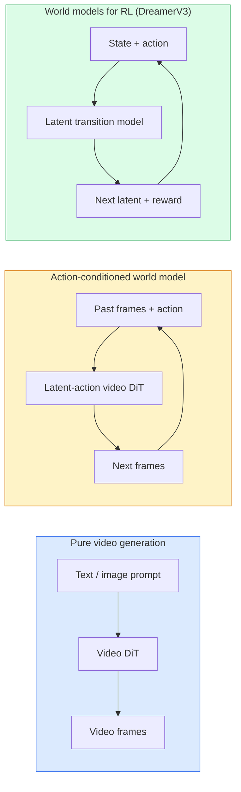

# Modelos mundiais e difusão de vídeos

> Um modelo de vídeo que prevê os próximos segundos de uma cena é um simulador de mundo, condição que previsão sobre ações e você tem um motor de jogo aprendido.

**Type:** Learn + Build
**Languages:** Python
**Prerequisites:** Phase 4 Lesson 10 (Diffusion), Phase 4 Lesson 12 (Video Understanding), Phase 4 Lesson 23 (DiT + Rectified Flow)
**Time:** ~75 minutes

## Objetivos de aprendizagem

- Explique a diferença entre um modelo de geração de vídeo puro (Sora 2) e um modelo de mundo com condição de ação (Genie 3, DreamerV3)
- Descreva um vídeo DiT: patches espaciotemporais, codificação de posição 3D, atenção conjunta em tokens (T, H, W)
- Rastrear como um modelo mundial se conecta à robótica: planos VLM → modelo de vídeo simula → dinâmica inversa emite ações
- Escolha entre Sora 2, Genie 3, Runway GWM-1 Worlds, Wan-Video e HunyuanVideo para um determinado caso de uso (vídeo criativo, sim interativo, síntese de condução autônoma)

## O problema

A geração de vídeo e a modelagem mundial convergem em 2026. Um modelo que pode gerar um minuto de vídeo coerente, tem, em certo sentido, aprendido como o mundo se move: permanência de objetos, gravidade, causalidade, estilo. Se você condicionar essa previsão sobre ações (andar à esquerda, abrir a porta), o modelo de vídeo se torna um simulador aprenhável que pode substituir um motor de jogo, um simulador de condução ou um ambiente robótico.

As apostas são concretas. Genie 3 gera ambientes jogáveis a partir de uma única imagem. A pista GWM-1 Worlds sintetiza infinitas cenas exploráveis. A Sora 2 produz vídeos de minutos com áudio sincronizado e física modelada. NVIDIA Cosmos-Drive, Wayve Gaia-2 e Tesla DrivingWorld geram vídeos de condução realistas para dados de treinamento de veículos autônomos. O paradigma do modelo mundial está silenciosamente a assumir o sim-to-real para a robótica.

Esta lição é a lição "pintura geral" para a Fase 4. Ela conecta geração de imagens, compreensão de vídeo e raciocínio agente no padrão de arquitetura para o qual a pesquisa dominante está se movendo.

## O conceito

### Três famílias de modelos mundiais



- **Sora 2**É uma geração de vídeo pura condicionada a pedidos.
- **Genie 3**- Não .**GWM-1 Worlds**- Não .**Mirage / Magica**Os modelos de mundo condicionados à ação são: Infere ações latentes a partir de vídeo observado, e depois condicione as previsões de quadros futuros sobre ações.
- **DreamerV3**A família de modelos mundiais RL clássicos prevêem em um espaço latente com condicionamento de ação explícito, treinado em um sinal de recompensa.

### Arquitetura de vídeo

```
Video latent:          (C, T, H, W)
Patchify (spatial):    grid of P_h x P_w patches per frame
Patchify (temporal):   group P_t frames into a temporal patch
Resulting tokens:      (T / P_t) * (H / P_h) * (W / P_w) tokens
```

A codificação posicional é 3D: uma rotativa ou aprendizagem de inserção por coordenada (t, h, w).

- **Full joint** todos os tokens atendem a todos os tokens. O ((N^2) com tokens N. Proibido para vídeos longos.
- **Divided** atenção temporal alternada (a mesma posição espacial, através do tempo: `(H*W) * T^2`) e atenção espacial (seme passo de tempo, através do espaço: `T * (H*W)^2`Usado pelo TimeSformer e pela maioria dos DiTs de vídeo.
- **Window** janelas locais em (t, h, w). Usado por Video Swin.

Cada modelo de difusão de vídeo de 2026 usa um destes três padrões, além de condicionamento AdaLN (Lessão 23) e fluxo rectificado.

### Condicionamento das acções: modelos de acção latentes

O génio aprende uma .**latent action**O decodificador do modelo então condiciona a ação latente inferida  não em teclas de teclado explícitas. Na inferência, um usuário pode especificar uma ação latente (ou amostar uma a partir de um anterior novo) e o modelo gera a próxima ação consistente com essa ação.

Sora salta a interface de ação inteiramente. Seu decodificador prevê os próximos tokens do espaço-tempo dos tokens do espaço-tempo passado.

### Plausível física

A versão 2026 da Sora 2 foi anunciada explicitamente.**physical plausibility**O modelo melhora visível em objetos caídos, personagens em colisão e falhas no propósito (um salto perdido) contra Sora 1.

A plausibilidade continua a ser o modo de falha dominante. Vídeos de 2024-2025 de pessoas comendo espaguetes ou bebendo de copos revelaram a falta de representação de objetos persistente do modelo. Modelos de 2026 (Sora 2, Runway Gen-5, HunyuanVideo) reduzem, mas não eliminam estes.

### Modelos mundiais de condução autônoma

Os modelos de mundo de condução geram cenas de estrada realistas condicionadas a trajetórias, caixas de limite ou mapas de navegação.

- **Cosmos-Drive-Dreams**(NVIDIA)  gera minutos de vídeo de condução para treinamento RL.
- **Gaia-2**(Wayve)  Sintese de cenários condicionada por trajetória para avaliação de políticas.
- **DrivingWorld**Simula o tempo variado, a hora do dia, as condições do trânsito.
- **Vista**(ByteDance)  Síntese de cenas de condução reativa.

Eles substituem a coleta de dados reais caros para casos de canto  caminhadas de pedestres à noite, interseções geladas, tipos de veículos incomuns  que de outra forma exigiriam milhões de quilômetros de condução.

### Estaca de robótica: VLM + modelo de vídeo + dinâmica inversa

O novo ciclo de robótica de três componentes:

1. **VLM**analisa o objetivo ("colher o copo vermelho"), planeja uma sequência de ação de alto nível.
2. **Video generation model**Simula o que executar cada ação seria como  prevê observações N quadros para frente.
3. **Inverse dynamics model**extrai os comandos motores concretos que produziriam essas observações.

O modelo mundial faz a imaginação; a dinâmica inversa fecha o ciclo de ativação. Genie Envisioner é uma instância; muitos grupos de pesquisa estão convergindo nessa estrutura.

### Avaliação

- **Visual quality** FVD (Fréchet Video Distance), estudos de utilizadores.
- **Prompt alignment** CLIPS score por quadro, avaliação ao estilo VQA.
- **Physical plausibility** classificação manual num conjunto de índices de referência (indice de referência interno da Sora 2, VBench).
- **Controllability**(para modelos interativos do mundo)  ação → consistência de observação; pode voltar a um estado anterior?

### Paisagem modelo em 2026

| Model | Use | Parameters | Output | License |
|-------|-----|------------|--------|---------|
| Sora 2 | text-to-video, audio | — | 1-min 1080p + audio | API only |
| Runway Gen-5 | text/image-to-video | — | 10s clips | API |
| Runway GWM-1 Worlds | interactive world | — | infinite 3D rollout | API |
| Genie 3 | interactive world from image | 11B+ | playable frames | research preview |
| Wan-Video 2.1 | open text-to-video | 14B | high-quality clips | non-commercial |
| HunyuanVideo | open text-to-video | 13B | 10s clips | permissive |
| Cosmos / Cosmos-Drive | autonomous driving sim | 7-14B | driving scenes | NVIDIA open |
| Magica / Mirage 2 | AI-native game engine | — | modifiable worlds | product |

```figure
v4-world-rollout
```

## Construí-lo

### Passo 1: 3D patch para vídeo

```python
import torch
import torch.nn as nn


class VideoPatch3D(nn.Module):
    def __init__(self, in_channels=4, dim=64, patch_t=2, patch_h=2, patch_w=2):
        super().__init__()
        self.proj = nn.Conv3d(
            in_channels, dim,
            kernel_size=(patch_t, patch_h, patch_w),
            stride=(patch_t, patch_h, patch_w),
        )
        self.patch_t = patch_t
        self.patch_h = patch_h
        self.patch_w = patch_w

    def forward(self, x):
        # x: (N, C, T, H, W)
        x = self.proj(x)
        n, c, t, h, w = x.shape
        tokens = x.reshape(n, c, t * h * w).transpose(1, 2)
        return tokens, (t, h, w)
```

Um conv 3D com passo igual ao núcleo atua como o patchador espaciotemporal. `(T, H, W) -> (T/2, H/2, W/2)`Grade de tokens.

### Passo 2: codificação de posição rotativa em 3D

Embedings rotativos de posição (RoPE) aplicados separadamente ao longo `t`- Não .`h`- Não .`w`Ácidos graxos:

```python
def rope_3d(tokens, t_dim, h_dim, w_dim, grid):
    """
    tokens: (N, T*H*W, D)
    grid: (T, H, W) sizes
    t_dim + h_dim + w_dim == D
    """
    T, H, W = grid
    n, seq, d = tokens.shape
    if t_dim + h_dim + w_dim != d:
        raise ValueError(f"t_dim+h_dim+w_dim ({t_dim}+{h_dim}+{w_dim}) must equal D={d}")
    assert seq == T * H * W
    t_idx = torch.arange(T, device=tokens.device).repeat_interleave(H * W)
    h_idx = torch.arange(H, device=tokens.device).repeat_interleave(W).repeat(T)
    w_idx = torch.arange(W, device=tokens.device).repeat(T * H)
    # Simplified: just scale channels by frequencies. Real RoPE rotates pairs.
    freqs_t = torch.exp(-torch.log(torch.tensor(10000.0)) * torch.arange(t_dim // 2, device=tokens.device) / (t_dim // 2))
    freqs_h = torch.exp(-torch.log(torch.tensor(10000.0)) * torch.arange(h_dim // 2, device=tokens.device) / (h_dim // 2))
    freqs_w = torch.exp(-torch.log(torch.tensor(10000.0)) * torch.arange(w_dim // 2, device=tokens.device) / (w_dim // 2))
    emb_t = torch.cat([torch.sin(t_idx[:, None] * freqs_t), torch.cos(t_idx[:, None] * freqs_t)], dim=-1)
    emb_h = torch.cat([torch.sin(h_idx[:, None] * freqs_h), torch.cos(h_idx[:, None] * freqs_h)], dim=-1)
    emb_w = torch.cat([torch.sin(w_idx[:, None] * freqs_w), torch.cos(w_idx[:, None] * freqs_w)], dim=-1)
    return tokens + torch.cat([emb_t, emb_h, emb_w], dim=-1)
```

Forma aditiva simplificada. RoPE real gira canais emparelhados em frequências; as informações de posição são as mesmas.

### Passo 3: Bloco de atenção dividido

```python
class DividedAttentionBlock(nn.Module):
    def __init__(self, dim=64, heads=2):
        super().__init__()
        self.time_attn = nn.MultiheadAttention(dim, heads, batch_first=True)
        self.space_attn = nn.MultiheadAttention(dim, heads, batch_first=True)
        self.ln1 = nn.LayerNorm(dim)
        self.ln2 = nn.LayerNorm(dim)
        self.ln3 = nn.LayerNorm(dim)
        self.mlp = nn.Sequential(nn.Linear(dim, 4 * dim), nn.GELU(), nn.Linear(4 * dim, dim))

    def forward(self, x, grid):
        T, H, W = grid
        n, seq, d = x.shape
        # time attention: same (h, w), across t
        xt = x.view(n, T, H * W, d).permute(0, 2, 1, 3).reshape(n * H * W, T, d)
        a, _ = self.time_attn(self.ln1(xt), self.ln1(xt), self.ln1(xt), need_weights=False)
        xt = (xt + a).reshape(n, H * W, T, d).permute(0, 2, 1, 3).reshape(n, seq, d)
        # space attention: same t, across (h, w)
        xs = xt.view(n, T, H * W, d).reshape(n * T, H * W, d)
        a, _ = self.space_attn(self.ln2(xs), self.ln2(xs), self.ln2(xs), need_weights=False)
        xs = (xs + a).reshape(n, T, H * W, d).reshape(n, seq, d)
        xs = xs + self.mlp(self.ln3(xs))
        return xs
```

A atenção temporal atende dentro de cada posição espacial ao longo do tempo; a atenção espacial atende dentro de cada quadro através de posições. Duas operações O(T^2 + (HW) ^ 2) em vez de um O((THW) ^ 2).

### Passo 4: Compõem um pequeno vídeo

```python
class TinyVideoDiT(nn.Module):
    def __init__(self, in_channels=4, dim=64, depth=2, heads=2):
        super().__init__()
        self.patch = VideoPatch3D(in_channels=in_channels, dim=dim, patch_t=2, patch_h=2, patch_w=2)
        self.blocks = nn.ModuleList([DividedAttentionBlock(dim, heads) for _ in range(depth)])
        self.out = nn.Linear(dim, in_channels * 2 * 2 * 2)

    def forward(self, x):
        tokens, grid = self.patch(x)
        for blk in self.blocks:
            tokens = blk(tokens, grid)
        return self.out(tokens), grid
```

Não é um gerador de vídeo que funciona; é uma demonstração estrutural que forma cada peça corretamente.

### Passo 5: Verifique as formas

```python
vid = torch.randn(1, 4, 8, 16, 16)  # (N, C, T, H, W)
model = TinyVideoDiT()
out, grid = model(vid)
print(f"input  {tuple(vid.shape)}")
print(f"tokens grid {grid}")
print(f"output {tuple(out.shape)}")
```

Esperem .`grid = (4, 8, 8)`E ...`out = (1, 256, 32)`Depois de parchear, a cabeça projeta para parches espaciotemporais por token, prontos para ser desparcheado de volta para um vídeo.

## Usá-lo

Padrões de acesso à produção para 2026:

- **Sora 2 API**- Text-to-video, áudio sincronizado.
- **Runway Gen-5 / GWM-1**(Runway)  Imagem a vídeo, mundos interativos.
- **Wan-Video 2.1 / HunyuanVideo** auto-host de código aberto.
- **Cosmos / Cosmos-Drive**Simulação de condução de pesos abertos.
- **Genie 3** visualização da investigação, solicitação de acesso.

Para construir uma demonstração interativa de modelo mundial: comece com o Wan-Video para qualidade, capa em um adaptador de ação latente para interatividade. Para simulação de condução autônoma: Cosmos-Drive é a referência aberta de 2026.

Para a robótica, a pilha na natureza:

1. Objetivo de língua -> VLM (Qwen3-VL) -> plano de alto nível.
2. Plano -> Modelo de vídeo latente -> implantação imaginária.
3. Rollout -> modelo de dinâmica inversa -> ações de baixo nível.
4. Ações executadas -> observação reintegrada para o passo 1.

## Envia-o

Esta lição produz:

- `outputs/prompt-video-model-picker.md` escolha entre Sora 2 / Runway / Wan / HunyuanVideo / Cosmos dada tarefa, licença e latência.
- `outputs/skill-physical-plausibility-checks.md` uma habilidade que define os controles automatizados (permanência do objeto, gravidade, continuidade) para executar em qualquer vídeo gerado antes do envio.

## Exercícios

1. **(Easy)**Calcule a contagem de tokens para um vídeo de 5 segundos em 360p em patch-t=2, patch-h=8, patch-w=8. Razão sobre memória para atenção neste tamanho.
2. **(Medium)**Troque o bloco de atenção dividido acima para um bloco de atenção conjunto completo e mida a forma e a contagem de parâmetros. Explique por que a atenção dividida é necessária para modelos de vídeo reais.
3. **(Hard)**Construa um modelo de vídeo de ação latente mínimo: tome um conjunto de dados de (frame_t, action_t, frame_{t+1}) triples (qualquer jogo 2D simples), treine um pequeno vídeo DiT condicionado a embebimentos de ação, e mostre que diferentes ações produzem diferentes quadros próximos.

## Termos-chave

| Term | What people say | What it actually means |
|------|----------------|----------------------|
| World model | "Learned simulator" | A model that predicts future observations given state and action |
| Video DiT | "Spacetime transformer" | Diffusion transformer with 3D patchification and divided attention |
| Latent action | "Inferred control" | Discrete or continuous action latent inferred from frame pairs; used to condition next-frame generation |
| Divided attention | "Time then space" | Two attention operations per block — across time then across space — to keep O(N^2) manageable |
| Object permanence | "Things stay real" | Scene property that video models must learn; classic failure mode on food, glassware |
| FVD | "Fréchet Video Distance" | Video equivalent of FID; primary visual quality metric |
| Inverse dynamics model | "Observations to actions" | Given (state, next state), output the action that connects them; closes robotics loop |
| Cosmos-Drive | "NVIDIA driving sim" | Open-weights autonomous-driving world model for RL and evaluation |

## Mais leitura

- [Sora technical report (OpenAI)](https://openai.com/index/video-generation-models-as-world-simulators/)
- [Genie: Generative Interactive Environments (Bruce et al., 2024)](https://arxiv.org/abs/2402.15391) Modelos latentes de mundo de ação
- [TimeSformer (Bertasius et al., 2021)](https://arxiv.org/abs/2102.05095) atenção dividida para os transformadores de vídeo
- [DreamerV3 (Hafner et al., 2023)](https://arxiv.org/abs/2301.04104) Modelos mundiais para RL
- [Cosmos-Drive-Dreams (NVIDIA, 2025)](https://research.nvidia.com/labs/toronto-ai/cosmos-drive-dreams/) Modelo mundial de condução
- [Top 10 Video Generation Models 2026 (DataCamp)](https://www.datacamp.com/blog/top-video-generation-models)
- [From Video Generation to World Model — survey repo](https://github.com/ziqihuangg/Awesome-From-Video-Generation-to-World-Model/)
