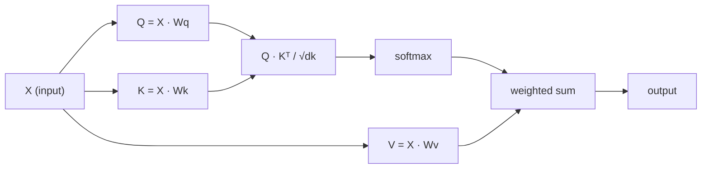

# A auto-atenção desde o zero

> A atenção é uma tabela de pesquisa onde cada palavra pergunta "quem é importante para mim?" - e aprende a resposta.

**Type:** Build
**Languages:** Python
**Prerequisites:** Phase 3 (Deep Learning Core), Phase 5 Lesson 10 (Sequence-to-Sequence)
**Time:** ~90 minutes

## Objetivos de aprendizagem

- Implementar a auto-atenção do produto ponto em escala a partir do zero usando apenas NumPy, incluindo projeções de consulta/chave/valor e a soma ponderada softmax
- Construir uma camada de atenção multi-cabeça que divide cabeças, calcula atenção paralela e concatenar os resultados
- Traçar como a matriz de atenção capta relações de token e explicar por que a escalação por sqrt(d_k) impede a saturação de softmax
- Aplicar mascaramento causal para converter a atenção bidirecional em atenção autoregressiva (estilo de decodificador)

## O problema

As RNNs processam sequências de um token por vez. Quando você alcança o token 50, as informações do token 1 já foram comprimidas através de 50 passos de compressão.

O artigo de atenção Bahdanau de 2014 mostrou a solução: deixe o decodificador olhar para trás em cada posição do codificador e decidir quais são importantes para o passo atual. Mas ainda estava preso a um RNN. O artigo de 2017 "Attenção é tudo o que você precisa" fez uma pergunta mais nítida: e se a atenção é o único mecanismo?

A auto-atenção permite que cada posição de uma sequência atenda a cada outra posição em um único passo paralelo.

## O conceito

### A Analogia de Pesquisa de Base de Dados

Pensem na atenção como uma pesquisa de banco de dados suave:

```
Traditional database:
  Query: "capital of France"  -->  exact match  -->  "Paris"

Attention:
  Query: "capital of France"  -->  similarity to ALL keys  -->  weighted blend of ALL values
```

Cada token gera três vetores:
- **Query (Q)**"O que estou à procura?"
- **Key (K)**"O que contém?"
- **Value (V)**"Que informações forneço se for selecionado?"

O produto de pontos entre uma consulta e todas as chaves produz pontuações de atenção. pontuação alta significa "esta chave corresponde à minha consulta".

### Q, K, V Computação

Cada embedding token é projetado através de três matrizes de peso aprendidas:

```
Input embeddings (sequence of n tokens, each d-dimensional):

  X = [x1, x2, x3, ..., xn]       shape: (n, d)

Three weight matrices:

  Wq  shape: (d, dk)
  Wk  shape: (d, dk)
  Wv  shape: (d, dv)

Projections:

  Q = X @ Wq    shape: (n, dk)      each token's query
  K = X @ Wk    shape: (n, dk)      each token's key
  V = X @ Wv    shape: (n, dv)      each token's value
```

Visualmente, por um sinal:

```
             Wq
  x_i ------[*]------> q_i    "What am I looking for?"
       |
       |     Wk
       +----[*]------> k_i    "What do I contain?"
       |
       |     Wv
       +----[*]------> v_i    "What do I offer?"
```

### A Matriz da Atenção

Uma vez que você tem Q, K, V para todos os tokens, pontuações de atenção formam uma matriz:

```
Scores = Q @ K^T    shape: (n, n)

              k1    k2    k3    k4    k5
        +-----+-----+-----+-----+-----+
   q1   | 2.1 | 0.3 | 0.1 | 0.8 | 0.2 |   <- how much q1 attends to each key
        +-----+-----+-----+-----+-----+
   q2   | 0.4 | 1.9 | 0.7 | 0.1 | 0.3 |
        +-----+-----+-----+-----+-----+
   q3   | 0.2 | 0.6 | 2.3 | 0.5 | 0.1 |
        +-----+-----+-----+-----+-----+
   q4   | 0.9 | 0.1 | 0.4 | 1.7 | 0.6 |
        +-----+-----+-----+-----+-----+
   q5   | 0.1 | 0.3 | 0.2 | 0.5 | 2.0 |
        +-----+-----+-----+-----+-----+

Each row: one token's attention over the entire sequence
```

Assista a uma consulta por vez varrer as chaves: cada linha marca cada token, softmax transforma os resultados em pesos e o vetor de contexto é a mistura ponderada de valores.

```figure
attention-matrix
```

### Por que Escala?

Os produtos de pontos crescem com a dimensão dk. Se dk = 64, os produtos de pontos podem estar na faixa de dez, empurrando softmax para regiões onde os gradientes desaparecem.

```
Scaled scores = (Q @ K^T) / sqrt(dk)
```

Isto mantém os valores numa faixa onde softmax produz gradientes úteis.

### Softmax transforma as pontuações em pesos

Softmax converte as pontuações brutas em uma distribuição de probabilidade em cada linha:

```
Raw scores for q1:   [2.1, 0.3, 0.1, 0.8, 0.2]
                            |
                         softmax
                            |
Attention weights:   [0.52, 0.09, 0.07, 0.14, 0.08]   (sums to ~1.0)
```

Cada token tem um conjunto de pesos que dizem quanto deve ser atendido a cada outro token.

### Sumas ponderadas de valores

A saída final para cada token é uma soma ponderada de todos os vetores de valor:

```
output_i = sum( attention_weight[i][j] * v_j  for all j )

For token 1:
  output_1 = 0.52 * v1 + 0.09 * v2 + 0.07 * v3 + 0.14 * v4 + 0.08 * v5
```

### O gasoduto completo



Fórmula em uma linha:

```
Attention(Q, K, V) = softmax( Q @ K^T / sqrt(dk) ) @ V
```

```figure
softmax-attention-scaling
```

## Construí-lo

### Passo 1: Softmax a partir do zero

Softmax converte logits brutos em probabilidades.

```python
import numpy as np

def softmax(x):
    shifted = x - np.max(x, axis=-1, keepdims=True)
    exp_x = np.exp(shifted)
    return exp_x / np.sum(exp_x, axis=-1, keepdims=True)

logits = np.array([2.0, 1.0, 0.1])
print(f"logits:  {logits}")
print(f"softmax: {softmax(logits)}")
print(f"sum:     {softmax(logits).sum():.4f}")
```

### Passo 2: Atenção a ponto do produto em escala

A função central, leva matrizes Q, K, V e retorna a saída de atenção mais a matriz de peso.

```python
def scaled_dot_product_attention(Q, K, V):
    dk = Q.shape[-1]
    scores = Q @ K.T / np.sqrt(dk)
    weights = softmax(scores)
    output = weights @ V
    return output, weights
```

### Passo 3: Classe de auto-atenção com projeções aprendidas

Um módulo de auto-atenção completo com matrizes de peso Wq, Wk, Wv iniciadas com escalagem semelhante a Xavier.

```python
class SelfAttention:
    def __init__(self, d_model, dk, dv, seed=42):
        rng = np.random.default_rng(seed)
        scale = np.sqrt(2.0 / (d_model + dk))
        self.Wq = rng.normal(0, scale, (d_model, dk))
        self.Wk = rng.normal(0, scale, (d_model, dk))
        scale_v = np.sqrt(2.0 / (d_model + dv))
        self.Wv = rng.normal(0, scale_v, (d_model, dv))
        self.dk = dk

    def forward(self, X):
        Q = X @ self.Wq
        K = X @ self.Wk
        V = X @ self.Wv
        output, weights = scaled_dot_product_attention(Q, K, V)
        return output, weights
```

### Passo 4: Exerça-o em uma frase

Crie falsos incorporados para uma frase e observe o peso da atenção.

```python
sentence = ["The", "cat", "sat", "on", "the", "mat"]
n_tokens = len(sentence)
d_model = 8
dk = 4
dv = 4

rng = np.random.default_rng(42)
X = rng.normal(0, 1, (n_tokens, d_model))

attn = SelfAttention(d_model, dk, dv, seed=42)
output, weights = attn.forward(X)

print("Attention weights (each row: where that token looks):\n")
print(f"{'':>6}", end="")
for token in sentence:
    print(f"{token:>6}", end="")
print()

for i, token in enumerate(sentence):
    print(f"{token:>6}", end="")
    for j in range(n_tokens):
        w = weights[i][j]
        print(f"{w:6.3f}", end="")
    print()
```

### Passo 5: Visualize a atenção com o mapa de calor ASCII

Mapear pesos de atenção para os personagens para uma visão rápida.

```python
def ascii_heatmap(weights, tokens, chars=" ░▒▓█"):
    n = len(tokens)
    print(f"\n{'':>6}", end="")
    for t in tokens:
        print(f"{t:>6}", end="")
    print()

    for i in range(n):
        print(f"{tokens[i]:>6}", end="")
        for j in range(n):
            level = int(weights[i][j] * (len(chars) - 1) / weights.max())
            level = min(level, len(chars) - 1)
            print(f"{'  ' + chars[level] + '   '}", end="")
        print()

ascii_heatmap(weights, sentence)
```

## Usá-lo

O PyTorch's `nn.MultiheadAttention`Faz exatamente o que construímos, mais divisão multi-head e projeção de saída:

```python
import torch
import torch.nn as nn

d_model = 8
n_heads = 2
seq_len = 6

mha = nn.MultiheadAttention(embed_dim=d_model, num_heads=n_heads, batch_first=True)

X_torch = torch.randn(1, seq_len, d_model)

output, attn_weights = mha(X_torch, X_torch, X_torch)

print(f"Input shape:            {X_torch.shape}")
print(f"Output shape:           {output.shape}")
print(f"Attention weight shape: {attn_weights.shape}")
print(f"\nAttn weights (averaged over heads):")
print(attn_weights[0].detach().numpy().round(3))
```

A diferença chave: a atenção multi-cabeça executa múltiplas funções de atenção em paralelo, cada uma com suas próprias projeções Q, K, V de tamanho dk = d_modelo / n_cabeças, em seguida, concatenar os resultados.

## Envia-o

Esta lição produz:
- `outputs/prompt-attention-explainer.md`- um aviso para explicar a atenção através da analogia de pesquisa de banco de dados

## Exercícios

1. Modificar`scaled_dot_product_attention`Para aceitar uma matriz de máscara opcional que fixa certas posições a infinito negativo antes do softmax (é assim que funciona o mascaramento causal/decodificador)
2. Implementar atenção multi-head a partir do zero: dividir Q, K, V em `n_heads`pedaços, executar atenção em cada, concatenar, e projetar através de uma matriz de peso final Wo
3. Tome duas frases diferentes do mesmo comprimento, entregue-as através da mesma instância de autoatentação e compare os padrões de atenção.

## Termos-chave

| Term | What people say | What it actually means |
|------|----------------|----------------------|
| Query (Q) | "The question vector" | A learned projection of the input that represents what information this token is looking for |
| Key (K) | "The label vector" | A learned projection that represents what information this token contains, matched against queries |
| Value (V) | "The content vector" | A learned projection carrying the actual information that gets aggregated based on attention scores |
| Scaled dot-product attention | "The attention formula" | softmax(QK^T / sqrt(dk)) @ V - scaling prevents softmax saturation in high dimensions |
| Self-attention | "The token looks at itself and others" | Attention where Q, K, V all come from the same sequence, letting every position attend to every other position |
| Attention weights | "How much focus" | A probability distribution over positions, produced by softmax over scaled dot products |
| Multi-head attention | "Parallel attention" | Running multiple attention functions with different projections, then concatenating results for richer representations |

## Mais leitura

- [Attention Is All You Need (Vaswani et al., 2017)](https://arxiv.org/abs/1706.03762)- o papel transformador original
- [The Illustrated Transformer (Jay Alammar)](https://jalammar.github.io/illustrated-transformer/)- melhor passagem visual da arquitetura completa
- [The Annotated Transformer (Harvard NLP)](https://nlp.seas.harvard.edu/annotated-transformer/)- implementação linha a linha do PyTorch com explicações
