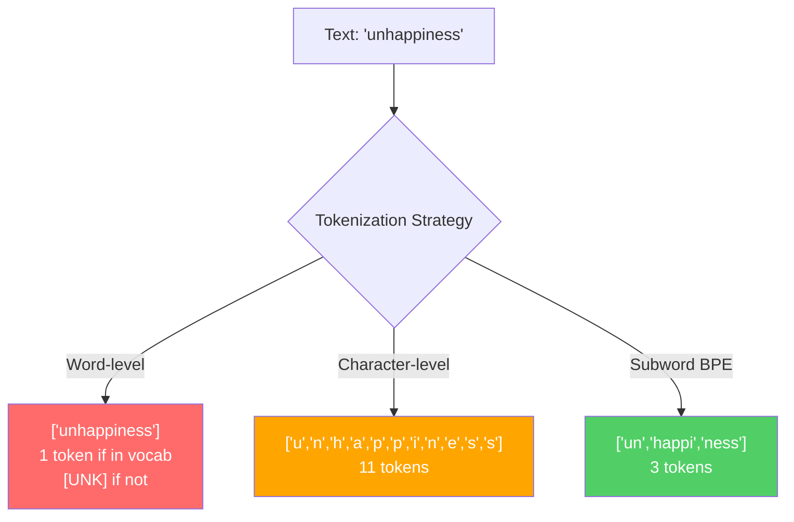
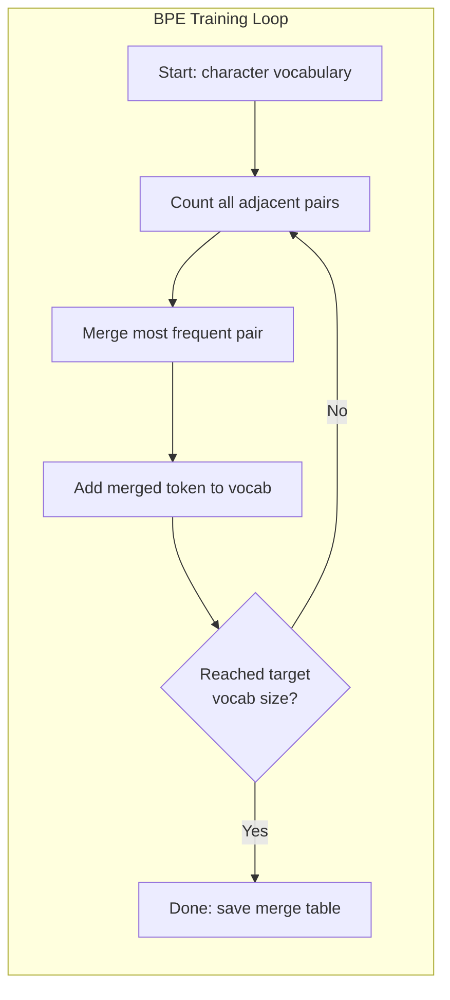
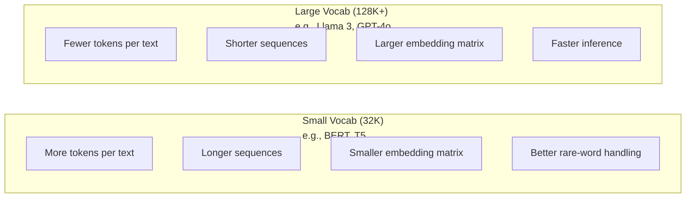

# Tokenizers: BPE, WordPiece, SentencePiece

> O teu LLM não lê inglês, lê números inteiros. O tokenizer decide se esses números inteiros têm significado ou desperdiçam.

**Type:** Build
**Languages:** Python
**Prerequisites:** Phase 05 (NLP Foundations)
**Time:** ~90 minutes

## Objetivos de aprendizagem

- Implementar algoritmos de tokenização BPE, WordPiece e Unigram a partir do zero e comparar suas estratégias de fusão
- Explicar como o tamanho do vocabulário afeta a eficiência do modelo: muito pequeno cria longas sequências, muito grande resíduo incorpora parâmetros
- Analisar artefatos de tokenization em diferentes idiomas e código, identificando onde os tokenizers específicos se desintegram
- Use as bibliotecas de tokens e frases para tokenizar o texto e inspecionar os IDs de tokens resultantes

## O problema

O teu Mestrado não lê inglês, não lê qualquer língua, lê números.

A diferença entre "Hello, world!" e [15496, 11, 995, 0] é o tokenizer. Cada palavra, cada espaço, cada marca de pontuação deve ser convertida em um número inteiro antes que um modelo possa processá-lo. Esta conversão não é neutra.

Se enganares, o teu modelo desperdiça capacidade de codificar palavras comuns com vários tokens. "infelizmente" torna-se quatro tokens em vez de um. A sua janela de contexto de 128K acabou de diminuir 75% para texto pesado em palavras de várias sílabas. Se o fizer bem, a mesma janela de contexto tem o dobro do significado. A diferença entre "este modelo lida bem com o código" e "este modelo se engasga no Python" geralmente se resume à forma como o tokenizer foi treinado.

Cada chamada de API que você faz para o GPT-4 ou Claude é avaliada por token. Cada token que seu modelo gera custa computação. Quanto menos tokens são necessários para representar uma saída, mais rápido a inferência de ponta a ponta. A tokenization não é pré-processamento. É arquitetura.

## O conceito

### Três abordagens que falharam (e uma que ganhou)

Existem três maneiras óbvias de converter texto em números.

**Word-level tokenization**"O gato sentou" torna-se ["O", "gato", "sat"]". Simples. Mas o que dizer de "tokenization"? Ou "GPT-4o"? Ou uma palavra composta alemã como "Geschwindigkeitsbegrenzung"?`[UNK]`O símbolo é a forma como o modelo diz "Não faço ideia do que isto é". Só o inglês tem mais de um milhão de formas de palavras. Adicione código, URLs, notação científica e 100 outras línguas e você precisa de um vocabulário infinito.

**Character-level tokenization**"Hello" torna-se ["h", "e", "l", "l", "o"]". O vocabulário é pequeno (algumas centenas de caracteres). Nenhum símbolo desconhecido nunca. Mas as sequências tornam-se extremamente longas. Uma frase que seria de 10 símbolos de nível de palavras torna-se de 50 símbolos de nível de caracteres. O modelo deve aprender que "t", "h", "e" juntos significam "o" - queima capacidade de atenção em algo que um ser humano aprende aos três anos.

**Subword tokenization**As palavras comuns permanecem inteiras: "the" é um símbolo. As palavras raras se descomponem em pedaços significativos: "insatisfação" torna-se ["un", "happy", "ness"]". O vocabulário permanece gerenciável (30K a 128K tokens). As sequências permanecem curtas. Tokens desconhecidos desaparecem essencialmente porque qualquer palavra pode ser construída a partir de pedaços de subpalavras.

Todos os Mestrados modernos usam tokenização de subpalavras. GPT-2, GPT-4, BERT, Llama 3, Claude - todos eles. A questão é qual algoritmo.



### BPE: codificação em pares de byte

O BPE é um algoritmo de compressão ganancioso reaproveitado para tokenização.

Comece com caracteres individuais, conte cada par adjacente no corpo de treinamento, funda o par mais frequente em um novo token, repita até atingir o tamanho do vocabulário alvo.

```figure
tokenizer-bpe
```

Aqui está o BPE a correr num pequeno corpus com as palavras "menor", "menor" e "mais novo":

```
Corpus (with word frequencies):
  "lower"  x5
  "lowest" x2
  "newest" x6

Step 0 -- Start with characters:
  l o w e r       (x5)
  l o w e s t     (x2)
  n e w e s t     (x6)

Step 1 -- Count adjacent pairs:
  (e,s): 8    (s,t): 8    (l,o): 7    (o,w): 7
  (w,e): 13   (e,r): 5    (n,e): 6    ...

Step 2 -- Merge most frequent pair (w,e) -> "we":
  l o we r        (x5)
  l o we s t      (x2)
  n e we s t      (x6)

Step 3 -- Recount and merge (e,s) -> "es":
  l o we r        (x5)
  l o we s t      (x2)    <- 'es' only forms from 'e'+'s', not 'we'+'s'
  n e we s t      (x6)    <- wait, the 'e' before 'we' and 's' after 'we'

Actually tracking this precisely:
  After "we" merge, remaining pairs:
  (l,o): 7   (o,we): 7   (we,r): 5   (we,s): 8
  (s,t): 8   (n,e): 6    (e,we): 6

Step 3 -- Merge (we,s) -> "wes" or (s,t) -> "st" (tied at 8, pick first):
  Merge (we,s) -> "wes":
  l o we r        (x5)
  l o wes t       (x2)
  n e wes t       (x6)

Step 4 -- Merge (wes,t) -> "west":
  l o we r        (x5)
  l o west        (x2)
  n e west        (x6)

...continue until target vocab size reached.
```

A tabela de fusão é o tokenizer. Para codificar um novo texto, aplicar fusões na ordem que foram aprendidas. O corpo de treinamento determina quais fusões existem, e essa escolha molda permanentemente o que o modelo vê.



### BPE de nível de byte (GPT-2, GPT-3, GPT-4)

O BPE padrão opera em caracteres Unicode. O BPE de nível de byte opera em bytes brutos (0-255). Isso lhe dá um vocabulário básico de exatamente 256, lida com qualquer idioma ou codificação e nunca produz um token desconhecido.

O vocabulário base cobre todos os bytes possíveis. BPE se funde em cima disso. A biblioteca de tiktoken do OpenAI implementa BPE de nível de byte com esses tamanhos de vocabulário:

- GPT-2: 50.257 tokens
- GPT-3.5/GPT-4: ~100,256 tokens (coding cl100k_base)
- GPT-4o: 200 019 tokens (o200k_base encoding)

### O que é o "Piece" (BERT)

O WordPiece parece semelhante ao BPE, mas as escolhas se fundem de forma diferente. Em vez de freqüência bruta, ele maximiza a probabilidade dos dados de treinamento:

```
BPE merge criterion:      count(A, B)
WordPiece merge criterion: count(AB) / (count(A) * count(B))
```

O BPE pergunta: "Qual par aparece mais frequentemente?" O WordPiece pergunta: "Qual par aparece juntos mais frequentemente do que você esperaria por acaso?" Esta diferença sutil produz vocabulários diferentes.

O WordPiece também usa um prefixo "##" para subpalavras de continuação:

```
"unhappiness" -> ["un", "##happi", "##ness"]
"embedding"   -> ["em", "##bed", "##ding"]
```

O prefixo "##" diz que esta peça continua um token anterior. BERT usa WordPiece com um vocabulário de 30.522 tokens. Cada variante BERT - DistilBERT, o tokenizer do RoBERTa é na verdade BPE, mas o BERT em si é WordPiece.

### SentençaPiece (Llama, T5)

SentencePiece trata a entrada como um fluxo bruto de caracteres Unicode, incluindo espaço branco. Não há etapa de pré-tokenização. Não há regras específicas de idioma sobre os limites de palavras. Isso torna-a genuinamente linguística-agnóstica - funciona em chinês, japonês, tailandês e outras línguas onde espaços não separam palavras.

SentencePiece suporta dois algoritmos:
- **BPE mode**: a mesma lógica de fusão que a BPE padrão, aplicada a sequências de caracteres brutos
- **Unigram mode**O inverso do BPE - prune em vez de merger.

Llama 2 usa SentencePiece BPE com um vocabulário de 32.000 tokens. T5 usa SentencePiece Unigram com 32.000 tokens. Nota: Llama 3 mudou para um tokenizador BPE de nível de byte baseado em tiktoken com 128.256 tokens.

### Comércio de tamanho do vocabulário

Esta é uma decisão de engenharia real com consequências mensuráveis.



Números concretos. Para um vocabulário de 128K com embebimentos de 4.096 dimensões, a matriz de embebimento sozinha é de 128.000 x 4.096 = 524 milhões de parâmetros. Para um vocabulário de 32K, é de 131 milhões de parâmetros. Isso é uma diferença de parâmetros de 400M da escolha do tokenizer sozinho.

Mas os vocabulários maiores comprimem o texto de forma mais agressiva. O mesmo parágrafo em inglês que toma 100 tokens com um vocabulário de 32K pode tomar 70 tokens com um vocabulário de 128K. Isso significa 30% menos passes avançados durante a geração. Para um modelo que atende milhões de solicitações, isso é uma redução direta no custo de computação.

A tendência é clara: os tamanhos do vocabulário estão crescendo. GPT-2 usou 50.257. GPT-4 usa ~ 100K. Llama 3 usa 128K. GPT-4o usa 200K.

| Model | Vocab Size | Tokenizer Type | Avg Tokens per English Word |
|-------|-----------|----------------|---------------------------|
| BERT | 30,522 | WordPiece | ~1.4 |
| GPT-2 | 50,257 | Byte-level BPE | ~1.3 |
| Llama 2 | 32,000 | SentencePiece BPE | ~1.4 |
| GPT-4 | ~100,256 | Byte-level BPE | ~1.2 |
| Llama 3 | 128,256 | Byte-level BPE (tiktoken) | ~1.1 |
| GPT-4o | 200,019 | Byte-level BPE | ~1.0 |

### O Imposto Multilíngue

Tokenizers treinados principalmente em inglês são brutais para outras línguas. O texto coreano no tokenizer do GPT-2 tem uma média de 2-3 tokens por palavra. O chinês pode ser pior. Isso significa que um usuário coreano tem uma janela de contexto que é metade do tamanho de um usuário inglês - pagando o mesmo preço por menor densidade de informações.

É por isso que Llama 3 quadruplicou seu vocabulário de 32K para 128K. Mais tokens dedicados a scripts não-inglês significa uma compressão mais justa entre as línguas.

```figure
tokenizer-tradeoff
```

## Construí-lo

### Passo 1: Tokenizer de Nível de Caracteres

Comece na base. Um tokenizer de nível de caracteres mapeia cada caracter para o seu ponto de código Unicode. Não é necessário treinamento. Não há tokens desconhecidos. Apenas um mapeamento direto.

```python
class CharTokenizer:
    def encode(self, text):
        return [ord(c) for c in text]

    def decode(self, tokens):
        return "".join(chr(t) for t in tokens)
```

"olá" torna-se [104, 101, 108, 108, 111]. Cada personagem é o seu próprio símbolo.

### Passo 2: Tokenizer BPE a partir do zero

A implementação real. Nós treinamos em bytes brutos (como GPT-2), contamos pares, fundimos os mais frequentes e gravamos cada fusão em ordem.

```python
from collections import Counter

class BPETokenizer:
    def __init__(self):
        self.merges = {}
        self.vocab = {}

    def _get_pairs(self, tokens):
        pairs = Counter()
        for i in range(len(tokens) - 1):
            pairs[(tokens[i], tokens[i + 1])] += 1
        return pairs

    def _merge_pair(self, tokens, pair, new_token):
        merged = []
        i = 0
        while i < len(tokens):
            if i < len(tokens) - 1 and tokens[i] == pair[0] and tokens[i + 1] == pair[1]:
                merged.append(new_token)
                i += 2
            else:
                merged.append(tokens[i])
                i += 1
        return merged

    def train(self, text, num_merges):
        tokens = list(text.encode("utf-8"))
        self.vocab = {i: bytes([i]) for i in range(256)}

        for i in range(num_merges):
            pairs = self._get_pairs(tokens)
            if not pairs:
                break
            best_pair = max(pairs, key=pairs.get)
            new_token = 256 + i
            tokens = self._merge_pair(tokens, best_pair, new_token)
            self.merges[best_pair] = new_token
            self.vocab[new_token] = self.vocab[best_pair[0]] + self.vocab[best_pair[1]]

        return self

    def encode(self, text):
        tokens = list(text.encode("utf-8"))
        for pair, new_token in self.merges.items():
            tokens = self._merge_pair(tokens, pair, new_token)
        return tokens

    def decode(self, tokens):
        byte_sequence = b"".join(self.vocab[t] for t in tokens)
        return byte_sequence.decode("utf-8", errors="replace")
```

O ciclo de treinamento é o núcleo do BPE: contar pares, fundir o vencedor, repetir.`num_merges`As rotas, o vocabulário cresce de 256 (byte base) para 256 + num_merges.

A codificação aplica fusões na ordem exata que foram aprendidas. Isso importa. Se a fusão 1 criou "th" e a fusão 5 criou "the", a codificação deve aplicar a fusão 1 primeiro para que "the" possa formar-se a partir de "th" + "e" na fusão 5.

A decodificação é o inverso: procure cada ID de token no vocabulário, concatenar os bytes, decodificar para UTF-8.

### Passo 3: Encodegue e decode Roundtrip

```python
corpus = (
    "The cat sat on the mat. The cat ate the rat. "
    "The dog sat on the log. The dog ate the frog. "
    "Natural language processing is the study of how computers "
    "understand and generate human language. "
    "Tokenization is the first step in any NLP pipeline."
)

tokenizer = BPETokenizer()
tokenizer.train(corpus, num_merges=40)

test_sentences = [
    "The cat sat on the mat.",
    "Natural language processing",
    "tokenization pipeline",
    "unhappiness",
]

for sentence in test_sentences:
    encoded = tokenizer.encode(sentence)
    decoded = tokenizer.decode(encoded)
    raw_bytes = len(sentence.encode("utf-8"))
    ratio = len(encoded) / raw_bytes
    print(f"'{sentence}'")
    print(f"  Tokens: {len(encoded)} (from {raw_bytes} bytes) -- ratio: {ratio:.2f}")
    print(f"  Roundtrip: {'PASS' if decoded == sentence else 'FAIL'}")
```

A relação de compressão diz-lhe o quão eficaz é o tokenizer. Uma relação de 0,50 significa que o tokenizer comprimido o texto para metade de tantos tokens como bytes brutos. Mais baixo é melhor. No corpo de treinamento, a proporção será boa. Em textos fora de distribuição como "insatisfação" (que não aparece no corpus), a relação será pior - o tokenizer volta à codificação de nível de caracteres para padrões invisíveis.

### Passo 4: Compare com o tiktoken

```python
import tiktoken

enc = tiktoken.get_encoding("cl100k_base")

texts = [
    "The cat sat on the mat.",
    "unhappiness",
    "Hello, world!",
    "def fibonacci(n): return n if n < 2 else fibonacci(n-1) + fibonacci(n-2)",
    "Geschwindigkeitsbegrenzung",
]

for text in texts:
    our_tokens = tokenizer.encode(text)
    tiktoken_tokens = enc.encode(text)
    tiktoken_pieces = [enc.decode([t]) for t in tiktoken_tokens]
    print(f"'{text}'")
    print(f"  Our BPE:   {len(our_tokens)} tokens")
    print(f"  tiktoken:  {len(tiktoken_tokens)} tokens -> {tiktoken_pieces}")
```

O TikTok usa o mesmo algoritmo exatamente, mas treinado em centenas de gigabytes de texto com 100.000 fusões. O algoritmo é idêntico. A diferença é os dados de treinamento e o número de fusões. O tokenizador treinado em um parágrafo com 40 fusões não pode competir com as fusões de 100K do TikTok em um corpo maciço. Mas o mecanismo é o mesmo.

### Passo 5: Análise do Vocabulário

```python
def analyze_vocabulary(tokenizer, test_texts):
    total_tokens = 0
    total_chars = 0
    token_usage = Counter()

    for text in test_texts:
        encoded = tokenizer.encode(text)
        total_tokens += len(encoded)
        total_chars += len(text)
        for t in encoded:
            token_usage[t] += 1

    print(f"Vocabulary size: {len(tokenizer.vocab)}")
    print(f"Total tokens across all texts: {total_tokens}")
    print(f"Total characters: {total_chars}")
    print(f"Avg tokens per character: {total_tokens / total_chars:.2f}")

    print(f"\nMost used tokens:")
    for token_id, count in token_usage.most_common(10):
        token_bytes = tokenizer.vocab[token_id]
        display = token_bytes.decode("utf-8", errors="replace")
        print(f"  Token {token_id:4d}: '{display}' (used {count} times)")

    unused = [t for t in tokenizer.vocab if t not in token_usage]
    print(f"\nUnused tokens: {len(unused)} out of {len(tokenizer.vocab)}")
```

Isto revela a distribuição Zipf no seu vocabulário. Alguns tokens dominam (espaços, "o", "e"). A maioria dos tokens são raramente usados. Tokenizers de produção otimizam para essa distribuição - padrões comuns obtêm IDs de token curtos, padrões raros obtêm representações mais longas.

## Usá-lo

O seu arranhão BPE funciona.

### Tiktoken (OpenAI)

```python
import tiktoken

enc = tiktoken.get_encoding("cl100k_base")

text = "Tokenizers convert text to integers"
tokens = enc.encode(text)
print(f"Tokens: {tokens}")
print(f"Pieces: {[enc.decode([t]) for t in tokens]}")
print(f"Roundtrip: {enc.decode(tokens)}")
```

Tiktoken é escrito em Rust com Python. Encode milhões de tokens por segundo.

### Embarcando Tokenizers Face

```python
from tokenizers import Tokenizer
from tokenizers.models import BPE
from tokenizers.trainers import BpeTrainer
from tokenizers.pre_tokenizers import ByteLevel

tokenizer = Tokenizer(BPE())
tokenizer.pre_tokenizer = ByteLevel()

trainer = BpeTrainer(vocab_size=1000, special_tokens=["<pad>", "<eos>", "<unk>"])
tokenizer.train(["corpus.txt"], trainer)

output = tokenizer.encode("The cat sat on the mat.")
print(f"Tokens: {output.tokens}")
print(f"IDs: {output.ids}")
```

A biblioteca de tokenizadores do Hugging Face também é Rust sob o capô. Treina BPE em corpora em escala de gigabytes em segundos.

### Carregando o Tokenizer de Llama

```python
from transformers import AutoTokenizer

tokenizer = AutoTokenizer.from_pretrained("meta-llama/Llama-3.1-8B")

text = "Tokenizers are the unsung heroes of LLMs"
tokens = tokenizer.encode(text)
print(f"Token IDs: {tokens}")
print(f"Tokens: {tokenizer.convert_ids_to_tokens(tokens)}")
print(f"Vocab size: {tokenizer.vocab_size}")

multilingual = ["Hello world", "Hola mundo", "Bonjour le monde"]
for text in multilingual:
    ids = tokenizer.encode(text)
    print(f"'{text}' -> {len(ids)} tokens")
```

O vocabulário de 128K do Llama 3 comprime texto não-inglês significativamente melhor do que o vocabulário de 50K do GPT-2. Você pode verificar isso por si mesmo - codificar a mesma frase em várias línguas e contar os tokens.

## Envia-o

Esta lição produz`outputs/prompt-tokenizer-analyzer.md`-- um prompt reutilizável que analisa a eficiência de tokenização para qualquer combinação de texto e modelo.

## Exercícios

1. Modifique o tokenizer BPE para imprimir o vocabulário em cada etapa de fusão. Observe como "t" + "h" se torna "th", então "th" + "e" se torna "the".

2. Adicionar tokens especiais (`<pad>`- Não .`<eos>`- Não .`<unk>`) para o tokenizer BPE. atribuir-lhes os ID 0, 1, 2 e mudar todos os outros tokens em conformidade. Implementar uma etapa de pré-tokenização que se divide no espaço branco antes de executar BPE.

3. Implementar o critério de fusão do WordPiece (ratio de probabilidade em vez de frequência). Treinar tanto o BPE quanto o WordPiece no mesmo corpo com o mesmo número de fusões. Compare os vocabulários resultantes - qual produz subpalavras mais linguisticamente significativas?

4. Construir um benchmark de eficiência do tokenizer multilingue. Tome 10 frases em inglês, espanhol, chinês, coreano e árabe. Tokenize cada um com tiktoken (cl100k_base) e medir os tokens médios por caracter. Quantifique o "imposto multilingue" para cada língua.

5. Treine seu tokenizer BPE em um corpus maior (desenhar um artigo da Wikipedia). Atinja o número de fusões para alcançar uma relação de compressão dentro de 10% do tiktoken nesse mesmo texto. Isso obriga você a entender a relação entre o tamanho do corpus, a contagem de fusão e a qualidade de compressão.

## Termos-chave

| Term | What people say | What it actually means |
|------|----------------|----------------------|
| Token | "A word" | A unit in the model's vocabulary -- could be a character, subword, word, or multi-word chunk |
| BPE | "Some compression thing" | Byte Pair Encoding -- iteratively merge the most frequent adjacent pair of tokens until the target vocabulary size is reached |
| WordPiece | "BERT's tokenizer" | Like BPE but merges maximize the likelihood ratio count(AB)/(count(A)*count(B)) instead of raw frequency |
| SentencePiece | "A tokenizer library" | A language-agnostic tokenizer that operates on raw Unicode without pre-tokenization, supporting BPE and Unigram algorithms |
| Vocabulary size | "How many words it knows" | The total number of unique tokens: GPT-2 has 50,257, BERT has 30,522, Llama 3 has 128,256 |
| Fertility | "Not a tokenizer term" | Average number of tokens per word -- measures tokenizer efficiency across languages (1.0 is perfect, 3.0 means the model works three times harder) |
| Byte-level BPE | "GPT's tokenizer" | BPE operating on raw bytes (0-255) instead of Unicode characters, guaranteeing no unknown tokens for any input |
| Merge table | "The tokenizer file" | Ordered list of pair merges learned during training -- this IS the tokenizer, and order matters |
| Pre-tokenization | "Splitting on spaces" | Rules applied before subword tokenization: whitespace splitting, digit separation, punctuation handling |
| Compression ratio | "How efficient the tokenizer is" | Tokens produced divided by input bytes -- lower means better compression and faster inference |

## Mais leitura

- [Sennrich et al., 2016 -- "Neural Machine Translation of Rare Words with Subword Units"](https://arxiv.org/abs/1508.07909)-- o artigo que introduziu o BPE para a PNL, transformando um algoritmo de compressão de 1994 na base da tokenização moderna
- [Kudo & Richardson, 2018 -- "SentencePiece: A simple and language independent subword tokenizer"](https://arxiv.org/abs/1808.06226)-- Tokenization linguistic-agnostic que tornou práticos os modelos multilingües
- [OpenAI tiktoken repository](https://github.com/openai/tiktoken)-- implementação de BPE de produção em Rust com ligações Python, utilizada por GPT-3.5/4/4o
- [Hugging Face Tokenizers documentation](https://huggingface.co/docs/tokenizers)-- formação de tokenizadores de nível de produção com desempenho Rust
