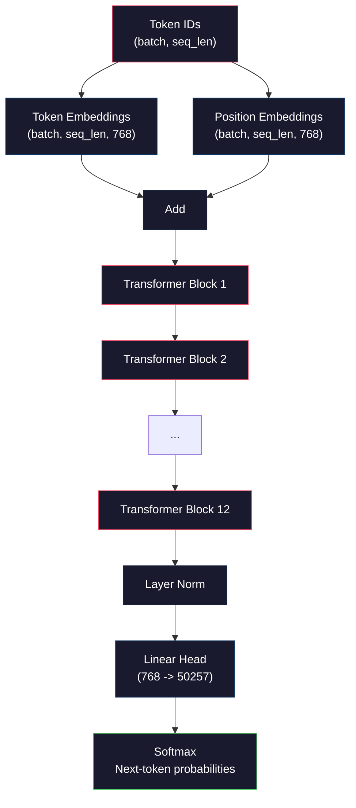
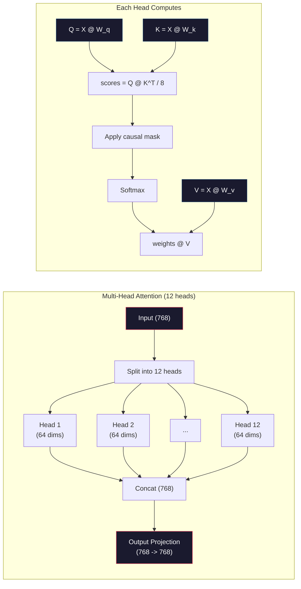
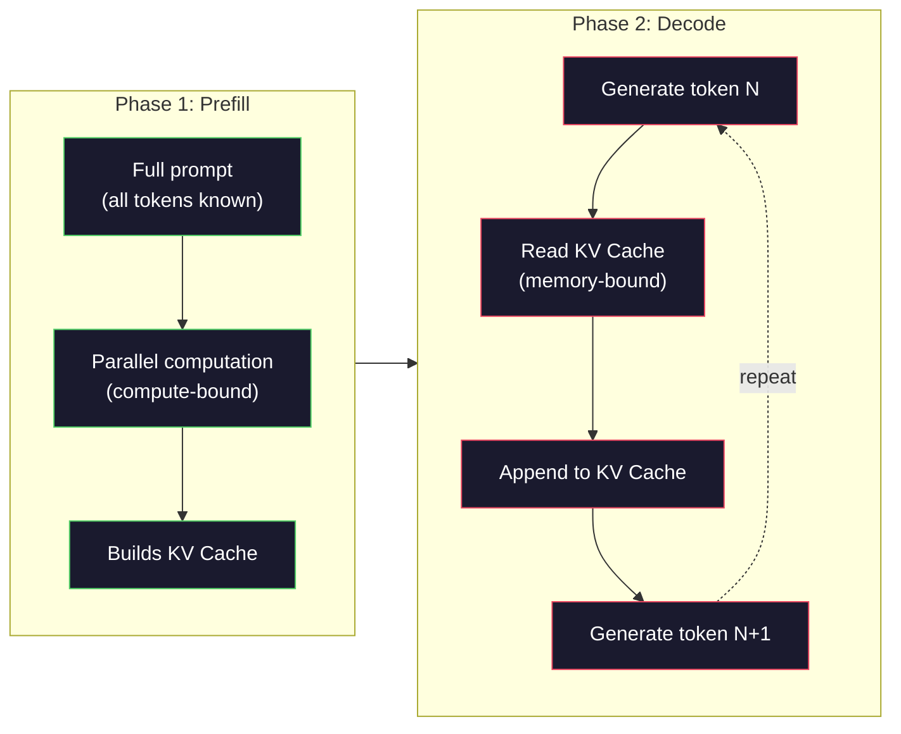

# Pre-treinamento de um Mini GPT (124M Parâmetros)

> O GPT-2 Small tem 124 milhões de parâmetros. São 12 camadas de transformador, 12 cabeças de atenção e embutidos 768-dimensional. Você pode treiná-lo de zero em uma única GPU em poucas horas. A maioria das pessoas nunca faz isso. Eles usam pontos de verificação pré-treinados. Mas se você não treinar um sozinho, você não entende realmente o que está acontecendo dentro do modelo em que está construindo produtos.

**Type:** Build
**Languages:** Python (with numpy)
**Prerequisites:** Phase 10, Lessons 01-03 (Tokenizers, Building a Tokenizer, Data Pipelines)
**Time:** ~120 minutes

## Objetivos de aprendizagem

- Implementar a arquitetura completa do GPT-2 (124M parâmetros) a partir do zero: embeddings de tokens, embeddings posicionais, blocos de transformadores e cabeçalho de modelo de linguagem
- Treinar um modelo GPT em um corpus de texto usando previsão de tokens próximos com perda de entropia cruzada
- Implementar a geração de texto autoregressiva com amostragem de temperatura e filtragem top-k/top-p
- Monitorar as curvas de perda de formação e validar que o modelo aprenda padrões de linguagem coerentes

## O problema

Você sabe o que é um transformador, já leu os diagramas, pode recitar "atentação é tudo o que você precisa" e desenhar caixas rotuladas "Atentação de várias cabeças" em um quadro branco.

Nada disso significa que entenda o que acontece quando um modelo gera texto.

Existem 124.438.272 parâmetros no GPT-2 Small (com ligação de peso). Cada um deles foi definido executando um ciclo de treinamento: passagem avançada, perda de cálculo, passagem para trás, pesos de atualização. Doze blocos de transformador. Doze cabeças de atenção por quarteirão. Um espaço de inserção em 768 dimensões. Um vocabulário de 50.257 tokens. Toda vez que o modelo gera um token, todos os 124 milhões de parâmetros participam de uma única cadeia de multiplicação de matriz que toma uma sequência de IDs de token e produz uma distribuição de probabilidade sobre o próximo token.

Se nunca construíram isto, estão a trabalhar com uma caixa negra. Podem usar a API. Podem ajustar. Mas quando algo vai mal - quando o modelo alucina, quando se repete, quando se recusa a seguir instruções - não têm modelo mental para "porquê".

Esta lição construiu GPT-2 Small a partir do zero. Não em PyTorch. Em numpy. Cada multiplicação de matriz é visível. Cada gradiente é calculado pelo seu código. Você verá exatamente como 124 milhões de números conspiram para prever a próxima palavra.

## O conceito

### A Arquitetura GPT

O GPT é um modelo de linguagem autoregressiva. "Autoregressivo" significa que gera um token de cada vez, cada um condicionado a todos os tokens anteriores.

Aqui está o gráfico completo de cálculo de tokens IDs para probabilidades de tokens próximos:

1. Identificadores de tokens entram. Forma: (batch_size, seq_len).
2. Identificação de identificação de um vector de 768 dimensões.
3. Cada posição (0, 1, 2, ...) faz um mapa de um vetor de 768 dimensões.
4. Adicionar embeddings de tokens + posições de embebimento.
5. Passe por 12 blocos de transformadores.
6. Normalização da camada final.
7. Projeção linear para tamanho do vocabulário.
8. Softmax para obter probabilidades.

Não há convulsões, não há recorrência, apenas embalagens, atenção, redes de feedforward e normas de camadas empilhadas 12 vezes.



### O bloco de transformador

Cada um dos 12 blocos segue o mesmo padrão. Arquitetura pré-norma (GPT-2 usa pré-norma, não pós-norma como o transformador original):

1. LayerNorm
2. Atenção à própria vida
3. Conexão residual (agrega entrada de volta)
4. LayerNorm
5. Rede de transferência de dados (MLP)
6. Conexão residual (agrega entrada de volta)

As conexões residuais são críticas. Sem elas, os gradientes desaparecem quando atingem o bloco 1 durante a propagação de volta. Com eles, os gradientes podem fluir diretamente da perda para qualquer camada através do caminho "salto". É por isso que você pode apilar 12, 32 ou até mesmo 96 blocos (GPT-4 é rumorado para usar 120).

### Atenção: Mecanismo central

A auto-atenção permite que cada token olhe para cada token anterior e decida quanto atender a cada um.

Para cada posição de token, calcular três vetores a partir da entrada:
- **Query (Q)**"O que estou à procura?"
- **Key (K)**"O que contém?"
- **Value (V)**"Que informação tenho?"

```
Q = input @ W_q    (768 -> 768)
K = input @ W_k    (768 -> 768)
V = input @ W_v    (768 -> 768)

attention_scores = Q @ K^T / sqrt(d_k)
attention_scores = mask(attention_scores)   # causal mask: -inf for future positions
attention_weights = softmax(attention_scores)
output = attention_weights @ V
```

A máscara causal é o que torna o GPT autoregressivo. A posição 5 pode atender às posições 0-5 mas não 6, 7, 8, etc. Isso impede que o modelo "tropece" olhando para futuros tokens durante o treinamento.

**Multi-head attention**O espaço 768-dimensional divide-o em 12 cabeças de 64 dimensões cada uma. Cada cabeça aprende um padrão de atenção diferente. Uma cabeça pode rastrear relações sintáticas (acordo entre sujeito e verbo). Outra pode rastrear semântica semelhança (sinônimos). Outra pode rastrear proximidade posicional (palavras próximas). As saídas de todas as 12 cabeças são concatenadas e projetadas de volta para 768 dimensões.



A divisão por sqrt(d_k) -- sqrt(64) = 8 -- é escalar. Sem ele, os produtos de pontos crescem para vetores de alta dimensão, empurrando softmax para regiões onde os gradientes são quase zero. Esta foi uma das principais ideias no artigo original "Attenção é tudo que você precisa".

### KV Cache: Por que a inferência é rápida

Durante o treinamento, você processa toda a seqüência de uma só vez. Durante a inferência, você gera um token de cada vez. Sem otimização, gerar token N requer recomputar atenção para todos os tokens anteriores N-1. Isso é O(N^2) por token gerado, ou O(N^3) total para uma sequência de comprimento N.

O KV Cache resolve isto. Depois de calcular K e V para cada token, armazená-los. Ao gerar token N + 1, você só precisa calcular Q para o novo token e procurar o caché K e V de todos os tokens anteriores. Isto reduz o custo por token de O(N) para O(1) para o cálculo K e V. O cálculo da pontuação de atenção ainda é O ((N) porque você atende todas as posições anteriores, mas evita multiplicidades redundantes de matriz na entrada.

Para GPT-2 com 12 camadas e 12 cabeças, o cache KV armazena 2 (K + V) x 12 camadas x 12 cabeças x 64 dims = 18.432 valores por token. Para uma sequência de 1024 tokens, que é cerca de 75 MB em FP32. Para Llama 3 405B com 128 camadas, o cache KV para uma única sequência pode exceder 10 GB. É por isso que a inferência de contexto longo é limitada à memória.

### Preenchimento vs Decodificação: duas fases de inferência

Quando enviamos um pedido para um LLM, a inferência acontece em duas fases distintas.

**Prefill**processar todo o seu prompt em paralelo. Todos os tokens são conhecidos, para que o modelo possa calcular a atenção para todas as posições simultaneamente. Esta fase é computacional - a GPU está fazendo multiplicidades de matriz em total throughput. Para um prompt de 1000 tokens em um A100, prefill leva cerca de 20-50ms.

**Decode**gera tokens um a cada vez. Cada novo token depende de todos os tokens anteriores. Esta fase é limitada à memória - o gargalo de engarrafamento é a leitura dos pesos do modelo e do cache KV da memória da GPU, não da própria matemática da matriz. Os núcleos de computação da GPU ficam em grande parte inactivos à espera de leituras de memória. Para o GPT-2, cada passo de decodificação leva aproximadamente o mesmo tempo, independentemente do número de FLOPs que as matmulas exigem, porque a largura de banda de memória é a restrição.

Esta distinção é importante para os sistemas de produção. Preencha as escalas de tráfego com computação GPU (mais FLOPS = preenchaço mais rápido). Decode as escalas de tráfego com largura de banda de memória (memória mais rápida = decodificação mais rápida). É por isso que o H100 da NVIDIA se focou em melhorias na largura de banda de memória em relação ao A100 - ele acelera diretamente a geração de tokens.



### O ciclo de treinamento

O treinamento de um LLM é a previsão de tokens próximos. Dados tokens [0, 1, 2, ..., N-1], previsão de tokens [1, 2, 3, ..., N. A função de perda é entropia cruzada entre a distribuição de probabilidade prevista do modelo e o token seguinte real.

Um passo de formação:

1. **Forward pass**Realizando o lote através dos 12 blocos, obtém logits (scores pré-softmax) para cada posição.
2. **Compute loss**: Entropia cruzada entre logits e tokens-alvo (a entrada mudada por uma posição).
3. **Backward pass**: Calcular gradientes para todos os parâmetros 124M utilizando a propagação de volta.
4. **Optimizer step**O GPT-2 usa o Adam para aquecer a taxa de aprendizagem e a decadência cosina.

O horário de aprendizagem é mais importante do que você poderia esperar. GPT-2 aquece de 0 para o pico de aprendizagem durante os primeiros 2.000 passos, depois decadem seguindo uma curva cosínea. Começando com uma alta taxa de aprendizagem faz com que o modelo diverja. Manter uma taxa constante de alta causa oscilação no treinamento posterior. O padrão de aquecimento-depois-decaimento é usado por todos os principais LLM.

### GPT-2 Pequeno: Os números

| Component | Shape | Parameters |
|-----------|-------|------------|
| Token embeddings | (50257, 768) | 38,597,376 |
| Position embeddings | (1024, 768) | 786,432 |
| Per-block attention (W_q, W_k, W_v, W_out) | 4 x (768, 768) | 2,359,296 |
| Per-block FFN (up + down) | (768, 3072) + (3072, 768) | 4,718,592 |
| Per-block LayerNorms (2x) | 2 x 768 x 2 | 3,072 |
| Final LayerNorm | 768 x 2 | 1,536 |
| **Total per block** | | **7,080,960** |
| **Total (12 blocks)** | | **85,054,464 + 39,383,808 = 124,438,272** |

A projeção de saída (cabeça de logits) compartilha pesos com a matriz de incorporação de token. Isso é chamado de ligação de peso - reduz a contagem de parâmetros em 38M e melhora o desempenho porque obriga o modelo a usar o mesmo espaço de representação para entrada e saída.

## Construí-lo

### Passo 1: Introdução de camada

Embedings de tokens mapeam cada um dos 50.257 tokens possíveis para um vetor de 768 dimensões. Embedings de posição adicionam informações sobre onde cada token fica na sequência. Os dois são somados.

```python
import numpy as np

class Embedding:
    def __init__(self, vocab_size, embed_dim, max_seq_len):
        self.token_embed = np.random.randn(vocab_size, embed_dim) * 0.02
        self.pos_embed = np.random.randn(max_seq_len, embed_dim) * 0.02

    def forward(self, token_ids):
        seq_len = token_ids.shape[-1]
        tok_emb = self.token_embed[token_ids]
        pos_emb = self.pos_embed[:seq_len]
        return tok_emb + pos_emb
```

O desvio padrão de 0,02 para inicialização vem do papel GPT-2. muito grande e os passes iniciais para a frente produzem valores extremos que desestabilizam o treinamento. muito pequeno e as saídas iniciais são quase idênticas para todas as entradas, tornando inúteis os sinais de gradiente iniciais.

### Passo 2: Autoatenção com máscara causal

A máscara causal fixa posições futuras a infinito negativo antes do softmax, garantindo que cada posição só possa atender a si mesma e posições anteriores.

```python
def attention(Q, K, V, mask=None):
    d_k = Q.shape[-1]
    scores = Q @ K.transpose(0, -1, -2 if Q.ndim == 4 else 1) / np.sqrt(d_k)
    if mask is not None:
        scores = scores + mask
    weights = np.exp(scores - scores.max(axis=-1, keepdims=True))
    weights = weights / weights.sum(axis=-1, keepdims=True)
    return weights @ V
```

A implementação softmax subtrai o máximo antes de exponenciar. Sem isso, exp(large_number) supera em infinito. Este é um truque de estabilidade numérica que não altera a saída porque softmax(x - c) = softmax(x) para qualquer constante c.

### Passo 3: Atenção de várias cabeças

Divida a entrada 768-dimensional em 12 cabeças de 64 dimensões cada uma. Cada cabeça calcula a atenção de forma independente.

```python
class MultiHeadAttention:
    def __init__(self, embed_dim, num_heads):
        self.num_heads = num_heads
        self.head_dim = embed_dim // num_heads
        self.W_q = np.random.randn(embed_dim, embed_dim) * 0.02
        self.W_k = np.random.randn(embed_dim, embed_dim) * 0.02
        self.W_v = np.random.randn(embed_dim, embed_dim) * 0.02
        self.W_out = np.random.randn(embed_dim, embed_dim) * 0.02

    def forward(self, x, mask=None):
        batch, seq_len, d = x.shape
        Q = (x @ self.W_q).reshape(batch, seq_len, self.num_heads, self.head_dim).transpose(0, 2, 1, 3)
        K = (x @ self.W_k).reshape(batch, seq_len, self.num_heads, self.head_dim).transpose(0, 2, 1, 3)
        V = (x @ self.W_v).reshape(batch, seq_len, self.num_heads, self.head_dim).transpose(0, 2, 1, 3)

        scores = Q @ K.transpose(0, 1, 3, 2) / np.sqrt(self.head_dim)
        if mask is not None:
            scores = scores + mask
        weights = np.exp(scores - scores.max(axis=-1, keepdims=True))
        weights = weights / weights.sum(axis=-1, keepdims=True)
        attn_out = weights @ V

        attn_out = attn_out.transpose(0, 2, 1, 3).reshape(batch, seq_len, d)
        return attn_out @ self.W_out
```

A dança de remodelação-transposição-remodelação é a parte mais confusa da atenção multi-cabeça. Aqui está o que acontece: o tensor (batch, seq_len, 768) torna-se (batch, seq_len, 12, 64), então (batch, 12, seq_len, 64). Agora cada uma das 12 cabeças tem sua própria (seq_len, 64) matriz para dirigir a atenção. Depois da atenção, invertimos o processo: (batch, 12, seq_len, 64) torna-se (batch, seq_len, 12, 64) torna-se (batch, seq_len, 768).

### Passo 4: Bloco de Transformador

Um bloco completo de transformador: LayerNorm, atenção multi-cabeça com resíduo, LayerNorm, feedforward com resíduo.

```python
class LayerNorm:
    def __init__(self, dim, eps=1e-5):
        self.gamma = np.ones(dim)
        self.beta = np.zeros(dim)
        self.eps = eps

    def forward(self, x):
        mean = x.mean(axis=-1, keepdims=True)
        var = x.var(axis=-1, keepdims=True)
        return self.gamma * (x - mean) / np.sqrt(var + self.eps) + self.beta


class FeedForward:
    def __init__(self, embed_dim, ff_dim):
        self.W1 = np.random.randn(embed_dim, ff_dim) * 0.02
        self.b1 = np.zeros(ff_dim)
        self.W2 = np.random.randn(ff_dim, embed_dim) * 0.02
        self.b2 = np.zeros(embed_dim)

    def forward(self, x):
        h = x @ self.W1 + self.b1
        h = np.maximum(0, h)  # GELU approximation: ReLU for simplicity
        return h @ self.W2 + self.b2


class TransformerBlock:
    def __init__(self, embed_dim, num_heads, ff_dim):
        self.ln1 = LayerNorm(embed_dim)
        self.attn = MultiHeadAttention(embed_dim, num_heads)
        self.ln2 = LayerNorm(embed_dim)
        self.ffn = FeedForward(embed_dim, ff_dim)

    def forward(self, x, mask=None):
        x = x + self.attn.forward(self.ln1.forward(x), mask)
        x = x + self.ffn.forward(self.ln2.forward(x))
        return x
```

A rede feedforward expande a entrada de 768 dimensões para 3.072 dimensões (4x), aplica uma não-linearidade, então projeta de volta para 768. Este padrão de expansão-contracção dá ao modelo uma representação interna "mais ampla" para trabalhar em cada posição. GPT-2 usa a ativação GELU, mas usamos ReLU aqui para simplicidade - a diferença é menor para entender a arquitetura.

### Passo 5: Modelo GPT completo

Aponta 12 blocos de transformador. Adicione a camada de inserção na frente e a projeção de saída na parte de trás.

```python
class MiniGPT:
    def __init__(self, vocab_size=50257, embed_dim=768, num_heads=12,
                 num_layers=12, max_seq_len=1024, ff_dim=3072):
        self.embedding = Embedding(vocab_size, embed_dim, max_seq_len)
        self.blocks = [
            TransformerBlock(embed_dim, num_heads, ff_dim)
            for _ in range(num_layers)
        ]
        self.ln_f = LayerNorm(embed_dim)
        self.vocab_size = vocab_size
        self.embed_dim = embed_dim

    def forward(self, token_ids):
        seq_len = token_ids.shape[-1]
        mask = np.triu(np.full((seq_len, seq_len), -1e9), k=1)

        x = self.embedding.forward(token_ids)
        for block in self.blocks:
            x = block.forward(x, mask)
        x = self.ln_f.forward(x)

        logits = x @ self.embedding.token_embed.T
        return logits

    def count_parameters(self):
        total = 0
        total += self.embedding.token_embed.size
        total += self.embedding.pos_embed.size
        for block in self.blocks:
            total += block.attn.W_q.size + block.attn.W_k.size
            total += block.attn.W_v.size + block.attn.W_out.size
            total += block.ffn.W1.size + block.ffn.b1.size
            total += block.ffn.W2.size + block.ffn.b2.size
            total += block.ln1.gamma.size + block.ln1.beta.size
            total += block.ln2.gamma.size + block.ln2.beta.size
        total += self.ln_f.gamma.size + self.ln_f.beta.size
        return total
```

Observe a ligação de peso: `logits = x @ self.embedding.token_embed.T`A projeção de saída reutiliza a matriz de incorporação de tokens (transposto).

### Passo 6: Loop de treinamento

Para uma corrida de treinamento real em parâmetros 124M, você precisaria de uma GPU e PyTorch. Este loop de treinamento demonstra a mecânica em um pequeno modelo que funciona em pura numpy. Usamos um modelo pequeno (4 camadas, 4 cabeças, 128 dims) para torná-lo tratável.

```python
def cross_entropy_loss(logits, targets):
    batch, seq_len, vocab_size = logits.shape
    logits_flat = logits.reshape(-1, vocab_size)
    targets_flat = targets.reshape(-1)

    max_logits = logits_flat.max(axis=-1, keepdims=True)
    log_softmax = logits_flat - max_logits - np.log(
        np.exp(logits_flat - max_logits).sum(axis=-1, keepdims=True)
    )

    loss = -log_softmax[np.arange(len(targets_flat)), targets_flat].mean()
    return loss


def train_mini_gpt(text, vocab_size=256, embed_dim=128, num_heads=4,
                   num_layers=4, seq_len=64, num_steps=200, lr=3e-4):
    tokens = np.array(list(text.encode("utf-8")[:2048]))
    model = MiniGPT(
        vocab_size=vocab_size, embed_dim=embed_dim, num_heads=num_heads,
        num_layers=num_layers, max_seq_len=seq_len, ff_dim=embed_dim * 4
    )

    print(f"Model parameters: {model.count_parameters():,}")
    print(f"Training tokens: {len(tokens):,}")
    print(f"Config: {num_layers} layers, {num_heads} heads, {embed_dim} dims")
    print()

    for step in range(num_steps):
        start_idx = np.random.randint(0, max(1, len(tokens) - seq_len - 1))
        batch_tokens = tokens[start_idx:start_idx + seq_len + 1]

        input_ids = batch_tokens[:-1].reshape(1, -1)
        target_ids = batch_tokens[1:].reshape(1, -1)

        logits = model.forward(input_ids)
        loss = cross_entropy_loss(logits, target_ids)

        if step % 20 == 0:
            print(f"Step {step:4d} | Loss: {loss:.4f}")

    return model
```

A perda começa perto de ln(vocab_size) - para um vocabulário de nível de byte de 256 tokens, ou seja ln(256) = 5.55. Um modelo aleatório atribui probabilidade igual a cada token. À medida que o treinamento progride, a perda diminui porque o modelo aprende a prever padrões comuns: "th" após "t", espaço após um período, e assim por diante.

Na produção, você usaria o optimizador Adam com acumulação de gradientes, aquecimento de taxa de aprendizagem e corte de gradientes. O loop de passagem para frente-perda-atendimento para trás é idêntico. O optimizador é mais sofisticado.

### Passo 7: Geração de textos

A geração usa o modelo treinado para prever um token de cada vez. Cada previsão é amostrada a partir da distribuição de saída (ou tomada com ganância como o argmax).

```python
def generate(model, prompt_tokens, max_new_tokens=100, temperature=0.8):
    tokens = list(prompt_tokens)
    seq_len = model.embedding.pos_embed.shape[0]

    for _ in range(max_new_tokens):
        context = np.array(tokens[-seq_len:]).reshape(1, -1)
        logits = model.forward(context)
        next_logits = logits[0, -1, :]

        next_logits = next_logits / temperature
        probs = np.exp(next_logits - next_logits.max())
        probs = probs / probs.sum()

        next_token = np.random.choice(len(probs), p=probs)
        tokens.append(next_token)

    return tokens
```

A temperatura controla a aleatoriedade. A temperatura 1.0 usa a distribuição bruta. A temperatura 0.5 agudiza-a (mais determinista - o modelo escolhe suas principais escolhas com mais frequência). A temperatura 1.5 aplania-a (mais aleatórias - tokens de baixa probabilidade têm uma maior chance). A temperatura 0.0 é codificação gananciosa (sempre escolha o token de maior probabilidade).

O `tokens[-seq_len:]`A janela é necessária porque o modelo tem um comprimento máximo de contexto (1024 para GPT-2). Uma vez que você excede isso, você deve soltar os tokens mais antigos. Esta é a "janela de contexto" que todos falam.

```figure
sampling-decoder
```

## Usá-lo

### Formação e Demo de Geração

```python
corpus = """The transformer architecture has revolutionized natural language processing.
Attention mechanisms allow the model to focus on relevant parts of the input.
Self-attention computes relationships between all pairs of positions in a sequence.
Multi-head attention splits the representation into multiple subspaces.
Each attention head can learn different types of relationships.
The feedforward network provides nonlinear transformations at each position.
Residual connections enable gradient flow through deep networks.
Layer normalization stabilizes training by normalizing activations.
Position embeddings give the model information about token ordering.
The causal mask ensures autoregressive generation during training.
Pre-training on large text corpora teaches the model general language understanding.
Fine-tuning adapts the pre-trained model to specific downstream tasks."""

model = train_mini_gpt(corpus, num_steps=200)

prompt = list("The transformer".encode("utf-8"))
output_tokens = generate(model, prompt, max_new_tokens=100, temperature=0.8)
generated_text = bytes(output_tokens).decode("utf-8", errors="replace")
print(f"\nGenerated: {generated_text}")
```

Em um pequeno corpus com um modelo pequeno, o texto gerado será semicoerente na melhor das hipóteses. Aprenderá alguns padrões de nível de byte do texto de treinamento, mas não pode generalizar a forma como o GPT-2 faz com 40 GB de dados de treinamento e a arquitetura completa de parâmetros 124M. O ponto não é a qualidade da saída. O ponto é que você pode rastrear cada passo: inserção de busca, cálculo de atenção, transformação de feedforward, projeção logit, softmax e amostragem. Todas as operações são visíveis.

## Envia-o

Esta lição produz`outputs/prompt-gpt-architecture-analyzer.md`-- um prompt que analisa as opções de arquitetura em qualquer modelo de estilo GPT.

## Exercícios

1. Modifique o modelo para usar 24 camadas e 16 cabeças em vez de 12/12. Conte os parâmetros. Como duplicar a profundidade compara-se ao duplicar a largura (dimensão de incorporação)?

2. Implementar a função de ativação GELU (GELU(x) = x * 0.5 * (1 + erf(x / sqrt(2)))) e substituir o ReLU na rede de feedforward.

3. Adicione um cache KV à função de geração. Armazenar tensores K e V para cada camada após a primeira passagem para a frente, e reutilizar-os para tokens subsequentes. Medir a velocidade: gerar 200 tokens com e sem o cache e comparar o tempo do relógio de parede.

4. Implementar amostragem top-k (considere apenas os tokens de maior probabilidade k) e amostragem top-p (amostragem núcleo: considere o menor conjunto de tokens cuja probabilidade cumulativa exceda p). Compare a qualidade de saída a temperatura 0,8 com top-k=50 vs top-p=0,95.

5. Construir um traçado de curva de perda de treinamento. Treinar o modelo para 1000 passos e perda de gráfico vs passo. Identificar as três fases: descida inicial rápida (aprender bytes comuns), fase média mais lenta (aprender byte padrões), e planalto (overfitting no pequeno corpus). A forma desta curva é a mesma se você está treinando um modelo de 128 dimensões ou GPT-4.

## Termos-chave

| Term | What people say | What it actually means |
|------|----------------|----------------------|
| Autoregressive | "It generates one word at a time" | Each output token is conditioned on all previous tokens -- the model predicts P(token_n \| token_0, ..., token_{n-1}) |
| Causal mask | "It can't see the future" | An upper-triangular matrix of -infinity values that prevents attention to future positions during training |
| Multi-head attention | "Multiple attention patterns" | Splitting Q, K, V into parallel heads (e.g., 12 heads of 64 dims each for GPT-2) so each head can learn different relationship types |
| KV Cache | "Caching for speed" | Storing computed Key and Value tensors from previous tokens to avoid redundant computation during autoregressive generation |
| Prefill | "Processing the prompt" | The first inference phase where all prompt tokens are processed in parallel -- compute-bound on GPU FLOPS |
| Decode | "Generating tokens" | The second inference phase where tokens are generated one at a time -- memory-bound on GPU bandwidth |
| Weight tying | "Sharing embeddings" | Using the same matrix for input token embeddings and the output projection head -- saves 38M params in GPT-2 |
| Residual connection | "Skip connection" | Adding the input directly to the output of a sublayer (x + sublayer(x)) -- enables gradient flow in deep networks |
| Layer normalization | "Normalizing activations" | Normalizing across the feature dimension to mean 0 and variance 1, with learnable scale and bias parameters |
| Cross-entropy loss | "How wrong the predictions are" | -log(probability assigned to the correct next token), averaged over all positions -- the standard LLM training objective |

## Mais leitura

- [Radford et al., 2019 -- "Language Models are Unsupervised Multitask Learners" (GPT-2)](https://cdn.openai.com/better-language-models/language_models_are_unsupervised_multitask_learners.pdf)-- o papel GPT-2 que introduziu a família de parâmetros 124M a 1.5B
- [Vaswani et al., 2017 -- "Attention Is All You Need"](https://arxiv.org/abs/1706.03762)- O papel transformador original com atenção escalada de produto ponto e atenção multi-cabeça
- [Llama 3 Technical Report](https://arxiv.org/abs/2407.21783)-- como Meta escalaram a arquitetura GPT para parâmetros 405B com GPUs 16K
- [Pope et al., 2022 -- "Efficiently Scaling Transformer Inference"](https://arxiv.org/abs/2211.05102)-- o papel que formalizou prefill vs decode e KV cache análise
