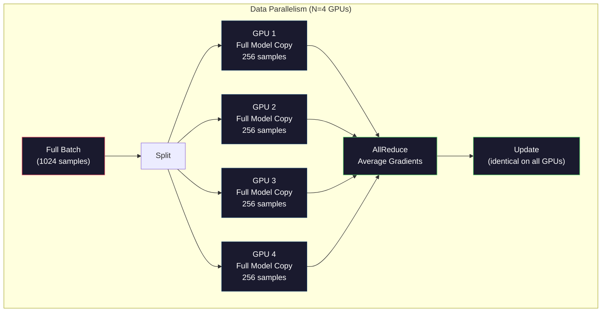
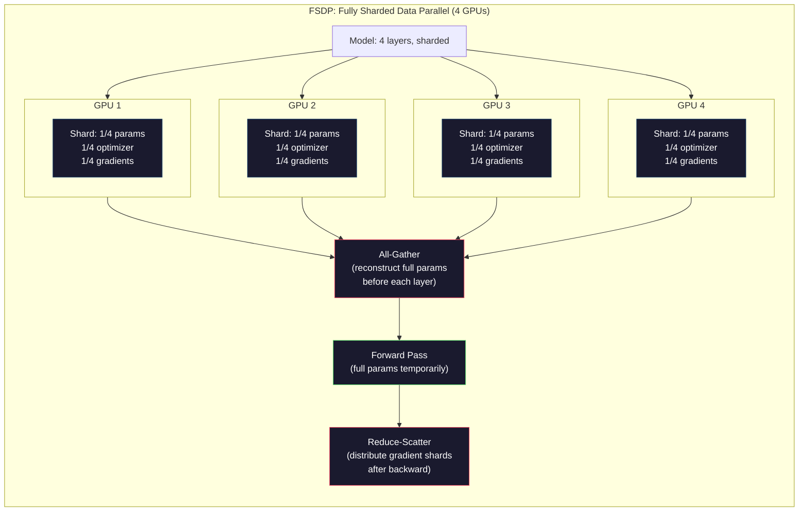
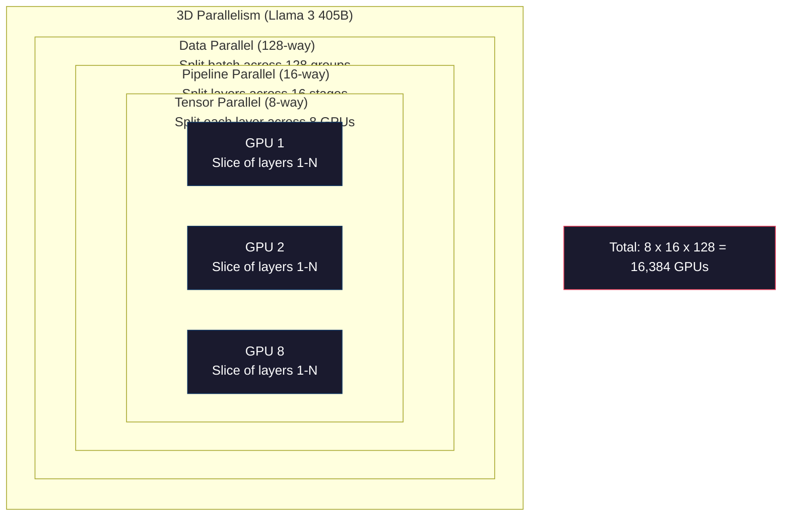

# Escalada: Formação distribuída, FSDP, DeepSpeed

> O seu modelo 124M treinado em uma GPU. Agora tente 7 bilhões de parâmetros. O modelo não cabe na memória. Os dados levam semanas em uma única máquina. O treinamento distribuído não é opcional em escala. É o único caminho para a frente.

**Type:** Build
**Languages:** Python
**Prerequisites:** Phase 10, Lesson 04 (Pre-Training a Mini GPT)
**Time:** ~120 minutes

## Objetivos de aprendizagem

- Explique os três tipos de paralelismo (dados, tensor, pipeline) e quando cada um é necessário com base no modelo e no tamanho do cluster
- Implementar treinamento paralelo de dados usando PyTorch DDP com sincronização de gradientes em várias GPUs
- Calcular o orçamento de memória para um determinado tamanho do modelo (pesos + estados de otimização + gradientes + ativações) para determinar o hardware mínimo
- Configurar os estágios FSDP ou DeepSpeed ZeRO para fragmentar os estados do modelo em GPUs e modelos de ajuste que excedam a memória de um único GPU

## O problema

Um modelo de parâmetro 7B em FP16 precisa de 14 GB apenas para os pesos. O Adam Optimizer armazena duas cópias adicionais de cada parâmetro (estimativas do primeiro e segundo momento). Isso é mais 28 GB. Os gradientes durante a propagação de volta adicionam 14 GB mais. Você está em 56 GB antes de uma única ativação ser armazenada.

Um NVIDIA A100 tem 80 GB de memória.

56 GB dos 80 GB consumidos. Isso deixa 24 GB para a ativação - os valores intermediários calculados durante a passagem avançada que devem ser mantidos vivos para a propagação para trás. Para uma sequência de 2048 tokens com um modelo 4096 dimensões, as ativações de uma única camada usam cerca de 64 MB. Com 32 camadas, você precisa de 2 GB por amostra. Um tamanho de lote de 8 requer 16 GB. Você tem 24 GB. Um tamanho de lote de 12 explode.

Agora tente parâmetros 70B. Pesos sozinhos: 140 GB em FP16. Não cabe em uma GPU. Você precisa de pelo menos 2 A100s (2 x 80 GB = 160 GB) apenas para manter os pesos. Adicione estados e gradientes de otimização e você precisa de muito mais: 3+ GPUs mínimo, e realisticamente 8-16 dependendo da estratégia de fragmentação.

O Llama 3 405B foi treinado em 16.384 GPUs NVIDIA H100.$100 million in compute. DeepSeek V3 trained a comparable model for roughly $5,6 milhões por ser inteligente sobre a arquitetura (Mixura de Especialistas significa apenas uma fração dos parâmetros ativados por token) e eficiência de formação.

Esta lição abrange as quatro estratégias que possibilitam o treinamento em larga escala: paralelo de dados, paralelo tensor, paralelo pipeline e paralelo de dados totalmente fragmentados. Você irá simular cada uma em Python puro para entender a mecânica antes de tocar em uma estrutura de treinamento distribuída.

## O conceito

### Por que é necessário distribuir

Aqui está a matemática da memória para modelos reais.

| Model | Params | Weights (FP16) | Adam States | Gradients (FP16) | Total (no activations) |
|-------|--------|----------------|-------------|------------------|----------------------|
| GPT-2 Small | 124M | 248 MB | 992 MB | 248 MB | 1.5 GB |
| Llama 3 8B | 8B | 16 GB | 64 GB | 16 GB | 96 GB |
| Llama 3 70B | 70B | 140 GB | 560 GB | 140 GB | 840 GB |
| Llama 3 405B | 405B | 810 GB | 3,240 GB | 810 GB | 4,860 GB |

A coluna "Estados de Adam" é o assassino. Adam armazena uma média em execução (m) e uma variância em execução (v) para cada parâmetro, ambos em FP32. Para um modelo 70B, que é 70B x 4 bytes x 2 = 560GB. Otimizador sozinho precisa de sete A100s.

Um único H100 tem 80 GB. Llama 3 405B precisa de pelo menos 61 H100s para manter os pesos, otimizador e gradientes. Adicionar ativações e o número cresce ainda mais. Meta usou 16.384 GPUs não porque queriam - porque tinham que.

### Paralelismo dos dados

A estratégia mais simples distribuída. Copie todo o modelo para N GPUs. Divida cada lote de treinamento em N partes iguais. Cada GPU executa uma passagem para frente e para trás em seu fragmento de dados. Depois da passagem para trás, media os gradientes em todas as GPUs. Cada GPU atualiza sua cópia dos pesos com os mesmos gradientes médios, mantendo todas as cópias em sincronia.

**The good:**Escalada de passagem linear. N GPUs processam N vezes mais dados por passo. A comunicação é limitada à média de gradiente, que se sobrepõe com a computação.

**The bad:**Cada GPU possui uma cópia completa do modelo, estados de otimização e gradientes. Para um modelo 70B, cada GPU precisa de 840 GB. O paralelismo de dados não reduz nada a memória por GPU.

**The math:**Tamanho de lote efetivo = por_gpu_batch_size x N. Para GPUs N=64 com lote por GPU de 16, o lote efetivo é 1.024. Llama 3 usou um tamanho de lote efetivo de 16 milhões de tokens por passo.



### Paralelismo de tensão

Divida camadas individuais em GPUs. Uma única multiplicação de matriz é dividida entre GPUs, cada parte da computação do resultado.

Considere uma matriz de peso de forma (8192, 8192) em uma camada de feedforward. Com o paralelismo de tensor de quatro vias, cada GPU mantém um fragmento (8192, 2048). Cada GPU multiplica a entrada por seu fragmento, produzindo um resultado parcial. Os resultados parciais são combinados (via total redução ou total coleta) para produzir a saída completa.

**The good:**Reduz a memória por GPU para pesos do modelo. Um modelo 70B dividido em 8 GPUs significa que cada GPU possui pesos de ~ 8,75B parâmetros.

**The bad:**Requer comunicação rápida entre GPUs após cada camada. O all-reduce após cada matmul adiciona latência. Isso funciona bem com NVLink (900 GB / s entre GPUs no mesmo nó) mas mal em todos os nós conectados por InfiniBand (400 Gb / s, cerca de 50 GB / s).

**Real usage:**Megatron-LM foi pioneiro no paralelismo tensor. Llama 3 405B usa o paralelismo tensor de 8 vias dentro de cada nó.

### Paralelismo de oleodutos

Divida o modelo por camadas. GPU 1 executa camadas 1-8. GPU 2 executa camadas 9-16. GPU 3 executa camadas 17-24. GPU 4 executa camadas 25-32. Dados fluem através do pipeline: GPU 1 calcula suas camadas e envia ativações para GPU 2, que calcula suas camadas e envia para GPU 3, e assim por diante.

**The good:**Minima comunicação entre GPUs - apenas as ativações em limites de camadas, que são pequenas em comparação com gradientes ou pesos. Funciona em todos os nós porque os requisitos de largura de banda são baixos.

**The bad:**Quando a GPU 4 está calculado o passagem para a frente em micro-batch 1, GPUs 1, 2 e 3 são inativos (eles já encaminharam sua porção). Durante o passagem para trás, o padrão se inverte. Com pipelining ingênuo, a utilização da GPU é apenas 1/N para N estágios de pipeline.

**GPipe and PipeDream**Resolver o problema da bolha dividindo o lote em micro-batches. GPU 1 começa no micro-batch 2 assim que termina de encaminhar o micro-batch 1. Esta sobreposição da computação em todas as fases do pipeline. Com os micro-batches M e os estágios N, a fração da bolha cai para (N-1) / M. Use M=16 micro-batches com N=4 estágios e a bolha é 3/16 = 18,75% de tempo de inatividade.

### FSDP: Dados totalmente fragmentados paralelamente

O FSDP combina a escalabilidade do paralelismo de dados com a eficiência da memória do sharding. Em vez de cada GPU manter uma cópia completa do modelo, cada GPU mantém apenas 1/N dos parâmetros, gradientes e estados do optimizador.

Antes de uma camada passar para a frente, o FSDP executa um **all-gather**Para recolher os parâmetros completos de todas as GPUs na memória de cada GPU. Depois da passagem para a frente, cada GPU descartará os parâmetros não locais. Durante a retrocidação, o conjunto será executado novamente para reconstruir os parâmetros para a computação de gradiente.**reduce-scatter**distribui fragmentos de gradientes para que cada GPU só armazene 1/N dos gradientes.

**The math for a 70B model on 8 GPUs:**

| Component | Without FSDP | With FSDP |
|-----------|-------------|-----------|
| Weights (FP16) | 140 GB per GPU | 17.5 GB per GPU |
| Adam States (FP32) | 560 GB per GPU | 70 GB per GPU |
| Gradients (FP16) | 140 GB per GPU | 17.5 GB per GPU |
| **Total** | **840 GB per GPU** | **105 GB per GPU** |

Sem FSDP, você não pode colocar um modelo 70B em uma única GPU de 80GB. Com FSDP em 8 GPUs, cada GPU usa 105GB - espere, isso ainda não se encaixa. Você precisa de pelo menos 16 GPUs para ficar abaixo de 80GB por GPU, ou você combina FSDP com controle de ativação (recomputa ativações durante retrocesso em vez de armazená-las).

O custo de comunicação é maior do que o paralelismo de dados de vainilha, devido ao todo-reunido antes de cada camada. Mas as economias de memória tornam possíveis corridas de treinamento anteriormente impossíveis.



### DeepSpeed ZeRO

O ZeRO (Zero Redundancy Optimizer) da DeepSpeed é conceitualmente idêntico ao FSDP, mas foi desenvolvido de forma independente pela Microsoft.

| Stage | Shards | Memory Savings | Communication |
|-------|--------|---------------|---------------|
| ZeRO-1 | Optimizer states only | ~4x reduction | Same as data parallel |
| ZeRO-2 | + Gradients | ~8x reduction | Slightly more |
| ZeRO-3 | + Parameters | ~Nx reduction (N GPUs) | All-gather per layer |

O ZeRO-3 é equivalente ao FSDP. O nome é diferente, o mecanismo é o mesmo. PyTorch adicionou o FSDP como uma implementação nativa depois que a DeepSpeed provou o conceito.

A DeepSpeed também introduziu o ZeRO-Offload (estados de otimização de descarga para RAM da CPU, que é mais barato e maior) e o ZeRO-Infinity (carga para SSDs NVMe).

### Treinamento Misto de Precisão

O treinamento moderno utiliza vários formatos de pontos flutuantes simultaneamente:

- **Forward pass**A memória é metade da memória da FP32.
- **Master weights**FP32 (32-bit). Mantido pelo optimizador para precisão numérica durante atualizações de peso.
- **Loss scaling**Multiplicar a perda por uma constante grande antes de passar para trás para evitar que os gradientes FP16 caam para zero. Dividir pela mesma constante antes do passo de otimização.

O BF16 (Brain Float 16) tem o mesmo intervalo de exponentes que o FP32 (8 bits de exponente), mas precisão reduzida (7 bits de mantissa vs. FP32's 23).

Os TPUs do Google usam BF16 nativo. A A100 e H100 da NVIDIA suportam tanto o FP16 quanto o BF16.

**Memory comparison for a 7B model:**

| Precision | Weights | Optimizer | Gradients | Total |
|-----------|---------|-----------|-----------|-------|
| FP32 everywhere | 28 GB | 56 GB | 28 GB | 112 GB |
| Mixed (BF16 + FP32 master) | 14 GB | 56 GB | 14 GB | 84 GB |

A precisão mista economiza 28 GB neste modelo. Os estados do optimizador permanecem em FP32 independentemente - é aqui que a maior parte da memória vai.

### Megatron-LM e paralelo 3D

A formação real em larga escala combina os três paralelismos:

- **Data parallelism**Em grupos de nós ( tamanho de lote de escala)
- **Tensor parallelism**dentro de um nó (camadas divididas em 8 GPUs)
- **Pipeline parallelism**através de nós (grupos de camadas divididos entre máquinas)

Llama 3 405B em 16.384 H100s:
- Paralelo tensor de 8 vias dentro de cada nó (8 GPUs por nó)
- Paralelamente de 16 vias de oleodutos em todos os nós (16 fases de oleodutos)
- Paralelamente de dados de 128 vias em toda a dimensão restante (16.384 / 8 / 16 = 128)

Esta decomposição 3D (8 x 16 x 128 = 16,384) é como você escala para milhares de GPUs. Cada GPU vê um fragmento de dados diferente (paralelo de dados), mantém uma fatia de cada camada (paralelo de tensor) e calcula um conjunto diferente de camadas (paralelo de pipeline).

A DeepSeek V3 adotou uma abordagem diferente. A sua arquitetura Mix of Experts ativa apenas 37B de 671B parâmetros por token. Isso significa que cada GPU só precisa calcular (e armazenar ativações para) os parâmetros ativos. Eles treinaram em 2.048 H800 GPUs - menos de 1/8 da contagem de GPU da Meta - para$5.6M vs Meta's estimated $100 milhões.



```figure
paged-kv-cache
```

## Construí-lo

### Passo 1: Simulação de paralelo de dados

Divida um lote em GPUs simuladas. Cada GPU calcula uma passagem para a frente em seu fragmento.

```python
import numpy as np

def simulate_data_parallelism(data, num_gpus, model_fn):
    batch_size = len(data)
    shard_size = batch_size // num_gpus
    remainder = batch_size % num_gpus

    gpu_losses = []
    gpu_gradients = []

    offset = 0
    for gpu_id in range(num_gpus):
        extra = 1 if gpu_id < remainder else 0
        shard = data[offset:offset + shard_size + extra]
        offset += shard_size + extra

        loss, grad = model_fn(shard)
        gpu_losses.append(loss)
        gpu_gradients.append(grad)

    avg_loss = np.mean(gpu_losses)
    avg_gradient = np.mean(gpu_gradients, axis=0)

    return avg_loss, avg_gradient
```

A operação total-redução (gradientes médios) é a única comunicação no paralelismo de dados. Na prática, isso usa a biblioteca NCCL nas GPUs NVIDIA, que implementa o ring all-reduce: cada GPU envia 1/N de seus gradientes para o seu vizinho, recebe 1/N do outro vizinho, e após N-1 passos cada GPU tem a média completa. Volume total de comunicação: 2 x gradiente_ tamanho x (N-1)/N, aproximando-se de 2x o tamanho do gradiente para grande N.

### Passo 2: Simulação de paralelo de tensão

Divida uma matriz de peso entre GPUs. Cada GPU calcula uma multiplicação parcial de matriz. Combine os resultados.

```python
def simulate_tensor_parallelism(input_data, weight_matrix, num_gpus):
    d_in, d_out = weight_matrix.shape
    assert d_out % num_gpus == 0, f"d_out {d_out} not divisible by num_gpus {num_gpus}"
    shard_size = d_out // num_gpus

    partial_results = []
    for gpu_id in range(num_gpus):
        start = gpu_id * shard_size
        end = start + shard_size
        weight_shard = weight_matrix[:, start:end]

        partial = input_data @ weight_shard
        partial_results.append(partial)

    full_output = np.concatenate(partial_results, axis=-1)

    direct_output = input_data @ weight_matrix
    error = np.abs(full_output - direct_output).max()

    return full_output, error
```

O erro deve ser exatamente zero (ou epsilon de máquina). O paralelismo de tensão é matematicamente exato - produz o mesmo resultado que calcular o matmul completo em uma GPU. A divisão é ao longo da dimensão de saída, então cada GPU produz um pedaço diferente de colunas, e a concatenação reconstrui o resultado completo.

Para camadas lineares paralelas de coluna (dividindo a dimensão de saída), você concatenar. Para linha paralela (dividindo a dimensão de entrada), você soma. Em um transformador FFN, o primeiro linear (expandir) usa coluna paralela e o segundo linear (contrato) usa linha paralela. Isso evita uma redução total entre as duas camadas.

### Passo 3: Simulação de paralelismo de oleodutos

Divide as camadas de um modelo em GPUs virtuais. Mostre o problema da bolha onde os estágios iniciais ficam inativos enquanto os estágios posteriores comemoram.

```python
def simulate_pipeline_parallelism(num_layers, num_stages, num_microbatches):
    layers_per_stage = num_layers // num_stages

    timeline = {}
    clock = 0

    for mb in range(num_microbatches):
        for stage in range(num_stages):
            start_time = max(
                timeline.get((stage, mb - 1, "fwd"), (0, 0))[1] if mb > 0 else 0,
                timeline.get((stage - 1, mb, "fwd"), (0, 0))[1] if stage > 0 else 0,
            )
            end_time = start_time + layers_per_stage
            timeline[(stage, mb, "fwd")] = (start_time, end_time)

    last_fwd_end = max(v[1] for v in timeline.values())

    for mb in range(num_microbatches - 1, -1, -1):
        for stage in range(num_stages - 1, -1, -1):
            deps = [last_fwd_end]
            if mb < num_microbatches - 1 and (stage, mb + 1, "bwd") in timeline:
                deps.append(timeline[(stage, mb + 1, "bwd")][1])
            if stage < num_stages - 1 and (stage + 1, mb, "bwd") in timeline:
                deps.append(timeline[(stage + 1, mb, "bwd")][1])
            start_time = max(deps)
            end_time = start_time + layers_per_stage
            timeline[(stage, mb, "bwd")] = (start_time, end_time)

    total_time = max(v[1] for v in timeline.values())
    compute_time = num_microbatches * num_stages * layers_per_stage * 2
    bubble_fraction = 1.0 - compute_time / (total_time * num_stages)

    return timeline, total_time, bubble_fraction
```

Com 4 fases e 1 micro-batch, a fração de bolhas é de 75% - três em cada quatro GPUs estão inativos a qualquer momento. Com 16 micro-batches, cai para cerca de 19%. O custo de eliminar bolhas é memória: você deve armazenar ativas para todos os micro-batches em voo simultaneamente.

### Passo 4: Calculador de memória

Calcular os requisitos de memória exatos para treinamento de qualquer tamanho de modelo.

```python
def memory_calculator(
    params_billions,
    precision_bytes=2,
    optimizer="adam",
    num_gpus=1,
    sharding="none",
    sequence_length=2048,
    batch_size_per_gpu=1,
    hidden_dim=None,
    num_layers=None,
):
    params = params_billions * 1e9

    weight_memory = params * precision_bytes

    if optimizer == "adam":
        optimizer_memory = params * 4 * 2
    elif optimizer == "sgd":
        optimizer_memory = params * 4
    else:
        optimizer_memory = 0

    gradient_memory = params * precision_bytes

    total_no_activation = weight_memory + optimizer_memory + gradient_memory

    if hidden_dim and num_layers:
        activation_per_layer = (
            sequence_length * batch_size_per_gpu * hidden_dim * precision_bytes * 4
        )
        activation_memory = activation_per_layer * num_layers
    else:
        activation_memory = params * precision_bytes * 0.5

    if sharding == "fsdp" or sharding == "zero3":
        weight_memory /= num_gpus
        optimizer_memory /= num_gpus
        gradient_memory /= num_gpus
    elif sharding == "zero2":
        optimizer_memory /= num_gpus
        gradient_memory /= num_gpus
    elif sharding == "zero1":
        optimizer_memory /= num_gpus

    per_gpu_total = weight_memory + optimizer_memory + gradient_memory + activation_memory

    return {
        "params_billions": params_billions,
        "weights_gb": weight_memory / 1e9,
        "optimizer_gb": optimizer_memory / 1e9,
        "gradients_gb": gradient_memory / 1e9,
        "activations_gb": activation_memory / 1e9,
        "per_gpu_total_gb": per_gpu_total / 1e9,
        "total_across_gpus_gb": per_gpu_total * num_gpus / 1e9,
        "fits_on_80gb": per_gpu_total / 1e9 <= 80,
        "num_gpus": num_gpus,
        "sharding": sharding,
    }
```

Esta calculadora responde à pergunta que cada engenheiro ML faz: "Quantas GPUs preciso?" Dê-lhe o tamanho do modelo e veja se cabe. Ajuste a estratégia de fragmentação até que o total por GPU cai abaixo de 80 GB.

### Passo 5: Simulação de Precissão Mista

Comparar o uso de memória entre FP32, FP16 e treinamento de precisão mista.

```python
def mixed_precision_comparison(params_billions):
    params = params_billions * 1e9

    fp32_weights = params * 4
    fp32_optimizer = params * 4 * 2
    fp32_gradients = params * 4
    fp32_total = fp32_weights + fp32_optimizer + fp32_gradients

    fp16_weights = params * 2
    fp16_master = params * 4
    fp16_optimizer = params * 4 * 2
    fp16_gradients = params * 2
    fp16_total = fp16_weights + fp16_master + fp16_optimizer + fp16_gradients

    mixed_weights = params * 2
    mixed_optimizer = params * 4 * 2
    mixed_gradients = params * 2
    mixed_total = mixed_weights + mixed_optimizer + mixed_gradients

    return {
        "fp32_total_gb": fp32_total / 1e9,
        "fp16_with_master_gb": fp16_total / 1e9,
        "mixed_bf16_gb": mixed_total / 1e9,
        "savings_vs_fp32": 1 - mixed_total / fp32_total,
    }
```

A maior surpresa para a maioria das pessoas: a precisão mista não reduz a metade da memória. Os estados do optimizador (m e v de Adam) permanecem em FP32 independentemente da precisão. Para um modelo 7B, o treinamento FP32 usa 112GB. A precisão mista usa 84GB. Isso é uma redução de 25% e não 50%.

## Usá-lo

### Executa todas as simulações

```python
def run_all_demos():
    print("=" * 70)
    print("DATA PARALLELISM SIMULATION")
    print("=" * 70)

    np.random.seed(42)
    data = np.random.randn(64, 32)
    weight = np.random.randn(32, 16)

    def model_fn(batch):
        output = batch @ weight
        loss = np.mean(output ** 2)
        grad = 2 * batch.T @ (batch @ weight) / len(batch)
        return loss, grad

    for n_gpus in [1, 2, 4, 8]:
        loss, grad = simulate_data_parallelism(data, n_gpus, model_fn)
        print(f"  {n_gpus} GPUs: loss={loss:.4f}, grad_norm={np.linalg.norm(grad):.4f}")

    print()
    print("=" * 70)
    print("TENSOR PARALLELISM SIMULATION")
    print("=" * 70)

    x = np.random.randn(4, 8192)
    W = np.random.randn(8192, 8192)

    for n_gpus in [1, 2, 4, 8]:
        output, error = simulate_tensor_parallelism(x, W, n_gpus)
        print(f"  {n_gpus} GPUs: output_shape={output.shape}, max_error={error:.2e}")

    print()
    print("=" * 70)
    print("PIPELINE PARALLELISM SIMULATION")
    print("=" * 70)

    for n_mb in [1, 4, 8, 16, 32]:
        _, total_t, bubble = simulate_pipeline_parallelism(32, 4, n_mb)
        print(f"  {n_mb:2d} micro-batches: total_time={total_t:4d}, bubble={bubble:.1%}")

    print()
    print("=" * 70)
    print("MEMORY CALCULATOR")
    print("=" * 70)

    configs = [
        (7, "none", 1),
        (7, "fsdp", 8),
        (70, "none", 1),
        (70, "fsdp", 8),
        (70, "fsdp", 16),
        (405, "fsdp", 64),
        (405, "fsdp", 128),
    ]

    print(f"  {'Model':>8} {'Sharding':>8} {'GPUs':>5} {'Per-GPU':>10} {'Fits 80GB':>10}")
    print("  " + "-" * 50)
    for params, shard, gpus in configs:
        result = memory_calculator(params, num_gpus=gpus, sharding=shard)
        fits = "Yes" if result["fits_on_80gb"] else "No"
        print(f"  {params:>6}B {shard:>8} {gpus:>5} {result['per_gpu_total_gb']:>8.1f}GB {fits:>10}")

    print()
    print("=" * 70)
    print("MIXED PRECISION COMPARISON")
    print("=" * 70)

    for params_b in [7, 13, 70, 405]:
        result = mixed_precision_comparison(params_b)
        print(f"  {params_b}B: FP32={result['fp32_total_gb']:.0f}GB, "
              f"Mixed BF16={result['mixed_bf16_gb']:.0f}GB, "
              f"Savings={result['savings_vs_fp32']:.0%}")
```

## Envia-o

Esta lição produz`outputs/prompt-distributed-training-planner.md`-- um prompt que leva um tamanho de modelo e hardware disponível, e produz um plano de treinamento completo distribuído: estratégia de paralelismo, orçamento de memória, despesas gerais de comunicação e capacidade esperada.

## Exercícios

1. Modifique a calculadora de memória para incluir o checkpointing de ativação. Com checkpointing, apenas armazenar ativações em cada camada K-th (típica K = 1, o que significa recomputar tudo). Mostre a troca de memória-computação: quanto memória o checkpointing salva e quanto ela retarda o treinamento (cerca de 33% mais computação para checkpointing completo)?

2. Extenda a simulação de paralelismo de pipeline para implementar o cronograma 1F1B (um para frente, um para trás) usado pelo PipeDream. Compare a fração de bolha com o cronograma ingênuo para 4 etapas e 8 micro-batches. O cronograma 1F1B deve ter uma memória de pico menor porque começa a passar para trás mais cedo.

3. Implemente um simulador de acumulação de gradientes. Em vez de reduzir todos após cada micro-parcela, acumule gradientes localmente para os passos K, e depois reduzir todos. Mostre como isso reduz a comunicação por K vezes, mas produz gradientes finais idênticos (e, portanto, treinamento idêntico).

4. Construir um estimador de custos. Dada a dimensão do modelo, o número de tokens alvo, o tipo de GPU (A100 em $2/hr, H100 at $A estratégia de paralelo estimou o custo total da formação em dólares.$100M, DeepSeek V3 cost ~$5,6M.

5. Adicione ZeRO-Offload à calculadora de memória. Suponha que a RAM da CPU seja de 512 GB por nó e NVMe seja de 2 TB. Mostre como o descarregar o optimizador para a CPU permite que um modelo 70B treine em 4 GPUs em vez de 16, ao custo de 30-50% de etapas de optimizador mais lentas.

## Termos-chave

| Term | What people say | What it actually means |
|------|----------------|----------------------|
| Data parallelism | "Copy the model to every GPU" | Each GPU processes a different data shard; gradients are averaged via all-reduce after each step |
| Tensor parallelism | "Split a layer across GPUs" | Partition weight matrices so each GPU computes part of the matmul; requires fast NVLink interconnect |
| Pipeline parallelism | "Split layers across GPUs" | Each GPU runs a different group of layers; data flows through the pipeline with micro-batches to reduce bubbles |
| FSDP | "Shard everything" | Fully Sharded Data Parallel -- each GPU holds 1/N of weights, gradients, and optimizer states; all-gather before compute |
| ZeRO | "DeepSpeed's version of FSDP" | Zero Redundancy Optimizer with 3 stages: shard optimizer (Stage 1), + gradients (Stage 2), + parameters (Stage 3) |
| All-reduce | "Average across GPUs" | Collective operation where every GPU ends with the sum (or average) of all GPUs' inputs -- typically implemented as ring all-reduce |
| All-gather | "Collect from all GPUs" | Collective operation where every GPU ends with the concatenation of all GPUs' data -- used in FSDP to reconstruct full parameters |
| Reduce-scatter | "Sum and distribute" | Collective operation that reduces (sums) data and scatters different chunks to different GPUs -- used in FSDP for gradient sharding |
| Mixed precision | "Train in half precision" | Use FP16/BF16 for forward/backward and FP32 for optimizer states -- saves ~25% memory, not 50%, because the optimizer dominates |
| Pipeline bubble | "Idle time in the pipeline" | Fraction of time GPUs sit idle waiting for data from the previous stage -- reduced by using more micro-batches |

## Mais leitura

- [Rajbhandari et al., 2020 -- "ZeRO: Memory Optimizations Toward Training Trillion Parameter Models"](https://arxiv.org/abs/1910.02054)- O DeepSpeed ZeRO paper que definiu as três etapas de fragmentação
- [Shoeybi et al., 2020 -- "Megatron-LM: Training Multi-Billion Parameter Language Models Using Model Parallelism"](https://arxiv.org/abs/1909.08053)-- O paralelismo tensor da NVIDIA para transformadores
- [Narayanan et al., 2021 -- "Efficient Large-Scale Language Model Training on GPU Clusters Using Megatron-LM"](https://arxiv.org/abs/2104.04473)-- Paralelo 3D combinando dados, tensor e pipeline
- [Zhao et al., 2023 -- "PyTorch FSDP: Experiences on Scaling Fully Sharded Data Parallel"](https://arxiv.org/abs/2304.11277)-- Implementação FSDP nativa da PyTorch
- [Llama 3 Technical Report](https://arxiv.org/abs/2407.21783)-- 16.384 GPU treinamento com detalhes de paralelismo 3D
- [DeepSeek-V3 Technical Report](https://arxiv.org/abs/2412.19437)-- como a arquitetura do MoE reduz o custo da formação em uma ordem de magnitude
