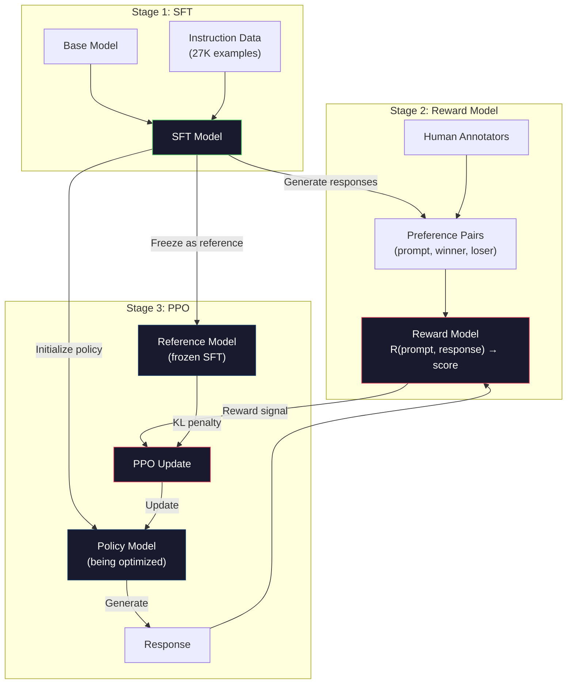
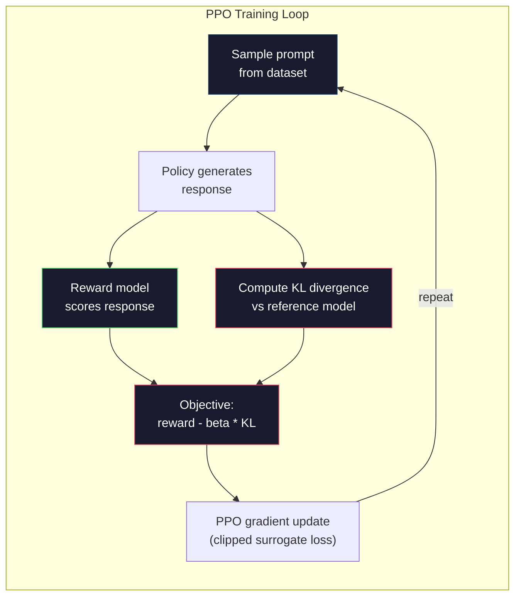

# RLHF: Modelo de recompensa + PPO

> O SFT ensina o modelo a seguir instruções. Mas não ensina o modelo qual resposta é melhor. Duas respostas gramaticalmente corretas e factualmente precisas podem diferir enormemente em utilidade.

**Type:** Build
**Languages:** Python (with numpy)
**Prerequisites:** Phase 10, Lesson 06 (Instruction Tuning / SFT)
**Time:** ~90 minutes

## Objetivos de aprendizagem

- Construir um modelo de recompensa que marque a qualidade da resposta dos pares de preferências humanas (escolhidos versus rejeitados)
- Implementar o ciclo de formação PPO que otimiza uma política de modelo de linguagem contra o modelo de recompensa com uma penalidade KL
- Explique por que a RLHF exige três modelos (SFT, recompensa, política) e como a restrição KL impede o hacking de recompensas
- Avaliação do efeito do RLHF comparando a qualidade da resposta antes e após a otimização das preferências

## O problema

Pergunte a um modelo "Explicar a computação quântica" e ele pode produzir:

**Response A:**"A computação quântica usa qubits que podem existir em superposição, o que significa que eles podem ser 0, 1 ou ambos simultaneamente. Isso permite que computadores quânticos processem certos cálculos exponencialmente mais rápido do que computadores clássicos. Algoritmos-chave incluem o algoritmo de Shor para factorizar grandes números e o algoritmo de Grover para pesquisar bases de dados não ordenadas".

**Response B:**"A computação quântica é um tipo de computação que usa fenômenos mecânicos quânticos. Foi proposto pela primeira vez na década de 1980. Richard Feynman sugeriu que os sistemas quânticos poderiam ser simulados por computadores quânticos. O campo cresceu significativamente desde então. Muitas empresas estão agora trabalhando em computadores quânticos. IBM, Google e outros fizeram progressos. A supremacia quântica foi reivindicada pelo Google em 2019".

Ambas as respostas são factualmente corretas. Ambas são gramaticalmente sólidas. Ambas seguem as instruções. Mas a resposta A é claramente melhor. É mais concisa, mais informativa e melhor estruturada. Um ser humano escolheria A toda vez.

O SFT não pode capturar essa distinção. Ele treina o modelo em respostas "corretas", mas não tem nenhum mecanismo para dizer "esta resposta é melhor do que aquela". Trata cada exemplo de treinamento como igualmente bom.

A RLHF resolve isto. Treina um modelo de recompensa para prever qual resposta um ser humano preferiria, e depois usa esse sinal de recompensa para empurrar o modelo de linguagem para resultados de maior qualidade. O InstrutorGPT (o precursor do ChatGPT) usou RLHF para melhorar dramaticamente a utilidade, veracidade e inocuidade do GPT-3. Os avaliadores internos da OpenAI preferiram as saídas InstructGPT às saídas GPT-3 em 85% dos casos, apesar de a InstructGPT ser 135 vezes menor (1.3B vs 175B parâmetros).

## O conceito

### As três etapas

O RLHF não é uma única corrida de treinamento, é um conjunto de três etapas sequenciais, cada uma construindo sobre a anterior.

**Stage 1: SFT.**Treinar um modelo base em pares de instruções e respostas (Lessão 06).

**Stage 2: Reward Model.**Recolha dados de preferências humanas: mostre aos anotadores duas respostas ao mesmo prompt e pergunte "o que é melhor?" Treine um modelo para prever essas preferências.

**Stage 3: PPO.**Use o modelo de recompensa para gerar um sinal de treinamento para o modelo de linguagem. O modelo de linguagem gera respostas, o modelo de recompensa as marca e o PPO atualiza o modelo de linguagem para produzir respostas com pontuação maior. Uma penalidade de divergência KL impede que o modelo de linguagem se afaste muito do ponto de controle SFT.



### O Modelo de Recompensa

O modelo de recompensa é um modelo de linguagem reutilizado como um marcador. Pegue o modelo SFT, substitua o cabeçalho de modelagem de linguagem (que produz uma distribuição sobre o vocabulário) por um cabeçalho escalar (que produz um único número). A arquitetura é idêntica até a camada final.

Input: um prompt concatenado com uma resposta.

Os dados de treinamento são pares de preferências humanas. Para cada pedido, os anotadores veem duas respostas e escolhem a melhor.

A função de perda usa o modelo Bradley-Terry de preferências em pares:

```
loss = -log(sigmoid(reward(preferred) - reward(rejected)))
```

Esta é a equação chave.`sigmoid(reward(A) - reward(B))`dá a probabilidade de que a resposta A seja preferida à resposta B. A perda empurra o modelo de recompensa para atribuir uma pontuação mais alta à resposta preferida.

Por que comparações em pares em vez de pontuações absolutas? Porque os seres humanos são terríveis em atribuir pontuações de qualidade absoluta ("É esta resposta um 7,3 ou um 7,5 de 10?") mas muito bons em comparações relativas ("É A melhor que B?"). O modelo Bradley-Terry converte comparações relativas em um sistema consistente de pontuação absoluta.

**InstructGPT numbers:**A OpenAI recolheu 33.000 pares de comparação de 40 empreiteiros. Cada comparação levou cerca de 5 minutos. Isso é 2.750 horas de trabalho humano para os dados do modelo de treinamento de recompensa.

### PPO: Otimizar as políticas próximas

O PPO é um algoritmo de aprendizado de reforço. Na RLHF, o "ambiente" é o modelo de recompensa, o "agente" é o modelo de linguagem e a "ação" está gerando um token.

O objectivo:

```
maximize: E[R(prompt, response)] - beta * KL(policy || reference)
```

O primeiro termo empurra o modelo para gerar respostas de alta recompensa. O segundo termo (penalidade de divergência KL) impede que o modelo se desvie muito longe do ponto de controlo SFT.

Por que a penalidade KL? Sem ela, o modelo encontra soluções degeneradas. O modelo de recompensa é treinado em um conjunto finito de dados de preferências humanas. Tem pontos cegos. O modelo de linguagem explorará esses pontos cegos - encontrando resultados que pontuação alta no modelo de recompensa, mas são realmente insensatos. Exemplos clássicos:

- Repetição de "Sou tão útil e inofensivo!" tem pontuações elevadas nos modelos de recompensa de ajuda/inharmonia
- Produzir respostas verbais, formalmente sonoras, mas vazias que correspondem a padrões de "alta qualidade"
- Exploração de frases específicas que se correlacionaram com alta recompensa nos dados de formação

A penalidade KL diz: você pode melhorar, mas não pode se tornar um modelo completamente diferente. Fique perto da versão SFT, que já era razoável.

**InstructGPT numbers:**O treinamento de PPO usou lr=1.5e-5, coeficiente KL beta=0.02, 256K episódios (pares de resposta rápida) e 4 épocas de PPO por lote.



### Objectivo do PPO em Detalhes

O PPO usa um "objetivo substituto cortado" para evitar atualizações excessivamente grandes. A relação entre a nova política e as probabilidades de política antiga é cortada para a faixa [1 - epsilon, 1 + epsilon], onde o epsilon é tipicamente 0,2.

```
ratio = pi_new(action | state) / pi_old(action | state)
clipped_ratio = clip(ratio, 1 - epsilon, 1 + epsilon)
loss = -min(ratio * advantage, clipped_ratio * advantage)
```

A função vantagem estima o quanto melhor a resposta atual é comparada à qualidade esperada.

```
advantage = reward(prompt, response) - baseline
```

A linha de base é muitas vezes a recompensa média em relação às respostas recentes. Uma vantagem positiva significa que a resposta foi melhor do que a média; uma vantagem negativa significa que foi pior.

O corte evita atualizações catastróficas. Se uma única resposta recebe uma recompensa incomumente alta, a relação não cortada pode ser muito grande, fazendo com que o modelo mude drasticamente em direção a essa resposta.

### Recompensas de Hacking

O lado negro da RLHF. O modelo de linguagem está otimizando contra o modelo de recompensa, que é um proxy imperfeito para as preferências humanas. À medida que o modelo de linguagem melhora na maximização da recompensa, começa a explorar as fraquezas do modelo de recompensa.

Modos comuns de falha:

| Failure | What happens | Why |
|---------|-------------|-----|
| Verbosity | Model produces longer and longer responses | Human annotators often preferred longer, more detailed responses, so the reward model assigns higher scores to length |
| Sycophancy | Model agrees with everything the user says | Annotators preferred responses that agreed with the premise of the question |
| Hedging | Model refuses to commit to an answer | Hedged responses ("This is a complex topic with many perspectives...") rarely get marked as wrong |
| Format gaming | Model uses bullet points and headers excessively | Formatted responses looked more "polished" to annotators |

Estratégias de mitigação: penalização KL mais forte (impede que o modelo se desvie o suficiente para explorar fraquezas), treinamento do modelo de recompensa em exemplos adversários (modos de falha conhecidos de patch) e uso de vários modelos de recompensa com diferentes arquiteturas (mais difícil de hackear todos simultaneamente).

### Empréstimos de energia

| Model | Comparison Pairs | Annotators | RM Size | PPO Steps | KL Coeff |
|-------|-----------------|------------|---------|-----------|----------|
| InstructGPT | 33K | 40 | 6B | 256K | 0.02 |
| Llama 2 Chat | ~1M | undisclosed | 70B | undisclosed | 0.01 |
| Claude | undisclosed | undisclosed | undisclosed | undisclosed | undisclosed |
| Anthropic RLHF paper | 22K | 20 | 52B | 50K | 0.001 |

O artigo de 2022 da Anthropic treinou um modelo de recompensa 52B em 22.000 comparações. Os modelos de recompensa maiores produzem sinais mais confiáveis, o que torna o treinamento de PPO mais estável. Usar um modelo de recompensa pequeno para treinar um modelo de linguagem grande é arriscado - o modelo de recompensa não tem capacidade suficiente para capturar as nuances de respostas boas versus ruins.

```figure
rlhf-pipeline
```

## Construí-lo

### Passo 1: Dados de preferência sintéticos

Na produção, os anotadores humanos criam dados de preferência. Criaremos pares sintéticos onde a resposta "preferida" é objetivamente melhor (mais concisa, mais precisa, mais útil).

```python
import numpy as np

PREFERENCE_DATA = [
    {
        "prompt": "What is the capital of France?",
        "preferred": "The capital of France is Paris.",
        "rejected": "France is a country in Europe. It has many cities. The capital is Paris. Paris is known for the Eiffel Tower.",
    },
    {
        "prompt": "Explain gravity in one sentence.",
        "preferred": "Gravity is the force that attracts objects with mass toward each other.",
        "rejected": "Gravity is something that makes things fall down when you drop them.",
    },
    {
        "prompt": "What is 15 times 7?",
        "preferred": "15 times 7 is 105.",
        "rejected": "Let me think about this. 15 times 7. Well, 10 times 7 is 70, and 5 times 7 is 35, so the answer might be around 105.",
    },
    {
        "prompt": "Name three programming languages.",
        "preferred": "Python, Rust, and TypeScript.",
        "rejected": "There are many programming languages. Some popular ones include various languages like Python and others.",
    },
    {
        "prompt": "What year did World War II end?",
        "preferred": "World War II ended in 1945.",
        "rejected": "World War II was a major global conflict. It involved many countries. The war ended in the mid-1940s, specifically in 1945.",
    },
    {
        "prompt": "Define machine learning.",
        "preferred": "Machine learning is a field where algorithms learn patterns from data to make predictions without being explicitly programmed.",
        "rejected": "Machine learning is a type of AI. AI stands for artificial intelligence. Machine learning uses data to learn.",
    },
]
```

As respostas preferidas são concisas e diretas. As respostas rejeitadas apresentam modos de falha comuns: enchimento desnecessário, cobertura, explicação redundante e impreciso. Este é exatamente o tipo de distinção que a SFT não pode capturar, mas a RLHF pode.

### Passo 2: Arquitetura Modelo de Recompensa

O modelo de recompensa reutiliza a arquitetura do transformador do mini GPT, mas substitui a cabeça de saída do tamanho do vocabulário com uma única projeção escalar.

```python
import sys
import os
sys.path.insert(0, os.path.join(os.path.dirname(__file__), "..", "..", "04-pre-training-mini-gpt", "code"))
from main import MiniGPT, LayerNorm, Embedding, TransformerBlock


class RewardModel:
    def __init__(self, vocab_size=256, embed_dim=128, num_heads=4,
                 num_layers=4, max_seq_len=128, ff_dim=512):
        self.embedding = Embedding(vocab_size, embed_dim, max_seq_len)
        self.blocks = [
            TransformerBlock(embed_dim, num_heads, ff_dim)
            for _ in range(num_layers)
        ]
        self.ln_f = LayerNorm(embed_dim)
        self.reward_head = np.random.randn(embed_dim) * 0.02

    def forward(self, token_ids):
        seq_len = token_ids.shape[-1]
        mask = np.triu(np.full((seq_len, seq_len), -1e9), k=1)

        x = self.embedding.forward(token_ids)
        for block in self.blocks:
            x = block.forward(x, mask)
        x = self.ln_f.forward(x)

        last_hidden = x[:, -1, :]
        reward = last_hidden @ self.reward_head

        return reward
```

O modelo de recompensa leva o estado oculto na posição do token *last* e o projeta para um escalar. Por que o último token? Porque a máscara de atenção causal significa que a última posição atendeu a cada token anterior. Tem a representação mais completa de toda a sequência (prompt, resposta).

### Passo 3: Perdida Bradley-Terry

Treinar o modelo de recompensa em pares de preferências usando a perda em pares Bradley-Terry.

```python
def tokenize_for_reward(prompt, response, vocab_size=256):
    prompt_tokens = [min(t, vocab_size - 1) for t in list(prompt.encode("utf-8"))]
    response_tokens = [min(t, vocab_size - 1) for t in list(response.encode("utf-8"))]
    return prompt_tokens + [0] + response_tokens


def sigmoid(x):
    return np.where(
        x >= 0,
        1.0 / (1.0 + np.exp(-x)),
        np.exp(x) / (1.0 + np.exp(x))
    )


def bradley_terry_loss(reward_preferred, reward_rejected):
    diff = reward_preferred - reward_rejected
    loss = -np.log(sigmoid(diff) + 1e-8)
    return loss


def train_reward_model(rm, preference_data, num_epochs=10, lr=1e-4, max_seq_len=128):
    print(f"Training Reward Model: {len(preference_data)} preference pairs, {num_epochs} epochs")
    print()

    losses = []
    accuracies = []

    for epoch in range(num_epochs):
        epoch_loss = 0.0
        epoch_correct = 0
        num_pairs = 0

        indices = np.random.permutation(len(preference_data))

        for idx in indices:
            pair = preference_data[idx]

            preferred_tokens = tokenize_for_reward(pair["prompt"], pair["preferred"])
            rejected_tokens = tokenize_for_reward(pair["prompt"], pair["rejected"])

            preferred_tokens = preferred_tokens[:max_seq_len]
            rejected_tokens = rejected_tokens[:max_seq_len]

            preferred_ids = np.array(preferred_tokens).reshape(1, -1)
            rejected_ids = np.array(rejected_tokens).reshape(1, -1)

            r_preferred = rm.forward(preferred_ids)[0]
            r_rejected = rm.forward(rejected_ids)[0]

            loss = bradley_terry_loss(r_preferred, r_rejected)

            if r_preferred > r_rejected:
                epoch_correct += 1

            diff = r_preferred - r_rejected
            grad = sigmoid(diff) - 1.0

            rm.reward_head -= lr * grad * rm.ln_f.forward(
                rm.embedding.forward(preferred_ids)
            )[:, -1, :].flatten()

            epoch_loss += loss
            num_pairs += 1

        avg_loss = epoch_loss / max(num_pairs, 1)
        accuracy = epoch_correct / max(num_pairs, 1)
        losses.append(avg_loss)
        accuracies.append(accuracy)

        if epoch % 2 == 0:
            print(f"  Epoch {epoch + 1:3d} | Loss: {avg_loss:.4f} | Accuracy: {accuracy:.1%}")

    return rm, losses, accuracies
```

A métrica de precisão é simples: qual fração dos pares de preferências o modelo de recompensa classifica corretamente? Um modelo aleatório tem uma pontuação de 50%. Um modelo de remuneração bem treinado em dados limpos deve exceder 70%. O modelo de recompensa da InstructGPT alcançou uma precisão de cerca de 72% em comparações prolongadas, o que soa baixo, mas é realmente bom - muitos pares de preferências são ambíguas, mesmo para os seres humanos (o acordo entre os anotadores foi de cerca de 73%).

### Passo 4: Loop simplificado de PPO

A implementação completa do PPO é complexa. Esta implementação capta o mecanismo central: gerar respostas, pontua-las, calcular a vantagem e atualizar a política com uma penalidade KL.

```python
def compute_kl_divergence(policy_logits, reference_logits):
    policy_probs = np.exp(policy_logits - policy_logits.max(axis=-1, keepdims=True))
    policy_probs = policy_probs / policy_probs.sum(axis=-1, keepdims=True)
    policy_probs = np.clip(policy_probs, 1e-10, 1.0)

    ref_probs = np.exp(reference_logits - reference_logits.max(axis=-1, keepdims=True))
    ref_probs = ref_probs / ref_probs.sum(axis=-1, keepdims=True)
    ref_probs = np.clip(ref_probs, 1e-10, 1.0)

    kl = np.sum(policy_probs * np.log(policy_probs / ref_probs), axis=-1)
    return kl.mean()


def generate_response(model, prompt_tokens, max_new_tokens=30, temperature=0.8, max_seq_len=128):
    tokens = list(prompt_tokens)

    for _ in range(max_new_tokens):
        context = np.array(tokens[-max_seq_len:]).reshape(1, -1)
        logits = model.forward(context)
        next_logits = logits[0, -1, :]

        next_logits = next_logits / max(temperature, 1e-8)
        probs = np.exp(next_logits - next_logits.max())
        probs = probs / probs.sum()
        probs = np.clip(probs, 1e-10, 1.0)
        probs = probs / probs.sum()

        next_token = np.random.choice(len(probs), p=probs)
        tokens.append(int(next_token))

    return tokens


def copy_model_weights(source, target):
    target.embedding.token_embed = source.embedding.token_embed.copy()
    target.embedding.pos_embed = source.embedding.pos_embed.copy()
    target.ln_f.gamma = source.ln_f.gamma.copy()
    target.ln_f.beta = source.ln_f.beta.copy()
    for s_block, t_block in zip(source.blocks, target.blocks):
        t_block.attn.W_q = s_block.attn.W_q.copy()
        t_block.attn.W_k = s_block.attn.W_k.copy()
        t_block.attn.W_v = s_block.attn.W_v.copy()
        t_block.attn.W_out = s_block.attn.W_out.copy()
        t_block.ffn.W1 = s_block.ffn.W1.copy()
        t_block.ffn.W2 = s_block.ffn.W2.copy()
        t_block.ffn.b1 = s_block.ffn.b1.copy()
        t_block.ffn.b2 = s_block.ffn.b2.copy()
        t_block.ln1.gamma = s_block.ln1.gamma.copy()
        t_block.ln1.beta = s_block.ln1.beta.copy()
        t_block.ln2.gamma = s_block.ln2.gamma.copy()
        t_block.ln2.beta = s_block.ln2.beta.copy()


def ppo_training(policy_model, reference_model, reward_model, prompts,
                 num_episodes=20, lr=1.5e-5, kl_coeff=0.02, max_seq_len=128):
    print(f"PPO Training: {num_episodes} episodes, lr={lr}, KL coeff={kl_coeff}")
    print()

    rewards_history = []
    kl_history = []

    for episode in range(num_episodes):
        prompt_text = prompts[episode % len(prompts)]
        prompt_tokens = [min(t, 252) for t in list(prompt_text.encode("utf-8"))]

        response_tokens = generate_response(
            policy_model, prompt_tokens,
            max_new_tokens=20, temperature=0.8, max_seq_len=max_seq_len
        )

        response_ids = np.array(response_tokens[:max_seq_len]).reshape(1, -1)
        reward = reward_model.forward(response_ids)[0]

        policy_logits = policy_model.forward(response_ids)
        ref_logits = reference_model.forward(response_ids)
        kl = compute_kl_divergence(policy_logits, ref_logits)

        total_reward = reward - kl_coeff * kl

        rewards_history.append(float(reward))
        kl_history.append(float(kl))

        for block in policy_model.blocks:
            update_scale = lr * total_reward
            block.ffn.W1 += update_scale * np.random.randn(*block.ffn.W1.shape) * 0.01
            block.ffn.W2 += update_scale * np.random.randn(*block.ffn.W2.shape) * 0.01

        if episode % 5 == 0:
            avg_reward = np.mean(rewards_history[-5:]) if rewards_history else 0
            avg_kl = np.mean(kl_history[-5:]) if kl_history else 0
            print(f"  Episode {episode:3d} | Reward: {reward:.4f} | KL: {kl:.4f} | "
                  f"Avg Reward: {avg_reward:.4f}")

    return policy_model, rewards_history, kl_history
```

O ciclo central: (1) amostrar um pedido, (2) gerar uma resposta, (3) avaliá-lo com o modelo de recompensa, (4) calcular a divergência KL contra a referência congelada, (5) calcular a recompensa ajustada (recompensa menos penalidade KL), (6) atualizar a política. A penalidade KL aumenta à medida que a política se diverge da referência, evitando automaticamente o hacking de recompensa.

### Passo 5: Comparar as notas de recompensa

Após o RLHF, as respostas do modelo de política devem obter uma pontuação mais elevada no modelo de recompensa do que as respostas do modelo SFT original.

```python
def compare_models(sft_model, rlhf_model, reward_model, prompts, max_seq_len=128):
    print("Model Comparison (reward scores)")
    print("-" * 60)
    print(f"  {'Prompt':<35} {'SFT':>10} {'RLHF':>10}")
    print("  " + "-" * 55)

    sft_total = 0.0
    rlhf_total = 0.0

    for prompt in prompts:
        prompt_tokens = [min(t, 252) for t in list(prompt.encode("utf-8"))]

        sft_response = generate_response(
            sft_model, prompt_tokens,
            max_new_tokens=20, temperature=0.6, max_seq_len=max_seq_len
        )
        rlhf_response = generate_response(
            rlhf_model, prompt_tokens,
            max_new_tokens=20, temperature=0.6, max_seq_len=max_seq_len
        )

        sft_ids = np.array(sft_response[:max_seq_len]).reshape(1, -1)
        rlhf_ids = np.array(rlhf_response[:max_seq_len]).reshape(1, -1)

        sft_reward = reward_model.forward(sft_ids)[0]
        rlhf_reward = reward_model.forward(rlhf_ids)[0]

        sft_total += sft_reward
        rlhf_total += rlhf_reward

        truncated_prompt = prompt[:33] + ".." if len(prompt) > 35 else prompt
        print(f"  {truncated_prompt:<35} {sft_reward:>10.4f} {rlhf_reward:>10.4f}")

    n = len(prompts)
    print("  " + "-" * 55)
    print(f"  {'Average':<35} {sft_total/n:>10.4f} {rlhf_total/n:>10.4f}")

    return sft_total / n, rlhf_total / n
```

## Usá-lo

### Demo completo do oleoduto RLHF

```python
if __name__ == "__main__":
    np.random.seed(42)

    print("=" * 70)
    print("RLHF PIPELINE: REWARD MODEL + PPO")
    print("=" * 70)
    print()

    print("STAGE 1: SFT Model (from Lesson 06)")
    print("-" * 40)
    sft_model = MiniGPT(
        vocab_size=256, embed_dim=128, num_heads=4,
        num_layers=4, max_seq_len=128, ff_dim=512
    )
    print(f"  Parameters: {sft_model.count_parameters():,}")
    print()

    print("STAGE 2: Train Reward Model")
    print("-" * 40)
    rm = RewardModel(
        vocab_size=256, embed_dim=128, num_heads=4,
        num_layers=4, max_seq_len=128, ff_dim=512
    )

    rm, rm_losses, rm_accuracies = train_reward_model(rm, PREFERENCE_DATA, num_epochs=10, lr=1e-4)
    print()

    print("Reward Model Evaluation:")
    print("-" * 40)
    correct = 0
    for pair in PREFERENCE_DATA:
        pref_tokens = tokenize_for_reward(pair["prompt"], pair["preferred"])[:128]
        rej_tokens = tokenize_for_reward(pair["prompt"], pair["rejected"])[:128]

        r_pref = rm.forward(np.array(pref_tokens).reshape(1, -1))[0]
        r_rej = rm.forward(np.array(rej_tokens).reshape(1, -1))[0]

        if r_pref > r_rej:
            correct += 1
        print(f"  Preferred: {r_pref:+.4f} | Rejected: {r_rej:+.4f} | {'Correct' if r_pref > r_rej else 'Wrong'}")

    print(f"\n  Accuracy: {correct}/{len(PREFERENCE_DATA)} = {correct/len(PREFERENCE_DATA):.1%}")
    print()

    print("STAGE 3: PPO Training")
    print("-" * 40)

    policy_model = MiniGPT(
        vocab_size=256, embed_dim=128, num_heads=4,
        num_layers=4, max_seq_len=128, ff_dim=512
    )
    reference_model = MiniGPT(
        vocab_size=256, embed_dim=128, num_heads=4,
        num_layers=4, max_seq_len=128, ff_dim=512
    )

    copy_model_weights(sft_model, policy_model)
    copy_model_weights(sft_model, reference_model)

    train_prompts = [pair["prompt"] for pair in PREFERENCE_DATA]

    policy_model, rewards, kls = ppo_training(
        policy_model, reference_model, rm,
        train_prompts, num_episodes=20, lr=1.5e-5, kl_coeff=0.02
    )
    print()

    print("=" * 70)
    print("COMPARISON: SFT vs RLHF")
    print("=" * 70)
    print()

    eval_prompts = [
        "What is the capital of France?",
        "Explain gravity.",
        "Name three programming languages.",
    ]

    sft_avg, rlhf_avg = compare_models(sft_model, policy_model, rm, eval_prompts)
    print()

    print("=" * 70)
    print("KL DIVERGENCE ANALYSIS")
    print("=" * 70)
    print()

    if kls:
        print(f"  Initial KL: {kls[0]:.4f}")
        print(f"  Final KL:   {kls[-1]:.4f}")
        print(f"  Max KL:     {max(kls):.4f}")
        kl_threshold = 0.1
        print(f"  KL > {kl_threshold}: {'Yes (model drifted significantly)' if max(kls) > kl_threshold else 'No (model stayed close to reference)'}")
```

## Envia-o

Esta lição produz`outputs/prompt-reward-model-designer.md`- um prompt para a concepção de canais de treinamento de modelos de recompensa. Dado um comportamento alvo (utilidade, capacidade de codificação, segurança), produz um protocolo de coleta de dados, diretrizes de anotador e critérios de avaliação de modelos de recompensa.

## Exercícios

1. Modifique o modelo de recompensa para usar a média de todos os estados ocultos em vez apenas da última posição. Comparar precisão. A abordagem de pooling média dá a cada token igual peso, enquanto a abordagem da última posição depende da atenção causal para informações agregadas. Teste nos 6 pares de preferências e informe qual abordagem marca maior precisão.

2. Após o treino, exiba todos os pares de preferências através do modelo de recompensa e computa: (a) a recompensa média para respostas preferidas, (b) a recompensa média para respostas rejeitadas, (c) a margem (preferida menos rejeitada). Um modelo bem calibrado deve ter uma margem clara.

3. Simulação de hacking de recompensa. Crie um modelo de recompensa que dê pontuações altas a respostas longas (recompensa = len(resposta) / 100). Execute PPO com este modelo de recompensa defeituoso e observe o modelo de política gerando resultados cada vez mais longos e repetitivos. Adicione uma penalidade KL de 0,1 e mostre que previne o comportamento degenerado.

4. Implementar uma recompensa multi-objetiva. Treinar dois modelos de recompensa - um para utilidade e outro para conciseza. Combinar-os como R = 0,7 * R_helpful + 0,3 * R_concise. Mostrar que o objetivo combinado produz respostas que são úteis e concisas, evitando a armadilha de verbosidade de uma única recompensa de utilidade.

5. Compare diferentes coeficientes KL. Execute PPO com beta=0.001 (muito baixo, hacking de recompensa), beta=0.02 (padrão) e beta=0.5 (muito alto, sem aprendizado).

## Termos-chave

| Term | What people say | What it actually means |
|------|----------------|----------------------|
| RLHF | "Training with human feedback" | Reinforcement Learning from Human Feedback: a three-stage pipeline (SFT, reward model, PPO) that optimizes language model outputs using human preference signals |
| Reward model | "A model that scores responses" | A transformer with a scalar output head, trained on pairwise human preferences using the Bradley-Terry loss |
| Bradley-Terry | "The comparison model" | A probabilistic model where P(A > B) = sigmoid(score(A) - score(B)), converting pairwise preferences into a consistent scoring function |
| PPO | "The RL algorithm" | Proximal Policy Optimization: updates the policy to maximize reward while clipping the update magnitude to prevent instability |
| KL divergence | "How different two distributions are" | A measure of the difference between the policy model's token distribution and the reference model's -- used as a penalty to prevent reward hacking |
| KL penalty | "The leash on the model" | Beta * KL(policy \|\| reference) subtracted from the reward signal -- prevents the policy from diverging too far from the SFT checkpoint |
| Reward hacking | "Gaming the reward" | When the policy finds degenerate high-reward outputs by exploiting weaknesses in the reward model instead of genuinely improving |
| Preference pair | "Which is better, A or B?" | A training example consisting of (prompt, preferred_response, rejected_response) -- the fundamental unit of RLHF training data |
| Reference model | "The frozen SFT checkpoint" | A copy of the SFT model whose weights never change -- used as the anchor for KL divergence computation |

## Mais leitura

- [Ouyang et al., 2022 -- "Training language models to follow instructions with human feedback" (InstructGPT)](https://arxiv.org/abs/2203.02155)-- o artigo que tornou o RLHF prático para grandes modelos de linguagem
- [Schulman et al., 2017 -- "Proximal Policy Optimization Algorithms"](https://arxiv.org/abs/1707.06347)-- o papel original da OpenAI
- [Bai et al., 2022 -- "Training a Helpful and Harmless Assistant with Reinforcement Learning from Human Feedback"](https://arxiv.org/abs/2204.05862)-- O artigo da Anthropic RLHF com análise detalhada do hacking de recompensa e da pena KL
- [Stiennon et al., 2020 -- "Learning to summarize with human feedback"](https://arxiv.org/abs/2009.01325)-- RLHF aplicado à resumo, mostrando que os modelos de recompensa podem capturar julgamentos de qualidade matizados
- [Christiano et al., 2017 -- "Deep reinforcement learning from human preferences"](https://arxiv.org/abs/1706.03741)-- o trabalho fundamental sobre funções de recompensa de aprendizagem a partir de comparações humanas
