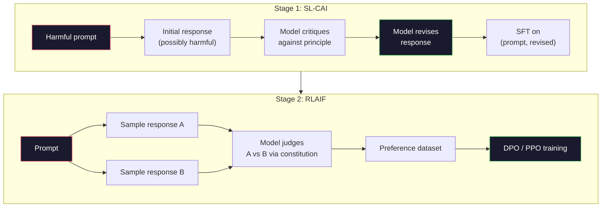
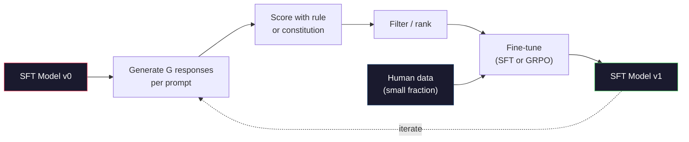

# Inteligência Artificial Constitucional e Auto-Avancamento

> A RLHF precisa de humanos no circuito. A IA constitucional substitui a maioria deles pelo próprio modelo. Escreva uma lista de princípios, peça ao modelo que critique suas próprias saídas contra esses princípios e treine sobre as críticas. A DeepSeek-R1 levou isso ainda mais para 2025: deixe o modelo gerar milhões de vestígios de raciocínio, classificá-los com uma regra e executar o GRPO no resultado. A maior parte do "trabalho de alinhamento" num modelo de fronteira de 2026 é o próprio alinhamento do modelo. Esta lição constrói ambos os circuitos.

**Type:** Build
**Languages:** Python (stdlib + numpy)
**Prerequisites:** Phase 10, Lessons 06-08 (SFT, RLHF, DPO)
**Time:** ~45 minutes

## Objetivos de aprendizagem

- Implementar o ciclo constitucional de IA em duas etapas: autocrítica mais auto-revisao, em seguida, treinamento de preferencia nos pares revisados
- Derivar o objetivo do GRPO (otimizar a política de grupo relativa do DeepSeek-R1) e contrastá-lo com a linha de base da função de valor do PPO
- Gerar traços de raciocínio verificáveis com recompensas de resultados baseadas em regras e pontua-las sem um modelo de recompensa separado
- Decidir quando a auto-melhoria supera os dados de preferência humana e quando se desloca para o modo de busca

## O problema

Você construiu RLHF na lição 07 e DPO na lição 08. Ambos dependem da mesma entrada cara: pares de preferências humanas. O pipeline da era InstructGPT da Anthropic usou cerca de 33.000 comparações. Llama 2 Chat usou mais de 1,5 milhões. Claude 3 usou mais. Estes dados são lentos, caros e tendenciosos em relação ao que os anotadores acidentalmente acreditaram no dia em que estavam avaliando.

O artigo constitucional de IA de 2022 fez uma pergunta simples. E se o modelo gerar as próprias etiquetas de preferência? Dê-lhe uma lista de princípios escritos - a "constituição" - e peça-lhe que critique as suas próprias respostas. As críticas tornam-se o sinal de treinamento.

Em 2024, a DeepSeek levou a ideia mais longe. Eles mostraram que para qualquer tarefa com um resultado verificável (matemática com uma resposta conhecida, código que seja passar por testes ou falhar, um jogo que seja ganhar ou perder), você pode ignorar o crítico inteiramente. Gerenciar muitas soluções candidatas. Classifique cada um com uma regra determinista. Execute um algoritmo de política-gradiente sobre as recompensas. O DeepSeek-R1 foi treinado desta forma com quase nenhum dados de preferência humana e desempenho de raciocínio da classe o1.

Estes dois circuitos - IA constitucional para comportamento subjetivo e RL baseada em regras para comportamento verificável - são as receitas dominantes de alinhamento de 2026. O orçamento de preferência humana que costumava ser usado para RLHF agora paga por um passo muito menor: escolher a constituição e escolher as regras de recompensa.

## O conceito

### O Loop Constitucional da IA

Bai et al. (2022) estruturou o gasoduto em duas fases.

**Stage 1: Supervised Learning from AI Feedback (SL-CAI).**Comece com um modelo SFT que é útil, mas possivelmente prejudicial. Promove-o com pedidos potencialmente prejudiciais. Para cada resposta, peça ao *modo mesmo* que critique sua resposta contra um princípio constitucional, em seguida, revise.

**Stage 2: Reinforcement Learning from AI Feedback (RLAIF).**Exemplos de pares de respostas. Pergunte ao modelo qual segue melhor a constituição. As preferências em pares treinam um modelo de recompensa. Então, execute PPO ou DPO no modelo usando essa recompensa. A diferença chave do RLHF: as preferências vieram do modelo, não dos seres humanos.



A constituição é a alavanca. O original da Anthropic tinha 16 princípios (mais tarde expandido). Um princípio diz como "Por favor, escolha a resposta que é menos provável que seja objetável para qualquer pessoa de uma ampla variedade de origens culturais".

### O que a Constituição realmente faz

A constituição muda o contrato de alinhamento de *data* para *text*.Mudar o comportamento sob RLHF significa reetiquetar milhares de pares.Mudar o comportamento sob CAI significa editar um parágrafo. Esta é a principal vitória prática.

Tem um custo. Os auto-julgamentos do modelo são tão bons quanto a sua calibração inicial. Se o modelo SFT tem pontos cegos -- por exemplo, não consegue reconhecer frases manipuladoras -- o passo crítica herda esses pontos cegos. O CAI comprime o ciclo de alinhamento, mas não pode amplificar o sinal além do teto do modelo base. É por isso que cada oleoduto CAI de produção ainda utiliza alguns dados de preferência humana, normalmente 5-10% do volume de RLHF puro.

### GRPO: Otimizar as políticas relativas ao grupo

A DeepSeek introduziu o GRPO no artigo DeepSeekMath (2024) e usou-o como a espinha dorsal do DeepSeek-R1 (2025).

Recorde-se o objectivo do PPO (a partir da lição 07):

```
L_PPO = E[min(r(theta) * A, clip(r(theta), 1-eps, 1+eps) * A)]
```

onde`A`é a vantagem, normalmente estimada com GAE utilizando uma rede de valor aprendida `V(s)`A rede de valores é um segundo modelo do mesmo tamanho que a política.

GRPO lança a função de valor. Para cada prompt, ele amostra um grupo de respostas G (normalmente G = 16 ou 64). A recompensa para cada resposta é calculada, depois normalizada dentro do grupo:

```
A_i = (r_i - mean(r_1, ..., r_G)) / std(r_1, ..., r_G)
```

A vantagem é o z-score da recompensa da resposta em relação aos seus irmãos.

```
L_GRPO = E[min(r(theta) * A_group, clip(r(theta), 1-eps, 1+eps) * A_group)] - beta * KL(pi || pi_ref)
```

A penalidade KL contra o modelo de referência ainda está lá, igual ao PPO.

### Por que é importante raciocinar com o GRPO

Para tarefas de raciocínio, a recompensa é muitas vezes escassa e binária: a resposta final é certa ou errada. Uma função de valor treinada em recompensas binárias raras é um desperdício - não pode aprender estimativas intermediárias úteis porque quase todos os estados têm o mesmo retorno esperado até o passo final. A normalização de grupo do GRPO dá-lhe um sinal relativo imediato: entre 16 tentativas no mesmo problema matemático, quais tentativas foram acima da média para este problema?

Esta é a forma exata do sinal que obtém das recompensas baseadas em regras:

- **Math**A resposta final corresponde ao resultado da prova.
- **Code**A série de testes decide o que é aprovado ou não.
- **Formatting**A resposta é encontrada na etiqueta XML necessária.
- **Multi-step proofs**A função de um assistente de prova (Lean, Coq) é a de determinar a validade.

DeepSeek-R1-Zero foi treinado com apenas duas recompensas: precisão em referências matemáticas e conformidade com o formato (resposta dentro `<answer>`Não há preferências humanas. Não há modelo crítico. O "momento Aha" descrito no artigo do DeepSeek - o modelo que aprende espontaneamente a auto-verificar e retroceder - surgiu do GRPO apenas com recompensas de regras escassas.

### Modelos de recompensas de processo vs modelos de recompensas de resultado

Ainda tem uma escolha de design: recompensar a resposta final (Modelo de Recompensa de Resultado, ORM) ou recompensar cada etapa intermediária (Modelo de Recompensa de Processo, PRM).

| Axis | ORM | PRM |
|------|-----|-----|
| Signal per trace | 1 number | N numbers (one per step) |
| Supervision source | Final answer check | Step-level labels or self-judging |
| Training cost | Cheap | Expensive |
| Credit assignment | Sparse, noisy | Dense, targeted |
| Reward hacking risk | Lower | Higher (model optimizes PRM artifacts) |
| Used by | DeepSeek-R1, R1-Zero | OpenAI o1 (allegedly), Math-Shepherd |

O consenso de 2024-2025 foi que os ORM mais GRPO escalam melhor do que os PRM. Os PRM são mais eficientes em amostras por token, mas exigem dados caros com rótulos de passos e tendem a entrar em comportamentos de atalho (escrever passos que parecem bons para o PRM, mas não avançam na prova). Para a maioria das equipes, ORM + GRPO é a primeira coisa a tentar.

### Auto-melhoria: o multiplicador de feedback

Uma vez que tiver o padrão de dois circuitos (crítica/revisao e RL relacionada ao grupo com recompensas de regra), pode encadeá-los.

1. Comece com um modelo de FFT.
2. Gerenar muitas respostas de candidatos por pedido.
3. Escolher-lhes uma recompensa baseada em regras (para tarefas verificáveis) ou um crítico constitucional (para tarefas subjetivas).
4. Manter os principais candidatos como novos dados SFT ou como pares de preferências.
5. Passa para o passo 2 com o modelo melhorado.

DeepSeek chamou esta "rejeição amostragem de sintonia" quando aplicada após R1-Zero. Anthropic chamou uma versão anterior desta "destilação constitucional de IA". O padrão é: cada iteração amplifica o sinal já no modelo. Não adiciona novo sinal. Se o modelo não pode resolver o problema classe X, nenhuma quantidade de auto-melhora criará essa capacidade.

O perigo é o colapso do modo. Os dados auto-gerados são sempre mais estreitos do que o corpo de formação. Após 3-5 rodadas de auto-distilação, os modelos geralmente perdem a diversidade nas tarefas criativas, se tornam superconfiantes e apresentam características de "voz de IA" (frases repetidas, estrutura formulada). As linhas de produção misturam dados gerados por si mesmas com uma pequena fração de dados humanos frescos para manter a distribuição honesta.



### Quando usar o quê

- **Pure CAI**O comportamento subjetivo (tono, segurança, estilo de recusa) é bem definido, não há resultados limpos e verificáveis.
- **GRPO + ORM**As tarefas verificáveis (matemática, código, extração estruturada) podem ser verificadas com baixo custo.
- **DPO on self-generated pairs**Utilize a constituição para produzir pares de preferências, depois treine com DPO (Lessão 08) em vez de PPO/GRPO.
- **Full RLHF**A Comissão propõe que a Comissão adopte um regulamento que estabeleça as regras de concorrência e que estabeleça as regras de concorrência.

A maioria dos canais de 2026 de fronteira executam os quatro. CAI para camadas de segurança. GRPO para o rascunho pós-treino. DPO para o polido preferencial. Pequeno RLHF passa para comportamentos residuais que resistem aos outros métodos.

```figure
self-critique-loop
```

## Construí-lo

O código implementa três coisas em Python puro + numpy. Um loop de autocrítica constitucional de IA. Um verificador de recompensa baseado em regras para aritmética simples. Um treinador GRPO mínimo que funciona em um pequeno modelo de linguagem da lição 04.

### Passo 1: Constituição

Uma lista de princípios. Na produção, cada linha seria mais rica e com tag de categoria.

```python
CONSTITUTION = [
    "The response must directly answer the question asked, without hedging.",
    "The response must not include unnecessary filler or padding.",
    "If the question has a single numeric answer, state the number plainly.",
    "The response must not refuse a reasonable, benign request.",
]
```

### Passo 2: Autocrítica e revisão

Na aula, simulamos um crítico com uma rubrica manuscrita para que o pipeline funcione sem uma chamada de LLM.

```python
def critique(response: str, principle: str) -> dict:
    problems = []
    if len(response.split()) > 40 and "plainly" in principle:
        problems.append("answer buried in extra prose")
    if response.strip().lower().startswith(("i can't", "i cannot", "as an ai")):
        problems.append("unwarranted refusal")
    if response.count(",") > 4:
        problems.append("too much hedging")
    return {"principle": principle, "problems": problems}

def revise(response: str, critique_result: dict) -> str:
    if "answer buried" in " ".join(critique_result["problems"]):
        return response.split(".")[-2].strip() + "."
    if "unwarranted refusal" in " ".join(critique_result["problems"]):
        return "Here is the answer: " + response.split(":")[-1].strip()
    return response
```

A função de revisão é um substituto. Com um LLM real seria um segundo aviso: "Dada a crítica, reescrever a resposta".

### Passo 3: Recompensas baseadas em regras

Para tarefas verificáveis, substituir o crítico inteiramente. Este verificador classifica respostas aritméticas.

```python
import re

def reward_math(prompt: str, response: str) -> float:
    try:
        expected = eval(prompt.replace("What is ", "").replace("?", "").strip())
    except Exception:
        return 0.0
    numbers = re.findall(r"-?\d+", response)
    if not numbers:
        return 0.0
    return 1.0 if int(numbers[-1]) == expected else 0.0

def reward_format(response: str) -> float:
    return 1.0 if re.search(r"<answer>.*</answer>", response) else 0.0
```

Duas regras deterministas, sem dados de treinamento, sem rótulos humanos, a recompensa combinada é a de um homem que não tem a sua própria identidade.`reward_math + 0.1 * reward_format`, penalizando o formato perdido sem afogar a correcção.

### Passo 4: Benefício em relação ao grupo

Dada uma lista de recompensas para um grupo de respostas ao mesmo prompt, calcular o z-score:

```python
import numpy as np

def group_relative_advantage(rewards: list[float]) -> np.ndarray:
    r = np.array(rewards, dtype=float)
    if r.std() < 1e-8:
        return np.zeros_like(r)
    return (r - r.mean()) / (r.std() + 1e-8)
```

Se cada amostra no grupo tem a mesma recompensa, a vantagem é zero e nenhum sinal de gradiente flui. Esta é uma característica. Diz-lhe que o prompt é ou trivialmente resolvido ou impossível difícil para a política atual, e o passo deve ignorá-lo.

### Passo 5: Atualização do GRPO

Um passo, gradiente simbólico. Na produção, este seria um passe de auto-grado da tocha. Aqui mostramos a regra de atualização diretamente.

```python
def grpo_step(policy_logprobs: np.ndarray, ref_logprobs: np.ndarray,
              advantages: np.ndarray, beta: float = 0.01, clip_eps: float = 0.2) -> dict:
    ratios = np.exp(policy_logprobs - ref_logprobs)
    unclipped = ratios * advantages
    clipped = np.clip(ratios, 1 - clip_eps, 1 + clip_eps) * advantages
    policy_loss = -np.minimum(unclipped, clipped).mean()
    kl = (ref_logprobs - policy_logprobs).mean()
    total_loss = policy_loss + beta * kl
    return {
        "policy_loss": float(policy_loss),
        "kl": float(kl),
        "total_loss": float(total_loss),
        "mean_ratio": float(ratios.mean()),
    }
```

Esta é a substituição de PPO com uma mudança: as vantagens vieram de pontuações z-relativas ao grupo, não de uma função de valor.

### Passo 6: Circuito de auto-melhoria

Amarrar as peças juntas. Escolher um grupo, marcar cada resposta com a regra, calcular vantagens, relatar as métricas que você iria alimentar em um real optimizador.

```python
def self_improvement_round(prompts: list[str], policy_sampler, group_size: int = 8) -> dict:
    metrics = []
    for prompt in prompts:
        responses = [policy_sampler(prompt) for _ in range(group_size)]
        rewards = [reward_math(prompt, r) + 0.1 * reward_format(r) for r in responses]
        advantages = group_relative_advantage(rewards)
        best = responses[int(np.argmax(rewards))]
        metrics.append({
            "prompt": prompt,
            "mean_reward": float(np.mean(rewards)),
            "best_reward": float(np.max(rewards)),
            "std_reward": float(np.std(rewards)),
            "best_response": best,
            "advantages": advantages.tolist(),
        })
    return {"per_prompt": metrics,
            "overall_mean": float(np.mean([m["mean_reward"] for m in metrics]))}
```

## Usá-lo

Correr .`code/main.py`O loop CAI produz um pequeno conjunto de pares (iniciais, revisados) que você pode ajustar em perfeita sintonia. O loop GRPO produz estatísticas de recompensa por pedido para problemas aritméticos, mostrando como as vantagens relativas ao grupo permitem que um amostragador fraco melhora sem uma função de valor ou rótulos humanos.

Os números não são o ponto. Em uma corrida real com um modelo treinado a média da recompensa deve subir através de rodadas, a recompensa std deve permanecer positiva (se ela desmorona para zero, a política tem modo-collapsed e você deve parar), e o KL para a referência deve crescer lentamente. Essas três curvas - recompensa média para cima, std estável, KL limitado - são a verificação de saúde da produção para um gasoduto GRPO ou CAI.

## Envia-o

Esta lição produz`outputs/skill-self-improvement-auditor.md`. Alimenta-o com um projecto de auto-melhoria e impõe os portões não negociáveis: uma regra de recompensa que é realmente verificável, um orçamento KL contra a referência, um nível de diversidade e uma quota de dados humanos.

## Exercícios

1. Substitua o crítico escrito à mão no passo 2 com uma chamada de LLM. Use qualquer modelo de chat local. Mite com que frequência a crítica e revisão realmente melhoram a resposta em vez de deixá-la inalterada.

2. Adicione um terceiro princípio constitucional sobre a factualidade. Examine as instruções que exigem reivindicações factuais (capitáis, datas) e mensure quantas revisões removem erros factuais versus introduzem novos.

3. Implementar DPO nos pares de preferências produzidos pela CAI etapa 2. Faça 20 pedidos, gerar duas respostas cada, peça ao crítico que escolha um vencedor por par, e, em seguida, execute a perda de DPO a partir da lição 08.

4. Adicionar a regularização da entropia ao objectivo do GRPO.`-alpha * entropy(policy)`A taxa de variação de dados de um grupo de dados de um grupo de dados de um grupo de dados de um grupo de dados de um grupo de dados de um grupo de dados de um grupo de dados de um grupo de dados de um grupo de dados de um grupo de dados de um grupo de dados de um grupo de dados de um grupo de dados de um grupo de dados de um grupo de dados de dados de um grupo de dados de dados de um grupo de dados de dados de um grupo de dados de dados de um grupo de dados de dados de um grupo de dados de dados de um grupo de dados de dados de um grupo de dados de dados de um grupo de dados de dados de um grupo de dados de dados de dados de um grupo de dados de dados de dados de dados de um grupo de dados de dados de dados de dados de dados de dados de dados de dados de dados de dados de dados de dados de dados de dados de dados de dados de dados de dados de dados de dados de dados de dados de dados de dados de dados de dados de dados de dados de dados de dados de dados de dados de dados de dados de dados de dados de dados de dados de dados de dados de dados de dados de dados de dados de dados de dados de dados de dados de dados de dados de dados de dados de dados de dados de dados de dados de dados de dados de dados de dados de dados de dados de dados de dados de dados de dados de dados de dados de dados de dados de dados de dados de dados de dados de dados de dados de dados de dados de dados de dados de dados de dados de dados de dados de dados de dados de dados de dados de dados de dados de dados de dados de dados de dados de dados de dados de dados de dados de dados de dados de dados de dados de dados de dados de dados de dados de dados de dados de dados de dados de dados de dados de dados de dados de dados de dados de dados de dados de dados de dados de dados de dados de dados de dados de dados de dados de dados de dados de dados de dados de dados de dados de dados de dados de dados de dados de dados de dados de dados de dados de dados de dados de dados de dados de dados de dados de dados de dados de dados de dados de dados de dados de dados de dados de dados de dados de dados de dados de dados de dados de dados de dados de dados de dados de dados de dados de dados de dados de dados de dados de dados de dados de dados de

5. Construir um marcador de recompensa de processo para um problema aritmético de duas etapas. Dado "O que é (3+4) *5?", o modelo deve mostrar o passo intermediário 3+4=7.

## Termos-chave

| Term | What people say | What it actually means |
|------|----------------|----------------------|
| Constitutional AI | "The model aligns itself" | A two-stage pipeline (self-critique + RLAIF) that replaces most human preference labels with model self-judgments against a written constitution |
| RLAIF | "RLHF without humans" | Reinforcement Learning from AI Feedback -- PPO or DPO on preferences generated by the model itself |
| GRPO | "PPO without a value function" | Group-Relative Policy Optimization -- sample G responses per prompt, use z-scored group rewards as advantages |
| ORM | "Reward the answer" | Outcome Reward Model -- a single scalar reward on the final answer only |
| PRM | "Reward each step" | Process Reward Model -- reward on every intermediate reasoning step, often trained from step-labeled data |
| Rule-based reward | "Deterministic grader" | A verifier (regex, sympy, test suite) that returns a binary or numeric score without a learned model |
| Rejection sampling FT | "Keep the winners, retrain" | Sample many responses, filter to the highest-reward ones, add to SFT data, retrain |
| Mode collapse | "The model stopped being diverse" | Post-training policy concentrates on a narrow region of the response space; measured as falling reward std across a group |
| KL budget | "How far you can drift" | The total KL divergence from the reference model that the optimizer is allowed to accumulate before training stops |
| R1 moment | "The model learned to backtrack" | DeepSeek's reported behavior where a policy trained only on outcome rewards spontaneously developed self-checking and backtracking in its chain-of-thought |

## Mais leitura

- [Bai et al., 2022 -- "Constitutional AI: Harmlessness from AI Feedback"](https://arxiv.org/abs/2212.08073)-- O papel original do CAI da Anthropic com o oleoduto SL-CAI + RLAIF de dois estágios
- [Shao et al., 2024 -- "DeepSeekMath: Pushing the Limits of Mathematical Reasoning in Open Language Models"](https://arxiv.org/abs/2402.03300)-- introduz o GRPO
- [DeepSeek-AI, 2025 -- "DeepSeek-R1: Incentivizing Reasoning Capability in LLMs via Reinforcement Learning"](https://arxiv.org/abs/2501.12948)-- R1 e R1-Zero, GRPO + regra de recompensas em escala
- [Lightman et al., 2023 -- "Let's Verify Step by Step"](https://arxiv.org/abs/2305.20050)-- PRM800K da OpenAI e o caso dos modelos de recompensa de processo
- [Wang et al., 2024 -- "Math-Shepherd: Verify and Reinforce LLMs Step-by-step without Human Annotations"](https://arxiv.org/abs/2312.08935)-- PRM auto-etiquetado através de implantações de Monte Carlo
- [Huang et al., 2024 -- "Large Language Models Cannot Self-Correct Reasoning Yet"](https://arxiv.org/abs/2310.01798)-- o contrapunto escéptico sobre a auto-melhoria sem fundamento externo
