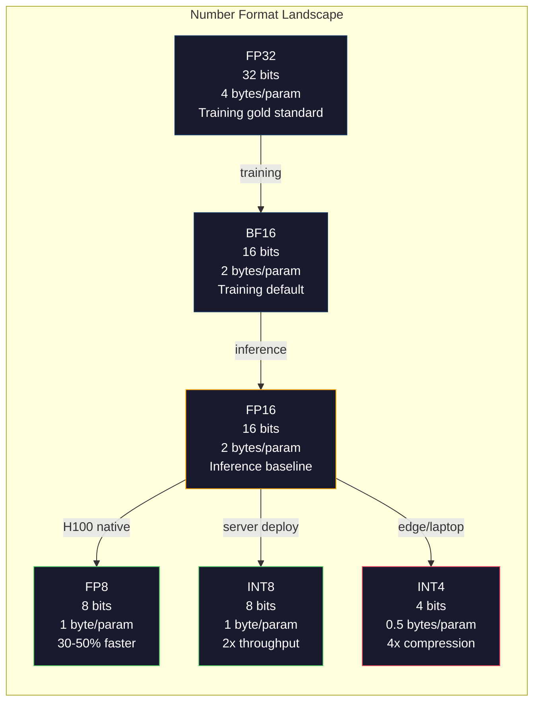
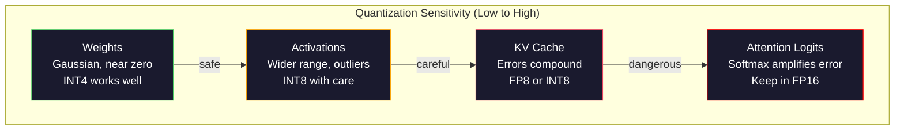
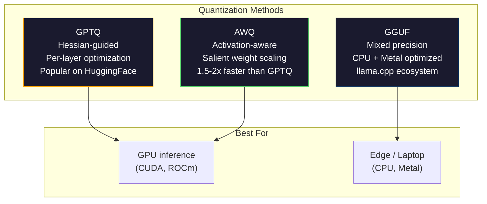

# Quantização: A criação de modelos adequados

> Um modelo 70B em FP16 precisa de 140GB. Dois A100s apenas para pesos. Quantize para FP8: uma GPU de 80GB. INT4: um MacBook.

**Type:** Build
**Languages:** Python (with numpy)
**Prerequisites:** Phase 10, Lessons 01-10 (LLMs from Scratch)
**Time:** ~120 minutes

## Objetivos de aprendizagem

- Implementar quantização simétrica e assimétrica de FP16 para INT8 e INT4, incluindo escalação por tensor e por canal
- Calcule a economia de memória da quantização e determine qual precisão se encaixa na VRAM de uma determinada GPU
- Explique a diferença entre a quantização pós-formação (PTQ) e a formação consciente da quantização (QAT)
- Aplicar GPTQ ou AWQ para quantificar um modelo real e medir a compensação entre precisão e memória em um índice de referência

## O problema

Llama 3 70B tem 70 bilhões de parâmetros. Cada parâmetro é um número de ponto flutuante de 16 bits. Isso é 140 bilhões de bytes. 140 GB. Um único A100 tem 80 GB de VRAM. Você não pode nem carregar os pesos, muito menos executar inferências, em uma única GPU. Você precisa de dois A100 a $ 2 / hora cada apenas para servir um modelo.

Mas 16 bits por parâmetro é um desperdício. A maioria dos pesos em um cluster de rede neural perto de zero. A gama dinâmica completa de FP16 (de 0,000000059 a 65,504) é quase inteiramente desutilizada. Se você medir a distribuição real de pesos no Llama 3 70B, 95% deles caem entre -0,1 e +0,1.

Quantização substitui números de alta precisão por números de baixa precisão. FP16 a FP8 reduz a memória pela metade. FP16 a INT4 reduz a memória para um quarto. Esse modelo de 140 GB torna-se 35 GB. Ele cabe em uma única GPU de consumo.

O custo é precisão. Cada bit que você remove destrói informações. A questão é quanta precisão você perde e onde. Um modelo INT4 bem quantificado retém 95-99% da qualidade do original na maioria dos pontos de referência. Uma quantização ingênua para INT4 pode destruir o modelo inteiramente. A diferença é técnica.

Quantizações comunitárias de Llama 3 para INT4 com GPTQ mostram aproximadamente 1-2 pontos de perplexidade perdidos no WikiText. Mistral lançou pontos de controle FP8 de Mixtral 8x22B com perda de qualidade mensurável zero no MMLU. O formato GGUF alimenta llama.cpp, executando modelos 70B em MacBooks com chips da série M. A quantização não é um hack. É o caminho de implantação padrão para cada modelo maior que 7B.

## O conceito

### Formato numérico: o que cada bit faz

Cada número de ponto flutuante tem três partes: sinal, exponente e mantissa (também chamado significand). O sinal é um bit. O exponente determina o intervalo (quão grande ou pequeno o número pode ser). A mantissa determina a precisão (quantos pontos decimais você obtém).

```
FP32:  [1 sign] [8 exponent] [23 mantissa]  = 32 bits
FP16:  [1 sign] [5 exponent] [10 mantissa]  = 16 bits
BF16:  [1 sign] [8 exponent] [7  mantissa]  = 16 bits
FP8:   [1 sign] [4 exponent] [3  mantissa]  = 8  bits (E4M3)
FP8:   [1 sign] [5 exponent] [2  mantissa]  = 8  bits (E5M2)
INT8:  [1 sign] [7 value]                   = 8  bits (uniform steps)
INT4:  [1 sign] [3 value]                   = 4  bits (16 levels total)
```

**FP32**O treino foi feito exclusivamente em FP32. Ainda é válido para o acumulado (sums correntes durante a multiplicação de matriz).

**FP16**O exponente reduz para 5 bits, reduzindo a faixa dramaticamente (valor máximo ~65,504). Isso é bom para pesos (que se agrupam perto de zero), mas perigoso para ativações e gradientes que podem aumentar durante o treinamento.

**BF16**(Brain Float 16) mantém o exponente de 8 bits de FP32, mas reduz a mantissa para 7 bits. O mesmo alcance que o FP32, menos precisão que o FP16. O Google desenvolveu-o especificamente para aprendizado profundo. A intuição: o alcance é mais importante do que a precisão para as redes neurais. Um gradiente de 10^-20 que desce para baixo de zero no FP16 sobrevive no BF16. Um peso de 0,07342 que ronda para 0,0734 em BF16 é perto o suficiente. Todas as corridas de treinamento modernas usam uma mistura de BF16 ou BF16/FP32.

**FP8**O E4M3 (4 exponente, 3 mantissa) é usado para pesos e ativações durante a inferência. O E5M2 (5 exponente, 2 mantissa) é usado para gradientes durante o treinamento, onde o alcance é mais importante do que a precisão.

**INT8**O número inteiro é um formato inteiro. Não há exponente, não há mantissa. Apenas 256 valores uniformemente espaçados de -128 a 127. Você precisa de um fator de escala para mapear pesos de pontos flutuantes nesta faixa. A vantagem: a aritmética inteira é mais rápida e mais eficiente do que o ponto flutuante. Multiplicação de matriz INT8 em uma matriz A100 corre em 624 TOPS versus 312 TFLOPS para FP16.

**INT4**O factor de escala é muito pesado. A qualidade depende inteiramente da forma como você escolhe a escala e quais pesos quantiza. Os métodos INT4 mais modernos (GPTQ, AWQ) mantêm 95%+ da qualidade do modelo original.



### Como funciona a quantização

A operação do núcleo é simples. Tome um tensor de valores de ponto flutuante, encontre um fator de escala, multiplica, redondee para o número inteiro mais próximo e armazene os números inteiros mais o fator de escala.

**Quantize:**
```
scale = max(abs(tensor)) / max_int_value
quantized = round(tensor / scale)
```

**Dequantize:**
```
reconstructed = quantized * scale
```

Para INT8 com um intervalo simétrico (-127 a 127):
```
scale = max(abs(tensor)) / 127
quantized = clamp(round(tensor / scale), -128, 127)
```

O erro é o erro de arredondamento. Cada valor pode ser desligado por no máximo `scale / 2`O erro total em uma camada depende de quantos pesos você tem e quão sensível o modelo é a perturbações nesses pesos.

**Per-tensor vs per-channel quantization.**O per-tensor usa um fator de escala para toda a matriz de peso. Simples mas perdedores: se uma coluna tiver valores grandes e outra valores pequenos, os valores pequenos perdem a maior parte da sua precisão. O canal utiliza um fator de escala por canal de saída (por linha ou coluna da matriz de peso). Mais despesas gerais (em vez de 1) armazenam-se fatores de escala N, mas uma qualidade dramaticamente melhor. Todos os métodos de quantização da produção utilizam granularidade por canal ou mais fina.

**Asymmetric quantization**Adiciona um deslocamento de ponto zero: `quantized = round(tensor / scale) + zero_point`A quantização simétrica desperdiça metade da faixa inteira em valores negativos que nunca aparecem. A quantização assimétrica mapeia a faixa real [min, max] para a faixa inteira completa.

### Hierarquia de sensibilidade

Nem tudo num modelo tolera quantização de forma igual.

**Weights (most robust).**Os pesos do modelo mudam lentamente durante o treinamento e seguem uma distribuição Gaussiana aproximada centrada perto de zero. Eles quantizam bem. Pesos do INT8 com escalas por canal produzem resultados quase sem perda.

**Activations (moderate sensitivity).**As ativações são os valores intermediários que fluem através da rede durante a inferência. Eles têm um alcance dinâmico mais amplo do que os pesos e contêm valores anormais. Uma única cabeça de atenção pode produzir valores de ativação 100 vezes maiores que a média. Estes valores são críticos para a qualidade do modelo. Quantificar-as ingenuamente destrói a informação. Soluções: manter canais de exclusão com maior precisão (LLM.int8() e utilizar escalas de ativação por token ou por canal.

**KV cache (high sensitivity).**O cache de valor chave armazena estados de atenção para todos os tokens anteriores. Em comprimentos de contexto longos, o cache KV domina a memória. Para um modelo 70B em contexto 32K, o cache KV sozinho é de 40 GB em FP16. Quantizar o cache KV para FP8 ou INT8 economiza memória maciça, mas qualquer erro compõe em todos os cálculos de atenção futuros.

**Attention logits (most sensitive).**O softmax na atenção é altamente sensível a pequenas mudanças em suas entradas. Um erro de quantização de 0,01 em uma logit de pré-softmax pode mudar significativamente a distribuição da atenção. A maioria dos esquemas de quantização mantém a computação da atenção em maior precisão (FP16 ou BF16) mesmo quando tudo o resto é quantizado.



### PTQ vs QAT

**Post-Training Quantization (PTQ)**O método de cálculo de quantificação de quantificação de quantificação de quantificação de quantificação de quantificação de quantificação de quantificação de quantificação de quantificação de quantificação de quantificação de quantificação de quantificação de quantificação de quantificação de quantificação de quantificação de quantificação de quantificação de quantificação de quantificação de quantificação de quantificação de quantificação de quantificação de quantificação de quantificação de quantificação de quantificação de quantificação de quantificação de quantificação de quantificação de quantificação de quantificação de quantificação de quantificação de quantificação de quantificação de quantificação de quantificação de quantificação de quantificação de quantificação de quantificação de quantificação de quantificação de quantificação de quantificação de quantificação de quantificação de quantificação de quantificação de quantificação de quantificação de quantificação de quantificação de quantificação de quantificação de quantificação de quantificação de quantificação de quantificação de quantificação de quantificação de quantificação de quantificação de quantificação de quantificação de quantificação de quantificação de quantificação de quantificação de quantificação de quantificação de quantificação de quantificação de quantificação de quantificação de quantificação de quantificação de quantificação de quantificação de quantificação de quantificação de quantificação de quantificação de quantificação de quantificação de quantificação de quantificação de quantificação de quantificação de quantificação de quantificação de quantificada de quantificação de quantificada de quantificação de quantificação de quantificação de quantificação de quantificação de quantificação de quantificada de quantificada de quantificada de quantificação de quantificação de quantificada de quantificada de quantificação de quantificação de quantificação de quantificação de quantificação de quantificação de quantificação de quantificação de quantificação de quantificada de quantificada de quantificada de quantificada de quantificada de quantificada de quantificada de quantificada de quantificada de quantificada de quantificada de quantificada de quantificada de quantificada de quantificada de quantificados de quantificados de quantificados de quantificados de quantificados de quantificados de quantificados de quantificados de quantificados de quantificados de quantificados de quantificados de quantificados de quantificados de quantificados de quantificados de quantificados de quantificados de quantificados de quantificados de quantificados de quantificados de quantificados de quantificados de quanti

**Quantization-Aware Training (QAT)**inserir operações de quantização falsas no passe de avanço durante o treinamento. O modelo aprende a colocar os seus pesos onde os erros de arredondamento são pequenos. Os gradientes fluem através da quantização falsa usando o estimador direto-transversal (STE): fingir que a operação de arredondamento tem gradiente 1. O QAT produz modelos INT4 e INT2 melhores do que o PTQ, mas requer uma formação completa. O Google usou o QAT para a porção eficiente do Gemini. Meta usou QAT para alguns alvos de implantação de Llama.

| Aspect | PTQ | QAT |
|--------|-----|-----|
| Cost | Minutes to hours | Full training run |
| Quality at INT8 | Excellent (< 0.1% loss) | Excellent |
| Quality at INT4 | Good with GPTQ/AWQ (1-3% loss) | Better (< 1% loss) |
| Quality at INT2 | Poor | Usable for some tasks |
| Calibration data | 128-1024 examples | Full training dataset |
| When to use | Deployment, iteration | Maximum quality at low bit-width |

### GPTQ, AWQ, GGUF

**GPTQ (GPT Quantization)**é um método PTQ de uma só injecção. Quantiza pesos uma camada por vez, usando um pequeno conjunto de dados de calibração (128 exemplos é típico) para medir o Hessian (informação de segunda ordem sobre a sensibilidade da saída a cada peso). Os pesos que o Hessiano diz que são importantes são quantizados com mais cuidado. O GPTQ foi o primeiro método para tornar a quantização INT4 prática para os LLM. O TheBloke on Hugging Face popularizou o GPTQ lançando versões quantizadas de centenas de modelos.

**AWQ (Activation-Aware Weight Quantization)**Observa que uma pequena fração dos pesos (cerca de 1%) é desproporcionalmente importante porque se multiplicam com grandes valores de ativação. O AWQ identifica esses pesos salientes usando dados de calibração e os escala antes da quantização (em seguida, reduz as ativações correspondentes). Isto mantém os pesos importantes em uma faixa onde a quantização INT4 é precisa. A AWQ normalmente corresponde ou supera ligeiramente a qualidade do GPTQ, sendo 1,5-2 vezes mais rápida para aplicar.

**GGUF (GPT-Generated Unified Format)**é o formato de arquivo utilizado pela llama.cpp e pelo seu ecossistema. Suporta quantização mista: diferentes camadas têm diferentes largura de bits. As primeiras e últimas camadas (cabeça de inserção e saída) são normalmente mantidas com maior precisão. As camadas médias recebem INT4 ou INT3. Os arquivos GGUF são autônomos: pesos, tokenizer, metadados todos em um arquivo. O formato é projetado para inferência de CPU e Apple Silicon, onde carregar todo o modelo na memória e executar multiplicidades de matriz na CPU ou Metal GPU é o caminho padrão. Q4_K_M é a variante de quantização GGUF mais popular, equilibrando qualidade e tamanho.



### Medida da qualidade

Como é que sabes se o teu modelo quantizado ainda é bom?

**Perplexity.**A métrica mais comum. Baixo é melhor. Computa perplexidade em um conjunto de dados mantidos (WikiText-2 é padrão) tanto para o modelo original quanto quantizado. O delta diz-lhe quantas informações a quantização destruiu. Regras de polegares: delta < 0,5 é excelente, 0,5-1.0 é bom, 1,0-2.0 é aceitável para a maioria das tarefas, > 2,0 significa que algo correu mal.

**Task-specific benchmarks.**Execute o modelo quantizado em MMLU, HumanEval, GSM8K ou seu conjunto de avaliações personalizado. Comparar com o original. A quantização afeta diferentes capacidades de forma desigual. As tarefas de matemática e código são mais sensíveis à perda de precisão do que o conhecimento geral.

**Output comparison.**Gerar respostas de ambos os modelos sobre as mesmas instruções e comparar. LLM-as-judge (Lessão 10) funciona bem aqui. Calcule uma taxa de vitória: em que fração das instruções o modelo quantizado corresponde ou vence o original?

**Latency and throughput.**A quantização existe para tornar os modelos mais rápidos e baratos. Medir tokens por segundo, tempo para o primeiro token e uso de memória. Um modelo quantizado que é mais lento do que o original é pior do que inútil.

| Model | Format | Size | Perplexity (WikiText-2) | MMLU | Tokens/sec (A100) |
|-------|--------|------|------------------------|------|-------------------|
| Llama 3 70B | FP16 | 140GB | 3.12 | 79.5% | 38 |
| Llama 3 70B | FP8 | 70GB | 3.14 | 79.3% | 55 |
| Llama 3 70B | GPTQ INT4 | 35GB | 4.32 | 77.8% | 72 |
| Llama 3 70B | AWQ INT4 | 35GB | 4.18 | 78.1% | 75 |
| Llama 3 70B | GGUF Q4_K_M | 40GB | 4.25 | 77.9% | 28 (CPU) |

O padrão: FP8 é quase gratuito. INT4 custa 1-2 pontos MMLU, mas duplica o throughput e os quartos de memória.

### Números reais

FP16 a FP8 no H100: 30-50% de velocidade de inferência, < 0,1% de perda de qualidade. Esta é a quantização sem cérebro.

FP16 a INT8 (LLM.int8()): 2x redução de memória, < 0,5% perda de qualidade. A abordagem de precisão mista mantém características fora do alcance no FP16 enquanto quantifica tudo o resto para INT8.

FP16 a INT4 (GPTQ/AWQ): 4x redução de memória, perda de qualidade de 1-3% dependendo do modelo e método.

FP16 a INT4 (GGUF Q4_K_M): 3,5x redução de memória, perda de qualidade de 1-2%. Otimizado para inferência da CPU. Um modelo 70B em Q4_K_M é de cerca de 40 GB e corre a 10-15 tokens / segundo em um M3 Max com 64 GB.

FP16 a INT2: 8x redução de memória, perda de qualidade de 5-15%. Apenas viável para tarefas específicas estreitas onde você pode tolerar degradação. Fronteira de pesquisa, não pronta para produção para uso geral.

```figure
quantization
```

## Construí-lo

### Passo 1: Representações de formato de número

Construir a representação de nível bit de cada formato para ver exatamente o que o sinal, exponente e mantissa fazem.

```python
import numpy as np


def float_to_fp32_bits(value):
    bits = np.float32(value).view(np.uint32)
    sign = (bits >> 31) & 1
    exponent = (bits >> 23) & 0xFF
    mantissa = bits & 0x7FFFFF
    return {"sign": int(sign), "exponent": int(exponent), "mantissa": int(mantissa),
            "exponent_bits": format(int(exponent), '08b'),
            "mantissa_bits": format(int(mantissa), '023b'),
            "value": float(value),
            "actual_exponent": int(exponent) - 127}


def float_to_fp16_bits(value):
    fp16 = np.float16(value)
    bits = fp16.view(np.uint16)
    sign = (bits >> 15) & 1
    exponent = (bits >> 10) & 0x1F
    mantissa = bits & 0x3FF
    return {"sign": int(sign), "exponent": int(exponent), "mantissa": int(mantissa),
            "exponent_bits": format(int(exponent), '05b'),
            "mantissa_bits": format(int(mantissa), '010b'),
            "value": float(fp16),
            "actual_exponent": int(exponent) - 15}


def float_to_bf16_bits(value):
    fp32_bits = np.float32(value).view(np.uint32)
    bf16_bits = (fp32_bits >> 16).astype(np.uint16)
    sign = (bf16_bits >> 15) & 1
    exponent = (bf16_bits >> 7) & 0xFF
    mantissa = bf16_bits & 0x7F
    reconstructed = np.uint32(bf16_bits.astype(np.uint32) << 16).view(np.float32)
    return {"sign": int(sign), "exponent": int(exponent), "mantissa": int(mantissa),
            "exponent_bits": format(int(exponent), '08b'),
            "mantissa_bits": format(int(mantissa), '07b'),
            "value": float(reconstructed),
            "actual_exponent": int(exponent) - 127}


def simulate_fp8_e4m3(value):
    sign = 1 if value < 0 else 0
    abs_val = abs(value)
    max_val = 448.0
    abs_val = min(abs_val, max_val)
    if abs_val == 0:
        return {"sign": sign, "exponent": 0, "mantissa": 0, "value": 0.0,
                "exponent_bits": "0000", "mantissa_bits": "000"}
    exp = int(np.floor(np.log2(abs_val)))
    exp = max(-6, min(8, exp))
    mantissa_val = abs_val / (2.0 ** exp) - 1.0
    mantissa_quant = round(mantissa_val * 8) / 8
    mantissa_quant = max(0, min(0.875, mantissa_quant))
    reconstructed = (1.0 + mantissa_quant) * (2.0 ** exp)
    if sign:
        reconstructed = -reconstructed
    mantissa_int = int(round(mantissa_quant * 8))
    return {"sign": sign, "exponent": exp + 7, "mantissa": mantissa_int,
            "exponent_bits": format(exp + 7, '04b'),
            "mantissa_bits": format(mantissa_int, '03b'),
            "value": float(reconstructed),
            "actual_exponent": exp}


def display_format_comparison(value):
    fp32 = float_to_fp32_bits(value)
    fp16 = float_to_fp16_bits(value)
    bf16 = float_to_bf16_bits(value)
    fp8 = simulate_fp8_e4m3(value)

    print(f"\n  Value: {value}")
    print(f"  {'Format':<8} {'Stored Value':>14} {'Error':>12} {'Sign':>5} {'Exp Bits':>10} {'Man Bits':>25}")
    print(f"  {'-'*76}")
    print(f"  {'FP32':<8} {fp32['value']:>14.6f} {abs(fp32['value'] - value):>12.8f} {fp32['sign']:>5} {fp32['exponent_bits']:>10} {fp32['mantissa_bits']:>25}")
    print(f"  {'FP16':<8} {fp16['value']:>14.6f} {abs(fp16['value'] - value):>12.8f} {fp16['sign']:>5} {fp16['exponent_bits']:>10} {fp16['mantissa_bits']:>25}")
    print(f"  {'BF16':<8} {bf16['value']:>14.6f} {abs(bf16['value'] - value):>12.8f} {bf16['sign']:>5} {bf16['exponent_bits']:>10} {bf16['mantissa_bits']:>25}")
    print(f"  {'FP8e4m3':<8} {fp8['value']:>14.6f} {abs(fp8['value'] - value):>12.8f} {fp8['sign']:>5} {fp8['exponent_bits']:>10} {fp8['mantissa_bits']:>25}")
```

### Passo 2: Quantização simétrica (por tensor e por canal)

As operações de quantização fundamentais. Per-tensor usa uma escala para toda a matriz.

```python
def quantize_symmetric(tensor, num_bits=8):
    qmin = -(2 ** (num_bits - 1))
    qmax = 2 ** (num_bits - 1) - 1
    abs_max = np.max(np.abs(tensor))
    if abs_max == 0:
        return np.zeros_like(tensor, dtype=np.int32), 1.0
    scale = abs_max / qmax
    quantized = np.clip(np.round(tensor / scale), qmin, qmax).astype(np.int32)
    return quantized, float(scale)


def dequantize_symmetric(quantized, scale):
    return quantized.astype(np.float64) * scale


def quantize_per_channel(tensor, num_bits=8, axis=0):
    qmin = -(2 ** (num_bits - 1))
    qmax = 2 ** (num_bits - 1) - 1

    if axis == 0:
        abs_max = np.max(np.abs(tensor), axis=1, keepdims=True)
    else:
        abs_max = np.max(np.abs(tensor), axis=0, keepdims=True)

    abs_max = np.where(abs_max == 0, 1.0, abs_max)
    scales = abs_max / qmax
    quantized = np.clip(np.round(tensor / scales), qmin, qmax).astype(np.int32)
    return quantized, scales.squeeze()


def dequantize_per_channel(quantized, scales, axis=0):
    if axis == 0:
        return quantized.astype(np.float64) * scales.reshape(-1, 1)
    else:
        return quantized.astype(np.float64) * scales.reshape(1, -1)


def quantize_asymmetric(tensor, num_bits=8):
    qmin = 0
    qmax = 2 ** num_bits - 1
    t_min = np.min(tensor)
    t_max = np.max(tensor)
    if t_max == t_min:
        return np.zeros_like(tensor, dtype=np.int32), 1.0, 0
    scale = (t_max - t_min) / (qmax - qmin)
    zero_point = int(np.round(qmin - t_min / scale))
    zero_point = max(qmin, min(qmax, zero_point))
    quantized = np.clip(np.round(tensor / scale + zero_point), qmin, qmax).astype(np.int32)
    return quantized, float(scale), int(zero_point)


def dequantize_asymmetric(quantized, scale, zero_point):
    return (quantized.astype(np.float64) - zero_point) * scale
```

### Passo 3: Medida da qualidade

Medir a quantização de quantização de informações destruída. Erro quadrado médio, relação sinal-ruído e semelhança cosínica entre tensores originais e reconstruídos.

```python
def quantization_error(original, reconstructed):
    diff = original - reconstructed
    mse = float(np.mean(diff ** 2))
    rmse = float(np.sqrt(mse))
    max_error = float(np.max(np.abs(diff)))
    signal_power = float(np.mean(original ** 2))
    snr_db = 10 * np.log10(signal_power / max(mse, 1e-20))

    orig_flat = original.flatten()
    recon_flat = reconstructed.flatten()
    norm_orig = np.linalg.norm(orig_flat)
    norm_recon = np.linalg.norm(recon_flat)
    if norm_orig == 0 or norm_recon == 0:
        cosine_sim = 0.0
    else:
        cosine_sim = float(np.dot(orig_flat, recon_flat) / (norm_orig * norm_recon))

    return {"mse": mse, "rmse": rmse, "max_error": max_error,
            "snr_db": float(snr_db), "cosine_similarity": cosine_sim}


def compare_quantization_methods(tensor, num_bits=8):
    q_pt, s_pt = quantize_symmetric(tensor, num_bits)
    recon_pt = dequantize_symmetric(q_pt, s_pt)
    err_pt = quantization_error(tensor, recon_pt)

    q_pc, s_pc = quantize_per_channel(tensor, num_bits, axis=0)
    recon_pc = dequantize_per_channel(q_pc, s_pc, axis=0)
    err_pc = quantization_error(tensor, recon_pc)

    q_asym, s_asym, zp = quantize_asymmetric(tensor, num_bits)
    recon_asym = dequantize_asymmetric(q_asym, s_asym, zp)
    err_asym = quantization_error(tensor, recon_asym)

    print(f"\n  Quantization Comparison ({num_bits}-bit, tensor shape {tensor.shape}):")
    print(f"  {'Method':<20} {'MSE':>12} {'SNR (dB)':>10} {'Cosine Sim':>12} {'Max Error':>12}")
    print(f"  {'-'*68}")
    print(f"  {'Per-tensor sym':<20} {err_pt['mse']:>12.8f} {err_pt['snr_db']:>10.2f} {err_pt['cosine_similarity']:>12.8f} {err_pt['max_error']:>12.8f}")
    print(f"  {'Per-channel sym':<20} {err_pc['mse']:>12.8f} {err_pc['snr_db']:>10.2f} {err_pc['cosine_similarity']:>12.8f} {err_pc['max_error']:>12.8f}")
    print(f"  {'Asymmetric':<20} {err_asym['mse']:>12.8f} {err_asym['snr_db']:>10.2f} {err_asym['cosine_similarity']:>12.8f} {err_asym['max_error']:>12.8f}")

    return {"per_tensor": err_pt, "per_channel": err_pc, "asymmetric": err_asym}
```

### Passo 4: Esvaziamento de um pouco de largura

Quantize o mesmo tensor em diferentes largura de bits (2, 3, 4, 8, 16) e mede a qualidade em cada nível.

```python
def bit_width_sweep(tensor):
    print(f"\n  Bit-Width Sweep (tensor shape {tensor.shape}):")
    print(f"  {'Bits':>6} {'Levels':>8} {'MSE':>14} {'SNR (dB)':>10} {'Cosine Sim':>12} {'Compression':>12}")
    print(f"  {'-'*64}")

    results = []
    for bits in [2, 3, 4, 8, 16]:
        q, s = quantize_per_channel(tensor, bits, axis=0)
        recon = dequantize_per_channel(q, s, axis=0)
        err = quantization_error(tensor, recon)
        levels = 2 ** bits
        compression = 32.0 / bits

        print(f"  {bits:>6} {levels:>8} {err['mse']:>14.8f} {err['snr_db']:>10.2f} {err['cosine_similarity']:>12.8f} {compression:>11.1f}x")
        results.append({"bits": bits, "levels": levels, "error": err, "compression": compression})

    return results
```

### Passo 5: Experimento de sensibilidade

Simula quantização de diferentes partes de um transformador e medir quais componentes são mais sensíveis.

```python
def simulate_transformer_layer(input_data, weights, kv_scale=1.0):
    hidden = input_data @ weights["qkv"]
    seq_len = hidden.shape[1]
    d_model = weights["qkv"].shape[1] // 3
    q, k, v = hidden[:, :, :d_model], hidden[:, :, d_model:2*d_model], hidden[:, :, 2*d_model:]

    attn_scores = (q @ k.transpose(0, 2, 1)) / np.sqrt(d_model) * kv_scale
    attn_max = np.max(attn_scores, axis=-1, keepdims=True)
    attn_exp = np.exp(attn_scores - attn_max)
    attn_weights = attn_exp / np.sum(attn_exp, axis=-1, keepdims=True)

    attn_output = attn_weights @ v
    output = attn_output @ weights["out"]
    return output, {"q": q, "k": k, "v": v, "attn_scores": attn_scores,
                    "attn_weights": attn_weights, "attn_output": attn_output}


def sensitivity_experiment(batch_size=2, seq_len=16, d_model=64, num_bits=8):
    np.random.seed(42)
    input_data = np.random.randn(batch_size, seq_len, d_model) * 0.1

    weights = {
        "qkv": np.random.randn(d_model, 3 * d_model) * (2.0 / d_model) ** 0.5,
        "out": np.random.randn(d_model, d_model) * (2.0 / d_model) ** 0.5,
    }

    baseline_output, baseline_internals = simulate_transformer_layer(input_data, weights)

    experiments = {}

    q_qkv, s_qkv = quantize_per_channel(weights["qkv"], num_bits, axis=0)
    q_out, s_out = quantize_per_channel(weights["out"], num_bits, axis=0)
    quantized_weights = {
        "qkv": dequantize_per_channel(q_qkv, s_qkv, axis=0),
        "out": dequantize_per_channel(q_out, s_out, axis=0),
    }
    weight_quant_output, _ = simulate_transformer_layer(input_data, quantized_weights)
    experiments["Weights only"] = quantization_error(baseline_output, weight_quant_output)

    _, fresh_internals = simulate_transformer_layer(input_data, weights)
    q_act, s_act = quantize_per_channel(
        fresh_internals["attn_output"].reshape(-1, d_model), num_bits, axis=0
    )
    quant_attn_out = dequantize_per_channel(q_act, s_act, axis=0).reshape(batch_size, seq_len, d_model)
    act_quant_output = quant_attn_out @ weights["out"]
    experiments["Activations only"] = quantization_error(baseline_output, act_quant_output)

    q_k, s_k = quantize_per_channel(fresh_internals["k"].reshape(-1, d_model), num_bits, axis=0)
    q_v, s_v = quantize_per_channel(fresh_internals["v"].reshape(-1, d_model), num_bits, axis=0)
    quant_k = dequantize_per_channel(q_k, s_k, axis=0).reshape(batch_size, seq_len, d_model)
    quant_v = dequantize_per_channel(q_v, s_v, axis=0).reshape(batch_size, seq_len, d_model)
    attn_scores_kv = (fresh_internals["q"] @ quant_k.transpose(0, 2, 1)) / np.sqrt(d_model)
    attn_max_kv = np.max(attn_scores_kv, axis=-1, keepdims=True)
    attn_exp_kv = np.exp(attn_scores_kv - attn_max_kv)
    attn_weights_kv = attn_exp_kv / np.sum(attn_exp_kv, axis=-1, keepdims=True)
    kv_quant_output = (attn_weights_kv @ quant_v) @ weights["out"]
    experiments["KV cache only"] = quantization_error(baseline_output, kv_quant_output)

    noise_scale = np.std(fresh_internals["attn_scores"]) * 0.05
    noisy_scores = fresh_internals["attn_scores"] + np.random.randn(*fresh_internals["attn_scores"].shape) * noise_scale
    noisy_max = np.max(noisy_scores, axis=-1, keepdims=True)
    noisy_exp = np.exp(noisy_scores - noisy_max)
    noisy_weights = noisy_exp / np.sum(noisy_exp, axis=-1, keepdims=True)
    attn_quant_output = (noisy_weights @ fresh_internals["v"]) @ weights["out"]
    experiments["Attention logits (5% noise)"] = quantization_error(baseline_output, attn_quant_output)

    print(f"\n  Sensitivity Experiment ({num_bits}-bit quantization):")
    print(f"  {'Component':<30} {'MSE':>14} {'SNR (dB)':>10} {'Cosine Sim':>12}")
    print(f"  {'-'*68}")
    for name, err in sorted(experiments.items(), key=lambda x: x[1]["mse"]):
        print(f"  {name:<30} {err['mse']:>14.8f} {err['snr_db']:>10.2f} {err['cosine_similarity']:>12.8f}")

    return experiments
```

### Passo 6: Simulação do GPTQ

GPTQ quantifica uma coluna por vez, usando o Hessian para decidir como distribuir o erro de arredondamento. Esta é uma versão simplificada que capta a idéia principal: usar dados de calibração para medir a importância do peso, em seguida, quantificar os pesos menos importantes de forma mais agressiva.

```python
def simulated_gptq(weight_matrix, calibration_inputs, num_bits=4):
    n_in, n_out = weight_matrix.shape
    qmin = -(2 ** (num_bits - 1))
    qmax = 2 ** (num_bits - 1) - 1

    H = np.zeros((n_in, n_in))
    for x in calibration_inputs:
        x = x.reshape(-1, 1) if x.ndim == 1 else x
        for row in range(x.shape[0]):
            xi = x[row].reshape(-1, 1)
            H += xi @ xi.T
    H /= len(calibration_inputs)
    H += np.eye(n_in) * 1e-4

    weight_importance = np.diag(H)

    quantized = np.zeros_like(weight_matrix, dtype=np.int32)
    scales = np.zeros(n_out)
    errors = np.zeros(n_out)

    W = weight_matrix.copy()

    for col in range(n_out):
        w_col = W[:, col]
        abs_max = np.max(np.abs(w_col))
        if abs_max == 0:
            scales[col] = 1.0
            continue
        scale = abs_max / qmax
        scales[col] = scale

        q_col = np.clip(np.round(w_col / scale), qmin, qmax).astype(np.int32)
        quantized[:, col] = q_col

        quant_error = w_col - q_col * scale
        errors[col] = np.sqrt(np.mean(quant_error ** 2))

        if col < n_out - 1:
            importance_weights = weight_importance / (np.max(weight_importance) + 1e-10)
            for next_col in range(col + 1, min(col + 4, n_out)):
                compensation = quant_error * importance_weights * 0.1
                W[:, next_col] += compensation

    return quantized, scales, {"column_errors": errors,
                               "mean_error": float(np.mean(errors)),
                               "max_error": float(np.max(errors))}


def dequantize_gptq(quantized, scales):
    result = np.zeros_like(quantized, dtype=np.float64)
    for col in range(quantized.shape[1]):
        result[:, col] = quantized[:, col] * scales[col]
    return result
```

### Passo 7: Simulação de AWQ

O AWQ identifica pesos salientes (aqueles que se multiplicam com grandes ativações) e os protege escalando antes da quantização.

```python
def simulated_awq(weight_matrix, calibration_inputs, num_bits=4, salient_fraction=0.01):
    n_in, n_out = weight_matrix.shape
    qmin = -(2 ** (num_bits - 1))
    qmax = 2 ** (num_bits - 1) - 1

    activation_magnitudes = np.zeros(n_in)
    for x in calibration_inputs:
        if x.ndim == 1:
            activation_magnitudes += np.abs(x)
        else:
            activation_magnitudes += np.mean(np.abs(x), axis=0)
    activation_magnitudes /= len(calibration_inputs)

    n_salient = max(1, int(n_in * salient_fraction))
    salient_indices = np.argsort(activation_magnitudes)[-n_salient:]

    scale_factors = np.ones(n_in)
    for idx in salient_indices:
        col_max = np.max(np.abs(weight_matrix[idx, :]))
        if col_max > 0:
            scale_factors[idx] = min(4.0, 1.0 / (col_max + 1e-8) * np.mean(np.abs(weight_matrix)))

    scaled_weights = weight_matrix * scale_factors.reshape(-1, 1)

    quantized, scales = quantize_per_channel(scaled_weights, num_bits, axis=0)
    dequantized = dequantize_per_channel(quantized, scales, axis=0)

    result = dequantized / scale_factors.reshape(-1, 1)

    err = quantization_error(weight_matrix, result)

    return result, {"salient_indices": salient_indices,
                    "scale_factors": scale_factors[salient_indices],
                    "error": err,
                    "n_salient": n_salient}
```

### Passo 8: Pipeline completa

Compare quantização ingênua, por canal, GPTQ e AWQ na mesma matriz de peso.

```python
def full_quantization_comparison(d_in=256, d_out=512, num_bits=4, n_calibration=32):
    np.random.seed(42)

    weight = np.random.randn(d_in, d_out) * 0.02
    outlier_rows = np.random.choice(d_in, size=5, replace=False)
    weight[outlier_rows] *= 10

    calibration = [np.random.randn(8, d_in) * 0.1 for _ in range(n_calibration)]

    q_naive, s_naive = quantize_symmetric(weight, num_bits)
    recon_naive = dequantize_symmetric(q_naive, s_naive)
    err_naive = quantization_error(weight, recon_naive)

    q_pc, s_pc = quantize_per_channel(weight, num_bits, axis=0)
    recon_pc = dequantize_per_channel(q_pc, s_pc, axis=0)
    err_pc = quantization_error(weight, recon_pc)

    q_gptq, s_gptq, gptq_info = simulated_gptq(weight, calibration, num_bits)
    recon_gptq = dequantize_gptq(q_gptq, s_gptq)
    err_gptq = quantization_error(weight, recon_gptq)

    recon_awq, awq_info = simulated_awq(weight, calibration, num_bits)
    err_awq = awq_info["error"]

    print(f"\n  Full Quantization Comparison ({num_bits}-bit, {d_in}x{d_out} matrix)")
    print(f"  Matrix has {len(outlier_rows)} outlier rows (10x scale)")
    print()
    print(f"  {'Method':<20} {'MSE':>14} {'SNR (dB)':>10} {'Cosine Sim':>12}")
    print(f"  {'-'*58}")
    print(f"  {'Naive per-tensor':<20} {err_naive['mse']:>14.8f} {err_naive['snr_db']:>10.2f} {err_naive['cosine_similarity']:>12.8f}")
    print(f"  {'Per-channel':<20} {err_pc['mse']:>14.8f} {err_pc['snr_db']:>10.2f} {err_pc['cosine_similarity']:>12.8f}")
    print(f"  {'Simulated GPTQ':<20} {err_gptq['mse']:>14.8f} {err_gptq['snr_db']:>10.2f} {err_gptq['cosine_similarity']:>12.8f}")
    print(f"  {'Simulated AWQ':<20} {err_awq['mse']:>14.8f} {err_awq['snr_db']:>10.2f} {err_awq['cosine_similarity']:>12.8f}")

    test_input = np.random.randn(4, d_in) * 0.1
    baseline = test_input @ weight
    output_naive = test_input @ recon_naive
    output_pc = test_input @ recon_pc
    output_gptq = test_input @ recon_gptq
    output_awq = test_input @ recon_awq

    print(f"\n  End-to-End Output Error (matmul with test input):")
    print(f"  {'Method':<20} {'Output MSE':>14} {'Output Cosine':>14}")
    print(f"  {'-'*50}")
    for name, output in [("Naive", output_naive), ("Per-channel", output_pc),
                          ("GPTQ", output_gptq), ("AWQ", output_awq)]:
        out_err = quantization_error(baseline, output)
        print(f"  {name:<20} {out_err['mse']:>14.8f} {out_err['cosine_similarity']:>14.8f}")

    return {"naive": err_naive, "per_channel": err_pc, "gptq": err_gptq, "awq": err_awq}


def memory_calculator(num_params_billions, bits_per_param):
    bytes_per_param = bits_per_param / 8
    total_bytes = num_params_billions * 1e9 * bytes_per_param
    total_gb = total_bytes / (1024 ** 3)
    return total_gb


def print_memory_table():
    print("\n  Memory Requirements by Model and Precision:")
    print(f"  {'Model':<15} {'FP32':>8} {'FP16':>8} {'FP8':>8} {'INT8':>8} {'INT4':>8} {'INT2':>8}")
    print(f"  {'-'*64}")
    for name, params in [("7B", 7), ("13B", 13), ("34B", 34), ("70B", 70), ("405B", 405)]:
        fp32 = memory_calculator(params, 32)
        fp16 = memory_calculator(params, 16)
        fp8 = memory_calculator(params, 8)
        int8 = memory_calculator(params, 8)
        int4 = memory_calculator(params, 4)
        int2 = memory_calculator(params, 2)
        print(f"  {name:<15} {fp32:>7.1f}G {fp16:>7.1f}G {fp8:>7.1f}G {int8:>7.1f}G {int4:>7.1f}G {int2:>7.1f}G")


if __name__ == "__main__":
    np.random.seed(42)

    print("=" * 70)
    print("QUANTIZATION: MAKING MODELS FIT")
    print("=" * 70)

    print("\nSTEP 1: Number Format Comparison")
    print("-" * 50)
    for val in [0.1, 3.14159, -0.00073, 42.5, 0.0000012]:
        display_format_comparison(val)

    print("\n\nSTEP 2: Memory Requirements")
    print("-" * 50)
    print_memory_table()

    print("\n\nSTEP 3: Quantization Methods Comparison")
    print("-" * 50)
    weight_matrix = np.random.randn(128, 256) * 0.02
    weight_matrix[0] *= 15
    weight_matrix[42] *= 8
    compare_quantization_methods(weight_matrix, num_bits=8)
    compare_quantization_methods(weight_matrix, num_bits=4)

    print("\n\nSTEP 4: Bit-Width Sweep")
    print("-" * 50)
    sweep_tensor = np.random.randn(64, 128) * 0.05
    bit_width_sweep(sweep_tensor)

    print("\n\nSTEP 5: Sensitivity Experiment")
    print("-" * 50)
    print("\n  INT8:")
    sensitivity_experiment(num_bits=8)
    print("\n  INT4:")
    sensitivity_experiment(num_bits=4)

    print("\n\nSTEP 6: GPTQ vs AWQ vs Naive (INT4)")
    print("-" * 50)
    full_quantization_comparison(d_in=256, d_out=512, num_bits=4)

    print("\n\nSTEP 7: Distribution Analysis")
    print("-" * 50)
    np.random.seed(0)
    simulated_weights = np.random.randn(1000) * 0.02
    abs_vals = np.abs(simulated_weights)
    pct_in_range = np.mean(abs_vals < 0.1) * 100
    print(f"\n  Simulated weight distribution (1000 params, std=0.02):")
    print(f"  Weights in [-0.1, 0.1]: {pct_in_range:.1f}%")
    print(f"  Weights in [-0.05, 0.05]: {np.mean(abs_vals < 0.05) * 100:.1f}%")
    print(f"  Weights in [-0.01, 0.01]: {np.mean(abs_vals < 0.01) * 100:.1f}%")
    print(f"  Max absolute value: {np.max(abs_vals):.6f}")
    print(f"  Mean absolute value: {np.mean(abs_vals):.6f}")

    histogram = np.histogram(simulated_weights, bins=20)
    print(f"\n  Weight histogram:")
    max_count = max(histogram[0])
    for i in range(len(histogram[0])):
        bar_len = int(histogram[0][i] / max_count * 40)
        lo = histogram[1][i]
        hi = histogram[1][i + 1]
        print(f"  [{lo:>7.4f}, {hi:>7.4f}] {'#' * bar_len} ({histogram[0][i]})")

    print("\n\n" + "=" * 70)
    print("DONE")
    print("=" * 70)
```

## Usá-lo

### Quantização com AutoGPTQ

```python
# pip install auto-gptq transformers
# from auto_gptq import AutoGPTQForCausalLM, BaseQuantizeConfig
# from transformers import AutoTokenizer
#
# model_id = "meta-llama/Llama-3.1-8B"
# quantize_config = BaseQuantizeConfig(
#     bits=4,
#     group_size=128,
#     desc_act=False,
# )
#
# tokenizer = AutoTokenizer.from_pretrained(model_id)
# model = AutoGPTQForCausalLM.from_pretrained(model_id, quantize_config)
#
# calibration = [tokenizer(t, return_tensors="pt") for t in calibration_texts[:128]]
# model.quantize(calibration)
# model.save_quantized("llama-8b-gptq-int4")
```

### Quantização com AutoAWQ

```python
# pip install autoawq
# from awq import AutoAWQForCausalLM
# from transformers import AutoTokenizer
#
# model_id = "meta-llama/Llama-3.1-8B"
# model = AutoAWQForCausalLM.from_pretrained(model_id)
# tokenizer = AutoTokenizer.from_pretrained(model_id)
#
# model.quantize(tokenizer, quant_config={"zero_point": True, "q_group_size": 128, "w_bit": 4})
# model.save_quantized("llama-8b-awq-int4")
```

### Converter em GGUF

```bash
# pip install llama-cpp-python
# python convert_hf_to_gguf.py meta-llama/Llama-3.1-8B --outtype q4_k_m --outfile llama-8b-q4km.gguf
# llama-server -m llama-8b-q4km.gguf -c 4096 -ngl 99
```

### Servir modelos quantizados

```python
# pip install vllm
# vllm serve model-awq --quantization awq --dtype half --max-model-len 8192
```

O vLLM suporta nativo modelos AWQ e GPTQ. Ele lida com a descantificação durante a multiplicação de matriz e usa atenção pagada para o cache KV. Para FP8 no H100, adicione `--dtype float8_e4m3fn`- Não .

## Envia-o

Esta lição produz`outputs/skill-quantization.md`O sistema de cálculo de quantização é um sistema de análise de dados que permite a análise de dados, que é um quadro de decisão para escolher a estratégia de quantização certa. Dada a dimensão do modelo, o hardware-alvo e os requisitos de qualidade, ele diz-lhe qual formato, método e etapas de validação usar.

## Exercícios

1. Implemente quantização de grupo. Em vez de uma escala por canal, use uma escala por grupo de 128 pesos dentro de um canal. É o que GPTQ e AWQ realmente usam. Compare os tamanhos de grupo de 32, 64, 128 e 256 na mesma matriz de peso. Grupos menores dão melhor qualidade, mas mais custo de armazenamento para fatores de escala.

2. Construa um quantificador de precisão mista. Quantize as primeiras e últimas camadas de uma rede de várias camadas no INT8 enquanto quantiza camadas médias no INT4. Compare a qualidade de saída de ponta a ponta com a INT4 uniforme e a INT8 uniforme.

3. Implementar o estimador direto-a-cara (STE) para treinamento consciente de quantização. Insira operações de quantização/dequantização falsas no passo para a frente de uma rede de duas camadas simples treinada em uma tarefa de regressão. Compare a perda final entre um modelo treinado normalmente (então PTQ para INT4) versus um modelo treinado com QAT desde o início.

4. Construa um quantizador de consciência de outlier inspirado no LLM.int8(). Detecte canais onde a magnitude de ativação exceda 6x a média. Mantenha esses canais em FP16 e quantize tudo o resto para INT8.

5. Implementar um painel de qualidade de quantização. Dada uma matriz de peso, calcular e exibir: o histograma de distribuição de peso, a distribuição de erro de quantização, fatores de escala por canal, os canais pior quantizados (o maior erro de reconstrução) e a semelhança cosínica entre as saídas originais e quantizadas em 100 entradas aleatórias. Identificar quais canais devem ser mantidos com maior precisão.

## Termos-chave

| Term | What people say | What it actually means |
|------|----------------|----------------------|
| FP16 | "Half precision" | 16-bit float with 5 exponent bits and 10 mantissa bits, max value 65,504, standard inference format |
| BF16 | "Brain float" | 16-bit float with 8 exponent bits (same range as FP32) and 7 mantissa bits, designed by Google for training |
| FP8 | "Eight-bit float" | Two variants: E4M3 (inference, more precision) and E5M2 (training, more range), native on H100 |
| INT8 | "Eight-bit integer" | 256 uniformly spaced values from -128 to 127, needs a scale factor to map from floats |
| INT4 | "Four-bit integer" | 16 levels total, requires sophisticated methods (GPTQ, AWQ) to maintain quality |
| Per-channel quantization | "One scale per row" | Uses a separate scale factor for each output channel instead of one for the whole tensor, dramatically reduces error |
| GPTQ | "The Hessian method" | Post-training quantization using second-order information to minimize output error, one layer at a time |
| AWQ | "Activation-aware" | Scales salient weights (those multiplied by large activations) before quantization to protect them |
| GGUF | "The llama.cpp format" | Self-contained model file with mixed-precision layers, optimized for CPU and Apple Silicon inference |
| PTQ | "Quantize after training" | Convert a trained model's weights to lower precision without retraining, fast but limited at extreme compression |
| QAT | "Quantize during training" | Insert fake quantization into the forward pass so the model learns to tolerate rounding, better at INT4/INT2 |
| Calibration data | "The 128 examples" | A small dataset run through the model to compute activation statistics for setting scale factors |
| Scale factor | "The multiplier" | Converts between floating-point range and integer range: `float_val = int_val * scale` |
| Perplexity delta | "How much worse" | Difference in perplexity between original and quantized model, < 0.5 is excellent, > 2.0 is a problem |

## Mais leitura

- [Frantar et al., 2022 -- "GPTQ: Accurate Post-Training Quantization for Generative Pre-trained Transformers"](https://arxiv.org/abs/2210.17323)-- o artigo que tornou a quantização do INT4 prática para LLM usando arredondamento de peso guiado por Hessian
- [Lin et al., 2023 -- "AWQ: Activation-aware Weight Quantization for LLM Compression and Acceleration"](https://arxiv.org/abs/2306.00978)-- proteção de pesos salientes, escalando antes da quantização, combinando ou superando o GPTQ
- [Dettmers et al., 2022 -- "LLM.int8(): 8-bit Matrix Multiplication for Transformers at Scale"](https://arxiv.org/abs/2208.07339)-- INT8 de precisão mista que mantém características fora do FP16, permitindo a inferência INT8 sem perda de qualidade
- [Xiao et al., 2023 -- "SmoothQuant: Accurate and Efficient Post-Training Quantization for Large Language Models"](https://arxiv.org/abs/2211.10438)-- dificuldade de quantização de migração das ativações para pesos para a implantação do W8A8
- [Micikevicius et al., 2022 -- "FP8 Formats for Deep Learning"](https://arxiv.org/abs/2209.05433)-- o documento NVIDIA/ARM/Intel que define os formatos E4M3 e E5M2 agora nativos no H100
