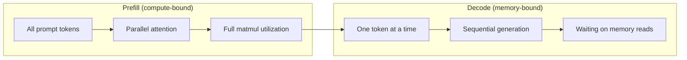
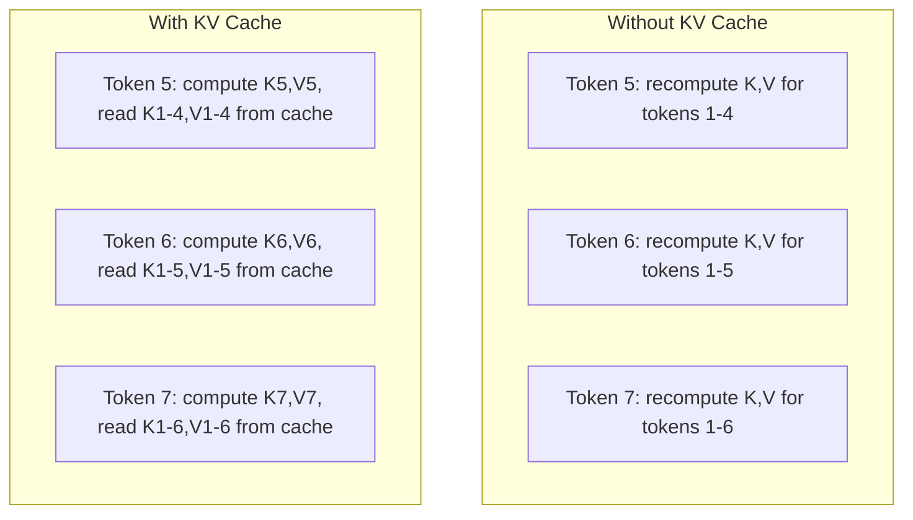
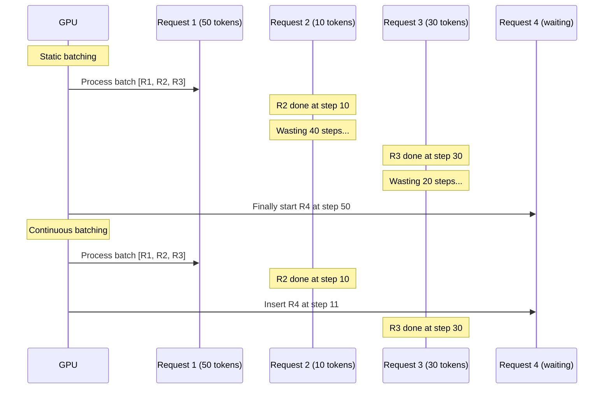
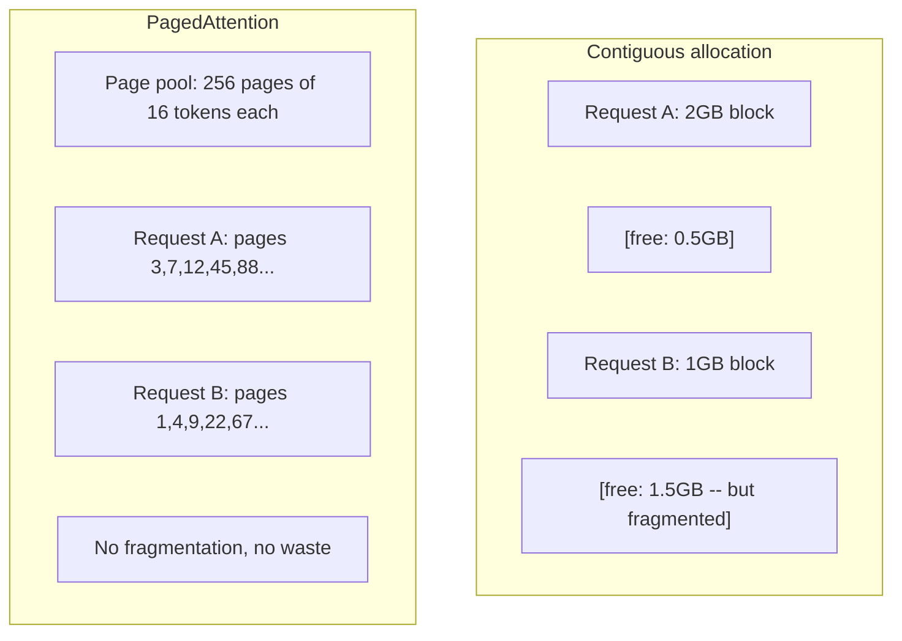
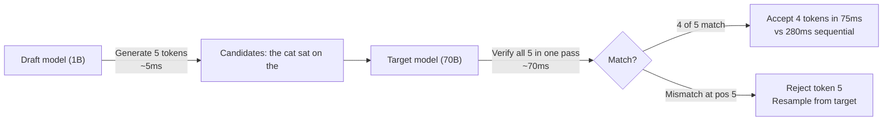

# Optimização da inferência

> Duas fases definem a inferência do LLM. Prefill processa o seu prompt em paralelo - computacional. Decode gera tokens um a cada vez - com memória. Cada otimização visa um ou ambos.

**Type:** Build
**Languages:** Python
**Prerequisites:** Phase 10, Lessons 01-08 (Transformer architecture, attention)
**Time:** ~120 minutes

## Objetivos de aprendizagem

- Implementar KV-cache para eliminar o cálculo redundante durante a geração de tokens autoregressivos
- Explique as fases de preenchimento versus decodificação da inferência do LLM e por que cada um tem gargalos de engarrafamento diferentes (computação vs memória)
- Implementar conceitos de batch contínuo e PagedAttention para maximizar a utilização de GPU sob solicitações simultâneas
- Comparar técnicas de otimização de inferências (cache KV, descodificação especulativa, atenção flash) e as suas compensações de rendimento/latença

## O problema

Você implementa Llama 3 70B em GPUs 4xA100. Um único usuário recebe ~50 tokens por segundo. Sinta-se rápido. Então 100 usuários atingem o endpoint simultaneamente. A capacidade de transferência cai para 3 tokens / segundo / usuário. Sua conta de GPU de US $ 25,000 / mês está prestando respostas mais lentas do que um tipo humano.

O modelo em si não muda entre 1 utilizador e 100 utilizadores. Os mesmos pesos, a mesma arquitetura, a mesma matemática. O que muda é a forma como agendamos o trabalho. A inferência ingênua desperdiça 90%+ do computador disponível da GPU. Um usuário esperando por token 47 mantém um lote inteiro aberto enquanto o bus de memória da GPU fica ocioso entre os matmuls. Enquanto isso, a solicitação de 2.000 tokens de um novo usuário poderia preencher esse tempo morto com computação útil.

Isto não é um problema de escalagem. É um problema de agendamento. As técnicas desta lição - cache KV, batch contínuo, PagedAttention, decodificação especulativa, prefixo cache - são o que separa um$25k/month inference bill from a $5k/mês, um que serve o mesmo tráfego.

O vLLM que serve Llama 3 70B em 4xA100-80GB atinge ~50 tokens / segundo / usuário em baixa concurência e suporta 15-25 TPS / usuário em 100 solicitações simultâneas através de batches contínuos e PagedAttention. Sem essas otimizações, o mesmo hardware atende 5 TPS / usuário nessa concurência. As mesmas GPUs, o mesmo modelo, 4x o throughput.

## O conceito

### Preencher versus Decodificar

Cada pedido de inferência de LLM tem duas fases distintas.

**Prefill**processar todo o prompt de entrada. Todos os tokens são conhecidos, então a atenção pode ser calculada em paralelo em toda a sequência completa. Esta é uma grande multiplicação de matriz - núcleos de GPU permanecem ocupados. O gargalo de engarrafamento é calcular: quantos FLOPS seu hardware pode entregar por segundo. Um A100 faz 312 TFLOPS (BF16). Prefill para um prompt de 4.096 tokens em um modelo 70B leva ~ 400ms em um único A100.

**Decode**gera tokens de saída um a cada vez. Cada novo token atende a todos os tokens anteriores, mas apenas um token é produzido por passagem avançada. As matrizes de peso têm o mesmo tamanho que durante o preenchimento, mas você está multiplicando-as por um único vetor em vez de uma matriz. Os núcleos da GPU terminam em microsecondas, e esperam que o próximo lote de pesos chegue da memória. O gargalo é a largura de banda da memória: a rapidez com que você pode transmitir pesos de modelos do HBM para as unidades de computação. Um A100 tem 2 TB/s de largura de banda. Um modelo 70B em FP16 é de 140 GB. Ler o modelo completo uma vez leva 70 segundos - é o seu piso para um único passo de decodificação.



O **ops:byte ratio**(também chamado de intensidade aritmética) capta esta compensação.

```
ops:byte ratio = FLOPs per token / bytes read from memory
```

Durante o preenchimento com um lote de 4.096 tokens, você executa ~ 4.096 operações de multiplicação acumulada por peso carregado. A relação é alta - você está computação-ligado. Durante o decodificação com tamanho de lote 1, você executa ~ 1 operação por peso carregado. A relação é baixa - você está com memória-ligada.

A ideia fundamental: *decode é ligado à memória porque você lê todo o modelo para produzir um único token*. Cada otimização abaixo ou reduz o que você lê, aumenta o lote de tokens processados por leitura, ou evita leituras inteiramente.

### Caches de KV

Durante a atenção, a consulta de cada token atende aos vetores de chave e valor de cada token anterior. Sem armazenamento em cache, gerar token N requer recomputar a projeção de chave e valor para todos os tokens anteriores N-1.

O cache KV armazena as projeções de chave e valor de todos os tokens anteriores. Ao gerar token N, você só calcula a chave e o valor para token N, e depois concatená-los com o K/V em cache dos tokens 1 a N-1.



**Memory formula for KV cache:**

```
KV cache size = 2 * num_layers * num_kv_heads * head_dim * seq_len * bytes_per_param
```

Para o Llama 3 70B (80 camadas, 8 cabeças de KV com GQA, cabeça_dim=128, BF16):

```
per token: 2 * 80 * 8 * 128 * 2 bytes = 327,680 bytes = 320 KB
at 4,096 tokens: 320 KB * 4,096 = 1.28 GB
at 128K tokens: 320 KB * 131,072 = 40 GB
```

Uma única conversa de contexto de 128K para Llama 3 70B consome 40 GB de cache KV - metade da memória do A100. Com 100 usuários simultâneos em tokens 4K cada, o cache KV sozinho requer 128 GB. É por isso que o gerenciamento do cache KV é o desafio central da otimização de inferências.

### Batchamento contínuo

A batchagem estática espera até que um lote de pedidos N chegue, os processe juntos e espera até que *all* termine antes de aceitar novos pedidos. Se uma solicitação precisa de 500 tokens e outra precisa de 10, a solicitação curta fica ociosa por 490 passos de decodificação depois de terminar.

Batch contínuo (também chamado batch de nível de iteração) inserir novas solicitações no lote assim que qualquer solicitação é concluída. O lote é reevaluado em cada passo de decodificação. Uma solicitação que termina após 10 tokens é imediatamente substituída por uma solicitação de espera.



A melhoria da capacidade de produção depende de quanto os comprimentos de saída variam. Com comprimentos uniformes, batch contínuo coincide com batch estático. Com comprimentos variáveis (o caso comum), batch contínuo pode fornecer 2-5 vezes maior capacidade de produção porque slots de GPU nunca ficam vazios.

### PagedAttention

O cache KV para cada solicitação é um bloco contíguo de memória. Quando as solicitações chegam e saem, fragmentos de memória - exatamente como a fragmentação de RAM em sistemas operacionais. Uma solicitação de token 4K precisa de 1,28 GB contíguo. Mesmo que você tenha 2 GB de total livre, você pode não ter 1,28 GB *contiguous*. Você perde memória ou rejeita a solicitação.

PagedAttention (de vLLM) aplica memória virtual de estilo OS para o cache KV. Em vez de alocar um bloco contíguo por solicitação, alocou "páginas" de tamanho fixo (normalmente 16 tokens cada). As páginas podem estar em qualquer lugar na memória física da GPU. Uma tabela de página mapeia as posições lógicas de sequência de cada solicitação para locais físicos da página.



PagedAttention também permite **copy-on-write**Para prefixos compartilhados. Se 50 solicitações compartilham o mesmo prompt do sistema, as páginas de cache KV para esse prompt do sistema são armazenadas uma vez e referenciadas por todas as 50 solicitações. Somente quando uma solicitação diverge (mensagens de usuário diferentes) obtém suas próprias páginas. Isso reduz o uso de memória drasticamente para aplicativos com solicitações do sistema compartilhadas.

O vLLM relata desperdício de memória quase zero (~4% vs ~60-80% em alocação ingênua) através da PagedAttention.

### Descrição especulativa

O decodificação é lento porque é sequencial - você gera um token, dá-lo de volta, gera o próximo. Mas e se você pudesse adivinhar os próximos 5 tokens a baixo custo, e depois verificá-los todos de uma só vez?

A descodificação especulativa usa um pequeno e rápido**draft model**Para gerar tokens candidatos K. O grande **target model**Então processar todos os candidatos K em uma única passagem avançada (que parece um prefill - paralelo, computacional, eficiente). Se o modelo-alvo concorda com as previsões do modelo-projeto, você aceita todos os tokens K no momento de uma passagem avançada-alvo. Se ele discorda na posição j, você aceita tokens 1 a j-1 e descartar o resto.



A aceleração depende do **acceptance rate**Para um Llama 3 8B elaboração para Llama 3 70B, taxas de aceitação de 70-85% são típicas da linguagem natural. Isso se traduz em 2-3x decodificação de velocidade.

Três abordagens para a descodificação especulativa:

| Method | Draft source | Acceptance rate | Overhead |
|--------|-------------|-----------------|----------|
| Draft-target (Leviathan et al.) | Separate small model | 70-85% | Draft model memory |
| EAGLE (Li et al.) | Lightweight head on target | 75-90% | ~1% extra parameters |
| N-gram lookup | Token n-gram table | 40-60% | Negligible |

**EAGLE**Treina uma pequena cabeça autoregressiva no topo dos estados ocultos do modelo alvo. Ele prevê a incorporação do próximo token usando as características da segunda a última camada do modelo alvo. Como opera nas próprias representações do modelo alvo (não de um modelo separado), atinge taxas de aceitação mais altas com memória extra mínima. A EAGLE-2 adiciona uma árvore de rascunho dinâmica que ajusta a contagem dos candidatos com base no contexto.

**N-gram speculative decoding**mantém uma tabela de n-gram continuidades do contexto atual ou um corpus pré-construído. Se o projeto coincide com o que apareceu antes na mesma conversa (patrões repetitivos, código, saída estruturada), ele dispara com zero gastos gerais da rede neural.

A descodificação especulativa é * matematicamente exata * - a distribuição de saída é idêntica à distribuição do modelo-alvo. Não é uma aproximação. A etapa de verificação garante que cada token aceito tenha exatamente a probabilidade que o modelo-alvo teria atribuído.

### Prefixo Cachado

Muitas solicitações compartilham o mesmo prefixo. Um chatbot sistema de solicitação. Um bloco de contexto RAG. Um conjunto de exemplos de algumas fotos. Sem cache de prefixos, cada solicitação recompõe o cache KV para esses tokens compartilhados a partir do zero.

O prefixo cache armazena o cache KV para prefixos comuns e o reutiliza em todas as solicitações. Quando uma nova solicitação chega com um prefixo conhecido, o sistema copia (ou referências) as entradas KV em cache e calcula apenas o KV para o sufixo único.

Para um sistema de 2.000 tokens compartilhado em todas as solicitações, o cache de prefixos elimina ~400ms de prefill por solicitação. A 100 solicitações/segundo, isso economiza 40 segundos de computação de GPU por segundo - mais de uma GPU de trabalho.

A RadixAttention da SGLang implementa o cache de prefixos com uma árvore de radix (trie) que indexa prefixos por seu conteúdo de token. Qualquer solicitação que corresponda a um prefixo armazenado recebe seu cache KV gratuitamente. A árvore permite a correspondência parcial de prefixos - se você compartilhar 1.500 dos 2.000 tokens de prefixos com uma entrada caché, você reutiliza esses 1.500 e recompõe apenas 500.

### Motores de interferência

Três motores dominam a produção LLM servindo:

| Engine | Key innovation | Best for |
|--------|---------------|----------|
| vLLM | PagedAttention, continuous batching | General-purpose serving, highest compatibility |
| SGLang | RadixAttention (prefix caching), structured generation | Multi-turn chatbots, constrained decoding |
| TensorRT-LLM | NVIDIA kernel fusion, FP8 quantization | Maximum single-GPU throughput on NVIDIA hardware |

**vLLM**É o ponto de partida padrão. Suporta a maior gama de modelos, é executado em qualquer fornecedor de GPU (NVIDIA, AMD, Intel), e atinge uma alta capacidade através de PagedAttention + batching contínuo. A API compatível com o OpenAI significa que você pode colocá-lo como substituto para qualquer chamada de API do OpenAI.

**SGLang**Construído sobre as mesmas bases que o vLLM, mas adicionando RadixAttention para cache de prefixos e uma linguagem específica de domínio para programas estruturados de LLM. Se a sua carga de trabalho envolve conversas de várias voltas, uso de ferramentas ou decodificação restrita (saída JSON, geração regex-guidada), SGLang geralmente supera o vLLM em 2-5 vezes através da reutilização de prefixos.

**TensorRT-LLM**Ele combina operações (atenção + linear + ativação em um kernel), usa FP8 em GPUs H100 e se integra com o NVIDIA Triton Inference Server para implantação de produção.

Números do mundo real para Llama 3 70B (4xA100-80GB, BF16):

| Metric | vLLM | SGLang | TensorRT-LLM |
|--------|------|--------|---------------|
| Throughput (1 user) | ~50 TPS | ~55 TPS | ~65 TPS |
| Throughput (100 users) | ~2,500 total TPS | ~3,200 total TPS | ~3,000 total TPS |
| Time to first token | ~400ms | ~300ms (prefix hit) | ~350ms |
| Max context | 128K | 128K | 128K |

### O framework de operações:byte

O op:byte ratio diz-lhe se você está computacional ou com memória, o que determina quais são as otimizações que importam.

```
Compute roof: peak FLOPS of the GPU
Memory roof:  peak bandwidth * ops:byte ratio
```

Quando ops:byte é baixo (decodificação, pequenos lotes), você bate no teto de largura de banda de memória. Adicionar mais computação (horário mais alto, mais núcleos) não ajuda. Você precisa reduzir leituras de memória (quantização, compressão de cache KV) ou aumentar o tamanho do lote para amortizar leituras em trabalho mais útil.

Quando ops:byte é alto (prefill, grandes lotes), você bate no telhado da computação. Otimizar a largura de banda da memória não ajuda. Você precisa de GPUs mais rápidas, fusão do kernel ou precisão reduzida para espremer mais FLOPS.

| Scenario | ops:byte | Bound | Optimize with |
|----------|----------|-------|---------------|
| Prefill, batch=1 | ~4,096 | Compute | Kernel fusion, FP8 |
| Decode, batch=1 | ~1 | Memory | Quantization, KV compression |
| Decode, batch=32 | ~32 | Memory | Larger batch, continuous batching |
| Decode, batch=256 | ~256 | Transitioning | Both matter |
| Decode, batch=1024 | ~1,024 | Compute | Kernel fusion, tensor parallelism |

O ponto de crossover na A100 é em torno de ops:byte = 156 (312 TFLOPS / 2 TB/s). abaixo de 156, você está ligado à memória. acima de 156, você está ligado à computação. Batch contínuo empurra o decodificação para esse crossover, embalagem de mais tokens por iteração.

```figure
context-window-slide
```

## Construí-lo

### Passo 1: Cachagem KV a partir do zero

Construímos um cache KV multi-head que armazena projeções de chave e valor por camada, por cabeça, e demonstra o padrão de crescimento da memória.

```python
import numpy as np

class KVCache:
    def __init__(self, num_layers, num_heads, head_dim, max_seq_len, dtype=np.float16):
        self.num_layers = num_layers
        self.num_heads = num_heads
        self.head_dim = head_dim
        self.max_seq_len = max_seq_len
        self.dtype = dtype

        self.k_cache = np.zeros(
            (num_layers, num_heads, max_seq_len, head_dim), dtype=dtype
        )
        self.v_cache = np.zeros(
            (num_layers, num_heads, max_seq_len, head_dim), dtype=dtype
        )
        self.seq_len = 0

    def update(self, layer_idx, new_keys, new_values):
        num_new = new_keys.shape[1]
        end = self.seq_len + num_new
        self.k_cache[layer_idx, :, self.seq_len:end, :] = new_keys
        self.v_cache[layer_idx, :, self.seq_len:end, :] = new_values
        return (
            self.k_cache[layer_idx, :, :end, :],
            self.v_cache[layer_idx, :, :end, :]
        )

    def advance(self, num_tokens):
        self.seq_len += num_tokens

    def memory_bytes(self):
        return self.k_cache.nbytes + self.v_cache.nbytes

    def used_bytes(self):
        per_token = 2 * self.num_layers * self.num_heads * self.head_dim * np.dtype(self.dtype).itemsize
        return per_token * self.seq_len
```

### Passo 2: Atenção com o cache KV

Uma atenção simplificada de várias cabeças que usa o cache KV para decodificar passos.

```python
def scaled_dot_product_attention(query, keys, values):
    head_dim = query.shape[-1]
    scores = np.matmul(query, keys.transpose(0, 1, 3, 2)) / np.sqrt(head_dim)
    seq_len_q = scores.shape[-2]
    seq_len_k = scores.shape[-1]
    if seq_len_q > 1:
        mask = np.triu(np.ones((seq_len_q, seq_len_k), dtype=np.float32), k=seq_len_k - seq_len_q + 1)
        scores = scores + mask * (-1e9)
    max_scores = np.max(scores, axis=-1, keepdims=True)
    exp_scores = np.exp(scores - max_scores)
    attn_weights = exp_scores / np.sum(exp_scores, axis=-1, keepdims=True)
    return np.matmul(attn_weights, values)


class MultiHeadAttention:
    def __init__(self, d_model, num_heads):
        self.num_heads = num_heads
        self.head_dim = d_model // num_heads
        scale = np.sqrt(2.0 / d_model)
        self.W_q = np.random.randn(d_model, d_model).astype(np.float32) * scale
        self.W_k = np.random.randn(d_model, d_model).astype(np.float32) * scale
        self.W_v = np.random.randn(d_model, d_model).astype(np.float32) * scale
        self.W_o = np.random.randn(d_model, d_model).astype(np.float32) * scale

    def forward(self, x, kv_cache=None, layer_idx=0):
        batch, seq_len, d_model = x.shape
        Q = np.matmul(x, self.W_q).reshape(batch, seq_len, self.num_heads, self.head_dim).transpose(0, 2, 1, 3)
        K = np.matmul(x, self.W_k).reshape(batch, seq_len, self.num_heads, self.head_dim).transpose(0, 2, 1, 3)
        V = np.matmul(x, self.W_v).reshape(batch, seq_len, self.num_heads, self.head_dim).transpose(0, 2, 1, 3)

        if kv_cache is not None:
            K_full, V_full = kv_cache.update(layer_idx, K[0], V[0])
            K = K_full[np.newaxis, :, :, :]
            V = V_full[np.newaxis, :, :, :]
            if seq_len == 1:
                kv_cache.advance(1)

        attn_out = scaled_dot_product_attention(Q, K, V)
        attn_out = attn_out.transpose(0, 2, 1, 3).reshape(batch, -1, d_model)
        return np.matmul(attn_out, self.W_o)
```

### Passo 3: Simulador de Batchamento Continuo

Esta simulação simula a diferença de programação entre batchagem estática e contínua.

```python
import heapq

class Request:
    def __init__(self, request_id, prompt_tokens, output_tokens, arrival_step):
        self.request_id = request_id
        self.prompt_tokens = prompt_tokens
        self.output_tokens = output_tokens
        self.arrival_step = arrival_step
        self.tokens_generated = 0
        self.start_step = None
        self.end_step = None

    def is_done(self):
        return self.tokens_generated >= self.output_tokens


def simulate_static_batching(requests, batch_size):
    step = 0
    completed = []
    queue = list(requests)
    queue.sort(key=lambda r: r.arrival_step)

    while queue:
        batch = []
        while queue and len(batch) < batch_size:
            r = queue.pop(0)
            r.start_step = max(step, r.arrival_step)
            batch.append(r)

        if batch:
            step = max(step, max(r.start_step for r in batch))
            max_output = max(r.output_tokens for r in batch)
            for r in batch:
                r.tokens_generated = r.output_tokens
                r.end_step = step + max_output
            step += max_output
            completed.extend(batch)

    return completed


def simulate_continuous_batching(requests, batch_size):
    step = 0
    completed = []
    queue = sorted(requests, key=lambda r: r.arrival_step)
    queue_idx = 0
    active = []
    waiting = []

    while queue_idx < len(queue) or active or waiting:
        while queue_idx < len(queue) and queue[queue_idx].arrival_step <= step:
            waiting.append(queue[queue_idx])
            queue_idx += 1

        while waiting and len(active) < batch_size:
            r = waiting.pop(0)
            r.start_step = step
            active.append(r)

        if not active:
            if waiting:
                step += 1
                continue
            elif queue_idx < len(queue):
                step = queue[queue_idx].arrival_step
                continue
            else:
                break

        for r in active:
            r.tokens_generated += 1

        done = [r for r in active if r.is_done()]
        for r in done:
            r.end_step = step + 1
            completed.append(r)
        active = [r for r in active if not r.is_done()]

        step += 1

    return completed


def batching_stats(completed):
    latencies = [r.end_step - r.arrival_step for r in completed]
    total_time = max(r.end_step for r in completed) - min(r.arrival_step for r in completed)
    total_tokens = sum(r.output_tokens for r in completed)
    return {
        "avg_latency": np.mean(latencies),
        "p50_latency": np.median(latencies),
        "p99_latency": np.percentile(latencies, 99),
        "total_time": total_time,
        "throughput": total_tokens / total_time if total_time > 0 else 0,
    }
```

### Passo 4: Prefixo em cache

Um cache de prefixos baseado em tri que armazena entradas KV para prefixos compartilhados.

```python
class TrieNode:
    def __init__(self):
        self.children = {}
        self.kv_data = None
        self.hit_count = 0


class PrefixCache:
    def __init__(self, max_entries=1000):
        self.root = TrieNode()
        self.max_entries = max_entries
        self.total_entries = 0
        self.hits = 0
        self.misses = 0

    def _walk(self, token_ids):
        node = self.root
        depth = 0
        for tid in token_ids:
            if tid not in node.children:
                break
            node = node.children[tid]
            depth += 1
        return node, depth

    def lookup(self, token_ids):
        node, depth = self._walk(token_ids)
        if depth > 0:
            self.hits += 1
            current = self.root
            for tid in token_ids[:depth]:
                current = current.children[tid]
                current.hit_count += 1
            kv_entries = []
            current = self.root
            for tid in token_ids[:depth]:
                current = current.children[tid]
                if current.kv_data is not None:
                    kv_entries.append(current.kv_data)
            return depth, kv_entries
        self.misses += 1
        return 0, []

    def insert(self, token_ids, kv_per_token):
        node = self.root
        for i, tid in enumerate(token_ids):
            if tid not in node.children:
                if self.total_entries >= self.max_entries:
                    return i
                node.children[tid] = TrieNode()
                self.total_entries += 1
            node = node.children[tid]
            if i < len(kv_per_token):
                node.kv_data = kv_per_token[i]
        return len(token_ids)

    def hit_rate(self):
        total = self.hits + self.misses
        return self.hits / total if total > 0 else 0.0
```

### Passo 5: Simulador de Descódigo Especulativo

Simulamos a descodificação especulativa de projetos-alvo com taxas de aceitação configuráveis.

```python
class DraftModel:
    def __init__(self, vocab_size, acceptance_rate=0.8):
        self.vocab_size = vocab_size
        self.acceptance_rate = acceptance_rate

    def generate(self, context, num_tokens):
        tokens = np.random.randint(0, self.vocab_size, size=num_tokens)
        return tokens

    def get_probs(self, context, token):
        probs = np.random.dirichlet(np.ones(self.vocab_size))
        return probs


class TargetModel:
    def __init__(self, vocab_size):
        self.vocab_size = vocab_size

    def get_probs(self, context, tokens=None):
        if tokens is not None:
            return [np.random.dirichlet(np.ones(self.vocab_size)) for _ in tokens]
        return np.random.dirichlet(np.ones(self.vocab_size))


def speculative_decode(draft_model, target_model, context, num_speculative=5,
                       draft_cost=1.0, target_cost=10.0, verify_cost=12.0):
    total_tokens = 0
    total_cost = 0.0
    accepted_counts = []
    context = list(context)

    max_tokens = 100

    while total_tokens < max_tokens:
        draft_tokens = draft_model.generate(context, num_speculative)
        total_cost += draft_cost * num_speculative

        target_probs = target_model.get_probs(context, draft_tokens)
        total_cost += verify_cost

        accepted = 0
        for i, token in enumerate(draft_tokens):
            draft_p = draft_model.get_probs(context + list(draft_tokens[:i]), token)
            target_p = target_probs[i]

            r = np.random.random()
            acceptance_prob = min(1.0, target_p[token] / (draft_p[token] + 1e-10))

            if r < draft_model.acceptance_rate:
                accepted += 1
                context.append(token)
                total_tokens += 1
            else:
                new_token = np.random.choice(draft_model.vocab_size, p=target_p)
                context.append(new_token)
                total_tokens += 1
                break

        accepted_counts.append(accepted)

        if accepted == num_speculative:
            bonus_probs = target_model.get_probs(context)
            bonus_token = np.random.choice(draft_model.vocab_size, p=bonus_probs)
            context.append(bonus_token)
            total_tokens += 1

    sequential_cost = total_tokens * target_cost
    return {
        "total_tokens": total_tokens,
        "speculative_cost": total_cost,
        "sequential_cost": sequential_cost,
        "speedup": sequential_cost / total_cost if total_cost > 0 else 1.0,
        "avg_accepted": np.mean(accepted_counts),
        "acceptance_rate": np.mean(accepted_counts) / num_speculative,
    }


def compare_speculation_strategies(vocab_size=1000, num_trials=20):
    results = {}

    for name, acceptance_rate, spec_tokens in [
        ("Draft-target (8B->70B)", 0.78, 5),
        ("EAGLE", 0.85, 6),
        ("N-gram", 0.50, 4),
        ("No speculation", 0.0, 0),
    ]:
        if spec_tokens == 0:
            results[name] = {
                "speedup": 1.0,
                "acceptance_rate": 0.0,
                "avg_accepted": 0.0,
            }
            continue

        trial_results = []
        for _ in range(num_trials):
            draft = DraftModel(vocab_size, acceptance_rate=acceptance_rate)
            target = TargetModel(vocab_size)
            context = list(np.random.randint(0, vocab_size, size=10))
            result = speculative_decode(draft, target, context, num_speculative=spec_tokens)
            trial_results.append(result)

        results[name] = {
            "speedup": np.mean([r["speedup"] for r in trial_results]),
            "acceptance_rate": np.mean([r["acceptance_rate"] for r in trial_results]),
            "avg_accepted": np.mean([r["avg_accepted"] for r in trial_results]),
        }

    return results
```

### Passo 6: Profilador de memória de cache KV

Compute os requisitos de memória cache KV para configurações reais de modelos.

```python
MODEL_CONFIGS = {
    "Llama-3-8B": {
        "num_layers": 32, "num_kv_heads": 8, "head_dim": 128,
        "model_params_b": 8, "gqa": True,
    },
    "Llama-3-70B": {
        "num_layers": 80, "num_kv_heads": 8, "head_dim": 128,
        "model_params_b": 70, "gqa": True,
    },
    "Llama-3-405B": {
        "num_layers": 126, "num_kv_heads": 8, "head_dim": 128,
        "model_params_b": 405, "gqa": True,
    },
    "Mistral-7B": {
        "num_layers": 32, "num_kv_heads": 8, "head_dim": 128,
        "model_params_b": 7, "gqa": True,
    },
    "GPT-4-est": {
        "num_layers": 120, "num_kv_heads": 96, "head_dim": 128,
        "model_params_b": 1800, "gqa": False,
    },
}


def kv_cache_memory(config, seq_len, dtype_bytes=2):
    per_token = 2 * config["num_layers"] * config["num_kv_heads"] * config["head_dim"] * dtype_bytes
    total = per_token * seq_len
    return {
        "per_token_bytes": per_token,
        "per_token_kb": per_token / 1024,
        "total_bytes": total,
        "total_mb": total / (1024 ** 2),
        "total_gb": total / (1024 ** 3),
    }


def memory_budget(config, gpu_memory_gb, model_dtype_bytes=2, kv_dtype_bytes=2):
    model_memory_gb = config["model_params_b"] * 1e9 * model_dtype_bytes / (1024 ** 3)
    overhead_gb = gpu_memory_gb * 0.1
    available_for_kv = gpu_memory_gb - model_memory_gb - overhead_gb

    if available_for_kv <= 0:
        return {"error": "Model does not fit in GPU memory", "model_memory_gb": model_memory_gb}

    per_token = 2 * config["num_layers"] * config["num_kv_heads"] * config["head_dim"] * kv_dtype_bytes
    max_tokens = int(available_for_kv * (1024 ** 3) / per_token)

    return {
        "gpu_memory_gb": gpu_memory_gb,
        "model_memory_gb": round(model_memory_gb, 1),
        "overhead_gb": round(overhead_gb, 1),
        "available_for_kv_gb": round(available_for_kv, 1),
        "max_total_tokens": max_tokens,
        "max_users_at_2k": max_tokens // 2048,
        "max_users_at_4k": max_tokens // 4096,
        "max_users_at_32k": max_tokens // 32768,
    }
```

## Usá-lo

Com VLLM:

```python
from vllm import LLM, SamplingParams

llm = LLM(
    model="meta-llama/Llama-3-70B-Instruct",
    tensor_parallel_size=4,
    enable_prefix_caching=True,
    max_model_len=8192,
    gpu_memory_utilization=0.9,
)

params = SamplingParams(temperature=0.7, max_tokens=256)
outputs = llm.generate(["Explain inference optimization in one paragraph."], params)
```

Com SGLang para cache de prefixos + saída estruturada:

```python
import sglang as sgl

@sgl.function
def classify(s, text):
    s += sgl.system("You are a classifier. Output JSON only.")
    s += sgl.user(f"Classify this text: {text}")
    s += sgl.assistant(sgl.gen("result", regex=r'\{"label": "(positive|negative|neutral)"\}'))

runtime = sgl.Runtime(model_path="meta-llama/Llama-3-70B-Instruct", tp_size=4)
sgl.set_default_backend(runtime)

results = classify.run_batch([
    {"text": "This product is amazing!"},
    {"text": "Terrible experience."},
    {"text": "It was okay I guess."},
])
```

Com TensorRT-LLM:

```python
import tensorrt_llm
from tensorrt_llm.runtime import ModelRunner

runner = ModelRunner.from_dir("./llama-70b-trt-engine/", rank=0)

outputs = runner.generate(
    batch_input_ids=[tokenizer.encode("Explain KV caching.")],
    max_new_tokens=256,
    temperature=0.7,
)
```

## Envia-o

Esta lição produz:
- `outputs/skill-inference-optimization.md`- uma habilidade para diagnosticar e otimizar a inferência de LLM

## Exercícios

1. Modifique o perfil do cache KV para comparar a quantização do cache FP16 vs FP8 vs INT4 KV. Para Llama 3 70B em contexto 4K, calcule o máximo de usuários simultâneos para cada um em 4xA100-80GB. Quantização de KV para INT4 deve ser aproximadamente 4x a capacidade do usuário.

2. Extenda o simulador de lotes contínuos para rastrear a utilização da GPU (fração de slots de lotes preenchidos por etapa). Utilização de parcelas ao longo do tempo para lotes estáticos e contínuos com 50 solicitações cujos comprimentos de saída seguem uma distribuição Pareto (forma = 1.5, escala = 20).

3. Implementar uma versão de atenção de consulta agrupada (GQA) do cache KV onde `num_kv_heads < num_query_heads`Llama 3 70B utiliza 64 cabeças de consulta, mas apenas 8 cabeças de KV. Calcule a economia de memória vs atenção completa de cabeças múltiplas (8 vezes a redução do tamanho do cache de KV).

4. Construa um cache de prefixos que use o despejo LRU. Configure o máximo de entradas para 500 e gerar 1.000 solicitações onde 60% compartilham um dos 5 prefixos comuns. Messa a taxa de acidentes e compare com o cache ilimitado. Com um bom despejo, a taxa de acidentes deve permanecer acima de 55%.

5. Expanda o simulador de decodificação especulativo para implementar especulação baseada em árvore (estilo EAGLE-2). Em vez de uma única cadeia de tokens de projeto K, gerar uma árvore de candidatos (por exemplo, 2 ramos em cada um dos 3 níveis = 8 candidatos de folha). Comparar os tokens totais aceitos por rodada de verificação vs especulação linear.

## Termos-chave

| Term | What people say | What it actually means |
|------|----------------|----------------------|
| Prefill | "Processing the prompt" | Computing attention over all input tokens in parallel -- compute-bound because the full matrix multiplication keeps GPU cores busy |
| Decode | "Generating tokens" | Producing one token per forward pass, reading the full model weights each time -- memory-bound because compute finishes before the next weights arrive |
| KV cache | "Caching attention states" | Storing the key and value projections for all previous tokens so they are not recomputed at each decode step -- trades memory for compute |
| Continuous batching | "Dynamic batching" | Inserting new requests into the running batch as soon as any request finishes, evaluated at every decode iteration rather than waiting for the whole batch |
| PagedAttention | "Virtual memory for KV cache" | Allocating KV cache in fixed-size pages instead of contiguous blocks, eliminating memory fragmentation and enabling copy-on-write for shared prefixes |
| Speculative decoding | "Draft and verify" | Using a fast draft model to propose multiple tokens, then verifying them all in one target model forward pass -- mathematically exact, 2-3x speedup |
| EAGLE | "Self-speculative decoding" | A speculative decoding variant that trains a lightweight head on the target model's own hidden states, achieving higher acceptance rates than a separate draft model |
| Prefix caching | "Reusing system prompt KV" | Storing computed KV cache entries for common prefixes (system prompts, few-shot examples) and reusing them across requests to skip redundant prefill |
| Ops:byte ratio | "Arithmetic intensity" | The ratio of compute operations to memory bytes read -- determines whether a workload is compute-bound (high ratio) or memory-bound (low ratio) |
| Time to first token | "TTFT" | Latency from receiving a request to producing the first output token -- dominated by prefill time for long prompts |

## Mais leitura

- Kwon et al., "Gestão eficiente de memória para um modelo de linguagem grande servindo com PagedAttention" (2023) -- o artigo vLLM que introduziu o gerenciamento de cache KV em páginas, agora o padrão da indústria para o serviço de inferência
- Leviathan et al., "Inferência rápida de transformadores através da descodificação especulativa" (2023) -- o artigo baseado provando que a especulação de verificação de projetos produz distribuições exatas de modelos alvos ao mesmo tempo em que alcança a velocidade de 2-3x
- Li et al., "EAGLE: A amostragem especulativa requer uma reconsideração da incerteza das características" (2024) -- alcança taxas de aceitação mais altas através da formação de um líder sobre as próprias características do modelo-alvo em vez de usar um modelo de projeto separado
- Zheng et al., "SGLang: Execução eficiente de programas de modelo de linguagem estruturada" (2024) -- introduz RadixAttention para cache de prefixos e um modelo de programação para programas de LLM de várias chamadas
- Williams et al., "Roofline: Um Modelo de Performance Visual Insightful para Arquiteturas Multicore" (2009) -- o papel original de cobertura que formalizou a estrutura ops:byte para raciocínio sobre gargalos de botão computação vs memória
