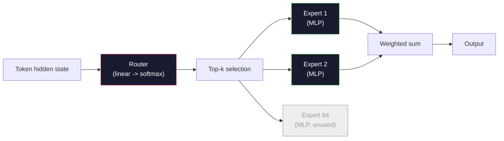

# Modelos abertos: caminhadas de arquitetura

> Construíste um GPT-2 pequeno a partir do zero na lição 04. Os modelos abertos de fronteira em 2026 são a mesma família com cinco ou seis mudanças concretas. RMSNorm em vez de LayerNorm. SwiGLU em vez de GELU. RoPE em vez de posições aprendidas. GQA ou MLA em vez de MHA completa. Mistura de especialistas em escala. A matemática que já conheces cobre 95% deles. Esta lição lê Llama 3, DeepSeek-V3, Mixtral, Qwen e Gemma lado a lado e nomeia a linha exata onde cada arquitetura diverge.

**Type:** Learn
**Languages:** Python (stdlib)
**Prerequisites:** Phase 10, Lessons 04, 05, 12 (Pre-training, Scaling, Inference)
**Time:** ~45 minutes

## Objetivos de aprendizagem

- Leia o config.json de Llama 3, Mistral, Mixtral, Gemma 2, Qwen 2.5, e DeepSeek-V3 e explique cada campo
- Nomear a mudança arquitetônica específica feita por cada modelo em relação ao GPT-2 Small e justificar a partir dos primeiros princípios
- Contagem de parâmetros de computação, tamanho do cache KV e memória de ativação para qualquer modelo aberto apenas a partir de sua configuração
- Escolha o modelo aberto certo para um alvo de implantação dado o atraso, memória e restrições de capacidade

## O problema

Na lição 04 escreveu 350 linhas de numpy e tinha um modelo em forma de GPT-2. O Llama 3 405B tem um relatório técnico de 200 páginas. O teu instinto é que são animais diferentes. Não são. As 200 páginas descrevem o mesmo objeto com cinco ou seis modificações bem motivadas, mais mil detalhes de implementação sobre escala. O esqueleto - inserção, blocos transformadores, atenção, MLP, norma, cabeça - é inalterado.

Esta lição é uma diferença. Para cada grande família de modelos abertos, listamos exatamente o que mudou do GPT-2, por quê, e o que custou. Quando você terminar, você pode ler um novo cartão de modelo e mentalmente traduzi-lo de volta para a linha de base do GPT-2.

O benefício prático é que quando o Meta lança o Llama 5 ou o DeepSeek lança o V4, você não precisará de um novo modelo mental. Você vai olhar para a configuração, ver quais dos botões conhecidos se moveram e saber quais são as implicações para baixo. As arquiteturas de 2026 são uma caixa de ferramentas finita. Cada novo modelo escolhe um subconjunto diferente.

## O conceito

### O núcleo invariavel

Todos os modelos abertos autoregressivos compartilham:

- Matriz de inserção de tokens (vocab_size x hidden_dim).
- Estaca de blocos de decodificador N: norma, auto-atenção, residual, norma, MLP, residual.
- Norma final e cabeça linear projetando-se para vocab_size (muitas vezes ligada por peso com incorporados).
- Máscara causal, perda de entropia cruzada de tokens.

É a forma, o resto são botões.

### Os Seis Botões que Realmente Mudan

Em cada modelo aberto de fronteira 2024-2026, as mesmas seis opções de design são escolhidas repetidamente:

1. **Normalization.**LayerNorm -> RMSNorm.
2. **Positional encoding.**Aprendizado absoluto -> RoPE (mais variantes: YaRN, NTK).
3. **Activation.**GELU -> SwiGLU (ou GeGLU).
4. **Attention head sharing.**MHA -> GQA -> MQA -> MLA.
5. **Dense vs sparse MLP.**Densa -> Mistura de Especialistas.
6. **Pre-norm placement.**A pré-norma permanece, a pós-norma desapareceu.

Tudo o resto (hora de aprendizagem, mix de dados, tamanho do lote, comprimento do contexto) vive na configuração do treinamento, não na arquitetura.

### Nodo 1: RMSNorm

LayerNorm subtrai a média, dividiu por std, escalas e mudanças.

```
RMSNorm(x) = x / sqrt(mean(x^2) + eps) * gamma
```

Não há subtração média. Não há viés. Um matmul menos por token. Zhang e Sennrich (2019) argumentaram que corresponde ao LayerNorm na tradução automática, sendo 10% mais rápido.

Custo: nenhum. Benefício: pequena ganha de tráfego, código mais simples.

### Nótulo 2: RoPE

Os embeddings de posição aprendidos foram uma tabela de busca de 1024 slots no GPT-2. O contexto 1025 está fora do final da tabela.

Embarcação rotativa de posição (RoPE, Su et al. 2021) injeta a posição rotando cada vetor Q e K em pares antes do produto do ponto de atenção. O ângulo de rotação é uma função determinista da posição, por isso não há nada aprendido e nada a ser perdido. Com truques de escala (interpolação consciente do NTK, YaRN), um modelo treinado em contexto de 8k pode estender-se para 128k na inferência com uma perda modesta de precisão.

```
q_rotated = rotate(q, angle(pos))
k_rotated = rotate(k, angle(pos))
score = q_rotated . k_rotated
```

Cada Llama, Mistral, Qwen, DeepSeek e Gemma usa RoPE. Gemma 2 usa um híbrido (RoPE na maioria das camadas, atenção local da janela deslizante em outras).

### Noto 3: SwiGLU

O MLP do GPT-2 é `x -> gelu(xW1 + b1) -> (...)W2 + b2`O SwiGLU (Shazeer 2020) substitui a ativação por um produto fechado:

```
SwiGLU(x) = (xW1) * sigmoid(xW1) * xV
```

Duas projeções em paralelo em vez de uma, fechadas pela ativação Swish. Empiricamente mais forte em perplexidade por parâmetro. Llama 2 adotou, todos seguiram. O tamanho oculto do MLP é geralmente definido para que o número total de parâmetros coincida com o MLP denso original: se GPT-2 foi usado `ff_dim = 4 * hidden`, SwiGLU utiliza `ff_dim = (2/3) * 4 * hidden = 8/3 * hidden`- Não .

### Noque 4: Partilha de cabeça de atenção

GPT-2 utilizado **Multi-Head Attention (MHA)**Cada cabeça tem a sua própria projecção Q, K, V.

**Multi-Query Attention (MQA, Shazeer 2019)**O sistema de cache KV é dividido em números, que é uma redução de 12x a 32x em um modelo típico.

**Grouped-Query Attention (GQA, Ainslie et al. 2023)**é o meio: grupos G de cabeças Q compartilham um K e um V. Llama 3 8B usa GQA com 32 cabeças Q e 8 cabeças KV (G=8), de modo que o cache KV encolhe 4x em relação ao MHA completo.

**Multi-Head Latent Attention (MLA, DeepSeek 2024)**Compressos de K e V em um latente de baixo nível compartilhado, projetando-os de volta para cima por cabeça. Reduz ainda mais o cache KV enquanto preserva a expressividade por cabeça.

| Scheme | KV Heads | KV Cache | Accuracy |
|--------|----------|----------|----------|
| MHA    | num_heads | full | best |
| GQA    | num_groups (G < num_heads) | num_heads / G reduction | near-MHA |
| MQA    | 1 | num_heads reduction | small hit |
| MLA    | latent, per-head decompression | smaller than MQA | near-MHA |

Para qualquer modelo acima dos parâmetros ~ 13B, GQA ou MLA é efetivamente obrigatório.

### No 5 - Mistura de Especialistas

Um MLP denso ativa todos os seus parâmetros para cada token. Um MLP MoE tem especialistas K por bloco e um roteador que escolhe os especialistas top-k por token (geralmente top-2). Somente os pesos desses especialistas veem um pass para a frente para esse token.

```
router_logits = xW_r
indices, weights = top_k(router_logits, k=2)
output = sum_i weights[i] * expert[indices[i]](x)
```

O apelo: você pode ter 64 especialistas de tamanho 7B cada (por isso a contagem total de parâmetros é enorme) enquanto apenas executar 2 deles por token (por isso, a computação por token corresponde a um modelo 7B denso). Mixtral 8x7B tem parâmetros totais de 47B, mas ativa apenas 13B por token. DeepSeek-V3 tem parâmetros totais de 671B, mas ativa apenas 37B por token.



Pros: mesma computação, mais parâmetros, melhor capacidade. Cons: a memória especialista ainda tem que morar em algum lugar (por isso, a servidão precisa de mais VRAM do que um equivalente denso), equilibrar a carga do roteador é difícil, e ajustar o roteador durante o alinhamento é sua própria área de pesquisa.

### Nobre 6: Restos pré-normais

O transformador original aplicou a norma de camada após cada subcamada. Todos os modelos abertos desde GPT-2 colocam *antes* de cada subcamada.

### Diferença modelo por modelo

Aqui está a mesa que faz todo este concreto.

| Model | Year | Total Params | Active Params | Norm | Activation | Position | Attention | MoE | Context |
|-------|------|-------------|---------------|------|-----------|----------|-----------|-----|---------|
| GPT-2 Small | 2019 | 124M | 124M | LayerNorm | GELU | Learned | MHA (12 heads) | no | 1k |
| Llama 3 8B | 2024 | 8B | 8B | RMSNorm | SwiGLU | RoPE | GQA (32/8) | no | 128k |
| Llama 3 70B | 2024 | 70B | 70B | RMSNorm | SwiGLU | RoPE | GQA (64/8) | no | 128k |
| Llama 3 405B | 2024 | 405B | 405B | RMSNorm | SwiGLU | RoPE | GQA (128/16) | no | 128k |
| Mistral 7B | 2023 | 7.2B | 7.2B | RMSNorm | SwiGLU | RoPE | GQA | no | 32k |
| Mixtral 8x7B | 2023 | 47B | 13B | RMSNorm | SwiGLU | RoPE | GQA | yes (8 experts, top-2) | 32k |
| Gemma 2 9B | 2024 | 9B | 9B | RMSNorm (pre+post) | GeGLU | RoPE + sliding | GQA | no | 8k |
| Qwen 2.5 72B | 2024 | 72B | 72B | RMSNorm | SwiGLU | RoPE (YaRN) | GQA (64/8) | no | 128k |
| DeepSeek V2 236B | 2024 | 236B | 21B | RMSNorm | SwiGLU | RoPE | MLA | yes (160 experts, top-6) | 128k |
| DeepSeek V3 | 2024 | 671B | 37B | RMSNorm | SwiGLU | RoPE | MLA | yes (256 experts, top-8) | 128k |

Escanar as colunas. RMSNorm é universal. SwiGLU ou seu primo GeGLU é universal. RoPE é universal. GQA é universal acima de 7B, exceto quando substituído por MLA. MoE é o diferenciador na extremidade superior.

### Lendo um config.json

Llama 3 8B configuração:

```
{
  "hidden_size": 4096,
  "intermediate_size": 14336,
  "num_hidden_layers": 32,
  "num_attention_heads": 32,
  "num_key_value_heads": 8,
  "max_position_embeddings": 131072,
  "rope_theta": 500000.0,
  "rms_norm_eps": 1e-5,
  "vocab_size": 128256
}
```

Cada campo corresponde a algo que já implementou.

- `hidden_size`: dimensão de inserção.
- `intermediate_size`: tamanho MLP oculto (3.5x oculto -- matemática SwiGLU).
- `num_hidden_layers`A profundidade da pilha.
- `num_attention_heads`Cabeças de Q.
- `num_key_value_heads`: cabeças de KV (GQA).
- `max_position_embeddings`O período de formação é de um período de tempo.
- `rope_theta`A meta escalava-o de 10k para 500k para extrapolação de longo contexto.
- `rms_norm_eps`Estabilidade numérica.
- `vocab_size`- - - - - - - - - - - - - - - - - - - - - - - - - - - - - - - - - - - - - - - - - - - - - - - - - - - - - - - - - - - - - - - - - - - - - - - - - - - - - - - - - - - - - - - - - - - - - - - - - - - - - - - - - - - - - - - - - - - - - - - - - - - - - - - - - - - - - - - - - - - - - - - - - - - - - - - - - - - - - - - - - - - - - - - - - - - - - - - - - - - - - - - - - - - - - - - - - - - - - - - - - - - - - - - - - - - - - - - - - - - - - - - - - - - - - - - - - - - - - - - - - - - - - - - - - - - - - - - - - - - - - - - - - - - - - - - - - - - - - - - - - - - - - - - - - - - - - - - - - - - - - - - - - - - - - - - - - - - - - - - - - - - - - - - - - - - - - - - - - - - - - - - - - - - - - - - - - - - - - - - - - - - - - - - - - - - - - - - - - - - - - - - - - - - - - - - - - - - - - - - - - - - - - - - - - - - - - - - - - - - - - - - - - - - - - - - - - - - - - - - - - - - - - - - - - - - - - - - - - - - - - - - - - - - - - - - - - - - - - - - - - - - - - - - - - - - - - - - - - - - - - - - - - - - - - -

A partir destes somente você calcula parâmetros totais, cache KV e memória de ativação de pico. Veja `code/main.py`para as fórmulas exatas.

### Orçamento de memória de ativação

Atividades dominam a memória de treinamento acima de alguns bilhões de parâmetros.

```
activation_mem ~ batch_size * seq_len * hidden_size * num_layers * bytes_per_element
```

Para Llama 3 8B no lote 1, sequência 8192, BF16, 32 camadas, escondidas 4096: aproximadamente 8 GB apenas para ativações com checkpointing, 40 GB sem. É por isso que a atenção flash e a atenção ring importam - eles reescrevem a computação de atenção para que as ativações se encaixem.

### Orçamento de caché KV

Para inferência no contexto máximo:

```
kv_cache = 2 * num_layers * num_kv_heads * head_dim * max_seq_len * bytes_per_element
```

Llama 3 8B em contexto de 128k, BF16, head_dim = hidden / num_heads = 128:
`2 * 32 * 8 * 128 * 131072 * 2 = 17.2 GB`por sequência.

Os pesos 8B são 16 GB em BF16. O cache KV para uma única sequência de 128k é maior do que os pesos. Esta é a pressão de memória que impulsiona a pesquisa de quantização de cache GQA, MLA e KV.

### Quando cada modelo ganha

- **Single 80GB GPU, no MoE**Llama 3 8B, Mistral 7B, Gemma 2 9B. Fácil de servir, ferramentas largas.
- **Single node (8x80GB), big capacity**Llama 3 70B, Qwen 2.5 72B. Capacidade aberta de densidade máxima.
- **Biggest open capability, accept MoE complexity**: DeepSeek V3, Mixtral 8x22B. Melhor capacidade por FLOP ativo.
- **Long-context needs**: Llama 3 (128k com escalagem RoPE), DeepSeek (vantagem MLA).
- **Low-latency serving**: Gemma 2 9B (florada deslizante corta computação de longo contexto).

```figure
rmsnorm-vs-layernorm
```

## Construí-lo

O código da lição é uma calculadora. Dada qualquer config.json, ele imprime a contagem de parâmetros por componente, cache KV no contexto máximo, relação SwiGLU MLP e um breve veredicto sobre a arquitetura (denso / GQA / MLA / MoE).

```python
config = {
    "hidden_size": 4096, "intermediate_size": 14336,
    "num_hidden_layers": 32, "num_attention_heads": 32,
    "num_key_value_heads": 8, "vocab_size": 128256,
    "max_position_embeddings": 131072,
}
```

O script percorre o campo de arquitetura por campo, calcula os parâmetros para incorporação, atenção (com redução de GQA), MLP (com expansão SwiGLU), normas de camadas e cabeça.

Veja .`code/main.py`para a execução.

## Usá-lo

Execute a calculadora em configurações Llama 3 8B, Mistral 7B, Mixtral 8x7B e DeepSeek V3 em conjunto no script. Compare as desintegrações de parâmetros. Observe que os modelos MoE têm uma contagem de parâmetros total que enobrece os modelos densos, mas uma contagem de parâmetros ativa que é muitas vezes menor. Observe que o cache KV do DeepSeek V3 é menor do que o Llama 3 405B, apesar de ter mais parâmetros totais - isto é, MLA em ação.

Depois, conecte um configurador para qualquer modelo que você tenha localmente, leia o resumo e decida se ele se encaixa na sua GPU.

## Envia-o

Esta lição produz`outputs/skill-open-model-picker.md`. Tendo em conta um objetivo de implantação (tipo de GPU, VRAM, comprimento de contexto, orçamento de latência) e um perfil de tarefa (chat, código, raciocínio, longo contexto), recomenda um modelo aberto, um esquema de quantização da lição 11 e uma pilha de inferências da lição 12, com raciocínio explícito sobre os seis botões de arquitetura.

## Exercícios

1. Leia a configuração Qwen 2.5 72B da HuggingFace. Calcule os parâmetros totais a partir do zero. Comparar com o valor relatado pela HF e identificar de onde vem qualquer delta (redondamento de cabeça, fator de compartilhamento de KV, etc.).

2. O DeepSeek V3 usa 256 especialistas com roteamento de 8 principais. Calcule a relação de especialistas ativados com especialistas totais e compare com o Mixtral 8x7B com o top-2 de 8. O que a mudança de escassos (25%) para mais densos escassos (3%) implica sobre a capacidade por FLOP?

3. Compute o cache KV para Llama 3 405B em contexto 128k em FP8 e BF16. Em FP8 é metade do número BF16. Quantas sequências paralelas você pode servir em um único nó 8xH100 (80GB cada = 640GB total, menos memória de peso)?

4. Gemma 2 alternar camadas de atenção completa e de janela deslizante-atenção. Escreva a matemática para o cache KV quando metade das camadas usam uma janela deslizante de 4096 tokens em vez de contexto completo. Quanta memória isso economiza em contexto total de 8k?

5. Encontre um modelo aberto de fronteira recente que foi lançado após esta lição ter sido escrita. Identifique qual dos seis botões que ele escolheu e se introduziu um sétimo botão. O currículo vai sentir-se desatualizado no momento em que uma nova arquitetura lança - o objetivo é atualizar sua mesa sem reconstruir seu modelo mental.

## Termos-chave

| Term | What people say | What it actually means |
|------|----------------|----------------------|
| RMSNorm | "LayerNorm without the mean" | Normalize by root mean square only, with a learned scale — cheaper and comparable to LayerNorm |
| RoPE | "Rotary positions" | Rotate each Q and K vector in 2D pairs by an angle that depends on position — extrapolates beyond training length with scaling tricks |
| SwiGLU | "The new MLP activation" | Gated linear unit with Swish: `(xW1) * sigmoid(xW1) * xV` — standard in every 2024+ open model |
| GQA | "Middle ground attention" | Grouped-Query Attention: G groups of Q heads share one K and one V head — shrinks KV cache without MQA's accuracy hit |
| MLA | "DeepSeek's attention" | Multi-Head Latent Attention: compress K/V into a shared low-rank latent, decompress per head — smallest KV cache for large models |
| MoE | "Sparse experts" | Mixture of Experts: N MLPs per block, router picks top-k per token — huge total params, small active params |
| Top-k routing | "Pick k experts per token" | The router computes a score per expert and activates the k highest — typical k is 2 (Mixtral) to 8 (DeepSeek) |
| YaRN | "Stretch RoPE" | Yet another RoPE extension — interpolates rotary angles to extend context from 8k to 128k+ at inference time |
| Sliding-window attention | "Don't attend to everything" | Each token attends only to the last W tokens — caps attention cost at O(W) per token, used in Gemma 2 and early Mistral |
| Active params | "What runs per token" | For MoE models, the parameter count that sees a forward pass per token (much smaller than total params) — governs per-token FLOPs |

## Mais leitura

- [Dubey et al., 2024 -- "The Llama 3 Herd of Models"](https://arxiv.org/abs/2407.21783)-- a referência arquitetônica e de formação para a densa família Llama 3
- [DeepSeek-AI, 2024 -- "DeepSeek-V3 Technical Report"](https://arxiv.org/abs/2412.19437)-- MLA mais equilíbrio de carga sem perda auxiliar mais 671B MoE
- [Jiang et al., 2024 -- "Mixtral of Experts"](https://arxiv.org/abs/2401.04088)-- o modelo de papel aberto do Ministério da Educação
- [Su et al., 2021 -- "RoFormer: Enhanced Transformer with Rotary Position Embedding"](https://arxiv.org/abs/2104.09864)- papel RoPE
- [Shazeer, 2020 -- "GLU Variants Improve Transformer"](https://arxiv.org/abs/2002.05202)- SwiGLU, GeGLU e amigos
- [Ainslie et al., 2023 -- "GQA: Training Generalized Multi-Query Transformer Models"](https://arxiv.org/abs/2305.13245)- o artigo GQA
- [Gemma 2 Team, 2024 -- "Gemma 2: Improving Open Language Models at a Practical Size"](https://arxiv.org/abs/2408.00118)-- híbrido de atenção completa+deslizante, pré+pós-norma
- [Qwen Team, 2024 -- "Qwen 2.5 Technical Report"](https://arxiv.org/abs/2412.15115)-- Extensão do contexto do YaRN e receitas de formação em longo contexto
