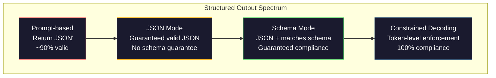
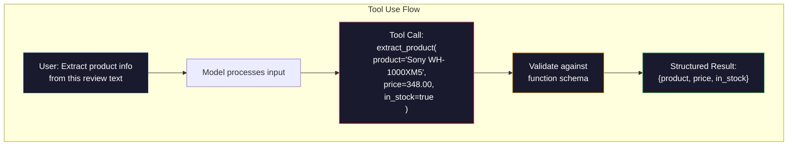

# Output estruturado: JSON, validação de esquema, decodificação restrita

> O LLM retorna uma cadeia. O seu aplicativo precisa de JSON. Essa lacuna caiu mais sistemas de produção do que qualquer alucinação de modelo. A saída estruturada é a ponte entre linguagem natural e dados digitalizados. Faça o certo e o seu LLM se torna uma API confiável. Faça o errado e você está analisando texto livre com regex às 3 da manhã.

**Type:** Build
**Languages:** Python
**Prerequisites:** Phase 10, Lessons 01-05 (LLMs from Scratch)
**Time:** ~90 minutes
**Related:**A fase 5 · 20 (Output estruturado e decodificação restrita) abrange a teoria de nível de decodificador (processadores de logit FSM/CFG, Outlines, XGrammar).`response_format`, Utilização de ferramentas antropóficas, Instructor)  leia a Fase 5 · 20 primeiro se quiser entender o que está acontecendo abaixo da API.

## Objetivos de aprendizagem

- Implementar saídas de modo JSON e de esquema restritos usando os parâmetros OpenAI e API Antropic
- Construir uma camada de validação Pydantic que rejeite saídas de LLM mal formadas e retestes com feedback de erro
- Explique como a decodificação restrita força a JSON válida no nível do token sem pós-processamento
- Projetar robustas instruções de extração que convertam de forma confiável texto não estruturado em estruturas de dados digitalizadas

## O problema

Você pergunta a um LLM: "Extrair o nome do produto, preço e disponibilidade deste texto".

```
The product is the Sony WH-1000XM5 headphones, which cost $348.00 and are currently in stock.
```

É uma resposta perfeitamente correta. Também é completamente inútil para a sua aplicação.`{"product": "Sony WH-1000XM5", "price": 348.00, "in_stock": true}`Você precisa de um objeto JSON com chaves específicas, tipos específicos e restrições de valor específicas.

A solução ingênua: adicionar "Responder em JSON" ao seu pedido. Isto funciona 90% das vezes. O outro 10% do modelo envolve o JSON em cercas de código de marcação, ou adiciona um preâmbulo como "Aqui está o JSON:", ou produz JSON sintagmaticamente inválido porque fechou um braço cedo. O teu parsementa JSON falha. O teu gasoduto está a quebrar. Adicionamos tentativa/exceto e um ciclo de retest. A retestagem às vezes produz dados diferentes. Agora, tens um problema de consistência em cima de um problema de análise.

Este não é um problema de engenharia imediata. É um problema de decodificação. O modelo gera tokens de esquerda para direita. Em cada posição, ele escolhe o próximo token mais provável de um vocabulário de 100K + opções. A maioria dessas opções produziria JSON inválido em qualquer posição dada. Se o modelo apenas emitido `{"price":`, o próximo símbolo deve ser um dígito, uma citação (para uma cadeia), `null`- Não .`true`- Não .`false`O modelo pode escolher uma palavra inglesa perfeitamente razoável que seja catastróficamente errada sintaticamente.

## O conceito

### Espectro estruturado de produção

Existem quatro níveis de controlo estruturado de saída, cada um mais confiável do que o anterior.



**Prompt-based**("Responde em JSON válido"): sem execução. O modelo geralmente cumpre, mas às vezes não. Confiabilidade: ~ 90%. Modo de falha: cercas de marcação, texto de preâmbulo, saída truncada, estrutura errada.

**JSON mode**A API garante que a saída seja válida JSON.`response_format: { type: "json_object" }`O resultado irá analisar sem erros, mas pode não corresponder ao esquema esperado - chaves extras, tipos errados, campos faltantes.

**Schema mode**A API assume um esquema JSON e garante que a saída corresponda a ele.`response_format: { type: "json_schema", json_schema: {...} }`(também como `tool_choice="required"`), o uso de ferramentas da Anthropic com `input_schema`, e os Gémeos.`response_schema`+ `response_mime_type: "application/json"`A saída tem as chaves, tipos e restrições exatas que você especificou.

**Constrained decoding**A partir daí, o modelo pode ser usado para produzir tokens que levem a uma saída válida.

### JSON Schema: A linguagem do contrato

JSON Schema é como você diz ao modelo (ou camada de validação) qual a forma que a saída deve ter.

```json
{
  "type": "object",
  "properties": {
    "product": { "type": "string" },
    "price": { "type": "number", "minimum": 0 },
    "in_stock": { "type": "boolean" },
    "categories": {
      "type": "array",
      "items": { "type": "string" }
    }
  },
  "required": ["product", "price", "in_stock"]
}
```

Este esquema diz: a saída deve ser um objeto com uma cadeia `product`, um número não negativo `price`, um booleano `in_stock`, e uma matriz opcional de cordas `categories`Qualquer saída que não coincida é rejeitada.

Os esquemas tratam os casos difíceis: objetos aninhados, matrizes com elementos digitalizados, enums (constrir uma cadeia a valores específicos), correspondência de padrões (regex em cadeias) e combinadores (oneOf, anyOf, allOf para saídas polimórficas).

### O padrão pidantico

Em Python, você não escreve JSON Schema à mão. Você define um modelo Pydantic e ele gera o esquema para você.

```python
from pydantic import BaseModel

class Product(BaseModel):
    product: str
    price: float
    in_stock: bool
    categories: list[str] = []
```

O Instructor (e o SDK do OpenAI) aceita modelos Pydantic diretamente: passar a classe de modelo, obter de volta uma instância validada.

### Função de chamada / Utilização de ferramentas

Uma interface alternativa para o mesmo problema. Em vez de pedir ao modelo para produzir JSON diretamente, você define "ferramentas" (funções) com parâmetros digitalizados. O modelo expande uma chamada de função com argumentos estruturados. O OpenAI chama isso de "chamadas de funções".



O uso de ferramentas é preferido quando o modelo precisa escolher qual função chamar, não apenas preencher parâmetros. Se você tem 10 esquemas de extração diferentes e o modelo deve escolher o certo com base na entrada, o uso de ferramentas lhe dá a seleção de esquema e a saída estruturada.

### Modos comuns de falhas

Mesmo com a aplicação do esquema, as saídas estruturadas podem falhar de maneiras sutis.

**Hallucinated values**O modelo produz `{"price": 299.99}`Quando o texto diz $348. A validação do esquema não consegue captar isto -- o tipo é correto, o valor é errado.

**Enum confusion**: você restringir um campo para `["in_stock", "out_of_stock", "preorder"]`- As saídas do modelo .`"available"`- semânticamente correto, mas não no conjunto permitido. A boa decodificação restrita impede isso.

**Nested object depth**A maioria dos sistemas de sistema de sistema de sistema de sistema de sistema de sistema de sistema de sistema de sistema de sistema de sistema de sistema de sistema de sistema de sistema de sistema de sistema de sistema de sistema de sistema de sistema de sistema de sistema de sistema de sistema de sistema de sistema de sistema de sistema de sistema de sistema de sistema de sistema de sistema de sistema de sistema de sistema de sistema de sistema de sistema de sistema de sistema de sistema de sistema de sistema de sistema de sistema de sistema de sistema de sistema de sistema de sistema de sistema de sistema de sistema de sistema de sistema de sistema de sistema de sistema de sistema de sistema de sistema de sistema de sistema de sistema de sistema de sistema de sistema de sistema de sistema de sistema de sistema de sistema de sistema de sistema de sistema de sistema de sistema de sistema de sistema de sistema de sistema de sistema de sistema de sistema de sistema de sistema de sistema de sistema de sistema de sistema de sistema de sistema de sistema de sistema de sistema de sistema de sistema de sistema de sistema de sistema de sistema de sistema de sistema de sistema de sistema de sistema de sistema de sistema de sistema de sistema de sistema de sistema de sistema de sistema de sistema de sistema de sistema de sistema de sistema de sistema de sistema de sistema de sistema de sistema de sistema de sistema de sistema de sistema de sistema de sistema de sistema de sistema de sistema de sistema de sistema de sistema de sistema de sistema de sistema de sistema de sistema de sistema de sistema de sistema de sistema de sistema de sistema de sistema de sistema de sistema de sistema de sistema de sistema de sistema de sistema de sistema de sistema de sistema de sistema de sistema de sistema de sistema de sistema de sistema de sistema de sistema de sistema de sistema de sistema de sistema de sistema de sistema de sistema de sistema de sistema de sistema de sistema de sistema de sistema de sistema de sistema de sistema de sistema de sistema de sistema de sistema de sistema de sistema de sistema de sistema de sistema de sistema de sistema de sistema de sistema de sistema de sistema de sistema de sistema de sistema de sistema de sistema de sistema de sistema de sistema de sistema de sistema de sistema de sistema de sistema de sistema de sistema de sistema de sistema de sistema de sistema de sistema de sistema de sistema de sistema de sistema de sistema de sistema de sistema de sistema de sistema de sistema de sistema de sistema de sistema de sistema de sistema de sistema de sistema de sistema de sistema de sistema de sistema de sistema de sistema de sistema de sistema de sistema de sistema de sistema de sistema de sistema de sistema de sistema de sistema de sistema

**Array length**O modelo pode produzir demasiados ou poucos elementos numa matriz.`minItems`E ...`maxItems`Mas nem todos os provedores aplicam-nos no nível de decodificação.

**Optional field omission**O modelo omite campos que são tecnicamente opcionais, mas semânticamente importantes para o seu caso de uso.`null`- Explicitamente.

```figure
mx-schema-funnel
```

## Construí-lo

### Passo 1: Validador de esquema JSON

Construir um validador a partir do zero que verifique se um objeto Python corresponde a um esquema JSON.

```python
import json

def validate_schema(data, schema):
    errors = []
    _validate(data, schema, "", errors)
    return errors

def _validate(data, schema, path, errors):
    schema_type = schema.get("type")

    if schema_type == "object":
        if not isinstance(data, dict):
            errors.append(f"{path}: expected object, got {type(data).__name__}")
            return
        for key in schema.get("required", []):
            if key not in data:
                errors.append(f"{path}.{key}: required field missing")
        properties = schema.get("properties", {})
        for key, value in data.items():
            if key in properties:
                _validate(value, properties[key], f"{path}.{key}", errors)

    elif schema_type == "array":
        if not isinstance(data, list):
            errors.append(f"{path}: expected array, got {type(data).__name__}")
            return
        min_items = schema.get("minItems", 0)
        max_items = schema.get("maxItems", float("inf"))
        if len(data) < min_items:
            errors.append(f"{path}: array has {len(data)} items, minimum is {min_items}")
        if len(data) > max_items:
            errors.append(f"{path}: array has {len(data)} items, maximum is {max_items}")
        items_schema = schema.get("items", {})
        for i, item in enumerate(data):
            _validate(item, items_schema, f"{path}[{i}]", errors)

    elif schema_type == "string":
        if not isinstance(data, str):
            errors.append(f"{path}: expected string, got {type(data).__name__}")
            return
        enum_values = schema.get("enum")
        if enum_values and data not in enum_values:
            errors.append(f"{path}: '{data}' not in allowed values {enum_values}")

    elif schema_type == "number":
        if not isinstance(data, (int, float)):
            errors.append(f"{path}: expected number, got {type(data).__name__}")
            return
        minimum = schema.get("minimum")
        maximum = schema.get("maximum")
        if minimum is not None and data < minimum:
            errors.append(f"{path}: {data} is less than minimum {minimum}")
        if maximum is not None and data > maximum:
            errors.append(f"{path}: {data} is greater than maximum {maximum}")

    elif schema_type == "boolean":
        if not isinstance(data, bool):
            errors.append(f"{path}: expected boolean, got {type(data).__name__}")

    elif schema_type == "integer":
        if not isinstance(data, int) or isinstance(data, bool):
            errors.append(f"{path}: expected integer, got {type(data).__name__}")
```

### Passo 2: Modelo de estilo Pydantic para esquema

Construa um conversor de classe para esquema mínimo. Defina uma classe Python e gerar seu esquema JSON automaticamente.

```python
class SchemaField:
    def __init__(self, field_type, required=True, default=None, enum=None, minimum=None, maximum=None):
        self.field_type = field_type
        self.required = required
        self.default = default
        self.enum = enum
        self.minimum = minimum
        self.maximum = maximum

def python_type_to_schema(field):
    type_map = {
        str: "string",
        int: "integer",
        float: "number",
        bool: "boolean",
    }

    schema = {}

    if field.field_type in type_map:
        schema["type"] = type_map[field.field_type]
    elif field.field_type == list:
        schema["type"] = "array"
        schema["items"] = {"type": "string"}
    elif isinstance(field.field_type, dict):
        schema = field.field_type

    if field.enum:
        schema["enum"] = field.enum
    if field.minimum is not None:
        schema["minimum"] = field.minimum
    if field.maximum is not None:
        schema["maximum"] = field.maximum

    return schema

def model_to_schema(name, fields):
    properties = {}
    required = []

    for field_name, field in fields.items():
        properties[field_name] = python_type_to_schema(field)
        if field.required:
            required.append(field_name)

    return {
        "type": "object",
        "properties": properties,
        "required": required,
    }
```

### Passo 3: Filtro de Tokens Com Restrições

Simula a decodificação restrita. Dada uma cadeia JSON parcial e um esquema, determine quais categorias de tokens são válidas na posição atual.

```python
def next_valid_tokens(partial_json, schema):
    stripped = partial_json.strip()

    if not stripped:
        return ["{"]

    try:
        json.loads(stripped)
        return ["<EOS>"]
    except json.JSONDecodeError:
        pass

    last_char = stripped[-1] if stripped else ""

    if last_char == "{":
        return ['"', "}"]
    elif last_char == '"':
        if stripped.endswith('":'):
            return ['"', "0-9", "true", "false", "null", "[", "{"]
        return ["a-z", '"']
    elif last_char == ":":
        return [" ", '"', "0-9", "true", "false", "null", "[", "{"]
    elif last_char == ",":
        return [" ", '"', "{", "["]
    elif last_char in "0123456789":
        return ["0-9", ".", ",", "}", "]"]
    elif last_char == "}":
        return [",", "}", "]", "<EOS>"]
    elif last_char == "]":
        return [",", "}", "<EOS>"]
    elif last_char == "[":
        return ['"', "0-9", "true", "false", "null", "{", "[", "]"]
    else:
        return ["any"]

def demonstrate_constrained_decoding():
    partial_states = [
        '',
        '{',
        '{"product"',
        '{"product":',
        '{"product": "Sony"',
        '{"product": "Sony",',
        '{"product": "Sony", "price":',
        '{"product": "Sony", "price": 348',
        '{"product": "Sony", "price": 348}',
    ]

    print(f"{'Partial JSON':<45} {'Valid Next Tokens'}")
    print("-" * 80)
    for state in partial_states:
        valid = next_valid_tokens(state, {})
        display = state if state else "(empty)"
        print(f"{display:<45} {valid}")
```

### Passo 4: Pipeline de extracção

Combine tudo em um pipeline de extracção: defina um esquema, simule um LLM produzindo saída estruturada, valida a saída e maneja retries.

```python
def simulate_llm_extraction(text, schema, attempt=0):
    if "headphones" in text.lower() or "sony" in text.lower():
        if attempt == 0:
            return '{"product": "Sony WH-1000XM5", "price": 348.00, "in_stock": true, "categories": ["audio", "headphones"]}'
        return '{"product": "Sony WH-1000XM5", "price": 348.00, "in_stock": true}'

    if "laptop" in text.lower():
        return '{"product": "MacBook Pro 16", "price": 2499.00, "in_stock": false, "categories": ["computers"]}'

    return '{"product": "Unknown", "price": 0, "in_stock": false}'

def extract_with_retry(text, schema, max_retries=3):
    for attempt in range(max_retries):
        raw = simulate_llm_extraction(text, schema, attempt)

        try:
            data = json.loads(raw)
        except json.JSONDecodeError as e:
            print(f"  Attempt {attempt + 1}: JSON parse error -- {e}")
            continue

        errors = validate_schema(data, schema)
        if not errors:
            return data

        print(f"  Attempt {attempt + 1}: Schema validation errors -- {errors}")

    return None

product_schema = {
    "type": "object",
    "properties": {
        "product": {"type": "string"},
        "price": {"type": "number", "minimum": 0},
        "in_stock": {"type": "boolean"},
        "categories": {"type": "array", "items": {"type": "string"}},
    },
    "required": ["product", "price", "in_stock"],
}
```

### Passo 5: Caminhe o oleoduto completo

```python
def run_demo():
    print("=" * 60)
    print("  Structured Output Pipeline Demo")
    print("=" * 60)

    print("\n--- Schema Definition ---")
    product_fields = {
        "product": SchemaField(str),
        "price": SchemaField(float, minimum=0),
        "in_stock": SchemaField(bool),
        "categories": SchemaField(list, required=False),
    }
    generated_schema = model_to_schema("Product", product_fields)
    print(json.dumps(generated_schema, indent=2))

    print("\n--- Schema Validation ---")
    test_cases = [
        ({"product": "Test", "price": 10.0, "in_stock": True}, "Valid object"),
        ({"product": "Test", "price": -5.0, "in_stock": True}, "Negative price"),
        ({"product": "Test", "in_stock": True}, "Missing price"),
        ({"product": "Test", "price": "ten", "in_stock": True}, "String as price"),
        ("not an object", "String instead of object"),
    ]

    for data, label in test_cases:
        errors = validate_schema(data, product_schema)
        status = "PASS" if not errors else f"FAIL: {errors}"
        print(f"  {label}: {status}")

    print("\n--- Constrained Decoding Simulation ---")
    demonstrate_constrained_decoding()

    print("\n--- Extraction Pipeline ---")
    texts = [
        "The Sony WH-1000XM5 headphones are priced at $348 and currently available.",
        "The new MacBook Pro 16-inch laptop costs $2499 but is sold out.",
        "This is a random sentence with no product info.",
    ]

    for text in texts:
        print(f"\n  Input: {text[:60]}...")
        result = extract_with_retry(text, product_schema)
        if result:
            print(f"  Output: {json.dumps(result)}")
        else:
            print(f"  Output: FAILED after retries")
```

## Usá-lo

### Outputes estruturadas da OpenAI

```python
# from openai import OpenAI
# from pydantic import BaseModel
#
# client = OpenAI()
#
# class Product(BaseModel):
#     product: str
#     price: float
#     in_stock: bool
#
# response = client.beta.chat.completions.parse(
#     model="gpt-5-mini",
#     messages=[
#         {"role": "system", "content": "Extract product information."},
#         {"role": "user", "content": "Sony WH-1000XM5, $348, in stock"},
#     ],
#     response_format=Product,
# )
#
# product = response.choices[0].message.parsed
# print(product.product, product.price, product.in_stock)
```

O modo de saída estruturada do OpenAI usa decodificação restrita internamente. Cada token gerado pelo modelo é garantido para produzir saída correspondente ao esquema Pydantic. Não são necessárias retries. Não é necessária validação. A restrição é incorporada ao processo de decodificação.

### Utilização de Ferramentas Antropicas

```python
# import anthropic
#
# client = anthropic.Anthropic()
#
# response = client.messages.create(
#     model="claude-opus-4-7",
#     max_tokens=1024,
#     tools=[{
#         "name": "extract_product",
#         "description": "Extract product information from text",
#         "input_schema": {
#             "type": "object",
#             "properties": {
#                 "product": {"type": "string"},
#                 "price": {"type": "number"},
#                 "in_stock": {"type": "boolean"},
#             },
#             "required": ["product", "price", "in_stock"],
#         },
#     }],
#     messages=[{"role": "user", "content": "Extract: Sony WH-1000XM5, $348, in stock"}],
# )
```

O modelo emite uma chamada de ferramenta com argumentos estruturados que correspondem ao input_schema. O mesmo resultado, superfície de API diferente.

### Biblioteca de instrutores

```python
# pip install instructor
# import instructor
# from openai import OpenAI
# from pydantic import BaseModel
#
# client = instructor.from_openai(OpenAI())
#
# class Product(BaseModel):
#     product: str
#     price: float
#     in_stock: bool
#
# product = client.chat.completions.create(
#     model="gpt-5-mini",
#     response_model=Product,
#     messages=[{"role": "user", "content": "Sony WH-1000XM5, $348, in stock"}],
# )
```

O instrutor envolve qualquer cliente de LLM e adiciona retries automáticas com validação. Se a primeira tentativa falhar na validação, envia os erros de volta ao modelo como contexto e pede para corrigir a saída. Isso funciona com qualquer fornecedor, não apenas OpenAI.

## Envia-o

Esta lição produz`outputs/prompt-structured-extractor.md`-- um modelo de resposta reutilizável que extrai dados estruturados de qualquer texto dado uma definição de esquema.

Também produz `outputs/skill-structured-outputs.md`-- um quadro de decisão para escolher a estratégia de saída estruturada certa com base no seu provedor, requisitos de confiabilidade e complexidade do esquema.

## Exercícios

1. Extenda o validador de esquema para suportar `oneOf`(os dados devem corresponder exatamente a um de vários esquemas).`Product`ou um `Service`objetos de diferentes formas.

2. Construa uma ferramenta de "diferência de esquema" que compara dois esquemas e identifica as alterações quebrantes (campoes necessários removidos, tipos alterados) versus as alterações não quebrantes (campoes opcionais adicionados, restrições relaxadas).

3. Implementar um simulador de decodificação restrita mais realista. Dado um esquema JSON e um vocabulário de 100 tokens (letras, dígitos, pontuação, palavras-chave), passe pela geração passo a passo, mascando tokens inválidos em cada posição. Meter qual porcentagem do vocabulário é válida em cada passo.

4. Crie uma suite de avaliação de extração. Crie 50 descrições de produtos com saídas JSON rotuladas à mão. Execute o pipeline de extração em todos os 50 e mensure a correspondência exata, a precisão de nível de campo e a conformidade de tipo. Identifique quais campos são mais difíceis de extrair corretamente.

5. Adicione "escores de confiança" ao seu pipeline de extração. Para cada campo extraído, estimar o quão confiante o modelo é (com base nas probabilidades de token, ou executando a extração 3 vezes e medindo a consistência).

## Termos-chave

| Term | What people say | What it actually means |
|------|----------------|----------------------|
| JSON mode | "Returns JSON" | API flag that guarantees syntactically valid JSON output, but does not enforce any particular schema |
| Structured output | "Typed JSON" | Output that matches a specific JSON Schema with correct keys, types, and constraints |
| Constrained decoding | "Guided generation" | At each token position, mask out tokens that would produce invalid output -- guarantees 100% schema compliance |
| JSON Schema | "A JSON template" | A declarative language for describing the structure, types, and constraints of JSON data (used by OpenAPI, JSON Forms, etc.) |
| Pydantic | "Python dataclasses+" | Python library that defines data models with type validation, used by FastAPI and Instructor to generate JSON Schemas |
| Function calling | "Tool use" | LLM outputs a structured function invocation (name + typed arguments) instead of free text -- OpenAI and Anthropic both support this |
| Instructor | "Pydantic for LLMs" | Python library that wraps LLM clients to return validated Pydantic instances, with automatic retry on validation failure |
| Token masking | "Filtering the vocabulary" | Setting specific token probabilities to zero during generation so the model cannot produce them |
| Schema compliance | "Matches the shape" | The output has every required field, correct types, values within constraints, and no extra disallowed fields |
| Retry loop | "Try again until it works" | Send validation errors back to the model and ask it to fix the output -- Instructor does this automatically, up to a configurable max |

## Mais leitura

- [OpenAI Structured Outputs Guide](https://platform.openai.com/docs/guides/structured-outputs)-- documentação oficial para a descodificação restrita baseada em JSON Schema na API OpenAI
- [Willard & Louf, 2023 -- "Efficient Guided Generation for Large Language Models"](https://arxiv.org/abs/2307.09702)-- o documento Outlines, descrevendo como compilar esquemas JSON em máquinas de estado finito para restrições de nível de token
- [Instructor documentation](https://python.useinstructor.com/)-- a biblioteca padrão para obter resultados estruturados de qualquer LLM com validação e retestes Pydantic
- [Anthropic Tool Use Guide](https://docs.anthropic.com/en/docs/tool-use)-- como Claude implementa a saída estruturada através do uso de ferramentas com JSON Schema input_schema
- [JSON Schema specification](https://json-schema.org/)-- a especificação completa para a linguagem de esquema usada por todos os principais sistemas de saída estruturados
- [Outlines library](https://github.com/outlines-dev/outlines)-- geração limitada de código aberto usando regex e JSON Schema compilado para máquinas de estado finito
- [Dong et al., "XGrammar: Flexible and Efficient Structured Generation Engine for Large Language Models" (MLSys 2025)](https://arxiv.org/abs/2411.15100)-- o atual motor de gramática de ponta; compilação automática que enmascara tokens em ~ 100 ns / token.
- [Beurer-Kellner et al., "Prompting Is Programming: A Query Language for Large Language Models" (LMQL)](https://arxiv.org/abs/2212.06094)-- o enquadramento de papel LMQL restrito decodificação como uma linguagem de consulta com restrições de tipo e valor.
- [Microsoft Guidance (framework docs)](https://github.com/guidance-ai/guidance)-- geração limitada baseada em modelos; complemento agnóstico do fornecedor para Outlines e XGrammar.
