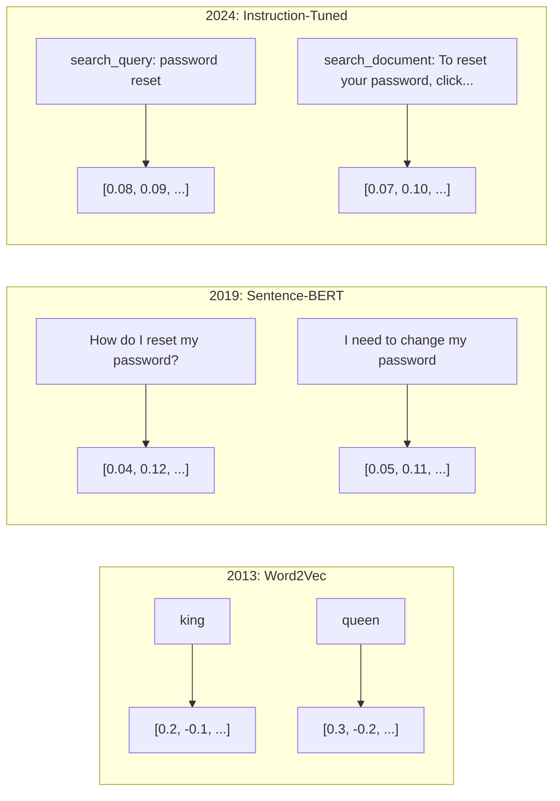
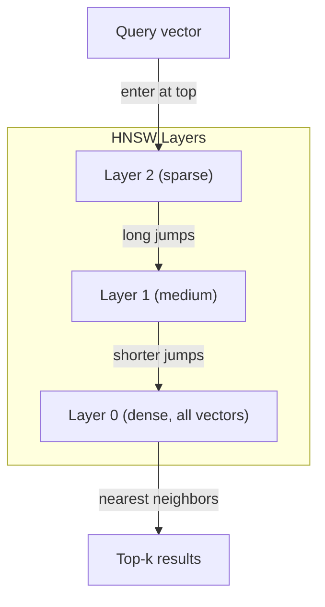
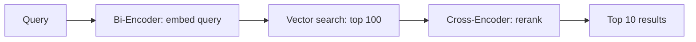

# Embedings & Vector Representations

> O texto é discreto. A matemática é contínua. Toda vez que você pede a um LLM para encontrar documentos "similares", comparar significados ou procurar além de palavras-chave, você está confiando em uma ponte entre esses dois mundos. Essa ponte é um embebimento. Se você não entende embebimentos, você não entende IA moderna. Você só o usa.

**Type:** Build
**Languages:** Python
**Prerequisites:** Phase 11, Lesson 01 (Prompt Engineering)
**Time:** ~75 minutes
**Related:**A fase 5 · 22 (Inclusão de modelos de inserção) abrange densa vs esparsa vs multi-vector, truncamento de Matryoshka e seleção de modelo por eixo. Esta lição se concentra no pipeline de produção (vector DBs, HNSW, matemática de semelhança). Leia a fase 5 · 22 antes de escolher um modelo.

## Objetivos de aprendizagem

- Gerar embalagens de texto usando provedores de API e modelos de código aberto, e calcular similaridade cosínica entre eles
- Explique por que as incorporações resolvem o problema de desajuste de vocabulário que a pesquisa de palavras-chave não pode lidar
- Construir um índice de pesquisa semântica que retira documentos por significado em vez de correspondência exata de palavras-chave
- Avalie a qualidade da incorporação usando referências de recuperação (precision@k, recall) e escolha o modelo de incorporação certo para a sua tarefa

## O problema

Você tem 10.000 ingressos de suporte. Um cliente escreve "meu pagamento não foi feito". Você precisa encontrar ingressos anteriores semelhantes. Pesquisa de palavras-chave encontra ingressos que contêm "pagamento" e "não foi feito".

Este é o problema de desajuste de vocabulário. A linguagem humana tem dezenas de maneiras de dizer a mesma coisa. A pesquisa de palavras-chave trata cada palavra como um símbolo independente sem significado. Não pode saber que "recusado" e "não passou" se referem ao mesmo conceito.

Precisamos de uma representação de texto onde o significado, não a ortografia, determina a semelhança. Precisamos de uma maneira de colocar "o meu pagamento não foi feito" e "a transação foi recusada" juntos em algum espaço matemático, enquanto empurramos "o meu pagamento chegou a tempo" longe, apesar de compartilharmos a palavra "pagamento".

Essa representação é um incorporado.

## O conceito

### O que é um implante?

Um embedding é um vector denso de números de pontos flutuantes que representa o significado do texto. A palavra "densa" importa - cada dimensão carrega informações, ao contrário de representações escassas (saco de palavras, TF-IDF) onde a maioria das dimensões é zero.

"O gato sentou-se no tapete" torna-se algo como`[0.023, -0.041, 0.087, ..., 0.012]`- uma lista de números de 768 a 3072 dependendo do modelo. Estes números codificam o significado.

### O avanço da Word2Vec

Em 2013, Tomas Mikolov e colegas do Google publicaram o Word2Vec. A principal ideia: treinar uma rede neural para prever uma palavra de seus vizinhos (ou vizinhos de uma palavra), e os pesos das camadas ocultas se tornam representações vetoriais significativas.

O famoso resultado:

```
king - man + woman = queen
```

A aritmética vetorial em embutidos palavras capta relações semânticas. A direção de "homem" para "mulher" é aproximadamente a mesma que a direção de "rei" para "rainha". Este foi o momento em que o campo percebeu que a geometria poderia codificar significado.

O Word2Vec produziu vetores de 300 dimensões. Cada palavra recebeu um vetor independentemente do contexto. "Banco" em "banco do rio" e "conto bancário" tinham a mesma incorporação. Esta limitação impulsionou a próxima década de pesquisa.

### De palavras a frases

As incorporações de palavras representam tokens únicos. Os sistemas de produção precisam incorporar frases inteiras, parágrafos ou documentos.

**Averaging**"Cão morde homem" e "homem morde cão" têm as mesmas incorporações.

**CLS token**O modelo de transformador (BERT, 2018) produz um embedding especial de token [CLS] que representa toda a entrada.

**Contrastive learning**A Sentence-BERT (Reimers & Gurevych, 2019) usou essa abordagem e se tornou a base para modelos modernos de incorporação. Dado "Como eu redefinir minha senha?" e "Eu preciso mudar minha senha", o modelo aprende que estes devem ter vetores quase idênticos.

**Instruction-tuned embeddings**O modelo de trabalho é o mais recente: o mais recente método. Modelos como E5 e GTE aceitam um prefixo de tarefa ("search_query:", "search_document:") que diz ao modelo que tipo de incorporação produzir.



### Modelos modernos de incorporação

O mercado se estabeleceu em um punhado de opções de nível de produção (scores MTEB no início de 2026, MTEB v2):

| Model | Provider | Dimensions | MTEB | Context | Cost / 1M tokens |
|-------|----------|-----------|------|---------|------------------|
| Gemini Embedding 2 | Google | 3072 (Matryoshka) | 67.7 (retrieval) | 8192 | $0.15 |
| embed-v4 | Cohere | 1024 (Matryoshka) | 65.2 | 128K | $0.12 |
| voyage-4 | Voyage AI | 1024/2048 (Matryoshka) | 66.8 | 32K | $0.12 |
| text-embedding-3-large | OpenAI | 3072 (Matryoshka) | 64.6 | 8192 | $0.13 |
| text-embedding-3-small | OpenAI | 1536 (Matryoshka) | 62.3 | 8192 | $0.02 |
| BGE-M3 | BAAI | 1024 (dense+sparse+ColBERT) | 63.0 multilingual | 8192 | Open-weight |
| Qwen3-Embedding | Alibaba | 4096 (Matryoshka) | 66.9 | 32K | Open-weight |
| Nomic-embed-v2 | Nomic | 768 (Matryoshka) | 63.1 | 8192 | Open-weight |

MTEB (Massive Text Embedding Benchmark) v2 cobre mais de 100 tarefas em recuperação, classificação, agrupamento, re-ranqueamento e resumo. Mais alto é melhor. Até 2026, os modelos de peso aberto (Qwen3-Embedding, BGE-M3) correspondem ou superam os modelos fechados no maior número de eixos. Gemini Embedding 2 leva a recuperação pura; Voyage/Cohere leva domínios específicos (finance, direito, código). Sempre avaliar as suas próprias perguntas antes de se comprometer.

### Metricas de semelhança

Dados dois vetores de incorporação, três formas de medir o quão semelhantes são:

**Cosine similarity**O cosino do ângulo entre dois vetores varia de -1 (oposto) a 1 (direção idêntica). Ignora a magnitude - uma frase de 10 palavras e um documento de 500 palavras podem obter 1,0 se apontam na mesma direção. Esta é a padrão para 90% dos casos de uso.

```
cosine_sim(a, b) = dot(a, b) / (||a|| * ||b||)
```

**Dot product**O produto interno bruto de dois vetores. Identico à semelhança cosínica quando os vetores são normalizados (longoura de unidade). Mais rápido para calcular. Os incorporados do OpenAI são normalizados, então o produto ponto e o cosínio dão a mesma classificação.

```
dot(a, b) = sum(a_i * b_i)
```

**Euclidean (L2) distance**A distância é de linha reta no espaço vetorial. menor = mais semelhante. sensível às diferenças de magnitude.

```
L2(a, b) = sqrt(sum((a_i - b_i)^2))
```

Quando utilizar:

| Metric | Use when | Avoid when |
|--------|----------|------------|
| Cosine similarity | Comparing texts of different lengths; most retrieval tasks | Magnitude carries information |
| Dot product | Embeddings are already normalized; maximum speed | Vectors have varying magnitudes |
| Euclidean distance | Clustering; spatial nearest-neighbor problems | Comparing documents of wildly different lengths |

### Base de dados de vetores e HNSW

Uma pesquisa de semelhança de força bruta compara a consulta com cada vetor armazenado. Em 1 milhão de vetores com 1536 dimensões, isso é 1,5 bilhão de operações de multiplicação adicionada por consulta.

As bases de dados vetoriais resolvem isso com algoritmos Approximate Nearest Neighbor (ANN). O algoritmo dominante é HNSW (Hierárquico Navegable Small World):

1. Construir um gráfico de vetores de várias camadas
2. As camadas superiores são escassas - conexões de longo alcance entre aglomerados distantes
3. As camadas inferiores são densas - conexões de grãos finos entre vetores próximos
4. A busca começa na camada superior, descendo gananciosamente para refinar
5. Retorna resultados aproximados de top-k em O(log n) tempo em vez de O(n)

O HNSW negocia uma pequena perda de precisão (normalmente 95-99% de recall) para ganhos de velocidade maciços. Em 10 milhões de vetores, a força bruta leva segundos.



Opções de produção:

| Database | Type | Best for | Max scale |
|----------|------|----------|-----------|
| Pinecone | Managed SaaS | Zero-ops production | Billions |
| Weaviate | Open source | Self-hosted, hybrid search | 100M+ |
| Qdrant | Open source | High performance, filtering | 100M+ |
| ChromaDB | Embedded | Prototyping, local dev | 1M |
| pgvector | Postgres extension | Already using Postgres | 10M |
| FAISS | Library | In-process, research | 1B+ |

### Estratégias de desmantelamento

Os documentos são longos demais para serem incorporados como vetores únicos. Um PDF de 50 páginas abrange dezenas de tópicos - a sua incorporação torna-se uma média de tudo, semelhante a nada específico. Dividimos os documentos em pedaços e incorporamos cada um.

**Fixed-size chunking**A divisão de todos os tokens N com tokens M-se sobrepõem. Simples e previsíveis. Funciona bem quando os documentos não têm estrutura clara. Um pedaço de 512 tokens com 50 tokens se sobrepõem: pedaço 1 é tokens 0-511, pedaço 2 é tokens 462-973.

**Sentence-based chunking**A partir daí, o que é mais importante é que o que é preciso para fazer isso é dividir as frases em limites de frases, agrupar frases até atingir o limite simbólico. Cada peça é pelo menos uma frase completa.

**Recursive chunking**Se ainda for grande, tente os limites do parágrafo. Depois, os limites da frase. Então, os limites de caracteres.`RecursiveCharacterTextSplitter`E funciona bem para corpos de formato místico.

**Semantic chunking**Quando a semelhança de inserção cai abaixo de um limiar, comece um novo pedaço.

| Strategy | Complexity | Quality | Best for |
|----------|-----------|---------|----------|
| Fixed-size | Low | Decent | Unstructured text, logs |
| Sentence-based | Low | Good | Articles, emails |
| Recursive | Medium | Good | Markdown, HTML, mixed docs |
| Semantic | High | Best | Critical retrieval quality |

O ponto ideal para a maioria dos sistemas: 256-512 trocos de tokens com 50 tokens sobrepostos.

### Bi-Encoders vs Cross-Encoders

Um bi-encoder incorpora a consulta e os documentos de forma independente, depois compara vetores. Rapido - você inclui a consulta uma vez e compara com as incrustações pré-computadas de documentos. É o que você usa para a recuperação.

Um cross-encoder leva a consulta e um documento como uma única entrada e sai uma pontuação de relevância. Lento - ele processa cada par de consulta-documento através do modelo completo. Mas muito mais preciso porque pode participar de todas as parâmetros de consulta e documento simultaneamente.

O padrão de produção: o bi-encoder retira os 100 candidatos mais importantes, o cross-encoder os re-ranca para o top-10.



Modelos de Rencaminhamento: Cohere Rerank 3.5 ($ 2 por 1000 consultas), BGE-renanker-v2 (livre, código aberto), Jina Reranker v2 (livre, código aberto).

### Embedings de Matryoshka

Os embeddings tradicionais são tudo ou nada. Um vetor de 1536 dimensões usa 1536 flutuantes.

O Matryoshka Representation Learning (Kusupati et al., 2022) corrige isso. O modelo é treinado para que as primeiras dimensões N capturem as informações mais importantes, como uma boneca de nidificação russa.

O sistema de inserção de texto de OpenAI - 3 - pequeno e inserção de texto - 3 - grande - suporta a truncation de Matryoshka através do `dimensions`Para a análise da data, a data de data de lançamento do modelo de referência é de 1536 e de 256, mas não de 1536 dimensões.

### Quantização binária

Uma embuxação em 1536 dimensões armazenada como float32 usa 6.144 bytes. Multiplica por 10 milhões de documentos: 61 GB apenas para vetores.

A quantização binária converte cada flutuante em um único bit: valores positivos se tornam 1, valores negativos se tornam 0.

O hit de precisão é de cerca de 5-10% na recuperação de recall. O padrão comum: quantização binária para a primeira pesquisa de passagem por milhões de vetores, em seguida, rescore o top-1000 com vetores de precisão completa. Isso lhe dá 95% + de precisão completa com 32 vezes menos memória.

```figure
cosine-similarity
```

## Construí-lo

Construímos um motor de busca semântico do zero, sem base de dados vetorial, sem API externa de incorporação, Python puro com numpy para matemática.

### Passo 1: Desembaraçamento de textos

```python
def chunk_text(text, chunk_size=200, overlap=50):
    words = text.split()
    chunks = []
    start = 0
    while start < len(words):
        end = start + chunk_size
        chunk = " ".join(words[start:end])
        chunks.append(chunk)
        start += chunk_size - overlap
    return chunks


def chunk_by_sentences(text, max_chunk_tokens=200):
    sentences = text.replace("\n", " ").split(".")
    sentences = [s.strip() + "." for s in sentences if s.strip()]
    chunks = []
    current_chunk = []
    current_length = 0
    for sentence in sentences:
        sentence_length = len(sentence.split())
        if current_length + sentence_length > max_chunk_tokens and current_chunk:
            chunks.append(" ".join(current_chunk))
            current_chunk = []
            current_length = 0
        current_chunk.append(sentence)
        current_length += sentence_length
    if current_chunk:
        chunks.append(" ".join(current_chunk))
    return chunks
```

### Passo 2: Construir Embedments a partir do zero

Implementamos uma simples incorporação densa usando TF-IDF com normalização L2. Esta não é uma incorporação neural, mas segue o mesmo contrato: texto dentro, vector fora de tamanho fixo, textos semelhantes produzem vectores semelhantes.

```python
import math
import numpy as np
from collections import Counter

class SimpleEmbedder:
    def __init__(self):
        self.vocab = []
        self.idf = []
        self.word_to_idx = {}

    def fit(self, documents):
        vocab_set = set()
        for doc in documents:
            vocab_set.update(doc.lower().split())
        self.vocab = sorted(vocab_set)
        self.word_to_idx = {w: i for i, w in enumerate(self.vocab)}
        n = len(documents)
        self.idf = np.zeros(len(self.vocab))
        for i, word in enumerate(self.vocab):
            doc_count = sum(1 for doc in documents if word in doc.lower().split())
            self.idf[i] = math.log((n + 1) / (doc_count + 1)) + 1

    def embed(self, text):
        words = text.lower().split()
        count = Counter(words)
        total = len(words) if words else 1
        vec = np.zeros(len(self.vocab))
        for word, freq in count.items():
            if word in self.word_to_idx:
                tf = freq / total
                vec[self.word_to_idx[word]] = tf * self.idf[self.word_to_idx[word]]
        norm = np.linalg.norm(vec)
        if norm > 0:
            vec = vec / norm
        return vec
```

### Passo 3: Funções de semelhança

```python
def cosine_similarity(a, b):
    dot = np.dot(a, b)
    norm_a = np.linalg.norm(a)
    norm_b = np.linalg.norm(b)
    if norm_a == 0 or norm_b == 0:
        return 0.0
    return float(dot / (norm_a * norm_b))


def dot_product(a, b):
    return float(np.dot(a, b))


def euclidean_distance(a, b):
    return float(np.linalg.norm(a - b))
```

### Passo 4: Índice de vetores com pesquisa de força bruta

```python
class VectorIndex:
    def __init__(self):
        self.vectors = []
        self.texts = []
        self.metadata = []

    def add(self, vector, text, meta=None):
        self.vectors.append(vector)
        self.texts.append(text)
        self.metadata.append(meta or {})

    def search(self, query_vector, top_k=5, metric="cosine"):
        scores = []
        for i, vec in enumerate(self.vectors):
            if metric == "cosine":
                score = cosine_similarity(query_vector, vec)
            elif metric == "dot":
                score = dot_product(query_vector, vec)
            elif metric == "euclidean":
                score = -euclidean_distance(query_vector, vec)
            else:
                raise ValueError(f"Unknown metric: {metric}")
            scores.append((i, score))
        scores.sort(key=lambda x: x[1], reverse=True)
        results = []
        for idx, score in scores[:top_k]:
            results.append({
                "text": self.texts[idx],
                "score": score,
                "metadata": self.metadata[idx],
                "index": idx
            })
        return results

    def size(self):
        return len(self.vectors)
```

### Passo 5: O mecanismo de busca semântica

```python
class SemanticSearchEngine:
    def __init__(self, chunk_size=200, overlap=50):
        self.embedder = SimpleEmbedder()
        self.index = VectorIndex()
        self.chunk_size = chunk_size
        self.overlap = overlap

    def index_documents(self, documents, source_names=None):
        all_chunks = []
        all_sources = []
        for i, doc in enumerate(documents):
            chunks = chunk_text(doc, self.chunk_size, self.overlap)
            all_chunks.extend(chunks)
            name = source_names[i] if source_names else f"doc_{i}"
            all_sources.extend([name] * len(chunks))
        self.embedder.fit(all_chunks)
        for chunk, source in zip(all_chunks, all_sources):
            vec = self.embedder.embed(chunk)
            self.index.add(vec, chunk, {"source": source})
        return len(all_chunks)

    def search(self, query, top_k=5, metric="cosine"):
        query_vec = self.embedder.embed(query)
        return self.index.search(query_vec, top_k, metric)

    def search_with_scores(self, query, top_k=5):
        results = self.search(query, top_k)
        return [
            {
                "text": r["text"][:200],
                "source": r["metadata"].get("source", "unknown"),
                "score": round(r["score"], 4)
            }
            for r in results
        ]
```

### Passo 6: Comparar as métricas de semelhança

```python
def compare_metrics(engine, query, top_k=3):
    results = {}
    for metric in ["cosine", "dot", "euclidean"]:
        hits = engine.search(query, top_k=top_k, metric=metric)
        results[metric] = [
            {"score": round(h["score"], 4), "preview": h["text"][:80]}
            for h in hits
        ]
    return results
```

## Usá-lo

Com uma API de produção incorporada, a arquitetura permanece idêntica. Somente o incorporador muda:

```python
from openai import OpenAI

client = OpenAI()

def openai_embed(texts, model="text-embedding-3-small", dimensions=None):
    kwargs = {"model": model, "input": texts}
    if dimensions:
        kwargs["dimensions"] = dimensions
    response = client.embeddings.create(**kwargs)
    return [item.embedding for item in response.data]
```

Truncation Matryoshka com OpenAI - mesmo modelo, menos dimensões, armazenamento menor:

```python
full = openai_embed(["semantic search query"], dimensions=1536)
compact = openai_embed(["semantic search query"], dimensions=256)
```

O vector 256-d usa 6 vezes menos armazenamento. Para 10 milhões de documentos, isso é 10 GB vs 61 GB. A perda de precisão é de aproximadamente 3-5% em benchmarks padrão.

Para o rebanho com o Cohere:

```python
import cohere

co = cohere.ClientV2()

results = co.rerank(
    model="rerank-v3.5",
    query="What is the refund policy?",
    documents=["Full refund within 30 days...", "No refunds after 90 days..."],
    top_n=3
)
```

Para as embalagens locais sem dependência da API:

```python
from sentence_transformers import SentenceTransformer

model = SentenceTransformer("BAAI/bge-small-en-v1.5")
embeddings = model.encode(["semantic search query", "another document"])
```

A classe VectorIndex da nossa construção funciona com qualquer um destes.

## Envia-o

Esta lição produz:
- `outputs/prompt-embedding-advisor.md`-- um indicador para escolher modelos e estratégias de incorporação para casos de utilização específicos
- `outputs/skill-embedding-patterns.md`-- uma habilidade que ensina os agentes a usar os incorporados de forma eficaz na produção

## Exercícios

1. **Metric comparison**A análise de dados de dados e de dados de dados é feita através de uma análise de dados de dados de dados de dados de dados de dados de dados de dados de dados de dados de dados de dados de dados de dados de dados de dados de dados de dados de dados de dados de dados de dados de dados de dados de dados de dados de dados de dados de dados de dados de dados de dados de dados de dados de dados de dados de dados de dados de dados de dados de dados de dados de dados de dados de dados de dados de dados de dados de dados de dados de dados de dados de dados de dados de dados de dados de dados de dados de dados de dados de dados de dados de dados de dados de dados de dados de dados de dados de dados de dados de dados de dados de dados de dados de dados de dados de dados de dados de dados de dados de dados de dados de dados de dados de dados de dados de dados de dados de dados de dados de dados de dados de dados de dados de dados de dados de dados de dados de dados de dados de dados de dados de dados de dados de dados de dados de dados de dados de dados de dados de dados de dados de dados de dados de dados de dados de dados de dados de dados de dados de dados de dados de dados de dados de dados de dados de dados de dados de dados de dados de dados de dados de dados de dados de dados de dados de dados de dados de dados de dados de dados de dados de dados de dados de dados de dados de dados de dados de dados de dados de dados de dados de dados de dados de dados de dados de dados de dados de dados de dados de dados de dados de dados de dados de dados de dados de dados de dados de dados de dados de dados de dados de dados de dados de dados de dados de dados de dados de dados de dados de dados de dados de dados de dados de dados de dados de dados de dados de dados de dados de dados de dados de dados de dados de dados de dados de dados de dados de dados de dados de dados de dados de dados de dados de dados de dados de dados de dados de dados de dados de dados de dados de dados de dados de dados de dados de dados de dados de dados de dados de dados de dados de dados de dados de dados de dados de dados de dados de dados de dados de dados de dados de dados de dados de dados de dados de dados de dados de dados de dados de dados de dados de dados de dados de dados de dados de

2. **Chunk size experiment**Para cada uma, executar 5 consultas e gravar a pontuação de semelhança superior-1. desenhar a relação entre o tamanho da peça e a qualidade da recuperação. Encontrar o ponto onde as peças maiores começam a sofrer.

3. **Matryoshka simulation**A partir daí, a máquina de retorno de dados pode ser usada para criar um simples embedder que produz vetores de 500 d. Truncate para 50, 100, 200, e 500 dimensões.

4. **Binary quantization**A pesquisa de distância de Hamming: tomar os embeddings do motor de busca, convertê-los em binário (1 se positivo, 0 se negativo), e implementar a pesquisa de distância de Hamming. Compare os 10 primeiros resultados com a semelhança cosínica de precisão total. Meter a porcentagem de sobreposição.

5. **Sentence-based chunking**: substituir o chunking de tamanho fixo por `chunk_by_sentences`- Faça as mesmas perguntas e compare os resultados de recuperação.

## Termos-chave

| Term | What people say | What it actually means |
|------|----------------|----------------------|
| Embedding | "Text to numbers" | A dense vector where geometric proximity encodes semantic similarity |
| Word2Vec | "The OG embedding" | 2013 model that learned word vectors by predicting context words; proved vector arithmetic encodes meaning |
| Cosine similarity | "How similar are two vectors" | Cosine of the angle between vectors; 1 = identical direction, 0 = orthogonal, -1 = opposite |
| HNSW | "Fast vector search" | Hierarchical Navigable Small World graph -- multi-layer structure enabling O(log n) approximate nearest neighbor search |
| Bi-encoder | "Embed separately, compare fast" | Encodes query and document independently into vectors; enables pre-computation and fast retrieval |
| Cross-encoder | "Slow but accurate reranker" | Processes query-document pair jointly through the full model; higher accuracy, no pre-computation |
| Matryoshka embeddings | "Truncatable vectors" | Embeddings trained so the first N dimensions capture the most important information, enabling variable-size storage |
| Binary quantization | "1-bit embeddings" | Converting float vectors to binary (sign bit only) for 32x storage reduction with Hamming distance search |
| Chunking | "Split docs for embedding" | Breaking documents into 256-512 token segments so each can be independently embedded and retrieved |
| Vector database | "Search engine for embeddings" | Data store optimized for storing vectors and performing approximate nearest neighbor search at scale |
| Contrastive learning | "Train by comparison" | Training approach that pushes similar pair embeddings together and dissimilar pair embeddings apart |
| MTEB | "The embedding benchmark" | Massive Text Embedding Benchmark -- 56 datasets across 8 tasks; standard for comparing embedding models |

## Mais leitura

- Mikolov et al., "Estimação eficiente de representações de palavras no espaço vetorial" (2013) -- o artigo Word2Vec que iniciou a revolução de incorporação com a analogia rei-rainha
- Reimers & Gurevych, "Sentence-BERT: Embeddings de sentenças usando redes BERT-Siamese" (2019) -- como treinar bi-encoders para semelhança de nível de sentença, a base de modelos modernos de incorporação
- Kusupati et al., "Matryoshka Representation Learning" (2022) -- a técnica por trás de embebimentos de dimensões variáveis que a OpenAI adotou para embebimento de texto-3
- Malkov & Yashunin, "Eficiente e robusto Próximo Próximo Próximo usando Hierárquicos Navegable Small World Graphs" (2018) -- o papel HNSW, o algoritmo por trás da maioria das pesquisas de vetores de produção
- Guia de incorporação da OpenAI (platform.openai.com/docs/guides/embeddings) -- referência prática para modelos de incorporação de texto-3, incluindo a redução de dimensões Matryoshka
- MTEB Leaderboard (huggingface.co/spaces/mteb/leaderboard) - referência ao vivo que compara todos os modelos de incorporação entre tarefas e idiomas
- [Muennighoff et al., "MTEB: Massive Text Embedding Benchmark" (EACL 2023)](https://arxiv.org/abs/2210.07316)-- o índice de referência que define 8 categorias de tarefas (classificação, agrupamento, classificação de pares, re-ranqueamento, recuperação, STS, resumo, mineração de bittex) que o ranking relata; leia antes de confiar em qualquer pontuação MTEB.
- [Sentence Transformers documentation](https://www.sbert.net/)-- referência canônica para bi-encoder vs cross-encoder, estratégias de pooling, e o ingest-split-embed-store RAG pipeline esta lição implementa.
