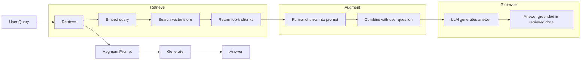
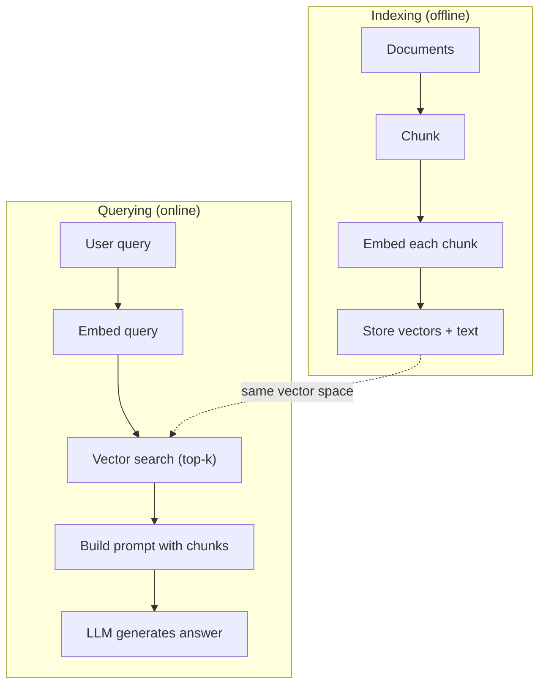

# RAG (Geração Aumentada pela Recuperação)

> O seu Mestrado em Direito sabe tudo até o seu período de treinamento. Ele não sabe nada sobre os documentos da sua empresa, sua base de código ou as notas de reunião da semana passada. RAG resolve isso recuperando documentos relevantes e colocando-os no prompt. É o padrão mais implantado na IA de produção. Se você construir uma coisa a partir deste curso, construir um oleoduto RAG.

**Type:** Build
**Languages:** Python
**Prerequisites:** Phase 10 (LLMs from Scratch), Phase 11 Lessons 01-05
**Time:** ~90 minutes
**Related:**Fase 5 · 23 (Estratégias de Chunking para RAG) para os seis algoritmos de chunking e quando cada um ganha. Fase 5 · 22 (Dip Deep Dive em Embedding Models) para escolher o incorporador. Fase 11 · 07 (Advanced RAG) para pesquisa híbrida, re-ranqueamento e transformação de consulta.

## Objetivos de aprendizagem

- Construir um conjunto completo de RAG: carregamento de documentos, fragmentação, incorporação, armazenamento de vetores, recuperação e geração
- Implementar a pesquisa semântica usando um banco de dados vetorial (ChromaDB, FAISS ou Pinecone) com indexação adequada
- Explicar por que a RAG é preferida ao ajuste fino para aplicações baseadas no conhecimento (custo, frescura, atribuição)
- Avaliação da qualidade do RAG utilizando métricas de recuperação (precisão, retirada) e métricas de geração (filidade, relevância)

## O problema

Você constrói um chatbot para sua empresa. Um cliente pergunta: "Qual é a política de reembolso para planos empresariais?" O LLM responde com uma resposta genérica sobre políticas típicas de reembolso SaaS. A política real, enterrada em uma wiki interna de 200 páginas, diz que os clientes empresariais recebem uma janela de 60 dias com reembolsos pro-rated. O LLM nunca viu este documento. Não pode saber sobre o que não foi treinado.

O processo de ajuste é uma solução. Tome o LLM, treine-o em seus documentos internos e implante o modelo atualizado. Isso funciona, mas tem sérios problemas. O ajuste fino custa milhares de dólares em cálculo. O modelo fica obsoleto no momento em que um documento muda. Você não tem forma de saber de que fonte o modelo foi extraído. E se a empresa adquire outra linha de produtos no próximo mês, você ajuste novamente.

O RAG é a outra solução. Deixe o modelo intacto. Quando uma pergunta for recebida, procure em seu arquivo de documentos passagens relevantes, coje-as no prompt antes da pergunta e deixe o modelo responder usando essas passagens como contexto. A loja de documentos pode ser atualizada em minutos. Pode ver exatamente quais documentos foram recuperados. O modelo em si nunca muda. É por isso que o RAG é o padrão dominante na produção: é mais barato, mais fresco, mais auditable e funciona com qualquer LLM.

## O conceito

### O padrão RAG

O padrão inteiro se encaixa em quatro etapas:



Query -> Retrieve -> Augment prompt -> Generate. Cada sistema RAG segue este padrão. As diferenças entre os sistemas RAG de produção estão nos detalhes de cada etapa: como você se divide, como você incorpora, como você busca e como você constrói o prompt.

### Por que o RAG é melhor do que o ajuste fino

| Concern | Fine-tuning | RAG |
|---------|------------|-----|
| Cost | $1,000-$100,000+ per training run | $0.01-$0.10 per query (embedding + LLM) |
| Freshness | Stale until retrained | Updated in minutes by re-indexing docs |
| Auditability | Cannot trace answer to source | Can show exact retrieved passages |
| Hallucination | Still hallucinates freely | Grounded in retrieved documents |
| Data privacy | Training data baked into weights | Documents stay in your vector store |

O ajuste fino altera os pesos do modelo permanentemente. RAG altera o contexto do modelo temporariamente. Para a maioria das aplicações, o contexto temporário é o que você quer.

O único caso em que o ajuste fino ganha: quando você precisa que o modelo adotem um estilo, tom ou padrão de raciocínio específico que não pode ser alcançado apenas através de solicitação.

### Introdução de modelos

Um modelo de incorporação converte texto em um vetor denso. textos semelhantes produzem vetores que estão próximos uns dos outros neste espaço de alta dimensão. "Como eu redefinir minha senha?" e "Eu preciso mudar minha senha" produzem vetores quase idênticos apesar de compartilhar poucas palavras. "O gato sentado no tapete" produz um vetor muito diferente.

Modelos comuns de incorporação (linha de 2026  ver Fase 5 · 22 para análise completa):

| Model | Dimensions | Provider | Notes |
|-------|-----------|----------|-------|
| text-embedding-3-small | 1536 (Matryoshka) | OpenAI | Best price/performance for most use cases |
| text-embedding-3-large | 3072 (Matryoshka) | OpenAI | Higher accuracy, truncatable to 256/512/1024 |
| Gemini Embedding 2 | 3072 (Matryoshka) | Google | Top MTEB retrieval; 8K context |
| voyage-4 | 1024/2048 (Matryoshka) | Voyage AI | Domain variants (code, finance, law) |
| Cohere embed-v4 | 1024 (Matryoshka) | Cohere | Strong multilingual, 128K context |
| BGE-M3 | 1024 (dense + sparse + ColBERT) | BAAI (open-weight) | Three views from one model |
| Qwen3-Embedding | 4096 (Matryoshka) | Alibaba (open-weight) | Top open-weight retrieval score |
| all-MiniLM-L6-v2 | 384 | Open-weight (Sentence Transformers) | Prototyping baseline |

Para esta lição, construímos nossa própria incorporação simples usando o TF-IDF. Não porque o TF-IDF seja o que os sistemas de produção usam, mas porque torna o conceito concreto: o texto entra, um vetor sai, textos semelhantes produzem vetores semelhantes.

### Semelhança de vetores

Dadas duas vetores, como você mede a semelhança?

**Cosine similarity**O cosino do ângulo entre dois vetores varia de -1 (oposto) a 1 (identico).

```
cosine_sim(a, b) = dot(a, b) / (||a|| * ||b||)
```

**Dot product**Os vectores maiores obtêm pontuações mais altas. Úteis quando a magnitude transporta informações (documentos mais longos podem ser mais relevantes).

```
dot(a, b) = sum(a_i * b_i)
```

**L2 (Euclidean) distance**A distância é igual a: distância de linha reta no espaço vetorial. Distância menor = mais semelhante.

```
L2(a, b) = sqrt(sum((a_i - b_i)^2))
```

A semelhança cosínica é o padrão. trata documentos de diferentes comprimentos graciosamente porque normaliza em magnitude. Quando alguém diz "busca vetorial", quase sempre se refere à semelhança cosínica.

### Estratégias de desmantelamento

Os documentos são longos demais para serem incorporados como vetores individuais. Um PDF de 50 páginas pode produzir uma incorporação terrível porque contém dezenas de tópicos. Em vez disso, você divide os documentos em pedaços e inserir cada pedaço separadamente.

**Fixed-size chunking**Uma peça de 512 tokens com 50 tokens sobrepondo significa que o pedaço 1 é tokens 0-511, o pedaço 2 é tokens 462-973, e assim por diante. A sobreposição garante que você não divide uma frase em um limite azaroso.

**Semantic chunking**A definição de um elemento é: um elemento que é um elemento de uma unidade de significado coerente, mais complexo de implementar, mas que produz uma melhor recuperação.

**Recursive chunking**Se uma seção ainda é muito grande, divide-a nos limites de parágrafos. Se um parágrafo ainda é muito grande, divide-o nos limites de frases. Esta é a abordagem de LangChain RecursiveCharacterTextSplitter e funciona bem na prática.

O tamanho das peças importa mais do que as pessoas pensam:

- Muito pequenos (64-128 tokens): cada peça carece de contexto. "Aumentou 15% no último trimestre" não significa nada sem saber o que "ele" se refere.
- Muito grande (2048+ tokens): cada peça cobre vários tópicos, diluindo a relevância. Quando você procura dados de receita, você obtém uma peça que é 10% sobre receita e 90% sobre número de funcionários.
- Sweet spot (256-512 tokens): contexto suficiente para ser autocontenido, focado o suficiente para ser relevante.

A maioria dos sistemas RAG de produção usa 256-512 trocos de tokens com 50 tokens sobrepostos.

### Base de dados de vetores

Uma vez que você tem incorporados, você precisa de algum lugar para armazená-los e pesquisar.

| Database | Type | Best for |
|----------|------|----------|
| FAISS | Library (in-process) | Prototyping, small to medium datasets |
| Chroma | Lightweight DB | Local development, small deployments |
| Pinecone | Managed service | Production without ops overhead |
| Weaviate | Open source DB | Self-hosted production |
| pgvector | Postgres extension | Already using Postgres |
| Qdrant | Open source DB | High-performance self-hosted |

Para esta lição, construímos um simples armazenamento de vetores na memória. Ele armazena vetores em uma lista e faz pesquisa de semelhança cosínica de força bruta. Isso é equivalente a FAISS com um índice plano. Escala até talvez 100.000 vetores antes de ficar lento. Sistemas de produção usam algoritmos vizinhos mais próximos (ANN) aproximados como HNSW para pesquisar milhões de vetores em milissegundos.

### O oleoduto completo



A fase de indexação é executada uma vez por documento (ou quando os documentos são atualizados). A fase de consulta é executada em cada solicitação do usuário.

### Números reais

A maioria dos sistemas RAG de produção utiliza estes parâmetros:

- **k = 5 to 10**fragmentos recuperados por consulta
- **Chunk size = 256 to 512 tokens**com 50 tokens sobrepostos
- **Context budget**: 2.500-5.000 tokens de conteúdo recuperado por consulta
- **Total prompt**: ~ 8.000-16.000 tokens (promulgação do sistema + pedaços recuperados + histórico de conversa + consulta do usuário)
- **Embedding dimension**: 384-3072 dependendo do modelo
- **Indexing throughput**: 100 a 1000 documentos por segundo com incorporações de API
- **Query latency**: 50-200ms para recuperação, 500-3000ms para geração

```figure
rag-chunking
```

## Construí-lo

### Passo 1: Cumpração de documentos

```python
def chunk_text(text, chunk_size=200, overlap=50):
    words = text.split()
    chunks = []
    start = 0
    while start < len(words):
        end = start + chunk_size
        chunk = " ".join(words[start:end])
        chunks.append(chunk)
        start += chunk_size - overlap
    return chunks
```

### Passo 2: Embedings TF-IDF

Construímos uma função de incorporação simples. TF-IDF (Term Frequency-Inverse Document Frequency) não é uma incorporação neural, mas converte texto em vetores de uma forma que capta a importância das palavras. As palavras frequentes em um documento ganham TF mais alto. As palavras raras em todo o corpo ganham IDF mais alto. O produto dá um vetor onde palavras importantes e distintas têm valores elevados.

```python
import math
from collections import Counter

def build_vocabulary(documents):
    vocab = set()
    for doc in documents:
        vocab.update(doc.lower().split())
    return sorted(vocab)

def compute_tf(text, vocab):
    words = text.lower().split()
    count = Counter(words)
    total = len(words)
    return [count.get(word, 0) / total for word in vocab]

def compute_idf(documents, vocab):
    n = len(documents)
    idf = []
    for word in vocab:
        doc_count = sum(1 for doc in documents if word in doc.lower().split())
        idf.append(math.log((n + 1) / (doc_count + 1)) + 1)
    return idf

def tfidf_embed(text, vocab, idf):
    tf = compute_tf(text, vocab)
    return [t * i for t, i in zip(tf, idf)]
```

### Passo 3: Pesquisa de semelhança cosínica

```python
def cosine_similarity(a, b):
    dot = sum(x * y for x, y in zip(a, b))
    norm_a = math.sqrt(sum(x * x for x in a))
    norm_b = math.sqrt(sum(x * x for x in b))
    if norm_a == 0 or norm_b == 0:
        return 0.0
    return dot / (norm_a * norm_b)

def search(query_embedding, stored_embeddings, top_k=5):
    scores = []
    for i, emb in enumerate(stored_embeddings):
        sim = cosine_similarity(query_embedding, emb)
        scores.append((i, sim))
    scores.sort(key=lambda x: x[1], reverse=True)
    return scores[:top_k]
```

### Passo 4: Construção rápida

É aqui que acontece o "aumentado" no RAG. Pegue os pedaços recuperados, formatá-los em um prompt e peça ao LLM para responder com base no contexto fornecido.

```python
def build_rag_prompt(query, retrieved_chunks):
    context = "\n\n---\n\n".join(
        f"[Source {i+1}]\n{chunk}"
        for i, chunk in enumerate(retrieved_chunks)
    )
    return f"""Answer the question based ONLY on the following context.
If the context doesn't contain enough information, say "I don't have enough information to answer that."

Context:
{context}

Question: {query}

Answer:"""
```

### Passo 5: O oleoduto RAG completo

```python
class RAGPipeline:
    def __init__(self):
        self.chunks = []
        self.embeddings = []
        self.vocab = []
        self.idf = []

    def index(self, documents):
        all_chunks = []
        for doc in documents:
            all_chunks.extend(chunk_text(doc))
        self.chunks = all_chunks
        self.vocab = build_vocabulary(all_chunks)
        self.idf = compute_idf(all_chunks, self.vocab)
        self.embeddings = [
            tfidf_embed(chunk, self.vocab, self.idf)
            for chunk in all_chunks
        ]

    def query(self, question, top_k=5):
        query_emb = tfidf_embed(question, self.vocab, self.idf)
        results = search(query_emb, self.embeddings, top_k)
        retrieved = [(self.chunks[i], score) for i, score in results]
        prompt = build_rag_prompt(
            question, [chunk for chunk, _ in retrieved]
        )
        return prompt, retrieved
```

### Passo 6: Geração (simulada)

Na produção, é aqui que chamamos a API LLM. Para esta aula, simulamos a geração extraindo a frase mais relevante do contexto recuperado.

```python
def simple_generate(prompt, retrieved_chunks):
    query_words = set(prompt.lower().split("question:")[-1].split())
    best_sentence = ""
    best_score = 0
    for chunk in retrieved_chunks:
        for sentence in chunk.split("."):
            sentence = sentence.strip()
            if not sentence:
                continue
            words = set(sentence.lower().split())
            overlap = len(query_words & words)
            if overlap > best_score:
                best_score = overlap
                best_sentence = sentence
    return best_sentence if best_sentence else "I don't have enough information."
```

## Usá-lo

Com um modelo de incorporação real e LLM, o código dificilmente muda:

```python
from openai import OpenAI

client = OpenAI()

def embed(text):
    response = client.embeddings.create(
        model="text-embedding-3-small",
        input=text
    )
    return response.data[0].embedding

def generate(prompt):
    response = client.chat.completions.create(
        model="gpt-4o-mini",
        messages=[{"role": "user", "content": prompt}],
        temperature=0
    )
    return response.choices[0].message.content
```

Ou com o Anthropic:

```python
import anthropic

client = anthropic.Anthropic()

def generate(prompt):
    response = client.messages.create(
        model="claude-sonnet-5",
        max_tokens=1024,
        messages=[{"role": "user", "content": prompt}]
    )
    return response.content[0].text
```

O pipeline é o mesmo. Troca a função de incorporação. Troca a função de geração. A lógica de recuperação, o cluster, a construção rápida - tudo idêntico, independentemente do modelo que você usar.

Para armazenamento de vetores em escala, substituir a busca de força bruta por um banco de dados de vetores adequado:

```python
import chromadb

client = chromadb.Client()
collection = client.create_collection("my_docs")

collection.add(
    documents=chunks,
    ids=[f"chunk_{i}" for i in range(len(chunks))]
)

results = collection.query(
    query_texts=["What is the refund policy?"],
    n_results=5
)
```

O Chroma lida com a incorporação internamente (usando all-MiniLM-L6-v2 por padrão) e armazena os vetores em um banco de dados local.

## Envia-o

Esta lição produz:
- `outputs/prompt-rag-architect.md`-- um aviso para a concepção de sistemas RAG para casos de utilização específicos
- `outputs/skill-rag-pipeline.md`- Uma habilidade que ensina os agentes a construir e depurar os gasodutos RAG

## Exercícios

1. Substitua as incorporações do TF-IDF por uma abordagem simples de sacos de palavras (binário: 1 se a palavra estiver presente, 0 se não estiver). Compare a qualidade de recuperação dos documentos de amostra.

2. Experimente com tamanhos de peças: tente 50, 100, 200 e 500 palavras no mesmo conjunto de documentos. Para cada tamanho, execute as mesmas 5 consultas e conte quantas retornam um peço relevante no topo-3.

3. Adicionar metadados a cada peça (nome do documento fonte, posição da peça). Modificar o modelo de solicitação para incluir atribuição de fonte para que o LLM cite suas fontes.

4. Implementar uma avaliação simples: dado 10 pares de perguntas e respostas, executar cada pergunta através do RAG pipeline, e medir qual porcentagem de pedaços recuperados contêm a resposta.

5. Construir um pipeline RAG consciente de conversação: manter um histórico das últimas 3 trocas e incluí-las no prompt ao lado dos pedaços recuperados. Teste com perguntas de acompanhamento como "E sobre empresa?" depois de perguntar sobre preços.

## Termos-chave

| Term | What people say | What it actually means |
|------|----------------|----------------------|
| RAG | "AI that reads your docs" | Retrieve relevant documents, paste them into the prompt, and generate an answer grounded in those documents |
| Embedding | "Convert text to numbers" | A dense vector representation of text where similar meanings produce similar vectors |
| Vector database | "Search engine for AI" | A data store optimized for storing vectors and finding the nearest neighbors by similarity |
| Chunking | "Split docs into pieces" | Breaking documents into smaller segments (typically 256-512 tokens) so each can be embedded and retrieved independently |
| Cosine similarity | "How similar are two vectors" | The cosine of the angle between two vectors; 1 = identical direction, 0 = orthogonal, -1 = opposite |
| Top-k retrieval | "Get the k best matches" | Return the k most similar chunks to the query from the vector store |
| Context window | "How much text the LLM can see" | The maximum number of tokens the LLM can process in a single request; retrieved chunks must fit within this |
| Augmented generation | "Answer using given context" | Generating a response using retrieved documents as context rather than relying solely on trained knowledge |
| TF-IDF | "Word importance scoring" | Term Frequency times Inverse Document Frequency; weights words by how distinctive they are within a corpus |
| Indexing | "Preparing docs for search" | The offline process of chunking, embedding, and storing documents so they can be searched at query time |

## Mais leitura

- Lewis et al., "Generação de recuperação aumentada para tarefas de PNL intensivas em conhecimento" (2020) - o artigo original do RAG da Pesquisa de IA do Facebook que formalizou o padrão de recuperação e geração
- Documentação RAG da Anthropic (docs.anthropic.com) - diretrizes práticas para tamanhos de peças, construção rápida e avaliação
- Centro de Aprendizagem Pinecone, "O que é RAG?" - Explicações visuais claras do gasoduto RAG com considerações de produção
- Sentença-BERT: Reimers & Gurevych (2019) -- o artigo por trás dos modelos de incorporação MiniLM, mostrando como treinar bi-encodadores para semântica semelhança
- [Karpukhin et al., "Dense Passage Retrieval for Open-Domain Question Answering" (EMNLP 2020)](https://arxiv.org/abs/2004.04906)- O documento DPR que provou a recuperação de bi-encoder denso supera o BM25 em área aberta de análise e define o padrão para os modernos retreadores RAG.
- [LlamaIndex High-Level Concepts](https://docs.llamaindex.ai/en/stable/getting_started/concepts.html)-- os principais conceitos a conhecer ao construir pipelines RAG: carregadores de dados, parseres de nós, índices, retrievers, sintetizadores de resposta.
- [LangChain RAG tutorial](https://python.langchain.com/docs/tutorials/rag/)- o orquestrador de sabor oposto; visão de cadeia de executáveis do mesmo padrão de recuperação e geração.
