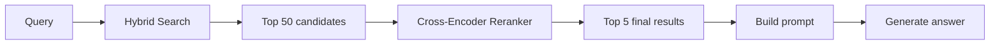
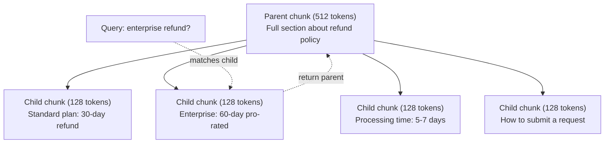
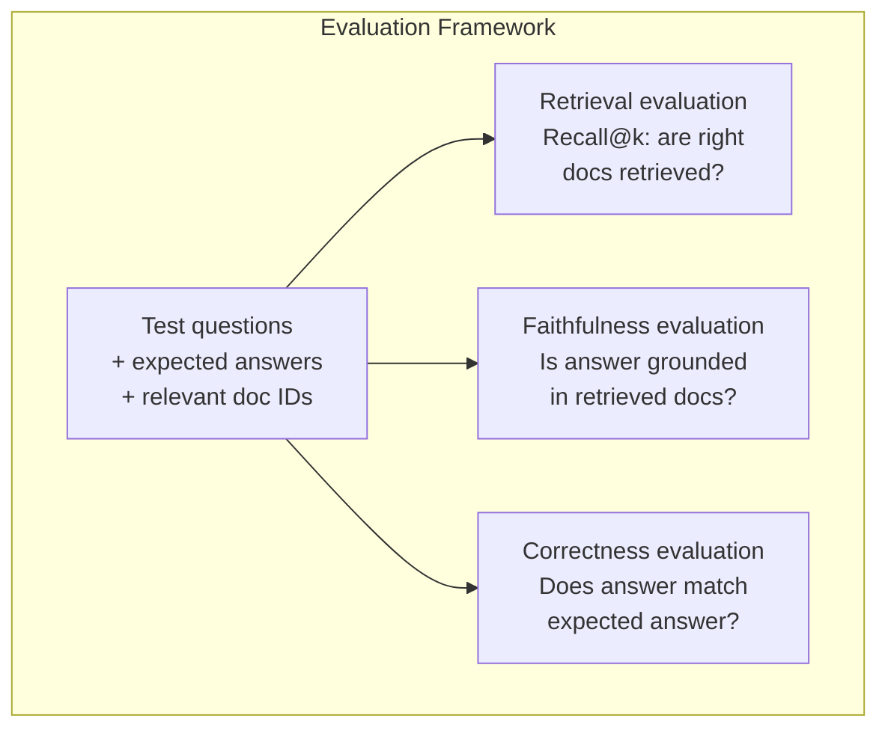

# RAG avançado (Combinação, Relançamento, Pesquisa híbrida)

> RAG básico recupera os pedaços mais semelhantes. Isso funciona para perguntas simples. Desmorona para raciocínio multi-hop, consultas ambíguas e grandes corporações. RAG avançado é a diferença entre uma demonstração que funciona em 10 documentos e um sistema que funciona em 10 milhões.

**Type:** Build
**Languages:** Python
**Prerequisites:** Phase 11, Lesson 06 (RAG)
**Time:** ~90 minutes
**Related:**A fase 5 · 23 (Estratégias de Chunking para RAG) abrange todos os seis algoritmos de chunking  recursivo, semântico, frase, documento-mãe, chunking tardia, recuperação contextual  com benchmarks Vectara/Antropic. Esta lição se baseia em cima: busca híbrida, re-ranqueamento, transformação de consulta.

## Objetivos de aprendizagem

- Implementar estratégias avançadas de fragmentação (semântica, recursiva, pai/filho) que preservem a estrutura e o contexto do documento
- Construir um pipeline de pesquisa híbrida combinando a combinação de palavras-chave BM25 com pesquisa semântica vetorial e um re-ranqueador de codificação cruzada
- Aplicar técnicas de transformação de consultas (HyDE, multi-query, step-back) para melhorar a recuperação em questões ambíguas ou complexas
- Diagnóstico e correção de falhas comuns do RAG: fragmento errado recuperado, resposta não contextual, desvio de raciocínio multi-hop

## O problema

Construíste um sistema básico de RAG na lição 06. Funciona para perguntas simples num pequeno corpo.

**Ambiguous query**A pesquisa semântica retorna pedaços sobre a estratégia de receita, as projeções de receita e os pensamentos do CFO sobre o crescimento da receita. Tudo semânticamente semelhante à palavra "receita". Nenhum contém o número real. A peça correta diz "$47.2M in Q3 2025" but uses the word "earnings" instead of "revenue." The embedding model thinks "revenue strategy" is closer to the query than "Q3 earnings were $47,2 M".

**Multi-hop question**A resposta é: "Qual equipe teve a maior melhoria na pontuação de satisfação do cliente?" Isso requer encontrar as pontuações de satisfação de cada equipe, compará-las e identificar o máximo. Nenhuma peça única contém a resposta.

**Large corpus problem**Você tem 2 milhões de blocos. A resposta correta é no bloco # 1,847,293. Sua busca no top 5 tira blocos # 14, # 89,201, # 1,200,000, # 44, e # 901,333. Fechado em espaço de inserção, mas nenhum contendo a resposta. Nesta escala, a pesquisa próxima aproximada introduz erro suficiente para que os resultados relevantes sejam empurrados para fora do top-k.

O RAG básico falha porque a semelhança vectorial não é o mesmo que a relevância. Um pedaço pode ser semânticamente semelhante a uma consulta sem ser útil para responder a ela. O RAG avançado aborda isso com quatro técnicas: pesquisa híbrida (aditar a correspondência de palavras-chave), re-ranqueamento (pontuar os candidatos com mais cuidado), transformação de consulta (fixar a consulta antes de pesquisar) e melhor fragmentação (recuperar na granularidade certa).

## O conceito

### Pesquisa híbrida: Semântica + Palavra-chave

A pesquisa semântica (semelhança vectorial) é boa para entender o significado. "Como cancelar minha assinatura?" coincide com "Pasos para rescindir seu plano", embora eles não compartilhem palavras. Mas não tem correspondências exatas. "Code de erro E-4021" pode não corresponder a um pedaço contendo "E-4021" se o modelo de incorporação o tratar como ruído.

Busca de palavras-chave (BM25) é o oposto. Excelente em correspondências exatas. "E-4021" combina perfeitamente. Mas "cancelar minha assinatura" retorna resultados zero se o documento diz "terminar o seu plano".

A busca híbrida executa ambas as coisas, e depois mistura os resultados.

**BM25**(Best Matching 25) é o algoritmo padrão de pesquisa de palavras-chave.

```
BM25(q, d) = sum over terms t in q:
    IDF(t) * (tf(t,d) * (k1 + 1)) / (tf(t,d) + k1 * (1 - b + b * |d| / avgdl))
```

Onde tf(t,d) é a frequência termânea de t no documento d, IDF(t) é a frequência documental inversa, \ \ \ \ \ \ \ \ \ \ \ \ \ \ \ \ \ \ \ \ \ \ \ \ \ \ \ \ \ \ \ \ \ \ \ \ \ \ \ \ \ \ \ \ \ \ \ \ \ \ \ \ \ \ \ \ \ \ \ \ \ \ \ \ \ \ \ \ \ \ \ \ \ \ \ \ \ \ \ \ \ \ \ \ \ \ \ \ \ \ \ \ \ \ \ \ \ \ \ \ \ \ \ \ \ \ \ \ \ \ \ \ \ \ \ \ \ \ \ \ \ \ \ \ \ \ \ \ \ \ \ \ \ \ \ \ \ \ \ \ \ \ \ \ \ \ \ \ \ \ \ \ \ \ \ \ \ \ \ \ \ \ \ \ \ \ \ \ \ \ \ \ \ \ \ \ \ \ \ \ \ \ \ \ \ \ \ \ \ \ \ \ \ \ \ \ \ \ \ \ \ \ \ \ \ \ \ \ \ \ \ \ \ \ \ \ \ \ \ \ \ \ \ \ \ \ \ \ \ \ \ \ \ \ \ \ \ \ \ \ \ \ \ \ \ \ \ \ \ \ \ \ \ \ \ \ \ \ \ \ \ \ \ \ \ \ \ \ \ \ \ \ \ \ \ \ \ \ \ \ \ \ \ \ \ \ \ \ \ \ \ \ \ \ \ \ \ \ \ \ \ \ \ \ \ \ \ \ \ \ \ \ \ \ \ \ \ \ \ \ \ \ \ \ \ \ \ \ \ \ \ \ \ \ \ \ \ \ \ \ \ \ \ \ \ \ \ \ \ \ \ \ \ \ \ \ \ \ \ \ \ \ \ \ \ \ \ \ \ \ \ \ \ \ \ \ \ \ \ \ \ \ \ \ \ \ \ \ \ \ \ \ \ \ \ \ \ \ \ \ \ \ \ \ \ \ \ \ \ \ \ \ \ \ \ \ \ \ \ \ \ \ \ \ \ \ \ \ \ \ \ \ \ \ \ \ \ \ \ \ \ \ \ \ \ \ \ \ \ \ \ \ \ \ \ \ \ \ \ \ \ \ \ \ \ \ \ \ \ \ \ \ \ \ \ \

Em termos simples: o BM25 classifica documentos mais altos quando contêm termos de consulta (especialmente os raros), mas com retornos diminuindo para termos repetidos.

### Fusão de grau recíproco (RRF)

Você tem duas listas classificadas: uma da pesquisa vetorial, uma do BM25. Como você as combina?

```
RRF_score(d) = sum over rankings R:
    1 / (k + rank_R(d))
```

Onde k é uma constante (tipicamente 60) que impede que o resultado de topo seja dominado.

Um documento classificado como #1 na pesquisa vetorial e #5 na BM25 obtém: 1/(60+1) + 1/(60+5) = 0.0164 + 0.0154 = 0.0318

Um documento classificado #3 na pesquisa vetorial e #2 na BM25 obtém: 1/(60+3) + 1/(60+2) = 0.0159 + 0.0161 = 0.0320

O RRF balanceia naturalmente os dois sinais. Um documento que ocupa um lugar alto em ambas as listas obtém a melhor pontuação. Um documento que ocupa o lugar 1 em uma lista, mas está ausente da outra, obtém uma pontuação moderada.

### Renclassificação

A recuperação (seja vector, palavra-chave ou híbrido) é rápida, mas imprecisa. Utiliza bi-encoders: a consulta e cada documento são incorporados de forma independente, depois comparados. Os incorporados são calculados uma vez e armazenados em cache.

O Ranking usa encodadores cruzados: a consulta e um documento candidato são alimentados juntos em um modelo que produz uma pontuação de relevância. O modelo vê ambos os textos simultaneamente e pode capturar interações de graus finos entre eles. Um encodador cruzado pode entender que "Q3 ganhos foram?" é altamente relevante para um pedaço contendo "$47.2M no Q3" mesmo que um bi-encodador não tenha a conexão.

O compromisso: os cross-encoders são 100-1000 vezes mais lentos que os bi-encoders porque processam o par de consulta-documento em conjunto. Você não pode calcular pré-scores de cross-encoder para um milhão de documentos. A solução: recuperar um conjunto de candidatos maior (top-50 da pesquisa híbrida), em seguida, re-ranquear com um cross-encoder para obter o top-5 final.



Modelos comuns de re-ranqueamento (2026 lineup):
- Rerank de coesão 3.5: API gerenciada, multilíngue, melhor ganho de recall em corpora mistas
- Rencontre de viagem-2.5: API gerenciada, menor latência das opções hospedadas
- Jina-Reranker-v2 Multilíngue: peso aberto, mais de 100 línguas
- bge-re-ranquerer-v2-m3: peso aberto, linha de base forte
- cross-encoder/ms-marco-MiniLM-L-6-v2: peso aberto, executado em CPU para prototipagem
- ColBERTv2 / Jina-ColBERT-v2: retrasos interação re-ranqueadores multi-vector  Tokens (não O(docs) no tempo de pontuação

### Transformação de consulta

Às vezes, o problema não é a recuperação, mas a consulta em si. "O que foi essa coisa sobre a nova mudança de política?" é uma consulta de pesquisa terrível. Não contém termos específicos. A incorporação é vaga. Nenhum sistema de recuperação pode encontrar os documentos certos a partir disso.

**Query rewriting**O Mestrado em Direito pode fazer isto:

```
User: "What was that thing about the new policy change?"
Rewritten: "Recent policy changes and updates"
```

**HyDE (Hypothetical Document Embeddings)**Ao invés de procurar com a consulta, gerar uma resposta hipotética, incorporar isso e procurar documentos reais semelhantes.

```
Query: "What is the refund policy for enterprise?"
Hypothetical answer: "Enterprise customers are eligible for a full refund
within 60 days of purchase. Refunds are pro-rated based on the remaining
subscription period and processed within 5-7 business days."
```

Embed a resposta hipotética e procurar documentos reais semelhantes a ela. A intuição: a resposta hipotética vive mais perto do espaço de inserção da resposta real do que a pergunta original. Perguntas e respostas têm estruturas linguísticas diferentes. Ao gerar uma resposta hipotética, você preenche a lacuna entre "espaço de pergunta" e "espaço de resposta" no inserimento.

HyDE adiciona uma chamada LLM antes da recuperação. Isso aumenta a latência em 500-2000ms. Vale a pena quando a qualidade da recuperação é ruim em consultas brutas.

### Parentes e filhos

O cimentamento padrão obriga a uma compensação: pedaços pequenos para a recuperação precisa, pedaços grandes para o contexto suficiente.

Indice pequenos pedaços (128 tokens) para recuperação. Quando um pedaço pequeno é recuperado, devolva seu pedaço-mãe (512 tokens) para o prompt. O pedaço-mãe corresponde à consulta com precisão. O pedaço-mãe fornece contexto suficiente para o LLM gerar uma boa resposta.



A consulta "reembolso da empresa?" corresponde à peça C2 da criança com precisão. Mas o prompt recebe a peça P da mãe completa, que inclui o contexto circundante sobre o tempo de processamento e o processo de submissão.

### Filtragem de metadados

Antes de executar uma pesquisa vetorial, filtrar o corpus por metadados: data, fonte, categoria, autor, língua. Isso reduz o espaço de pesquisa e evita resultados irrelevantes.

"O que mudou na política de segurança no mês passado?" só deve procurar documentos dos últimos 30 dias na categoria de segurança. Sem filtrar metadados, você busca todo o corpus e pode recuperar um documento de segurança de 2 anos que acontece ser semânticamente semelhante.

Os sistemas RAG de produção armazenam metadados ao lado de cada peça: documento fonte, data de criação, categoria, autor, versão.

### Avaliação

Construíste um sistema RAG, como sabe se funciona?

**Retrieval relevance (Recall@k)**Para um conjunto de perguntas de teste com documentos relevantes conhecidos, qual percentagem de documentos relevantes aparece nos resultados do topo?

**Faithfulness**Se os fragmentos recuperados disserem "flor de reembolso de 60 dias" e o modelo disser "flor de reembolso de 90 dias", isso é um fracasso de fidelidade. O modelo alucinou apesar de ter o contexto correto.

**Answer correctness**A resposta gerada corresponde à resposta esperada? é a métrica de ponta a ponta.

Uma simples verificação de fidelidade: tomar cada alegação na resposta gerada e verificar que ela aparece (em substância) nas partes recuperadas.



```figure
agentic-rag-loop
```

## Construí-lo

### Passo 1: Implementação do BM25

```python
import math
from collections import Counter

class BM25:
    def __init__(self, k1=1.2, b=0.75):
        self.k1 = k1
        self.b = b
        self.docs = []
        self.doc_lengths = []
        self.avg_dl = 0
        self.doc_freqs = {}
        self.n_docs = 0

    def index(self, documents):
        self.docs = documents
        self.n_docs = len(documents)
        self.doc_lengths = []
        self.doc_freqs = {}

        for doc in documents:
            words = doc.lower().split()
            self.doc_lengths.append(len(words))
            unique_words = set(words)
            for word in unique_words:
                self.doc_freqs[word] = self.doc_freqs.get(word, 0) + 1

        self.avg_dl = sum(self.doc_lengths) / self.n_docs if self.n_docs else 1

    def score(self, query, doc_idx):
        query_words = query.lower().split()
        doc_words = self.docs[doc_idx].lower().split()
        doc_len = self.doc_lengths[doc_idx]
        word_counts = Counter(doc_words)
        score = 0.0

        for term in query_words:
            if term not in word_counts:
                continue
            tf = word_counts[term]
            df = self.doc_freqs.get(term, 0)
            idf = math.log((self.n_docs - df + 0.5) / (df + 0.5) + 1)
            numerator = tf * (self.k1 + 1)
            denominator = tf + self.k1 * (1 - self.b + self.b * doc_len / self.avg_dl)
            score += idf * numerator / denominator

        return score

    def search(self, query, top_k=10):
        scores = [(i, self.score(query, i)) for i in range(self.n_docs)]
        scores.sort(key=lambda x: x[1], reverse=True)
        return scores[:top_k]
```

### Passo 2: Fusão de Câncreas Reciprocas

```python
def reciprocal_rank_fusion(ranked_lists, k=60):
    scores = {}
    for ranked_list in ranked_lists:
        for rank, (doc_id, _) in enumerate(ranked_list):
            if doc_id not in scores:
                scores[doc_id] = 0.0
            scores[doc_id] += 1.0 / (k + rank + 1)
    fused = sorted(scores.items(), key=lambda x: x[1], reverse=True)
    return fused
```

### Passo 3: Pipeline de Busca Híbrida

```python
def hybrid_search(query, chunks, vector_embeddings, vocab, idf, bm25_index, top_k=5, fusion_k=60):
    query_emb = tfidf_embed(query, vocab, idf)
    vector_results = search(query_emb, vector_embeddings, top_k=top_k * 3)
    bm25_results = bm25_index.search(query, top_k=top_k * 3)
    fused = reciprocal_rank_fusion([vector_results, bm25_results], k=fusion_k)
    return fused[:top_k]
```

### Passo 4: Reranker simples

Na produção, você usaria um modelo de codificação cruzada. Aqui construímos um re-ranqueador que marca a relevância do documento de consulta usando sobreposição de palavras, importância de termos e correspondência de frases.

```python
def rerank(query, candidates, chunks):
    query_words = set(query.lower().split())
    stop_words = {"the", "a", "an", "is", "are", "was", "were", "what", "how",
                  "why", "when", "where", "do", "does", "for", "of", "in", "to",
                  "and", "or", "on", "at", "by", "it", "its", "this", "that",
                  "with", "from", "be", "has", "have", "had", "not", "but"}
    query_terms = query_words - stop_words

    scored = []
    for doc_id, initial_score in candidates:
        chunk = chunks[doc_id].lower()
        chunk_words = set(chunk.split())

        term_overlap = len(query_terms & chunk_words)

        query_bigrams = set()
        q_list = [w for w in query.lower().split() if w not in stop_words]
        for i in range(len(q_list) - 1):
            query_bigrams.add(q_list[i] + " " + q_list[i + 1])
        bigram_matches = sum(1 for bg in query_bigrams if bg in chunk)

        position_boost = 0
        for term in query_terms:
            pos = chunk.find(term)
            if pos != -1 and pos < len(chunk) // 3:
                position_boost += 0.5

        rerank_score = (
            term_overlap * 1.0
            + bigram_matches * 2.0
            + position_boost
            + initial_score * 5.0
        )
        scored.append((doc_id, rerank_score))

    scored.sort(key=lambda x: x[1], reverse=True)
    return scored
```

### Passo 5: HyDE (Inmoblagem de Documentos Hipotéticos)

```python
def hyde_generate_hypothesis(query):
    templates = {
        "what": "The answer to '{query}' is as follows: Based on our documentation, {topic} involves specific policies and procedures that define how the process works.",
        "how": "To address '{query}': The process involves several steps. First, you need to initiate the request. Then, the system processes it according to the defined rules.",
        "default": "Regarding '{query}': Our records indicate specific details and policies related to this topic that provide a comprehensive answer."
    }
    query_lower = query.lower()
    if query_lower.startswith("what"):
        template = templates["what"]
    elif query_lower.startswith("how"):
        template = templates["how"]
    else:
        template = templates["default"]

    topic_words = [w for w in query.lower().split()
                   if w not in {"what", "is", "the", "how", "do", "does", "a", "an",
                                "for", "of", "to", "in", "on", "at", "by", "and", "or"}]
    topic = " ".join(topic_words) if topic_words else "this topic"

    return template.format(query=query, topic=topic)


def hyde_search(query, chunks, vector_embeddings, vocab, idf, top_k=5):
    hypothesis = hyde_generate_hypothesis(query)
    hypothesis_emb = tfidf_embed(hypothesis, vocab, idf)
    results = search(hypothesis_emb, vector_embeddings, top_k)
    return results, hypothesis
```

### Passo 6: Parentes e filhos

```python
def create_parent_child_chunks(text, parent_size=200, child_size=50):
    words = text.split()
    parents = []
    children = []
    child_to_parent = {}

    parent_idx = 0
    start = 0
    while start < len(words):
        parent_end = min(start + parent_size, len(words))
        parent_text = " ".join(words[start:parent_end])
        parents.append(parent_text)

        child_start = start
        while child_start < parent_end:
            child_end = min(child_start + child_size, parent_end)
            child_text = " ".join(words[child_start:child_end])
            child_idx = len(children)
            children.append(child_text)
            child_to_parent[child_idx] = parent_idx
            child_start += child_size

        parent_idx += 1
        start += parent_size

    return parents, children, child_to_parent
```

### Passo 7: Avaliação da fidelidade

```python
def evaluate_faithfulness(answer, retrieved_chunks):
    answer_sentences = [s.strip() for s in answer.split(".") if len(s.strip()) > 10]
    if not answer_sentences:
        return 1.0, []

    grounded = 0
    ungrounded = []
    context = " ".join(retrieved_chunks).lower()

    for sentence in answer_sentences:
        words = set(sentence.lower().split())
        stop_words = {"the", "a", "an", "is", "are", "was", "were", "and", "or",
                      "to", "of", "in", "for", "on", "at", "by", "it", "this", "that"}
        content_words = words - stop_words
        if not content_words:
            grounded += 1
            continue

        matched = sum(1 for w in content_words if w in context)
        ratio = matched / len(content_words) if content_words else 0

        if ratio >= 0.5:
            grounded += 1
        else:
            ungrounded.append(sentence)

    score = grounded / len(answer_sentences) if answer_sentences else 1.0
    return score, ungrounded


def evaluate_retrieval_recall(queries_with_relevant, retrieval_fn, k=5):
    total_recall = 0.0
    results = []

    for query, relevant_indices in queries_with_relevant:
        retrieved = retrieval_fn(query, k)
        retrieved_indices = set(idx for idx, _ in retrieved)
        relevant_set = set(relevant_indices)
        hits = len(retrieved_indices & relevant_set)
        recall = hits / len(relevant_set) if relevant_set else 1.0
        total_recall += recall
        results.append({
            "query": query,
            "recall": recall,
            "hits": hits,
            "total_relevant": len(relevant_set)
        })

    avg_recall = total_recall / len(queries_with_relevant) if queries_with_relevant else 0
    return avg_recall, results
```

## Usá-lo

Com um verdadeiro cross-encoder para re-ranking:

```python
from sentence_transformers import CrossEncoder

reranker = CrossEncoder("cross-encoder/ms-marco-MiniLM-L-6-v2")

def rerank_with_cross_encoder(query, candidates, chunks, top_k=5):
    pairs = [(query, chunks[doc_id]) for doc_id, _ in candidates]
    scores = reranker.predict(pairs)
    scored = list(zip([doc_id for doc_id, _ in candidates], scores))
    scored.sort(key=lambda x: x[1], reverse=True)
    return scored[:top_k]
```

Com o re-ranqueador gerenciado por Cohere:

```python
import cohere

co = cohere.Client()

def rerank_with_cohere(query, candidates, chunks, top_k=5):
    docs = [chunks[doc_id] for doc_id, _ in candidates]
    response = co.rerank(
        model="rerank-english-v3.0",
        query=query,
        documents=docs,
        top_n=top_k
    )
    return [(candidates[r.index][0], r.relevance_score) for r in response.results]
```

Para a HyDE com um verdadeiro LLM:

```python
import anthropic

client = anthropic.Anthropic()

def hyde_with_llm(query):
    response = client.messages.create(
        model="claude-sonnet-5",
        max_tokens=256,
        messages=[{
            "role": "user",
            "content": f"Write a short paragraph that would be a good answer to this question. Do not say you don't know. Just write what the answer would look like.\n\nQuestion: {query}"
        }]
    )
    return response.content[0].text
```

Para a pesquisa híbrida de produção com a Weaviate:

```python
import weaviate

client = weaviate.connect_to_local()

collection = client.collections.get("Documents")
response = collection.query.hybrid(
    query="enterprise refund policy",
    alpha=0.5,
    limit=10
)
```

O parâmetro alfa controla o equilíbrio: 0,0 = palavra-chave pura (BM25), 1,0 = vetor puro, 0,5 = peso igual.

## Envia-o

Esta lição produz:
- `outputs/prompt-advanced-rag-debugger.md`-- um aviso para o diagnóstico e a correcção de problemas de qualidade de RAG
- `outputs/skill-advanced-rag.md`-- uma habilidade para construir RAG de nível de produção com busca híbrida e re-ranqueamento

## Exercícios

1. Compare BM25 vs busca vetorial vs busca híbrida nos documentos de amostra. Para cada uma das 5 consultas de teste, registro qual abordagem retorna a peça mais relevante na posição #1.

2. Implementar um filtro de metadados. Adicionar um campo "categoria" a cada documento (segurança, faturamento, API, produto). Antes de executar uma pesquisa vetorial, filtrar os blocos para apenas a categoria relevante. Teste com "Que criptografia é usada?" e verifique que só pesquisa blocos de categoria de segurança.

3. Construa um pipeline completo de HyDE usando a função generar simples da lição 06. Compare a qualidade de recuperação (relevança no topo 3) entre a pesquisa de consulta direta e a pesquisa de HyDE em todas as 5 consultas de teste.

4. Implemente a estratégia de parente-filho de fragmentação nos documentos de amostra. Use child_size=30 e parent_size=100. Procure com pedaços de criança, mas retorne pedaços de pai no prompt. Compare as respostas geradas para o chunking padrão com chunk_size=50.

5. Crie um conjunto de dados de avaliação: 10 perguntas com fragmentos de respostas conhecidos. Mese Recall@3, Recall@5, e Recall@10 para (a) apenas pesquisa vetorial, (b) apenas BM25, (c) pesquisa híbrida, (d) híbrida + re-ranking. Planeje os resultados e identifique onde o re-ranking ajuda mais.

## Termos-chave

| Term | What people say | What it actually means |
|------|----------------|----------------------|
| BM25 | "Keyword search" | A probabilistic ranking algorithm that scores documents by term frequency, inverse document frequency, and document length normalization |
| Hybrid search | "Best of both worlds" | Running semantic (vector) and keyword (BM25) search in parallel, then merging results with rank fusion |
| Reciprocal Rank Fusion | "Merge ranked lists" | Combining multiple ranked lists by summing 1/(k + rank) for each document across all lists |
| Reranking | "Second pass scoring" | Using a more expensive cross-encoder model to re-score a candidate set from initial retrieval |
| Cross-encoder | "Joint query-document model" | A model that takes a query and document as a single input, producing a relevance score; more accurate than bi-encoders but too slow for full corpus search |
| Bi-encoder | "Independent embedding model" | A model that embeds queries and documents independently; fast because embeddings are precomputed, but less accurate than cross-encoders |
| HyDE | "Search with a fake answer" | Generate a hypothetical answer to the query, embed it, and search for real documents similar to it |
| Parent-child chunking | "Small search, big context" | Index small chunks for precise retrieval but return the larger parent chunk to provide sufficient context |
| Metadata filtering | "Narrow before searching" | Filtering documents by attributes (date, source, category) before running vector search to reduce the search space |
| Faithfulness | "Did it stay grounded" | Whether the generated answer is supported by the retrieved documents, as opposed to hallucinated from the model's training data |

## Mais leitura

- Robertson & Zaragoza, "The Probabilistic Relevance Framework: BM25 and Beyond" (2009) - a referência definitiva para BM25, explicando as bases probabilísticas por trás da fórmula
- Cormack et al., "Fusão de Rango Reciproco supera os métodos de aprendizagem de Condorcet e de Rango Individual" (2009) -- o artigo original do RRF mostrando que supera os métodos de fusão mais complexos
- Gao et al., "Precisos Retrieval de Cero-Shot Dense sem Etiquetas de Relevança" (2022) -- o documento HyDE demonstrando que as incorporações hipotéticas de documentos melhoram a recuperação sem quaisquer dados de treinamento
- Nogueira & Cho, "Passage Re-ranking with BERT" (2019) -- mostrou que o re-ranking de encodeador cruzado em cima do BM25 melhora significativamente a qualidade de recuperação
- [Khattab et al., "DSPy: Compiling Declarative Language Model Calls into Self-Improving Pipelines" (2023)](https://arxiv.org/abs/2310.03714)-- trata a construção rápida e a seleção de peso como um problema de otimização sobre os canais de recuperação; leia isto para "programas LLM" em vez de "LLM rápidos".
- [Edge et al., "From Local to Global: A Graph RAG Approach to Query-Focused Summarization" (Microsoft Research 2024)](https://arxiv.org/abs/2404.16130)-- Papel GraphRAG: extracção de relações entre entidades + detecção da comunidade de Leiden para resumo focado em consulta; a distinção entre recuperação global e local.
- [Asai et al., "Self-RAG: Learning to Retrieve, Generate, and Critique through Self-Reflection" (ICLR 2024)](https://arxiv.org/abs/2310.11511)-- auto-avaliação RAG com tokens de reflexão; a fronteira agencial passado estático de recuperação-então-geração.
- [LangChain Query Construction blog](https://blog.langchain.dev/query-construction/)-- como traduzir consultas de linguagem natural em consultas de banco de dados estruturadas (Text-to-SQL, Cypher) como uma etapa de recuperação prévia.
