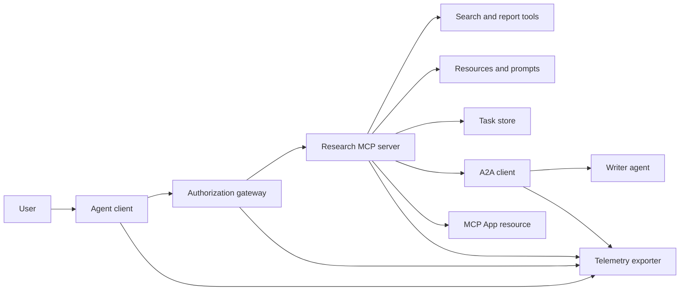
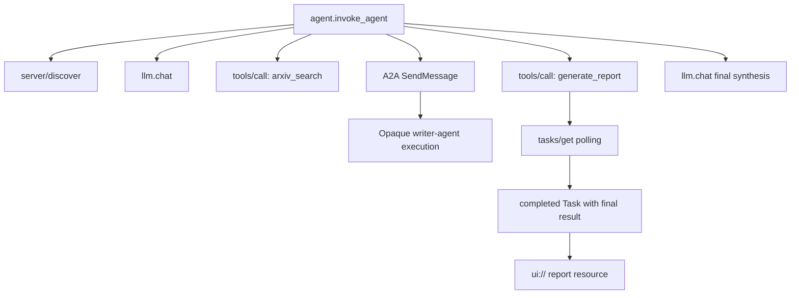
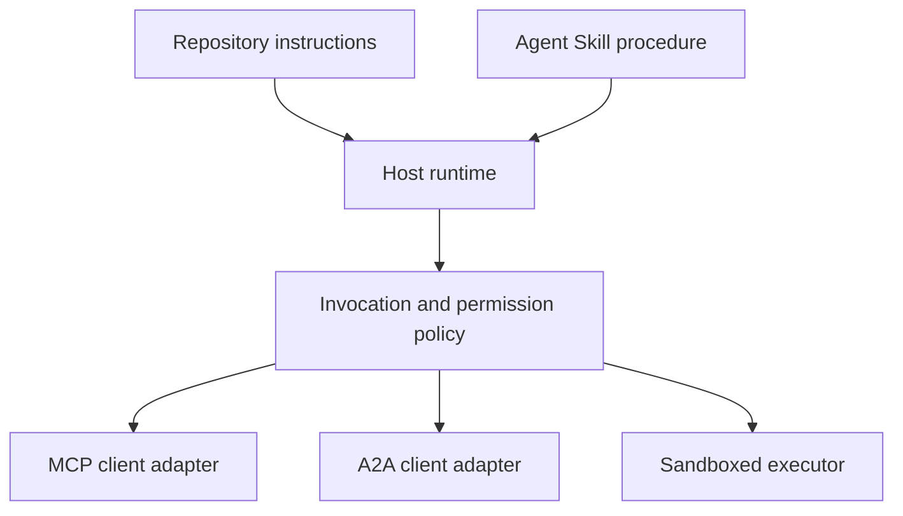

# Capstone: Ecossistema de Ferramentas Estatais

> Um sistema de agente de produção é um conjunto de limites, não uma pilha de características. Esta pedra final separa uma simulação leível em processo dos clientes de protocolo, servidor de autorização, caixa de areia e exportador de telemetria que uma implantação real ainda precisa.

**Type:** Build
**Languages:** Python (stdlib, in-process simulation)
**Prerequisites:** Phase 13 · 01 through 22, using MCP revision `2026-07-28`
**Time:** ~120 minutes

## Objetivos de aprendizagem

- Compõe chamadas de ferramentas, resultados em forma de tarefa, trabalho delegado, recursos da UI, política de autorização e rastrear registros em um único fluxo.
- Carregar versão de protocolo, identidade do cliente e recursos em cada solicitação de MCP em vez de confiar em uma sessão de conexão.
- Descubra um servidor antes de usar e execute um trabalho longo através da extensão oficial Tasks.
- Distinguir uma simulação em forma de protocolo de uma implementação de MCP, A2A, OAuth ou OpenTelemetry.
- Mapa de cada limite simulado para o componente de produção que deve substituí-lo.
- - Não .`AGENTS.md`, uma habilidade de agente, adaptadores de tempo de execução, ferramentas e políticas de segurança em seus papéis corretos.
- Explicar quais reivindicações podem ser verificadas a partir de resultados locais e quais precisam de testes de integração ao vivo.

## O problema

Desenhar um sistema de pesquisa e relatório. Um usuário pede documentos sobre protocolos de agente. O sistema pesquisa um catálogo de papel, delega resumo, gera um relatório, retorna um recurso de interface de usuário e registra o caminho através do sistema.

Essa sentença oculta vários contratos independentes:

- Um esquema de ferramentas orientado para um modelo;
- Um envelope de solicitação sem estado e um contrato de descoberta de servidores;
- Uma decisão de entrada para o atores, o âmbito e a identidade da ferramenta;
- um contrato de operação de longa duração;
- Um protocolo de delegação;
- Uma ponte entre o hospedeiro e a aplicação;
- Propagação e exportação de vestígios;
- um procedimento operacional reutilizável.

`code/main.py`Mantém esses limites visíveis com funções e dicionários Python comuns. Não abre um transporte, contata arXiv, executa OAuth, liga um servidor A2A, faz um MCP App, ou exporta telemetria. Isso torna o fluxo de controle fácil de inspecionar sem apresentar uma simulação como um serviço compatível.

## O conceito

### Arquitetura de alvo



A arquitetura é uma composição conceitual de padrões de protocolo público.

### Traço do alvo



Em uma implementação real, cada hop propaga o contexto de traços. Os nomes e atributos de espaços devem seguir as convenções semânticas OpenTelemetry suportadas pela versão de instrumentação escolhida. Um identificador de traços compartilhado sozinho não prova a parentagem correta, exportação ou ingestão de backend.

### Superfícies de protocolo atuais

Use os nomes de métodos definidos pelo protocolo atual, não os nomes lembrados de um esboço anterior:

| Boundary | Current surface | What the capstone simulates |
|---|---|---|
| MCP discovery | Mandatory `server/discover` | A direct function returning versions, capabilities, and server identity |
| MCP request context | Version, capabilities, and client identity in every `params._meta` | Fresh request metadata passed to every simulated call |
| MCP tool call | `tools/call` | Direct Python function dispatch |
| MCP task polling | `io.modelcontextprotocol/tasks` with `tasks/get` | A working handle followed by a completed task carrying its final result |
| A2A delegation | `SendMessage` in gRPC and JSON-RPC; `POST /message:send` in HTTP+JSON | One nested span with no remote call or artificial delay |
| MCP App calling a server tool | `app.callServerTool({ name, arguments })` | An HTML string with no live bridge |
| OAuth authorization | Authorization server, protected-resource metadata, audience and scope validation | Static token lookup and scope membership |
| OpenTelemetry | SDK, propagator, exporter, and collector or backend | In-memory span dictionaries |

Os nomes de protocolo são apenas a primeira camada. Os testes de produção devem exercer serialização, falhas de autenticação, cancelamento, temporadas, retries e compatibilidade de versões em todo o fio real.

### O MCP apátrida altera o limite de integração

Revisao `2026-07-28`elimina as sessões de protocolo e os`initialize`- Não .`notifications/initialized`Apertar a mão.`Mcp-Session-Id`Cada pedido tem estes espaços de nomes .`_meta`campos:

```json
{
  "io.modelcontextprotocol/protocolVersion": "2026-07-28",
  "io.modelcontextprotocol/clientCapabilities": {
    "extensions": {
      "io.modelcontextprotocol/tasks": {}
    }
  },
  "io.modelcontextprotocol/clientInfo": {
    "name": "capstone-client",
    "version": "1.0.0"
  }
}
```

O servidor deve implementar `server/discover`. Utilização de resultados ordinários `resultType: "complete"`• um manuseio de tarefas utiliza `resultType: "task"`Cada resultado deve identificar o servidor em `_meta.io.modelcontextprotocol/serverInfo`- Não .

A extensão da tarefa tem `tasks/get`- Não .`tasks/update`, e `tasks/cancel`Uma ferramenta pode voltar primeiro .`resultType: "task"`- O que é ?`tasks/get`Ele mesmo retorna .`resultType: "complete"`, e o concluído `Task`O resultado final é o antigo.`tasks/result`E ...`tasks/list`Os métodos não fazem parte da extensão actual.`io.modelcontextprotocol/tasks`O servidor retorna o seu servidor.`-32021`com`requiredCapabilities`Formada como o objeto de capacidade do cliente faltante, incluindo `extensions.io.modelcontextprotocol/tasks`- Não .

### Posição de segurança

A implantação prevista utiliza defesa em profundidade:

- Autorização de OAuth com PKCE, quando o tipo de cliente o requer;
- A vinculação de recursos e de público para os tokens de acesso emitidos;
- O gateway RBAC que verifica a ferramenta e o âmbito de aplicação solicitados;
- As credenciais upstream mantidas fora do contexto visível do modelo;
- Um manifesto de descrição das ferramentas, fixado ou revisto;
- Uma revisão da regra do segundo para entradas não confiáveis, dados sensíveis e ações consequentes;
- Uma caixa de arroz de execução cujo sistema de arquivos, processo, rede, credenciais e limites de recursos são aplicados fora da competência.

A demonstração implementa apenas tokens estáticos, verificações de alcance e hashes de descrição. É útil para o fluxo de políticas, não para a validação de segurança.

### As competências são procedimentos, não transportes

Um Agente de Habilidade pode dizer ao tempo de execução como executar o fluxo de trabalho de pesquisa, quais contratos de ferramentas esperar, quais evidências salvar e quando parar.



Envie o diretório completo de habilidades quando o procedimento faz referência a arquivos de acompanhamento. O artefato plano nesta pedra-chave mais antiga é um plano de curso, não prova de que um anfitrião preserva um pacote portátil.

### Metadados do artefato do curso é um adaptador local

O catálogo do curso e o instalador reconhecem arquivos planos com o nome `skill-*.md`A sua análise frontmatter mínima lê apenas chaves de nível superior. Esta lição mantém os campos de identidade portáteis e os campos de catálogo de curso no mesmo nível:

```yaml
---
name: ecosystem-blueprint
description: Produce a full Phase 13 ecosystem architecture for a product need.
version: "1.0.0"
phase: "13"
lesson: "23"
tags: [mcp, capstone, ecosystem, architecture, a2a, otel]
---
```

`name`E ...`description`são os campos de identidade portáteis. `version`- Não .`phase`- Não .`lesson`, e `tags`Os cursos de análise são necessários para a realização de um projeto de formação.`tags`como uma lista em linha assim `--tag capstone`- Não.

Uma habilidade de diretório portátil pode usar o opcional `metadata`Mapa para dados de extensão de valor de cadeia.`metadata`Se este arquivo plano anidar`version`ou `tags`abaixo `metadata`O parcer mínimo salta essas chaves em indentadas, o catálogo registra uma versão vazia e a filtragem de tags não pode encontrar o artefato.

### Simulação versus produção

| Layer | `code/main.py` | Production replacement | Required evidence |
|---|---|---|---|
| Discovery | `server_discover()` plus static `TOOLS` | `server/discover` followed by cache-aware `tools/list` | Wire transcript, deterministic order, and schema validation |
| Authentication | Token-keyed dictionary | OAuth authorization and resource server validation | Issuer, audience, scope, expiry, and failure tests |
| Authorization | Scope membership | Gateway policy bound to actor, tool, target, and tenant | Allow and deny audit cases |
| Search | Static paper fixtures | Search API or MCP server | Source provenance, ranking, and error tests |
| Tasks | Local handle plus immediate `tasks/get` | Durable `io.modelcontextprotocol/tasks` store with `tasks/get`, `tasks/update`, `tasks/cancel`, and TTL | State-transition, input, cancellation, and recovery tests |
| Delegation | Sleep plus nested span | A2A client and remote Agent Card | Contract, timeout, retry, and opacity tests |
| App | HTML string and URI | MCP Apps resource and `App` bridge | CSP, permissions, tool-call, and browser tests |
| Telemetry | In-memory list | OTel SDK and exporter | Collector receipt and trace-parent assertions |
| Sandbox | None | Host-enforced isolated executor | Escape, egress, secret, and resource-limit tests |

Esta tabela é o limite de transferência. Uma corrida local verde valida apenas a simulação.

### Mapa da fase 13

| Lessons | Contribution |
|---|---|
| 01-05 | Tool interfaces, calls, schemas, structured results, and deterministic validation |
| 06-14 | Stateless MCP request envelopes, discovery, transports, resources, prompts, extensions, and Apps |
| 15-18 | Poisoning defenses, OAuth, gateways, registries, and production authentication |
| 19 | A2A message and task delegation |
| 20 | OpenTelemetry GenAI trace design |
| 21 | Model-provider routing |
| 22 | Portable skill contract and runtime boundary |

```figure
t3-capstone-chain
```

## Construí-lo

- Descargar o arame em processo:

```bash
cd phases/13-tools-and-protocols/23-capstone-tool-ecosystem
python3 code/main.py
```

Inspectem cinco coisas:

1. `server/discover`publicita revisão `2026-07-28`e a extensão das tarefas.
2. Alice pode ler e gerar um relatório, enquanto a chamada escrita de Bob é negada.
3. Cada espaço local em uma corrida de orquestra compartilha um identificador de rastro e registra identificadores de espaço parental.
4. O relatório começa como um manual de tarefas. `tasks/get`Retorna uma tarefa concluída cujo resultado final contém texto e um `ui://`Referência.
5. O escritor delegado permanece opaco porque o orquestrador registra apenas o espaço de fronteira.
6. Nenhum resultado afirma que uma conexão de rede, troca de OAuth, exportação de colecionador, render do navegador ou execução de caixa de areia ocorreram.

O script é executado duas vezes, então produz dois traços raiz.

## Usá-lo

Promover uma camada por vez:

1. Substitui`server_discover()`e a lista de ferramentas estáticas com real `server/discover`E ...`tools/list`Enviar versão, identidade e recursos em cada pedido.
2. Substitua os tokens estáticos por um servidor de autorização e validação de recursos protegidos.
3. Implementar o `io.modelcontextprotocol/tasks`Extensão e ensaio `tasks/get`- Não .`tasks/update`- Não .`tasks/cancel`, tempo de espera, TTL e reinicialização da recuperação.`tasks/result`ou `tasks/list`- Não .
4. Substitua o bloco de delegação por um cliente A2A que resolve um cartão de agente e envia uma mensagem.
5. Construa o aplicativo com o SDK oficial e ligue para as ferramentas do servidor através de `app.callServerTool`- Não .
6. Exportação de comprimentos para um colector de ensaio e afirmação de parentesco no receptor.
7. Executa ferramenta e execução de script dentro do contrato da lição 26.
8. Envolva o procedimento como um conjunto completo de diretórios e passe o portão de liberação da lição 27.

Cada promoção precisa de um teste de integração que atravesse o novo limite.

## Envia-o

Esta lição produz`outputs/skill-ecosystem-blueprint.md`O arquivo de um arquivo de uma página que cobre primitividades, segurança, delegação, telemetria, embalagem e o risco operacional mais difícil.

Como não é um pacote de diretórios, não pode conter referências, scripts, ativos ou fixações de avaliação. Use o formato do pacote das lições 22 e 24 a 27 ao publicar uma habilidade reutilizável fora deste curso.

## Exercícios

1. Corra .`code/main.py`- Fatos separados comprovados pela produção das alegações de produção que ainda precisam de provas de integração.
2. Adicione um segundo backend estático e defina a regra de colisão para duas ferramentas com o mesmo nome.`tools/list`- Chamadas.
3. Substitua o material de escrita por um servidor de teste A2A. Grava o cartão do agente, a solicitação de mensagem, o caminho de tempo e o artefato devolvido.
4. Adicionar um armazém de tarefas que sobrevive a uma reinicialização do processo. Prove um cliente pode retomar com `tasks/get`, respeito .`pollIntervalMs`, e ler o resultado final da tarefa concluída sem `tasks/result`- Não .
5. Construa um aplicativo MCP mínimo e verifique `app.callServerTool`num navegador com um CSP restritivo e permissões explícitas.
6. Expor os intervalos simulados através de um SDK OTel para um coletor local.
7. Escreva .`AGENTS.md`Para as regras de manutenção de todo o repositório e para um pacote de competências separado para o procedimento de investigação reutilizável, explique por que nenhum dos ficheiros concede autoridade para a ferramenta.

## Termos-chave

| Term | What people say | What it actually means |
|---|---|---|
| Capstone | "Everything wired together" | A staged integration whose simulated and live boundaries remain explicit |
| Protocol-shaped simulation | "It is basically MCP" | Local data and calls that resemble a protocol without implementing its wire contract |
| Tasks extension | "Long tool call" | An optional `io.modelcontextprotocol/tasks` lifecycle with durable identity, polling, client input, final result, and cancellation semantics |
| Opacity boundary | "The other agent handles it" | The caller sees the declared interface and artifacts, not private reasoning or internal state |
| Runtime adapter | "Skill integration" | Host code that maps portable procedure to discovery, invocation, tools, policy, and context |
| Integration evidence | "It passed" | A transcript, artifact, or receiver-side observation proving the real boundary was crossed |

## Mais leitura

- [MCP specification 2026-07-28](https://modelcontextprotocol.io/specification/2026-07-28)para pedidos sem estado, descobertas, ferramentas, autorização e comportamento de transporte.
- [MCP 2026-07-28 key changes](https://modelcontextprotocol.io/specification/2026-07-28/changelog)Para a remoção de sessões, metadados por pedido, MRTR, extensões e deprecações.
- [MCP Tasks extension](https://tasks.extensions.modelcontextprotocol.io/specification/draft/tasks)Para`tasks/get`- Não .`tasks/update`- Não .`tasks/cancel`, e resultados finais realizados por tarefas terminais.
- [MCP Apps SDK](https://github.com/modelcontextprotocol/ext-apps/blob/main/docs/overview.md)Para`App`E ...`app.callServerTool`- Não .
- [A2A protocol](https://a2a-protocol.org/latest/)para os cartões de agente, entrega de mensagens, tarefas, artefatos e ligações de transporte.
- [OpenTelemetry GenAI semantic conventions](https://opentelemetry.io/docs/specs/semconv/gen-ai/)para convenções de rastreamento e atributo.
- [Agent Skills specification](https://agentskills.io/specification)Para o contrato de embalagem portátil utilizado pela camada processual.
