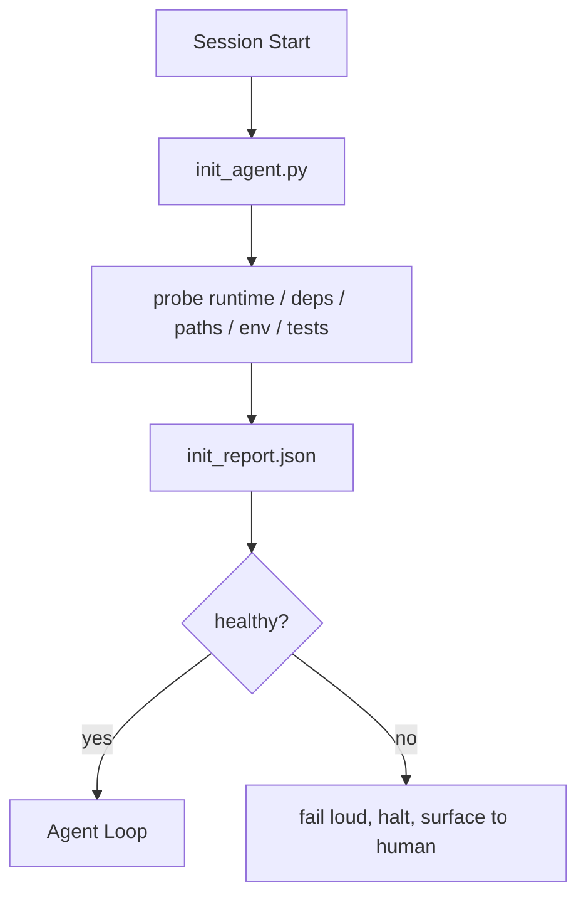

# Inicialização de Scripts para Agentes

> Cada sessão que começa a frio paga um imposto, o agente lê os mesmos ficheiros, retrata as mesmas sondas e redescobre os mesmos caminhos, um script init paga o imposto uma vez e escreve as respostas no estado.

**Type:** Build
**Languages:** Python (stdlib)
**Prerequisites:** Phase 14 · 32 (Minimal Workbench), Phase 14 · 34 (Repo Memory)
**Time:** ~45 minutes

## Objetivos de aprendizagem

- Identificar o trabalho que um agente nunca deve ter de fazer por sessão.
- Construir um script determinista de inicialização que analise o tempo de execução, dependências e saúde do repo.
- Persiste no resultado da sonda para que o agente o leia em vez de reexaminar.
- Falha alto, rápido e com um lugar para olhar quando a inicialização falha.

## O problema

Abra uma sessão. O agente adivinha a versão Python. Adivinha o comando de teste. Enumera a raiz repo cinco vezes para encontrar o ponto de entrada. Tenta importar um pacote que não está instalado. Pergunta ao usuário onde o arquivo de configuração mora. Quando ele faz uma edição real, dez mil tokens já foram para o trabalho de configuração que deveria ter sido um único script.

A correcção é um script de inicialização que é executado antes que o agente faça qualquer outra coisa e escreve um `init_report.json`O agente lê no startup.

## O conceito



### O que o script init sondas

| Probe | Why it matters |
|-------|----------------|
| Runtime versions | Wrong Python or Node version means silent wrong-version bugs |
| Dependency availability | A missing package later costs ten times the cost of catching it now |
| Test command | The agent must know how to verify; if the command is missing the workbench is broken |
| Repo paths | Hard-coded paths drift; resolve them once and pin |
| Environment variables | Missing `OPENAI_API_KEY` is a failure surface, not a runtime mystery |
| State + board freshness | Stale state from a crashed session is a footgun |
| Last-known-good commit | Anchor for the handoff diff at the end of the session |

### Falhar alto, falhar rápido, falhar em um só lugar

Uma falha da sonda significa parar e surgir para o humano. Não "o agente vai descobrir".

### Idempotente

A segunda volta deve ser um no-op exceto para um novo tempo. Idempotency é o que permite que você conectar o script para CI, ganchos, ou um comando de pré-tarefa.

### Init versus regras de inicialização

Regras (Fase 14 · 33) descrevem o que deve ser verdadeiro para agir. Init é o script que estabelece que essas regras podem ser verificadas. Regras sem init se tornam "cuidado". Init sem regras se torna um fracasso polido.

```figure
wb-init-probes
```

## Construí-lo

`code/main.py`Implementos `init_agent.py`- Não .

- Cinco sondas: versão Python, dependências listadas via `importlib.util.find_spec`, resolubilidade de comando de teste, exigência de ambiente, estado de arquivo de frescura.
- Cada sonda volta .`(name, status, detail)`- Não .
- O roteiro diz:`init_report.json`com a sonda completa definida e sai de zero se qualquer sonda de gravidade de bloco falhar.

- É o que é ?

```
python3 code/main.py
```

O roteiro imprime a tabela de sondas, escreve.`init_report.json`, e sai de zero no caminho feliz ou não-zero com uma lista de sondas falhadas.

## Padrões de produção em silêncio

Três padrões separam um script de iniciação útil de uma cerimônia.

**Last-known-good commit anchoring.**Verificar o compromisso corrente contra um `LKG`Se a diferença exceder um orçamento (arquivos padrão 50), recusar a inicialização e exigir que um humano ratifique a nova linha de base. É o que a AI Code Review da Cloudflare usa para abranger os agentes de revisão: cada sessão de revisão ancora contra o mesmo último conhecido-bom e nunca compostos drift entre sessões.

**Lock files with TTL.**Escreva um`prereqs.lock`O script init lê o bloqueio primeiro; se for fresco e o hash do manifesto de dependência coincide, ele corta-circuitos. Este é o mesmo padrão que o Docker usa para cache de camadas: sonda idempotent + hash de conteúdo = skip.

**No network, no LLM, no surprises in the hot path.**Uma sonda que chama um LLM para classificar uma falha ou que atinge um serviço externo para verificar uma licença não é uma sonda; é um fluxo de trabalho. Se uma sonda demora mais de três segundos em uma execução seca, trate isso como um cheiro de banco de trabalho e ou o mude do init ou cache seu resultado.

## Usá-lo

Em produção:

- **Claude Code hooks.** `pre-task`O gancho chama o script do init e recusa-se a lançar o agente se falhar.
- **GitHub Actions.**A.`setup-agent`O trabalho executa o script init; o trabalho do agente depende dele.
- **Docker entrypoint.**O contêiner do agente executa o script init antes de executar o tempo de execução do agente; faz registros na superfície em falha.

O script init é portátil porque não faz chamadas a um framework específico. Bash, Make ou um arquivo de tarefas podem enrolar tudo.

## Envia-o

`outputs/skill-init-script.md`Entrevista o projecto, classifica os trabalhos de instalação em sondas e emite um projecto específico `init_agent.py`Mais um fluxo de trabalho de informação que o executa antes de qualquer passo do agente.

## Exercícios

1. Adicione uma sonda que diferencie o compromisso atual contra o compromisso de última vez conhecido e se recuse a iniciar se mais de 50 arquivos forem alterados.
2. Enviar o roteiro para escrever um `prereqs.lock`- o processo de envio e a recusa de iniciar se a fechadura tiver mais de sete dias.
3. Adicionar um`--fix`bandeira que instala automaticamente dependências de desenvolvimento faltantes mas nunca modifica dependências de tempo de execução sem aprovação.
4. Mover as sondas de funções codificadas para um registo YAML.
5. Uma sonda que dure mais de três segundos é um cheiro de banco de trabalho.

## Termos-chave

| Term | What people say | What it actually means |
|------|----------------|------------------------|
| Probe | "A check" | A deterministic function returning `(name, status, detail)` |
| Init report | "Setup output" | JSON written next to state with the probe results |
| Idempotent | "Safe to re-run" | Two runs in a row produce identical reports modulo timestamp |
| Fail loud | "Don't swallow" | Halt and surface to the human; no silent fallback |
| Setup tax | "Bootstrap cost" | The tokens the agent spends per session rediscovering the obvious |

## Mais leitura

- [Anthropic, Effective harnesses for long-running agents](https://www.anthropic.com/engineering/effective-harnesses-for-long-running-agents)
- [GitHub Actions, composite actions for setup](https://docs.github.com/en/actions/sharing-automations/creating-actions/creating-a-composite-action)
- [microservices.io, GenAI dev platform: guardrails](https://microservices.io/post/architecture/2026/03/09/genai-development-platform-part-1-development-guardrails.html) Pre-compromissos + verificações de CI como init
- [Augment Code, How to Build Your AGENTS.md (2026)](https://www.augmentcode.com/guides/how-to-build-agents-md) expectativas iniciais
- [Codex Blog, Codex CLI Context Compaction](https://codex.danielvaughan.com/2026/03/31/codex-cli-context-compaction-architecture/) sessão começa como compactação consciente init
- Fase 14 · 33  a regra definida neste script permite
- Fase 14 · 34  o arquivo do estado este script sementes
- Fase 14 · 38  o gate de verificação o script init alimenta
- Fase 14 · 40  a transferência que consome o último bem conhecido do relatório init
